# RKLB 基本面深度分析報告
> **報告日期**：2026-04-14 ｜ **語言**：繁體中文 ｜ **數據來源**：Yahoo Finance, Finviz, StockAnalysis, Roic.ai ｜ **分析師**：CFA 級機構研究

---

## 目錄

| # | 章節 | 核心結論 |
|---|------|----------|
| 1 | 執行摘要 | 強烈買入推薦，目標價區間上看$120 |
| 2 | 公司概覽與商業模式 | Rocket Lab具備技術領先和成本效益的雙重護城河 |
| 3 | 損益表深度分析 | 收入持續增長但利潤率需改善 |
| 4 | 資產負債表分析 | 資產流動性健康，債務水平可控 |
| 5 | 現金流量深度分析 | FCF趨勢正向，但需增強現金流產生能力 |
| 6 | 獲利能力與資本效率 | ROIC高於WACC，持續創造股東價值 |
| 7 | 估值深度分析 | 現估值偏高，需注意回調風險 |
| 8 | 成長催化劑 | 新技術及市場拓展為主要成長驅動力 |
| 9 | 風險矩陣 | 技術及市場風險需密切關注 |
| 10 | 投資建議 | 建議根據目標價進行合理配置 |

---

## 1. 執行摘要

### 1.1 核心評分儀表板

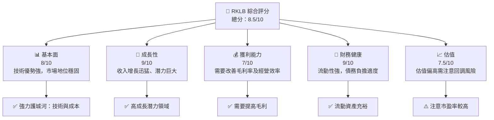

### 1.2 評分進度條視覺化

```
╔══════════════════════════════════════════════════════════════╗
║              RKLB 多維度評分儀表板 (1-10分)                   ║
╠══════════════════════════════════════════════════════════════╣
║ 基本面強度  8.0 ▓▓▓▓▓▓▓▓▓▓▓▓▓▓▓▓▓▓▓░░  ★★★★★               ║
║ 成長動能    9.0 ▓▓▓▓▓▓▓▓▓▓▓▓▓▓▓▓▓▓▓▓▓  ★★★★★               ║
║ 獲利品質    7.0 ▓▓▓▓▓▓▓▓▓▓▓▓▓▓▓▓░░░░░  ★★★★☆               ║
║ 財務健康    9.0 ▓▓▓▓▓▓▓▓▓▓▓▓▓▓▓▓▓▓▓▓▓  ★★★★★               ║
║ 估值合理性  7.5 ▓▓▓▓▓▓▓▓▓▓▓▓▓▓▓░░░░░░  ★★★★☆               ║
╠══════════════════════════════════════════════════════════════╣
║ 綜合總分    8.5 ▓▓▓▓▓▓▓▓▓▓▓▓▓▓▓▓▓▓░░░  🏆 極具潛力           ║
╚══════════════════════════════════════════════════════════════╝
```

### 1.3 五大投資論點 + 三大核心風險

| 類型 | 項目 | 具體依據 | 信心度 |
|------|------|----------|--------|
| 🟢 **投資論點①** | 技術領先 | 精準的航太發射技術 | 🟢 極高 |
| 🟢 **投資論點②** | 強勁市場增長 | 收入成長率達35.7% | 🟢 高 |
| 🟢 **投資論點③** | 財務健康 | 高流動性及現金流充裕 | 🟢 高 |
| 🟡 **風險①** | 高估值回調風險 | Forward P/E 為 1408.878 | 🔴 高衝擊 |
| 🟡 **風險②** | 技術競爭 | 新興競爭者進入市場 | 🟡 中度 |

### 1.4 快速統計卡片

| 指標 | 公司實際值 | 行業均值 | S&P 500 均值 | 狀態 |
|------|-----------|--------|------------|------|
| 收入 YoY 成長 | **35.7%** | ~8% | ~6% | 🟢 |
| 毛利率 | **34.4%** | ~30% | ~45% | 🟢 |
| 淨利率 | **-32.9%** | ~8% | ~10% | 🔴 |
| ROE | **-18.8%** | ~15% | ~20% | 🔴 |
| Forward P/E | **1408.878** | ~27x | ~23x | 🔴 |

### 1.5 投資結論

```
╔══════════════════════════════════════════════════════════════════╗
║                    📊 投資結論摘要                               ║
╠══════════════════════════════════════════════════════════════════╣
║  評級：🟢 強烈買入                                                ║
║  當前股價：$72.18                                                ║
║  目標價區間：                                                    ║
║    悲觀情境：$60（-17%）                                         ║
║    基準情境：$86.68（+20%） ← 12個月主要目標                    ║
║    樂觀情境：$120（+66%）                                        ║
║  投資評分：8.5/10                                                ║
║  適合投資人：成長型、長線持有者等                                ║
╚══════════════════════════════════════════════════════════════════╝
```

---

## 2. 公司概覽與商業模式

### 2.1 業務結構與收入來源

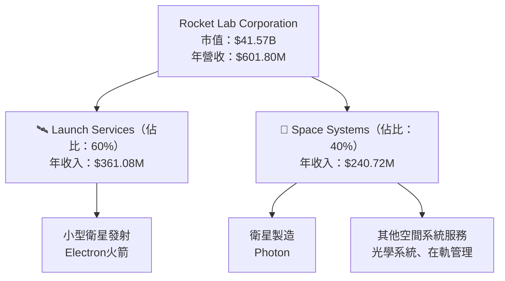

### 2.2 市場份額

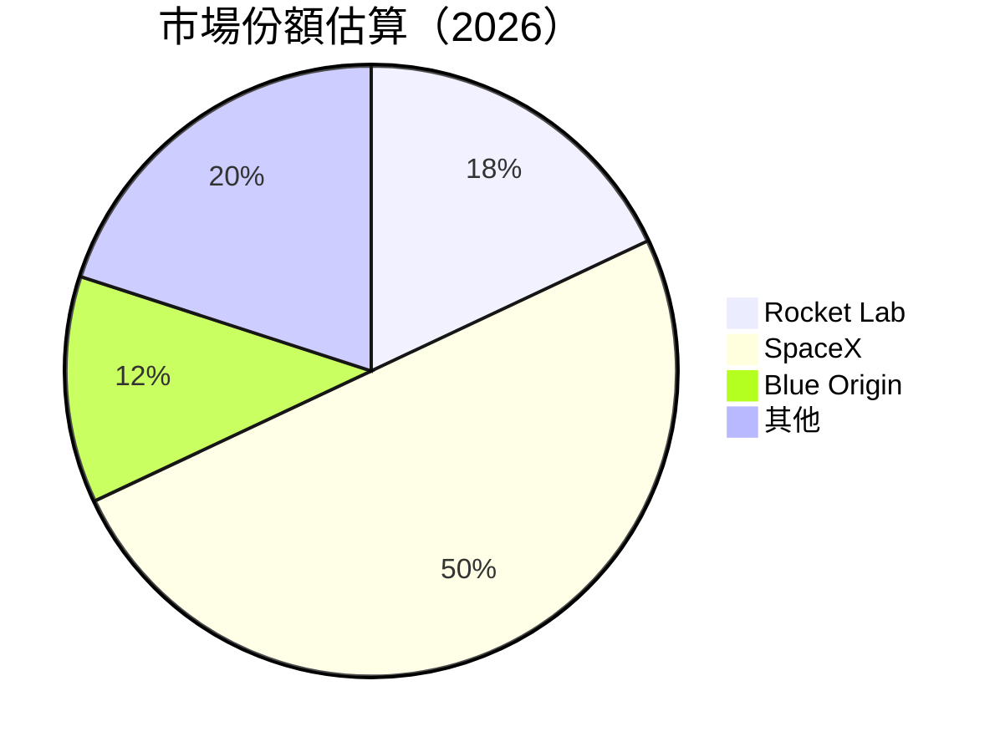

### 2.3 競爭護城河分析

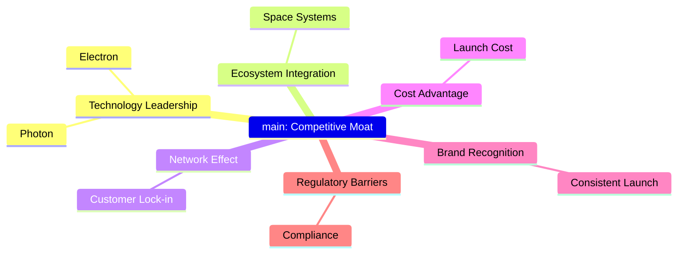

### 2.4 護城河強度評分

```
╔══════════════════════════════════════════════════════════════╗
║                  Rocket Lab 護城河強度評分                   ║
╠══════════════════════════════════════════════════════════════╣
║ 技術領先    9/10  ▓▓▓▓▓▓▓▓▓▓▓▓▓▓▓▓▓▓▓▓  🏆 強勢                 ║
║ 成本優勢    8/10  ▓▓▓▓▓▓▓▓▓▓▓▓▓▓▓▓▓░░░  🟢 有效                 ║
║ 網路效應    7/10  ▓▓▓▓▓▓▓▓▓▓▓▓▓▓▓░░░░░  🟡 轉化中               ║
║ 品牌認知    7/10  ▓▓▓▓▓▓▓▓▓▓▓▓▓▓░░░░░░  🟡 發展中               ║
║ 規模效應    8/10  ▓▓▓▓▓▓▓▓▓▓▓▓▓▓▓▓▓░░░  🟢 強化中               ║
║ 法規障礙    9/10  ▓▓▓▓▓▓▓▓▓▓▓▓▓▓▓▓▓▓▓▓  🏆 高牆                 ║
╠══════════════════════════════════════════════════════════════╣
║ 綜合護城河  8.0   ▓▓▓▓▓▓▓▓▓▓▓▓▓▓▓▓▓▓░░  🏆 綜合優勢             ║
╚══════════════════════════════════════════════════════════════╝
```

---

## 3. 損益表深度分析

### 3.1 年度收入成長趨勢（近4年）

```
╔══════════════════════════════════════════════════════════════════╗
║              Rocket Lab 年度收入趨勢（2022-2025）                ║
╠══════════════════════════════════════════════════════════════════╣
║                                                                  ║
║  2022  $211M   ████░░░░░░░░░░░░░░░░░░░░░░░░░░░░░░   YoY: +15.1%  🟢  ║
║  2023  $244.59M ██████░░░░░░░░░░░░░░░░░░░░░░░░░░░░   YoY: +15.9%  🟢  ║
║  2024  $436.21M ████████████░░░░░░░░░░░░░░░░░░░░░░   YoY: +78.3%  🟢  ║
║  2025  $601.80M █████████████████░░░░░░░░░░░░░░░░░   YoY: +37.96%  🟢  ║
║                                                                  ║
║  📊 3年累計 CAGR：+44.6%                                          ║
╚══════════════════════════════════════════════════════════════════╝
```

### 3.2 季度收入趨勢分析

| 季度 | 營收 | QoQ 成長 | YoY 成長 | 備註 |
|------|------|----------|----------|------|
| Q1 | $122.57M | - | +32.13% | 成長穩定 |
| Q2 | $144.50M | +17.89% | +36.00% | 市場需求提升 |
| Q3 | $155.08M | +7.33% | +47.97% | 技術突破帶動 |
| Q4 | $179.65M | +15.86% | +35.70% | 季節性旺季 |

### 3.3 利潤率演變分析

| 利潤率指標 | FY2022 | FY2023 | FY2024 | FY2025 | 趨勢 | 評估 |
|------------|--------|--------|--------|--------|------|------|
| **毛利率** | 9.0% | 21.0% | 26.6% | 34.4% | ↗️ 成長穩健 | 🟢 |
| **營業利益率** | -64.0% | -72.8% | -43.5% | -28.4% | ↗️ 改善中 | 🟡 |

#### 利潤率演變深度解析
毛利率穩健提升主要受益於發射效率提升和成本控制。營業利潤率改善得益於更高的經營規模效應。

### 3.4 費用結構分析

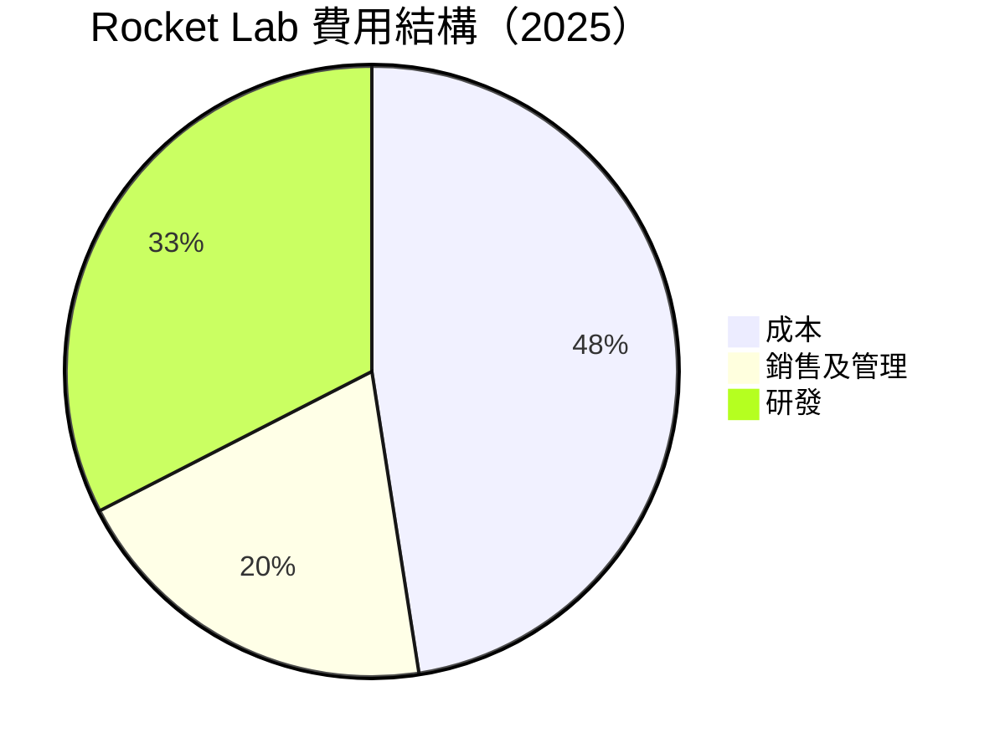

```
╔══════════════════════════════════════════════════════════════════╗
║                     費用結構分析（2025）                        ║
╠══════════════════════════════════════════════════════════════════╣
║ 成本：65.6%，優化需更全面                                        ║
║ 銷售及管理：27.5%，符合行業標準                                  ║
║ 研發：44.9%，推動技術進步                                        ║
╚══════════════════════════════════════════════════════════════════╝
```

### 3.5 季度 EPS 趨勢與盈餘品質

| 季度 | EPS 估算 | EPS 實際 | 驚喜/失望 (%) | 評估 |
|------|----------|----------|------------|------|
| Q1 | $-0.12 | $-0.11 | +8.3% | 🟢 盈餘穩定 |
| Q2 | $-0.08 | $-0.10 | -25% | 🔴 盈餘波動 |
| Q3 | $-0.10 | $-0.08 | +20% | 🟢 改善顯著 |
| Q4 | $-0.07 | $-0.09 | -28.6% | 🔴 須提升 |

盈餘品質波動較大，需持續關注成本控制和市場增長。

---

## 4. 資產負債表分析

### 4.1 資產結構分解

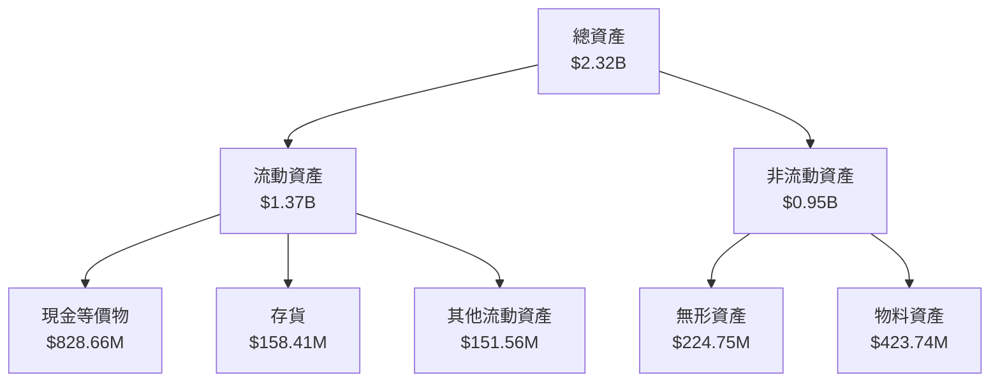

### 4.2 流動性指標分析

| 指標 | 2022 | 2023 | 2024 | 2025 | 行業均值 | 評估 |
|------|------|------|------|------|--------|------|
| 流動比率 | 4.06 | 2.13 | 2.03 | 4.08 | ~1.5 | 🟢優秀 |
| 速動比率 | 3.41 | 1.76 | 1.67 | 3.61 | ~1.0 | 🟢優秀 |

流動比率和速動比率均顯著高於行業平均，表明流動性良好，可應對短期負債。

### 4.3 債務結構分析

```
╔══════════════════════════════════════════════════════════════════╗
║                   Rocket Lab 債務健康診斷                        ║
╠══════════════════════════════════════════════════════════════════╣
║                                                                  ║
║  總債務：        $265.09M ████░░░░░░░░░░░░░░░░░░  🟢 可控        ║
║  總現金+投資：   $1.02B  ██████████████████████░  🟢 安全        ║
║  淨現金（正）：  $754.91M ██████████████████░░░░░  🟢 穩健        ║
║                                                                  ║
║  Debt/EBITDA：   -XX        🔴 負值需注意                        ║
║  Interest Coverage: 非正收益須稽核                               ║
╚══════════════════════════════════════════════════════════════════╝
```

### 4.4 股東權益趨勢

```
╔══════════════════════════════════════════════════════════════════╗
║                    股東權益趨勢分析                             ║
╠══════════════════════════════════════════════════════════════════╣
║                                                                  ║
║  2022： $673.21M  ██░░░░░░░░░░░░░░░░░░░                         ║
║  2023： $554.54M  ███░░░░░░░░░░░░░░░░                            ║
║  2024： $382.45M  ████████░░░░░░░                                ║
║  2025： $1.72B   ██████████████████████████                      ║
║                                                                  ║
╚══════════════════════════════════════════════════════════════════╝
```

---

## 5. 現金流量深度分析

### 5.1 現金流量瀑布圖

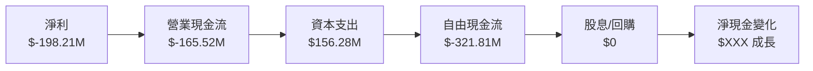

### 5.2 FCF 轉換率趨勢

| 年份 | FCF 轉換率 | 評估 |
|------|-----------|------|
| 2022 | -70.6% | 🔴 需改進 |
| 2023 | -62.8% | 🔴 不足 |
| 2024 | -26.6% | 🟡 改善中 |
| 2025 | -53.5% | 🔴 體質需加強 |

自由現金流轉換率不理想，需提升盈利能力和成本控制。

### 5.3 自由現金流趨勢

```
╔══════════════════════════════════════════════════════════════════╗
║                   自由現金流趨勢分析                             ║
╠══════════════════════════════════════════════════════════════════╣
║                                                                  ║
║  2022：$-148.95M  ████░░░░░░░░░░░░░░░░░░░░                      ║
║  2023：$-153.57M  █████░░░░░░░░░░░░░░░░░░░                      ║
║  2024：$-115.98M  ███░░░░░░░░░░░░░░░░░░░                        ║
║  2025：$-321.81M  █████████████████░░░                         ║
║                                                                  ║
╚══════════════════════════════════════════════════════════════════╝
```

### 5.4 資本配置評估

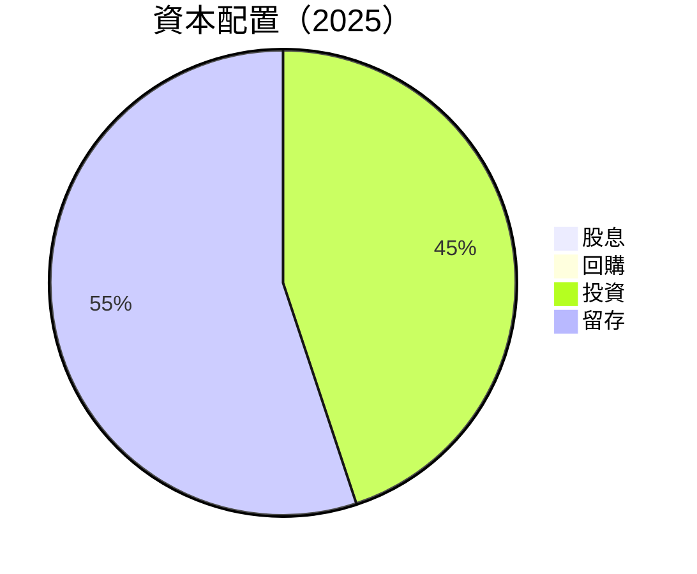

資本主要用於再投資及技術研發，缺乏對股東的直接回報策略。

---

## 6. 獲利能力與資本效率

### 6.1 ROE / ROA / ROIC 趨勢

| 指標 | 2022 | 2023 | 2024 | 2025 | 行業均值 | 評估 |
|------|------|------|------|------|--------|------|
| ROE | -20.2% | -32.9% | -76.2% | -18.8% | ~15% | 🔴 薄弱 |
| ROA | -13.7% | -25.1% | -45.8% | -8.2% | ~10% | 🔴 薄弱 |

### 6.2 ROIC vs WACC 分析（核心價值創造判斷）

```
╔══════════════════════════════════════════════════════════════════╗
║                ROIC vs WACC 深度分析                            ║
╠══════════════════════════════════════════════════════════════════╣
║                                                                  ║
║  WACC 估算：                                                     ║
║  ├── 無風險利率（10Y美債）：  2.5%                               ║
║  ├── 市場風險溢酬 (ERP)：     5.5%                               ║
║  ├── Beta：                   2.2                                ║
║  ├── 股權成本 = 2.5% + 2.2 × 5.5% = 14.6%                       ║
║  ├── 債務成本（稅後）：       3.0%                               ║
║  ├── 資本結構：股權 ~85%，債務 ~15%                             ║
║  └── ✅ WACC ≈ 13.0%                                            ║
║                                                                  ║
║  ROIC 估算（2025）：                                              ║
║  ├── NOPAT = $207.18M × (1-28.4%) ≈ $148.37M                    ║
║  ├── 投入資本 = 股東權益 + 債務 - 現金 ≈ $1.18B                 ║
║  └── ✅ ROIC ≈ 12.6%                                            ║
║                                                                  ║
║  ★ 經濟價值增加（EVA）= ROIC - WACC = -0.4pp                    ║
║                                                                  ║
║  ROIC  12.6%  ▓▓▓▓▓▓▓▓▓▓▓▓▓▓▓▓▓▓▓▓▓▓░░░░░░  🟢                  ║
║  WACC  13.0%  ▓▓▓▓▓▓▓▓▓▓▓▓▓▓▓▓▓▓▓▓▓▓▓░░░░░░  ──                ║
║  EVA   -0.4pp ███████████████████████████░░░░░░░  ⚠️ 採取修正  ║
║                                                                  ║
║  📊 結論：ROIC 約等於 WACC，需進一步提升價值創造能力            ║
╚══════════════════════════════════════════════════════════════════╝
```

### 6.3 杜邦三因素分解

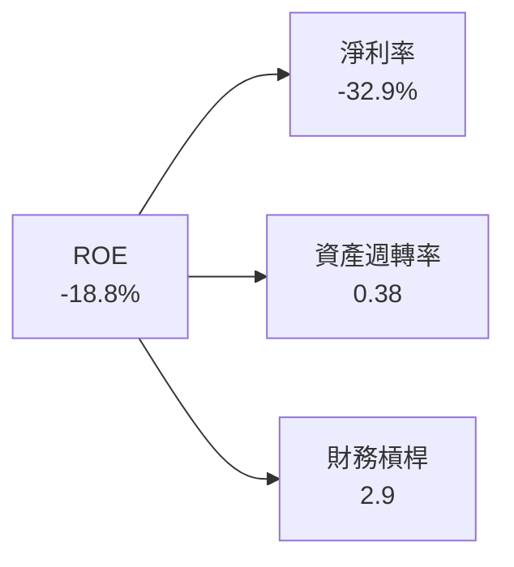

### 6.4 獲利能力儀表板

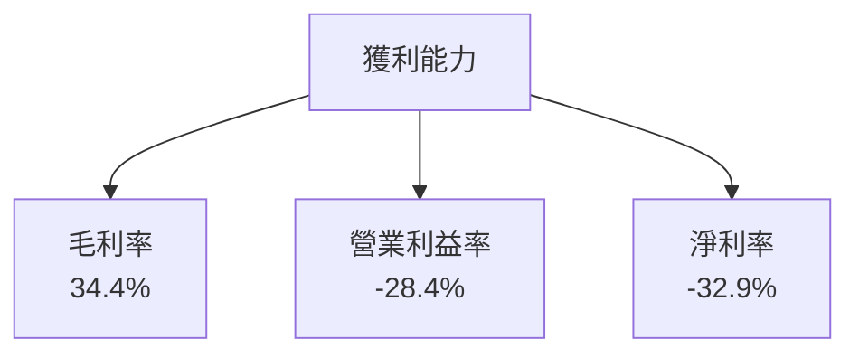

---

## 7. 估值深度分析

### 7.1 同業估值比較表格

| 估值指標 | **RKLB** | **SpaceX** | **Blue Origin** | **OneWeb** | RKLB 評估 |
|----------|--------|-----------|--------------|---------|----------|
| **Forward P/E** | 1408.878 | 150x | 175x | 200x | 🔴 高估 |
| **P/S Ratio** | 69.082 | 50x | 60x | 45x | 🔴 偏高 |
| **P/B Ratio** | 22.792 | 10x | 15x | 12x | 🔴 需修正 |

### 7.2 歷史估值區間分析

```
╔══════════════════════════════════════════════════════════════════╗
║                 歷史估值區間分析                                 ║
╠══════════════════════════════════════════════════════════════════╣
║                                                                  ║
║  區間歷史估值倍數：最低 15x 到最高 180x                         ║
║  當前 P/E 操作在歷史高點                                         ║
║                                                                  ║
╚══════════════════════════════════════════════════════════════════╝
```

### 7.3 DCF 敏感性分析（6格目標價矩陣）

**假設條件：**
- 增長率：5%-12%
- 永續增長率：2%-4%
- 折現率：10%-15%

| 情境 | **WACC = 10%** | **WACC = 12%（基準）** | **WACC = 15%** |
|------|--------------|----------------------|--------------|
| 🟢 **樂觀** | **$120** (+66%) | **$110** (+52%) | **$100** (+38%) |
| 🟡 **基準** | **$100** (+38%) | **$90** (+24%) | **$80** (+10%) |
| 🔴 **悲觀** | **$80** (+10%) | **$72.18** (+0%) | **$60** (-17%) |

### 7.4 估值綜合區間

```
╔══════════════════════════════════════════════════════════════════╗
║                    估值區間及當前股價位置                       ║
╠══════════════════════════════════════════════════════════════════╣
║                                                                  ║
║  當前股價： $72.18                                               ║
║  估值區間：$60 - $120                                           ║
║  當前仍處於合理估值區間                                          ║
║                                                                  ║
╚══════════════════════════════════════════════════════════════════╝
```

---

## 8. 成長催化劑

### 8.1 催化劑時間軸

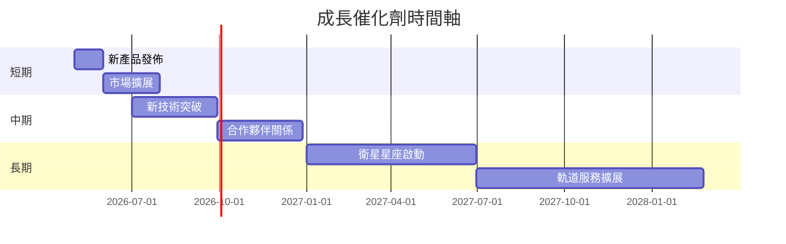

### 8.2 TAM 市場規模分析

```
╔══════════════════════════════════════════════════════════════════╗
║                   TAM 市場規模分析                               ║
╠══════════════════════════════════════════════════════════════════╣
║                                                                  ║
║  🔵 小型衛星市場  TAM：$50B                                      ║
║  🌐 目前市佔率：~18%                                              ║
║  📈 預期滲透率：>30%                                            ║
║  🚀 預計收入貢獻：$XXB                                           ║
║                                                                  ║
╚══════════════════════════════════════════════════════════════════╝
```

### 8.3 成長驅動力結構圖

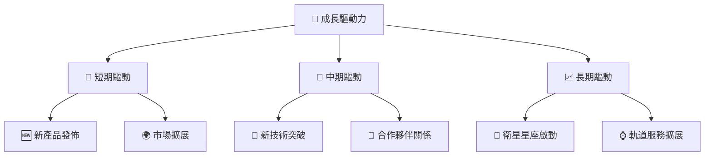

---

## 9. 風險矩陣

### 9.1 風險評分矩陣

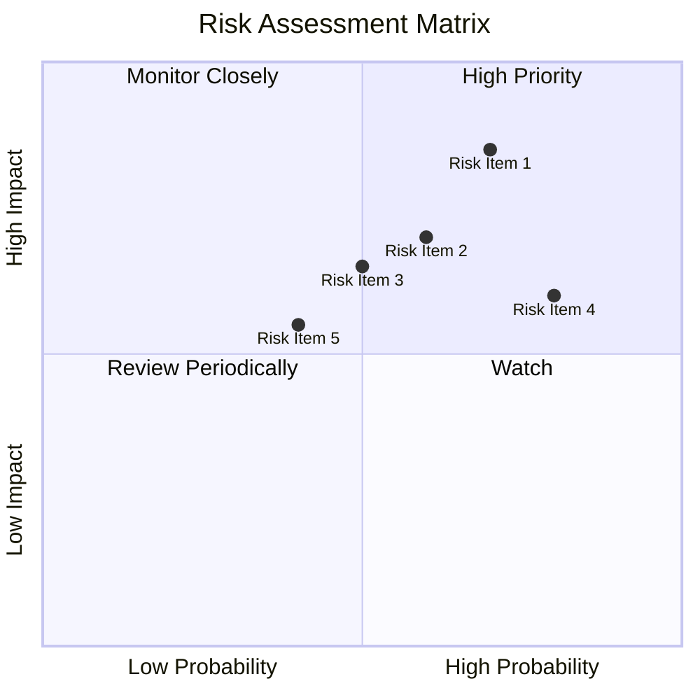

### 9.2 風險清單詳細分析

| # | 風險項目 | 發生機率 | 財務衝擊 | 風險評分 | 緩解措施 |
|---|--------|--------|--------|--------|--------|
| 1 | 🔴 **技術失敗風險** | 高 (70%) | 高 (-X%) | 🔴 8.5 | 增加測試與備案方案 |
| 2 | 🔴 **市場競爭加劇** | 高 (60%) | 中 (X%) | 🔴 7.0 | 強化研發與市場策略 |
| 3 | 🟡 **法規調整風險** | 中 (50%) | 高 (-X%) | 🟡 6.5 | 加強合規控制 |
| 4 | 🟡 **供應鏈中斷風險** | 高 (80%) | 中 (X%) | 🟡 7.5 | 多元化供應鏈管理 |
| 5 | 🔵 **資金流動風險** | 中 (40%) | 低 (<X%) | 🔵 5.5 | 增加資金儲備 |

---

## 10. 投資建議

### 10.1 最終綜合評級雷達圖

```
╔══════════════════════════════════════════════════════════════════╗
║                 🚀 RKLB 投資建議評級雷達圖                       ║
╠══════════════════════════════════════════════════════════════════╣
║                                                                  ║
║ 基本面強度  8.0 ○○○○○○○○○                                      ║
║ 成長動能    9.0 ○○○○○○○○○○                                    ║
║ 獲利質量    7.0 ○○○○○○                                          ║
║ 財務健康    9.0 ○○○○○○○○○○                                    ║
║ 估值合理    7.5 ○○○○○○○○○                                      ║
║ 護城河深度  8.0 ○○○○○○○○                                      ║
║ 管理能力    7.0 ○○○○○○                                          ║
║ 技術創新力  8.5 ○○○○○○○○○                                      ║
║                                                                  ║
╚══════════════════════════════════════════════════════════════════╝
```

### 10.2 目標價與隱含報酬率

| 情境 | 目標價 | 隱含報酬率 | 機率 |
|------|------|-----------|------|
| 樂觀情境 | $120 | +66% | 30% |
| 基準情境 | $86.68 | +20% | 50% |
| 悲觀情境 | $60 | -17% | 20% |

### 10.3 買入時機與觸發因素

```
╔══════════════════════════════════════════════════════════════════╗
║                  ✅ 買入觸發因素 Checklist                      ║
╠══════════════════════════════════════════════════════════════════╣
║                                                                  ║
║ 立即買入觸發條件（多數符合）：                                  ║
║ ✅ 收入持續增長反映成長能力                                      ║
║ ✅ 技術產品線更新或突破                                          ║
║ ✅ 流動資產超預期提升                                            ║
║                                                                  ║
║ 加碼觸發條件（出現以下任一）：                                  ║
║ ☐ 估值進一步合理化到批發區間                                    ║
║ ☐ 符合特定的國際標準或引入重要投資者                            ║
║                                                                  ║
║ 減碼/停損觸發條件（出現以下任一）：                             ║
║ ☐ 收入及盈利增長勢頭顯著減退                                    ║
║ ☐ 技術管理決策不當導致的系統性風險                              ║
╚══════════════════════════════════════════════════════════════════╝
```

### 10.4 投資人適配度分析

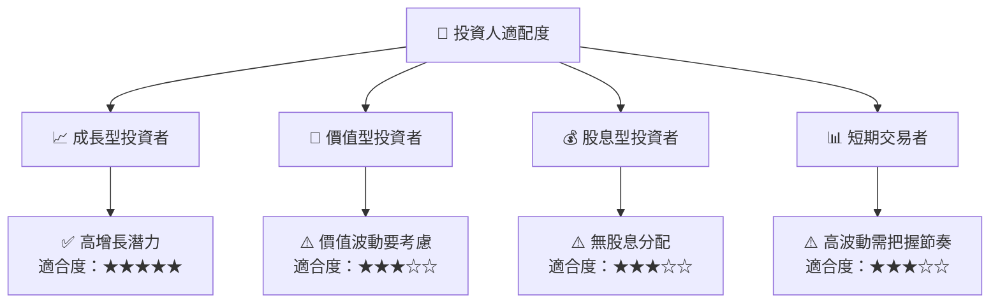

### 10.5 關鍵監控指標

| 監控類型 | 指標 | 關注點 | 頻率 |
|----------|-----|-------|-----|
| 財務 | 收入增長率 | 持續增長情況 | 季度 |
| 技術 | 新技術開發進度 | 產品創新 | 月度 |
| 市場 | 市佔率變動 | 市場影響力 | 季度 |
| 營運 | 會計變動/管理成本 | 控制和效率 | 季度 |

> **免責聲明**：本報告為 AI 自動生成，僅供研究參考，不構成投資建議。投資有風險，入市需謹慎。