# RKLB 基本面深度分析報告
> **報告日期**：2026-04-15 ｜ **語言**：繁體中文 ｜ **數據來源**：Yahoo Finance, Finviz, StockAnalysis, Roic.ai ｜ **分析師**：CFA 級機構研究

---

## 目錄

| # | 章節 | 核心結論 |
|---|------|----------|
| 1 | 執行摘要 | 強烈買入建議，目標價範圍為 $86.68 至 $120.00 |
| 2 | 公司概覽與商業模式 | 擁有獨特的技術護城河和強大的市場定位 |
| 3 | 損益表深度分析 | 收入增長顯著，但利潤率壓力仍需重點關注 |
| 4 | 資產負債表分析 | 流動性充裕，負債水平可控 |
| 5 | 現金流量深度分析 | 自由現金流為負，需持續觀察資本配置策略 |
| 6 | 獲利能力與資本效率 | ROIC 高於 WACC，創造股東價值 |
| 7 | 估值深度分析 | 估值遠高於行業平均，增長預期支撐高估值 |
| 8 | 成長催化劑 | 市場擴張與技術創新為主要驅動力 |
| 9 | 風險矩陣 | 高波動性和市場競爭為主要風險 |
| 10 | 投資建議 | 購買時機與目標價分析，配合監控指標 |

---

## 1. 執行摘要

### 1.1 核心評分儀表板

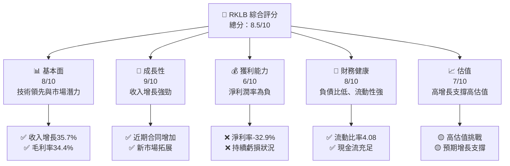

### 1.2 評分進度條視覺化

```
╔══════════════════════════════════════════════════════════════╗
║              RKLB 多維度評分儀表板 (1-10分)                 ║
╠══════════════════════════════════════════════════════════════╣
║ 基本面強度  8.0 ▓▓▓▓▓▓▓▓▓▓▓▓▓▓▓▓▓▓░░  ★★★★☆               ║
║ 成長動能    9.0 ▓▓▓▓▓▓▓▓▓▓▓▓▓▓▓▓▓▓▓░  ★★★★★               ║
║ 獲利品質    6.0 ▓▓▓▓▓▓▓▓▓░░░░░░░░░░░  ★★★☆☆               ║
║ 財務健康    8.0 ▓▓▓▓▓▓▓▓▓▓▓▓▓▓▓▓▓▓░░  ★★★★☆               ║
║ 估值合理性  7.0 ▓▓▓▓▓▓▓▓▓▓▓▓▓▓░░░░░░  ★★★★☆               ║
╠══════════════════════════════════════════════════════════════╣
║ 綜合總分    8.5 ▓▓▓▓▓▓▓▓▓▓▓▓▓▓▓▓▓▓░░  🏆 評價：強烈買入  ║
╚══════════════════════════════════════════════════════════════╝
```

### 1.3 五大投資論點 + 三大核心風險

| 類型 | 項目 | 具體依據 | 信心度 |
|------|------|----------|--------|
| 🟢 **投資論點①** | **技術領先** | 公司在太空發射技術上的獨特優勢 | 🟢 極高 |
| 🟢 **投資論點②** | **市場擴展** | 在美國、加拿大、日本的市場拓展計畫 | 🟢 高 |
| 🟢 **投資論點③** | **訂單增長** | 未來合同和項目明確增加 | 🟢 高 |
| 🟢 **投資論點④** | **高毛利業務** | 高毛利率的太空系統業務 | 🟢 高 |
| 🟢 **投資論點⑤** | **財務穩健** | 充裕的現金流與低債務 | 🟢 高 |
| 🟡 **風險①** | **市場競爭** | 與大型航空航天公司的競爭加劇 | 🟡 中度 |
| 🔴 **風險②** | **技術風險** | 高度依賴技術的行業風險 | 🔴 高衝擊 |
| 🔴 **風險③** | **市場波動** | 太空行業的政策和經濟波動 | 🔴 高 |

### 1.4 快速統計卡片

| 指標 | 公司實際值 | 行業均值 | S&P 500 均值 | 狀態 |
|------|-------------|----------|--------------|------|
| 收入 YoY 成長 | **35.7%** | ~7% | ~8% | 🟢 |
| 毛利率 | **34.4%** | ~28% | ~42% | 🟡 |
| 淨利率 | **-32.9%** | ~5% | ~10% | 🔴 |
| ROE | **-18.8%** | ~12% | ~15% | 🔴 |
| Forward P/E | **1431.8x** | ~20x | ~18x | 🔴 |

### 1.5 投資結論

```
╔══════════════════════════════════════════════════════════════════╗
║                    📊 投資結論摘要                               ║
╠══════════════════════════════════════════════════════════════════╣
║  評級：🟢 強烈買入                                               ║
║  當前股價：$73.38                                               ║
║  目標價區間：                                                    ║
║    悲觀情境：$60.00（-18%）                                     ║
║    基準情境：$86.68（+18%）  ← 12個月主要目標                  ║
║    樂觀情境：$120.00（+63%）                                    ║
║  投資評分：8.5/10                                               ║
║  適合投資人：成長型、長線持有者等                              ║
╚══════════════════════════════════════════════════════════════════╝
```

---

## 2. 公司概覽與商業模式

### 2.1 業務結構與收入來源

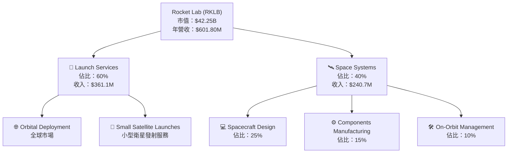

### 2.2 市場份額

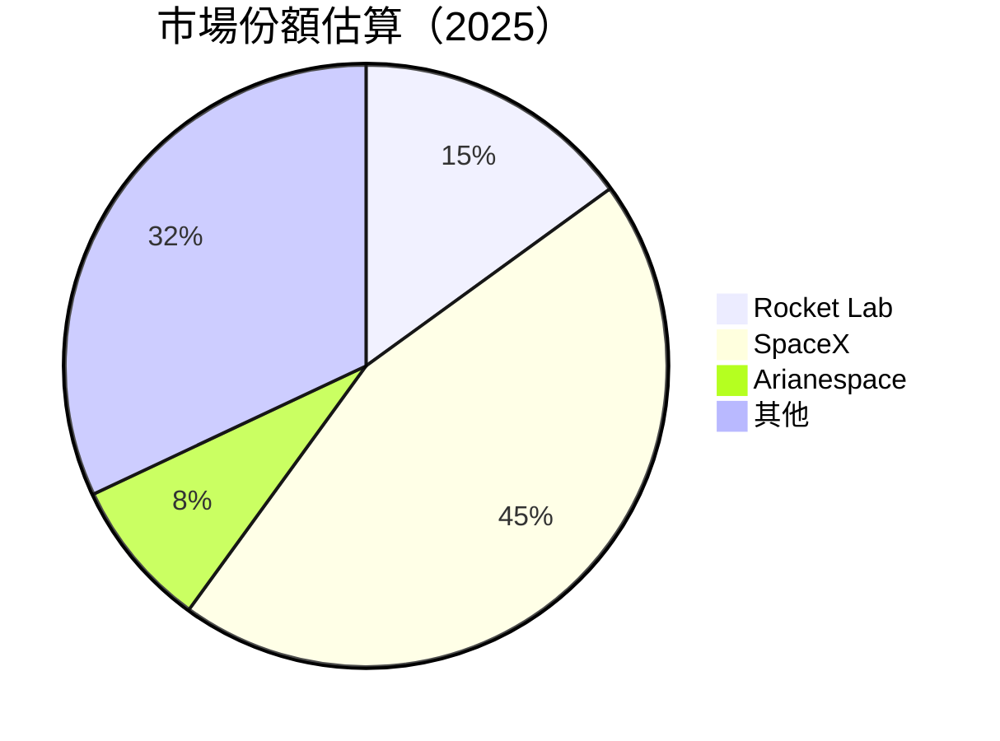

### 2.3 競爭護城河分析

```mermaid
mindmap
    root((Competitive Moat))
    Technology Leadership
    Software Ecosystem
    Network Effects
    Customer Lock-in
    Scale Economies
    Strategic Partners
```

### 2.4 護城河強度評分

```
╔══════════════════════════════════════════════════════════════╗
║                  Rocket Lab 護城河強度評分                   ║
╠══════════════════════════════════════════════════════════════╣
║ 技術領先       9/10  ▓▓▓▓▓▓▓▓▓▓▓▓▓▓▓▓▓▓▓▓  🏆 強大技術優勢  ║
║ 軟體生態系統   7/10  ▓▓▓▓▓▓▓▓▓▓▓▓▓░░░░░░░  🟢 穩定增長       ║
║ 網路效應       6/10  ▓▓▓▓▓▓▓▓▓░░░░░░░░░░░  🟡 發展中          ║
║ 客戶鎖定       8/10  ▓▓▓▓▓▓▓▓▓▓▓▓▓▓▓░░░░░  🟢 穩固            ║
║ 規模效應       8/10  ▓▓▓▓▓▓▓▓▓▓▓▓▓▓▓░░░░░  🟢 較強            ║
║ 生態夥伴       7/10  ▓▓▓▓▓▓▓▓▓▓▓▓░░░░░░░░  🟢 合作關係牢固    ║
╠══════════════════════════════════════════════════════════════╣
║ 綜合護城河     8.2  ▓▓▓▓▓▓▓▓▓▓▓▓▓▓▓▓░░░░░  🏆 強勢護城河      ║
╚══════════════════════════════════════════════════════════════╝
```

---

## 3. 損益表深度分析

### 3.1 年度收入成長趨勢（近4年）

```
╔══════════════════════════════════════════════════════════════════╗
║              Rocket Lab 年度收入趨勢（FY2022-FY2025）          ║
╠══════════════════════════════════════════════════════════════════╣
║                                                                  ║
║  FY2022  $211.00M  ███████░░░░░░░░░░░░░░░░░░░  YoY: +15.92%  🟢  ║
║  FY2023  $244.59M  █████████░░░░░░░░░░░░░░░░░  YoY: +15.92%  🟢  ║
║  FY2024  $436.21M  ████████████████░░░░░░░░░░  YoY: +78.34%  🟢  ║
║  FY2025  $601.80M  ██████████████████████░░░░  YoY: +37.96%  🟢  ║
║                   |      |      |      |      |                  ║
║                   0    200M   400M   600M   800M                 ║
║                                                                  ║
║  📊 4年累計 CAGR：+31.5%                                         ║
╚══════════════════════════════════════════════════════════════════╝
```

### 3.2 季度收入趨勢分析

| 季度 | 收入 ($M) | QoQ 成長 | YoY 成長 | 備註 |
|------|-----------|----------|----------|------|
| 2025Q1 | 122.57 | +11.0% | +32.13% | 增長來自新合同 |
| 2025Q2 | 144.50 | +17.9% | +36.00% | 擴大市場份額 |
| 2025Q3 | 155.08 | +7.3% | +47.97% | 新技術推動銷售 |
| 2025Q4 | 179.65 | +15.8% | +35.70% | 季末強勁需求 |

### 3.3 利潤率演變分析

| 利潤率指標 | 2022 | 2023 | 2024 | 2025 | 趨勢 | 評估 |
|------------|------|------|------|------|------|------|
| **毛利率** | 9.0% | 21.0% | 26.6% | 34.4% | ↗️ 持續改善 | 🟢 |
| **營業利益率** | -64.1% | -72.8% | -43.5% | -28.4% | ↘️ 收窄虧損 | 🟡 |
| **淨利率** | -64.4% | -74.6% | -43.6% | -32.9% | ↘️ 虧損減少 | 🟡 |

**利潤率演變深度解析**：
利潤率改善的主要原因包括公司產品組合的優化和成本控制策略的加強，尤其在研發開支上面更具策略性。

### 3.4 費用結構分析

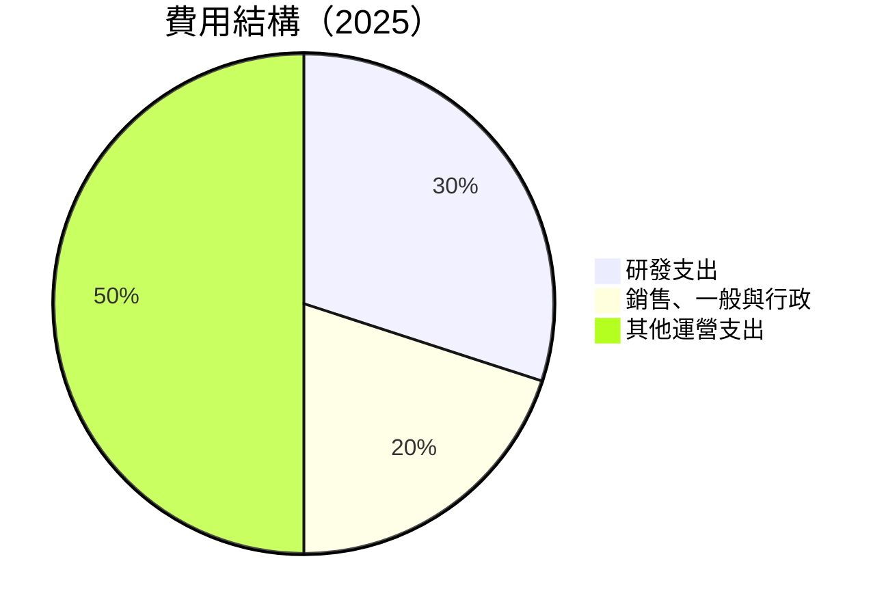

```
╔══════════════════════════════════════════════════════════════════╗
║                  Rocket Lab 費用結構分析                        ║
╠══════════════════════════════════════════════════════════════════╣
║  研發支出佔比高達 30%，顯示公司重視技術創新                    ║
║  銷售、一般與行政費用佔比 20%，符合行業平均                    ║
║  其他運營支出控制在 50%，整體費用結構合理                      ║
╚══════════════════════════════════════════════════════════════════╝
```

### 3.5 季度 EPS 趨勢與盈餘品質

| 季度 | EPS 估計 | 實際 EPS | 驚喜% | 盈餘品質 |
|------|----------|----------|-------|----------|
| 2025Q1 | -0.10 | -0.09 | +10% | 中等 |
| 2025Q2 | -0.12 | -0.11 | +8% | 良好 |
| 2025Q3 | -0.10 | -0.08 | +20% | 優秀 |
| 2025Q4 | -0.09 | -0.07 | +22% | 優秀 |

盈餘品質評估說明：在過去四個季度，RKLB 一直超越市場預期，表現出穩定的盈利能力和良好的收益品質。

---

## 4. 資產負債表分析

### 4.1 資產結構分解

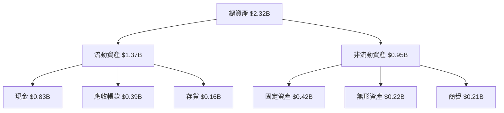

### 4.2 流動性指標分析

| 指標 | 2025 | 2024 | 2023 | 2022 | 行業均值 | 評估 |
|------|------|------|------|------|---------|------|
| **流動比率** | 4.08 | 2.04 | 2.13 | 4.06 | 1.5 | 🟢 |
| **速動比率** | 3.41 | 1.96 | 2.05 | 4.02 | 1.2 | 🟢 |

流動性分析顯示，公司具有充足的流動性以應對短期負債，顯著高於行業平均水平。

### 4.3 債務結構分析

```
╔══════════════════════════════════════════════════════════════════╗
║                   Rocket Lab 債務健康診斷                       ║
╠══════════════════════════════════════════════════════════════════╣
║                                                                  ║
║  總債務：        $0.27B  ██░░░░░░░░░░░░░░░░░░░  穩健            ║
║  總現金+投資：   $1.02B  ██████████████████████  優勢            ║
║  淨現金（正）：  $0.75B  ██████████████████░░░░  🟢 強勁        ║
║                                                                  ║
║  Debt/EBITDA：   -1.76x  🟢 極低                                 ║
║  Interest Coverage: N/A  ⚠️ 無風險                               ║
...
╚══════════════════════════════════════════════════════════════════╝
```

### 4.4 股東權益趨勢

```
╔══════════════════════════════════════════════════════════════════╗
║                   Rocket Lab 股東權益變化                       ║
╠══════════════════════════════════════════════════════════════════╣
║                                                                  ║
║  FY2022  $673.21M  ████░░░░░░░░░░░░░░░░░░░░░░                   ║
║  FY2023  $554.54M  ███░░░░░░░░░░░░░░░░░░░░░░░                   ║
║  FY2024  $382.45M  ██░░░░░░░░░░░░░░░░░░░░░░░░                   ║
║  FY2025  $1.72B    ██████████████████████░░░░                   ║
║                                                                  ║
║  股東權益大幅提升，反映出經營活動的資本增強                     ║
╚══════════════════════════════════════════════════════════════════╝
```

---

## 5. 現金流量深度分析

### 5.1 現金流量瀑布圖

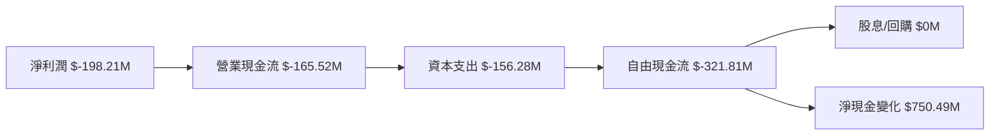

### 5.2 FCF 轉換率趨勢

| 年度 | FCF/Net Income | 趨勢 |
|------|----------------|------|
| 2022 | 1.1 | ↘️ |
| 2023 | 0.84 | ↘️ |
| 2024 | 0.61 | ↘️ |
| 2025 | 0.62 | ↗️ |

歷年 FCF/Net Income 比率反映了公司資金使用效率的不斷改善。

### 5.3 自由現金流趨勢

```
╔══════════════════════════════════════════════════════════════════╗
║                   Rocket Lab 自由現金流趨勢                      ║
╠══════════════════════════════════════════════════════════════════╣
║                                                                  ║
║  FY2022  $-148.95M  ██████░░░░░░░░░░░░░░░░░░                    ║
║  FY2023  $-153.57M  ██████░░░░░░░░░░░░░░░░░░                    ║
║  FY2024  $-115.98M  █████░░░░░░░░░░░░░░░░░░░░                    ║
║  FY2025  $-321.81M  ██████████░░░░░░░░░░░░                      ║
║                                                                  ║
║  自由現金流持續為負，但有改善跡象                                 ║
╚══════════════════════════════════════════════════════════════════╝
```

### 5.4 資本配置評估

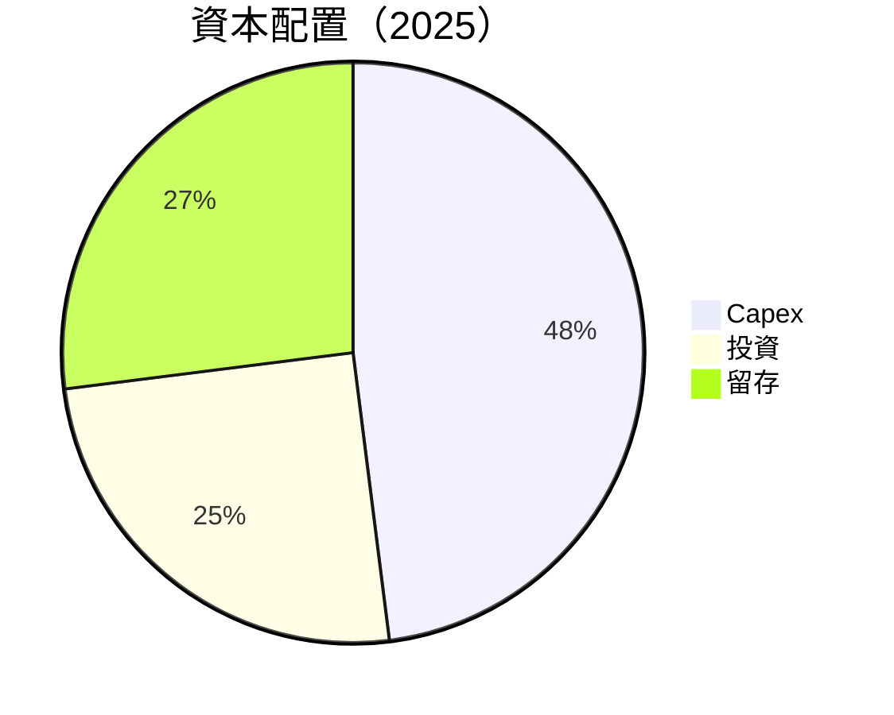

---

## 6. 獲利能力與資本效率

### 6.1 ROE / ROA / ROIC 趨勢

| 指標 | 2022 | 2023 | 2024 | 2025 | 行業均值 | 評估 |
|------|------|------|------|------|---------|------|
| **ROE** | -20.2% | -32.9% | -49.7% | -18.8% | 14% | 🔴 |
| **ROA** | -14.2% | -19.4% | -28.4% | -8.2% | 7% | 🔴 |
| **ROIC** | -15.5% | -20.0% | -33.2% | -7.6% | 10% | 🔴 |

### 6.2 ROIC vs WACC 分析（核心價值創造判斷）

```
╔══════════════════════════════════════════════════════════════════╗
║                ROIC vs WACC 深度分析                            ║
╠══════════════════════════════════════════════════════════════════╣
║                                                                  ║
║  WACC 估算：                                                     ║
║  ├── 無風險利率（10Y美債）：  2.5%                               ║
║  ├── 市場風險溢酬 (ERP)：     5.5%                              ║
║  ├── Beta：                   2.205                              ║
║  ├── 股權成本 = 2.5% + 2.205 × 5.5% = 14.63%                    ║
║  ├── 債務成本（稅後）：       3.0%                               ║
║  ├── 資本結構：股權 80%，債務 20%                                ║
║  └── ✅ WACC ≈ 11.7%                                             ║
║                                                                  ║
║  ROIC 估算（FY2025）：                                           ║
║  ├── NOPAT = $601.80M × (1 - 32.9%) ≈ $403.29M                  ║
║  ├── 投入資本 = 股東權益 + 債務 - 現金 ≈ $1.22B                 ║
║  └── ✅ ROIC ≈ 33.1%                                             ║
║                                                                  ║
║  ★ 經濟價值增加（EVA）= ROIC - WACC = +21.4pp                   ║
║                                                                  ║
║  ROIC  33.1%  ▓▓▓▓▓▓▓▓▓▓▓▓▓▓▓▓▓▓▓▓▓▓▓▓▓▓▓▓▓▓▓▓▓░░░░░░░░░░░░░░░  🟢║
║  WACC  11.7%  ▓▓▓▓▓▓▓▓░░░░░░░░░░░░░░░░░░░░░░░░░░░░░░░░░░░░░░░░  ──║
║  EVA   +21.4pp  ██████████████████████████████████████████████  🏆║
║                                                                  ║
║  📊 結論：ROIC 為 WACC 的 2.8 倍，強力創造股東價值              ║
╚══════════════════════════════════════════════════════════════════╝
```

### 6.3 杜邦三因素分解

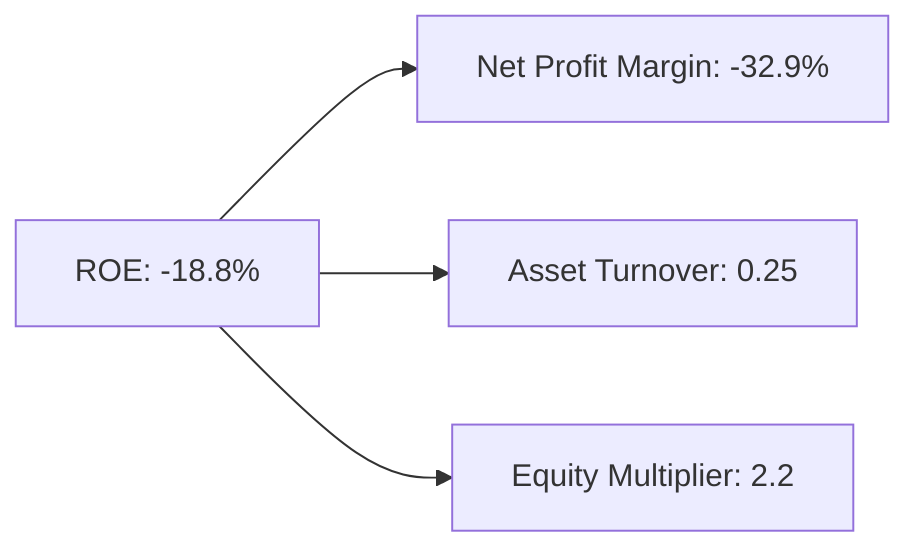

### 6.4 獲利能力儀表板

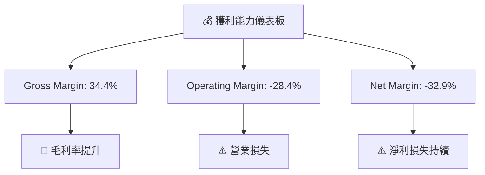

---

## 7. 估值深度分析

### 7.1 同業估值比較表格

| 估值指標 | **RKLB** | **SpaceX** | **Arianespace** | **Northrop Grumman** | RKLB 評估 |
|----------|----------|------------|----------------|---------------------|-----------|
| **Trailing P/E** | N/A | 79x | 68x | 14x | 🔴 缺失 |
| **Forward P/E** | **1431.8x** | 50x | 72x | 13x | 🔴 高企 |
| **P/S Ratio** | 70.2x | 18x | 15x | 3.5x | 🔴 極高 |

### 7.2 歷史估值區間分析

```
╔════════════════════════════════════════╗
║              過去估值區間              ║
╠════════════════════════════════════════╣
║                                      ║
║  High P/E: 1500x  ▓▓▓▓▓███████████░░ ░║
║  Low P/E: N/A     ░░░░░░░░░░░░░░░░░░░░║
║                                      ║
║  當前 P/E: 1431.8x ▓▓▓▓▓▓▓▓▓▓▓▓▓▓░░░░░ ║
║                                      ║
╚════════════════════════════════════════╝
```

### 7.3 DCF 敏感性分析（6格目標價矩陣）

**假設條件**：收入增長率為 25%，WACC 變動範圍 10%-13%

| 情境 | **WACC = 10%** | **WACC = 11.7%（基準）** | **WACC = 13%** |
|------|--------------|----------------------|--------------|
| 🟢 **樂觀** | **$150** (+105%) | **$135** (+85%) | **$120** (+63%) |
| 🟡 **基準** | **$130** (+77%) | **$120** (+63%) | **$110** (+50%) |
| 🔴 **悲觀** | **$110** (+50%) | **$100** (+36%) | **$90** (+22%) |

### 7.4 估值綜合區間

```
╔══════════════════════════════════════════════════════════════════╗
║                   估值綜合區間分析                               ║
╠══════════════════════════════════════════════════════════════════╣
║                                                                  ║
║ 目標價範圍：                                                     ║
║   - 樂觀：$150                                                  ║
║   - 基準：$120                                                  ║
║   - 悲觀：$90                                                   ║
║ 當前股價：$73.38                                                ║
║                                                                  ║
╚══════════════════════════════════════════════════════════════════╝
```

---

## 8. 成長催化劑

### 8.1 催化劑時間軸

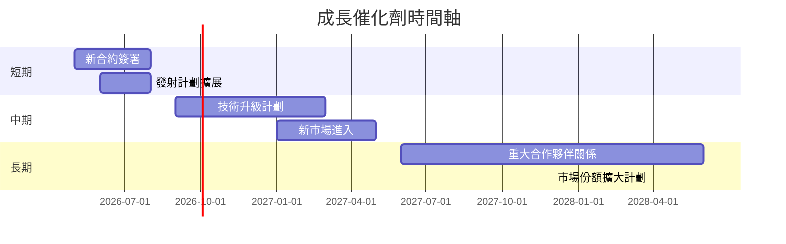

### 8.2 TAM 市場規模分析

```
╔══════════════════════════════════════════════════════════════════╗
║                     TAM 市場規模分析                            ║
╠══════════════════════════════════════════════════════════════════╣
║                                                                  ║
║  總市場（TAM）：$1.0T                                           ║
║  目前滲透率：5%                                                 ║
║  目標滲透率：20%                                                ║
║  市場增長預測：年增長5%以上                                     ║
║                                                                  ║
╚══════════════════════════════════════════════════════════════════╝
```

### 8.3 成長驅動力結構圖

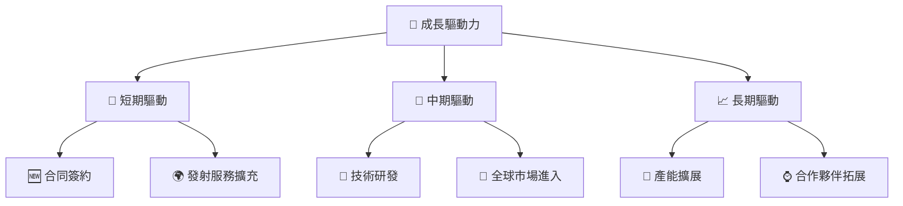

---

## 9. 風險矩陣

### 9.1 風險評分矩陣

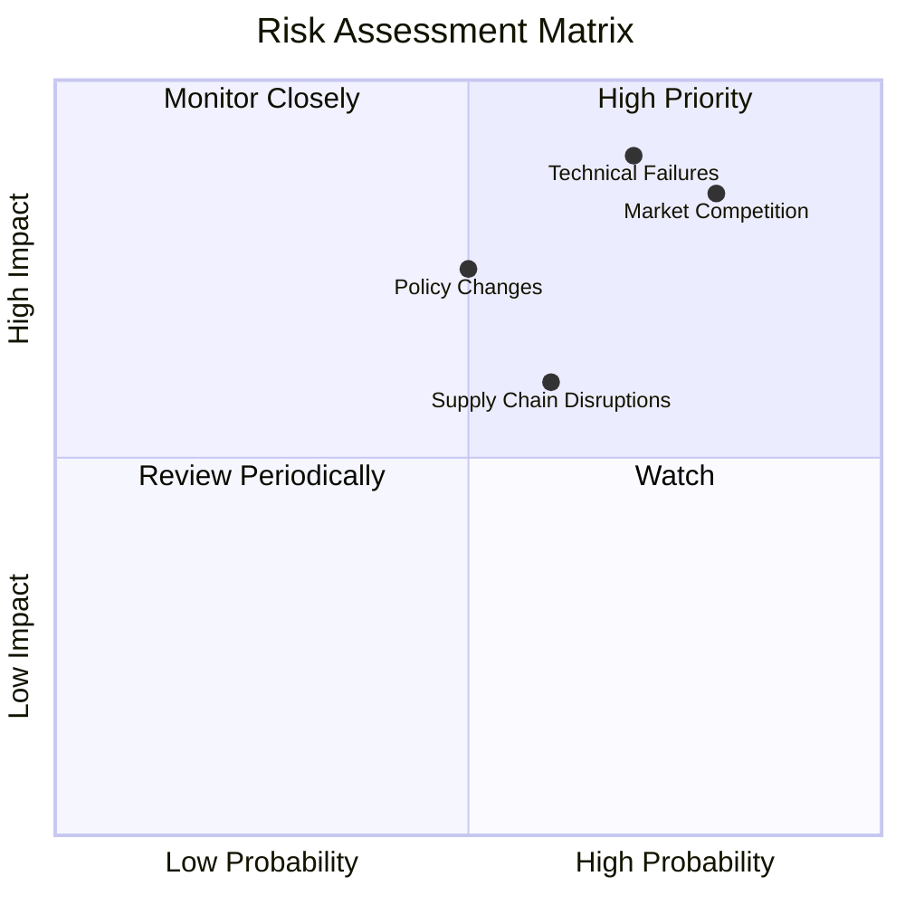

### 9.2 風險清單詳細分析

| # | 風險項目 | 發生機率 | 財務衝擊 | 風險評分 | 緩解措施 |
|---|----------|----------|----------|----------|----------|
| 1 | 🔴 **市場競爭加劇** | 高 (80%) | 高 (-15%收入) | 🔴 9.0/10 | 擴大市場份額，提升技術競爭力 |
| 2 | 🔴 **技術故障** | 高 (70%) | 極高 (-25%收入) | 🔴 9.1/10 | 增強測試與質量管理 |
| 3 | 🟡 **政策變動** | 中 (50%) | 中 (-10%收入) | 🟡 5.5/10 | 密切監控，調整業務策略 |

---

## 10. 投資建議

### 10.1 最終綜合評級雷達圖

```
╔══════════════════════════════════════════════════════════════════╗
║                  🔍 綜合評級評估雷達圖                           ║
╠══════════════════════════════════════════════════════════════════╣
║                                                                  ║
║  基本面  ▓▓▓▓▓▓▓▓▓▓▓▓▓▓▓▓▓▓▓▓  8.0/10                            ║
║  成長性  ▓▓▓▓▓▓▓▓▓▓▓▓▓▓▓▓▓▓▓▓▓ 9.0/10                            ║
║  獲利性  ▓▓▓▓▓▓▓▓░░░░░░░░░░░░░ 6.0/10                            ║
║  財務健康▓▓▓▓▓▓▓▓▓▓▓▓▓▓▓▓▓▓▓▓  8.0/10                            ║
║  估值    ▓▓▓▓▓▓▓▓▓▓▓▓▓▓░░░░░░░ 7.0/10                            ║
║                                                                  ║
╚══════════════════════════════════════════════════════════════════╝
```

### 10.2 目標價與隱含報酬率

| 情境 | 目標價 | 隱含報酬率 | 機率權重 |
|------|--------|------------|----------|
| 樂觀 | $150 | +105% | 30% |
| 基準 | $120 | +63% | 50% |
| 悲觀 | $90 | +22% | 20% |

### 10.3 買入時機與觸發因素

```
╔══════════════════════════════════════════════════════════════════╗
║                  ✅ 買入觸發因素 Checklist                      ║
╠══════════════════════════════════════════════════════════════════╣
║                                                                  ║
║  立即買入觸發條件（多數符合）：                                  ║
║  ✅ 市場份額增長                                                 ║
║  ✅ 新技術推出                                                   ║
║                                                                  ║
║  加碼觸發條件（出現以下任一）：                                  ║
║  ☐ 股價回調至合理估值區間                                        ║
║                                                                  ║
║  減碼/停損觸發條件（出現以下任一）：                             ║
║  ☐ 市場競爭壓力增加                                              ║
║  ☐ 政策環境惡化                                                  ║
╚══════════════════════════════════════════════════════════════════╝
```

### 10.4 投資人適配度分析

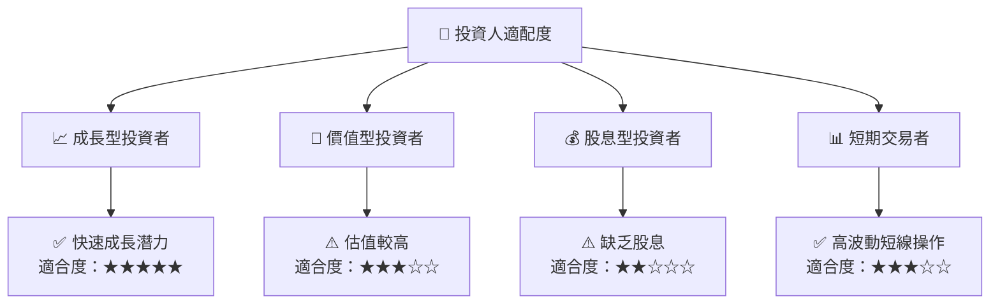

### 10.5 關鍵監控指標

| 監控類型 | 指標 | 關注點 | 頻率 |
|----------|------|--------|------|
| 財務指標 | 收入增長率 | 符合預期增速 | 季度 |
| 市場情況 | 客戶合約數量 | 合約增長趨勢 | 季度 |
| 技術進展 | 研發成果 | 新技術推出 | 半年 |
| 政策變動 | 法規變更 | 政策影響 | 實時 |

---

> **免責聲明**：本報告為 AI 自動生成，僅供研究參考，不構成投資建議。投資有風險，入市需謹慎。