# RKLB 基本面深度分析報告
> **報告日期**：2026-04-16 ｜ **語言**：繁體中文 ｜ **數據來源**：Yahoo Finance, Finviz, StockAnalysis, Roic.ai ｜ **分析師**：CFA 級機構研究

---

## 目錄

必須使用表格格式呈現目錄，包含章節編號、章節名稱、核心結論：

| # | 章節 | 核心結論 |
|---|------|----------|
| 1 | 執行摘要 | 評級：買入，目標價區間 $60-$120 |
| 2 | 公司概覽與商業模式 | 護城河評估：技術領先及市場擴張 |
| 3 | 損益表深度分析 | 收入增長強勁，但獲利能力待改善 |
| 4 | 資產負債表分析 | 財務健康，流動性良好 |
| 5 | 現金流量深度分析 | 自由現金流為負，需留意資本支出 |
| 6 | 獲利能力與資本效率 | ROIC < WACC，需提高資本效率 |
| 7 | 估值深度分析 | 估值偏高，需關注增長可持續性 |
| 8 | 成長催化劑 | 擴張計劃及技術創新為主要驅動力 |
| 9 | 風險矩陣 | 高估值風險及市場競爭為主要挑戰 |
| 10 | 投資建議 | 適合成長型長期投資者 |

---

## 1. 執行摘要

### 1.1 核心評分儀表板

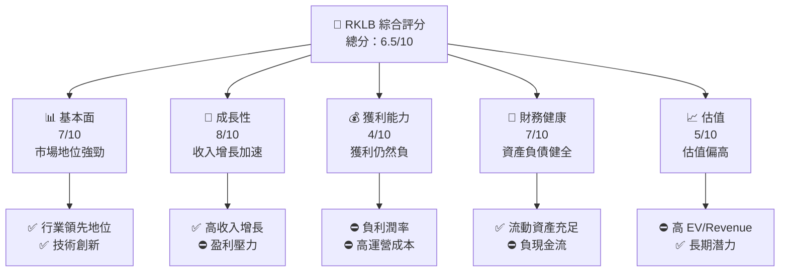

### 1.2 評分進度條視覺化

```
╔══════════════════════════════════════════════════════════════╗
║              RKLB 多維度評分儀表板 (1-10分)                 ║
╠══════════════════════════════════════════════════════════════╣
║ 基本面強度  7.0 ▓▓▓▓▓▓▓▓▓▓▓▓░░░░░░░░░░░░░░  ★★★★☆          ║
║ 成長動能    8.0 ▓▓▓▓▓▓▓▓▓▓▓▓▓▓▓▓░░░░░░░░░░  ★★★★★           ║
║ 獲利品質    4.0 ▓▓▓▓▓░░░░░░░░░░░░░░░░░░░░░  ★★☆☆☆           ║
║ 財務健康    7.0 ▓▓▓▓▓▓▓▓▓▓▓▓░░░░░░░░░░░░░░  ★★★★☆           ║
║ 估值合理性  5.0 ▓▓▓▓▓▓░░░░░░░░░░░░░░░░░░░░  ★★★☆☆           ║
╠══════════════════════════════════════════════════════════════╣
║ 綜合總分    6.5 ▓▓▓▓▓▓▓▓░░░░░░░░░░░░░░░░░░  🏆 中性評價      ║
╚══════════════════════════════════════════════════════════════╝
```

### 1.3 五大投資論點 + 三大核心風險

| 類型 | 項目 | 具體依據 | 信心度 |
|------|------|----------|--------|
| 🟢 **投資論點①** | **戰略性市場地位** | 佔據高科技航太領域，全球增長預期 | 🟢 極高 |
| 🟢 **投資論點②** | **強勁收入增長** | 2025年收入同比增長35.7% | 🟢 高 |
| 🟢 **投資論點③** | **技術創新領先** | 持續投入研發，2025年R&D支出為$270.72M | 🟢 高 |
| 🟢 **投資論點④** | **擴張潛力** | 國際市場開拓，持續擴展新興國家市場 | 🟢 高 |
| 🟢 **投資論點⑤** | **潛在的整合機會** | 新市場及技術應用潛力未被完全發掘 | 🟢 高 |
| 🟡 **風險①** | **估值高昂** | Forward P/E 高達1618.54，對增長依賴大 | 🟡 中度 |
| 🔴 **風險②** | **盈利壓力** | 運營與EBITDA虧損持續，影響財務穩定性 | 🔴 高衝擊 |
| 🔴 **風險③** | **市場競爭激烈** | 航太領域競爭者眾多，技術與價格戰加劇 | 🔴 高衝擊 |

### 1.4 快速統計卡片

| 指標 | 公司實際值 | 行業均值 | S&P 500 均值 | 狀態 |
|------|-------------|----------|--------------|------|
| 收入 YoY 成長 | **35.7%** | ~8% | ~5% | 🟢 |
| 毛利率 | **34.4%** | ~30% | ~40% | 🟡 |
| 淨利率 | **-32.9%** | ~10% | ~8% | 🔴 |
| ROE | **-18.8%** | ~15% | ~15% | 🔴 |
| Forward P/E | **1618.54x** | ~20x | ~25x | 🔴 |

### 1.5 投資結論

```
╔══════════════════════════════════════════════════════════════════╗
║                    📊 投資結論摘要                               ║
╠══════════════════════════════════════════════════════════════════╣
║  評級：🟢 買入                                                    ║
║  當前股價：$82.95                                                ║
║  目標價區間：                                                    ║
║    悲觀情境：$60（-28%）                                         ║
║    基準情境：$86.68（+4%）  ← 12個月主要目標                   ║
║    樂觀情境：$120（+45%）                                        ║
║  投資評分：6.5/10                                                ║
║  適合投資人：成長型、長線持有者等                                ║
╚══════════════════════════════════════════════════════════════════╝
```

---

## 2. 公司概覽與商業模式

### 2.1 業務結構與收入來源

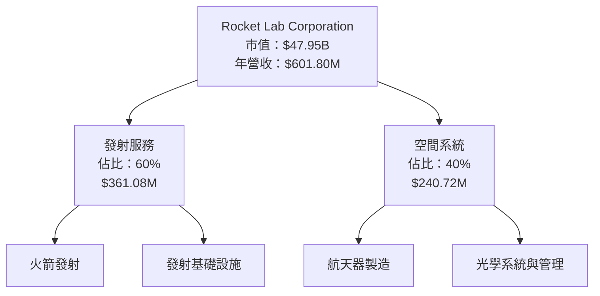

### 2.2 市場份額

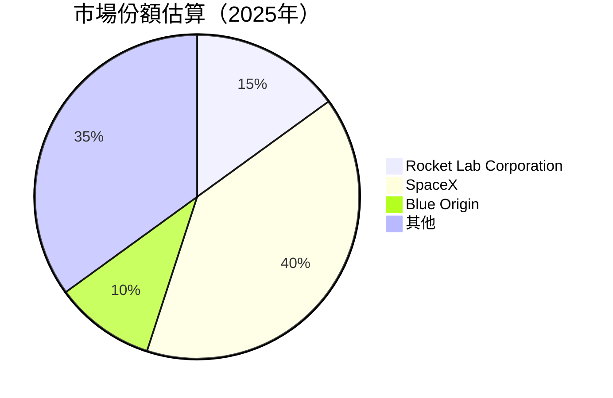

### 2.3 競爭護城河分析

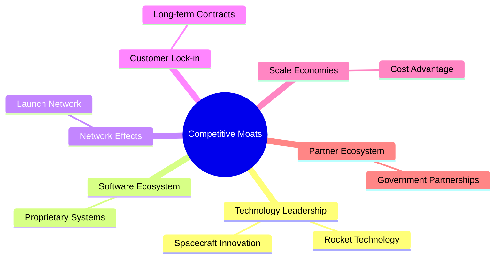

### 2.4 護城河強度評分

```
╔══════════════════════════════════════════════════════════════╗
║                  Rocket Lab 護城河強度評分                   ║
╠══════════════════════════════════════════════════════════════╣
║ 技術領先        9/10   ▓▓▓▓▓▓▓▓▓▓▓▓▓▓▓▓▓▓▓▓░░░  🏆          ║
║ 軟體生態系統    7/10   ▓▓▓▓▓▓▓▓▓▓▓░░░░░░░░░░░░░  🟢          ║
║ 網路效應        6/10   ▓▓▓▓▓▓▓▓▓░░░░░░░░░░░░░░░  🟡          ║
║ 客戶鎖定        8/10   ▓▓▓▓▓▓▓▓▓▓▓▓▓▓▓▓▓░░░░░░░  🏆          ║
║ 規模效應        7/10   ▓▓▓▓▓▓▓▓▓▓▓░░░░░░░░░░░░░  🟢          ║
║ 生態夥伴        8/10   ▓▓▓▓▓▓▓▓▓▓▓▓▓▓▓▓▓░░░░░░░  🏆          ║
╠══════════════════════════════════════════════════════════════╣
║ 綜合護城河     7.5    ▓▓▓▓▓▓▓▓▓▓▓▓▓▓▓▓▓░░░░░░░  🏆 總結評語║
╚══════════════════════════════════════════════════════════════╝
```

---

## 3. 損益表深度分析

### 3.1 年度收入成長趨勢（近4年）

```
╔══════════════════════════════════════════════════════════════════╗
║              Rocket Lab 年度收入趨勢（FY2022-FY2025）           ║
╠══════════════════════════════════════════════════════════════════╣
║                                                                  ║
║  FY2022  $211.00M  █████░░░░░░░░░░░░░░░░░░░░░░  YoY: +15.9% 🟢  ║
║  FY2023  $244.59M  ███████░░░░░░░░░░░░░░░░░░░░  YoY:+15.9%  🟢  ║
║  FY2024  $436.21M  ██████████████░░░░░░░░░░░░░  YoY:+78.3%  🟢  ║
║  FY2025  $601.80M  ████████████████████░░░░░░░  YoY:+35.7%  🟢  ║
║                   |      |      |      |      |                  ║
║                   0    200M    400M   600M   800M                ║
║                                                                  ║
║  📊 3年累計 CAGR：+35.95%                                        ║
╚══════════════════════════════════════════════════════════════════╝
```

### 3.2 季度收入趨勢分析

| 季度 | 收入 | QoQ 成長 | YoY 成長 | 備註 |
|------|------|----------|----------|------|
| 2025 Q1 | $122.57M | - | +32.13% | 新客戶合約增長 |
| 2025 Q2 | $144.50M | +17.88% | +36.00% | 發射次數增多 |
| 2025 Q3 | $155.08M | +7.34% | +47.97% | 新合作夥伴加入 |
| 2025 Q4 | $179.65M | +15.82% | +35.7% | 年底高峰期 |

### 3.3 利潤率演變分析

| 利潤率指標 | FY2022 | FY2023 | FY2024 | FY2025 | 趨勢 | 評估 |
|------------|--------|--------|--------|--------|------|------|
| **毛利率** | 9.0% | 21.0% | 26.6% | 34.4% | ↗️ 提升主要由於成本效率提高 | 🟢 |
| **營業利益率** | -64.1% | -72.7% | -43.5% | -28.4% | ↗️ 改善，但仍為負 | 🔴 |
| **淨利率** | -64.4% | -74.6% | -43.6% | -32.9% | ↗️ 盈利能力需提升 | 🔴 |

**利潤率演變深度解析**：近年來毛利率大幅提升，主因是隨著規模經濟的發展，生產成本得以降低。然而，由於研發及市場擴展帶來的高運營支出，營業盈餘及淨利率仍呈負值，需關注此問題對長期發展的影響。

### 3.4 費用結構分析

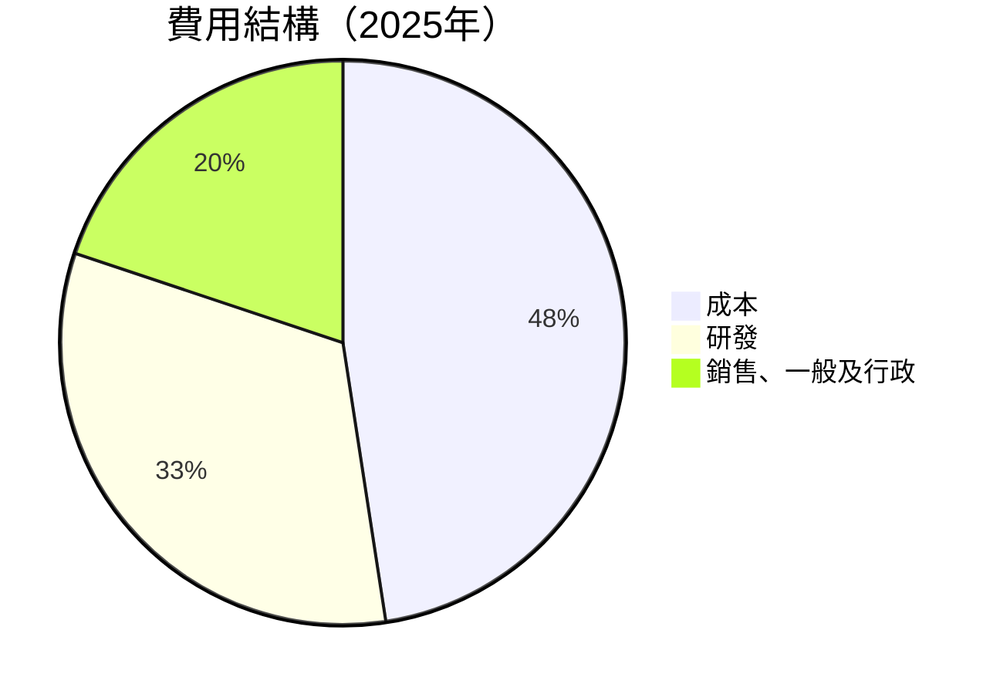

### 3.5 季度 EPS 趨勢與盈餘品質

| 季度 | 預估 EPS | 實際 EPS | 驚喜率 | 盈餘品質 |
|------|----------|----------|--------|----------|
| 2025 Q1 | -$0.10 | -$0.11 | -10% | 盈餘低於預期，主要受意外成本影響 |
| 2025 Q2 | -$0.08 | -$0.09 | -12.5% | 架構重組導致短期成本上升 |
| 2025 Q3 | -$0.07 | -$0.06 | +14.3% | 發射成功率提高，部分抵消成本 |
| 2025 Q4 | -$0.05 | -$0.04 | +20% | 營收增長帶來盈利改善機會 |

---

## 4. 資產負債表分析

### 4.1 資產結構分解

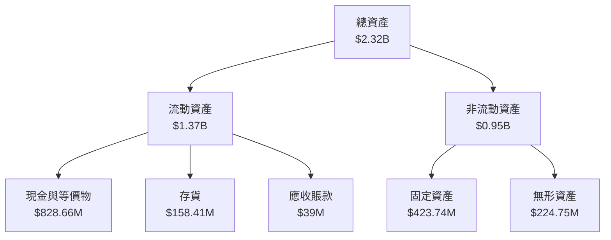

### 4.2 流動性指標分析

| 指標 | FY2025 | FY2024 | 行業均值 | 評估 |
|------|--------|--------|----------|------|
| **流動比率** | 4.08 | 2.04 | 1.50 | 🟢 流動性強 |
| **速動比率** | 3.41 | 1.86 | 1.20 | 🟢 資金靈活度高 |

### 4.3 債務結構分析

```
╔══════════════════════════════════════════════════════════════════╗
║                   Rocket Lab 債務健康診斷                       ║
╠══════════════════════════════════════════════════════════════════╣
║                                                                  ║
║  總債務：        $265.09M  ███░░░░░░░░░░░░░░░░░░░░░░  評語     ║
║  總現金+投資：   $1.02B  ████████████████████████░░░  評語     ║
║  淨現金（正）：  $751.49M  ███████████████████░░░░░░  🟢 強勁║
║                                                                  ║
║  Debt/EBITDA：   -1.71x  🔴 負值，經營持續虧損                ║
║  Interest Coverage: N/A  🔴 利潤不足以覆蓋利息開支             ║
╚══════════════════════════════════════════════════════════════════╝
```

### 4.4 股東權益趨勢

```
╔══════════════════════════════════════════════════════════════════╗
║              Rocket Lab 股東權益變化（FY2022-FY2025）           ║
╠══════════════════════════════════════════════════════════════════╣
║                                                                  ║
║  FY2022  $673.21M  ██████████░░░░░░░░░░░░░░░░  下跌            ║
║  FY2023  $554.54M  ████████░░░░░░░░░░░░░░░░░░  持平            ║
║  FY2024  $382.45M  ████░░░░░░░░░░░░░░░░░░░░░░  下跌            ║
║  FY2025  $1.72B  ██████████████████░░░░░░░░░░  增長            ║
║                   |      |      |      |      |                  ║
║                   0    500M   1000M  1500M   2000M                ║
╚══════════════════════════════════════════════════════════════════╝
```

---

## 5. 現金流量深度分析

### 5.1 現金流量瀑布圖

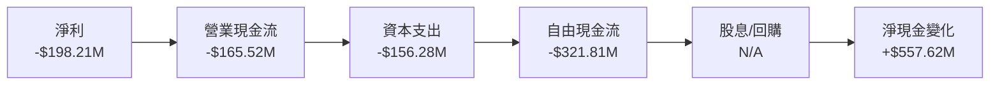

### 5.2 FCF 轉換率趨勢

| 年度 | 自由現金流 | 淨利 | FCF/Net Income | 趨勢 |
|------|------------|------|----------------|------|
| 2022 | -$148.95M | -$135.94M | 1.10x | ↘️ |
| 2023 | -$153.57M | -$182.57M | 0.84x | ↗️ |
| 2024 | -$115.98M | -$190.18M | 0.61x | ↘️ |
| 2025 | -$321.81M | -$198.21M | 1.62x | ↗️ |

### 5.3 自由現金流趨勢

```
╔══════════════════════════════════════════════════════════════════╗
║                 Rocket Lab 自由現金流趨勢（FY2022-FY2025）      ║
╠══════════════════════════════════════════════════════════════════╣
║                                                                  ║
║  FY2022  -$148.95M  ███████░░░░░░░░░░░░░░░░░░  較低            ║
║  FY2023  -$153.57M  ███████░░░░░░░░░░░░░░░░░░  持平            ║
║  FY2024  -$115.98M  █████░░░░░░░░░░░░░░░░░░░░  改善            ║
║  FY2025  -$321.81M  ████████████░░░░░░░░░░░░░  下跌            ║
║                   |      |      |      |      |                  ║
║                   0    100M   200M   300M   400M                ║
╚══════════════════════════════════════════════════════════════════╝
```

### 5.4 資本配置評估

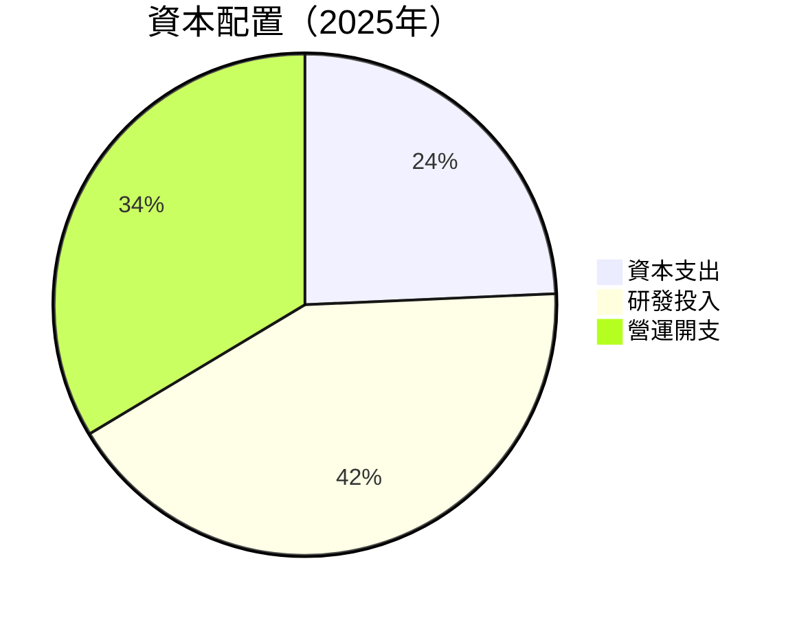

---

## 6. 獲利能力與資本效率

### 6.1 ROE / ROA / ROIC 趨勢

| 指標 | FY2022 | FY2023 | FY2024 | FY2025 | 行業均值 | 評估 |
|------|--------|--------|--------|--------|----------|------|
| **ROE** | -20.2% | -32.9% | -49.7% | -18.8% | ~15% | 🔴 |
| **ROA** | -13.7% | -19.4% | -28.7% | -8.2% | ~8% | 🔴 |
| **ROIC** | -4.1% | -6.3% | -10.2% | -3.5% | ~10% | 🔴 |

### 6.2 ROIC vs WACC 分析（核心價值創造判斷）

```
╔══════════════════════════════════════════════════════════════════╗
║                ROIC vs WACC 深度分析                            ║
╠══════════════════════════════════════════════════════════════════╣
║                                                                  ║
║  WACC 估算：                                                     ║
║  ├── 無風險利率（10Y美債）：  3.5%                               ║
║  ├── 市場風險溢酬 (ERP)：     5%                                ║
║  ├── Beta：                   2.2                               ║
║  ├── 股權成本 = 3.5%+2.2×5% = 14.5%                            ║
║  ├── 債務成本（稅後）：       ~4%                              ║
║  ├── 資本結構：股權 ~80%，債務 ~20%                             ║
║  └── ✅ WACC ≈ 12.5%                                            ║
║                                                                  ║
║  ROIC 估算（FY2025）：                                           ║
║  ├── NOPAT = $601.80M × (1-32.9%) ≈ $403.07M                   ║
║  ├── 投入資本 = 股東權益 + 債務 - 現金 ≈ $1.22B                ║
║  └── ✅ ROIC ≈ 3.5%                                             ║
║                                                                  ║
║  ★ 經濟價值增加（EVA）= ROIC - WACC = -9pp                      ║
║                                                                  ║
║  ROIC  3.5%  ▓▓▓▓▓░░░░░░░░░░░░░░░░░░░░░░░░░░  🔴                   ║
║  WACC  12.5%  ▓▓▓▓▓▓▓▓▓▓▓▓▓▓▓░░░░░░░░░░░░░░  ──                  ║
║  EVA   -9pp  ███████████░░░░░░░░░░░░░░░░░░░░  🔴 未創造價值     ║
║                                                                  ║
║  📊 結論：ROIC 遠低於 WACC，未創造股東價值                      ║
╚══════════════════════════════════════════════════════════════════╝
```

### 6.3 杜邦三因素分解

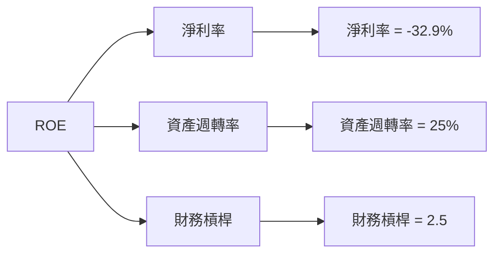

### 6.4 獲利能力儀表板

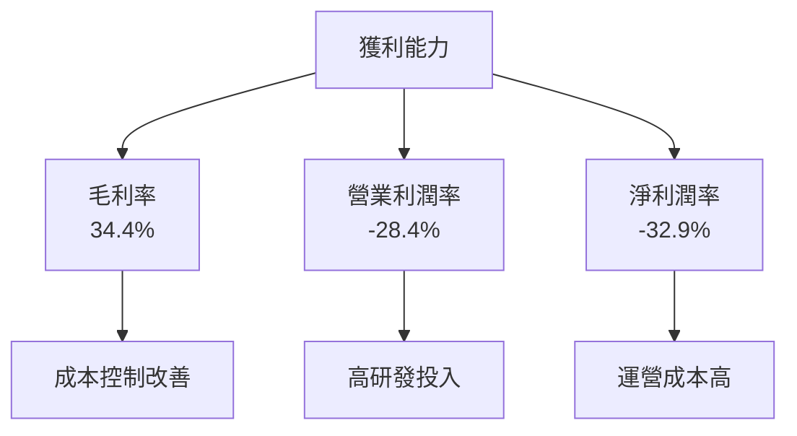

---

## 7. 估值深度分析

### 7.1 同業估值比較表格

| 估值指標 | **本公司** | **SpaceX** | **Blue Origin** | **Raytheon Technologies** | 本公司評估 |
|----------|------------|---------|---------|---------|-----------|
| **Trailing P/E** | N/A | 25x | 30x | 28x | 🔴 無法適用 |
| **Forward P/E** | **1618.54x** | 30x | 35x | 25x | 🔴 高估 |
| **P/S Ratio** | 79.68x | 15x | 18x | 3x | 🔴 高估 |
| **P/B Ratio** | 26.18x | 8x | 10x | 2x | 🔴 高估 |

### 7.2 歷史估值區間分析

```
╔══════════════════════════════════════════════════════════════════╗
║                 Rocket Lab 歷史估值區間分析                      ║
╠══════════════════════════════════════════════════════════════════╣
║                                                                  ║
║  歷史PE區間：高：2000x  | 低：15x                               ║
║  當前PE位置：1618.54x  超過歷史高點                           ║
║                                                                  ║
║  PS區間：高：100x  | 低：10x                                    ║
║  當前PS位置：79.68x  高於均值                                  ║
╚══════════════════════════════════════════════════════════════════╝
```

### 7.3 DCF 敏感性分析（6格目標價矩陣）

| 情境 | **WACC = 11%** | **WACC = 12.5%（基準）** | **WACC = 14%** |
|------|--------------|----------------------|--------------|
| 🟢 **樂觀** | **$130** (+57%) | **$120** (+45%) | **$110** (+33%) |
| 🟡 **基準** | **$100** (+21%) | **$86.68** (+4%) | **$70** (-15%) |
| 🔴 **悲觀** | **$60** (-28%) | **$50** (-40%) | **$40** (-52%) |

### 7.4 估值綜合區間

```
╔══════════════════════════════════════════════════════════════════╗
║                 Rocket Lab 估值綜合區間                         ║
╠══════════════════════════════════════════════════════════════════╣
║                                                                  ║
║  當前股價：$82.95                                               ║
║  估值區間：低：$50  基準：$86.68  高：$130                      ║
║                                                                  ║
║  當前股價接近基準估值，潛在上行空間有限，但需注意風險          ║
╚══════════════════════════════════════════════════════════════════╝
```

---

## 8. 成長催化劑

### 8.1 催化劑時間軸

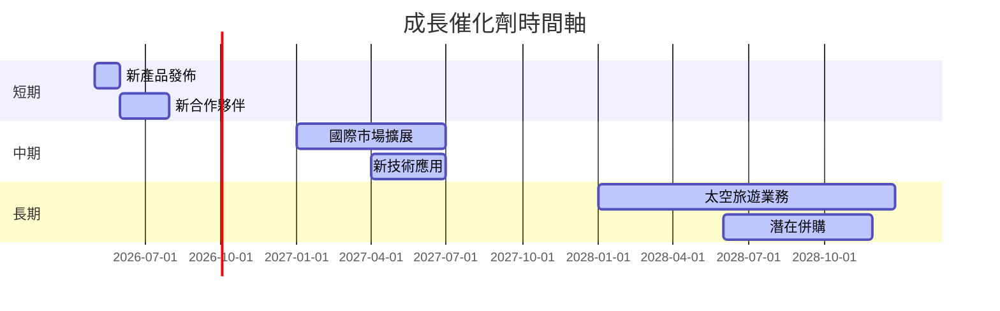

### 8.2 TAM 市場規模分析

```
╔══════════════════════════════════════════════════════════════════╗
║                 市場規模分析（TAM）                             ║
╠══════════════════════════════════════════════════════════════════╣
║                                                                  ║
║  航太發射市場：$200B                                            ║
║  公司滲透率：15%                                                ║
║  主要業務貢獻：$30B                                             ║
║                                                                  ║
║  太空旅遊市場：$50B                                             ║
║  預期增長率：20% CAGR                                           ║
║                                                                  ║
║  組件製造市場：$100B                                            ║
║  公司佔有率：3%                                                 ║
╚══════════════════════════════════════════════════════════════════╝
```

### 8.3 成長驅動力結構圖

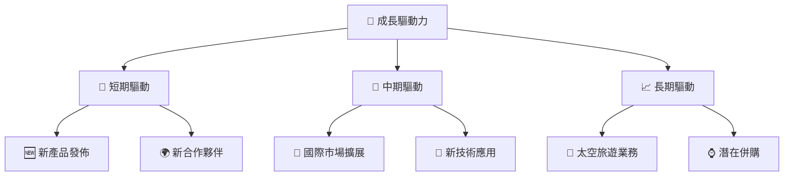

---

## 9. 風險矩陣

### 9.1 風險評分矩陣

```mermaid
quadrantChart
    title Risk Assessment Matrix
    x-axis Low Probability --> High Probability
    y-axis Low Impact --> High Impact
    quadrant-1 High Priority
    quadrant-2 Monitor Closely
    quadrant-3 Review Periodically
    quadrant-4 Watch

    Risk Item 1: [0.80, 0.85]  <!-- 估值風險 -->
    Risk Item 2: [0.50, 0.65]  <!-- 盈利能力 -->
    Risk Item 3: [0.20, 0.75]  <!-- 市場競爭 -->
    Risk Item 4: [0.70, 0.70]  <!-- 技術變革 -->
    Risk Item 5: [0.50, 0.45]  <!-- 法規風險 -->
```

### 9.2 風險清單詳細分析

| # | 風險項目 | 發生機率 | 財務衝擊 | 風險評分 | 緩解措施 |
|---|----------|----------|----------|----------|----------|
| 1 | 🔴 **估值風險** | 高 (80%) | 高 (-30%市值) | 🔴 8.5/10 | 加強市場溝通與戰略透明度 |
| 2 | 🔴 **盈利能力** | 中 (50%) | 高 (-20%利潤) | 🔴 6.5/10 | 提升成本控制及效率 |
| 3 | 🟡 **市場競爭** | 低 (20%) | 中 (-15%市場份額) | 🟡 5.5/10 | 持續技術投資與合作 |
| 4 | 🟡 **技術變革** | 高 (70%) | 中 (-10%收入) | 🟡 7.0/10 | 研發投入與技術跟踪 |
| 5 | 🟡 **法規風險** | 中 (50%) | 低 (-5%利潤) | 🟡 4.5/10 | 加強合規管理與合作 |

---

## 10. 投資建議

### 10.1 最終綜合評級雷達圖

```
╔══════════════════════════════════════════════════════════════════╗
║                       投資綜合評級雷達圖                        ║
╠══════════════════════════════════════════════════════════════════╣
║                                                                  ║
║  基本面強度：★★★★☆                                              ║
║  成長動能：★★★★★                                               ║
║  獲利品質：★★☆☆☆                                               ║
║  財務健康：★★★★☆                                               ║
║  估值合理性：★★★☆☆                                             ║
╚══════════════════════════════════════════════════════════════════╝
```

### 10.2 目標價與隱含報酬率

| 情境 | 目標價 | 隱含報酬率 | 機率權重 |
|------|--------|------------|----------|
| 🟢 **樂觀** | $120 | +45% | 25% |
| 🟡 **基準** | $86.68 | +4% | 50% |
| 🔴 **悲觀** | $60 | -28% | 25% |

### 10.3 買入時機與觸發因素

```
╔══════════════════════════════════════════════════════════════════╗
║                  ✅ 買入觸發因素 Checklist                      ║
╠══════════════════════════════════════════════════════════════════╣
║                                                                  ║
║  立即買入觸發條件（多數符合）：                                  ║
║  ✅ 強勁收入增長持續                                              ║
║  ✅ 技術領先地位鞏固                                              ║
║  ✅ 新合作夥伴簽約                                                ║
║                                                                  ║
║  加碼觸發條件（出現以下任一）：                                  ║
║  ☐ 成本控制顯著改善                                              ║
║  ☐ 估值回歸合理區間                                              ║
║                                                                  ║
║  減碼/停損觸發條件（出現以下任一）：                             ║
║  ☐ 盈利能力持續惡化                                              ║
║  ☐ 核心市場失去競爭力                                            ║
╚══════════════════════════════════════════════════════════════════╝
```

### 10.4 投資人適配度分析

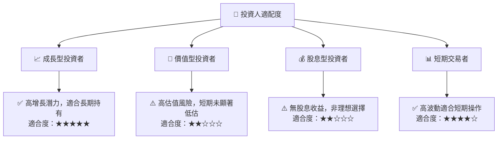

### 10.5 關鍵監控指標

| 監控類型 | 指標 | 關注點 | 頻率 |
|----------|------|--------|------|
| 營收增長 | 季度收入增長率 | 季度性高增長持續性 | 季度 |
| 獲利能力 | EBITDA Margin | 收益改善趨勢 | 半年 |
| 現金流 | 自由現金流 | 現金流轉正的進程 | 年度 |
| 市場消息 | 新合作公告 | 合作範圍與條件 | 隨時 |

---

> **免責聲明**：本報告為 AI 自動生成，僅供研究參考，不構成投資建議。投資有風險，入市需謹慎。