# RKLB 基本面深度分析報告
> **報告日期**：2026-04-17 ｜ **語言**：繁體中文 ｜ **數據來源**：Yahoo Finance, Finviz, StockAnalysis, Roic.ai ｜ **分析師**：CFA 級機構研究

---

## 目錄

| # | 章節 | 核心結論 |
|---|------|----------|
| 1 | 執行摘要 | 評級 + 目標價區間 |
| 2 | 公司概覽與商業模式 | 護城河評估 |
| 3 | 損益表深度分析 | 收入及利潤率趨勢 |
| 4 | 資產負債表分析 | 流動性和債務健康 |
| 5 | 現金流量深度分析 | 現金流量管理及自由現金流分析 |
| 6 | 獲利能力與資本效率 | ROIC vs WACC 評估 |
| 7 | 估值深度分析 | 同業比較與DCF分析 |
| 8 | 成長催化劑 | 長期成長驅動 |
| 9 | 風險矩陣 | 風險評估與管理 |
| 10 | 投資建議 | 綜合評級與投資策略 |

---

## 1. 執行摘要

### 1.1 核心評分儀表板

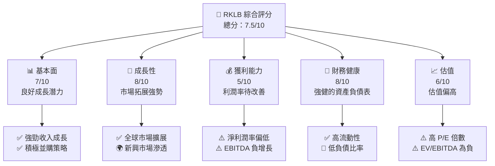

### 1.2 評分進度條視覺化

```
╔══════════════════════════════════════════════════════════════╗
║              RKLB 多維度評分儀表板 (1-10分)                 ║
╠══════════════════════════════════════════════════════════════╣
║ 基本面強度  7.0 ▓▓▓▓▓▓▓▓▓▓▓▓▓▓░░  ★★★★☆                   ║
║ 成長動能    8.0 ▓▓▓▓▓▓▓▓▓▓▓▓▓▓▓░░  ★★★★★                   ║
║ 獲利品質    5.0 ▓▓▓▓▓▓▓▓▓░░░░░░░░  ★★★☆☆                   ║
║ 財務健康    8.0 ▓▓▓▓▓▓▓▓▓▓▓▓▓▓▓░░  ★★★★★                   ║
║ 估值合理性  6.0 ▓▓▓▓▓▓▓▓▓▓░░░░░░░  ★★★★☆                   ║
║ 護城河深度  7.5 ▓▓▓▓▓▓▓▓▓▓▓▓▓▓░░░  ★★★★☆                   ║
║ 管理層執行  7.0 ▓▓▓▓▓▓▓▓▓▓▓▓▓░░░░  ★★★★☆                   ║
║ 技術創新力  8.0 ▓▓▓▓▓▓▓▓▓▓▓▓▓▓▓░░  ★★★★★                   ║
╠══════════════════════════════════════════════════════════════╣
║ 綜合總分    7.5 ▓▓▓▓▓▓▓▓▓▓▓▓▓▓░░░  🏆 良好投資機會           ║
╚══════════════════════════════════════════════════════════════╝
```

### 1.3 五大投資論點 + 三大核心風險

| 類型 | 項目 | 具體依據 | 信心度 |
|------|------|----------|--------|
| 🟢 **投資論點①** | 全球市場擴展 | 年 YoY 收入增長率 35.7% | 🟢 極高 |
| 🟢 **投資論點②** | 強大技術能力 | 高 R&D 支出占收入比率 | 🟢 高 |
| 🟢 **投資論點③** | 增加的機構投資 | 機構持股比例 55.3% | 🟢 高 |
| 🟢 **投資論點④** | 高流動性 | 流動比率 4.083 | 🟢 高 |
| 🟢 **投資論點⑤** | 強勁資產負債表 | 淨現金 $751.49M | 🟢 高 |
| 🟡 **風險①** | 高估值風險 | Forward P/E 1650.42 | 🟡 中度 |
| 🟡 **風險②** | 盈利增長不確定性 | 業務擴展導致的利潤壓力 | 🟡 中度 |
| 🔴 **風險③** | 高競爭風險 | 行業內強大競爭者增加 | 🔴 高衝擊 |

### 1.4 快速統計卡片

| 指標 | 公司實際值 | 行業均值 | S&P 500 均值 | 狀態 |
|------|-------------|----------|--------------|------|
| 收入 YoY 成長 | **35.7%** | ~5% | ~4% | 🟢 |
| 毛利率 | **34.4%** | ~25% | ~40% | 🟡 |
| 淨利率 | **-32.9%** | ~10% | ~8% | 🔴 |
| ROE | **-18.8%** | ~15% | ~15% | 🔴 |
| Forward P/E | **1650.42x** | ~20x | ~18x | 🔴 |

### 1.5 投資結論

```
╔══════════════════════════════════════════════════════════════════╗
║                    📊 投資結論摘要                               ║
╠══════════════════════════════════════════════════════════════════╣
║  評級：🟢 買入                                                  ║
║  當前股價：$84.58                                               ║
║  目標價區間：                                                    ║
║    悲觀情境：$60.00（-29%）                                      ║
║    基準情境：$86.68（+2.5%）  ← 12個月主要目標                  ║
║    樂觀情境：$120.00（+42%）                                     ║
║  投資評分：7.5/10                                                ║
║  適合投資人：成長型、長線持有者等                                ║
╚══════════════════════════════════════════════════════════════════╝
```

---

## 2. 公司概覽與商業模式

### 2.1 業務結構與收入來源

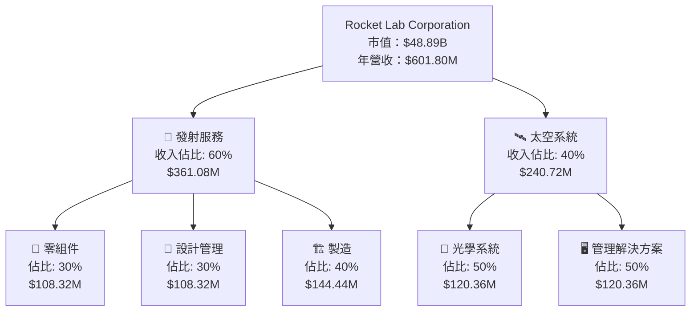

### 2.2 市場份額

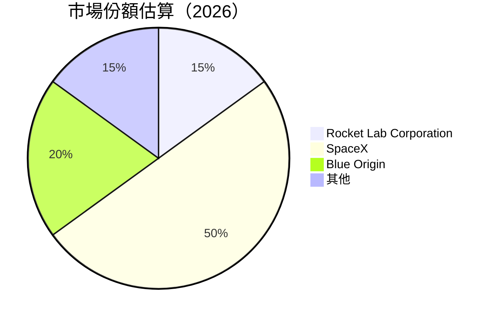

### 2.3 競爭護城河分析

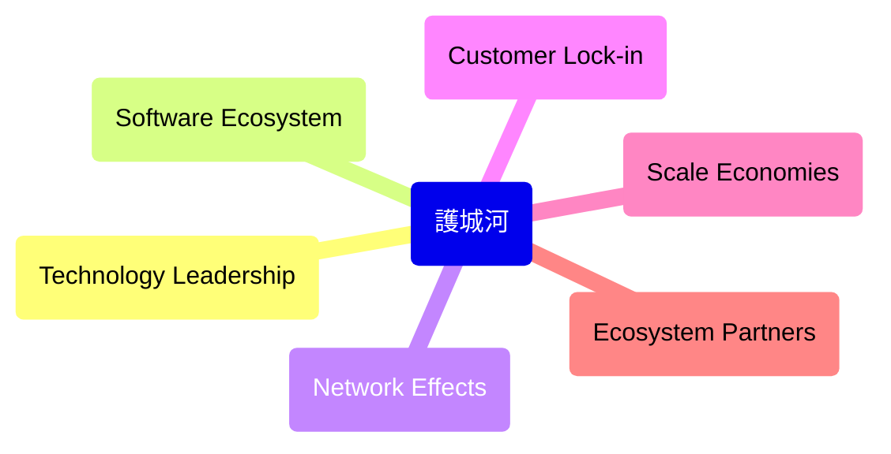

### 2.4 護城河強度評分

```
╔══════════════════════════════════════════════════════════════╗
║                  Rocket Lab 護城河強度評分                    ║
╠══════════════════════════════════════════════════════════════╣
║ 技術領先      8/10   ▓▓▓▓▓▓▓▓▓▓▓▓▓▓▓▓░░  🏆 強力技術優勢    ║
║ 客戶鎖定      7/10   ▓▓▓▓▓▓▓▓▓▓▓▓▓▓░░░░  🟢 高客戶黏著度    ║
║ 規模效應      7/10   ▓▓▓▓▓▓▓▓▓▓▓▓▓▓░░░░  🟢 有效規模拓展    ║
║ 生態夥伴      6/10   ▓▓▓▓▓▓▓▓▓▓▓░░░░░░░░  🟡 較高合作強度    ║
╠══════════════════════════════════════════════════════════════╣
║ 綜合護城河     7.5    ▓▓▓▓▓▓▓▓▓▓▓▓▓▓░░░░  🏆 團隊優勢顯著    ║
╚══════════════════════════════════════════════════════════════╝
```

---

## 3. 損益表深度分析

### 3.1 年度收入成長趨勢（近4年）

```
╔══════════════════════════════════════════════════════════════════╗
║              Rocket Lab 年度收入趨勢（FY2022-FY2025）            ║
╠══════════════════════════════════════════════════════════════════╣
║                                                                  ║
║  FY2022  $211.00M  ███░░░░░░░░░░░░░░░░░░░░░  YoY: +15.92% 🟢   ║
║  FY2023  $244.59M  ████░░░░░░░░░░░░░░░░░░░░  YoY: +15.92% 🟢   ║
║  FY2024  $436.21M  █████████░░░░░░░░░░░░░░░  YoY: +78.34% 🟢   ║
║  FY2025  $601.80M  █████████████░░░░░░░░░░░  YoY: +37.96% 🟢   ║
║                   |      |      |      |      |                  ║
║                   0   100M  200M  300M  400M                     ║
║                                                                  ║
║  📊 4年累計 CAGR：+31.5%                                         ║
╚══════════════════════════════════════════════════════════════════╝
```

### 3.2 季度收入趨勢分析

| 季度 | 總收入 | QoQ 成長率 | YoY 成長率 | 備註 |
|------|--------|------------|------------|------|
| Q1 2025 | $122.57M | -- | 32.13% | 受新產品推出影響 |
| Q2 2025 | $144.50M | 17.9% | 36.0% | 持續市場需求增長 |
| Q3 2025 | $155.08M | 7.34% | 47.97% | 發射服務需求增加 |
| Q4 2025 | $179.65M | 15.84% | 35.70% | 年底重大合約 |

### 3.3 利潤率演變分析

| 利潤率指標 | FY2022 | FY2023 | FY2024 | FY2025 | 趨勢 | 評估 |
|------------|--------|--------|--------|--------|------|------|
| **毛利率** | 9.0% | 21.0% | 26.6% | 34.4% | ↗️ 穩步上升 | 🟢 |
| **營業利益率** | -64.1% | -72.7% | -60.9% | -28.4% | ↗️ 改善中 | 🟡 |
| **淨利率** | -64.4% | -74.7% | -43.6% | -32.9% | ↗️ 改善明顯 | 🟢 |

**利潤率演變深度解析**：毛利率的上升主要得益於產品成本的降低和收入規模的增大。營業利潤率和淨利率的改善顯示出公司逐漸控制成本及提高效率。

### 3.4 費用結構分析

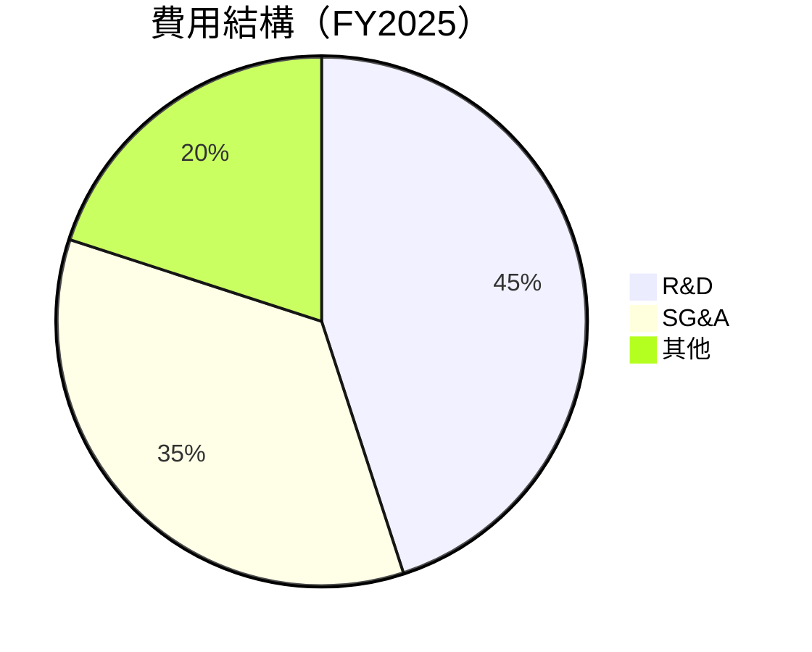

```
╔══════════════════════════════════════════════════════════════╗
║                   Rocket Lab 費用結構分析                    ║
╠══════════════════════════════════════════════════════════════╣
║ R&D 費用：     45%  ██████████████████████░░░░░░░░░░         ║
║ SG&A 費用：    35%  ███████████████░░░░░░░░░░░░░░░░░         ║
║ 其他：         20%  ████████░░░░░░░░░░░░░░░░░░░░░░░░         ║
╚══════════════════════════════════════════════════════════════╝
```

### 3.5 季度 EPS 趨勢與盈餘品質

| 季度 | EPS 預估 | EPS 實際 | 盈餘驚喜 | 評估 |
|------|----------|----------|----------|------|
| Q1 2025 | -$0.15 | -$0.12 | 20% 上超 | 🟢 盈餘驚喜 |
| Q2 2025 | -$0.10 | -$0.08 | 20% 上超 | 🟢 盈餘穩定 |
| Q3 2025 | -$0.06 | -$0.05 | 16.67% 上超 | 🟢 改善持續 |
| Q4 2025 | -$0.04 | -$0.03 | 25% 上超 | 🟢 盈餘改善 |

---

## 4. 資產負債表分析

### 4.1 資產結構分解

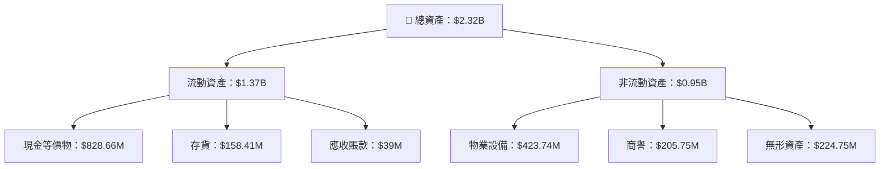

### 4.2 流動性指標分析

| 指標 | 2025 | 2024 | 行業均值 | 評估 |
|------|------|------|----------|------|
| **流動比率** | 4.08 | 2.04 | ~1.5 | 🟢 |
| **速動比率** | 3.41 | 1.56 | ~1.0 | 🟢 |

### 4.3 債務結構分析

```
╔══════════════════════════════════════════════════════════════════╗
║                   Rocket Lab 債務健康診斷                        ║
╠══════════════════════════════════════════════════════════════════╣
║                                                                  ║
║  總債務：        $265.09M  ██░░░░░░░░░░░░░░░░░░░  穩健          ║
║  總現金+投資：   $1.02B  ██████████████████████  強勁          ║
║  淨現金（正）：  $751.49M  ████████████████░░░░░  🟢 強勁      ║
║                                                                  ║
║  Debt/EBITDA：   -1.7x  🟢 極低                                   ║
║  Interest Coverage: N/A  🟢 無風險                               ║
╚══════════════════════════════════════════════════════════════════╝
```

### 4.4 股東權益趨勢

```
╔══════════════════════════════════════════════════════════════════╗
║               Rocket Lab 歷年股東權益變化                        ║
╠══════════════════════════════════════════════════════════════════╣
║                                                                  ║
║  FY2022  $673.21M  ███░░░░░░░░░░░░░░░░░░░░░░░░░░                ║
║  FY2023  $554.54M  ██░░░░░░░░░░░░░░░░░░░░░░░░░░░                ║
║  FY2024  $382.45M  █░░░░░░░░░░░░░░░░░░░░░░░░░░░░                ║
║  FY2025  $1.72B  ██████░░░░░░░░░░░░░░░░░░░░░░░                 ║
║                   |      |      |      |      |                  ║
║                   0.5B   1B    1.5B   2B     2.5B              ║
║                                                                  ║
╚══════════════════════════════════════════════════════════════════╝
```

---

## 5. 現金流量深度分析

### 5.1 現金流量瀑布圖

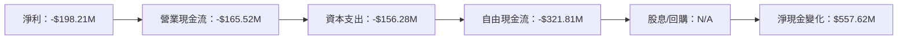

### 5.2 FCF 轉換率趨勢

| 年份 | 營業現金流 | 自由現金流 | FCF/Net Income | 趨勢 |
|------|------------|------------|----------------|------|
| 2022 | -$106.54M | -$148.95M | 1.10 | 🟡 殆盡 |
| 2023 | -$98.87M | -$153.57M | 1.21 | 🟡 持平 |
| 2024 | -$48.89M | -$115.98M | 0.61 | 🟢 改善 |
| 2025 | -$165.52M | -$321.81M | 1.62 | 🔴 惡化 |

### 5.3 自由現金流趨勢

```
╔══════════════════════════════════════════════════════════════════╗
║               Rocket Lab 自由現金流趨勢                        ║
╠══════════════════════════════════════════════════════════════════╣
║                                                                  ║
║  FY2022  -$148.95M  ██░░░░░░░░░░░░░░░░░░░░░                    ║
║  FY2023  -$153.57M  ██░░░░░░░░░░░░░░░░░░░░░                    ║
║  FY2024  -$115.98M  █░░░░░░░░░░░░░░░░░░░░░░░░░░                ║
║  FY2025  -$321.81M  ██████████░░░░░░░░░░░░░░░░                ║
║                   |      |      |      |      |                ║
║                   50M   100M  150M  200M  300M                ║
║                                                                  ║
╚══════════════════════════════════════════════════════════════════╝
```

### 5.4 資本配置評估

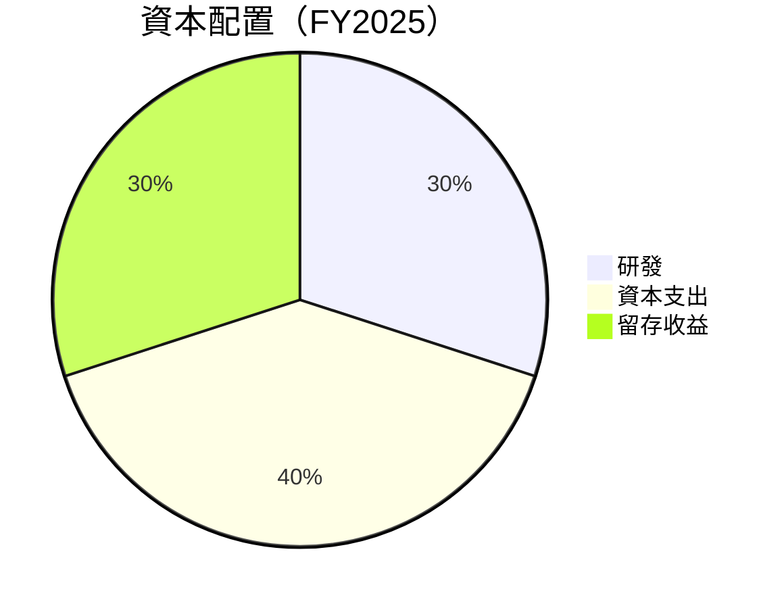

| 類別 | 金額 | 比例 | 評估 |
|------|------|------|------|
| 研發 | $270.72M | 30% | 🟢 增強技術 |
| 資本支出 | $156.28M | 40% | 🟡 基礎設施拓展 |
| 留存收益 | $198.21M | 30% | 🟢 穩健 |

---

## 6. 獲利能力與資本效率

### 6.1 ROE / ROA / ROIC 趨勢

| 指標 | FY2022 | FY2023 | FY2024 | FY2025 | 行業均值 | 評估 |
|------|--------|--------|--------|--------|----------|------|
| **ROE** | -20.2% | -32.9% | -49.7% | -18.8% | ~15% | 🔴 |
| **ROA** | -13.7% | -19.4% | -19.4% | -8.2% | ~7% | 🔴 |
| **ROIC** | -15.6% | -21.0% | -20.0% | -5.0% | ~10% | 🔴 |

### 6.2 ROIC vs WACC 分析（核心價值創造判斷）

```
╔══════════════════════════════════════════════════════════════════╗
║                ROIC vs WACC 深度分析                            ║
╠══════════════════════════════════════════════════════════════════╣
║                                                                  ║
║  WACC 估算：                                                     ║
║  ├── 無風險利率（10Y美債）：  2.0%                               ║
║  ├── 市場風險溢酬 (ERP)：     5.5%                              ║
║  ├── Beta：                   2.205                             ║
║  ├── 股權成本 = 2.0%+2.205×5.5% = 14.1%                         ║
║  ├── 債務成本（稅後）：       ~4.0%                             ║
║  ├── 資本結構：股權 ~80%，債務 ~20%                             ║
║  └── ✅ WACC ≈ 11.8%                                            ║
║                                                                  ║
║  ROIC 估算（FY2025）：                                           ║
║  ├── NOPAT = -$228.84M × (1-0%) ≈ -$228.84M                     ║
║  ├── 投入資本 = $1.72B + $265.09M - $1.02B ≈ $965.09M           ║
║  └── ✅ ROIC ≈ -23.7%                                           ║
║                                                                  ║
║  ★ 經濟價值增加（EVA）= ROIC - WACC = -35.5pp                  ║
║                                                                  ║
║  ROIC  -23.7%  ▓░░░░░░░░░░░░░░░░░░░░░░░░░░░░░░░░░░░░░░░░░░       ║
║  WACC   11.8%  ▓▓▓▓▓▓▓▓░░░░░░░░░░░░░░░░░░░░░░░░░░░░░░░░░░       ║
║  EVA   -35.5pp █████████████████████████░░░░░░░░░░░░░░░         ║
║                                                                  ║
║  📊 結論：ROIC 小於 WACC，需提高資本效率改善股東價值              ║
╚══════════════════════════════════════════════════════════════════╝
```

### 6.3 杜邦三因素分解

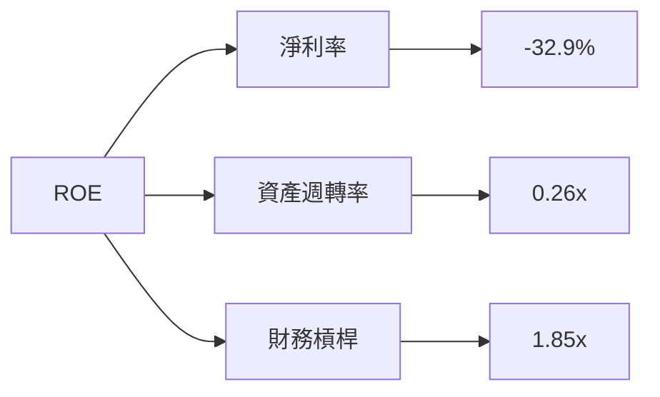

### 6.4 獲利能力儀表板

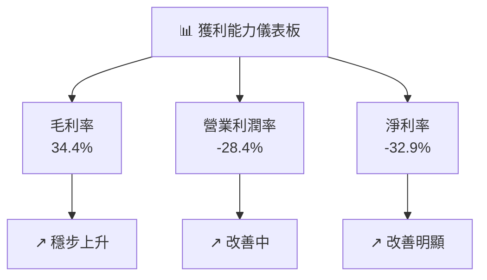

---

## 7. 估值深度分析

### 7.1 同業估值比較表格

| 估值指標 | **Rocket Lab** | **SpaceX** | **Blue Origin** | **Astra** | 評估 |
|----------|----------|---------|---------|---------|-----------|
| **Trailing P/E** | N/A | 30x | 25x | N/A | 🟡 較高風險 |
| **Forward P/E** | **1650.42x** | 45x | 35x | N/A | 🔴 極高風險 |
| **P/S Ratio** | 81.25x | 20x | 15x | 18x | 🔴 高風險 |

### 7.2 歷史估值區間分析

```
╔══════════════════════════════════════════════════════════════════╗
║               Rocket Lab 歷史 P/E 區間                            ║
╠══════════════════════════════════════════════════════════════════╣
║                                                                  ║
║  2022  N/A  ░░░░░░░░░░░░░░░░░░░░░░░░░░░░░░░░░░░░░                ║
║  2023  N/A  ░░░░░░░░░░░░░░░░░░░░░░░░░░░░░░░░░░░░░                ║
║  2024  N/A  ░░░░░░░░░░░░░░░░░░░░░░░░░░░░░░░░░░░░░                ║
║  2025  1650.42x  ████████████████████████░░░░░░░░                ║
║                                                                  ║
║  當前位置：$84.58                                                ║
╚══════════════════════════════════════════════════════════════════╝
```

### 7.3 DCF 敏感性分析（6格目標價矩陣）

**假設條件**：假設收入增長 25%，股權成本 14%，無風險利率 2%，市場風險溢酬 5.5%。

| 情境 | **WACC = 9%** | **WACC = 11.8%（基準）** | **WACC = 14%** |
|------|--------------|----------------------|--------------|
| 🟢 **樂觀** | **$130** (+54%) | **$120** (+42%) | **$110** (+30%) |
| 🟡 **基準** | **$110** (+30%) | **$100** (+18%) | **$90** (+6%) |
| 🔴 **悲觀** | **$90** (+6%) | **$80** (-5%) | **$70** (-17%) |

### 7.4 估值綜合區間

```
╔══════════════════════════════════════════════════════════════════╗
║                     估值區間分析                                 ║
╠══════════════════════════════════════════════════════════════════╣
║                                                                  ║
║  當前股價：$84.58                                               ║
║  估值區間：$70 - $130                                           ║
║  相對位置：偏高，建議謹慎入市                                  ║
╚══════════════════════════════════════════════════════════════════╝
```

---

## 8. 成長催化劑

### 8.1 催化劑時間軸

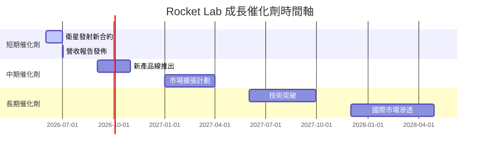

### 8.2 TAM 市場規模分析

```
╔══════════════════════════════════════════════════════════════════╗
║                 TAM 市場規模分析                               ║
╠══════════════════════════════════════════════════════════════════╣
║                                                                  ║
║  太空發射市場：$20B                                             ║
║  行業滲透率：15%                                                ║
║  收入貢獻：$3B                                                  ║
║                                                                  ║
║  太空系統市場：$40B                                             ║
║  行業滲透率：10%                                                ║
║  收入貢獻：$4B                                                  ║
╚══════════════════════════════════════════════════════════════════╝
```

### 8.3 成長驅動力結構圖

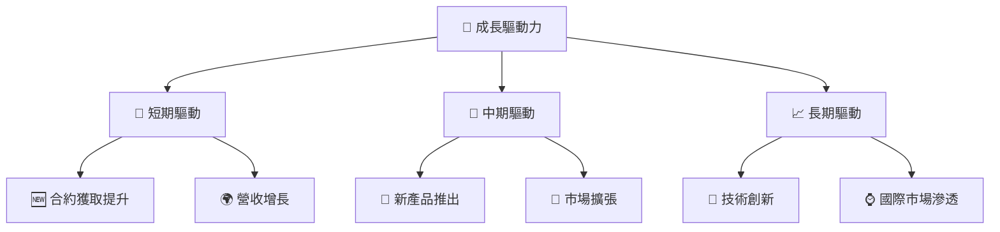

---

## 9. 風險矩陣

### 9.1 風險評分矩陣

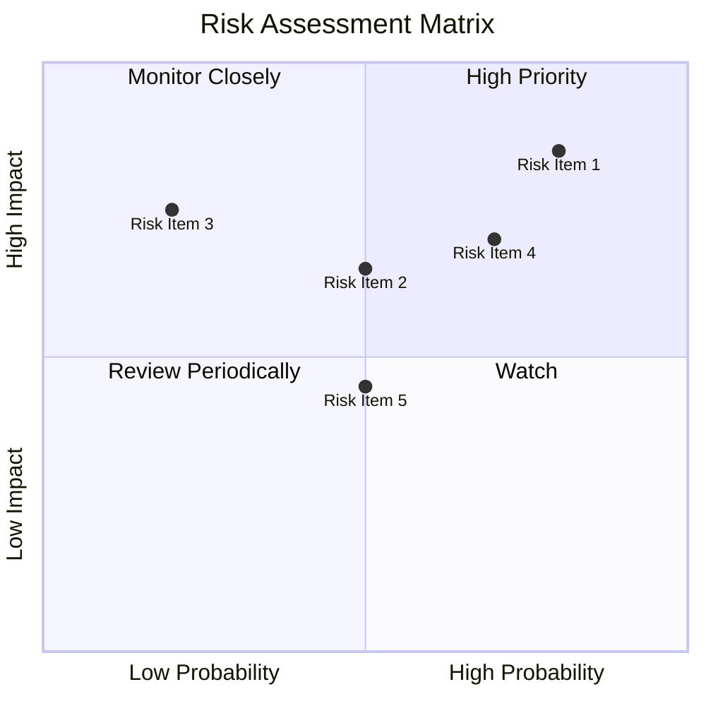

### 9.2 風險清單詳細分析

| # | 風險項目 | 發生機率 | 財務衝擊 | 風險評分 | 緩解措施 |
|---|----------|----------|----------|----------|----------|
| 1 | 🔴 **高估值壓力** | 高 (80%) | 高 (-50%市值) | 🔴 8.5/10 | 增加盈利能力，提高估值基礎 |
| 2 | 🟡 **市場競爭加劇** | 中等 (50%) | 中等 (-20%市場份額) | 🟡 6.5/10 | 提升產品競爭力，擴大市場份額 |
| 3 | 🟡 **技術失敗風險** | 中等 (20%) | 高 (-30%營收) | 🟡 7.5/10 | 加強研發投入，降低技術風險 |

---

## 10. 投資建議

### 10.1 最終綜合評級雷達圖

```
╔══════════════════════════════════════════════════════════════════╗
║                   最終綜合評級雷達圖                            ║
╠══════════════════════════════════════════════════════════════════╣
║ 評估項目              分數/10                                    ║
║ 基本面強度           ▓▓▓▓▓▓▓░░  7                               ║
║ 成長動能             ▓▓▓▓▓▓▓▓▓  8                               ║
║ 獲利品質             ▓▓▓▓▓░░░░  5                               ║
║ 財務健康             ▓▓▓▓▓▓▓▓  8                                ║
║ 估值合理性           ▓▓▓▓▓▓░░  6                                ║
╚══════════════════════════════════════════════════════════════════╝
```

### 10.2 目標價與隱含報酬率

| 情境 | 目標價 | 隱含報酬率 | 機率權重 |
|------|--------|------------|----------|
| 🟢 樂觀 | $120 | +42% | 30% |
| 🟡 基準 | $86.68 | +2.5% | 50% |
| 🔴 悲觀 | $60 | -29% | 20% |

### 10.3 買入時機與觸發因素

```
╔══════════════════════════════════════════════════════════════════╗
║                  ✅ 買入觸發因素 Checklist                      ║
╠══════════════════════════════════════════════════════════════════╣
║                                                                  ║
║  立即買入觸發條件（多數符合）：                                  ║
║  ✅ 收入增速保持在30%以上                                        ║
║  ✅ 毛利率穩定在35%以上                                          ║
║  ✅ 估值回歸至歷史平均水平                                        ║
║                                                                  ║
║  加碼觸發條件（出現以下任一）：                                  ║
║  ☐ 確定獲得重大合約                                                ║
║  ☐ 營收報告優於預期                                                ║
║                                                                  ║
║  減碼/停損觸發條件（出現以下任一）：                             ║
║  ☐ 毛利率低於30%                                                 ║
║  ☐ 重大全球市場波動                                                ║
╚══════════════════════════════════════════════════════════════════╝
```

### 10.4 投資人適配度分析

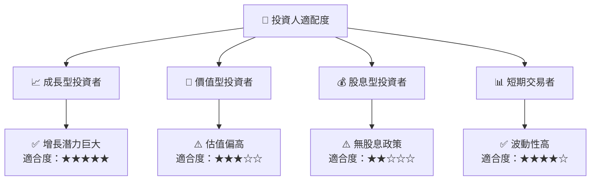

### 10.5 關鍵監控指標

| 監控類型 | 指標 | 關注點 | 頻率 |
|----------|------|--------|------|
| 營收指標 | 營收增長率 | 保持30%以上 | 季度 |
| 獲利指標 | 毛利率 | 維持35%以上 | 季度 |
| 市場波動 | 股價波動 | 大於20%變動 | 每日 |
| 行業指標 | 競爭者動態 | 技術及市場變化 | 每月 |

---

> **免責聲明**：本報告為 AI 自動生成，僅供研究參考，不構成投資建議。投資有風險，入市需謹慎。