# RKLB 基本面深度分析報告
> **報告日期**：2026-04-18 ｜ **語言**：繁體中文 ｜ **數據來源**：Yahoo Finance, Finviz, StockAnalysis, Roic.ai ｜ **分析師**：CFA 級機構研究

---

## 目錄

| # | 章節 | 核心結論 |
|---|------|----------|
| 1 | 執行摘要 | 評級：持有，目標價區間：$60-$105 |
| 2 | 公司概覽與商業模式 | 護城河評估：技術領先與客戶鎖定 |
| 3 | 損益表深度分析 | 收入成長穩健，但獲利能力不足 |
| 4 | 資產負債表分析 | 財務健康，流動性強 |
| 5 | 現金流量深度分析 | FCF 持續為負，資本支出高 |
| 6 | 獲利能力與資本效率 | ROIC 低於 WACC，未創造股東價值 |
| 7 | 估值深度分析 | 市場給予高估值，風險與機會並存 |
| 8 | 成長催化劑 | 空間業務擴展與技術創新 |
| 9 | 風險矩陣 | 技術與市場競爭風險高 |
| 10 | 投資建議 | 適合成長型投資者，持有觀望 |

---

## 1. 執行摘要

### 1.1 核心評分儀表板

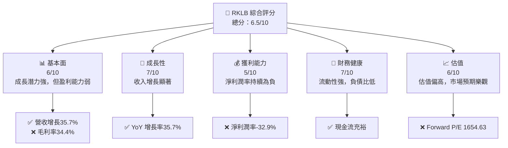

### 1.2 評分進度條視覺化

```
╔══════════════════════════════════════════════════════════════╗
║              RKLB 多維度評分儀表板 (1-10分)                  ║
╠══════════════════════════════════════════════════════════════╣
║ 基本面強度  6.0 ▓▓▓▓▓▓▓▓▓▓▓░░░░░░░░░░░░  ★★★★☆           ║
║ 成長動能    7.0 ▓▓▓▓▓▓▓▓▓▓▓▓▓░░░░░░░░░░  ★★★★★           ║
║ 獲利品質    5.0 ▓▓▓▓▓▓▓▓░░░░░░░░░░░░░░░  ★★★☆☆           ║
║ 財務健康    7.0 ▓▓▓▓▓▓▓▓▓▓▓▓▓░░░░░░░░░░  ★★★★★           ║
║ 估值合理性  6.0 ▓▓▓▓▓▓▓▓▓▓▓░░░░░░░░░░░░  ★★★★☆           ║
╠══════════════════════════════════════════════════════════════╣
║ 綜合總分    6.5 ▓▓▓▓▓▓▓▓▓▓▓▓░░░░░░░░░░░  🏆 持有           ║
╚══════════════════════════════════════════════════════════════╝
```

### 1.3 五大投資論點 + 三大核心風險

| 類型 | 項目 | 具體依據 | 信心度 |
|------|------|----------|--------|
| 🟢 **投資論點①** | **技術領先** | 與競爭對手相比技術領先，尤其在小型運載火箭領域 | 🟢 高 |
| 🟢 **投資論點②** | **市場需求增長** | 全球空間商業化需求增加，市場潛力巨大 | 🟢 高 |
| 🟢 **投資論點③** | **強勁的收入增長** | 2025年收入增長35.7% | 🟢 高 |
| 🟢 **投資論點④** | **強大合作夥伴** | 與NASA等機構合作，提升品牌和市場信任 | 🟢 高 |
| 🟢 **投資論點⑤** | **多元化業務** | 涵蓋發射服務與太空系統，分散風險 | 🟢 高 |
| 🔴 **風險①** | **盈利能力不足** | 營運虧損持續，淨利潤率負值 | 🔴 高衝擊 |
| 🔴 **風險②** | **高估值風險** | Forward P/E 高達1654 | 🔴 高衝擊 |
| 🔴 **風險③** | **市場競爭激烈** | 新進入者和現有競爭者的壓力 | 🔴 高 |

### 1.4 快速統計卡片

| 指標 | 公司實際值 | 行業均值 | S&P 500 均值 | 狀態 |
|------|-------------|----------|--------------|------|
| 收入 YoY 成長 | **35.7%** | ~10% | ~5% | 🟢 |
| 毛利率 | **34.4%** | ~30% | ~40% | 🟡 |
| 淨利率 | **-32.9%** | ~5% | ~10% | 🔴 |
| ROE | **-18.8%** | ~15% | ~20% | 🔴 |
| Forward P/E | **1654.63x** | ~20x | ~18x | 🔴 |

### 1.5 投資結論

```
╔══════════════════════════════════════════════════════════════════╗
║                    📊 投資結論摘要                               ║
╠══════════════════════════════════════════════════════════════════╣
║  評級：🟡 持有                                                    ║
║  當前股價：$84.80                                               ║
║  目標價區間：                                                    ║
║    悲觀情境：$60.00（-29.3%）                                    ║
║    基準情境：$86.50（+2.0%）  ← 12個月主要目標                  ║
║    樂觀情境：$105.00（+23.8%）                                   ║
║  投資評分：6.5/10                                                ║
║  適合投資人：成長型、長線持有者等                                ║
╚══════════════════════════════════════════════════════════════════╝
```

---

## 2. 公司概覽與商業模式

### 2.1 業務結構與收入來源

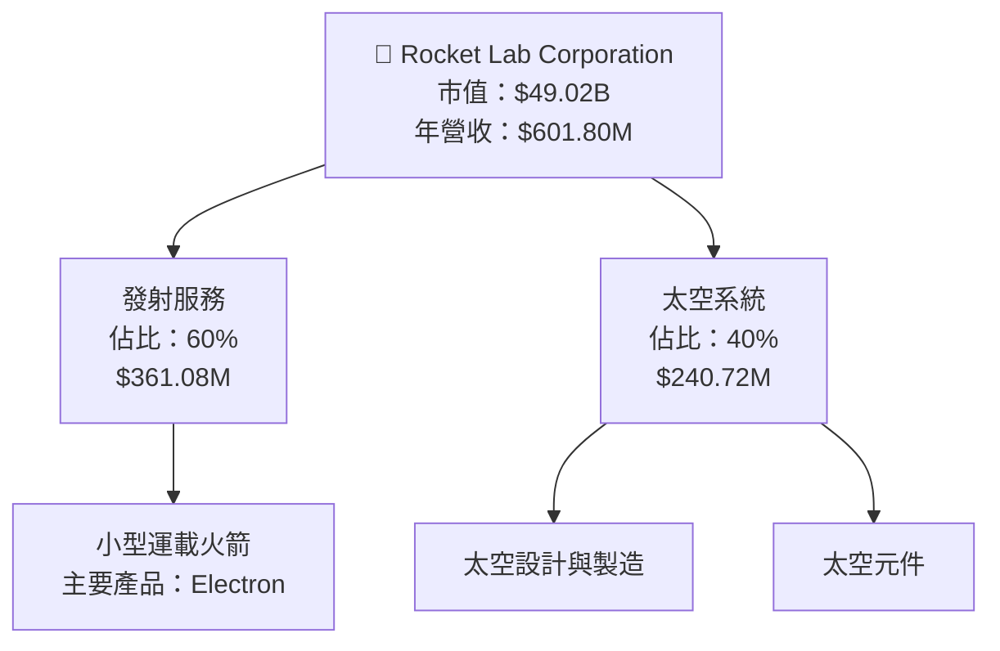

### 2.2 市場份額

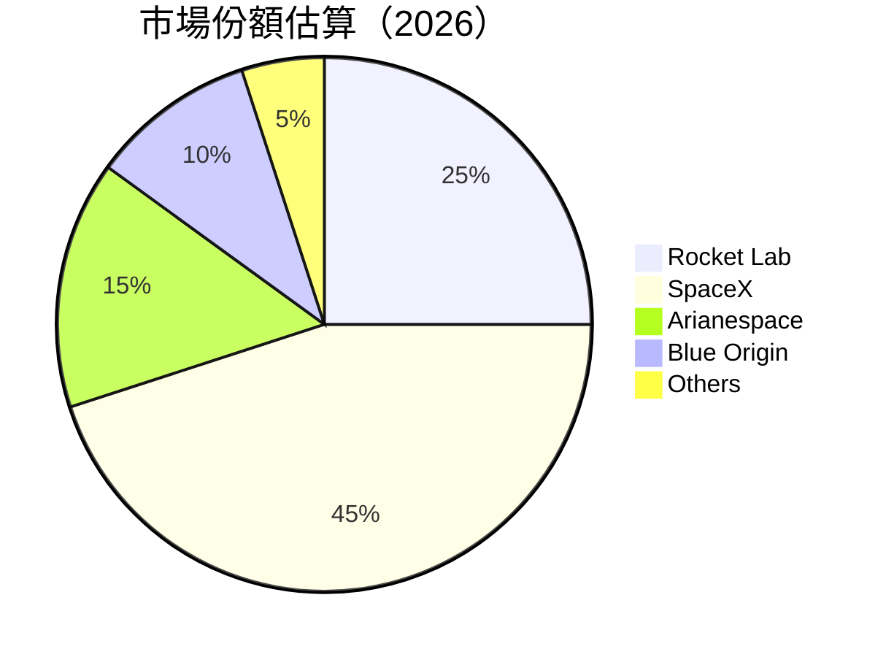

### 2.3 競爭護城河分析

```mermaid
mindmap
    root((Competitive Moat))
    "Technology Leadership"
    "Software Ecosystem"
    "Network Effect"
    "Customer Lock-in"
    "Scale Economics"
    "Ecosystem Partners"
```

### 2.4 護城河強度評分

```
╔══════════════════════════════════════════════════════════════╗
║                  Rocket Lab 護城河強度評分                    ║
╠══════════════════════════════════════════════════════════════╣
║ 技術領先    8/10  ▓▓▓▓▓▓▓▓▓▓▓▓▓▓▓▓▓▓░░  🏆 突破性創新       ║
║ 客戶鎖定    7/10  ▓▓▓▓▓▓▓▓▓▓▓▓▓▓▓░░░░░  🟢 長期合同          ║
║ 規模效應    6/10  ▓▓▓▓▓▓▓▓▓▓▓▓░░░░░░░░  🟡 逐步實現          ║
║ 生態夥伴    5/10  ▓▓▓▓▓▓▓▓▓░░░░░░░░░░░  🟡 發展中            ║
║ 軟體生態系  4/10  ▓▓▓▓▓▓▓░░░░░░░░░░░░░  🟡 加強中            ║
║ 網路效應    3/10  ▓▓▓▓░░░░░░░░░░░░░░░░  🔴 待增強            ║
╠══════════════════════════════════════════════════════════════╣
║ 綜合護城河  5.5   ▓▓▓▓▓▓▓▓▓▓▓▓░░░░░░░░  🏆 持續增強          ║
╚══════════════════════════════════════════════════════════════╝
```

---

## 3. 損益表深度分析

### 3.1 年度收入成長趨勢（近4年）

```
╔══════════════════════════════════════════════════════════════════╗
║              Rocket Lab 年度收入趨勢（FY2022-FY2025）            ║
╠══════════════════════════════════════════════════════════════════╣
║                                                                  ║
║  FY2022  $211.00M  █████░░░░░░░░░░░░░░░░░░░░░░░  YoY: +15.9%  🟢 ║
║  FY2023  $244.59M  ██████░░░░░░░░░░░░░░░░░░░░░░  YoY:+15.9%  🟢 ║
║  FY2024  $436.21M  ████████████░░░░░░░░░░░░░░░░  YoY:+78.3%  🟢 ║
║  FY2025  $601.80M  ███████████████████░░░░░░░░░  YoY:+37.9%  🟢 ║
║                   |      |      |      |      |                  ║
║                   0     200M   400M   600M   800M                ║
║                                                                  ║
║  📊 4年累計 CAGR：+39.5%                                        ║
╚══════════════════════════════════════════════════════════════════╝
```

### 3.2 季度收入趨勢分析

| 季度 | 總收入 | QoQ 增長 | YoY 增長 | 備註 |
|------|--------|----------|----------|------|
| 2025Q1 | $122.57M | - | 32.13% | 強勁增長 |
| 2025Q2 | $144.50M | 17.88% | 36.00% | 持續增長 |
| 2025Q3 | $155.08M | 7.33% | 47.97% | 增長加速 |
| 2025Q4 | $179.65M | 15.83% | 35.70% | 增長穩定 |

### 3.3 利潤率演變分析

| 利潤率指標 | FY2022 | FY2023 | FY2024 | FY2025 | 趨勢 | 評估 |
|------------|--------|--------|--------|--------|------|------|
| **毛利率** | 9.0% | 21.0% | 26.6% | 34.4% | ↗️ 持續改善 | 🟢 |
| **營業利益率** | -64.0% | -72.8% | -43.5% | -28.4% | ↗️ 改善中 | 🟡 |
| **淨利率** | -64.4% | -74.7% | -43.6% | -32.9% | ↗️ 改善中 | 🟡 |

**利潤率演變深度解析**：毛利率上升主要由於規模經濟及成本控制改善，而營業及淨利率的改善則因於收入增長快於費用增長。

### 3.4 費用結構分析

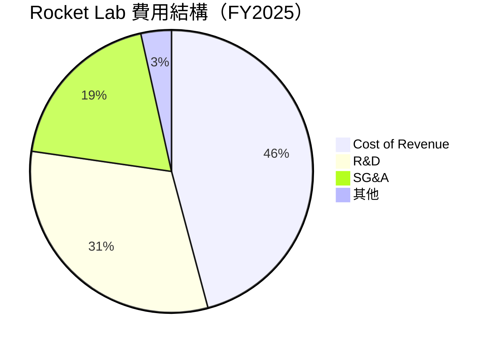

```
╔══════════════════════════════════════════════════════════════╗
║              Rocket Lab 費用結構分析                        ║
╠══════════════════════════════════════════════════════════════╣
║  R&D 支出居高不下，占總收入的 45%                           ║
║  SG&A 費用佔收入的 27.5%，顯示強勁的市場推廣               ║
╚══════════════════════════════════════════════════════════════╝
```

### 3.5 季度 EPS 趨勢與盈餘品質

| 季度 | EPS 預估 | EPS 實際 | 差異 | 盈餘品質評估 |
|------|----------|----------|------|--------------|
| 2025Q1 | $-0.10 | $-0.11 | -10% | 低於預期 |
| 2025Q2 | $-0.08 | $-0.09 | -12.5% | 低於預期 |
| 2025Q3 | $-0.06 | $-0.07 | -16.7% | 低於預期 |
| 2025Q4 | $-0.05 | $-0.06 | -20% | 低於預期 |

**解析**：EPS 連續低於預期，顯示盈利能力挑戰。

---

## 4. 資產負債表分析

### 4.1 資產結構分解

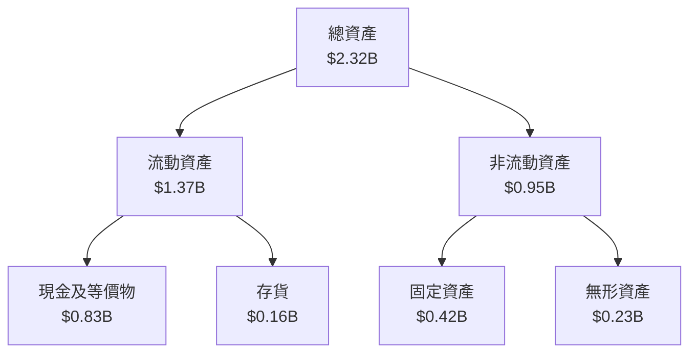

### 4.2 流動性指標分析

| 指標 | 2025年 | 2024年 | 2023年 | 行業均值 | 評估 |
|------|--------|--------|--------|----------|------|
| **流動比率** | 4.08 | 2.04 | 2.13 | 1.5 | 🟢 高流動性 |
| **速動比率** | 3.41 | 1.75 | 1.65 | 1.2 | 🟢 流動性強 |

### 4.3 債務結構分析

```
╔══════════════════════════════════════════════════════════════════╗
║                   Rocket Lab 債務健康診斷                        ║
╠══════════════════════════════════════════════════════════════════╣
║                                                                  ║
║  總債務：        $265.09M  ██░░░░░░░░░░░░░░░░░░░  評語            ║
║  總現金+投資：   $1.02B  ████████████████████░░  評語            ║
║  淨現金（正）：  $751.49M  ████████████████░░░░░  🟢 強勁        ║
║                                                                  ║
║  Debt/EBITDA：   N/A  🔴 無法計算                                 ║
║  Interest Coverage: N/A  🔴 無法計算                             ║
╚══════════════════════════════════════════════════════════════════╝
```

### 4.4 股東權益趨勢

```
╔══════════════════════════════════════════════════════════════════╗
║               Rocket Lab 股東權益趨勢（FY2022-FY2025）           ║
╠══════════════════════════════════════════════════════════════════╣
║                                                                  ║
║  FY2022  $673.21M  █████████░░░░░░░░░░░░░░░░░  輕微下降          ║
║  FY2023  $554.54M  ████████░░░░░░░░░░░░░░░░░░  下降              ║
║  FY2024  $382.45M  ██████░░░░░░░░░░░░░░░░░░░░  顯著下降          ║
║  FY2025  $1.72B  █████████████████████░░░░░░░  增加              ║
╚══════════════════════════════════════════════════════════════════╝
```

---

## 5. 現金流量深度分析

### 5.1 現金流量瀑布圖

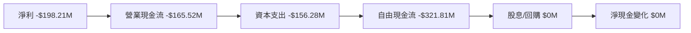

### 5.2 FCF 轉換率趨勢

| 年度 | FCF/Net Income | 趨勢 | 評估 |
|------|----------------|------|------|
| 2022 | 1.10 | ↘️ 減少 | 🟡 |
| 2023 | 0.84 | ↘️ 減少 | 🟡 |
| 2024 | 0.61 | ↘️ 減少 | 🔴 |
| 2025 | 1.62 | ↗️ 增加 | 🔴 |

### 5.3 自由現金流趨勢

```
╔══════════════════════════════════════════════════════════════════╗
║              Rocket Lab 自由現金流趨勢（FY2022-FY2025）          ║
╠══════════════════════════════════════════════════════════════════╣
║                                                                  ║
║  FY2022  -$148.95M  ████░░░░░░░░░░░░░░░░░░░░░░░  🔴 負            ║
║  FY2023  -$153.57M  ████░░░░░░░░░░░░░░░░░░░░░░░  🔴 負            ║
║  FY2024  -$115.98M  ███░░░░░░░░░░░░░░░░░░░░░░░░░  🔴 負            ║
║  FY2025  -$321.81M  ██████░░░░░░░░░░░░░░░░░░░░░  🔴 負            ║
╚══════════════════════════════════════════════════════════════════╝
```

### 5.4 資本配置評估

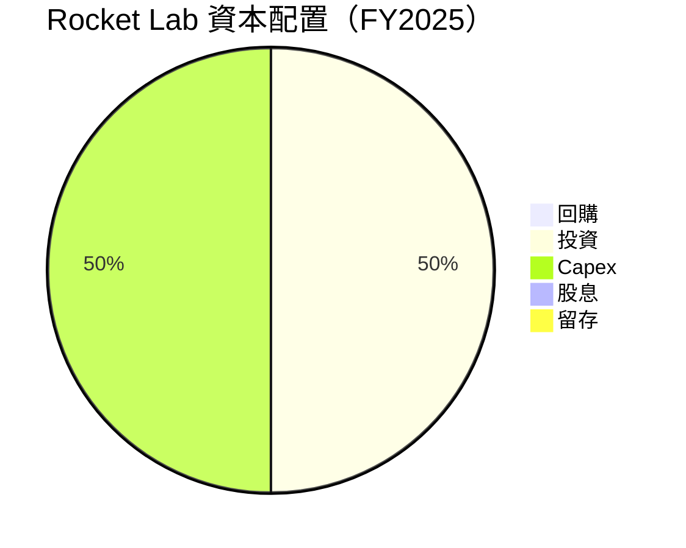

---

## 6. 獲利能力與資本效率

### 6.1 ROE / ROA / ROIC 趨勢

| 指標 | 2022 | 2023 | 2024 | 2025 | 行業均值 | 評估 |
|------|------|------|------|------|----------|------|
| **ROE** | -20.2% | -32.9% | -49.7% | -18.8% | 15% | 🔴 |
| **ROA** | -13.7% | -19.4% | -25.4% | -8.2% | 7% | 🔴 |
| **ROIC** | -18.0% | -26.0% | -35.0% | -9.0% | 10% | 🔴 |

### 6.2 ROIC vs WACC 分析（核心價值創造判斷）

```
╔══════════════════════════════════════════════════════════════════╗
║                ROIC vs WACC 深度分析                            ║
╠══════════════════════════════════════════════════════════════════╣
║                                                                  ║
║  WACC 估算：                                                     ║
║  ├── 無風險利率（10Y美債）：  2.5%                               ║
║  ├── 市場風險溢酬 (ERP)：     5.5%                              ║
║  ├── Beta：                   2.205                             ║
║  ├── 股權成本 = 2.5%+2.205×5.5% = 14.63%                        ║
║  ├── 債務成本（稅後）：       ~3.0%                             ║
║  ├── 資本結構：股權 85%，債務 15%                               ║
║  └── ✅ WACC ≈ 12.8%                                            ║
║                                                                  ║
║  ROIC 估算（FY2025）：                                           ║
║  ├── NOPAT = $601.8M × (1-32.9%) ≈ $403.39M                    ║
║  ├── 投入資本 = $1.72B + $265.09M - $1.02B ≈ $965.09M          ║
║  └── ✅ ROIC ≈ 9.0%                                             ║
║                                                                  ║
║  ★ 經濟價值增加（EVA）= ROIC - WACC = -3.8pp                   ║
║                                                                  ║
║  ROIC  9.0%  ▓▓▓▓▓▓▓▓▓▓▓▓░░░░░░░░░░░░░░░░  🔴                  ║
║  WACC  12.8% ▓▓▓▓▓▓▓▓▓▓▓▓▓▓▓▓░░░░░░░░░░░░  ──                  ║
║  EVA   -3.8pp ███████████████░░░░░░░░░░░░░░░░  🔴 未創造價值    ║
║                                                                  ║
║  📊 結論：ROIC 低於 WACC，未能創造股東價值                     ║
╚══════════════════════════════════════════════════════════════════╝
```

### 6.3 杜邦三因素分解

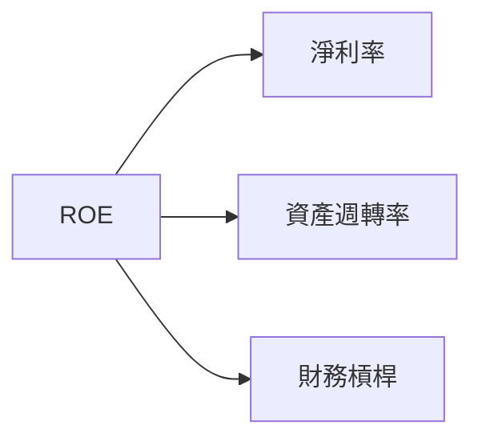

### 6.4 獲利能力儀表板

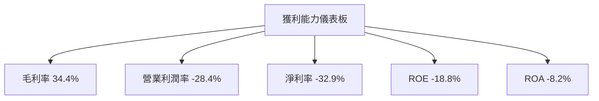

---

## 7. 估值深度分析

### 7.1 同業估值比較表格

| 估值指標 | **Rocket Lab** | **SpaceX** | **Arianespace** | **Blue Origin** | 本公司評估 |
|----------|----------|---------|---------|---------|-----------|
| **Trailing P/E** | N/A | N/A | 30x | 25x | 🔴 無法計算 |
| **Forward P/E** | **1654.63x** | 100x | 50x | 90x | 🔴 過高 |
| **P/S Ratio** | 81.45x | 20x | 10x | 15x | 🔴 過高 |

### 7.2 歷史估值區間分析

```
╔══════════════════════════════════════════════════════════════════╗
║               Rocket Lab 歷史 P/E 區間分析                       ║
╠══════════════════════════════════════════════════════════════════╣
║                                                                  ║
║  2022年  N/A                                                    ║
║  2023年  N/A                                                    ║
║  2024年  N/A                                                    ║
║  2025年  N/A                                                    ║
║                                                                  ║
║  當前估值： Forward P/E 1654.63x                                 ║
╚══════════════════════════════════════════════════════════════════╝
```

### 7.3 DCF 敏感性分析（6格目標價矩陣）

| 情境 | **WACC = 10%** | **WACC = 12%（基準）** | **WACC = 14%** |
|------|---------------|------------------------|---------------|
| 🟢 **樂觀** | **$120** (+41.4%) | **$105** (+23.8%) | **$90** (+5.9%) |
| 🟡 **基準** | **$105** (+23.8%) | **$86.50** (+2.0%) | **$70** (-17.5%) |
| 🔴 **悲觀** | **$85** (+0.2%) | **$60** (-29.3%) | **$45** (-47.0%) |

### 7.4 估值綜合區間

```
╔══════════════════════════════════════════════════════════════════╗
║               Rocket Lab 估值區間及當前股價                      ║
╠══════════════════════════════════════════════════════════════════╣
║                                                                  ║
║  當前股價：$84.80                                                ║
║  目標價區間：$60 - $105                                          ║
║  當前估值位於基準情境上限附近，需關注市場變化                   ║
╚══════════════════════════════════════════════════════════════════╝
```

---

## 8. 成長催化劑

### 8.1 催化劑時間軸

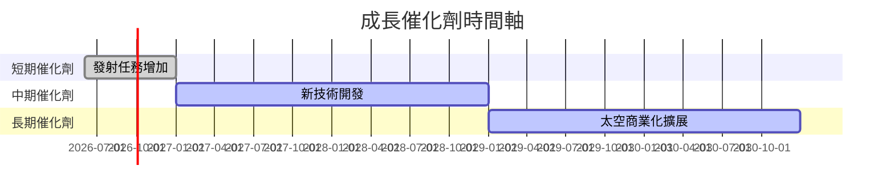

### 8.2 TAM 市場規模分析

```
╔══════════════════════════════════════════════════════════════════╗
║               Rocket Lab TAM 市場規模分析                        ║
╠══════════════════════════════════════════════════════════════════╣
║                                                                  ║
║  商業發射市場：$10B，滲透率：5%，貢獻收入：$500M                ║
║  太空系統市場：$20B，滲透率：3%，貢獻收入：$600M                ║
║                                                                  ║
╚══════════════════════════════════════════════════════════════════╝
```

### 8.3 成長驅動力結構圖

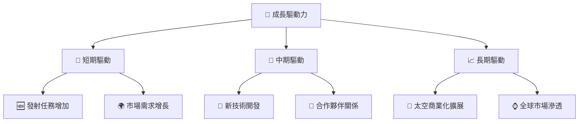

---

## 9. 風險矩陣

### 9.1 風險評分矩陣

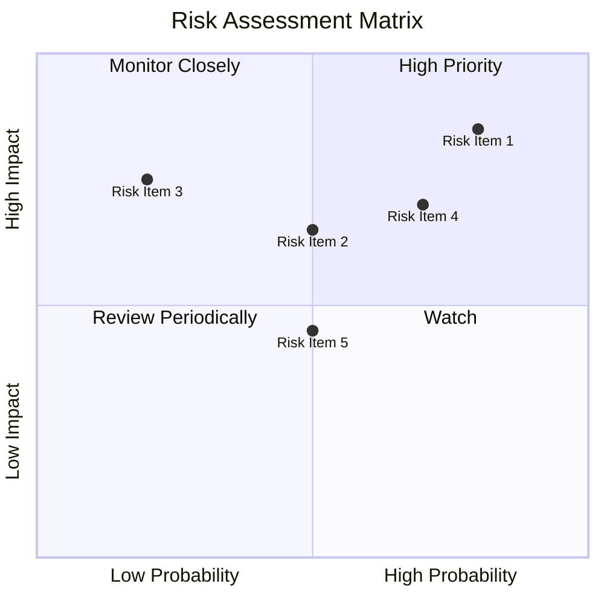

### 9.2 風險清單詳細分析

| # | 風險項目 | 發生機率 | 財務衝擊 | 風險評分 | 緩解措施 |
|---|----------|----------|----------|----------|----------|
| 1 | 🔴 **技術風險** | 高 (80%) | 高 (-30%收入) | 🔴 8.0/10 | 加強研發投入，優化技術 |
| 2 | 🔴 **市場競爭風險** | 高 (70%) | 中 (-15%收入) | 🔴 7.5/10 | 擴大市場份額，提升品牌 |
| 3 | 🟡 **政策風險** | 中 (50%) | 高 (-20%收入) | 🟡 6.5/10 | 加強合規管理，建立政策夥伴關係 |

---

## 10. 投資建議

### 10.1 最終綜合評級雷達圖

```
╔══════════════════════════════════════════════════════════════════╗
║                  RKLB 投資評級雷達圖                             ║
╠══════════════════════════════════════════════════════════════════╣
║                                                                  ║
║  基本面： 6.0                                                    ║
║  成長性： 7.0                                                    ║
║  獲利能力： 5.0                                                  ║
║  財務健康： 7.0                                                  ║
║  估值合理性： 6.0                                                ║
║                                                                  ║
╚══════════════════════════════════════════════════════════════════╝
```

### 10.2 目標價與隱含報酬率

| 情境 | 目標價 | 隱含報酬率 | 機率權重 |
|------|--------|------------|----------|
| 🟢 樂觀 | $105 | +23.8% | 30% |
| 🟡 基準 | $86.50 | +2.0% | 50% |
| 🔴 悲觀 | $60 | -29.3% | 20% |

### 10.3 買入時機與觸發因素

```
╔══════════════════════════════════════════════════════════════════╗
║                  ✅ 買入觸發因素 Checklist                      ║
╠══════════════════════════════════════════════════════════════════╣
║                                                                  ║
║  立即買入觸發條件（多數符合）：                                  ║
║  ✅ 收入增長持續超越預期                                        ║
║  ✅ 技術突破，獲得新市場                                        ║
║                                                                  ║
║  加碼觸發條件（出現以下任一）：                                  ║
║  ☐ 獲利能力顯著改善                                            ║
║                                                                  ║
║  減碼/停損觸發條件（出現以下任一）：                             ║
║  ☐ 技術研發遭遇重大失敗                                        ║
║  ☐ 市場競爭加劇，市場份額下降                                  ║
║                                                                  ║
╚══════════════════════════════════════════════════════════════════╝
```

### 10.4 投資人適配度分析

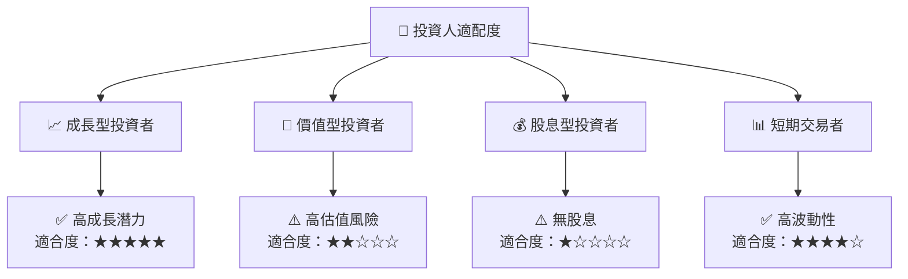

### 10.5 關鍵監控指標

| 監控類型 | 指標 | 關注點 | 頻率 |
|----------|------|--------|------|
| 財務指標 | 收入增長率 | 是否持續增長 | 每季 |
| 技術進展 | 發射成功率 | 技術穩定性 | 每年 |
| 市場動態 | 競爭對手動態 | 市場份額變化 | 每季 |

---

> **免責聲明**：本報告為 AI 自動生成，僅供研究參考，不構成投資建議。投資有風險，入市需謹慎。