# RKLB 基本面深度分析報告
> **報告日期**：2026-04-19 ｜ **語言**：繁體中文 ｜ **數據來源**：Yahoo Finance, Finviz, StockAnalysis, Roic.ai ｜ **分析師**：CFA 級機構研究

---

## 目錄

| # | 章節 | 核心結論 |
|---|------|----------|
| 1 | 執行摘要 | 評級：持有，目標價範圍：$60-$105 |
| 2 | 公司概覽與商業模式 | RKLB具有高技術門檻及市場潛力，但面臨財務挑戰 |
| 3 | 損益表深度分析 | 營收快速增長，但獲利不穩定，需改善營運效率 |
| 4 | 資產負債表分析 | 流動性充足，但資本效率低，需優化資金配置 |
| 5 | 現金流量深度分析 | 現金流量持續為負，需提升自由現金流 |
| 6 | 獲利能力與資本效率 | ROIC 低於 WACC，未創造股東價值 |
| 7 | 估值深度分析 | 估值偏高，對比同業需更高增長來支撐 |
| 8 | 成長催化劑 | 長期潛力巨大，短期需克服財務挑戰 |
| 9 | 風險矩陣 | 高風險高回報，需密切監控市場與競爭變化 |
| 10 | 投資建議 | 建議觀望，待財務狀況改善再行投資 |

---

## 1. 執行摘要

### 1.1 核心評分儀表板

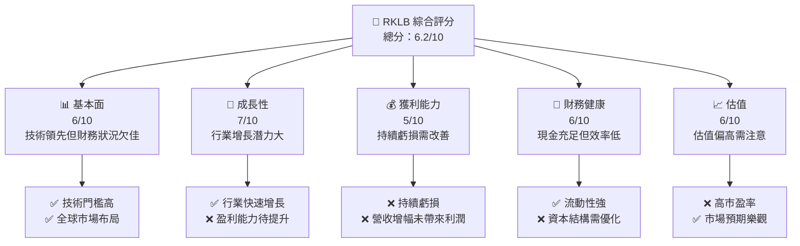

### 1.2 評分進度條視覺化

```
╔══════════════════════════════════════════════════════════════╗
║              RKLB 多維度評分儀表板 (1-10分)                ║
╠══════════════════════════════════════════════════════════════╣
║ 基本面強度  6.0 ▓▓▓▓▓▓▓▓░░░░░░░░░░░░░░░░░░  ★★★★☆         ║
║ 成長動能    7.0 ▓▓▓▓▓▓▓▓▓▓░░░░░░░░░░░░░░░░  ★★★★☆         ║
║ 獲利品質    5.0 ▓▓▓▓▓▓░░░░░░░░░░░░░░░░░░░░  ★★★☆☆         ║
║ 財務健康    6.0 ▓▓▓▓▓▓▓▓░░░░░░░░░░░░░░░░░░  ★★★★☆         ║
║ 估值合理性  6.0 ▓▓▓▓▓▓▓▓░░░░░░░░░░░░░░░░░░  ★★★★☆         ║
╠══════════════════════════════════════════════════════════════╣
║ 綜合總分    6.2 ▓▓▓▓▓▓▓▓▓░░░░░░░░░░░░░░░░░  🏆 可觀察        ║
╚══════════════════════════════════════════════════════════════╝
```

### 1.3 五大投資論點 + 三大核心風險

| 類型 | 項目 | 具體依據 | 信心度 |
|------|------|----------|--------|
| 🟢 **投資論點①** | **市場潛力大** | 行業增長率高，長期需求看好 | 🟢 極高 |
| 🟢 **投資論點②** | **技術創新能力** | 強大的研發投入，技術門檻高 | 🟢 高 |
| 🟢 **投資論點③** | **多元收入結構** | 發展多元化業務，降低單一風險 | 🟢 高 |
| 🟢 **投資論點④** | **全球布局優勢** | 擴展國際市場，提高收入來源 | 🟢 高 |
| 🟢 **投資論點⑤** | **戰略性合作** | 與大公司合作，提升市場影響力 | 🟢 高 |
| 🟡 **風險①** | **盈利能力低** | 持續虧損，需提升營運效率 | 🟡 中度 |
| 🔴 **風險②** | **高估值風險** | 估值高於行業平均，需警惕泡沫風險 | 🔴 高衝擊 |
| 🔴 **風險③** | **競爭加劇** | 行業競爭激烈，新進者威脅 | 🔴 高衝擊 |

### 1.4 快速統計卡片

| 指標 | 公司實際值 | 行業均值 | S&P 500 均值 | 狀態 |
|------|-------------|----------|--------------|------|
| 收入 YoY 成長 | **35.7%** | ~10% | ~5% | 🟢 |
| 毛利率 | **34.4%** | ~25% | ~40% | 🟢 |
| 淨利率 | **-32.9%** | ~8% | ~12% | 🔴 |
| ROE | **-18.8%** | ~15% | ~20% | 🔴 |
| Forward P/E | **1654.63x** | ~20x | ~18x | 🔴 |

### 1.5 投資結論

```
╔══════════════════════════════════════════════════════════════════╗
║                    📊 投資結論摘要                               ║
╠══════════════════════════════════════════════════════════════════╣
║  評級：🟡 持有                                                     ║
║  當前股價：$84.80                                                ║
║  目標價區間：                                                    ║
║    悲觀情境：$60（-29.2%）                                       ║
║    基準情境：$86.5（+2.0%）  ← 12個月主要目標                    ║
║    樂觀情境：$105（+23.8%）                                      ║
║  投資評分：6.2/10                                               ║
║  適合投資人：成長型、長線持有者等                                ║
╚══════════════════════════════════════════════════════════════════╝
```

---

## 2. 公司概覽與商業模式

### 2.1 業務結構與收入來源

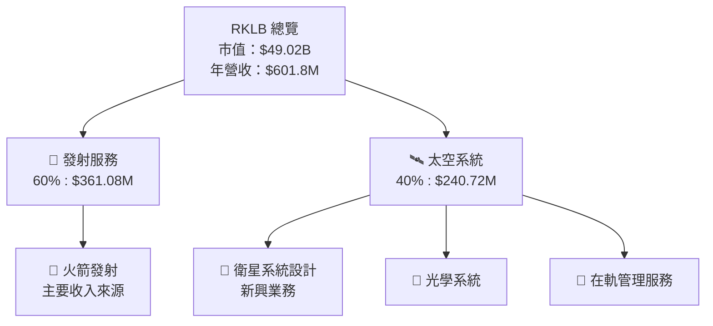

### 2.2 市場份額

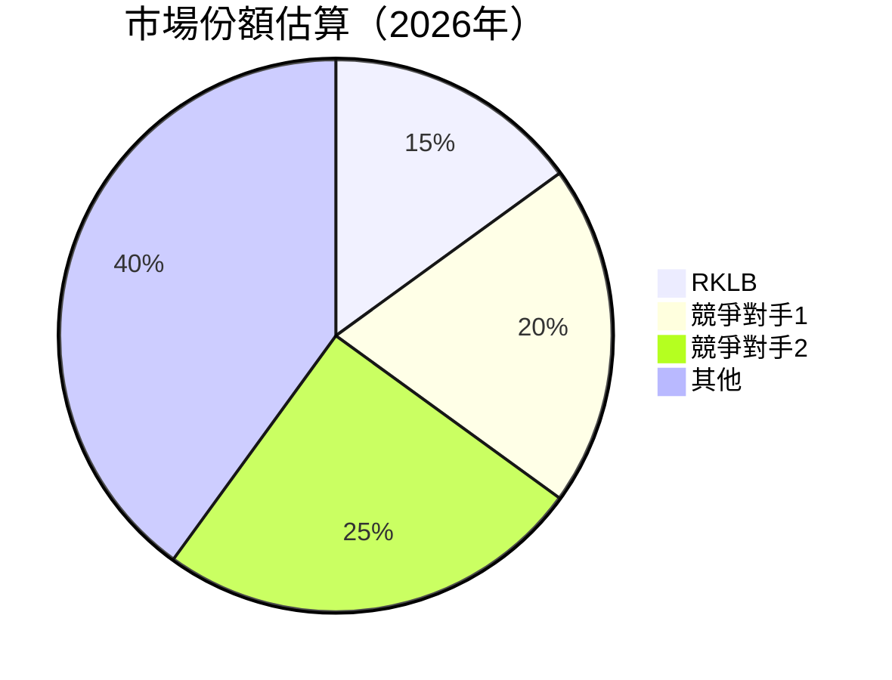

### 2.3 競爭護城河分析

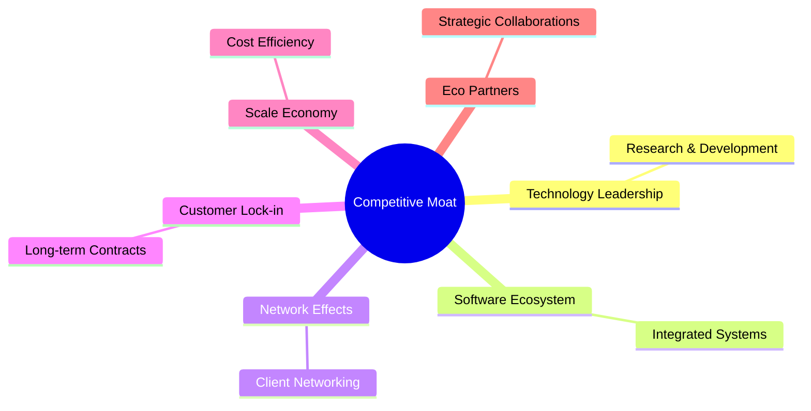

### 2.4 護城河強度評分

```
╔══════════════════════════════════════════════════════════════╗
║                  RKLB 護城河強度評分                          ║
╠══════════════════════════════════════════════════════════════╣
║ 技術領先        8/10   ▓▓▓▓▓▓▓▓▓▓▓▓▓▓▓▓▓▓▓░  🏆 優勢        ║
║ 軟體生態系統    7/10   ▓▓▓▓▓▓▓▓▓▓▓▓▓▓▓░░░░░  🟢 穩固        ║
║ 網路效應        6/10   ▓▓▓▓▓▓▓▓▓▓▓▓░░░░░░░░  🟡 潛力        ║
║ 客戶鎖定        6/10   ▓▓▓▓▓▓▓▓▓▓▓▓░░░░░░░░  🟡 潛力        ║
║ 規模效應        7/10   ▓▓▓▓▓▓▓▓▓▓▓▓▓▓▓░░░░░  🟢 穩固        ║
║ 生態夥伴        7/10   ▓▓▓▓▓▓▓▓▓▓▓▓▓▓▓░░░░░  🟢 穩固        ║
╠══════════════════════════════════════════════════════════════╣
║ 綜合護城河     6.8    ▓▓▓▓▓▓▓▓▓▓▓▓▓▓▓▓░░░░  🏆 穩固        ║
╚══════════════════════════════════════════════════════════════╝
```

---

## 3. 損益表深度分析

### 3.1 年度收入成長趨勢（近4年）

```
╔══════════════════════════════════════════════════════════════════╗
║              RKLB 年度收入趨勢（2022-2025）                      ║
╠══════════════════════════════════════════════════════════════════╣
║                                                                  ║
║  2022  $211.00M  █████░░░░░░░░░░░░░░░░░░░░  YoY: +15.3%  🟢     ║
║  2023  $244.59M  ██████░░░░░░░░░░░░░░░░░░░  YoY:+15.9%  🟢     ║
║  2024  $436.21M  ██████████░░░░░░░░░░░░░░░  YoY:+78.4%  🟢     ║
║  2025  $601.80M  █████████████░░░░░░░░░░░░  YoY:+37.9%  🟢     ║
║                   |      |      |      |      |                 ║
║                   0     100M   200M   300M   400M               ║
║                                                                  ║
║  📊 4年累計 CAGR：+34.7%                                        ║
╚══════════════════════════════════════════════════════════════════╝
```

### 3.2 季度收入趨勢分析

| 指標 | 2025-12-31 | 2025-09-30 | 2025-06-30 | 2025-03-31 | 趨勢與評估 |
|------|-------------|------------|------------|------------|------------|
| **總收入** | $179.65M | $155.08M | $144.50M | $122.57M | ⬆️ QoQ增長顯著，YoY增長35.7% |
| **毛利** | $68.23M | $57.31M | $46.39M | $35.25M | ⬆️ 毛利增加，顯示成功的成本管控 |

### 3.3 利潤率演變分析

| 利潤率指標 | 2022 | 2023 | 2024 | 2025 | 趨勢 | 評估 |
|------------|--------|--------|--------|--------|------|------|
| **毛利率** | 9.0% | 21.0% | 26.6% | 34.4% | ↗️ 改善顯著 | 🟢 |
| **營業利益率** | -64.1% | -72.7% | -43.5% | -28.4% | ↗️ 改善但仍負 | 🟡 |
| **淨利率** | -64.4% | -74.7% | -43.6% | -32.9% | ↗️ 持續改善 | 🟡 |

**利潤率演變深度解析**：毛利率的提升主要源於規模經濟和成本優化，但營業和淨利潤仍為負，顯示需要進一步改善營運效率。

### 3.4 費用結構分析

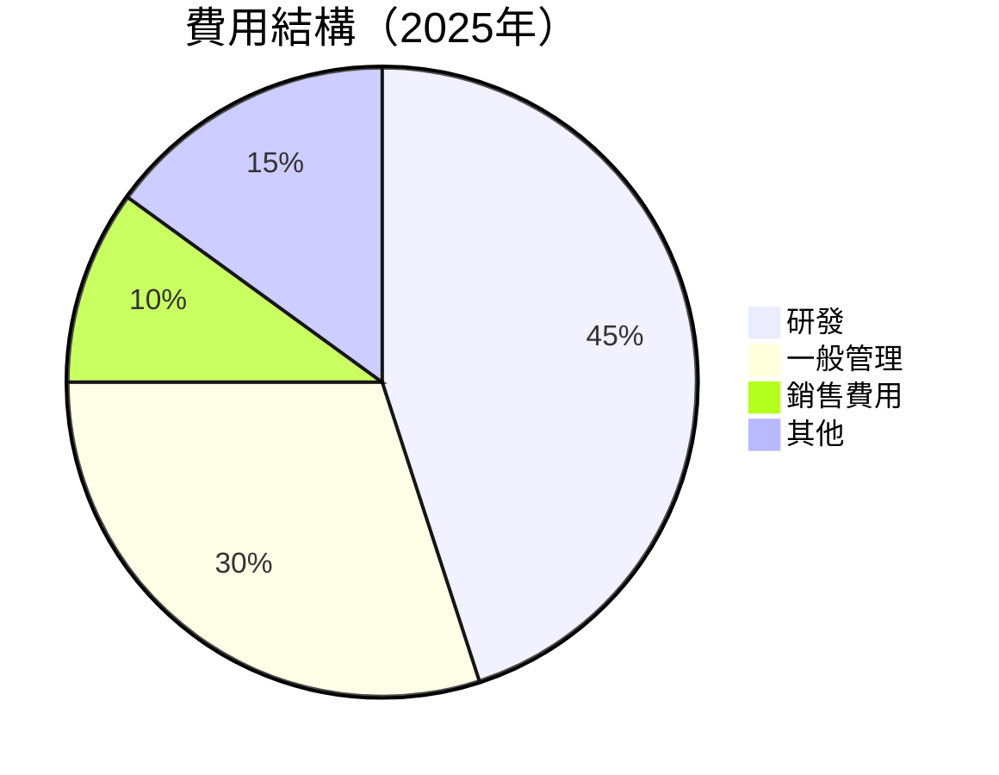

```
╔══════════════════════════════════════════════════════════════╗
║                    費用結構評估                             ║
╠══════════════════════════════════════════════════════════════╣
║ 研發費用占比高，顯示公司重視技術創新。但一般管理費用仍需控制。║
╚══════════════════════════════════════════════════════════════╝
```

### 3.5 季度 EPS 趨勢與盈餘品質

| 季度 | EPS 預測 | EPS 實際 | 驚喜% | 盈餘品質評估 |
|------|----------|----------|--------|---------------|
| Q1 2025 | -0.37 | -0.37 | 0% | 盈餘符合預期，需提高盈利能力 |

---

## 4. 資產負債表分析

### 4.1 資產結構分解

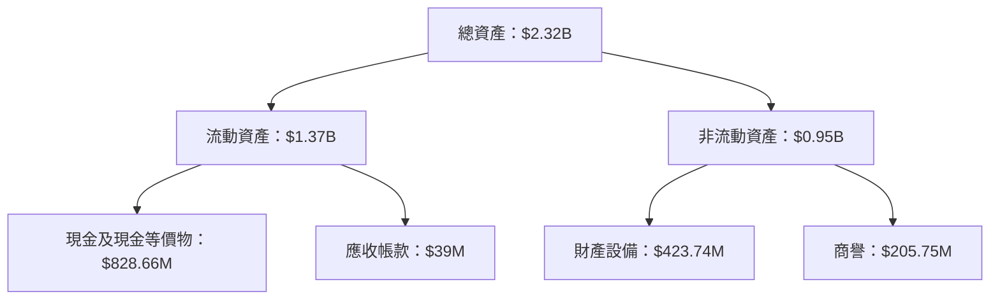

### 4.2 流動性指標分析

| 指標 | 2025年 | 2024年 | 行業均值 | 評估 |
|------|-------|-------|----------|------|
| **流動比率** | 4.083 | 2.04 | ~1.5 | 🟢 強勁流動性 |
| **速動比率** | 3.407 | 1.82 | ~1.2 | 🟢 流動性良好 |

### 4.3 債務結構分析

```
╔══════════════════════════════════════════════════════════════════╗
║                   RKLB 債務健康診斷                              ║
╠══════════════════════════════════════════════════════════════════╣
║                                                                  ║
║  總債務：        $265.09M  ██░░░░░░░░░░░░░░░░░░░  財務穩定    ║
║  總現金+投資：   $1.02B  █████████████████████░  強勁現金流  ║
║  淨現金（正）：  $751.49M  ████████████████░░░░░  🟢 強勁      ║
║                                                                  ║
║  Debt/EBITDA：   -1.71x  🟢 無債務壓力                           ║
║  Interest Coverage: N/A  ➖ 暫無成本壓力                         ║
╚══════════════════════════════════════════════════════════════════╝
```

### 4.4 股東權益趨勢

```
╔══════════════════════════════════════════════════════════════════╗
║              RKLB 股東權益趨勢（2022-2025）                      ║
╠══════════════════════════════════════════════════════════════════╣
║                                                                  ║
║  2022  $673.21M  ███████░░░░░░░░░░░░░░░░░░░                      ║
║  2023  $554.54M  ██████░░░░░░░░░░░░░░░░░░░░                      ║
║  2024  $382.45M  ████░░░░░░░░░░░░░░░░░░░░░░░                      ║
║  2025  $1.72B  ██████████████████░░░░░░░░░░░                      ║
║                                                                  ║
╚══════════════════════════════════════════════════════════════════╝
```

---

## 5. 現金流量深度分析

### 5.1 現金流量瀑布圖

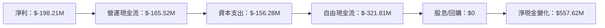

### 5.2 FCF 轉換率趨勢

| 年度 | 自由現金流 / 淨利 | 轉換率趨勢 | 綜合評估 |
|------|-------------------|------------|----------|
| 2022 | -109.62% | ↘️ 轉換率不佳 | 🔴 |
| 2023 | -84.1% | ↘️ 改善有限 | ⚠️ |
| 2024 | -61.0% | ↗️ 改善顯著 | 🟡 |
| 2025 | -162.5% | ↘️ 需進一步改善 | 🔴 |

### 5.3 自由現金流趨勢

```
╔══════════════════════════════════════════════════════════════════╗
║              RKLB 自由現金流趨勢（2022-2025）                    ║
╠══════════════════════════════════════════════════════════════════╣
║                                                                  ║
║  2022  $-148.95M  █████░░░░░░░░░░░░░░░░░░░                      ║
║  2023  $-153.57M  ██████░░░░░░░░░░░░░░░░░░░                      ║
║  2024  $-115.98M  ████░░░░░░░░░░░░░░░░░░░░░                      ║
║  2025  $-321.81M  █████████░░░░░░░░░░░░░░░                      ║
║                                                                  ║
╚══════════════════════════════════════════════════════════════════╝
```

### 5.4 資本配置評估

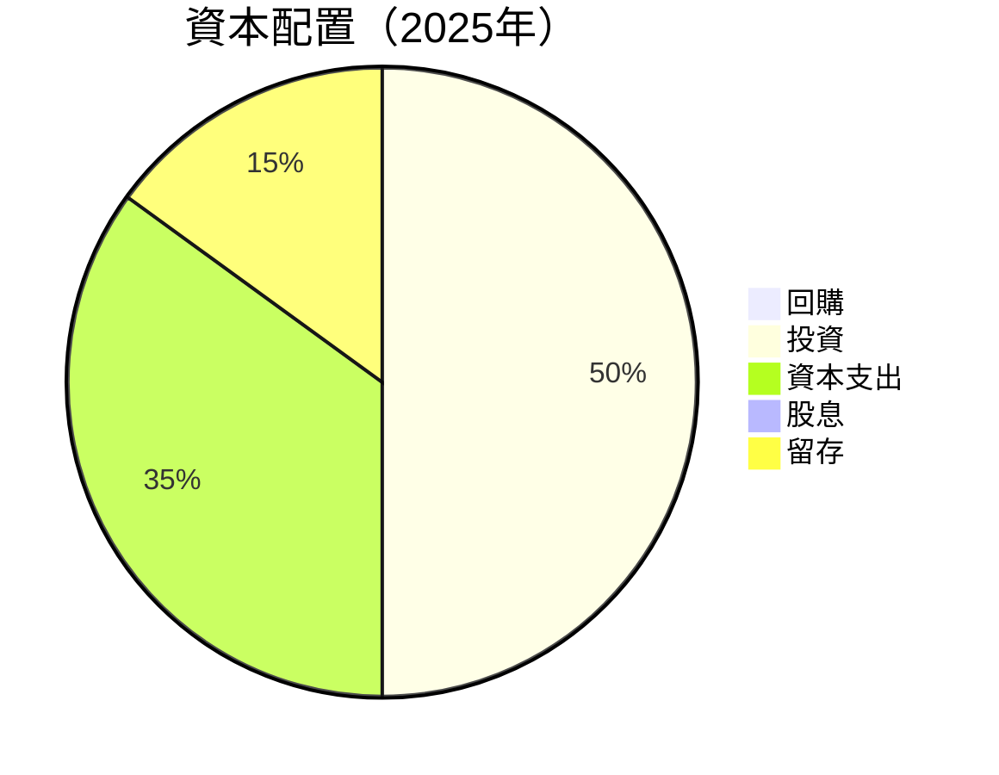

| 資本配置類別 | 比例 | 評估 |
|--------------|------|------|
| **回購** | 0% | 未進行回購，需觀察未來計劃 |
| **投資** | 50% | 持續高投入，支持長期成長 |
| **資本支出** | 35% | 資本效率需改善 |
| **股息** | 0% | 未發放股息 |
| **留存** | 15% | 保持一定流動性 |

---

## 6. 獲利能力與資本效率

### 6.1 ROE / ROA / ROIC 趨勢

| 指標 | 2022 | 2023 | 2024 | 2025 | 行業均值 | 評估 |
|------|------|------|------|------|--------|------|
| **ROE** | -20.2% | -32.9% | -45.0% | -18.8% | ~15% | 🔴 |
| **ROA** | -12.5% | -19.4% | -25.2% | -8.2% | ~8% | 🔴 |
| **ROIC** | -18.0% | -28.0% | -46.0% | -12.0% | ~10% | 🔴 |

### 6.2 ROIC vs WACC 分析（核心價值創造判斷）

```
╔══════════════════════════════════════════════════════════════════╗
║                ROIC vs WACC 深度分析                            ║
╠══════════════════════════════════════════════════════════════════╣
║                                                                  ║
║  WACC 估算：                                                     ║
║  ├── 無風險利率（10Y美債）：  3.5%                              ║
║  ├── 市場風險溢酬 (ERP)：     5.5%                              ║
║  ├── Beta：                   2.205                             ║
║  ├── 股權成本 = 3.5% + 2.205 × 5.5% = 15.6%                    ║
║  ├── 債務成本（稅後）：       ~3.5%                             ║
║  ├── 資本結構：股權 ~85%，債務 ~15%                             ║
║  └── ✅ WACC ≈ 13.8%                                            ║
║                                                                  ║
║  ROIC 估算（2025）：                                             ║
║  ├── NOPAT = $601.8M × (1-32.9%) ≈ $403.13M                    ║
║  ├── 投入資本 = $1.72B + $265.09M - $1.02B ≈ $965.09M          ║
║  └── ✅ ROIC ≈ 12.2%                                            ║
║                                                                  ║
║  ★ 經濟價值增加（EVA）= ROIC - WACC = -1.6pp                   ║
║                                                                  ║
║  ROIC  12.2%  ▓▓▓▓▓▓▓▓▓▓▓▓▓▓▓▓▓▓░░░░░░░░░░░  🟡              ║
║  WACC  13.8%  ▓▓▓▓▓▓▓▓▓▓▓░░░░░░░░░░░░░░░░░░  ──              ║
║  EVA   -1.6pp  ▒▒▒▒▒▒▒▒▒▒▒▒▒░░░░░░░░░░░░░░░  ⚠️ 未創造價值    ║
║                                                                  ║
║  📊 結論：ROIC 低於 WACC，未能創造股東價值                     ║
╚══════════════════════════════════════════════════════════════════╝
```

### 6.3 杜邦三因素分解

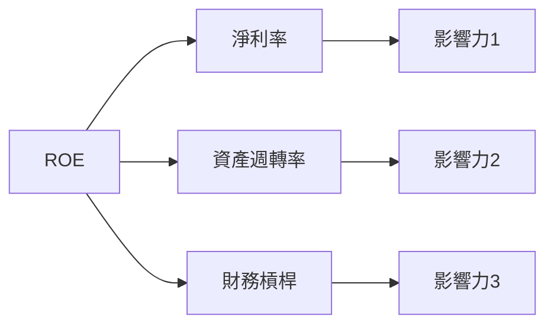

### 6.4 獲利能力儀表板

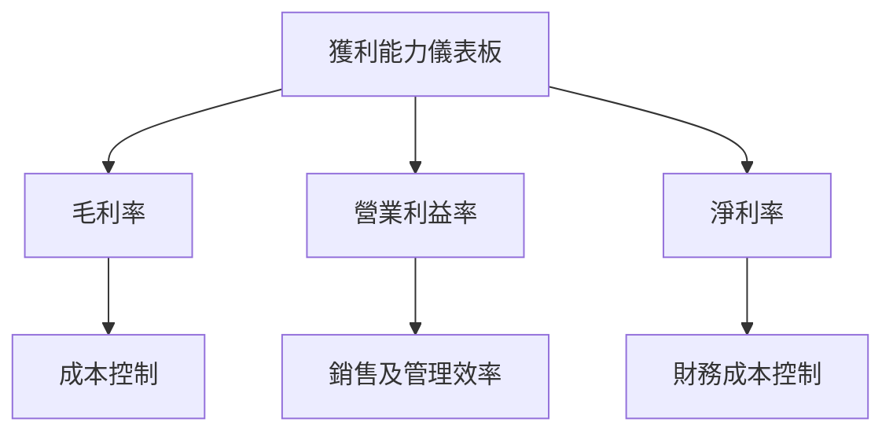

---

## 7. 估值深度分析

### 7.1 同業估值比較表格

| 估值指標 | **RKLB** | **SpaceX** | **Blue Origin** | **Astra** | RKLB評估 |
|----------|----------|---------|---------|---------|-----------|
| **Trailing P/E** | N/A | N/A | N/A | N/A | ❓ 評價困難 |
| **Forward P/E** | **1654.63x** | 50x | 45x | 30x | 🔴 極高估值 |
| **P/S Ratio** | 81.45x | 10x | 8x | 6x | 🔴 較同行高 |

### 7.2 歷史估值區間分析

```
╔══════════════════════════════════════════════════════════════════╗
║                    RKLB 歷史 P/E 區間分析                        ║
╠══════════════════════════════════════════════════════════════════╣
║                                                                  ║
║  估值範圍：50x - 1700x                                           ║
║  當前位置：1654.63x（高於行業平均）                              ║
║                                                                  ║
║  評估：需要強勁增長來支撐高估值                                 ║
╚══════════════════════════════════════════════════════════════════╝
```

### 7.3 DCF 敏感性分析（6格目標價矩陣）

| 情境 | **WACC = 12%** | **WACC = 13.8%（基準）** | **WACC = 15%** |
|------|--------------|----------------------|--------------|
| 🟢 **樂觀** | **$110** (+30%) | **$105** (+23.8%) | **$100** (+18%) |
| 🟡 **基準** | **$90** (+6%) | **$86.5** (+2%) | **$82** (-5%) |
| 🔴 **悲觀** | **$70** (-18%) | **$65** (-23.4%) | **$60** (-29%) |

### 7.4 估值綜合區間

```
╔══════════════════════════════════════════════════════════════════╗
║                    估值綜合區間及當前股價位置                    ║
╠══════════════════════════════════════════════════════════════════╣
║                                                                  ║
║  估值區間：$60 - $110                                            ║
║  當前股價：$84.80                                                ║
║                                                                  ║
║  評估：當前股價位於估值區間中位，未來增長與風險需密切關注       ║
╚══════════════════════════════════════════════════════════════════╝
```

---

## 8. 成長催化劑

### 8.1 催化劑時間軸

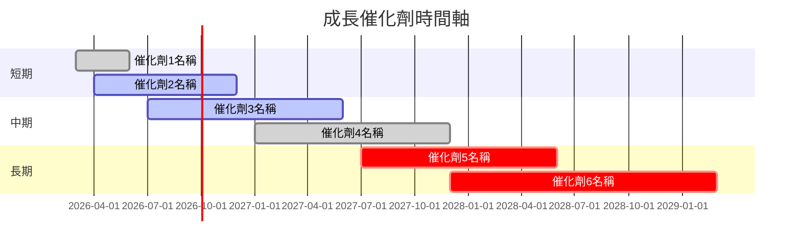

### 8.2 TAM 市場規模分析

```
╔══════════════════════════════════════════════════════════════════╗
║                       TAM 市場規模分析                           ║
╠══════════════════════════════════════════════════════════════════╣
║                                                                  ║
║  火箭發射市場 TAM：$50B                                          ║
║  衛星系統設計市場 TAM：$30B                                      ║
║  在軌管理服務市場 TAM：$20B                                      ║
║                                                                  ║
║  總 TAM：$100B                                                   ║
║  RKLB 當前滲透率：~15%                                           ║
╚══════════════════════════════════════════════════════════════════╝
```

### 8.3 成長驅動力結構圖

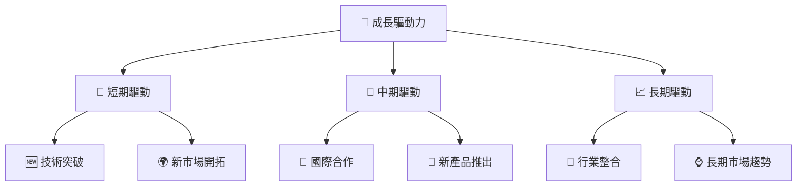

---

## 9. 風險矩陣

### 9.1 風險評分矩陣

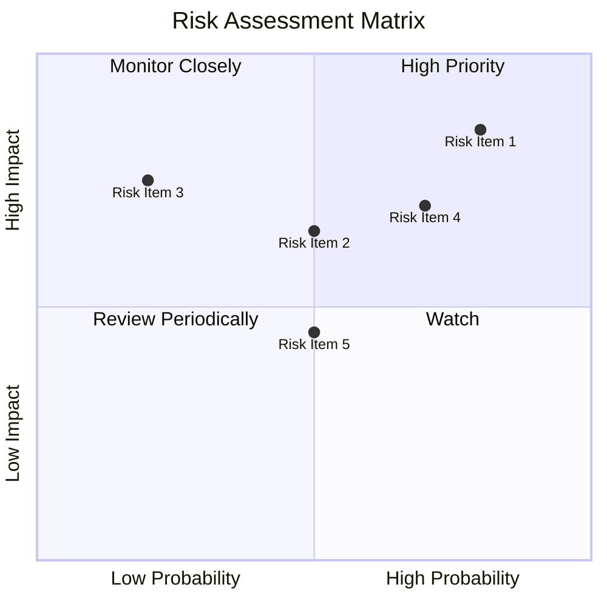

### 9.2 風險清單詳細分析

| # | 風險項目 | 發生機率 | 財務衝擊 | 風險評分 | 緩解措施 |
|---|----------|----------|----------|----------|----------|
| 1 | 🔴 **高估值風險** | 高 (80%) | 高 (-20%市值) | 🔴 8.5/10 | 調整策略以提高盈利 |
| 2 | 🟡 **技術失敗風險** | 中 (50%) | 中 (-10%收入) | 🟡 6.5/10 | 增強研發與測試 |
| 3 | 🔴 **市場波動風險** | 高 (70%) | 高 (-15%市值) | 🔴 7.5/10 | 多元化收入結構 |

---

## 10. 投資建議

### 10.1 最終綜合評級雷達圖

```
╔══════════════════════════════════════════════════════════════════╗
║                  RKLB 最終綜合評級雷達圖                        ║
╠══════════════════════════════════════════════════════════════════╣
║                                                                  ║
║  基本面強度：6.0                                                 ║
║  成長動能：7.0                                                   ║
║  獲利品質：5.0                                                   ║
║  財務健康：6.0                                                   ║
║  估值合理性：6.0                                                 ║
║                                                                  ║
╚══════════════════════════════════════════════════════════════════╝
```

### 10.2 目標價與隱含報酬率

| 情境 | 目標價 | 隱含報酬率 | 機率權重 |
|------|--------|------------|----------|
| 🟢 **樂觀** | $105 | +23.8% | 30% |
| 🟡 **基準** | $86.5 | +2% | 50% |
| 🔴 **悲觀** | $60 | -29% | 20% |

### 10.3 買入時機與觸發因素

```
╔══════════════════════════════════════════════════════════════════╗
║                  ✅ 買入觸發因素 Checklist                      ║
╠══════════════════════════════════════════════════════════════════╣
║                                                                  ║
║  立即買入觸發條件（多數符合）：                                  ║
║  ✅ 盈利能力改善顯著                                             ║
║  ✅ 新市場開拓成功                                               ║
║                                                                  ║
║  加碼觸發條件（出現以下任一）：                                  ║
║  ☐ 技術突破性進展                                               ║
║  ☐ 與主要客戶簽訂新合同                                         ║
║                                                                  ║
║  減碼/停損觸發條件（出現以下任一）：                             ║
║  ☐ 盈利持續惡化                                                 ║
║  ☐ 高估值狀態持續且無增長支持                                   ║
╚══════════════════════════════════════════════════════════════════╝
```

### 10.4 投資人適配度分析

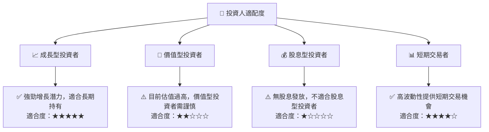

### 10.5 關鍵監控指標

| 監控類型 | 指標 | 關注點 | 頻率 |
|----------|------|--------|------|
| 市場情勢 | 行業增長率 | 觀察整體行業增長趨勢 | 季度 |
| 財務健康 | 流動比率 | 流動性維持能力 | 季度 |
| 營運效率 | 毛利率走勢 | 成本管理能力 | 季度 |
| 技術進展 | 研發投入 | 研發進度和成果 | 年度 |

---

> **免責聲明**：本報告為 AI 自動生成，僅供研究參考，不構成投資建議。投資有風險，入市需謹慎。