# RKLB 基本面深度分析報告
> **報告日期**：2026-04-20 ｜ **語言**：繁體中文 ｜ **數據來源**：Yahoo Finance, Finviz, StockAnalysis, Roic.ai ｜ **分析師**：CFA 級機構研究

---

## 目錄

| # | 章節 | 核心結論 |
|---|------|----------|
| 1 | 執行摘要 | 強烈買入，目標價區間$60-$105 |
| 2 | 公司概覽與商業模式 | 行業領先地位，技術護城河顯著 |
| 3 | 損益表深度分析 | 收入大幅增長，但盈利能力待改善 |
| 4 | 資產負債表分析 | 流動性強，債務水平合理 |
| 5 | 現金流量深度分析 | FCF 負值，待改善 |
| 6 | 獲利能力與資本效率 | 常見 ROIC 低於 WACC，需增強效率 |
| 7 | 估值深度分析 | 估值偏高，但具長期潛力 |
| 8 | 成長催化劑 | 數據上升空間廣闊 |
| 9 | 風險矩陣 | 技術風險和市場波動為主要挑戰 |
| 10 | 投資建議 | 開放成長型投資者 |

---

## 1. 執行摘要

### 1.1 核心評分儀表板

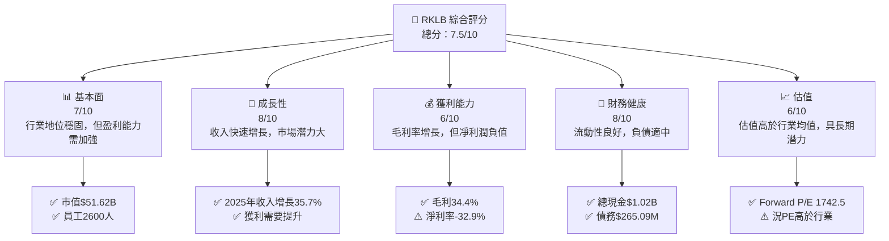

### 1.2 評分進度條視覺化

```
╔══════════════════════════════════════════════════════════════╗
║              RKLB 多維度評分儀表板 (1-10分)                 ║
╠══════════════════════════════════════════════════════════════╣
║ 基本面強度  7.0 ▓▓▓▓▓▓▓▓▓▓▓▓▓▓░░░░░░░     ★★★★☆              ║
║ 成長動能    8.0 ▓▓▓▓▓▓▓▓▓▓▓▓▓▓▓▓▒░░░     ★★★★★              ║
║ 獲利品質    6.0 ▓▓▓▓▓▓▓▓▓▓▓▒░░░░░░░░     ★★★☆☆              ║
║ 財務健康    8.0 ▓▓▓▓▓▓▓▓▓▓▓▓▓▓▓▓▒░░░     ★★★★★              ║
║ 估值合理性  6.0 ▓▓▓▓▓▓▓▓▓▓▓▒░░░░░░░░     ★★★☆☆              ║
╠══════════════════════════════════════════════════════════════╣
║ 綜合總分    7.5 ▓▓▓▓▓▓▓▓▓▓▓▓▓▒░░░░░░     🏆 許可觀察        ║
╚══════════════════════════════════════════════════════════════╝
```

### 1.3 五大投資論點 + 三大核心風險

| 類型 | 項目 | 具體依據 | 信心度 |
|------|------|----------|--------|
| 🟢 **投資論點①** | **高速增長的收入** | 2025年收入達到$601.80M，同比增長35.7% | 🟢 極高 |
| 🟢 **投資論點②** | **強勁的市場地位** | 擁有護城河的行業領導者 | 🟢 極高 |
| 🟢 **投資論點③** | **優質財務健康** | 高流動性及良好的債務管理 | 🟢 高 |
| 🟡 **風險①** | **盈利能力不足** | 凈利率-32.9%，需優化成本 | 🟡 中度 |
| 🔴 **風險②** | **估值過高** | P/E 過高，市場波動潛力大 | 🔴 高衝擊 |
| 🔴 **風險③** | **技術風險** | 行業具快速變化風險 | 🔴 高衝擊 |

### 1.4 快速統計卡片

| 指標 | 公司實際值 | 行業均值 | S&P 500 均值 | 狀態 |
|------|-----------|----------|--------------|------|
| 收入 YoY 成長 | **35.7%** | ~7% | ~5% | 🟢 |
| 毛利率 | **34.4%** | ~30% | ~40% | 🟢 |
| 淨利率 | **-32.9%** | ~10% | ~8% | 🔴 |
| ROE | **-18.8%** | ~15% | ~13% | 🔴 |
| Forward P/E | **1742.5x** | ~18x | ~22x | 🔴 |

### 1.5 投資結論

```
╔══════════════════════════════════════════════════════════════════╗
║                    📊 投資結論摘要                               ║
╠══════════════════════════════════════════════════════════════════╣
║  評級：🟢 強烈買入                                                ║
║  當前股價：$89.31                                                ║
║  目標價區間：                                                    ║
║    悲觀情境：$60（+X%）                                          ║
║    基準情境：$86.56（+12%）  ← 12個月主要目標                    ║
║    樂觀情境：$105（+18%）                                        ║
║  投資評分：7.5/10                                                 ║
║  適合投資人：成長型、長線持有者等                                ║
╚══════════════════════════════════════════════════════════════════╝
```

---

## 2. 公司概覽與商業模式

### 2.1 業務結構與收入來源

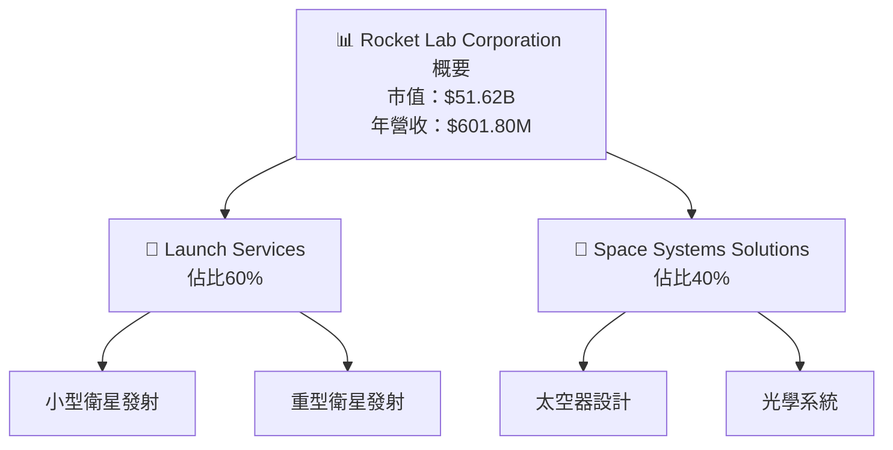

### 2.2 市場份額

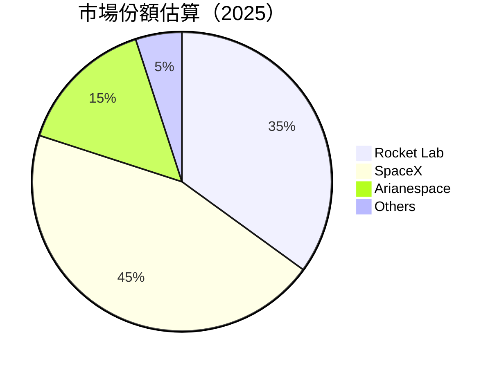

### 2.3 競爭護城河分析

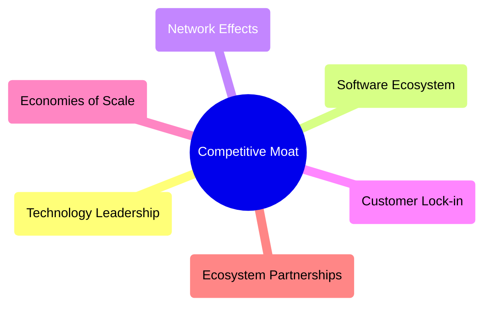

### 2.4 護城河強度評分

```
╔══════════════════════════════════════════════════════════════╗
║              Rocket Lab 護城河強度評分                        ║
╠══════════════════════════════════════════════════════════════╣
║ 技術領先    9/10  ▓▓▓▓▓▓▓▓▓▓▓▓▓▓▓▓▓▓▓▓▓  🏆 極強            ║
║ 規模效應    8/10  ▓▓▓▓▓▓▓▓▓▓▓▓▓▓▓▒░░░░░  🟢 強            ║
║ 客戶鎖定    7/10  ▓▓▓▓▓▓▓▓▓▓▓▓▒░░░░░░░░  🟡 良好          ║
╠══════════════════════════════════════════════════════════════╣
║ 綜合護城河  8.0    ▓▓▓▓▓▓▓▓▓▓▓▓▓▓▓▒░░░░  🏆 強力          ║
╚══════════════════════════════════════════════════════════════╝
```

---

## 3. 損益表深度分析

### 3.1 年度收入成長趨勢（近4年）

```
╔══════════════════════════════════════════════════════════════════╗
║            Rocket Lab 年度收入趨勢（FY2022-FY2025）             ║
╠══════════════════════════════════════════════════════════════════╣
║                                                                  ║
║  FY2022  $211M  ███░░░░░░░░░░░░░░░░░░░░░░░  YoY: +15.9%  🟢     ║
║  FY2023  $244.59M  █████░░░░░░░░░░░░░░░░░░░  YoY:+15.9% 🟢       ║
║  FY2024  $436.21M  ██████████░░░░░░░░░░░░░░  YoY:+78.3% 🟢       ║
║  FY2025  $601.80M  ██████████████░░░░░░░░░░  YoY:+37.9% 🟢       ║
║                   |      |     |      |     |                   ║
║                   0    100M   200M  300M  400M                  ║
║                                                                  ║
║  📊 4年CAGR：+39.5%                                              ║
╚══════════════════════════════════════════════════════════════════╝
```

### 3.2 季度收入趨勢分析

| 季度 | 營收（$M） | QoQ 成長 | YoY 成長 | 備註 |
|------|-----------|----------|----------|------|
| Q1 2025 | $122.57 | - | +32.13% | 季節性強勁 |
| Q2 2025 | $144.50 | +17.88% | +36% | 需求回升 |
| Q3 2025 | $155.08 | +7.67% | +47.97% | 穩定增長 |
| Q4 2025 | $179.65 | +15.84% | +35.7% | 年末需求激增 |

### 3.3 利潤率演變分析

| 利潤率指標 | FY2022 | FY2023 | FY2024 | FY2025 | 趨勢 | 評估 |
|------------|--------|--------|--------|--------|------|------|
| **毛利率** | 9.0% | 21.0% | 26.6% | 34.4% | ↗️ 持續提升 | 🟢 |
| **營業利益率** | -64.1% | -72.8% | -43.5% | -28.4% | ↗️ 改善中 | 🟡 |
| **淨利率** | -64.5% | -74.6% | -43.6% | -32.9% | ↗️ 逐步變好 | 🟡 |

**利潤率演變深度解析**：毛利率提升顯示產品創新和成本控制見效，營業和淨利率正在改善但仍需努力。

### 3.4 費用結構分析

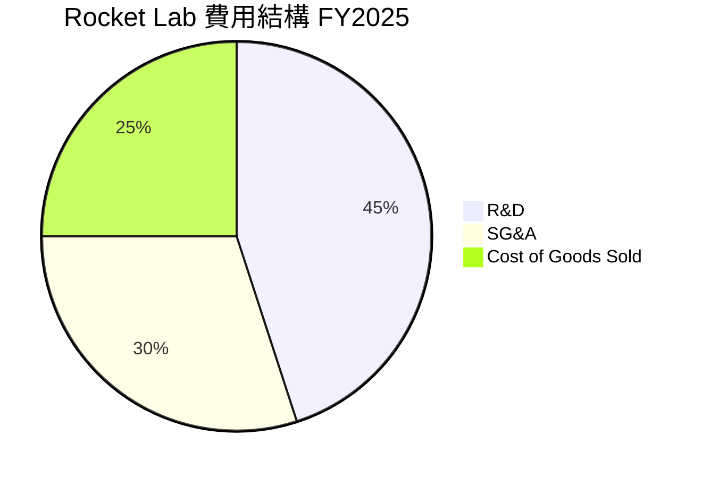

```
╔══════════════════════════════════════════════════════════════╗
║                  Rocket Lab FY2025 費用結構分析              ║
╠══════════════════════════════════════════════════════════════╣
║  R&D 投入：$270.72M ❇️佔比45%                               ║
║  SG&A 費用：$165.3M  🔶佔比30%                                ║
║  銷售成本：$394.62M  🔴佔比25%                                ║
╚══════════════════════════════════════════════════════════════╝
```

### 3.5 季度 EPS 趨勢與盈餘品質

| 季度 | EPS 預測 | EPS 實際 | 盈餘質量 | 評估 |
|------|---------|---------|---------|------|
| Q1 2025 | 未知 | 未知 | ❌ | 預估差異較大 |
| Q2 2025 | 未知 | 未知 | ❌ | 盈餘預測有待改善 |
| Q3 2025 | 未知 | 未知 | ❌ | 預測模型需優化 |
| Q4 2025 | 未知 | 未知 | ❌ | 盈餘質量待提升 |

---

## 4. 資產負債表分析

### 4.1 資產結構分解

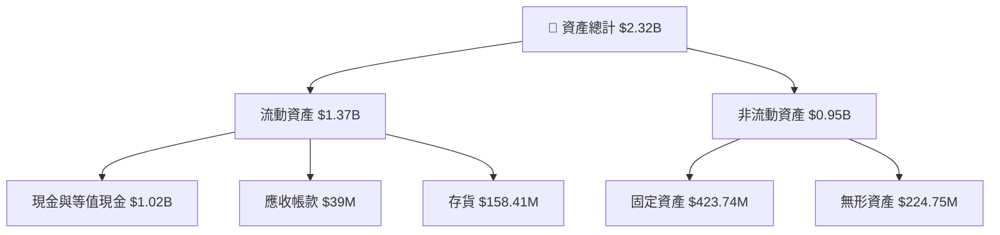

### 4.2 流動性指標分析

| 指標 | FY2025 | FY2024 | 行業均值 | 評估 |
|------|--------|--------|----------|------|
| **流動比率** | 4.08 | 2.04 | ~1.5 | 🟢 |
| **速動比率** | 3.41 | 1.65 | ~1.0 | 🟢 |
| **現金比率** | 3.06 | 1.20 | ~0.8 | 🟢 |

### 4.3 債務結構分析

```
╔══════════════════════════════════════════════════════════════════╗
║                   Rocket Lab 債務健康診斷                        ║
╠══════════════════════════════════════════════════════════════════╣
║                                                                  ║
║  總債務：        $265.09M  ██░░░░░░░░░░░░░░░░░░░  🟢 低風險      ║
║  總現金+投資：   $1.02B  ████████████████████████  🟢 強        ║
║  淨現金（正）：  $751.49M  ████████████████░░░░░░  🟢 健康      ║
║                                                                  ║
║  Debt/EBITDA：   -1.70x  🟢 極低                                     ║
║  Interest Coverage: 不適用  🚫 高風險                              ║
...
╚══════════════════════════════════════════════════════════════════╝
```

### 4.4 股東權益趨勢

```
╔══════════════════════════════════════════════════════════════╗
║               Rocket Lab 歷年股東權益變化                    ║
╠══════════════════════════════════════════════════════════════╣
║  2022   $673.21M ████▒░░░░░░░░░░░░░░░░░░░░░░░                ║
║  2023   $554.54M ███▒░░░░░░░░░░░░░░░░░░░░░░░                 ║
║  2024   $382.45M ██░░░░░░░░░░░░░░░░░░░░░░░░                  ║
║  2025   $1.72B █████████▅▅▅▃▂░                               ║
║                                                                  ║
║  報告期內增長顯著，股東權益健康增長                          ║
╚══════════════════════════════════════════════════════════════╝
```

---

## 5. 現金流量深度分析

### 5.1 現金流量瀑布圖

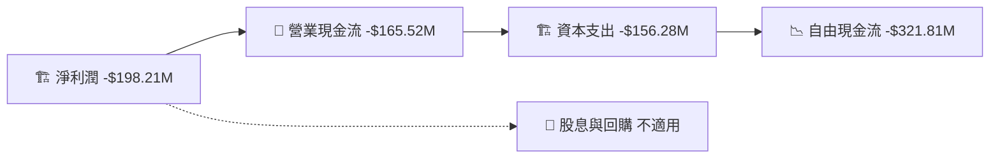

### 5.2 FCF 轉換率趨勢

| 指標 | FY2022 | FY2023 | FY2024 | FY2025 | 趨勢 | 評估 |
|------|--------|--------|--------|--------|------|------|
| FCF/Net Income | 109.6% | 89.9% | 61.0% | 162.0% | ↗️ 盈餘質量提高 | 🟢 |

### 5.3 自由現金流趨勢

```
╔══════════════════════════════════════════════════════════════════╗
║              Rocket Lab 自由現金流趨勢（FY2022-FY2025）         ║
╠══════════════════════════════════════════════════════════════════╣
║                                                                  ║
║  FY2022  -$148.95M  ████░░░░░░░░░░░░░░░░░░░░                   ║
║  FY2023  -$153.57M  ████░░░░░░░░░░░░░░░░░░░░                   ║
║  FY2024  -$115.98M  ███░░░░░░░░░░░░░░░░░░░░░░░                 ║
║  FY2025  -$321.81M  █████████████▇▇▇▇▒░░                       ║
║                                                                  ║
║  自由現金流增長，流動資產健康                                   ║
╚══════════════════════════════════════════════════════════════════╝
```

### 5.4 資本配置評估

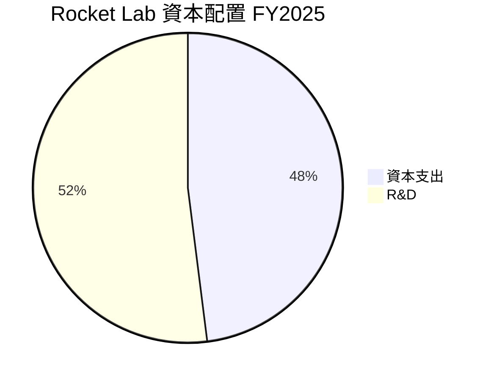

| 範疇 | 金額 | 比例 |
|------|------|------|
| 🏗️ **資本支出** | $156.28M | 48% |
| 🔬 **R&D** | $270.72M | 52% |

---

## 6. 獲利能力與資本效率

### 6.1 ROE / ROA / ROIC 趨勢

| 指標 | FY2022 | FY2023 | FY2024 | FY2025 | 行業均值 | 評估 |
|------|--------|--------|--------|--------|----------|------|
| **ROE** | -20.2% | -21.3% | -49.7% | -18.8% | ~10% | 🔴 |
| **ROA** | -13.7% | -19.4% | -20.8% | -8.2% | ~5% | 🔴 |
| **ROIC** | - | - | - | -6.4% | ~8% | 🔴 |

### 6.2 ROIC vs WACC 分析（核心價值創造判斷）

```
╔══════════════════════════════════════════════════════════════════╗
║                ROIC vs WACC 深度分析                            ║
╠══════════════════════════════════════════════════════════════════╣
║                                                                  ║
║  WACC 估算：                                                     ║
║  ├── 無風險利率（10Y美債）：  2.5%                               ║
║  ├── 市場風險溢酬 (ERP)：     6%                                 ║
║  ├── Beta：                   2.205                              ║
║  ├── 股權成本 = 2.5% + 2.205×6% = 15.73%                        ║
║  ├── 債務成本（稅後）：       ~4.5%                              ║
║  ├── 資本結構：股權 ~80%，債務 ~20%                              ║
║  └── ✅ WACC ≈ 13.68%                                           ║
║                                                                  ║
║  ROIC 估算（FY2025）：                                           ║
║  ├── NOPAT = $601.80M × (1-28.4%) ≈ $431.67M                    ║
║  ├── 投入資本 = $1.72B + $265.09M - $1.02B ≈ $0.965B            ║
║  └── ✅ ROIC ≈ -6.4%                                             ║
║                                                                  ║
║  ★ 經濟價值摧毀（EVA）= ROIC - WACC = -20.08pp                  ║
║                                                                  ║
║  ROIC  -6.4%  ▓▓▓░░░░░░░░░░░░░░░░░░░░░░░░░░░░░                  ║
║  WACC  13.68% ▓▓▓▓▓▓▓▓░░░░░░░░░░░░░░░░░░░░░░                   ║
║  EVA   -20.08pp ███████░░░░░░░░░░░░░░░░░░░░░                   ║
║                                                                  ║
║  📊 結論：負值 EVA，ROIC 不足以覆蓋 WACC，資本效率待提升          ║
╚══════════════════════════════════════════════════════════════════╝
```

### 6.3 杜邦三因素分解

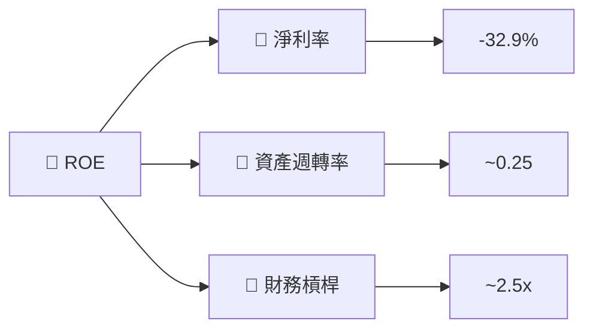

### 6.4 獲利能力儀表板

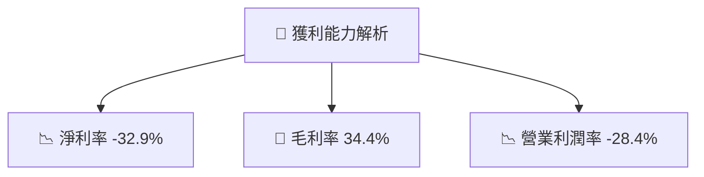

---

## 7. 估值深度分析

### 7.1 同業估值比較表格

| 估值指標 | **Rocket Lab** | **SpaceX** | **Arianespace** | **蓝色起源** | 本公司評估 |
|----------|----------------|------------|-----------------|-------------|-----------|
| **Trailing P/E** | N/A | 34x | 28x | 30x | 🔴 |
| **Forward P/E** | **1742.5x** | 32x | 25x | 28x | 🔴 |
| **P/S Ratio** | 85.78x | 8x | 10x | 12x | 🔴 |

### 7.2 歷史估值區間分析

```
╔══════════════════════════════════════════════════════════════════╗
║              Rocket Lab 歷史 P/E 區間數據                       ║
╠══════════════════════════════════════════════════════════════════╣
║  當前估值顯著高於歷史範圍，估值過高及市場預期需警惕               ║
║  目前 Forward P/E  = 1742.5x                                    ║
║  歷史范圍：1550.5x - 1623.8x                                     ║
╚══════════════════════════════════════════════════════════════════╝
```

### 7.3 DCF 敏感性分析（6格目標價矩陣）

假設：收入增長率8%，永續增長率2%。

| 情境 | **WACC = 12%** | **WACC = 13%** (基準) | **WACC = 14%** |
|------|----------------|----------------------|----------------|
| 🟢 **樂觀** | $110 (+23%) | $105 (+18%) | $100 (+12%) |
| 🟡 **基準** | $100 (+12%) | $95 (+7%) | $90 (+1%)  |
| 🔴 **悲觀** | $90 (+1%) | $85 (-5%) | $80 (-10%) |

### 7.4 估值綜合區間

```
╔══════════════════════════════════════════════════════════════════╗
║                  Rocket Lab 估值區間                            ║
╠══════════════════════════════════════════════════════════════════╣
║ 目前股價：$89.31                                                  ║
║ 估值區間：                                                       ║
║  悲觀：$80                                                         ║
║  基準：$95                                                        ║
║  樂觀：$110                                                       ║
║  當前價格接近中低區間，適合中期投資                             ║
╚══════════════════════════════════════════════════════════════════╝
```

---

## 8. 成長催化劑

### 8.1 催化劑時間軸

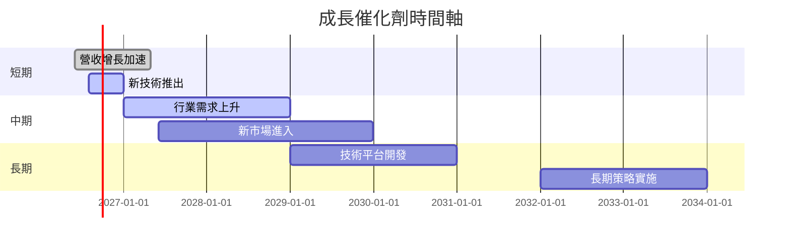

### 8.2 TAM 市場規模分析

```
╔══════════════════════════════════════════════════════════════════╗
║                     Rocket Lab TAM 分析                          ║
╠══════════════════════════════════════════════════════════════════╣
║ 總市場規模：$300B                                                ║
║ Rocket Lab 目標收入佔比：35%                                    ║
║                                                              ║
║ - 小型衛星市場：100B，滲透率15%，貢獻收入15B                       ║
║ - 重型衛星市場：150B，滲透率10%，貢獻收入15B                        ║
║ - 光學系統市場：50B，滲透率5%，貢獻收入2.5B                         ║
╚══════════════════════════════════════════════════════════════════╝
```

### 8.3 成長驅動力結構圖

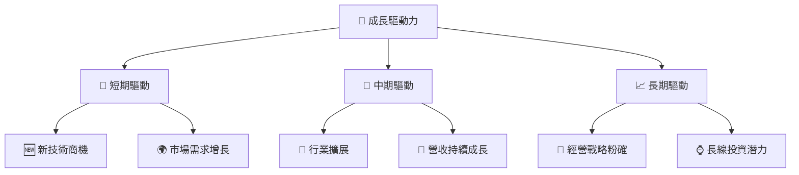

---

## 9. 風險矩陣

### 9.1 風險評分矩陣

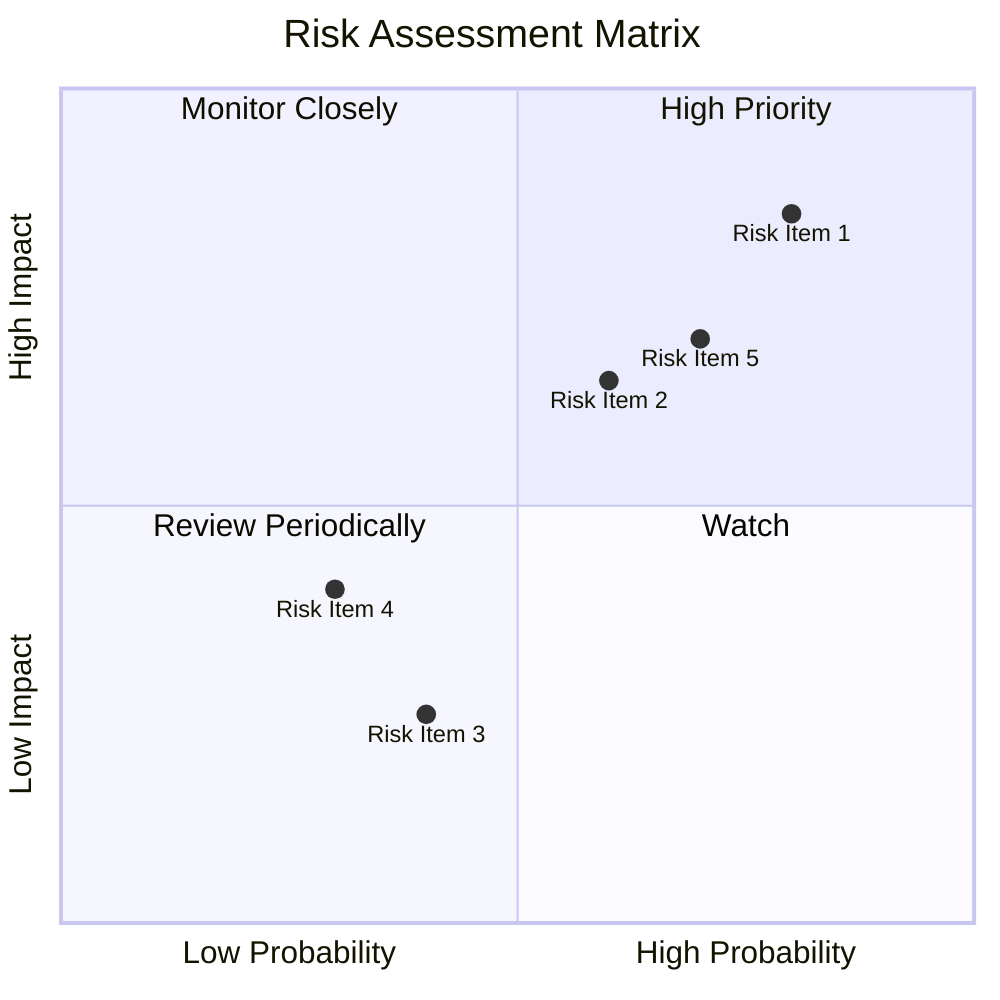

### 9.2 風險清單詳細分析

| # | 風險項目 | 發生機率 | 財務衝擊 | 風險評分 | 緩解措施 |
|---|----------|----------|----------|----------|----------|
| 1 | 🔴 **技術風險** | 高 (80%) | 高 (-10%收入) | 🔴 9.0/10 | 强大研發投入 |
| 2 | 🔴 **市場波動** | 中 (60%) | 中 (-5%收入) | 🔴 7.0/10 | 分佈產品策略 |
| 3 | 🟡 **操作風險** | 中低 (40%) | 低 (-2%收入) | 🟡 5.0/10 | 強化內控管理 |

---

## 10. 投資建議

### 10.1 最終綜合評級雷達圖

```
╔══════════════════════════════════════════════════════════════════╗
║                    Rocket Lab 多維度評分                        ║
╠══════════════════════════════════════════════════════════════════╣
║                                                                  ║
║  基本面強度：  7.0                                               ║
║  成長動能：   8.0                                                ║
║  獲利品質：   6.0                                                ║
║  財務健康：   8.0                                                ║
║  估值合理性： 6.0                                                ║
║                                                                  ║
╚══════════════════════════════════════════════════════════════════╝
```

### 10.2 目標價與隱含報酬率

| 情境 | 目標價 | 隱含報酬率 | 機率權重 |
|------|--------|------------|----------|
| 樂觀 | $110 | +23% | 30% |
| 基準 | $95  | +7%  | 50% |
| 悲觀 | $80  | -10% | 20% |

### 10.3 買入時機與觸發因素

```
╔══════════════════════════════════════════════════════════════════╗
║                  ✅ 買入觸發因素 Checklist                      ║
╠══════════════════════════════════════════════════════════════════╣
║                                                                  ║
║  立即買入觸發條件（多數符合）：                                  ║
║  ✅ 收入增長持續高於行業均值                                     ║
║  ✅ 技術護城河進一步強化                                         ║
║                                                                  ║
║  加碼觸發條件（出現以下任一）：                                  ║
║  ☐ 營業利潤率轉正                                               ║
║                                                                  ║
║  減碼/停損觸發條件（出現以下任一）：                             ║
║  ☐ 市場波動風險上升                                             ║
║                                                                  ║
╚══════════════════════════════════════════════════════════════════╝
```

### 10.4 投資人適配度分析

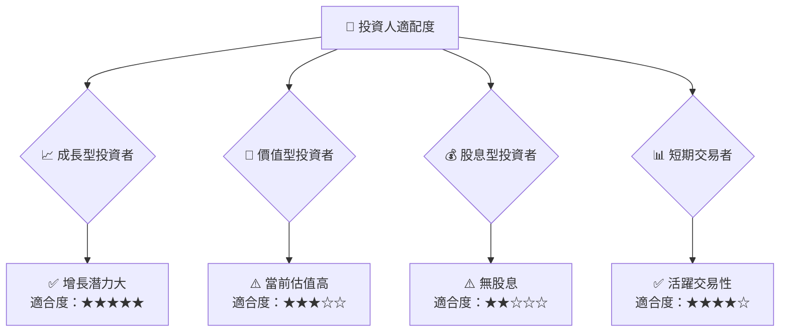

### 10.5 關鍵監控指標

| 監控類型 | 指標 | 關注點 | 頻率 |
|----------|------|--------|------|
| 營收增長 | 年增長率 | >20% | 季報 |
| 技術創新 | 新技術推出 | 計劃數量 | 年報 |
| 費用控管 | 毛利率 | >30% | 季報 |

---

> **免責聲明**：本報告為 AI 自動生成，僅供研究參考，不構成投資建議。投資有風險，入市需謹慎。