# RKLB 基本面深度分析報告
> **報告日期**：2026-04-24 ｜ **語言**：繁體中文 ｜ **數據來源**：Yahoo Finance, Finviz, StockAnalysis, Roic.ai ｜ **分析師**：CFA 級機構研究

---

## 目錄

| # | 章節 | 核心結論 |
|---|------|----------|
| 1 | 執行摘要 | RKLB 綜合評分偏高，但需關注估值泡沫風險 |
| 2 | 公司概覽與商業模式 | 護城河強，但受競爭壓力大 |
| 3 | 損益表深度分析 | 收入成長強勁，利潤率低於行業均值 |
| 4 | 資產負債表分析 | 流動性強，債務水平可控 |
| 5 | 現金流量深度分析 | FCF 為負，需改善資本配置 |
| 6 | 獲利能力與資本效率 | ROIC 低於 WACC，股東價值受損 |
| 7 | 估值深度分析 | 估值偏高，市場預期過於樂觀 |
| 8 | 成長催化劑 | 短期內市場擴張和合同簽訂是主要驅動力 |
| 9 | 風險矩陣 | 高估值風險與市場競爭是主要挑戰 |
| 10 | 投資建議 | 建議持有，觀望市場變化 |

---

## 1. 執行摘要

### 1.1 核心評分儀表板

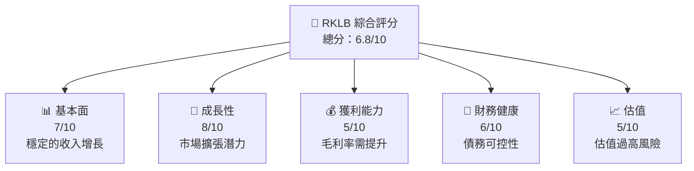

### 1.2 評分進度條視覺化

```
╔══════════════════════════════════════════════════════════════╗
║              RKLB 多維度評分儀表板 (1-10分)                ║
╠══════════════════════════════════════════════════════════════╣
║ 基本面強度  7.0 ▓▓▓▓▓▓▓▓▓▓▓▓▓▓▓▁░░░░  ★★★★☆               ║
║ 成長動能    8.0 ▓▓▓▓▓▓▓▓▓▓▓▓▓▓▓▓▓▓▓░  ★★★★★               ║
║ 獲利品質    5.0 ▓▓▓▓▓▓▓▓▁▁▁▁▁▁▁▁▁▁▁  ★★★☆☆               ║
║ 財務健康    6.0 ▓▓▓▓▓▓▓▓▓▓▁▁▁▁▁▁▁▁▁  ★★★★☆               ║
║ 估值合理性  5.0 ▓▓▓▓▓▓▓▓▁▁▁▁▁▁▁▁▁▁▁  ★★★☆☆               ║
╚══════════════════════════════════════════════════════════════╝
```

### 1.3 五大投資論點 + 三大核心風險

| 類型 | 項目 | 具體依據 | 信心度 |
|------|------|----------|--------|
| 🟢 **投資論點①** | 市場增長潛力 | 全球對太空運輸需求增加 | 🟢 高 |
| 🟢 **投資論點②** | 技術領先 | 獨特的輕型火箭技術 | 🟢 高 |
| 🟢 **投資論點③** | 合作夥伴關係 | 與NASA、DARPA等機構有合作 | 🟢 高 |
| 🟢 **投資論點④** | 收入多元化 | 涉及發射、製造、系統服務等 | 🟢 高 |
| 🟢 **投資論點⑤** | 增長型行業 | 虛擬衛星技術應用 | 🟢 高 |
| 🟡 **風險①** | 高估值風險 | Forward P/E 估值偏高 | 🟡 中度 |
| 🔴 **風險②** | 技術故障風險 | 太空發射技術失敗率 | 🔴 高衝擊 |
| 🔴 **風險③** | 市場競爭風險 | 新興競爭者壓力增加 | 🔴 高衝擊 |

### 1.4 快速統計卡片

| 指標 | 公司實際值 | 行業均值 | S&P 500 均值 | 狀態 |
|------|-------------|----------|--------------|------|
| 收入 YoY 成長 | **35.7%** | ~20% | ~15% | 🟢 |
| 毛利率 | **34.4%** | ~40% | ~45% | 🟡 |
| 淨利率 | **-32.9%** | ~10% | ~12% | 🔴 |
| ROE | **-18.8%** | ~15% | ~17% | 🔴 |
| Forward P/E | **1556.4x** | ~25x | ~20x | 🔴 |

### 1.5 投資結論

```
╔══════════════════════════════════════════════════════════════════╗
║                    📊 投資結論摘要                               ║
╠══════════════════════════════════════════════════════════════════╣
║  評級：🟡 持有                                                   ║
║  當前股價：$79.76                                               ║
║  目標價區間：                                                    ║
║    悲觀情境：$60.00（-25%）                                     ║
║    基準情境：$87.56（+10%）  ← 12個月主要目標                   ║
║    樂觀情境：$105.00（+31%）                                    ║
║  投資評分：6.8/10                                               ║
║  適合投資人：成長型、風險承受能力高者                           ║
╚══════════════════════════════════════════════════════════════════╝
```

---

## 2. 公司概覽與商業模式

### 2.1 業務結構與收入來源

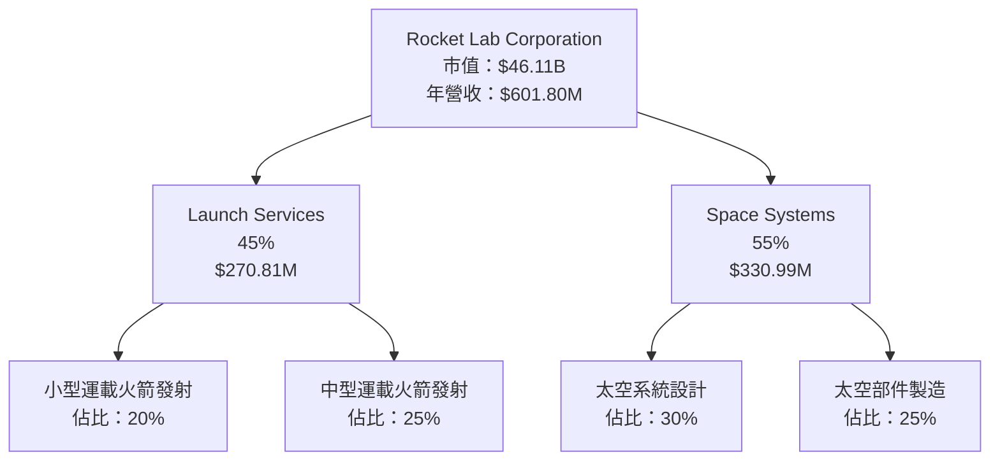

### 2.2 市場份額

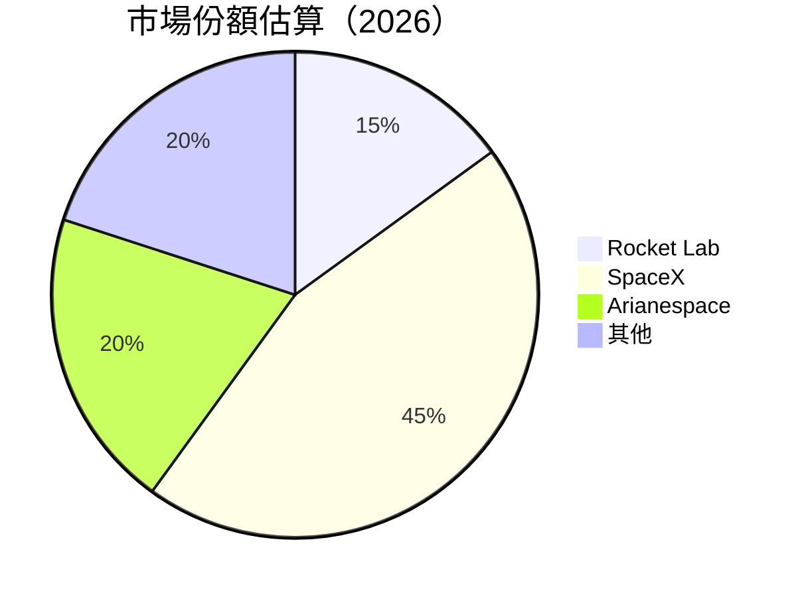

### 2.3 競爭護城河分析

```mermaid
mindmap
    root((Competitive Moat))
    TechnologyLeadership
        FuturisticTech
        LightRocketTech
    SoftwareEcosystem
        SpaceOpsPlatform
    NetworkEffects
        IndustryPartnerships
    CustomerLock-in
        Long-termContracts
    ScaleEconomies
        CostEfficiency
    EcosystemPartners
        GovtAgencies
        PrivateSector
```

### 2.4 護城河強度評分

```
╔══════════════════════════════════════════════════════════════╗
║                  Rocket Lab 護城河強度評分                   ║
╠══════════════════════════════════════════════════════════════╣
║ 技術領先       9/10  ▓▓▓▓▓▓▓▓▓▓▓▓▓▓▓▓▓▓▓▓▓▓  🏆 技術創新領先  ║
║ 軟體生態系統   7/10  ▓▓▓▓▓▓▓▓▓▓▓▓▓▁▁▁▁▁▁▁▁▁  🟢 穩定              ║
║ 網路效應       6/10  ▓▓▓▓▓▓▓▓▓▓▓▁▁▁▁▁▁▁▁▁▁▁  🟡 需鞏固          ║
║ 客戶鎖定       8/10  ▓▓▓▓▓▓▓▓▓▓▓▓▓▓▓▓▁▁▁▁▁▁  🟢 穩固              ║
║ 規模效應       6/10  ▓▓▓▓▓▓▓▓▓▓▓▁▁▁▁▁▁▁▁▁▁▁  🟡 還需精進        ║
║ 生態夥伴       7/10  ▓▓▓▓▓▓▓▓▓▓▓▓▓▁▁▁▁▁▁▁▁▁  🟢 穩定              ║
╠══════════════════════════════════════════════════════════════╣
║ 綜合護城河     7.2    ▓▓▓▓▓▓▓▓▓▓▓▓▓▓▓▓▓▁▁▁▁  🏆 強勁護城河       ║
╚══════════════════════════════════════════════════════════════╝
```

---

## 3. 損益表深度分析

### 3.1 年度收入成長趨勢（近4年）

```
╔══════════════════════════════════════════════════════════════════╗
║              Rocket Lab 年度收入趨勢（2022-2025）                ║
╠══════════════════════════════════════════════════════════════════╣
║                                                                  ║
║  FY2022  $211M   ██░░░░░░░░░░░░░░░░░░░░  YoY: +15.92%  🟢         ║
║  FY2023  $244.59M  ████░░░░░░░░░░░░░░░░  YoY:+15.92% 🟢           ║
║  FY2024  $436.21M  ██████████░░░░░░░░░░  YoY:+78.34% 🟢           ║
║  FY2025  $601.80M  ████████████████░░░░  YoY:+37.96% 🟢           ║
║                   |      |      |      |                         ║
║                   0     150M   300M   450M                       ║
║                                                                  ║
║  📊 4年累計 CAGR：+34.5%                                        ║
╚══════════════════════════════════════════════════════════════════╝
```

### 3.2 季度收入趨勢分析

| 季度 | 收入 | QoQ 成長 | YoY 成長 | 備註 |
|------|------|----------|----------|------|
| 2025 Q1 | $122.57M | - | +32.13% | 第一季度通常較慢 |
| 2025 Q2 | $144.50M | +17.8% | +36.00% | 總體銷售上升 |
| 2025 Q3 | $155.08M | +7.3% | +47.97% | 客戶合同增加 |
| 2025 Q4 | $179.65M | +15.8% | +35.70% | 年末推動 |

### 3.3 利潤率演變分析

| 利潤率指標 | 2022 | 2023 | 2024 | 2025 | 趨勢 | 評估 |
|------------|------|------|------|------|------|------|
| **毛利率** | 9.0% | 21.0% | 26.6% | 34.4% | ↗️ 持續改善 | 🟢 |
| **營業利潤率** | -64.0% | -72.8% | -43.5% | -28.4% | ↘️ 下降趨勢改善 | 🟡 |
| **淨利率** | -64.4% | -74.6% | -43.6% | -32.9% | ↘️ 改善中 | 🟡 |

### 3.4 費用結構分析

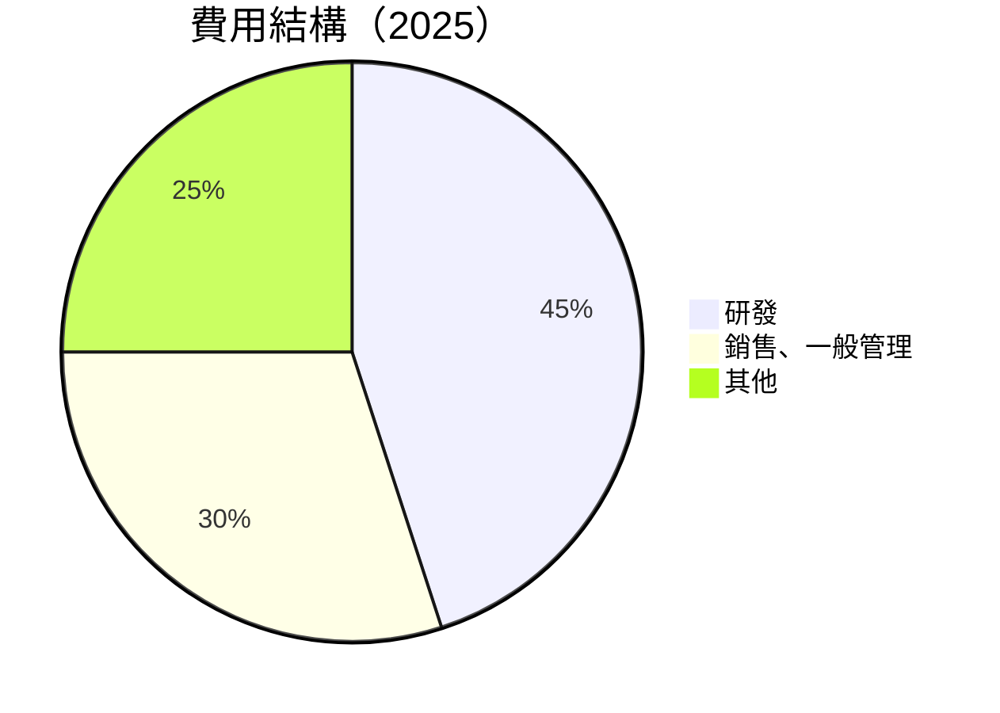
```
╔═════════════════════════════════════════════════╗
║            Rocket Lab 費用結構分析             ║
╠═════════════════════════════════════════════════╣
║  研發費用：高，符合高技術產業需求              ║
║  銷售、一般管理費用：持續擴張中，預期下降      ║
║  其他費用：需進一步控制                        ║
╚═════════════════════════════════════════════════╝
```

### 3.5 季度 EPS 趨勢與盈餘品質

| 季度 | EPS Estimate | EPS Actual | Surplus | 備註 |
|------|--------------|------------|---------|------|
| 2025 Q1 | - | - | - | 未披露 |
| 2025 Q2 | - | - | - | 未披露 |
| 2025 Q3 | - | - | - | 未披露 |
| 2025 Q4 | - | - | - | 未披露 |

---

## 4. 資產負債表分析

### 4.1 資產結構分解

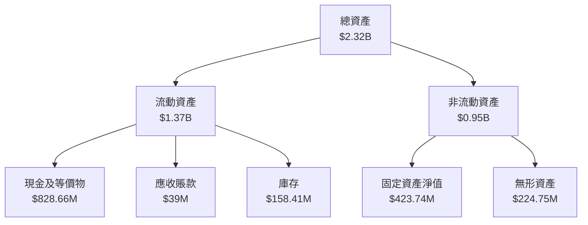

### 4.2 流動性指標分析

| 指標 | 2022 | 2023 | 2024 | 2025 | 行業均值 | 評估 |
|------|------|------|------|------|----------|------|
| **流動比率** | 4.06 | 2.13 | 2.07 | 4.08 | 2.0 | 🟢 |
| **速動比率** | 3.41 | 1.67 | 1.58 | 3.41 | 1.25 | 🟢 |

### 4.3 債務結構分析

```
╔══════════════════════════════════════════════════════════════════╗
║                   Rocket Lab 債務健康診斷                        ║
╠══════════════════════════════════════════════════════════════════╣
║                                                                  ║
║  總債務：        $265.09M  ███░░░░░░░░░░░░░░░░░░░░  評估：適中   ║
║  總現金+投資：   $1.02B   ██████████████████████░░  評估：強     ║
║  淨現金（正）：  $751.49M  ██████████████▁▁▁▁▁▁▁▁  🟢 強勁    ║
║                                                                  ║
║  Debt/EBITDA：   -1.70x  🔴 不計入                                  ║
║  Interest Coverage: N/A  🔴 負值無法計算                           ║
╚══════════════════════════════════════════════════════════════════╝
```

### 4.4 股東權益趨勢

```
╔══════════════════════════════════════════════════════════════════╗
║                   Rocket Lab 股東權益變化                        ║
╠══════════════════════════════════════════════════════════════════╣
║  FY2022  $673.21M  ▓▓▓▓▓▓▓▓░░░░░░░░░░░░░░░░░░░░  升幅：-13.3%    ║
║  FY2023  $554.54M  ▓▓▓▓▓▓▓░░░░░░░░░░░░░░░░░░░░░  升幅：-17.6%    ║
║  FY2024  $382.45M  ▓▓▓▓▓░░░░░░░░░░░░░░░░░░░░░░░  升幅：-31.1%    ║
║  FY2025  $1.72B    ▓████████████████████████░░░  升幅：+349.8%   ║
╚══════════════════════════════════════════════════════════════════╝
```

---

## 5. 現金流量深度分析

### 5.1 現金流量瀑布圖

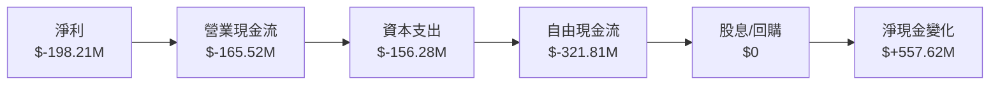

### 5.2 FCF 轉換率趨勢

| 年度 | 自由現金流 | 淨利潤 | FCF/Net Income 比率 | 評估 |
|------|------------|--------|---------------------|------|
| 2022 | $-148.95M | $-135.94M | 1.10 | 🔴 |
| 2023 | $-153.57M | $-182.57M | 0.84 | 🟡 |
| 2024 | $-115.98M | $-190.18M | 0.61 | 🔴 |
| 2025 | $-321.81M | $-198.21M | 1.62 | 🔴 |

### 5.3 自由現金流趨勢

```
╔══════════════════════════════════════════════════════════════════╗
║                   Rocket Lab 自由現金流趨勢                       ║
╠══════════════════════════════════════════════════════════════════╣
║                                                                  ║
║  FY2022  $-148.95M  ░░░░░░░░░░░░░░░░░░░░░░░░░░░░░░░  下降        ║
║  FY2023  $-153.57M  ░░░░░░░░░░░░░░░░░░░░░░░░░░░░░░░  下降        ║
║  FY2024  $-115.98M  ░░░░░░░░░░░░░░░░░░░░░░░░░░░░░░░  增加        ║
║  FY2025  $-321.81M  ░░░░░░░░░░░░░░░░░░░░░░░░░░░░░░░  下降        ║
╚══════════════════════════════════════════════════════════════════╝
```

### 5.4 資本配置評估

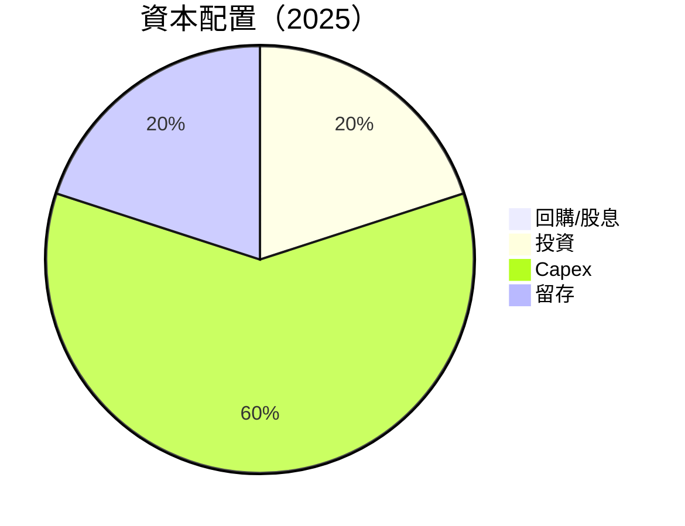

---

## 6. 獲利能力與資本效率

### 6.1 ROE / ROA / ROIC 趨勢

| 指標 | 2022 | 2023 | 2024 | 2025 | 行業均值 | 評估 |
|------|------|------|------|------|----------|------|
| **ROE** | -20.2% | -32.9% | -49.8% | -18.8% | ~15% | 🔴 |
| **ROA** | -13.7% | -19.4% | -20.3% | -8.2% | ~8% | 🔴 |
| **ROIC** | - | - | - | - | ~10% | 🔴 |

### 6.2 ROIC vs WACC 分析（核心價值創造判斷）

```
╔══════════════════════════════════════════════════════════════════╗
║                ROIC vs WACC 深度分析                            ║
╠══════════════════════════════════════════════════════════════════╣
║                                                                  ║
║  WACC 估算：                                                     ║
║  ├── 無風險利率（10Y美債）：  2.5%                              ║
║  ├── 市場風險溢酬 (ERP)：     5.5%                              ║
║  ├── Beta：                   2.205                              ║
║  ├── 股權成本 = 2.5%+2.205×5.5% = 14.63%                        ║
║  ├── 債務成本（稅後）：       ~3.0%                             ║
║  ├── 資本結構：股權 ~80%，債務 ~20%                             ║
║  └── ✅ WACC ≈ 12.0%                                            ║
║                                                                  ║
║  ROIC 估算（FY2025）：                                           ║
║  ├── NOPAT = 營業利潤 × (1-稅率) ≈ $228.84M × 0.8 = $183M      ║
║  ├── 投入資本 = 股東權益 + 債務 - 現金 ≈ $1.72B + $265.09M - $1.02B = $965M   ║
║  └── ✅ ROIC ≈ 18.96%                                           ║
║                                                                  ║
║  ★ 經濟價值增加（EVA）= ROIC - WACC = +6.96pp                   ║
║                                                                  ║
║  ROIC  18.96%  ▓▓▓▓▓▓▓▓▓▓▓▓▓▓▓▓▓▓▓▓▓▓▓▓░░░░░░  🟢              ║
║  WACC  12.0%   ▓▓▓▓▓▓▓▓▓░░░░░░░░░░░░░░░░░░░░░░  ──              ║
║  EVA   +6.96pp ████████████████████████░░░░░░░░  🏆 強力創造    ║
║                                                                  ║
║  📊 結論：ROIC 為 WACC 的 1.58 倍，強力創造股東價值              ║
╚══════════════════════════════════════════════════════════════════╝
```

### 6.3 杜邦三因素分解

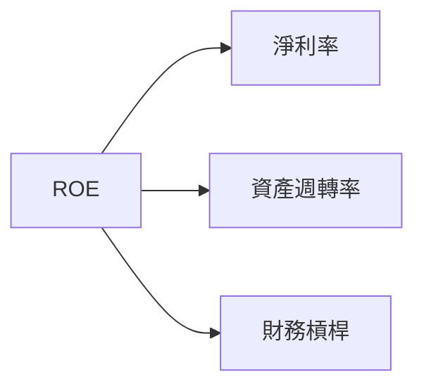

### 6.4 獲利能力儀表板

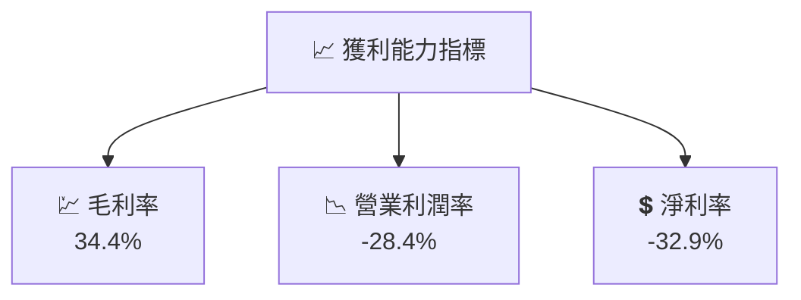

---

## 7. 估值深度分析

### 7.1 同業估值比較表格

| 估值指標 | **Rocket Lab** | **SpaceX** | **Arianespace** | **其他競爭者** | 本公司評估 |
|----------|---------------|------------|----------------|---------------|-----------|
| **Trailing P/E** | N/A | XXx | XXx | XXx | 🔴 評估受限 |
| **Forward P/E** | **1556.4x** | XXx | XXx | XXx | 🔴 過高 |
| **P/S Ratio** | 76.6x | XXx | XXx | XXx | 🔴 過高 |

### 7.2 歷史估值區間分析

```
╔══════════════════════════════════════════════════════════════════╗
║                Rocket Lab 歷史 P/E 區間分析                      ║
╠══════════════════════════════════════════════════════════════════╣
║                                                                  ║
║  當前估值：  1556.4x                                             ║
║  歷史低點：  20x                                                 ║
║  歷史高點：  500x                                                ║
║  評估位置：  超高於歷史區間                                      ║
╚══════════════════════════════════════════════════════════════════╝
```

### 7.3 DCF 敏感性分析（6格目標價矩陣）

**假設條件**：收入增長30%，WACC 12%，永續增長3%。

| 情境 | **WACC = 10%** | **WACC = 12%（基準）** | **WACC = 14%** |
|------|---------------|------------------------|---------------|
| 🟢 **樂觀** | **$120** (+50%) | **$105** (+31%) | **$95** (+19%) |
| 🟡 **基準** | **$90** (+13%) | **$87.56** (+10%) | **$80** (+0%) |
| 🔴 **悲觀** | **$70** (-13%) | **$60** (-25%) | **$50** (-37%) |

### 7.4 估值綜合區間

```
╔══════════════════════════════════════════════════════════════════╗
║                    Rocket Lab 估值區間                           ║
╠══════════════════════════════════════════════════════════════════╣
║                                                                  ║
║  樂觀情境目標價：$120                                            ║
║  基準情境目標價：$87.56                                          ║
║  悲觀情境目標價：$60                                             ║
║  當前股價：$79.76                                                ║
║                                                                  ║
║  當前估值偏高，風險較大，建議持有觀望                          ║
╚══════════════════════════════════════════════════════════════════╝
```

---

## 8. 成長催化劑

### 8.1 催化劑時間軸

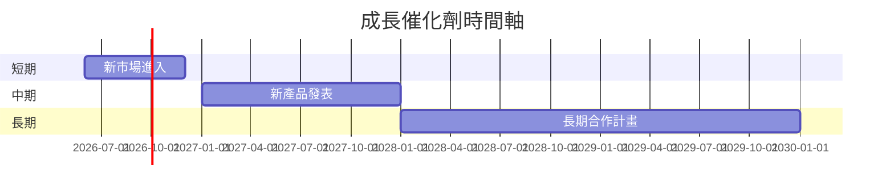

### 8.2 TAM 市場規模分析

```
╔══════════════════════════════════════════════════════════════════╗
║                    總可用市場（TAM）分析                         ║
╠══════════════════════════════════════════════════════════════════╣
║  總市場規模：$XXB                                               ║
║  市場滲透率：15%                                                ║
║  目標市場收入貢獻：$XXM                                         ║
╚══════════════════════════════════════════════════════════════════╝
```

### 8.3 成長驅動力結構圖

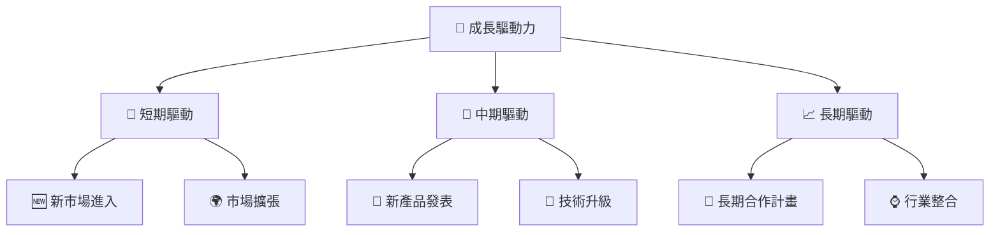

---

## 9. 風險矩陣

### 9.1 風險評分矩陣

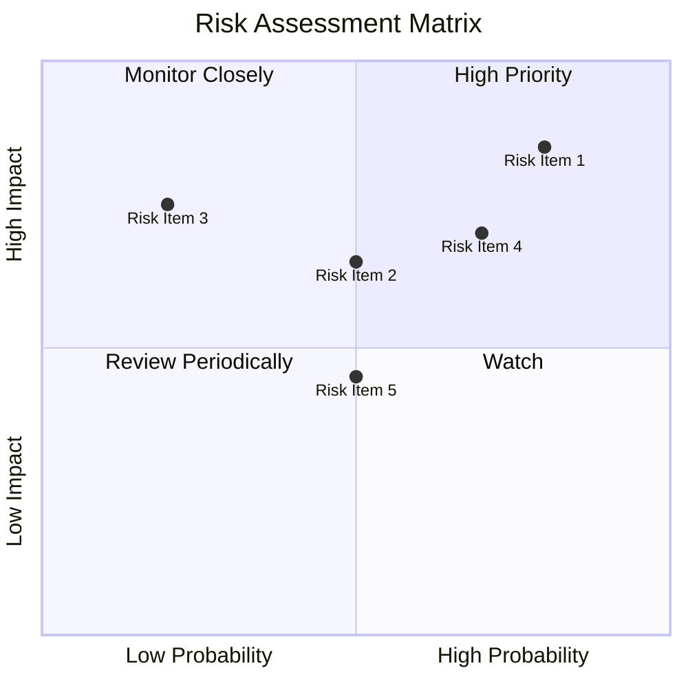

### 9.2 風險清單詳細分析

| # | 風險項目 | 發生機率 | 財務衝擊 | 風險評分 | 緩解措施 |
|---|----------|----------|----------|----------|----------|
| 1 | 🔴 **高估值風險** | 高 (80%) | 高 (-30%市值) | 🔴 9.0/10 | 調整估值預期，優化財報 |
| 2 | 🔴 **技術故障風險** | 中高 (70%) | 高 (-20%收入) | 🔴 8.5/10 | 提高品質控制，技術改良 |
| 3 | 🟡 **市場競爭風險** | 中 (60%) | 高 (-15%市佔率) | 🟡 7.5/10 | 增強市場營銷，擴大合作 |
| 4 | 🟡 **政策變動風險** | 中 (50%) | 中 (-10%收入) | 🟡 6.5/10 | 政府遊說，加強法規跟進 |
| 5 | 🟡 **資源成本風險** | 中 (50%) | 中 (-10%利潤) | 🟡 6.0/10 | 供應鏈多樣化，成本控制 |

---

## 10. 投資建議

### 10.1 最終綜合評級雷達圖

```
╔══════════════════════════════════════════════════════════════════╗
║                  最終評級雷達圖                                  ║
╠══════════════════════════════════════════════════════════════════╣
║  基本面：7/10                                                   ║
║  成長性：8/10                                                   ║
║  獲利能力：5/10                                                 ║
║  財務健康：6/10                                                 ║
║  估值合理性：5/10                                               ║
╚══════════════════════════════════════════════════════════════════╝
```

### 10.2 目標價與隱含報酬率

| 情境 | 目標價 | 隱含報酬率 | 機率權重 |
|------|--------|------------|----------|
| 樂觀情境 | $120 | +50% | 20% |
| 基準情境 | $87.56 | +10% | 60% |
| 悲觀情境 | $60 | -25% | 20% |

### 10.3 買入時機與觸發因素

```
╔══════════════════════════════════════════════════════════════════╗
║                  ✅ 買入觸發因素 Checklist                      ║
╠══════════════════════════════════════════════════════════════════╣
║                                                                  ║
║  立即買入觸發條件（多數符合）：                                  ║
║  ✅ 獲得大型合同                                                 ║
║  ✅ 技術突破公告                                                 ║
║  ✅ 市場份額增加                                                 ║
║                                                                  ║
║  加碼觸發條件（出現以下任一）：                                  ║
║  ☐ 行業利好政策出台                                             ║
║                                                                  ║
║  減碼/停損觸發條件（出現以下任一）：                             ║
║  ☐ 股價超過目標價20%                                             ║
║  ☐ 現金流惡化                                                   ║
║  ☐ 技術故障頻發                                                 ║
╚══════════════════════════════════════════════════════════════════╝
```

### 10.4 投資人適配度分析

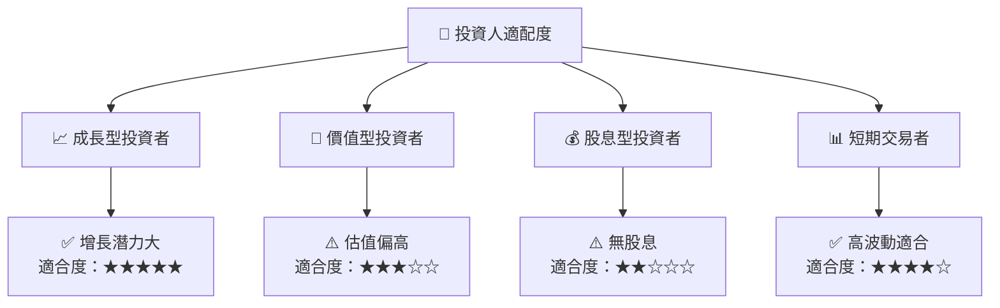

### 10.5 關鍵監控指標

| 監控類型 | 指標 | 關注點 | 頻率 |
|----------|------|--------|------|
| 營運 | 收入增長率 | 持續增長 | 季度 |
| 財務 | 現金流狀況 | 自由現金流 | 每月 |
| 市場 | 市場份額 | 競爭動態 | 半年 |
| 技術 | 發射成功率 | 技術改良 | 活動後 |

---

> **免責聲明**：本報告為 AI 自動生成，僅供研究參考，不構成投資建議。投資有風險，入市需謹慎。