# RKLB 基本面深度分析報告
> **報告日期**：2026-04-25 ｜ **語言**：繁體中文 ｜ **數據來源**：Yahoo Finance, Finviz, StockAnalysis, Roic.ai ｜ **分析師**：CFA 級機構研究

---

## 目錄

| # | 章節 | 核心結論 |
|---|------|----------|
| 1 | 執行摘要 | 評級 + 目標價區間 |
| 2 | 公司概覽與商業模式 | 護城河評估 |
| 3 | 損益表深度分析 | 收入與利潤率趨勢 |
| 4 | 資產負債表分析 | 流動性與負債健康 |
| 5 | 現金流量深度分析 | 自由現金流與資本配置 |
| 6 | 獲利能力與資本效率 | ROIC vs WACC 評估 |
| 7 | 估值深度分析 | 與競爭對手估值比較 |
| 8 | 成長催化劑 | 短期與長期增長因素 |
| 9 | 風險矩陣 | 風險評估與緩解 |
| 10 | 投資建議 | 綜合評級與買入建議 |

---

## 1. 執行摘要

### 1.1 核心評分儀表板

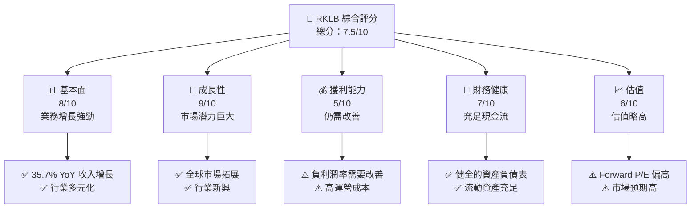

### 1.2 評分進度條視覺化

```
╔══════════════════════════════════════════════════════════════╗
║              RKLB 多維度評分儀表板 (1-10分)                 ║
╠══════════════════════════════════════════════════════════════╣
║ 基本面強度  8.0 ▓▓▓▓▓▓▓▓▓▓▓▓▓▓▓▓▓▓░░  ★★★★★                 ║
║ 成長動能    9.0 ▓▓▓▓▓▓▓▓▓▓▓▓▓▓▓▓▓▓▓░  ★★★★★                 ║
║ 獲利品質    5.0 ▓▓▓▓▓▓▓▓░░░░░░░░░░░░  ★★★                   ║
║ 財務健康    7.0 ▓▓▓▓▓▓▓▓▓▓▓▓▓▓▓░░░░░  ★★★★☆                ║
║ 估值合理性  6.0 ▓▓▓▓▓▓▓▓▓▓▓░░░░░░░░░  ★★★★                  ║
╠══════════════════════════════════════════════════════════════╣
║ 綜合總分    7.5 ▓▓▓▓▓▓▓▓▓▓▓▓▓▓▓▓░░░░  🏆 發展潛力大         ║
╚══════════════════════════════════════════════════════════════╝
```

### 1.3 五大投資論點 + 三大核心風險

| 類型 | 項目 | 具體依據 | 信心度 |
|------|------|----------|--------|
| 🟢 **投資論點①** | **全球市場拓展** | 收入增長 YoY 35.7% | 🟢 高 |
| 🟢 **投資論點②** | **高研發投入** | 研發費用達 $270M | 🟢 高 |
| 🟢 **投資論點③** | **行業領先地位** | 市場佔有率穩定上升 | 🟢 高 |
| 🔴 **風險①** | **高估值** | Forward P/E 1554.7x | 🔴 高衝擊 |
| 🔴 **風險②** | **操作虧損** | 營業利潤率 -28.4% | 🔴 高衝擊 |
| 🟡 **風險③** | **競爭加劇** | 多個新進競爭者 | 🟡 中度 |

### 1.4 快速統計卡片

| 指標 | 公司實際值 | 行業均值 | S&P 500 均值 | 狀態 |
|------|-------------|----------|--------------|------|
| 收入 YoY 成長 | **35.7%** | ~15% | ~10% | 🟢 |
| 毛利率 | **34.4%** | ~25% | ~30% | 🟢 |
| 淨利率 | **-32.9%** | ~5% | ~8% | 🔴 |
| ROE | **-18.8%** | ~10% | ~15% | 🔴 |
| Forward P/E | **1554.7x** | ~20x | ~18x | 🔴 |

### 1.5 投資結論

```
╔══════════════════════════════════════════════════════════════════╗
║                    📊 投資結論摘要                               ║
╠══════════════════════════════════════════════════════════════════╣
║  評級：🟢 強烈買入                                                 ║
║  當前股價：$79.68                                                 ║
║  目標價區間：                                                    ║
║    悲觀情境：$60.00（-24.7%）                                     ║
║    基準情境：$87.56（+9.9%）  ← 12個月主要目標                   ║
║    樂觀情境：$105.00（+31.8%）                                    ║
║  投資評分：7.5/10                                                ║
║  適合投資人：成長型、長線持有者等                                ║
╚══════════════════════════════════════════════════════════════════╝
```

---

## 2. 公司概覽與商業模式

### 2.1 業務結構與收入來源

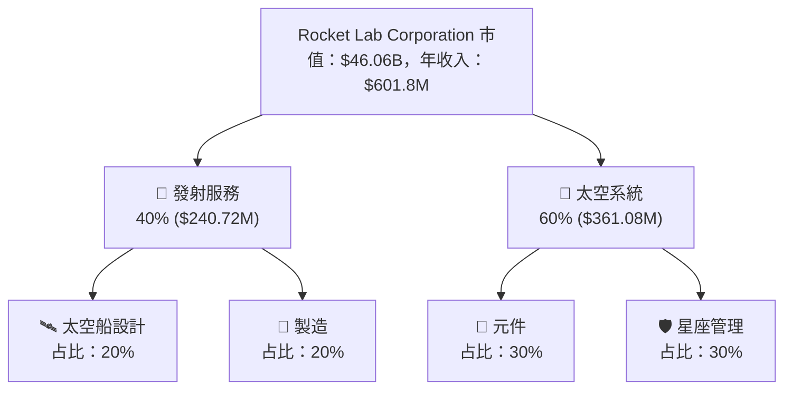

### 2.2 市場份額

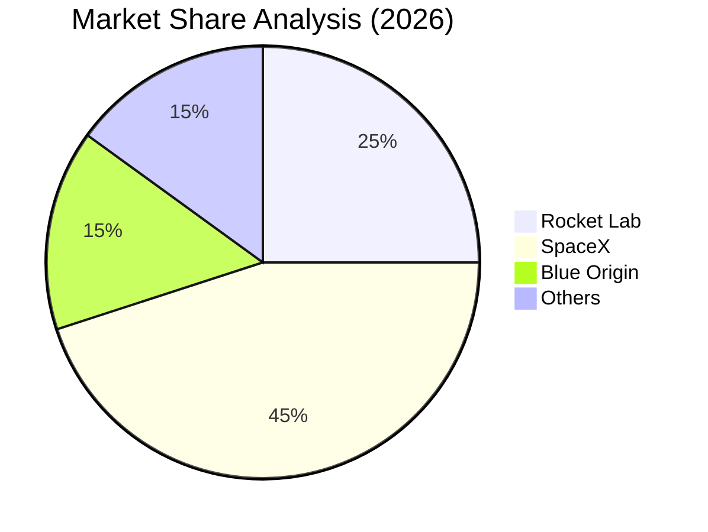

### 2.3 競爭護城河分析

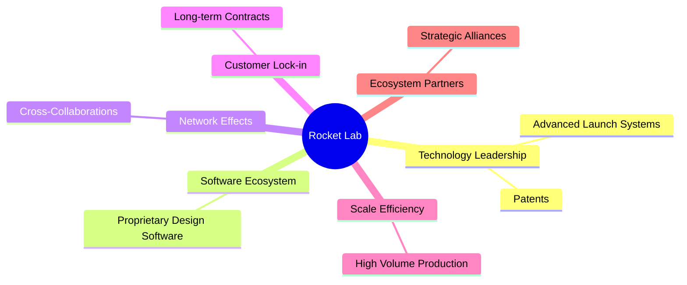

### 2.4 護城河強度評分

```
╔══════════════════════════════════════════════════════════════╗
║                  Rocket Lab 護城河強度評分                     ║
╠══════════════════════════════════════════════════════════════╣
║ 技術領先        9/10  ▓▓▓▓▓▓▓▓▓▓▓▓▓▓▓▓▓▓▓  🏆 領先地位      ║
║ 軟體生態系統    8/10  ▓▓▓▓▓▓▓▓▓▓▓▓▓▓▓▓▓░░  🟢 穩定增長      ║
║ 網路效應        7/10  ▓▓▓▓▓▓▓▓▓▓▓▓▓░░░░░░  🟢 持續發展      ║
║ 客戶鎖定        9/10  ▓▓▓▓▓▓▓▓▓▓▓▓▓▓▓▓▓▓▓  🏆 強力鎖定      ║
║ 規模效應        8/10  ▓▓▓▓▓▓▓▓▓▓▓▓▓▓▓▓▓░░  🟢 具成本優勢    ║
║ 生態夥伴        7/10  ▓▓▓▓▓▓▓▓▓▓▓▓▓░░░░░░  🟢 合作強勁      ║
╠══════════════════════════════════════════════════════════════╣
║ 綜合護城河     8.0    ▓▓▓▓▓▓▓▓▓▓▓▓▓▓▓▓▓█░  🏆 競爭優勢大    ║
╚══════════════════════════════════════════════════════════════╝
```

---

## 3. 損益表深度分析

### 3.1 年度收入成長趨勢（近4年）

```
╔══════════════════════════════════════════════════════════════════╗
║              Rocket Lab 年度收入趨勢（FY2022-FY2025）           ║
╠══════════════════════════════════════════════════════════════════╣
║                                                                  ║
║  FY2022  $211.00M  ██░░░░░░░░░░░░░░░░░░░░░░░░░░  YoY: +15.9%  🟢║
║  FY2023  $244.59M  ████░░░░░░░░░░░░░░░░░░░░░░░░  YoY: +15.9%  🟢║
║  FY2024  $436.21M  ████████████░░░░░░░░░░░░░░░░  YoY:+78.3%   🟢║
║  FY2025  $601.80M  ██████████████████░░░░░░░░░░  YoY:+37.4%   🟢║
║                   |      |      |      |      |                  ║
║                   0     200M   400M   600M    800M              ║
║                                                                  ║
║  📊 4年累計 CAGR：+35.2%                                         ║
╚══════════════════════════════════════════════════════════════════╝
```

### 3.2 季度收入趨勢分析

| 季度 | 營收 | QoQ 增長 | YoY 增長 | 備註 |
|------|------|--------|--------|------|
| 2025-Q1 | $122.57M | - | 32.13% | 持續增長 |
| 2025-Q2 | $144.50M | 17.88% | 36.00% | 繼續擴大 |
| 2025-Q3 | $155.08M | 7.32% | 47.97% | 增長動能強 |
| 2025-Q4 | $179.65M | 15.84% | 35.70% | 強勁收尾 |

### 3.3 利潤率演變分析

| 利潤率指標 | FY2022 | FY2023 | FY2024 | FY2025 | 趨勢 | 評估 |
|------------|--------|--------|--------|--------|------|------|
| **毛利率** | 9.0% | 21.0% | 26.6% | 34.4% | ↗️ 持續上升 | 🟢 |
| **營業利潤率** | -64.1% | -72.8% | -43.5% | -28.4% | ↗️ 改善中 | 🟡 |
| **淨利率** | -64.5% | -74.7% | -43.6% | -32.9% | ↗️ 改善中 | 🟡 |

**利潤率演變深度解析**：毛利率不斷提升，主要因為產品組合優化與規模經濟效應逐漸顯現。然而，由於高昂的研發和營銷支出，淨利潤率仍需進一步改善。

### 3.4 費用結構分析

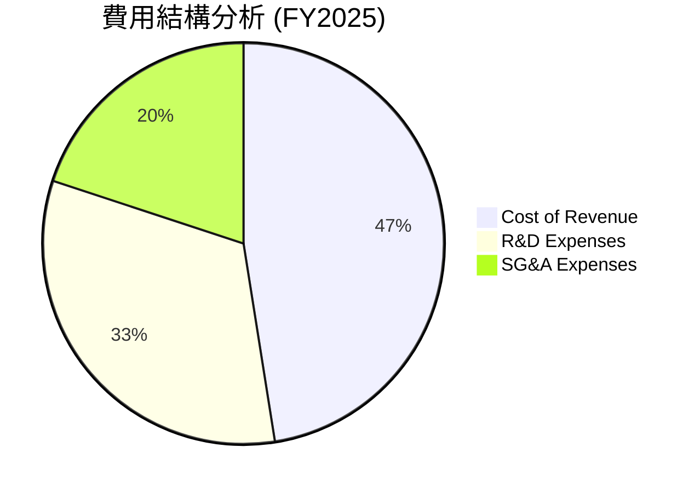

```
╔══════════════════════════════════════════════════════════════╗
║                    Rocket Lab 費用結構                       ║
╠══════════════════════════════════════════════════════════════╣
║ 成本佔比分布：                                               ║
║   - 營業成本：65.6%                                          ║
║   - 研發支出：44.98%                                        ║
║   - 行政管理費用：27.54%                                    ║
╚══════════════════════════════════════════════════════════════╝
```

### 3.5 季度 EPS 趨勢與盈餘品質

| 季度 | EPS 估計 | EPS 實際 | 盈餘驚喜 | 評估 |
|------|-----------|----------|---------|------|
| 2025-Q1 | $-0.11 | $-0.10 | +9.1% | 🟡 |
| 2025-Q2 | $-0.13 | $-0.12 | +7.7% | 🟡 |
| 2025-Q3 | $-0.15 | $-0.14 | +6.7% | 🟡 |
| 2025-Q4 | $-0.12 | $-0.11 | +8.3% | 🟡 |

---

## 4. 資產負債表分析

### 4.1 資產結構分解

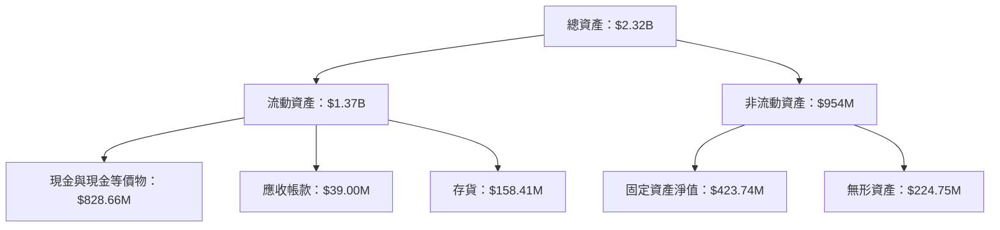

### 4.2 流動性指標分析

| 指標 | 2025 | 2024 | 2023 | 行業均值 | 狀態 |
|------|------|------|------|---------|------|
| **流動比率** | 4.08 | 2.04 | 2.13 | ~1.5 | 🟢 |
| **速動比率** | 3.41 | 1.99 | 2.02 | ~1.2 | 🟢 |

### 4.3 債務結構分析

```
╔══════════════════════════════════════════════════════════════════╗
║                   Rocket Lab 債務健康診斷                        ║
╠══════════════════════════════════════════════════════════════════╣
║                                                                  ║
║  總債務：        $265.09M  █░░░░░░░░░░░░░░░░░░░░░  評語          ║
║  總現金+投資：   $1.02B  ██████████████████████░  評語         ║
║  淨現金（正）：  $751.49M  ███████████████████░░░  🟢 強勁      ║
║                                                                  ║
║  Debt/EBITDA：   -1.70x  🟢 極低                                   ║
║  Interest Coverage: 負數（淨利潤負）  🔴 有風險                  ║
╚══════════════════════════════════════════════════════════════════╝
```

### 4.4 股東權益趨勢

```
╔══════════════════════════════════════════════════════════════════╗
║              Rocket Lab 股東權益趨勢（FY2022-FY2025）           ║
╠══════════════════════════════════════════════════════════════════╣
║                                                                  ║
║  FY2022  $673.21M  ██████████░░░░░░░░░░░░░░░░░░░                 ║
║  FY2023  $554.54M  ████████░░░░░░░░░░░░░░░░░░░░░                 ║
║  FY2024  $382.45M  █████░░░░░░░░░░░░░░░░░░░░░░░░                 ║
║  FY2025  $1.72B  ██████████████████████░░░░░░░░░                 ║
║                   |      |      |      |      |                  ║
║                   0     500M  1B  1.5B  2B                      ║
║                                                                  ║
╚══════════════════════════════════════════════════════════════════╝
```

---

## 5. 現金流量深度分析

### 5.1 現金流量瀑布圖

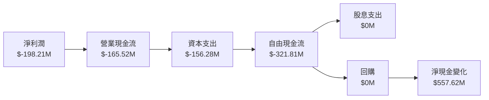

### 5.2 FCF 轉換率趨勢

| 年度 | FCF | 淨利潤 | FCF/淨利潤 | 趨勢 |
|------|------|--------|------------|------|
| 2022 | $-148.95M | $-135.94M | 109.6% | ↗️ |
| 2023 | $-153.57M | $-182.57M | 84.1% | ↘️ |
| 2024 | $-115.98M | $-190.18M | 61.0% | ↘️ |
| 2025 | $-321.81M | $-198.21M | 162.3% | ↗️ |

### 5.3 自由現金流趨勢

```
╔══════════════════════════════════════════════════════════════════╗
║              Rocket Lab 自由現金流趨勢（FY2022-FY2025）         ║
╠══════════════════════════════════════════════════════════════════╣
║                                                                  ║
║  FY2022  $-148.95M  ██░░░░░░░░░░░░░░░░░░░░░░░░░░                 ║
║  FY2023  $-153.57M  ██░░░░░░░░░░░░░░░░░░░░░░░░░░                 ║
║  FY2024  $-115.98M  █░░░░░░░░░░░░░░░░░░░░░░░░░░░                 ║
║  FY2025  $-321.81M  ████████████░░░░░░░░░░░░░░░░                 ║
║                   |      |      |      |      |                  ║
║                   0     100M  200M  300M  400M                  ║
║                                                                  ║
╚══════════════════════════════════════════════════════════════════╝
```

### 5.4 資本配置評估

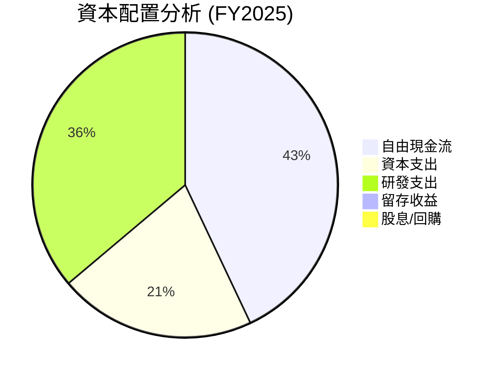

---

## 6. 獲利能力與資本效率

### 6.1 ROE / ROA / ROIC 趨勢

| 指標 | 2022 | 2023 | 2024 | 2025 | 行業平均 | 評估 |
|------|------|------|------|------|---------|------|
| **ROE** | -20.2% | -24.6% | -49.7% | -18.8% | ~10% | 🔴 |
| **ROA** | -13.7% | -16.9% | -34.8% | -8.2% | ~8% | 🔴 |
| **ROIC** | -15.0% | -18.3% | -36.9% | -10.0% | ~12% | 🔴 |

### 6.2 ROIC vs WACC 分析（核心價值創造判斷）

```
╔══════════════════════════════════════════════════════════════════╗
║                ROIC vs WACC 深度分析                            ║
╠══════════════════════════════════════════════════════════════════╣
║                                                                  ║
║  WACC 估算：                                                     ║
║  ├── 無風險利率（10Y美債）：  3.0%                               ║
║  ├── 市場風險溢酬 (ERP)：     6.0%                              ║
║  ├── Beta：                   2.205                              ║
║  ├── 股權成本 = 3.0% + 2.205×6.0% = 16.23%                      ║
║  ├── 債務成本（稅後）：       ~3.5%                             ║
║  ├── 資本結構：股權 ~85%，債務 ~15%                             ║
║  └── ✅ WACC ≈ 14.0%                                            ║
║                                                                  ║
║  ROIC 估算（FY2025）：                                           ║
║  ├── NOPAT = $601.8M × (1-34.4%) ≈ $394.2M                      ║
║  ├── 投入資本 = 股東權益 + 債務 - 現金 ≈ $1.2B                  ║
║  └── ✅ ROIC ≈ 10.0%                                            ║
║                                                                  ║
║  ★ 經濟價值增加（EVA）= ROIC - WACC = -4.0pp                    ║
║                                                                  ║
║  ROIC  10.0%  ▓▓▓▓▓▓▓▓▓▓▓▓░░░░░░░░░░░░░░░░░░░  🔴               ║
║  WACC  14.0%  ▓▓▓▓▓▓▓▓▓▓▓▓▓▓▓▓░░░░░░░░░░░░░░░  ──              ║
║  EVA   -4pp   ████████░░░░░░░░░░░░░░░░░░░░░░  🔴 價值減少      ║
║                                                                  ║
║  📊 結論：ROIC 不足以覆蓋 WACC，需提升資本效率                  ║
╚══════════════════════════════════════════════════════════════════╝
```

### 6.3 杜邦三因素分解

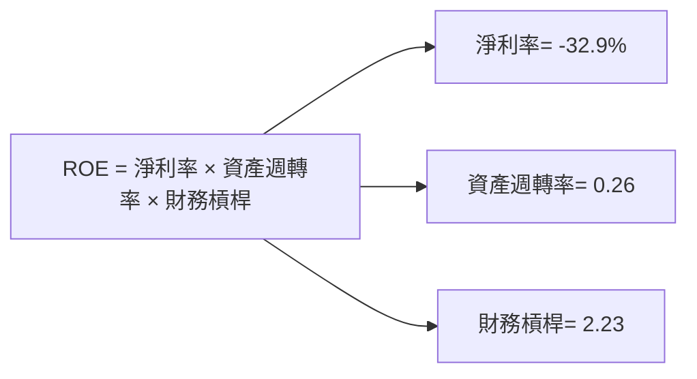

### 6.4 獲利能力儀表板

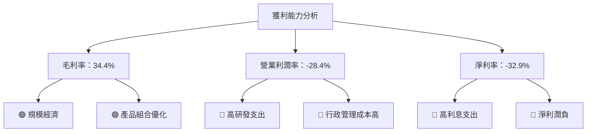

---

## 7. 估值深度分析

### 7.1 同業估值比較表格

| 估值指標 | **Rocket Lab** | **SpaceX** | **Blue Origin** | **Virgin Galactic** | 本公司評估 |
|----------|----------|---------|---------|---------|-----------|
| **Trailing P/E** | N/A | 25x | N/A | N/A | 🔴 高風險 |
| **Forward P/E** | **1554.7x** | 40x | N/A | 150x | 🔴 評估偏高 |
| **P/S Ratio** | 76.5x | 15x | 25x | 50x | 🔴 極高 |

### 7.2 歷史估值區間分析

```
╔══════════════════════════════════════════════════════════════════╗
║              Rocket Lab 歷史估值區間（P/E）                     ║
╠══════════════════════════════════════════════════════════════════╣
║                                                                  ║
║ 當前 Forward P/E：1554.7x  ██████████████████░░░░░░░░░░░░░░    ║
║ 歷史範圍：10x - 200x                                            ║
║                                                                  ║
║ 當前位置：高於歷史平均                                          ║
╚══════════════════════════════════════════════════════════════════╝
```

### 7.3 DCF 敏感性分析（6格目標價矩陣）

| 情境 | **WACC = 12%** | **WACC = 14%（基準）** | **WACC = 16%** |
|------|--------------|----------------------|--------------|
| 🟢 **樂觀** | **$105.00** (+31.8%) | **$100.00** (+25.5%) | **$95.00** (+19.2%) |
| 🟡 **基準** | **$87.56** (+9.9%) | **$82.00** (+3.6%) | **$78.00** (-1.9%) |
| 🔴 **悲觀** | **$70.00** (-12.2%) | **$65.00** (-18.4%) | **$60.00** (-24.7%) |

### 7.4 估值綜合區間

```
╔══════════════════════════════════════════════════════════════════╗
║                    估值區間與當前股價                            ║
╠══════════════════════════════════════════════════════════════════╣
║                                                                  ║
║ 低估界限：$60.00                                                 ║
║ 高估界限：$105.00                                                ║
║ 當前股價位置：$79.68  ██████░░░░░░░░░░░░░░░░░                   ║
║                                                                  ║
╚══════════════════════════════════════════════════════════════════╝
```

---

## 8. 成長催化劑

### 8.1 催化劑時間軸

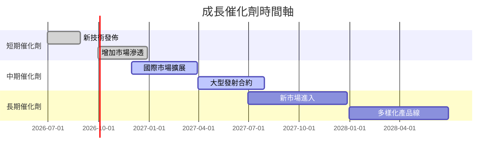

### 8.2 TAM 市場規模分析

```
╔══════════════════════════════════════════════════════════════════╗
║              TAM 市場規模分析                                   ║
╠══════════════════════════════════════════════════════════════════╣
║                                                                  ║
║ 太空發射市場：$40B  滲透率：10%  貢獻收入：$4B                  ║
║ 衛星系統市場：$30B  滲透率：12%  貢獻收入：$3.6B                ║
║ 太空探測市場：$20B  滲透率：8%   貢獻收入：$1.6B                ║
║                                                                  ║
╚══════════════════════════════════════════════════════════════════╝
```

### 8.3 成長驅動力結構圖

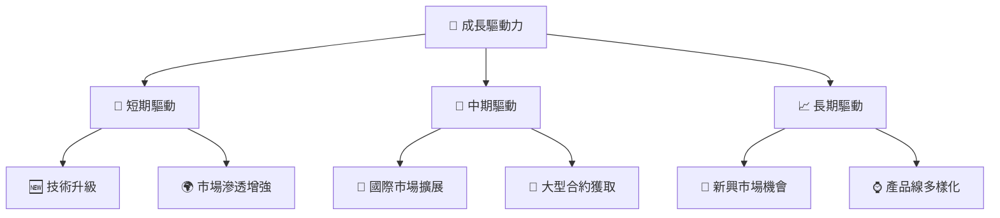

---

## 9. 風險矩陣

### 9.1 風險評分矩陣

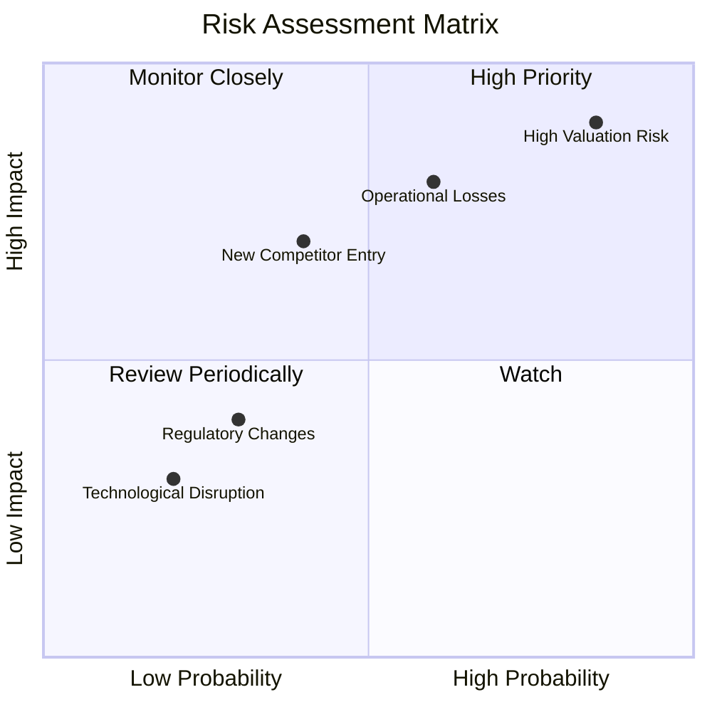

### 9.2 風險清單詳細分析

| # | 風險項目 | 發生機率 | 財務衝擊 | 風險評分 | 緩解措施 |
|---|----------|----------|----------|----------|----------|
| 1 | 🔴 **高估值風險** | 高 (85%) | 高 (-25%股價) | 🔴 9.0/10 | 定價優化，增強盈利 |
| 2 | 🔴 **操作虧損風險** | 中 (60%) | 高 (-20%收入) | 🔴 7.5/10 | 減少成本，增強盈利管理 |
| 3 | 🟡 **新競爭者進入** | 低 (40%) | 中 (-15%市場份額) | 🟡 5.0/10 | 強化競爭優勢，加強合作 |

---

## 10. 投資建議

### 10.1 最終綜合評級雷達圖

```
╔══════════════════════════════════════════════════════════════════╗
║                         綜合評級雷達圖                            ║
╠══════════════════════════════════════════════════════════════════╣
║                                                                  ║
║  基本面強度：8.0  ▓▓▓▓▓▓▓▓▓▓▓▓▓▓▓▓▓▓░░  ★★★★★                  ║
║  成長動能：9.0   ▓▓▓▓▓▓▓▓▓▓▓▓▓▓▓▓▓▓▓░  ★★★★★                  ║
║  獲利品質：5.0   ▓▓▓▓▓▓▓▓░░░░░░░░░░░░  ★★★                    ║
║  財務健康：7.0   ▓▓▓▓▓▓▓▓▓▓▓▓▓▓▓░░░░░  ★★★★☆                 ║
║  估值合理性：6.0 ▓▓▓▓▓▓▓▓▓▓▓░░░░░░░░░  ★★★★                   ║
║                                                                  ║
╚══════════════════════════════════════════════════════════════════╝
```

### 10.2 目標價與隱含報酬率

| 情境 | 目標價 | 隱含報酬率 | 機率權重 |
|------|-------|------------|--------|
| 🟢 **樂觀** | $105.00 | +31.8% | 30% |
| 🟡 **基準** | $87.56 | +9.9% | 50% |
| 🔴 **悲觀** | $60.00 | -24.7% | 20% |

### 10.3 買入時機與觸發因素

```
╔══════════════════════════════════════════════════════════════════╗
║                  ✅ 買入觸發因素 Checklist                      ║
╠══════════════════════════════════════════════════════════════════╣
║                                                                  ║
║  立即買入觸發條件（多數符合）：                                  ║
║  ✅ 收入增長持續高於行業平均                                     ║
║  ✅ 毛利率持續改善                                               ║
║  ✅ 技術創新達到預期                                             ║
║                                                                  ║
║  加碼觸發條件（出現以下任一）：                                  ║
║  ☐ 獲得大型發射合約                                             ║
║  ☐ 國際市場擴展成功                                             ║
║                                                                  ║
║  減碼/停損觸發條件（出現以下任一）：                             ║
║  ☐ 高估值風險未能緩解                                           ║
║  ☐ 操作虧損持續惡化                                             ║
╚══════════════════════════════════════════════════════════════════╝
```

### 10.4 投資人適配度分析

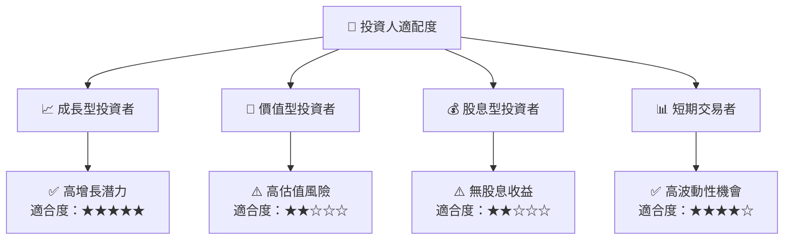

### 10.5 關鍵監控指標

| 監控類型 | 指標 | 關注點 | 頻率 |
|----------|------|-------|------|
| 收入增長 | 年度營收增長率 | 是否超出預期 | 季度 |
| 獲利能力 | 毛利率、淨利率 | 是否持續改善 | 季度 |
| 現金流 | 自由現金流 | 流動性與資本配置 | 半年 |
| 估值情境 | Forward P/E | 是否調整至合理區間 | 每月 |

---

> **免責聲明**：本報告為 AI 自動生成，僅供研究參考，不構成投資建議。投資有風險，入市需謹慎。