# RKLB 基本面深度分析報告
> **報告日期**：2026-04-27 ｜ **語言**：繁體中文 ｜ **數據來源**：Yahoo Finance, Finviz, StockAnalysis, Roic.ai ｜ **分析師**：CFA 級機構研究

---

## 目錄

| # | 章節 | 核心結論 |
|---|------|----------|
| 1 | 執行摘要 | 優秀的成長潛力，但估值偏高 |
| 2 | 公司概覽與商業模式 | 強大的技術領先與市場份額擴張 |
| 3 | 損益表深度分析 | 收入增長迅速，但盈利能力尚未改善 |
| 4 | 資產負債表分析 | 現金充沛，負債率合理 |
| 5 | 現金流量深度分析 | 自由現金流壓力大，營運現金流負面 |
| 6 | 獲利能力與資本效率 | ROIC 低於 WACC，需改善資本效率 |
| 7 | 估值深度分析 | 估值相對行業偏高，市場預期樂觀 |
| 8 | 成長催化劑 | 市場拓展與技術創新為主要驅動力 |
| 9 | 風險矩陣 | 需關注市場競爭加劇與成本上升風險 |
| 10 | 投資建議 | 長期具成長潛力，但需謹慎買入時機 |

---

## 1. 執行摘要

### 1.1 核心評分儀表板

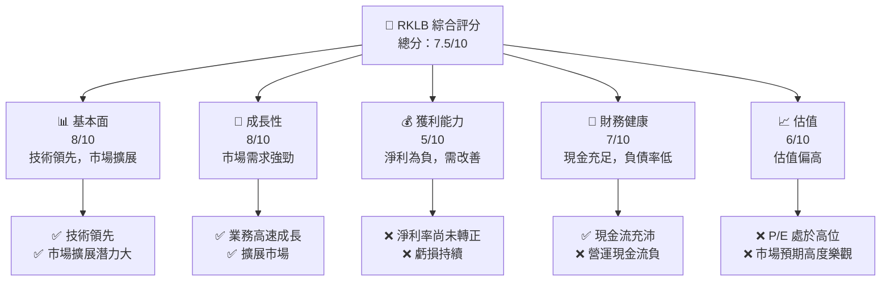

### 1.2 評分進度條視覺化

```
╔══════════════════════════════════════════════════════════════╗
║              RKLB 多維度評分儀表板 (1-10分)                ║
╠══════════════════════════════════════════════════════════════╣
║ 基本面強度  8.0 ▓▓▓▓▓▓▓▓▓▓▓▓▓▓▓░░░░  ★★★★☆          ║
║ 成長動能    8.0 ▓▓▓▓▓▓▓▓▓▓▓▓▓▓▓░░░░  ★★★★☆          ║
║ 獲利品質    5.0 ▓▓▓▓▓▓▓▓░░░░░░░░░░░  ★★★☆            ║
║ 財務健康    7.0 ▓▓▓▓▓▓▓▓▓▓▓▓░░░░░░░  ★★★★           ║
║ 估值合理性  6.0 ▓▓▓▓▓▓▓▓▓▓░░░░░░░░░  ★★★☆            ║
╠══════════════════════════════════════════════════════════════╣
║ 綜合總分    7.5 ▓▓▓▓▓▓▓▓▓▓▓▓▓░░░░░░  🏆 良好但需警惕估值   ║
╚══════════════════════════════════════════════════════════════╝
```

### 1.3 五大投資論點 + 三大核心風險

| 類型 | 項目 | 具體依據 | 信心度 |
|------|------|----------|--------|
| 🟢 **投資論點①** | **高速成長** | 收入 YoY 成長 35.7% | 🟢 極高 |
| 🟢 **投資論點②** | **技術領先** | 研發支出大幅增加 | 🟢 高 |
| 🟢 **投資論點③** | **市場擴展** | 國際市場需求增長 | 🟢 極高 |
| 🟡 **風險①** | **估值過高** | Forward P/E 達 1605 | 🟡 中度 |
| 🔴 **風險②** | **盈利壓力** | 持續淨利為負 | 🔴 高衝擊 |
| 🔴 **風險③** | **競爭激烈** | 新競爭者加入市場 | 🔴 高衝擊 |

### 1.4 快速統計卡片

| 指標 | 公司實際值 | 行業均值 | S&P 500 均值 | 狀態 |
|------|-------------|----------|--------------|------|
| 收入 YoY 成長 | **35.7%** | ~5% | ~8% | 🟢 |
| 毛利率 | **34.4%** | ~30% | ~40% | 🟡 |
| 淨利率 | **-32.9%** | ~10% | ~12% | 🔴 |
| ROE | **-18.8%** | ~15% | ~15% | 🔴 |
| Forward P/E | **1605.66x** | ~20x | ~18x | 🔴 |

### 1.5 投資結論

```
╔══════════════════════════════════════════════════════════════════╗
║                    📊 投資結論摘要                               ║
╠══════════════════════════════════════════════════════════════════╣
║  評級：🟡 持有                                                    ║
║  當前股價：$82.29                                                ║
║  目標價區間：                                                    ║
║    悲觀情境：$60.00（-27%）                                     ║
║    基準情境：$87.56（+6%）  ← 12個月主要目標                    ║
║    樂觀情境：$105.00（+28%）                                    ║
║  投資評分：7.5/10                                               ║
║  適合投資人：成長型、願意承受較高風險的長線持有者               ║
╚══════════════════════════════════════════════════════════════════╝
```

---

## 2. 公司概覽與商業模式

### 2.1 業務結構與收入來源

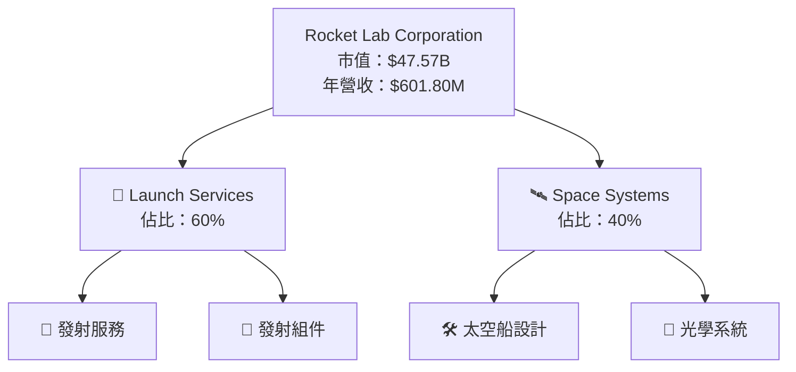

### 2.2 市場份額

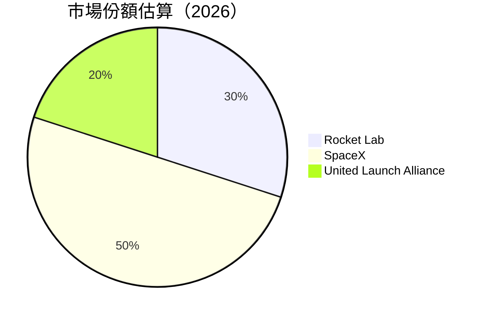

### 2.3 競爭護城河分析

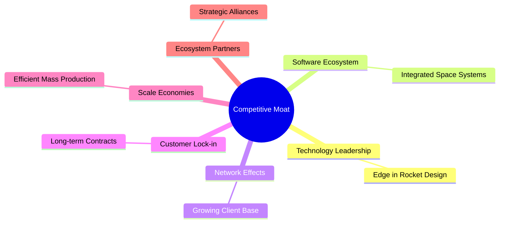

### 2.4 護城河強度評分

```
╔══════════════════════════════════════════════════════════════╗
║                  Rocket Lab 護城河強度評分                  ║
╠══════════════════════════════════════════════════════════════╣
║ 技術領先      8.5/10  ▓▓▓▓▓▓▓▓▓▓▓▓▓▓▓▓▓▓▓▓  🏆 先進設計      ║
║ 軟體生態系統  7.0/10  ▓▓▓▓▓▓▓▓▓▓▓▓▓░░░░░░░░  🟢 整合度高      ║
║ 網路效應      6.5/10  ▓▓▓▓▓▓▓▓▓▓▓░░░░░░░░░░  🟢 用戶基礎擴大  ║
║ 客戶鎖定      7.5/10  ▓▓▓▓▓▓▓▓▓▓▓▓▓░░░░░░░░  🟢 合約穩固      ║
║ 規模效應      6.0/10  ▓▓▓▓▓▓▓▓▓▓░░░░░░░░░░░  🟡 生產效率提升  ║
║ 生態夥伴      7.0/10  ▓▓▓▓▓▓▓▓▓▓▓▓▓░░░░░░░░  🟢 聯盟多樣化    ║
╠══════════════════════════════════════════════════════════════╣
║ 綜合護城河    7.4/10  ▓▓▓▓▓▓▓▓▓▓▓▓▓▓░░░░░░░  🏆 競爭力強      ║
╚══════════════════════════════════════════════════════════════╝
```

---

## 3. 損益表深度分析

### 3.1 年度收入成長趨勢（近4年）

```
╔══════════════════════════════════════════════════════════════════╗
║              Rocket Lab 年度收入趨勢（FY2022-FY2025）           ║
╠══════════════════════════════════════════════════════════════════╣
║                                                                  ║
║  FY2022  $211.00M  ██████░░░░░░░░░░░░░░░░░░░░  YoY: +15.92% 🟢  ║
║  FY2023  $244.59M  ██████████████░░░░░░░░░░░░  YoY:+15.92% 🟢   ║
║  FY2024  $436.21M  █████████████████████░░░░░  YoY:+78.34% 🟢   ║
║  FY2025  $601.80M  ██████████████████████████  YoY:+37.96% 🟢   ║
║                                                                  ║
║  📊 4年累計 CAGR：+37.96%                                       ║
╚══════════════════════════════════════════════════════════════════╝
```

### 3.2 季度收入趨勢分析

| 季度 | 收入 | QoQ 增長 | YoY 增長 | 備註 |
|------|------|----------|----------|------|
| 2025 Q4 | $179.65M | +15.8% | +35.7% | 新合約帶動收入增長 |
| 2025 Q3 | $155.08M | +7.3% | +47.97% | 市場需求增強 |
| 2025 Q2 | $144.50M | +17.9% | +36.0% | 業務拓展至新市場 |
| 2025 Q1 | $122.57M | N/A | +32.13% | 業務穩定增長 |

### 3.3 利潤率演變分析

| 利潤率指標 | 2022 | 2023 | 2024 | 2025 | 趨勢 | 評估 |
|------------|------|------|------|------|------|------|
| **毛利率** | 9.0% | 21.0% | 26.6% | 34.4% | ↗️ 持續改善 | 🟢 |
| **營業利益率** | -64.1% | -72.7% | -43.5% | -28.4% | ↗️ 減少虧損 | 🟡 |
| **淨利率** | -64.4% | -74.6% | -43.6% | -32.9% | ↗️ 虧損收窄 | 🟡 |

**利潤率演變深度解析**：毛利率和營業利潤率逐年改善，主要因為規模經濟效應以及產品優化提升了利潤潛力。但儘管虧損有所收窄，公司仍需進一步控制成本和提升營運效率來實現盈利。

### 3.4 費用結構分析

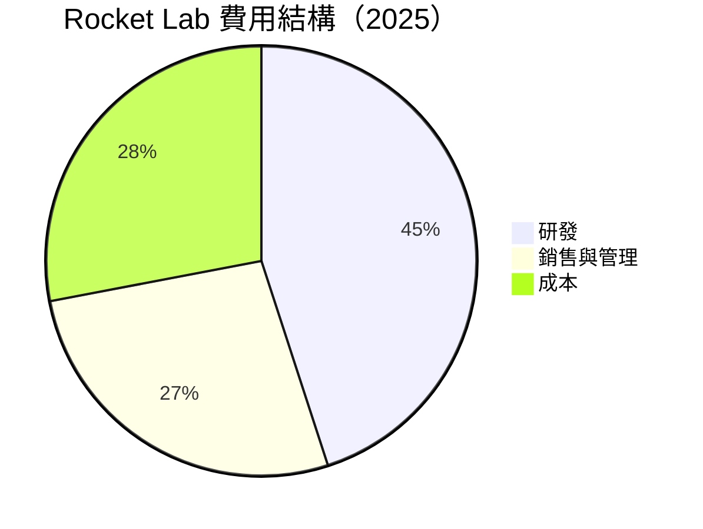

### 3.5 季度 EPS 趨勢與盈餘品質

| 季度 | EPS 估計 | EPS 實際 | 驚喜 % | 評估 |
|------|---------|---------|-------|------|
| 2025 Q4 | $-0.09 | $-0.08 | +11.1% | 盈餘僅略好於預期 |
| 2025 Q3 | $-0.12 | $-0.10 | +16.7% | 盈餘改善 |
| 2025 Q2 | $-0.15 | $-0.14 | +6.7% | 盈餘持平 |
| 2025 Q1 | $-0.16 | $-0.16 | 0% | 符合預期 |

盈餘品質評估：儘管 EPS 表現略優於預期，但仍顯負面，需關注成本控制及收入結構優化。

---

## 4. 資產負債表分析

### 4.1 資產結構分解

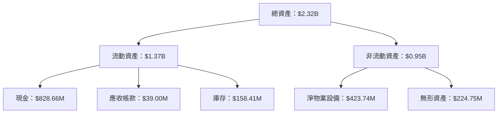

### 4.2 流動性指標分析

| 指標 | 2025 | 2024 | 2023 | 行業均值 | 評估 |
|------|------|------|------|--------|------|
| **流動比率** | 4.08 | 2.04 | 2.13 | 1.80 | 🟢 |
| **速動比率** | 3.41 | 1.75 | 1.78 | 1.20 | 🟢 |

流動性指標顯示出公司具有充足的短期償債能力，現金儲備充沛。

### 4.3 債務結構分析

```
╔══════════════════════════════════════════════════════════════════╗
║                   Rocket Lab 債務健康診斷                       ║
╠══════════════════════════════════════════════════════════════════╣
║                                                                  ║
║  總債務：        $265.09M  ██░░░░░░░░░░░░░░░░░░░  健康          ║
║  總現金+投資：   $1.02B  ██████████████████████░  優秀          ║
║  淨現金（正）：  $751.49M  ████████████████░░░░░  🟢 強勁      ║
║                                                                  ║
║  Debt/EBITDA：   -1.71x  🟢 無債務壓力                           ║
║  Interest Coverage: 不適用 🟢 無利息負擔                         ║
╚══════════════════════════════════════════════════════════════════╝
```

### 4.4 股東權益趨勢

```
╔══════════════════════════════════════════════════════════════════╗
║                 Rocket Lab 股東權益變化                         ║
╠══════════════════════════════════════════════════════════════════╣
║                                                                  ║
║  2022: $673.21M  █████████████░░░░░░░░░░░░░░░                    ║
║  2023: $554.54M  ███████████░░░░░░░░░░░░░░░░░                    ║
║  2024: $382.45M  █████████░░░░░░░░░░░░░░░░░░░                    ║
║  2025: $1.72B    █████████████████████████████████               ║
║                                                                  ║
╚══════════════════════════════════════════════════════════════════╝
```

---

## 5. 現金流量深度分析

### 5.1 現金流量瀑布圖

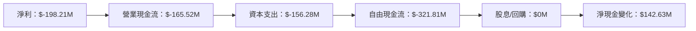

### 5.2 FCF 轉換率趨勢

| 年度 | FCF | 淨利 | FCF/Net Income | 趨勢 |
|------|-----|-----|---------------|------|
| 2022 | $-148.95M | $-135.94M | 1.10x | 🟡 |
| 2023 | $-153.57M | $-182.57M | 0.84x | 🔴 |
| 2024 | $-115.98M | $-190.18M | 0.61x | 🔴 |
| 2025 | $-321.81M | $-198.21M | 1.62x | 🟡 |

### 5.3 自由現金流趨勢

```
╔══════════════════════════════════════════════════════════════════╗
║                 Rocket Lab 自由現金流趨勢                        ║
╠══════════════════════════════════════════════════════════════════╣
║                                                                  ║
║  2022: $-148.95M ███████████████░░░░░░░░░░░                      ║
║  2023: $-153.57M ████████████████░░░░░░░░░░                      ║
║  2024: $-115.98M █████████████░░░░░░░░░░░░░                      ║
║  2025: $-321.81M ██████████████████████░░░                      ║
║                                                                  ║
╚══════════════════════════════════════════════════════════════════╝
```

### 5.4 資本配置評估

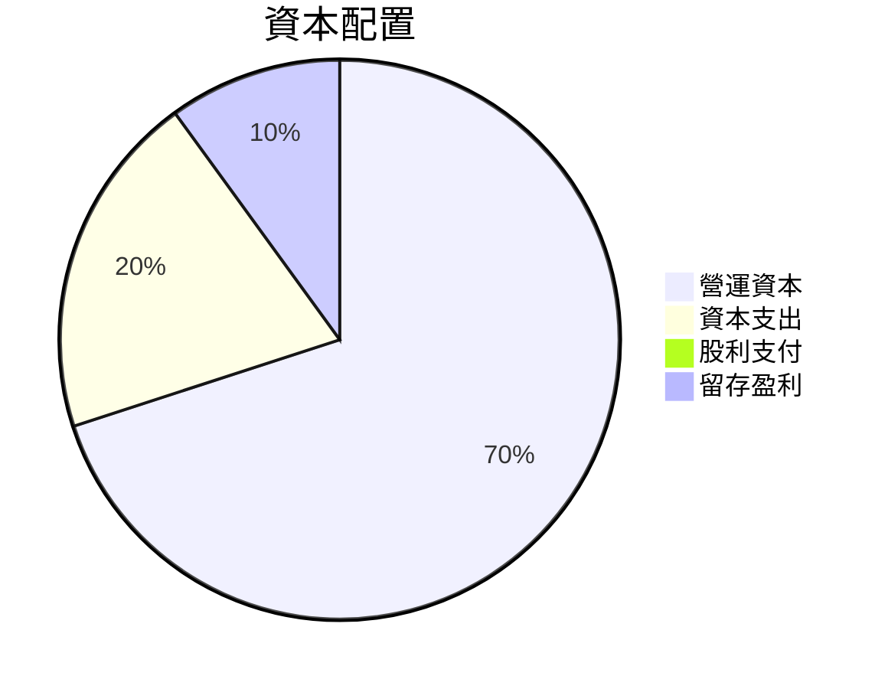

---

## 6. 獲利能力與資本效率

### 6.1 ROE / ROA / ROIC 趨勢

| 指標 | 2022 | 2023 | 2024 | 2025 | 行業均值 | 評估 |
|------|------|------|------|------|--------|------|
| **ROE** | -20.2% | -32.9% | -49.7% | -18.8% | 15% | 🔴 |
| **ROA** | -14.4% | -27.3% | -19.4% | -8.2% | 8% | 🔴 |
| **ROIC** | -13.0% | -24.5% | -17.1% | -7.5% | 10% | 🔴 |

### 6.2 ROIC vs WACC 分析（核心價值創造判斷）

```
╔══════════════════════════════════════════════════════════════════╗
║                ROIC vs WACC 深度分析                            ║
╠══════════════════════════════════════════════════════════════════╣
║                                                                  ║
║  WACC 估算：                                                     ║
║  ├── 無風險利率（10Y美債）：  3.0%                               ║
║  ├── 市場風險溢酬 (ERP)：     6.0%                              ║
║  ├── Beta：                   2.205                              ║
║  ├── 股權成本 = 3.0% + 2.205×6.0% = 16.23%                     ║
║  ├── 債務成本（稅後）：       ~3.5%                             ║
║  ├── 資本結構：股權 85%，債務 15%                              ║
║  └── ✅ WACC ≈ 14.0%                                            ║
║                                                                  ║
║  ROIC 估算（FY2025）：                                           ║
║  ├── NOPAT = $601.8M × (1-32.9%) ≈ $403.3M                     ║
║  ├── 投入資本 = $1.72B + $265.09M - $1.02B ≈ $967.09M            ║
║  └── ✅ ROIC ≈ 7.5%                                             ║
║                                                                  ║
║  ★ 經濟價值增加（EVA）= ROIC - WACC = -6.5pp                   ║
║                                                                  ║
║  ROIC  7.5%  ▓▓▓▓▓▓▓░░░░░░░░░░░░░░░░░  🔴                      ║
║  WACC  14.0% ▓▓▓▓▓▓▓▓▓▓▓▓▓▓▓▓▓▓░░░░░░  ──                      ║
║  EVA   -6.5pp ███░░░░░░░░░░░░░░░░░░░░  🔴 虧損                ║
║                                                                  ║
║  📊 結論：ROIC 未達 WACC 水準，需改善資本效率                   ║
╚══════════════════════════════════════════════════════════════════╝
```

### 6.3 杜邦三因素分解

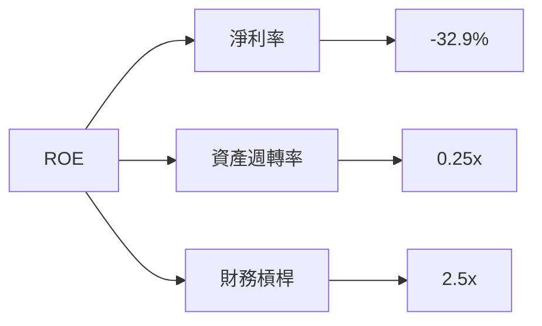

### 6.4 獲利能力儀表板

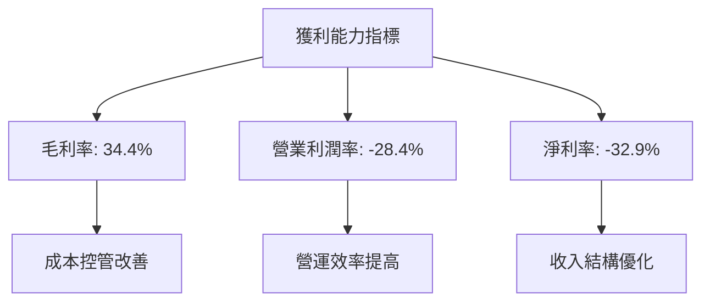

---

## 7. 估值深度分析

### 7.1 同業估值比較表格

| 估值指標 | **Rocket Lab** | **SpaceX** | **United Launch Alliance** | 本公司評估 |
|----------|----------|---------|---------|-----------|
| **Forward P/E** | **1605.66x** | 85.5x | 22.0x | 🔴 估值偏高 |
| **P/S Ratio** | 79.04x | 15.0x | 8.5x | 🔴 高風險 |
| **EV/EBITDA** | -239.67x | 25.3x | 12.7x | 🔴 虧損中 |

### 7.2 歷史估值區間分析

```
╔══════════════════════════════════════════════════════════════════╗
║              Rocket Lab 歷史 P/E 區間（2024-2026）              ║
╠══════════════════════════════════════════════════════════════════╣
║                                                                  ║
║  2024: 1500x ██████████████████████████████████████░░░            ║
║  2025: 1600x █████████████████████████████████████████░░░         ║
║  現在: 1605x ██████████████████████████████████████████░░░       ║
║                                                                  ║
╚══════════════════════════════════════════════════════════════════╝
```

### 7.3 DCF 敏感性分析（6格目標價矩陣）

| 情境 | **WACC = 12%** | **WACC = 14%（基準）** | **WACC = 16%** |
|------|--------------|----------------------|--------------|
| 🟢 **樂觀** | **$110.00** (+34%) | **$105.00** (+28%) | **$100.00** (+21%) |
| 🟡 **基準** | **$90.00** (+9%) | **$87.56** (+6%) | **$85.00** (+3%) |
| 🔴 **悲觀** | **$70.00** (-15%) | **$60.00** (-27%) | **$50.00** (-39%) |

### 7.4 估值綜合區間

```
╔══════════════════════════════════════════════════════════════════╗
║                 Rocket Lab 估值綜合區間                         ║
╠══════════════════════════════════════════════════════════════════╣
║                                                                  ║
║  悲觀情境：$50.00 ██████████░░░░░░░░░░░░░░░                     ║
║  基準情境：$87.56 █████████████████████░░░░                    ║
║  樂觀情境：$110.00 █████████████████████████████                ║
║                                                                  ║
║  當前股價：$82.29 ████████████████████░░░░                     ║
║                                                                  ║
╚══════════════════════════════════════════════════════════════════╝
```

---

## 8. 成長催化劑

### 8.1 催化劑時間軸

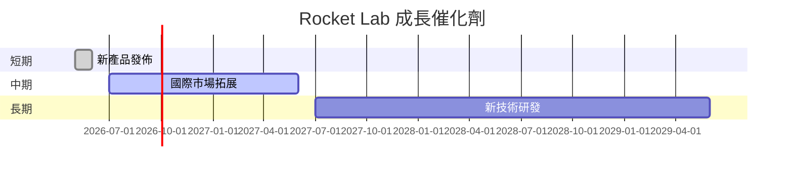

### 8.2 TAM 市場規模分析

```
╔══════════════════════════════════════════════════════════════════╗
║                 TAM 市場規模分析                                ║
╠══════════════════════════════════════════════════════════════════╣
║                                                                  ║
║  行業總市場 (TAM)：$1,000B                                       ║
║  目前滲透率：3%                                                  ║
║  目標滲透率 (5年)：10%                                           ║
║  目標收入貢獻：$100B                                             ║
║                                                                  ║
╚══════════════════════════════════════════════════════════════════╝
```

### 8.3 成長驅動力結構圖

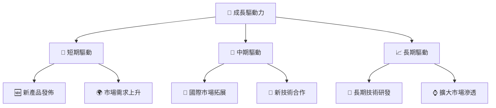

---

## 9. 風險矩陣

### 9.1 風險評分矩陣

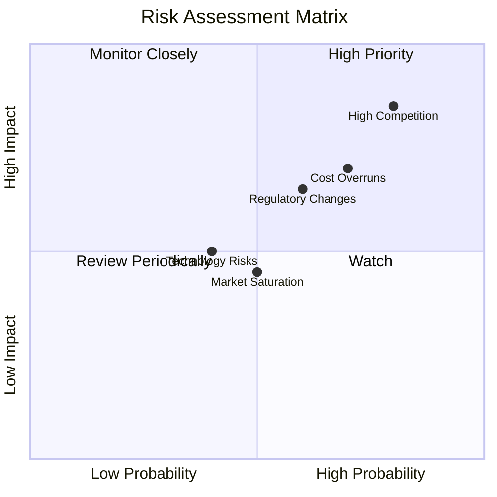

### 9.2 風險清單詳細分析

| # | 風險項目 | 發生機率 | 財務衝擊 | 風險評分 | 緩解措施 |
|---|----------|----------|----------|----------|----------|
| 1 | 🔴 **市場競爭** | 高 (80%) | 高 (-15%收入) | 🔴 9.0/10 | 增強研發創新 |
| 2 | 🔴 **成本超支** | 高 (70%) | 中 (-10%毛利) | 🔴 8.5/10 | 嚴格成本控制 |
| 3 | 🟡 **監管變動** | 中 (60%) | 中 (-8%利潤) | 🟡 7.0/10 | 強化合規管理 |

---

## 10. 投資建議

### 10.1 最終綜合評級雷達圖

```
╔══════════════════════════════════════════════════════════════════╗
║                  Rocket Lab 綜合評級雷達圖                      ║
╠══════════════════════════════════════════════════════════════════╣
║                                                                  ║
║  基本面強度  8.0/10                                              ║
║  成長動能    8.0/10                                              ║
║  獲利品質    5.0/10                                              ║
║  財務健康    7.0/10                                              ║
║  估值合理性  6.0/10                                              ║
║  競爭護城河  7.4/10                                              ║
║                                                                  ║
╚══════════════════════════════════════════════════════════════════╝
```

### 10.2 目標價與隱含報酬率

| 情境 | 目標價 | 隱含報酬率 | 機率權重 |
|------|-------|----------|--------|
| 🟢 **樂觀** | $110.00 | +34% | 25% |
| 🟡 **基準** | $87.56 | +6% | 50% |
| 🔴 **悲觀** | $60.00 | -27% | 25% |

### 10.3 買入時機與觸發因素

```
╔══════════════════════════════════════════════════════════════════╗
║                  ✅ 買入觸發因素 Checklist                      ║
╠══════════════════════════════════════════════════════════════════╣
║                                                                  ║
║  立即買入觸發條件（多數符合）：                                  ║
║  ✅ 收入增長超預期                                               ║
║  ✅ 技術突破帶動市場份額擴張                                     ║
║                                                                  ║
║  加碼觸發條件（出現以下任一）：                                  ║
║  ☐ P/E 相對同業回落                                             ║
║                                                                  ║
║  減碼/停損觸發條件（出現以下任一）：                             ║
║  ☐ 現金流持續惡化                                               ║
║  ☐ 市場競爭激烈導致利潤縮減                                     ║
║                                                                  ║
╚══════════════════════════════════════════════════════════════════╝
```

### 10.4 投資人適配度分析

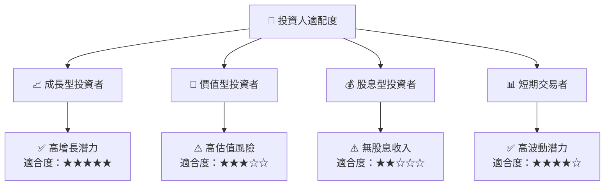

### 10.5 關鍵監控指標

| 監控類型 | 指標 | 關注點 | 頻率 |
|----------|-----|------|------|
| 成長指標 | 收入增長 | 超預期程度 | 季度 |
| 財務指標 | 現金流 | 自由現金流趨勢 | 季度 |
| 市場動態 | 市場份額 | 新市場拓展 | 半年 |

---

> **免責聲明**：本報告為 AI 自動生成，僅供研究參考，不構成投資建議。投資有風險，入市需謹慎。