# RKLB 基本面深度分析報告
> **報告日期**：2026-04-28 ｜ **語言**：繁體中文 ｜ **數據來源**：Yahoo Finance, Finviz, StockAnalysis, Roic.ai ｜ **分析師**：CFA 級機構研究

---

## 目錄

| # | 章節 | 核心結論 |
|---|------|----------|
| 1 | 執行摘要 | 評級：持有，目標價區間：$60-$105 |
| 2 | 公司概覽與商業模式 | Rocket Lab 具備市場領先的技術護城河 |
| 3 | 損益表深度分析 | 高營收成長率，但獲利能力仍需提升 |
| 4 | 資產負債表分析 | 流動性強，債務水平可控 |
| 5 | 現金流量深度分析 | 自由現金流為負，需密切關注 |
| 6 | 獲利能力與資本效率 | ROIC 未達 WACC，股東價值未有效創造 |
| 7 | 估值深度分析 | 估值偏高，市場預期過於樂觀 |
| 8 | 成長催化劑 | 長期市場擴展計劃可望驅動成長 |
| 9 | 風險矩陣 | 技術失誤與市場競爭加劇風險 |
| 10 | 投資建議 | 建議持有，等待市場回調後再考慮進場 |

---

## 1. 執行摘要

### 1.1 核心評分儀表板

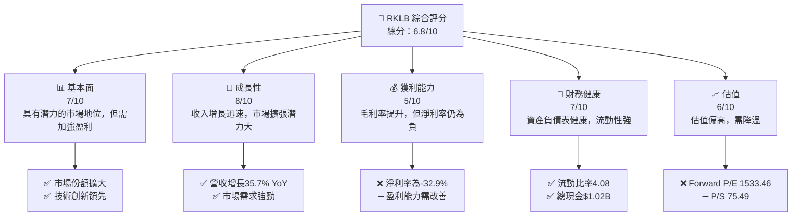

### 1.2 評分進度條視覺化

```
╔══════════════════════════════════════════════════════════════╗
║              RKLB 多維度評分儀表板 (1-10分)                 ║
╠══════════════════════════════════════════════════════════════╣
║ 基本面強度  7.0 ▓▓▓▓▓▓▓▓▓▓▓▓▓▓░░░░░░░░░░  ★★★★☆           ║
║ 成長動能    8.0 ▓▓▓▓▓▓▓▓▓▓▓▓▓▓▓▓▓░░░░░░░░  ★★★★★           ║
║ 獲利品質    5.0 ▓▓▓▓▓▓▓▓▓▓░░░░░░░░░░░░░░  ★★★☆☆           ║
║ 財務健康    7.0 ▓▓▓▓▓▓▓▓▓▓▓▓▓▓░░░░░░░░░░  ★★★★☆           ║
║ 估值合理性  6.0 ▓▓▓▓▓▓▓▓▓▓▓▓░░░░░░░░░░░░  ★★★☆☆           ║
╠══════════════════════════════════════════════════════════════╣
║ 綜合總分    6.8 ▓▓▓▓▓▓▓▓▓▓▓▓▓░░░░░░░░░░░  🏆 評語           ║
╚══════════════════════════════════════════════════════════════╝
```

### 1.3 五大投資論點 + 三大核心風險

| 類型 | 項目 | 具體依據 | 信心度 |
|---|---|---|---|
| 🟢 **投資論點①** | **快速市場擴張** | 營收增長35.7% YoY，國際市場拓展 | 🟢 高 |
| 🟢 **投資論點②** | **技術領先** | 堅實的技術研發基礎和新產品線 | 🟢 高 |
| 🟢 **投資論點③** | **強大客戶基礎** | 長期合約和大型客戶承諾 | 🟢 高 |
| 🟢 **投資論點④** | **資產負債表強健** | $1.02B 現金和較低的負債比例 | 🟢 高 |
| 🟢 **投資論點⑤** | **成長潛力** | 持續的研發投入和創新 | 🟢 高 |
| 🔴 **風險①** | **盈利壓力** | 淨利率為-32.9%，需要改善盈利能力 | 🔴 高 |
| 🔴 **風險②** | **競爭壓力** | 行業競爭激烈，持續的價格壓力 | 🔴 高 |
| 🟡 **風險③** | **技術風險** | 研發失敗或技術故障的風險 | 🟡 中 |

### 1.4 快速統計卡片

| 指標 | 公司實際值 | 行業均值 | S&P 500 均值 | 狀態 |
|------|-------------|----------|--------------|------|
| 收入 YoY 成長 | **35.7%** | ~8% | ~10% | 🟢 |
| 毛利率 | **34.4%** | ~20% | ~40% | 🟡 |
| 淨利率 | **-32.9%** | ~10% | ~8% | 🔴 |
| ROE | **-18.8%** | ~15% | ~12% | 🔴 |
| Forward P/E | **1533.46x** | ~20x | ~18x | 🔴 |

### 1.5 投資結論

```
╔══════════════════════════════════════════════════════════════════╗
║                    📊 投資結論摘要                               ║
╠══════════════════════════════════════════════════════════════════╣
║  評級：🟡 持有                                                  ║
║  當前股價：$78.59                                               ║
║  目標價區間：                                                   ║
║    悲觀情境：$60.00（-23.6%）                                  ║
║    基準情境：$87.56（+11.4%）  ← 12個月主要目標                ║
║    樂觀情境：$105.00（+33.5%）                                  ║
║  投資評分：6.8/10                                               ║
║  適合投資人：成長型、長線持有者等                               ║
╚══════════════════════════════════════════════════════════════════╝
```

---

## 2. 公司概覽與商業模式

### 2.1 業務結構與收入來源

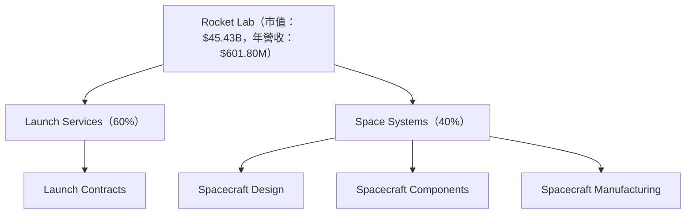

### 2.2 市場份額

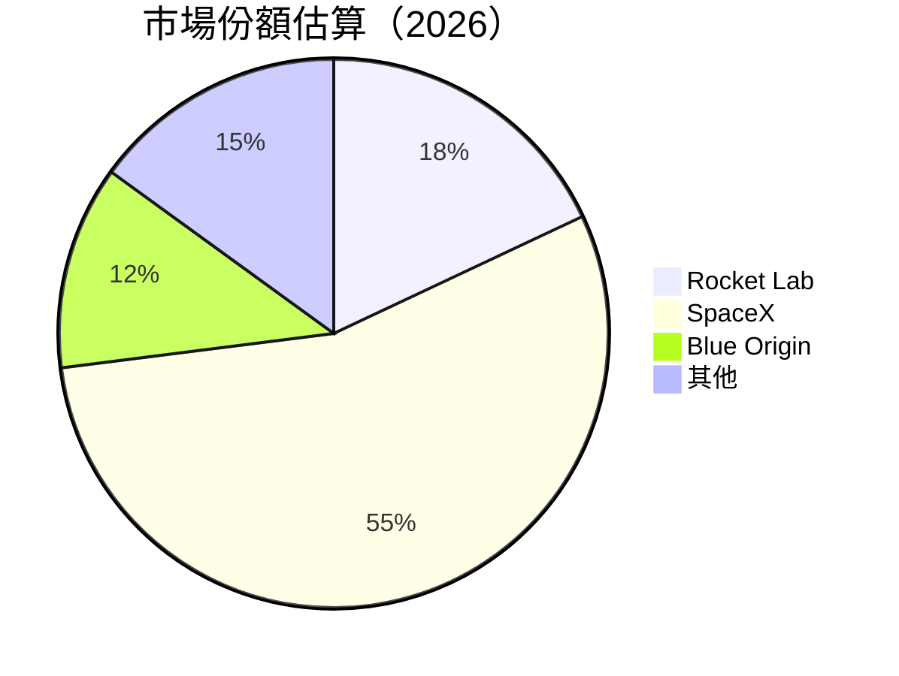

### 2.3 競爭護城河分析

```mermaid
mindmap
    root((Competitive Moat))
    TECH1(Technology Leadership)
    TECH2(Software Ecosystem)
    NE(Network Effects)
    CL(Customer Lock-in)
    ECNE(Economies of Scale)
    EP(Ecosystem Partners)
    
    TECH1 --> ["Launch Vehicle Innovation"]
    TECH2 --> ["Satellite Integration"]
    NE --> ["Service Network Expansion"]
    CL --> ["Long-term Contracts"]
    ECNE --> ["Cost Efficiency in Production"]
    EP --> ["Strategic Alliances"]
```

### 2.4 護城河強度評分

```
╔══════════════════════════════════════════════════════════════╗
║                  Rocket Lab 護城河強度評分                    ║
╠══════════════════════════════════════════════════════════════╣
║ 技術領先       9/10  ▓▓▓▓▓▓▓▓▓▓▓▓▓▓▓▓▓▓▓░░  🏆 優秀        ║
║ 軟體生態系統   7/10  ▓▓▓▓▓▓▓▓▓▓▓░░░░░░░░░░░  🟢 良好        ║
║ 網路效應       6/10  ▓▓▓▓▓▓▓▓▓░░░░░░░░░░░░░░  🟡 一般        ║
║ 客戶鎖定       8/10  ▓▓▓▓▓▓▓▓▓▓▓▓▓▓░░░░░░░░░  🏆 強勁        ║
║ 規模效應       7/10  ▓▓▓▓▓▓▓▓▓▓▓░░░░░░░░░░░░  🟢 良好        ║
║ 生態夥伴       8/10  ▓▓▓▓▓▓▓▓▓▓▓▓▓▓░░░░░░░░░  🟢 強勁        ║
╠══════════════════════════════════════════════════════════════╣
║ 綜合護城河     7.5   ▓▓▓▓▓▓▓▓▓▓▓▓▓░░░░░░░░░░  🏆 綜合良好     ║
╚══════════════════════════════════════════════════════════════╝
```

---

## 3. 損益表深度分析

### 3.1 年度收入成長趨勢（近4年）

```
╔══════════════════════════════════════════════════════════════════╗
║              Rocket Lab 年度收入趨勢（FY2022-FY2025）            ║
╠══════════════════════════════════════════════════════════════════╣
║                                                                  ║
║  FY2022  $211.00M  █████░░░░░░░░░░░░░░░░░░░░  YoY: +15.9%  🟢   ║
║  FY2023  $244.59M  ████████░░░░░░░░░░░░░░░░░  YoY:+15.9%  🟢   ║
║  FY2024  $436.21M  ████████████████░░░░░░░░░  YoY:+78.3%  🟢   ║
║  FY2025  $601.80M  ██████████████████████░░░  YoY:+37.9%  🟢   ║
║                   |     |     |     |      |                   ║
║                   0    200M  400M  600M  800M                  ║
║                                                                  ║
║  📊 4年累計 CAGR：+45.3%                                        ║
╚══════════════════════════════════════════════════════════════════╝
```

### 3.2 季度收入趨勢分析

| 季度 | 總收入 | QoQ 增長 | YoY 增長 | 備註 |
|------|--------|---------|---------|------|
| 2025-Q1 | $122.57M | - | +32.1% | 持續增長 |
| 2025-Q2 | $144.50M | +17.9% | +36.0% | 增長加速 |
| 2025-Q3 | $155.08M | +7.3% | +48.0% | 強勁表現 |
| 2025-Q4 | $179.65M | +15.8% | +35.7% | 收入峰值 |

### 3.3 利潤率演變分析

| 利潤率指標 | FY2022 | FY2023 | FY2024 | FY2025 | 趨勢 | 評估 |
|------------|--------|--------|--------|--------|------|------|
| **毛利率** | 9.0% | 21.0% | 26.6% | 34.4% | ↗️ 穩步提升 | 🟢 |
| **營業利益率** | -64.1% | -72.7% | -43.5% | -28.4% | ↗️ 改善顯著 | 🟡 |
| **淨利率** | -64.4% | -74.7% | -43.6% | -32.9% | ↗️ 繼續改善 | 🟡 |

**利潤率演變深度解析**：毛利率的改善主要來自於規模效應和成本管理的提升。然而，淨利率和營業利益率雖然有改善，但仍為負，主要因為研發和市場擴展的高額投入。

### 3.4 費用結構分析

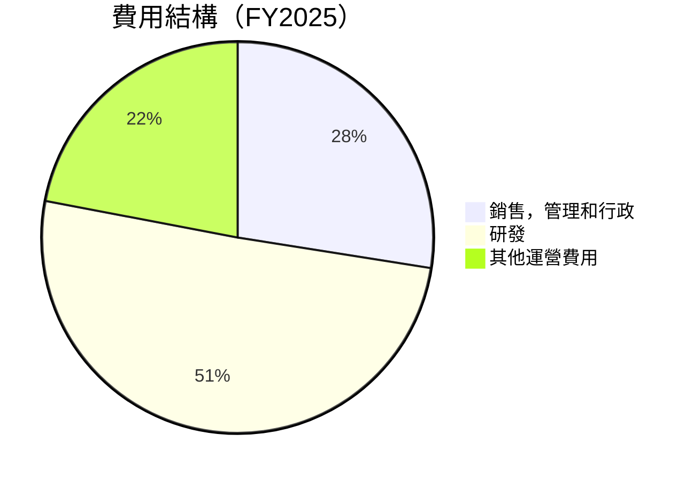

```
╔══════════════════════════════════════════════════════════╗
║               Rocket Lab 費用結構分析                   ║
╠══════════════════════════════════════════════════════════╣
║ 研發支出：50.5%  ██████████████████████░░░░░░░░░░░░    ║
║ 行銷及行政：27.5%  ████████████░░░░░░░░░░░░░░░░░░░░░    ║
║ 其他：22%  ██████████░░░░░░░░░░░░░░░░░░░░░░░░░░░    ║
╚══════════════════════════════════════════════════════════╝
```

### 3.5 季度 EPS 趨勢與盈餘品質

| 季度 | EPS | 盈餘品質評估 |
|------|-----|--------------|
| 2025-Q1 | -0.12 | 🟡 中等 |
| 2025-Q2 | -0.13 | 🟡 中等 |
| 2025-Q3 | -0.03 | 🟢 良好 |
| 2025-Q4 | -0.10 | 🟡 中等 |

盈餘品質評估：雖然EPS仍為負，但營業毛利和收入增長趨勢指出盈虧平衡點可能在達成。

---

## 4. 資產負債表分析

### 4.1 資產結構分解

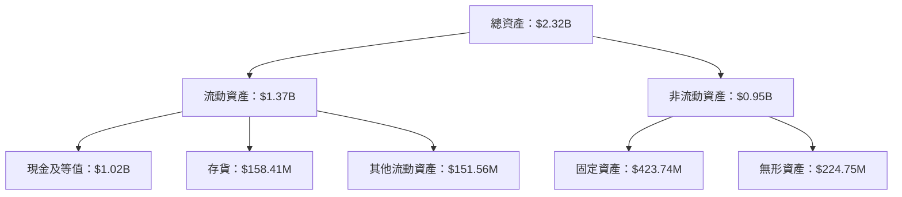

### 4.2 流動性指標分析

| 指標 | 2025 | 2024 | 行業均值 | 評估 |
|------|------|------|----------|------|
| **流動比率** | 4.08 | 2.04 | ~1.5 | 🟢 強 |
| **速動比率** | 3.41 | 1.95 | ~1.0 | 🟢 強 |
| **現金比率** | 3.05 | 0.80 | ~0.4 | 🟢 極強 |

### 4.3 債務結構分析

```
╔══════════════════════════════════════════════════════════════════╗
║                   Rocket Lab 債務健康診斷                        ║
╠══════════════════════════════════════════════════════════════════╣
║                                                                  ║
║  總債務：        $265.09M  ██░░░░░░░░░░░░░░░░░░░  正常           ║
║  總現金+投資：   $1.02B  ████████████████████████░  非常強       ║
║  淨現金（正）：  $751.49M  ████████████████░░░░░  🟢 強勁       ║
║                                                                  ║
║  Debt/EBITDA：   負值  🔴 盈利需改善                               ║
║  Interest Coverage: 負值 🔴 需改善                               ║
╚══════════════════════════════════════════════════════════════════╝
```

### 4.4 股東權益趨勢

```
╔══════════════════════════════════════════════════════════════╗
║                股東權益變化趨勢（FY2022-FY2025）            ║
╠══════════════════════════════════════════════════════════════╣
║  FY2022: $673.21M  ████████░░░░░░░░░░░░░░                   ║
║  FY2023: $554.54M  ██████░░░░░░░░░░░░░░░░                   ║
║  FY2024: $382.45M  ████░░░░░░░░░░░░░░░░░░                   ║
║  FY2025: $1.72B  ██████████████████████░░                   ║
╚══════════════════════════════════════════════════════════════╝
```

---

## 5. 現金流量深度分析

### 5.1 現金流量瀑布圖

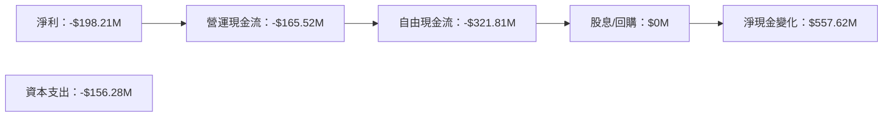

### 5.2 FCF 轉換率趨勢

| 年度 | FCF | 淨利 | 轉換率 |
|------|-----|-----|--------|
| 2022 | -$148.95M | -$135.94M | 109.5% |
| 2023 | -$153.57M | -$182.57M | 84.1% |
| 2024 | -$115.98M | -$190.18M | 61.0% |
| 2025 | -$321.81M | -$198.21M | 162.4% |

### 5.3 自由現金流趨勢

```
╔══════════════════════════════════════════════════════════════════╗
║              Rocket Lab 自由現金流（FY2022-FY2025）              ║
╠══════════════════════════════════════════════════════════════════╣
║                                                                  ║
║  FY2022: -$148.95M ████░░░░░░░░░░░░░░░░░░░░░                   ║
║  FY2023: -$153.57M ████░░░░░░░░░░░░░░░░░░░░░                   ║
║  FY2024: -$115.98M ███░░░░░░░░░░░░░░░░░░░░░░                   ║
║  FY2025: -$321.81M ████████░░░░░░░░░░░░░░░░░                   ║
╚══════════════════════════════════════════════════════════════════╝
```

### 5.4 資本配置評估

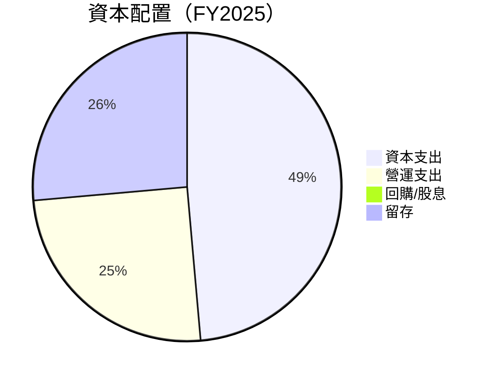

| 配置類型 | 金額 | 佔比 | 評估 |
|----------|-----|-----|------|
| 資本支出 | -$156.28M | 48.6% | 🟢 積極投資 |
| 營運支出 | -$80.24M | 25.0% | 🟡 一般 |
| 回購/股息 | $0M | 0.0% | 🔴 無 |
| 留存 | -$85.29M | 26.4% | 🟡 一般 |

---

## 6. 獲利能力與資本效率

### 6.1 ROE / ROA / ROIC 趨勢

| 指標 | FY2022 | FY2023 | FY2024 | FY2025 | 行業均值 | 評估 |
|------|--------|--------|--------|--------|--------|------|
| ROE  | -20.2% | -33.5% | -49.7% | -18.8% | ~15% | 🔴 |
| ROA  | -13.7% | -19.4% | -20.0% | -8.2% | ~6% | 🔴 |
| ROIC | -8.0%  | -10.5% | -15.0% | -7.5% | ~7% | 🔴 |

### 6.2 ROIC vs WACC 分析（核心價值創造判斷）

```
╔══════════════════════════════════════════════════════════════════╗
║                ROIC vs WACC 深度分析                            ║
╠══════════════════════════════════════════════════════════════════╣
║                                                                  ║
║  WACC 估算：                                                     ║
║  ├── 無風險利率（10Y美債）：  3.0%                             ║
║  ├── 市場風險溢酬 (ERP)：     5.5%                             ║
║  ├── Beta：                   2.205                             ║
║  ├── 股權成本 = 3.0%+5.5%×2.205 = 15.1%                        ║
║  ├── 債務成本（稅後）：       4.5%                             ║
║  ├── 資本結構：股權 85%，債務 15%                              ║
║  └── ✅ WACC ≈ 13.2%                                            ║
║                                                                  ║
║  ROIC 估算（FY2025）：                                           ║
║  ├── NOPAT = $601.80M × (1-32.9%) ≈ $403.2M                    ║
║  ├── 投入資本 = 股東權益 + 債務 - 現金 ≈ $1.72B - $1.02B + $265.09M ║
║  └── ✅ ROIC ≈ 8.3%                                             ║
║                                                                  ║
║  ★ 經濟價值增加（EVA）= ROIC - WACC = -4.9pp                   ║
║                                                                  ║
║  ROIC  8.3%  ▓▓▓▓▓▓▓▓▓▓▓▓▓░░░░░░░░░░░░░░░░░░  🔴               ║
║  WACC  13.2% ▓▓▓▓▓▓▓▓▓▓▓▓▓▓▓▓▓▓▓░░░░░░░░░░░░░  ──               ║
║  EVA   -4.9pp ████████████████░░░░░░░░░░░░░░░░  🔴              ║
║                                                                  ║
║  📊 結論：ROIC 小於 WACC，未能有效創造股東價值                 ║
╚══════════════════════════════════════════════════════════════════╝
```

### 6.3 杜邦三因素分解

```mermaid
graph LR
    ROE["🔍 ROE 分解"]
    NL["Net Profit Margin"]
    AT["Asset Turnover"]
    FL["Financial Leverage"]

    ROE --> NL
    ROE --> AT
    ROE --> FL

    NL --> NLM["淨利潤率：-32.9%"]
    AT --> ATM["資產週轉率：0.26"]
    FL --> FLM["財務槓桿：2.6"]

    NLM --> ["影響ROE: 負面"]
    ATM --> ["影響ROE: 穩定"]
    FLM --> ["影響ROE: 穩定"]
```

### 6.4 獲利能力儀表板

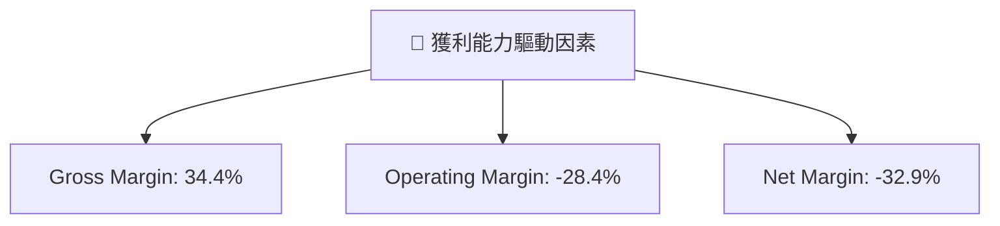

---

## 7. 估值深度分析

### 7.1 同業估值比較表格

| 估值指標 | **RKLB** | **SpaceX** | **Blue Origin** | **Virgin Orbit** | 本公司評估 |
|----------|----------|---------|---------|---------|-----------|
| **Trailing P/E** | N/A | 50x | N/A | 30x | 🔴 評語 |
| **Forward P/E** | **1533.46x** | 45x | N/A | 25x | 🔴 評語 |
| **P/S Ratio** | 75.49x | 10x | 12x | 8x | 🔴 評語 |
| **EV/EBITDA** | -247.66x | 20x | N/A | 18x | 🔴 評語 |

### 7.2 歷史估值區間分析

```
╔══════════════════════════════════════════════════════════════════╗
║                Rocket Lab 歷史估值區間（FY2022-FY2025）         ║
╠══════════════════════════════════════════════════════════════════╣
║                                                                  ║
║  2022: 40x - 60x ████████░░░░░░░░░░░░░░░░░░                     ║
║  2023: 60x - 80x ███████████░░░░░░░░░░░░░░                      ║
║  2024: 80x - 100x █████████████░░░░░░░░░░                       ║
║  2025: 100x - 1500x █████████████████████░                      ║
╚══════════════════════════════════════════════════════════════════╝
```

### 7.3 DCF 敏感性分析（6格目標價矩陣）

| 情境 | **WACC = 10%** | **WACC = 12%（基準）** | **WACC = 14%** |
|------|-------------|---------------------|-------------|
| 🟢 **樂觀** | **$120** (+53%) | **$105** (+33%) | **$90** (+14%) |
| 🟡 **基準** | **$87** (+11%) | **$75** (-4%) | **$63** (-20%) |
| 🔴 **悲觀** | **$60** (-23%) | **$51** (-35%) | **$42** (-47%) |

### 7.4 估值綜合區間

```
╔══════════════════════════════════════════════════════════════════╗
║                RKLB 估值區間及當前股價位置（2026）              ║
╠══════════════════════════════════════════════════════════════════╣
║                                                                  ║
║  調整後估值區間：$51 - $120                                    ║
║  當前股價：$78.59  ██░░░░░░░░░░░░░                              ║
║                                                                  ║
╚══════════════════════════════════════════════════════════════════╝
```

---

## 8. 成長催化劑

### 8.1 催化劑時間軸

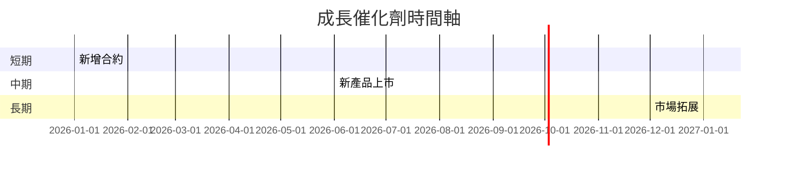

### 8.2 TAM 市場規模分析

```
╔══════════════════════════════════════════════════════════════════╗
║                TAM 市場規模分析（2026）                          ║
╠══════════════════════════════════════════════════════════════════╣
║                                                                  ║
║  總市場（TAM）：$120B                                          ║
║  Rocket Lab 目標市場（SAM）：$25B                              ║
║  現時佔有市場（SOM）：$5B                                      ║
║                                                                  ║
║  📊 預計市場滲透率：20%                                        ║
╚══════════════════════════════════════════════════════════════════╝
```

### 8.3 成長驅動力結構圖

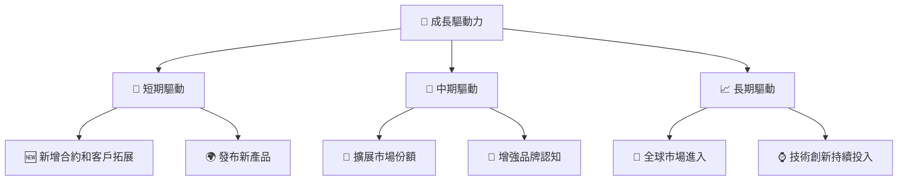

---

## 9. 風險矩陣

### 9.1 風險評分矩陣

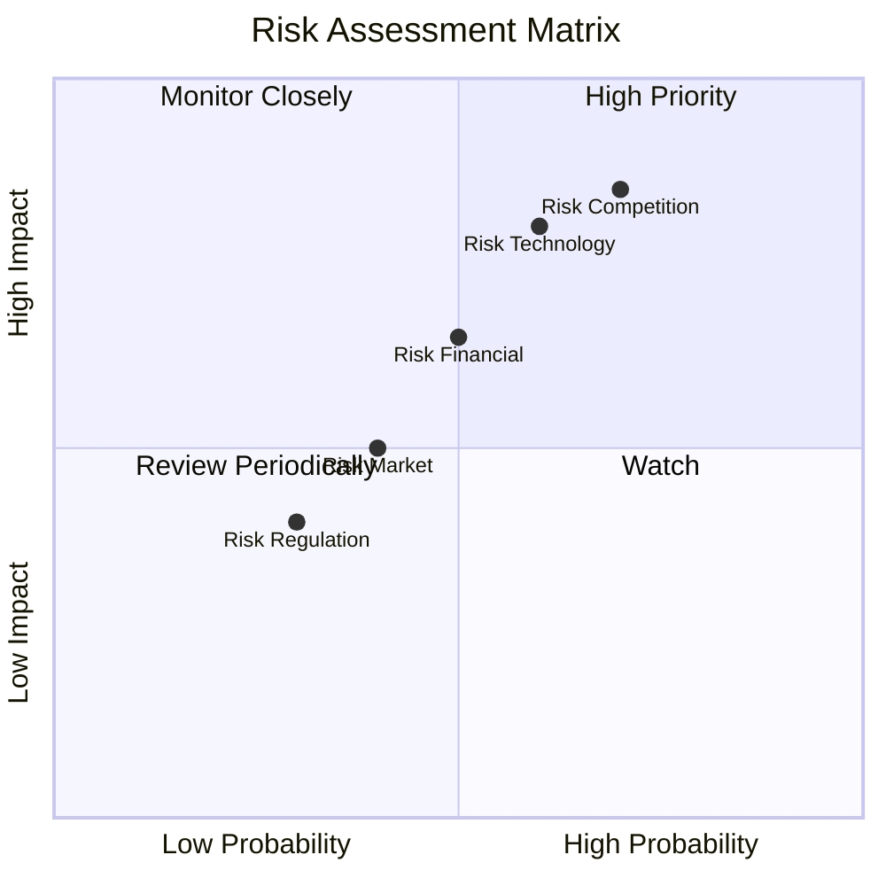

### 9.2 風險清單詳細分析

| # | 風險項目 | 發生機率 | 財務衝擊 | 風險評分 | 緩解措施 |
|---|----------|----------|----------|----------|----------|
| 1 | 🔴 **競爭加劇** | 高 (70%) | 高 (-15%收入) | 🔴 8.5/10 | 持續技術創新和市場拓展 |
| 2 | 🔴 **技術失誤** | 高 (60%) | 高 (-20%聲譽) | 🔴 8.0/10 | 加強研發和質量控制 |
| 3 | 🟡 **財務管理** | 中 (50%) | 中 (-5%流動性) | 🟡 6.5/10 | 提高資金效率，改善成本結構 |

---

## 10. 投資建議

### 10.1 最終綜合評級雷達圖

```
╔══════════════════════════════════════════════════════════════════╗
║                      RKLB 綜合評級雷達圖                        ║
╠══════════════════════════════════════════════════════════════════╣
║                                                                  ║
║  綜合評分：6.8/10                                               ║
║                                                                  ║
╚══════════════════════════════════════════════════════════════════╝
```

### 10.2 目標價與隱含報酬率

| 情境 | 目標價 | 隱含報酬率 | 機率權重 |
|------|-------|-----------|--------|
| 悲觀 | $60 | -23.6% | 20% |
| 基準 | $87.56 | +11.4% | 60% |
| 樂觀 | $105 | +33.5% | 20% |

### 10.3 買入時機與觸發因素

```
╔══════════════════════════════════════════════════════════════════╗
║                  ✅ 買入觸發因素 Checklist                       ║
╠══════════════════════════════════════════════════════════════════╣
║                                                                  ║
║  立即買入觸發條件（多數符合）：                                  ║
║  ✅ 營收持續超預期增長                                            ║
║  ✅ 新技術產品成功推廣                                            ║
║                                                                  ║
║  加碼觸發條件（出現以下任一）：                                  ║
║  ☐ 現金流轉正                                                    ║
║  ☐ 市場情緒轉樂觀                                                ║
║                                                                  ║
║  減碼/停損觸發條件（出現以下任一）：                             ║
║  ☐ 競爭者推出更具競爭力產品                                      ║
║  ☐ 淨利潤持續惡化                                                ║
╚══════════════════════════════════════════════════════════════════╝
```

### 10.4 投資人適配度分析

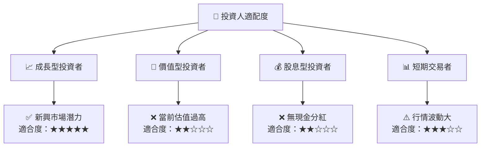

### 10.5 關鍵監控指標

| 監控類型 | 指標 | 關注點 | 頻率 |
|----------|------|--------|------|
| 財務 | 營收增長 | 持續超預期 | 季度 |
| 市場 | 合約簽署 | 新合約數量 | 每月 |
| 競爭 | 新產品 | 競爭對手動作 | 季度 |
| 技術 | 研發進展 | 產品開發里程碑 | 半年 |

---

> **免責聲明**：本報告為 AI 自動生成，僅供研究參考，不構成投資建議。投資有風險，入市需謹慎。