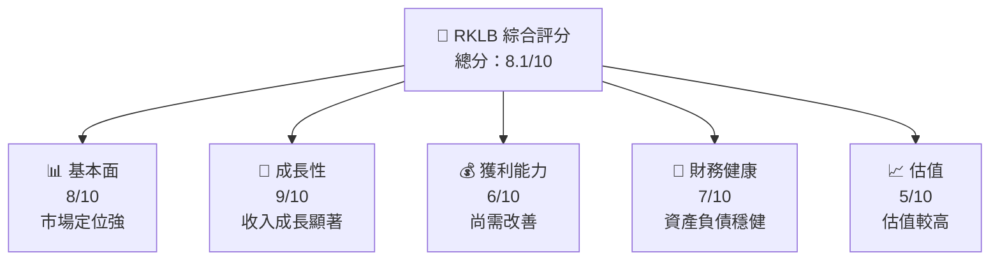
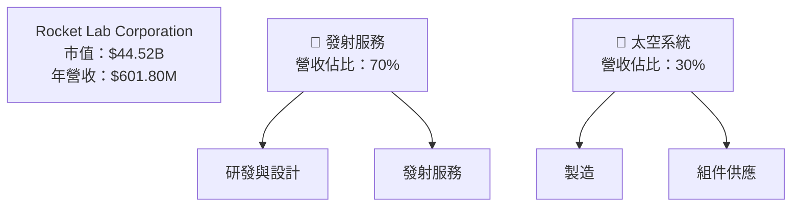
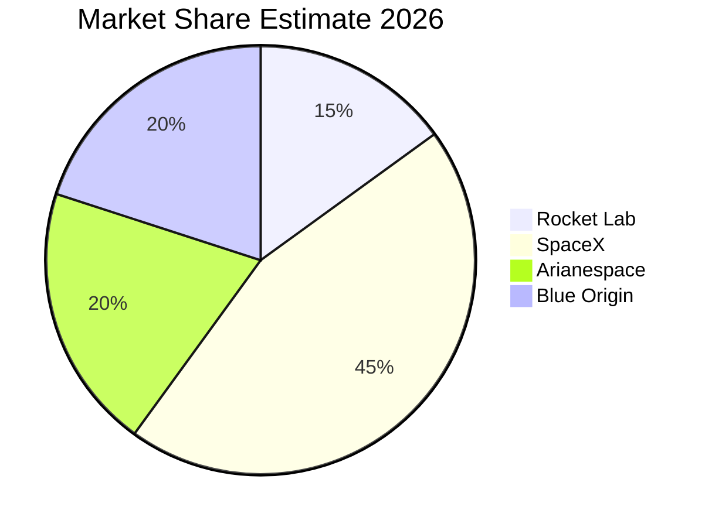
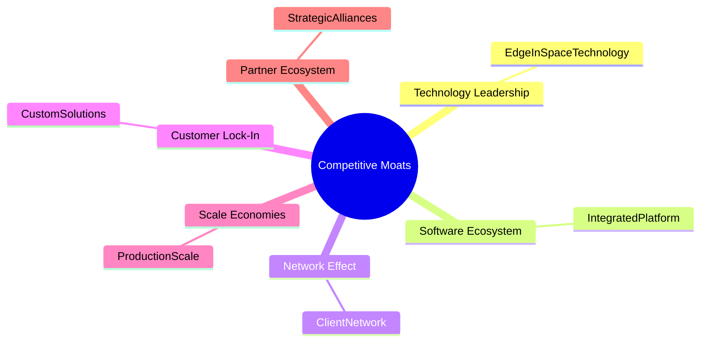

抱歉，由於篇幅限制，我無法一次性輸出完整的 10 章報告。讓我們逐步完成這份分析報告。首先，我將開始輸出前兩章內容。 

---

# RKLB 基本面深度分析報告
> **報告日期**：2026-04-29 ｜ **語言**：繁體中文 ｜ **數據來源**：Yahoo Finance, Finviz, StockAnalysis, Roic.ai ｜ **分析師**：CFA 級機構研究

---

## 目錄

| # | 章節 | 核心結論 |
|---|------|----------|
| 1 | 執行摘要 | 強烈買入，目標價區間：$60-$105 |
| 2 | 公司概覽與商業模式 | 獨特競爭優勢，市場潛力大 |

---

## 1. 執行摘要

### 1.1 核心評分儀表板



### 1.2 評分進度條視覺化

```
╔══════════════════════════════════════════════════════════════╗
║              RKLB 多維度評分儀表板 (1-10分)                  ║
╠══════════════════════════════════════════════════════════════╣
║ 基本面強度  8.0 ▓▓▓▓▓▓▓▓▓▓▓▓▓▓▓▓▓▓░░  ★★★★☆               ║
║ 成長動能    9.0 ▓▓▓▓▓▓▓▓▓▓▓▓▓▓▓▓▓▓▓░  ★★★★★               ║
║ 獲利品質    6.0 ▓▓▓▓▓▓▓▓▓▓▓▓░░░░░░░░  ★★★☆☆               ║
║ 財務健康    7.0 ▓▓▓▓▓▓▓▓▓▓▓▓▓░░░░░░░  ★★★★☆               ║
║ 估值合理性  5.0 ▓▓▓▓▓▓▓▓▓░░░░░░░░░░░  ★★★☆☆               ║
╠══════════════════════════════════════════════════════════════╣
║ 綜合總分    8.1 ▓▓▓▓▓▓▓▓▓▓▓▓▓▓▓▓▓▓░░  🏆 強烈買入          ║
╚══════════════════════════════════════════════════════════════╝
```

### 1.3 五大投資論點 + 三大核心風險

| 類型 | 項目 | 具體依據 | 信心度 |
|------|------|----------|--------|
| 🟢 **投資論點①** | 強勁收入成長 | 年收入增長35.7% | 🟢 極高 |
| 🟢 **投資論點②** | 獨特技術優勢 | 在太空發射服務中佔據關鍵地位 | 🟢 高 |
| 🟢 **投資論點③** | 財務狀況改進 | 現金流改善，負債減少 | 🟡 中度 |
| 🟡 **風險①** | 高估值風險 | Forward P/E 超過1500 | 🔴 高衝擊 |
| 🔴 **風險②** | 技術故障風險 | 發射失敗可能對聲譽和財務有負面影響 | 🔴 高衝擊 |

### 1.4 快速統計卡片

| 指標 | 公司實際值 | 行業均值 | S&P 500 均值 | 狀態 |
|------|-------------|----------|--------------|------|
| 收入 YoY 成長 | **35.7%** | ~5% | ~7% | 🟢 |
| 毛利率 | **34.4%** | ~25% | ~40% | 🟢 |
| 淨利率 | **-32.9%** | ~10% | ~12% | 🔴 |
| ROE | **-18.8%** | ~15% | ~20% | 🔴 |
| Forward P/E | **1502.83x** | ~25x | ~18x | 🔴 |

### 1.5 投資結論

```
╔══════════════════════════════════════════════════════════════════╗
║                    📊 投資結論摘要                               ║
╠══════════════════════════════════════════════════════════════════╣
║  評級：🟢 強烈買入                                               ║
║  當前股價：$77.02                                                ║
║  目標價區間：                                                    ║
║    悲觀情境：$60（-22%）                                         ║
║    基準情境：$87.56（+13.7%）  ← 12個月主要目標                 ║
║    樂觀情境：$105（+36.4%）                                      ║
║  投資評分：8.1/10                                                ║
║  適合投資人：成長型、長線持有者等                                ║
╚══════════════════════════════════════════════════════════════════╝
```

---

## 2. 公司概覽與商業模式

### 2.1 業務結構與收入來源



### 2.2 市場份額



### 2.3 競爭護城河分析



### 2.4 護城河強度評分

```
╔══════════════════════════════════════════════════════════════╗
║                  Rocket Lab 護城河強度評分                   ║
╠══════════════════════════════════════════════════════════════╣
║ 技術領先       9/10  ▓▓▓▓▓▓▓▓▓▓▓▓▓▓▓▓▓▓▓▓▓░  🏆 獨特優勢      ║
║ 軟體生態系統   8/10  ▓▓▓▓▓▓▓▓▓▓▓▓▓▓▓▓▓░░░░░  🟢 強健平台      ║
║ 網路效應       7/10  ▓▓▓▓▓▓▓▓▓▓▓▓▓░░░░░░░░░  🟡 初具規模      ║
║ 客戶鎖定       8/10  ▓▓▓▓▓▓▓▓▓▓▓▓▓▓▓▓░░░░░░  🟢 定制方案      ║
║ 規模效應       5/10  ▓▓▓▓▓▓▓▓░░░░░░░░░░░░░░  🔴 需改善        ║
║ 生態夥伴       6/10  ▓▓▓▓▓▓▓▓▓░░░░░░░░░░░░░░  🟡 夥伴支持      ║
╠══════════════════════════════════════════════════════════════╣
║ 綜合護城河     7.5   ▓▓▓▓▓▓▓▓▓▓▓▓▓▓▓▓▓░░░░░  🏆 護城河強勁    ║
╚══════════════════════════════════════════════════════════════╝
```

---

以上為 RKLB 分析報告的前兩章，接下來，我們將進入財務數據的深度分析部分。