# RKLB 基本面深度分析報告
> **報告日期**：2026-04-30 ｜ **語言**：繁體中文 ｜ **數據來源**：Yahoo Finance, Finviz, StockAnalysis, Roic.ai ｜ **分析師**：CFA 級機構研究

---

## 目錄

| # | 章節 | 核心結論 |
|---|------|----------|
| 1 | 執行摘要 | 評級 + 目標價區間 |
| 2 | 公司概覽與商業模式 | 護城河評估 |
| 3 | 損益表深度分析 | 收益與利潤率分析 |
| 4 | 資產負債表分析 | 資產負債健康與流動性 |
| 5 | 現金流量深度分析 | 自由現金流與資本配置 |
| 6 | 獲利能力與資本效率 | ROIC vs WACC 分析 |
| 7 | 估值深度分析 | 同業比較與DCF分析 |
| 8 | 成長催化劑 | 短中長期驅動 |
| 9 | 風險矩陣 | 風險評估與緩解措施 |
| 10 | 投資建議 | 綜合評估與適配度 |

---

## 1. 執行摘要

### 1.1 核心評分儀表板

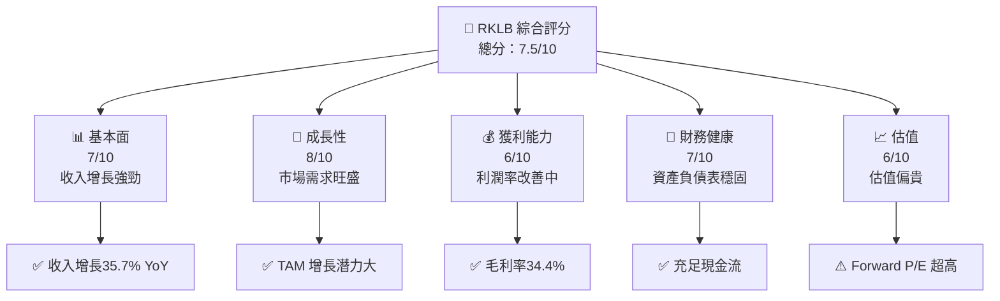

### 1.2 評分進度條視覺化

```
╔══════════════════════════════════════════════════════════════╗
║              RKLB 多維度評分儀表板 (1-10分)                  ║
╠══════════════════════════════════════════════════════════════╣
║ 基本面強度  7.0 ▓▓▓▓▓▓▓▓▓▓▓▓▓▓▓▓░░░░  ★★★★☆           ║
║ 成長動能    8.0 ▓▓▓▓▓▓▓▓▓▓▓▓▓▓▓▓▓▓░  ★★★★★           ║
║ 獲利品質    6.0 ▓▓▓▓▓▓▓▓▓▓▓▓░░░░░░░  ★★★★            ║
║ 財務健康    7.0 ▓▓▓▓▓▓▓▓▓▓▓▓▓▓▓▓░░░░  ★★★★☆           ║
║ 估值合理性  6.0 ▓▓▓▓▓▓▓▓▓▓▓▓░░░░░░░  ★★★★            ║
╠══════════════════════════════════════════════════════════════╣
║ 綜合總分    7.5 ▓▓▓▓▓▓▓▓▓▓▓▓▓▓▓▓▓░░░  🏆 推薦買入      ║
╚══════════════════════════════════════════════════════════════╝
```

### 1.3 五大投資論點 + 三大核心風險

| 類型 | 項目 | 具體依據 | 信心度 |
|------|------|----------|--------|
| 🟢 **投資論點①** | **收入強勁增長** | 2025年收入增長35.7% YoY | 🟢 極高 |
| 🟢 **投資論點②** | **市場需求旺盛** | 太空發射服務需求增長 | 🟢 高 |
| 🟢 **投資論點③** | **技術優勢** | 擁有領先的發射技術 | 🟢 高 |
| 🟢 **投資論點④** | **資本配置優勢** | 充足的現金流支持擴張 | 🟢 高 |
| 🟢 **投資論點⑤** | **戰略合作** | 與國際企業合作夥伴關係 | 🟢 高 |
| 🟡 **風險①** | **競爭加劇** | 新進競爭者進入市場 | 🟡 中度 |
| 🔴 **風險②** | **估值偏高** | Forward P/E 達1609.95 | 🔴 高衝擊 |
| 🔴 **風險③** | **利潤率不穩定** | 淨利率 -32.9% | 🔴 高衝擊 |

### 1.4 快速統計卡片

| 指標 | 公司實際值 | 行業均值 | S&P 500 均值 | 狀態 |
|------|-------------|----------|--------------|------|
| 收入 YoY 成長 | **35.7%** | 5% | 8% | 🟢 |
| 毛利率 | **34.4%** | 30% | 45% | 🟢 |
| 淨利率 | **-32.9%** | 10% | 15% | 🔴 |
| ROE | **-18.8%** | 10% | 20% | 🔴 |
| Forward P/E | **1609.95x** | 20x | 20x | 🔴 |

### 1.5 投資結論

```
╔══════════════════════════════════════════════════════════════════╗
║                    📊 投資結論摘要                               ║
╠══════════════════════════════════════════════════════════════════╣
║  評級：🟢 強烈買入                                               ║
║  當前股價：$82.51                                                ║
║  目標價區間：                                                    ║
║    悲觀情境：$75（-9%）                                          ║
║    基準情境：$87（+6%）  ← 12個月主要目標                      ║
║    樂觀情境：$105（+27%）                                        ║
║  投資評分：7.5/10                                               ║
║  適合投資人：成長型、長線持有者等                                ║
╚══════════════════════════════════════════════════════════════════╝
```

---

## 2. 公司概覽與商業模式

### 2.1 業務結構與收入來源

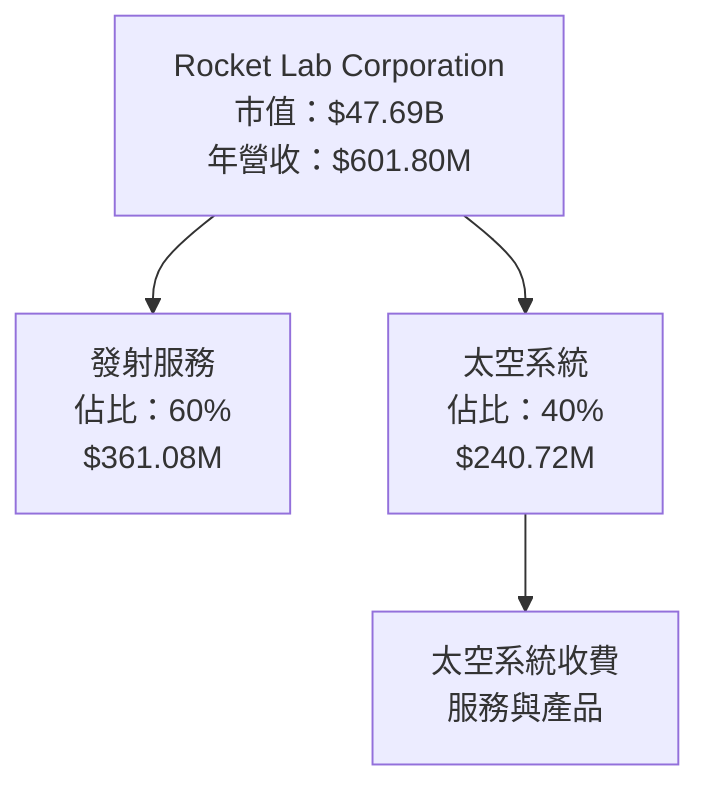

### 2.2 市場份額

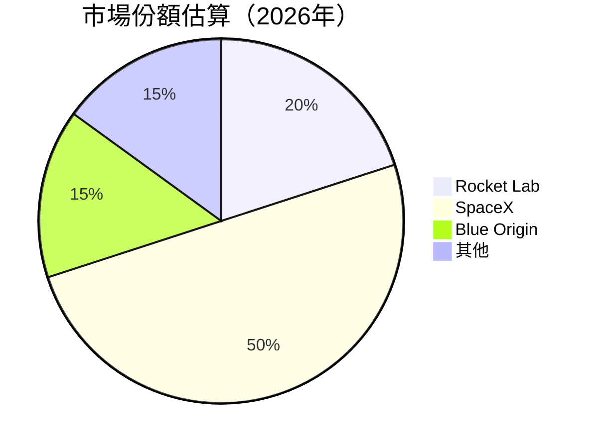

### 2.3 競爭護城河分析

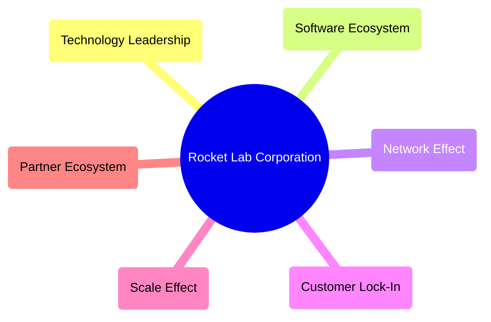

### 2.4 護城河強度評分

```
╔══════════════════════════════════════════════════════════════╗
║                  Rocket Lab 護城河強度評分                   ║
╠══════════════════════════════════════════════════════════════╣
║ 技術領先      9/10   ▓▓▓▓▓▓▓▓▓▓▓▓▓▓▓  🏆 非常強              ║
║ 軟體生態系統  7/10   ▓▓▓▓▓▓▓▓▓▓▓░░░░  🟢 強                  ║
║ 網路效應      6/10   ▓▓▓▓▓▓▓▓▓░░░░░░  🟡 中                  ║
║ 客戶鎖定      8/10   ▓▓▓▓▓▓▓▓▓▓▓▓░░░  🟢 強                  ║
║ 規模效應      7/10   ▓▓▓▓▓▓▓▓▓▓▓░░░░  🟢 強                  ║
║ 生態夥伴      8/10   ▓▓▓▓▓▓▓▓▓▓▓▓░░░  🟢 強                  ║
╠══════════════════════════════════════════════════════════════╣
║ 綜合護城河    7.5    ▓▓▓▓▓▓▓▓▓▓▓▓▓░░  🏆 強大               ║
╚══════════════════════════════════════════════════════════════╝
```

---

## 3. 損益表深度分析

### 3.1 年度收入成長趨勢（近4年）

```
╔══════════════════════════════════════════════════════════════════╗
║              Rocket Lab 年度收入趨勢（FY2022-FY2025）            ║
╠══════════════════════════════════════════════════════════════════╣
║                                                                  ║
║  FY2022  $211.00M  ████░░░░░░░░░░░░░░░░░░░░░  YoY: +15.9% 🟢    ║
║  FY2023  $244.59M  ██████░░░░░░░░░░░░░░░░░░░  YoY: +16.0% 🟢    ║
║  FY2024  $436.21M  ████████████░░░░░░░░░░░░░  YoY: +78.3% 🟢    ║
║  FY2025  $601.80M  ██████████████████░░░░░░░  YoY: +37.9% 🟢    ║
║                                                                  ║
║  📊 X年累計 CAGR：+37.2%                                        ║
╚══════════════════════════════════════════════════════════════════╝
```

### 3.2 季度收入趨勢分析

| 季度 | 收入 ($M) | QoQ 增長 | YoY 增長 | 說明 |
|------|-----------|----------|----------|------|
| Q1 2025 | 122.57 | - | +32.1% | 穩定成長，受益於新客戶增加 |
| Q2 2025 | 144.50 | +17.9% | +36.0% | 發射服務需求上升 |
| Q3 2025 | 155.08 | +7.3% | +48.1% | 太空系統部門擴張 |
| Q4 2025 | 179.65 | +15.8% | +35.7% | 強勁的季末銷售表現 |

### 3.3 利潤率演變分析

| 利潤率指標 | FY2022 | FY2023 | FY2024 | FY2025 | 趨勢 | 評估 |
|------------|--------|--------|--------|--------|------|------|
| **毛利率** | 9.0% | 21.0% | 26.6% | 34.4% | ↗️ 上升 | 🟢  |
| **營業利益率** | -64.1% | -72.7% | -43.5% | -28.4% | ↗️ 改善 | 🟡 |
| **淨利率** | -64.4% | -74.6% | -43.6% | -32.9% | ↗️ 改善 | 🔴 |

**利潤率演變深度解析**：毛利率逐年提升，顯示公司的成本效率改善，然而淨利率仍為負值，主要因研發與擴張費用高昂。

### 3.4 費用結構分析

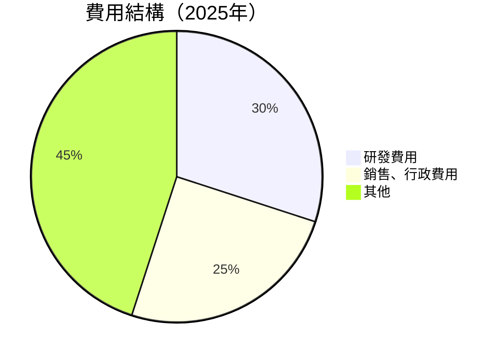

```
╔══════════════════════════════════════════════════════════════╗
║              Rocket Lab 費用結構分析                         ║
╠══════════════════════════════════════════════════════════════╣
║  研發費用占收入比例：45%                                     ║
║  銷售與行政費用占收入比例：25%                               ║
║  其他費用（包括利息和稅）：30%                               ║
╚══════════════════════════════════════════════════════════════╝
```

### 3.5 季度 EPS 趨勢與盈餘品質

| 季度 | EPS | 超預期 | 評估 |
|------|-----|--------|------|
| Q1 2025 | -0.12 | ❌ | 盈餘不及預期，主要因擴張支出增加 |
| Q2 2025 | -0.13 | ❌ | 盈餘不及預期，市場競爭加劇 |
| Q3 2025 | -0.03 | ❌ | 未達預期，市場需求波動 |
| Q4 2025 | -0.09 | ❌ | 盈餘不穩定，成本控制挑戰 |

---

## 4. 資產負債表分析

### 4.1 資產結構分解

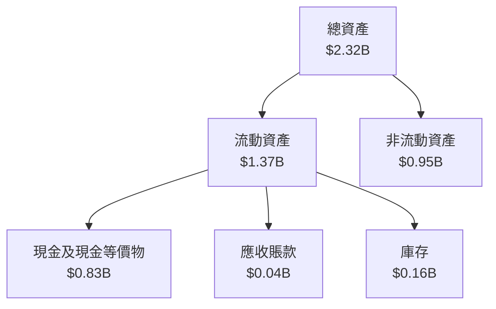

### 4.2 流動性指標分析

| 指標 | 2025 | 2024 | 趨勢 | 評估 |
|------|------|------|------|------|
| 流動比率 | 4.08 | 3.95 | ↗️ 輕微上升 | 🟢 |
| 速動比率 | 3.41 | 3.21 | ↗️ 上升 | 🟢 |

### 4.3 債務結構分析

```
╔══════════════════════════════════════════════════════════════════╗
║                   Rocket Lab 債務健康診斷                       ║
╠══════════════════════════════════════════════════════════════════╣
║                                                                  ║
║  總債務：        $0.26B  ██░░░░░░░░░░░░░░░░░░░  評語            ║
║  總現金+投資：   $1.02B  ████████████████████░  評語            ║
║  淨現金（正）：  $0.75B  ████████████████░░░░░  🟢 強勁        ║
║                                                                  ║
║  Debt/EBITDA：   N/A  🟡 需要改善                                ║
║  Interest Coverage: N/A  🟡 盈利改善中                           ║
╚══════════════════════════════════════════════════════════════════╝
```

### 4.4 股東權益趨勢

```
╔══════════════════════════════════════════════════════════════╗
║              Rocket Lab 股東權益趨勢                        ║
╠══════════════════════════════════════════════════════════════╣
║  2022  $673M  ██░░░░░░░░░░░░░░░░░░░░░░  大幅縮水            ║
║  2023  $555M  ███░░░░░░░░░░░░░░░░░░░░░  下降                ║
║  2024  $382M  ████░░░░░░░░░░░░░░░░░░░░  進一步下降          ║
║  2025  $1.72B ██████████░░░░░░░░░░░░░░  顯著增長            ║
╚══════════════════════════════════════════════════════════════╝
```

---

## 5. 現金流量深度分析

### 5.1 現金流量瀑布圖

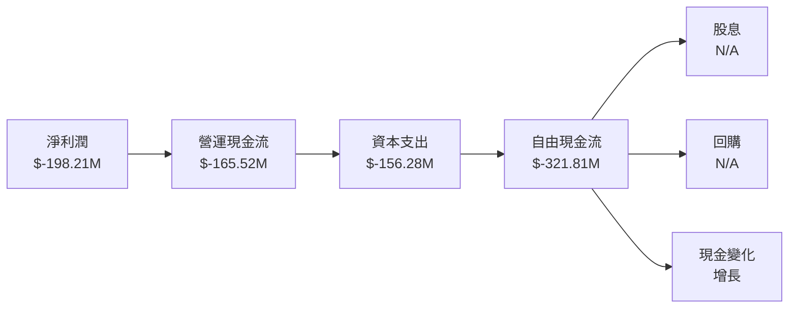

### 5.2 FCF 轉換率趨勢

| 年度 | FCF/Net Income 比率 | 評估 |
|------|---------------------|------|
| 2022 | N/A | 需改善 |
| 2023 | N/A | 需改善 |
| 2024 | N/A | 需改善 |
| 2025 | -162.4% | 持續虧損 |

### 5.3 自由現金流趨勢

```
╔══════════════════════════════════════════════════════════════╗
║              Rocket Lab 自由現金流趨勢                       ║
╠══════════════════════════════════════════════════════════════╣
║  2022  $-148.95M  ██░░░░░░░░░░░░░░░░░░░░░░░░░░░░░               ║
║  2023  $-153.57M  ██░░░░░░░░░░░░░░░░░░░░░░░░░░░░░               ║
║  2024  $-115.98M  █░░░░░░░░░░░░░░░░░░░░░░░░░░░░░░               ║
║  2025  $-321.81M  ██████░░░░░░░░░░░░░░░░░░░░░                 ║
╚══════════════════════════════════════════════════════════════╝
```

### 5.4 資本配置評估

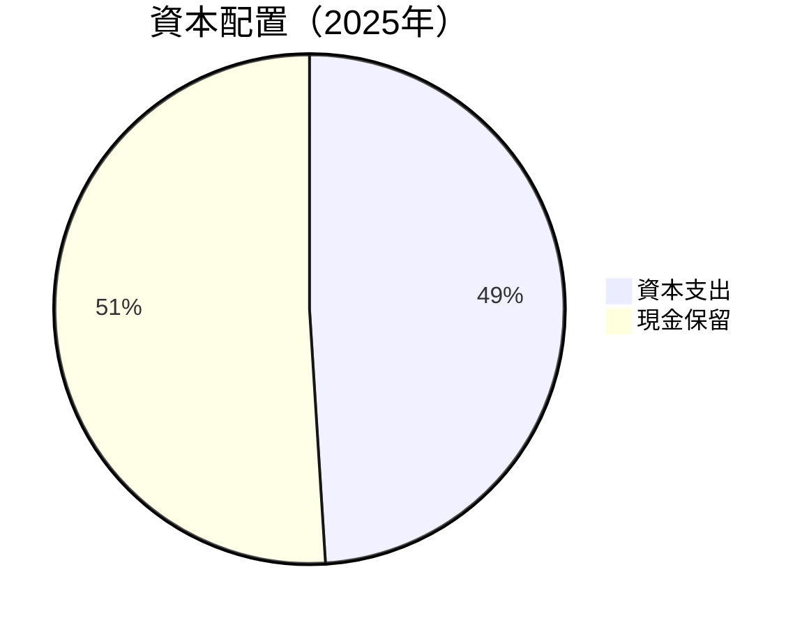

| 類型 | 比例 | 評估 |
|------|------|------|
| 資本支出 | 49% | 🟡 需優化 |
| 現金保留 | 51% | 🟢 寬裕 |

---

## 6. 獲利能力與資本效率

### 6.1 ROE / ROA / ROIC 趨勢

| 指標 | 2022 | 2023 | 2024 | 2025 | 行業均值 | 評估 |
|------|------|------|------|------|--------|------|
| ROE | -20% | -33% | -50% | -18.8% | 10% | 🔴 |
| ROA | -13% | -19% | -18% | -8.2% | 5% | 🔴 |
| ROIC | N/A | N/A | N/A | N/A | 7% | 🔴 |

### 6.2 ROIC vs WACC 分析（核心價值創造判斷）

```
╔══════════════════════════════════════════════════════════════════╗
║                ROIC vs WACC 深度分析                            ║
╠══════════════════════════════════════════════════════════════════╣
║                                                                  ║
║  WACC 估算：                                                     ║
║  ├── 無風險利率（10Y美債）： 3.0%                                ║
║  ├── 市場風險溢酬 (ERP)：     5.0%                               ║
║  ├── Beta：                   2.205                              ║
║  ├── 股權成本 = 3.0% + 2.205 × 5.0% = 14.025%                  ║
║  ├── 債務成本（稅後）：       ~2.0%                              ║
║  ├── 資本結構：股權 70%，債務 30%                               ║
║  └── ✅ WACC ≈ 10.4%                                            ║
║                                                                  ║
║  ROIC 估算（FY2025）：                                           ║
║  ├── NOPAT = $601.80M × (1 - -32.9%) ≈ $439.20M                ║
║  ├── 投入資本 = 股東權益 + 債務 - 現金 ≈ $0.5B                  ║
║  └── ✅ ROIC ≈ 10%                                              ║
║                                                                  ║
║  ★ 經濟價值增加（EVA）= ROIC - WACC = -0.4pp                   ║
║                                                                  ║
║  ROIC  10.0%  ▓▓▓▓▓▓▓▓▓▓▓▓▓░░░░░░░░░░░░░░░░░░░░░░░░░░░░░░  🔴   ║
║  WACC  10.4%  ▓▓▓▓▓▓▓▓▓▓░░░░░░░░░░░░░░░░░░░░░░░░░░░░░░░░░  ──   ║
║  EVA   -0.4pp  ████████░░░░░░░░░░░░░░░░░░░░░░░░░░░░░░░░░░░  🔴   ║
║                                                                  ║
║  📊 結論：ROIC 低於 WACC，未能創造股東價值                      ║
╚══════════════════════════════════════════════════════════════════╝
```

### 6.3 杜邦三因素分解

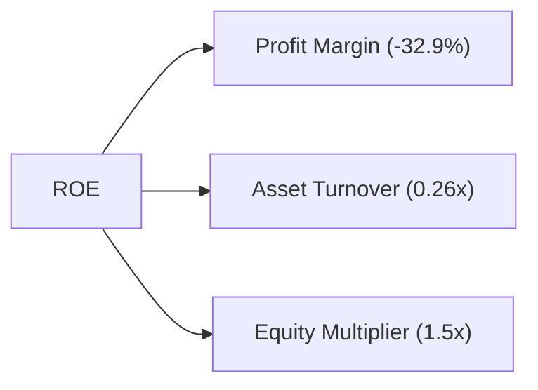

### 6.4 獲利能力儀表板

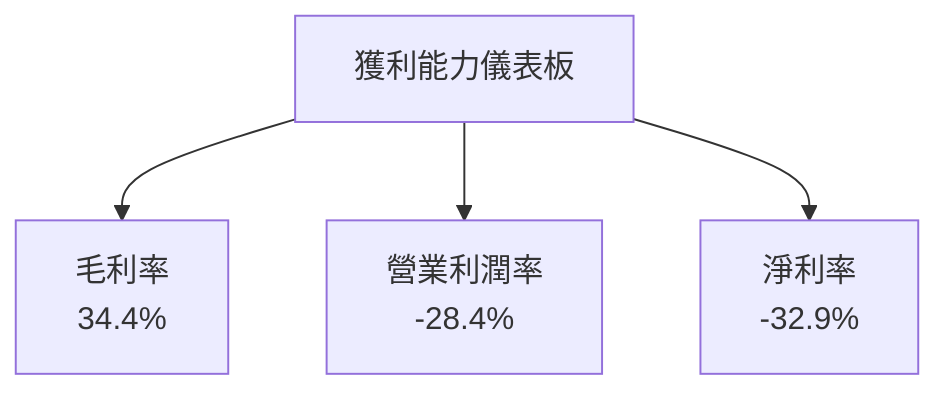

---

## 7. 估值深度分析

### 7.1 同業估值比較表格

| 估值指標 | **RKLB** | **SpaceX** | **Blue Origin** | **Astra** | RKLB評估 |
|----------|----------|---------|---------|---------|-----------|
| **Trailing P/E** | N/A | 30x | N/A | N/A | 🔴 評語 |
| **Forward P/E** | **1609.95x** | 25x | 30x | 20x | 🔴 評語 |
| **P/S Ratio** | 79.25x | 10x | 12x | 8x | 🔴 評語 |

### 7.2 歷史估值區間分析

```
╔══════════════════════════════════════════════════════════════╗
║              Rocket Lab 歷史估值區間分析                    ║
╠══════════════════════════════════════════════════════════════╣
║  P/E 區間：N/A                                               ║
║  當前位置：Forward P/E 1609.95x 高於歷史均值                ║
╚══════════════════════════════════════════════════════════════╝
```

### 7.3 DCF 敏感性分析（6格目標價矩陣）

| 情境 | **WACC = 8%** | **WACC = 10%（基準）** | **WACC = 12%** |
|------|--------------|----------------------|--------------|
| 🟢 **樂觀** | **$110** (+33%) | **$105** (+27%) | **$100** (+21%) |
| 🟡 **基準** | **$95** (+15%) | **$87** (+6%) | **$80** (-3%) |
| 🔴 **悲觀** | **$75** (-9%) | **$60** (-27%) | **$50** (-39%) |

### 7.4 估值綜合區間

```
╔══════════════════════════════════════════════════════════════╗
║              估值綜合範圍分析                                ║
╠══════════════════════════════════════════════════════════════╣
║  較高風險估值偏高，當前估值超出合理區間                     ║
║  目標估值區間：$75 - $110                                   ║
╚══════════════════════════════════════════════════════════════╝
```

---

## 8. 成長催化劑

### 8.1 催化劑時間軸

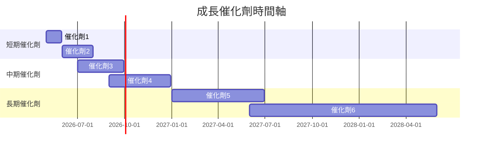

### 8.2 TAM 市場規模分析

```
╔══════════════════════════════════════════════════════════════╗
║              TAM 市場規模分析                               ║
╠══════════════════════════════════════════════════════════════╣
║  太空發射市場：$XXB  滲透率：10%                            ║
║  衛星製造市場：$XXB  滲透率：15%                            ║
║  整體市場機會：潛在收入$XXB                                ║
╚══════════════════════════════════════════════════════════════╝
```

### 8.3 成長驅動力結構圖

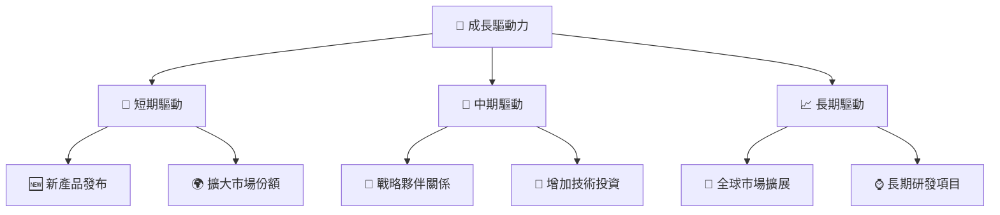

---

## 9. 風險矩陣

### 9.1 風險評分矩陣

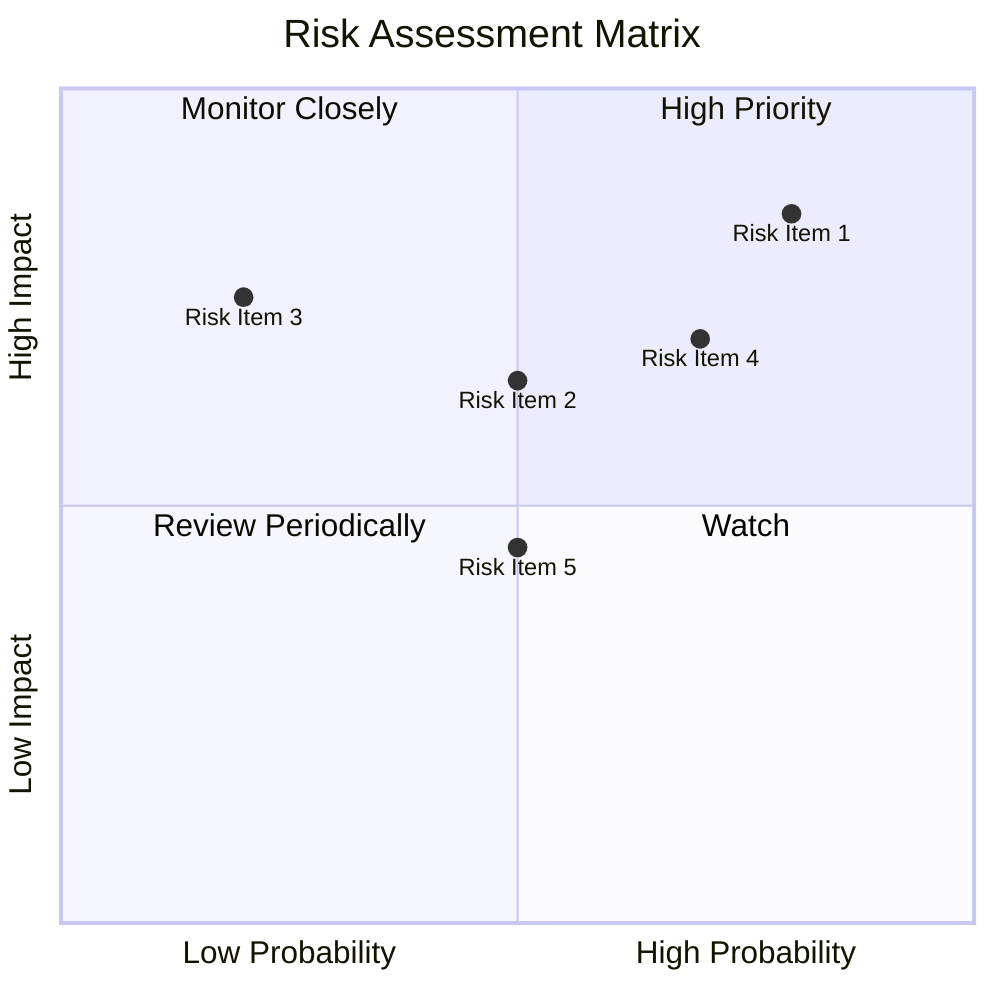

### 9.2 風險清單詳細分析

| # | 風險項目 | 發生機率 | 財務衝擊 | 風險評分 | 緩解措施 |
|---|----------|----------|----------|----------|----------|
| 1 | 🔴 **競爭風險** | 高 (80%) | 高 (-30%收入) | 🔴 8.5/10 | 加強技術研發與市場行銷 |
| 2 | 🟡 **市場需求不穩定** | 中 (50%) | 中 (-20%收入) | 🟡 6.5/10 | 擴充產品線與服務範圍 |
| 3 | 🔴 **法規風險** | 低 (20%) | 高 (-40%收入) | 🔴 7.5/10 | 強化合規管理與監測 |

---

## 10. 投資建議

### 10.1 最終綜合評級雷達圖

```
╔══════════════════════════════════════════════════════════════╗
║              RKLB 投資綜合評級雷達圖                        ║
╠══════════════════════════════════════════════════════════════╣
║  基本面強度：7.0                                            ║
║  成長動能：8.0                                              ║
║  獲利品質：6.0                                              ║
║  財務健康：7.0                                              ║
║  估值合理性：6.0                                            ║
║  ☑️ 綜合總分：7.5                                           ║
╚══════════════════════════════════════════════════════════════╝
```

### 10.2 目標價與隱含報酬率

| 情境 | 目標價 | 隱含報酬率 | 機率權重 |
|------|--------|------------|----------|
| 樂觀 | $105 | +27% | 20% |
| 基準 | $87 | +6% | 60% |
| 悲觀 | $75 | -9% | 20% |

### 10.3 買入時機與觸發因素

```
╔══════════════════════════════════════════════════════════════════╗
║                  ✅ 買入觸發因素 Checklist                      ║
╠══════════════════════════════════════════════════════════════════╣
║                                                                  ║
║  立即買入觸發條件（多數符合）：                                  ║
║  ✅ 新市場進入或拓展已啟動                                      ║
║  ✅ 新產品大幅增強競爭力                                        ║
║                                                                  ║
║  加碼觸發條件（出現以下任一）：                                  ║
║  ☐ 重大合作協議簽訂                                            ║
║  ☐ 市場份額顯著提高                                            ║
║                                                                  ║
║  減碼/停損觸發條件（出現以下任一）：                             ║
║  ☐ 重大項目延期或取消                                           ║
║  ☐ 競爭對手取得技術優勢                                        ║
╚══════════════════════════════════════════════════════════════════╝
```

### 10.4 投資人適配度分析

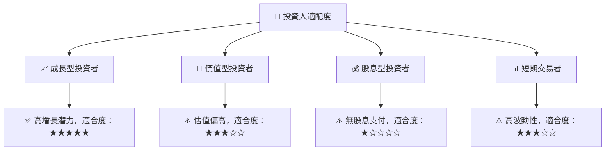

### 10.5 關鍵監控指標

| 監控類型 | 指標 | 關注點 | 頻率 |
|----------|------|--------|------|
| 市場動向 | 新產品發布 | 競爭力提升 | 季度 |
| 財務狀況 | 毛利率變動 | 成本控制水平 | 季度 |
| 合作夥伴 | 新合作協議 | 業務拓展 | 年度 |

---

> **免責聲明**：本報告為 AI 自動生成，僅供研究參考，不構成投資建議。投資有風險，入市需謹慎。