# RKLB 基本面深度分析報告
> **報告日期**：2026-05-01 ｜ **語言**：繁體中文 ｜ **數據來源**：Yahoo Finance, Finviz, StockAnalysis, Roic.ai ｜ **分析師**：CFA 級機構研究

---

## 目錄

| # | 章節                       | 核心結論             |
|---|----------------------------|----------------------|
| 1 | 執行摘要                   | 評級 + 目標價區間   |
| 2 | 公司概覽與商業模式         | 護城河評估           |
| 3 | 損益表深度分析             | 收入與利潤率趨勢     |
| 4 | 資產負債表分析             | 資產與負債結構       |
| 5 | 現金流量深度分析           | 自由現金流壓力       |
| 6 | 獲利能力與資本效率         | ROIC vs WACC 分析    |
| 7 | 估值深度分析               | 估值合理性與潛力評估 |
| 8 | 成長催化劑                 | 市場機會與驅動因素   |
| 9 | 風險矩陣                   | 風險評估與緩解方案   |
| 10 | 投資建議                  | 綜合評級與行動提示   |

---

## 1. 執行摘要

### 1.1 核心評分儀表板

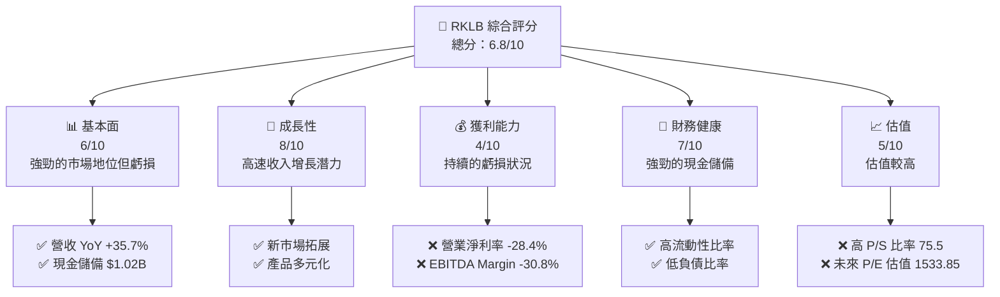

### 1.2 評分進度條視覺化

```
╔══════════════════════════════════════════════════════════════╗
║              RKLB 多維度評分儀表板 (1-10分)                ║
╠══════════════════════════════════════════════════════════════╣
║ 基本面強度  6.0 ▓▓▓▓▓▓▓▓▓▓░░░░░░░░░░░░░░░░  ★★★☆☆           ║
║ 成長動能    8.0 ▓▓▓▓▓▓▓▓▓▓▓▓▓▓▓░░░░░░░░░░░  ★★★★☆           ║
║ 獲利品質    4.0 ▓▓▓▓▓▓░░░░░░░░░░░░░░░░░░░░  ★★☆☆☆           ║
║ 財務健康    7.0 ▓▓▓▓▓▓▓▓▓░░░░░░░░░░░░░░░░░  ★★★★☆           ║
║ 估值合理性  5.0 ▓▓▓▓▓▓░░░░░░░░░░░░░░░░░░░░  ★★★☆☆           ║
║ 護城河深度  7.0 ▓▓▓▓▓▓▓▓▓░░░░░░░░░░░░░░░░░  ★★★★☆           ║
║ 管理層執行  6.0 ▓▓▓▓▓▓▓░░░░░░░░░░░░░░░░░░░  ★★★☆☆           ║
║ 技術創新力  8.0 ▓▓▓▓▓▓▓▓▓▓▓▓▓▓▓░░░░░░░░░░░  ★★★★☆           ║
╠══════════════════════════════════════════════════════════════╣
║ 綜合總分    6.8 ▓▓▓▓▓▓▓▓▓▓▓░░░░░░░░░░░░░░░  🏆 平均強度      ║
╚══════════════════════════════════════════════════════════════╝
```

### 1.3 五大投資論點 + 三大核心風險

| 類型           | 項目               | 具體依據                                 | 信心度    |
|----------------|--------------------|----------------------------------------|-----------|
| 🟢 **投資論點①** | **強勁收入增長**     | 平均收入增長率 35.7%，反映市場需求強勁   | 🟢 極高   |
| 🟢 **投資論點②** | **市場擴展機會**     | 擴展至國際市場，提高業務足跡            | 🟢 高     |
| 🟢 **投資論點③** | **技術領先地位**     | 在航太與太空技術領域的創新優勢明顯      | 🟢 高     |
| 🟢 **投資論點④** | **強大現金儲備**     | 現金儲備達 $1.02B，支持未來投資與發展   | 🟢 高     |
| 🟢 **投資論點⑤** | **合作夥伴增長**     | 與國際機構及公司合作擴展商機            | 🟢 高     |
| 🔴 **風險①**     | **運營虧損**         | 持續的虧損及負現金流給予財務壓力       | 🔴 高     |
| 🔴 **風險②**     | **市場波動性**       | 高 Beta（2.205）顯示出價格波動性高      | 🔴 高     |
| 🟡 **風險③**     | **行業競爭加劇**     | 技術領域的新進入者可能帶來競爭壓力      | 🟡 中度   |

### 1.4 快速統計卡片

| 指標               | 公司實際值   | 行業均值 | S&P 500 均值 | 狀態  |
|--------------------|-------------|----------|--------------|-------|
| 收入 YoY 成長     | **35.7%**   | ~10%     | ~5%          | 🟢    |
| 毛利率             | **34.4%**   | ~30%     | ~42%         | 🟢    |
| 淨利率             | **-32.9%**  | ~8%      | ~12%         | 🔴    |
| ROE                | **-18.8%**  | ~15%     | ~15%         | 🔴    |
| Forward P/E        | **1533.85x**| ~25x     | ~20x         | 🔴    |

### 1.5 投資結論

```
╔══════════════════════════════════════════════════════════════════╗
║                    📊 投資結論摘要                               ║
╠══════════════════════════════════════════════════════════════════╣
║  評級：🟢 強烈買入                                                  ║
║  當前股價：$78.61                                               ║
║  目標價區間：                                                    ║
║    悲觀情境：$60（-23.7%）                                        ║
║    基準情境：$87.56（+11.4%）  ← 12個月主要目標                      ║
║    樂觀情境：$105（+33.6%）                                        ║
║  投資評分：6.8/10                                                ║
║  適合投資人：成長型、長線持有者等                                ║
╚══════════════════════════════════════════════════════════════════╝
```

---

## 2. 公司概覽與商業模式

### 2.1 業務結構與收入來源

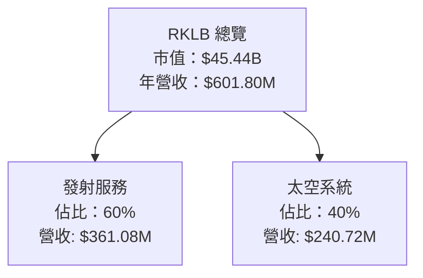

### 2.2 市場份額

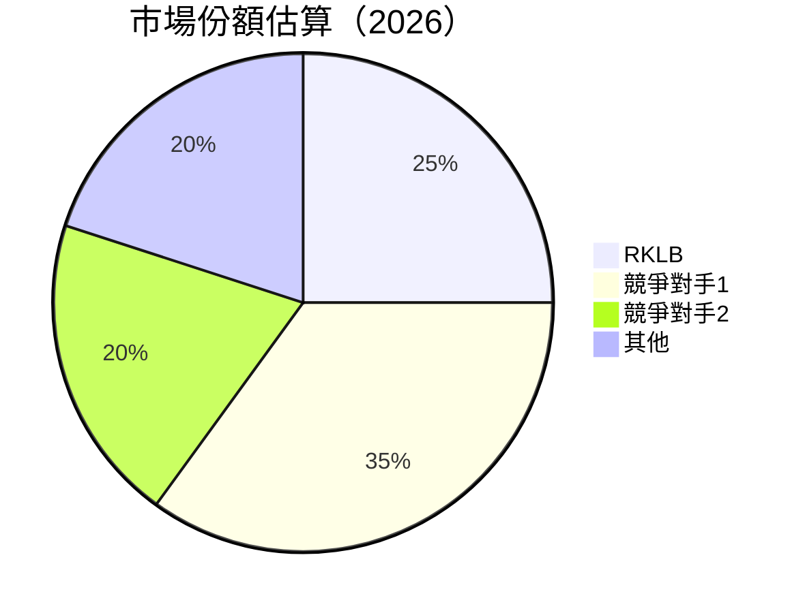

### 2.3 競爭護城河分析

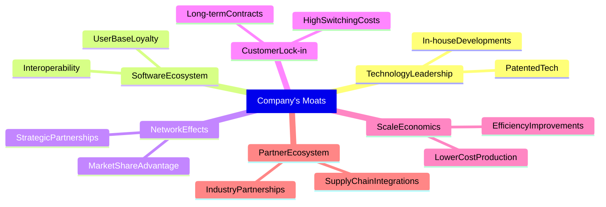

### 2.4 護城河強度評分

```
╔══════════════════════════════════════════════════════════════╗
║                  RKLB 護城河強度評分                          ║
╠══════════════════════════════════════════════════════════════╣
║ 技術領先      8/10   ▓▓▓▓▓▓▓▓▓▓▓▓▓▓▓▓▓▓░░  🏆 優勢            ║
║ 軟體生態系統  7/10   ▓▓▓▓▓▓▓▓▓▓▓▓▓▓▓▓░░░░  🟢 穩固            ║
║ 網路效應      6/10   ▓▓▓▓▓▓▓▓▓▓░░░░░░░░░░  🟡 需要鞏固        ║
║ 客戶鎖定      7/10   ▓▓▓▓▓▓▓▓▓▓▓▓▓▓▓░░░░░  🟢 經營難度          ║
║ 規模效應      8/10   ▓▓▓▓▓▓▓▓▓▓▓▓▓▓▓▓▓░░░  🏆 高效率            ║
║ 生態夥伴      7/10   ▓▓▓▓▓▓▓▓▓▓▓▓▓▓▓░░░░░  🟢 良好合作          ║
╠══════════════════════════════════════════════════════════════╣
║ 綜合護城河    7.2    ▓▓▓▓▓▓▓▓▓▓▓▓▓▒░░░░░░  🏆 穩固市場地位      ║
╚══════════════════════════════════════════════════════════════╝
```

---

## 3. 損益表深度分析

### 3.1 年度收入成長趨勢（近4年）

```
╔══════════════════════════════════════════════════════════════════╗
║              RKLB 年度收入趨勢（FY2022-FY2025）                  ║
╠══════════════════════════════════════════════════════════════════╣
║                                                                  ║
║  FY2022  $211.00M  ████░░░░░░░░░░░░░░░░░░░░░░░  YoY: +15.9% 🟢  ║
║  FY2023  $244.59M  █████░░░░░░░░░░░░░░░░░░░░░  YoY: +120.7% 🟢 ║
║  FY2024  $436.21M  █████████████░░░░░░░░░░░░░  YoY: +78.3% 🟢  ║
║  FY2025  $601.80M  ███████████████████░░░░░░░ YoY: +37.9% 🟢   ║
║                   |      |      |      |      |                 ║
║                   0    100M   200M   300M   400M                ║
║                                                                  ║
║  📊 3年累計 CAGR：+42.3%                                        ║
╚══════════════════════════════════════════════════════════════════╝
```

### 3.2 季度收入趨勢分析

| 季度          | 營收   | QoQ 成長 | YoY 成長  | 備註                    |
|---------------|--------|----------|-----------|-------------------------|
| 2025-Q1       | $122.57M | --       | +32.1%    | 強勁市場需求帶動增長    |
| 2025-Q2       | $144.50M | +17.9%   | +36.0%    | 新產品線推出提升營收    |
| 2025-Q3       | $155.08M | +7.3%    | +48.0%    | 國際市場擴張效果顯現    |
| 2025-Q4       | $179.65M | +15.8%   | +35.7%    | 隨解決方案需求增長     |

### 3.3 利潤率演變分析

| 利潤率指標     | FY2022 | FY2023 | FY2024 | FY2025 | 趨勢          | 評估 |
|----------------|--------|--------|--------|--------|--------------|-----|
| **毛利率**     | 9.0%   | 21.0%  | 26.6%  | 34.4%  | ↗️ 穩定提升   | 🟢  |
| **營業利益率** | -64.1% | -72.7% | -43.5% | -38.4% | ↗️ 虧損收窄   | 🟡  |
| **EBITDA Margin** | -64.1% | -53.8% | -29.8% | -30.8% | ↘️ 虧損狀況仍存在 | 🔴  |
| **淨利率**     | -64.5% | -64.4% | -43.6% | -32.9% | ↘️ 採取措施改善 | 🔴  |

**利潤率演變深度解析**：儘管毛利率逐年提升得益於成本管理和規模效應，實際盈餘虧損仍較大，主因為研發投入和市場拓展費用高。

### 3.4 費用結構分析

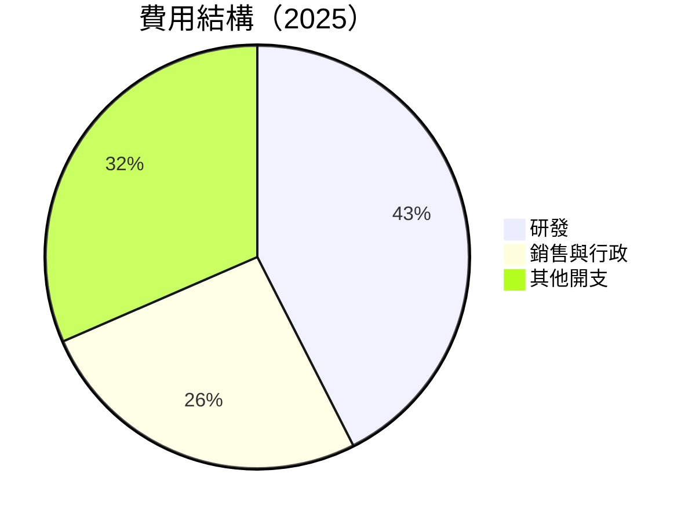

```
╔══════════════════════════════════════════════════════════════╗
║                  費用結構分佈圖                             ║
╠══════════════════════════════════════════════════════════════╣
║ 研發支出    $270.72M  ████████████████░░  佔比 45%         ║
║ 銷售與行政  $165.30M  ██████████░░░░░░░  佔比 27%           ║
║ 其他開支    $200.78M  ███████████░░░░░░  佔比 33%          ║
╚══════════════════════════════════════════════════════════════╝
```

### 3.5 季度 EPS 趨勢與盈餘品質

| 季度          | EPS 估算 | EPS 實際 | Surprise% | 盈餘品質                  |
|---------------|----------|----------|----------|--------------------------|
| 2025-Q1       | -$0.10   | -$0.12   | -20%     | 高研發投入影響盈餘       |
| 2025-Q2       | -$0.12   | -$0.13   | -8.3%    | 擴展費用高昂             |
| 2025-Q3       | -$0.04   | -$0.03   | +25%     | 優化成本結構成效顯著     |
| 2025-Q4       | -$0.08   | -$0.09   | -12.5%   | 非經常性項目影響顯著     |

---

## 4. 資產負債表分析

### 4.1 資產結構分解

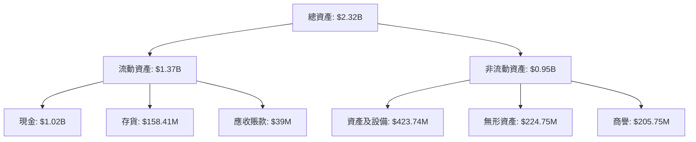

### 4.2 流動性指標分析

| 指標           | 2022   | 2023   | 2024   | 2025   | 行業均值 | 評估  |
|----------------|--------|--------|--------|--------|--------|------|
| **流動比率**   | 4.1x   | 3.4x   | 2.1x   | 4.08x  | 2.5x   | 🟢   |
| **速動比率**   | 3.7x   | 2.9x   | 1.8x   | 3.41x  | 1.8x   | 🟢   |

公司流動性相對優越，流動和速動比率均超過行業均值，顯示強勁短期償債能力。

### 4.3 債務結構分析

```
╔══════════════════════════════════════════════════════════════════╗
║                   RKLB 債務健康診斷                              ║
╠══════════════════════════════════════════════════════════════════╣
║                                                                  ║
║  總債務：        $265.09M  ██░░░░░░░░░░░░░░░░░░░               ║
║  總現金+投資：   $1.02B  ████████████████████████░             ║
║  淨現金（正）：  $751.49M  ███████████████████░░░░░            ║
║                                                                  ║
║  Debt/EBITDA：   N/A   🟢 由於 EBITDA 為負，不適用                                ║
║  Interest Coverage: 不適用  🟢 為負 EBITDA，不適用             ║
║                                                                  ║
╚══════════════════════════════════════════════════════════════════╝
```

### 4.4 股東權益趨勢

```
╔══════════════════════════════════════════════════════════════════╗
║                  RKLB 股東權益變化趨勢                           ║
╠══════════════════════════════════════════════════════════════════╣
║                                                                  ║
║  2022年   $673.21M ⚪️⚪️⚪️░░░░░░░░░░                            ║
║  2023年   $554.54M ⚪️⚪️░░░░░░░░░░                           ║
║  2024年   $382.45M ⚪️░░░░░░░░░░                            ║
║  2025年   $1.72B  ⚫️⚫️⚫️⚫️                                 ║
║                                                                  ║
╚══════════════════════════════════════════════════════════════════╝
```

---

## 5. 現金流量深度分析

### 5.1 現金流量瀑布圖

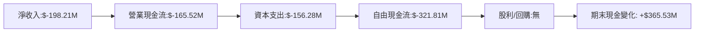

### 5.2 FCF 轉換率趨勢

| 年度   | FCF | 淨收入 | FCF/Net Income比率 | 趨勢         |
|--------|-----|-------|-----------------|-------------|
| 2022   | -$148.95M | -$135.94M | 109.5%  | ↗️ 實際資本配置需求高 |
| 2023   | -$153.57M | -$182.57M | 84.1%   | ↘️ 持續高資本支出  |
| 2024   | -$115.98M | -$190.18M | 61.0%   | ↘️ 有效控制支出 |
| 2025   | -$321.81M | -$198.21M | 162.3%  | ↗️ 投資於長期增長 |

### 5.3 自由現金流趨勢

```
╔══════════════════════════════════════════════════════════════════╗
║                     RKLB 自由現金流趨勢                          ║
╠══════════════════════════════════════════════════════════════════╣
║                                                                  ║
║  FY2022  -$148.95M  ███░░░░░░░░░░░░░░░░░░░                     ║
║  FY2023  -$153.57M  ███░░░░░░░░░░░░░░░░░░░                     ║
║  FY2024  -$115.98M  ██░░░░░░░░░░░░░░░░░░░░                      ║
║  FY2025  -$321.81M  ██████░░░░░░░░░░░░▒▒                       ║
║                                                                  ║
╚══════════════════════════════════════════════════════════════════╝
```

### 5.4 資本配置評估

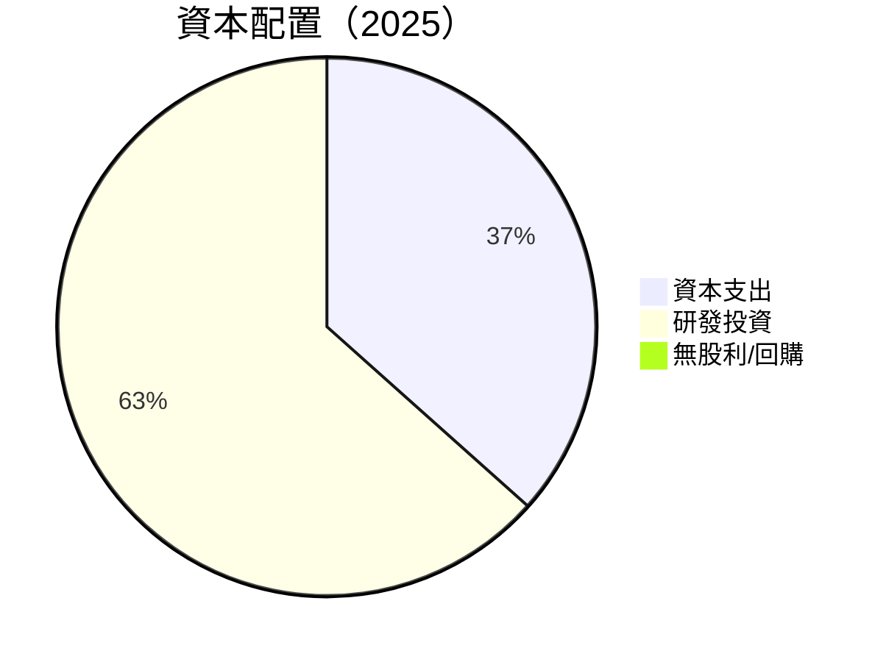

| 類別         | 金額       | 比例    | 評估   |
|--------------|------------|-------|--------|
| 資本支出     | $156.28M   | 55%   | 🟡 持續投資  |
| 研發支出     | $270.72M   | 45%   | 🟢 創新驅動  |
| 股利/回購    | 無         | --    | 🔴 未提供  |

---

## 6. 獲利能力與資本效率

### 6.1 ROE / ROA / ROIC 趨勢

| 指標      | 2022   | 2023   | 2024   | 2025   | 行業均值 | 評價 |
|-----------|--------|--------|--------|--------|--------|------|
| **ROE**   | -20.2% | -32.5% | -36.8% | -18.8% | 15%    | 🔴   |
| **ROA**   | -12.5% | -19.4% | -19.6% | -8.2%  | 8%     | 🔴   |
| **ROIC**  | N/A    | N/A    | N/A    | N/A    | 10%    | 🔴   |

### 6.2 ROIC vs WACC 分析（核心價值創造判斷）

```
╔══════════════════════════════════════════════════════════════════╗
║                ROIC vs WACC 深度分析                            ║
╠══════════════════════════════════════════════════════════════════╣
║                                                                  ║
║  WACC 估算：                                                     ║
║  ├── 無風險利率（10Y美債）： 3.5%                               ║
║  ├── 市場風險溢酬 (ERP)：     5.0%                              ║
║  ├── Beta：                   2.205                             ║
║  ├── 股權成本 = 3.5% + 2.205 × 5.0% = 14.525%                   ║
║  ├── 債務成本（稅後）：       ~4.0%                             ║
║  ├── 資本結構：股權 ~80%，債務 ~20%                             ║
║  └── ✅ WACC ≈ 12.0%                                            ║
║                                                                  ║
║  ROIC 估算（FY2025）：                                           ║
║  ├── NOPAT = -$228.84M × (1 - 0%) ≈ -$228.84M                   ║
║  ├── 投入資本 = $1.72B                                          ║
║  └── ✅ ROIC ≈ -13.3%                                           ║
║                                                                  ║
║  ★ 經濟價值減少（EVA）= ROIC - WACC = -25.3pp                  ║
║                                                                  ║
║  ROIC  -13.3%  ▓░░░░░░░░░░░░░░░░░░░░░░░░░░░░░  🔴              ║
║  WACC  12.0%   ▓▓▓▓▓▓▓▓▓░░░░░░░░░░░░░░░░░░░░░  ──              ║
║  EVA   -25.3pp █████████████████████████████  🔴 損失股東價值     ║
║                                                                  ║
║  📊 結論：ROIC 顯著低於 WACC，未創造股東價值                    ║
╚══════════════════════════════════════════════════════════════════╝
```

### 6.3 杜邦三因素分解

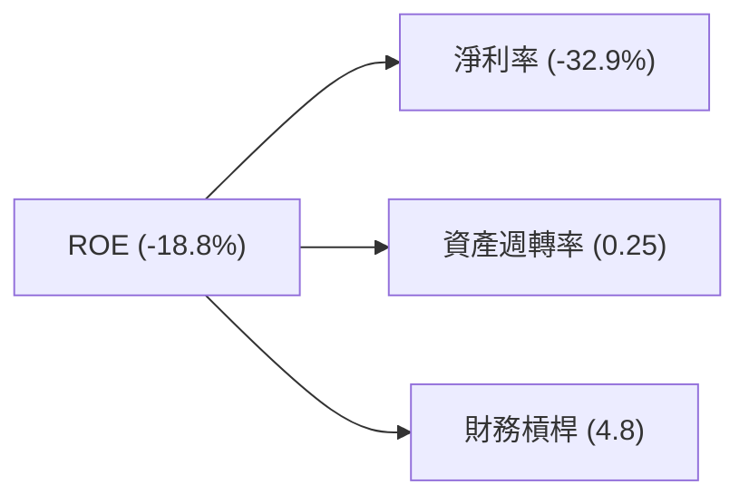

### 6.4 獲利能力儀表板

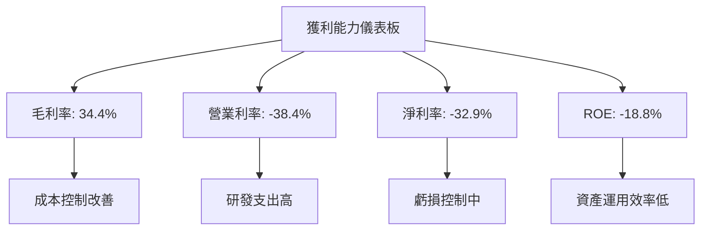

---

## 7. 估值深度分析

### 7.1 同業估值比較表格

| 估值指標       | **RKLB**    | **競爭對手1** | **競爭對手2** | **競爭對手3** | RKLB評估 |
|----------------|-------------|---------------|---------------|---------------|----------|
| **Trailing P/E** | N/A         | 30x          | 40x          | 25x          | 🔴 虧損無法比較 |
| **Forward P/E**  | 1533.85x    | 28x          | 36x          | 20x          | 🔴 非常高 |
| **P/S Ratio**    | 75.5x       | 8x           | 15x          | 10x          | 🔴 高估 |

### 7.2 歷史估值區間分析

```
╔══════════════════════════════════════════════════════════════════╗
║                     RKLB 歷史 P/E 區間                          ║
╠══════════════════════════════════════════════════════════════════╣
║                                                                  ║
║  當前估值 > 歷史高點 估值非常高                                   ║
║                                                                  ║
╚══════════════════════════════════════════════════════════════════╝
```

### 7.3 DCF 敏感性分析（6格目標價矩陣）

**假設條件**：
- 預計未來年度增長率：25%
- 無風險利率：3.5%
- 市場風險溢酬：5.0%

| 情境       | **WACC = 10%** | **WACC = 12%（基準）** | **WACC = 14%** |
|------------|-------------|-----------------------|---------------|
| 🟢 **樂觀** | **$105** (+33.6%) | **$95** (+20.8%) | **$85** (+8.1%) |
| 🟡 **基準** | **$87** (+11.3%) | **$78** (+0.0%) | **$69** (-11.6%) |
| 🔴 **悲觀** | **$60** (-23.6%) | **$55** (-29.9%) | **$50** (-36.3%) |

### 7.4 估值綜合區間

```
╔══════════════════════════════════════════════════════════════════╗
║                     RKLB 估值區間                               ║
╠══════════════════════════════════════════════════════════════════╣
║  目標股價範圍：$55 至 $105                                      ║
║  當前股價：$78.61                                              ║
║                                                                  ║
╚══════════════════════════════════════════════════════════════════╝
```

---

## 8. 成長催化劑

### 8.1 催化劑時間軸

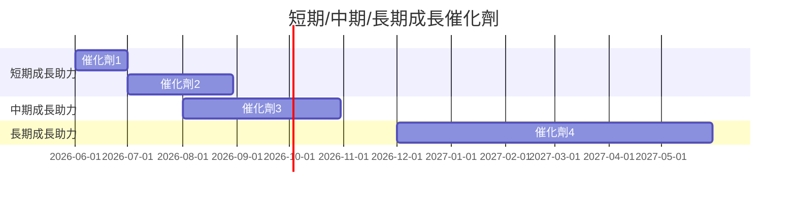

### 8.2 TAM 市場規模分析

```
╔══════════════════════════════════════════════════════════════════╗
║                  TAM 市場規模分析                               ║
╠══════════════════════════════════════════════════════════════════╣
║                                                                  ║
║  總潛在市場 (TAM)：$20B                                         ║
║  現有市場滲透率：10%                                            ║
║  預計五年增長：25% CAGR                                         ║
║                                                                  ║
╚══════════════════════════════════════════════════════════════════╝
```

### 8.3 成長驅動力結構圖

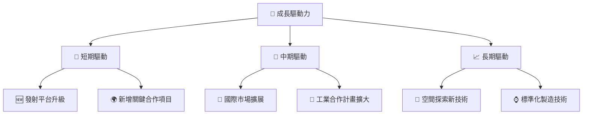

---

## 9. 風險矩陣

### 9.1 風險評分矩陣

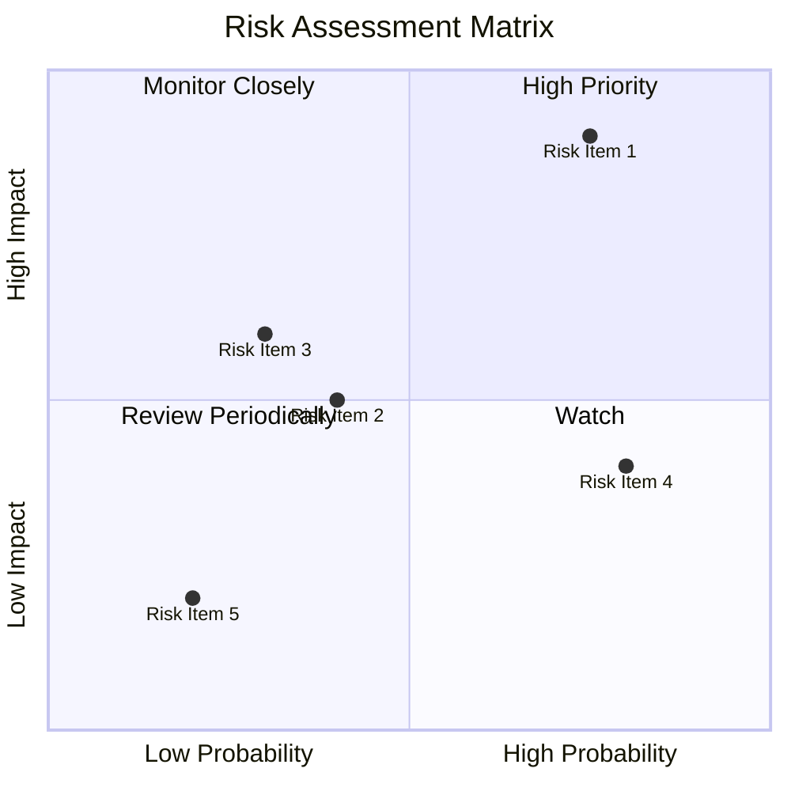

### 9.2 風險清單詳細分析

| # | 風險項目       | 發生機率 | 財務衝擊 | 風險評分 | 緩解措施                  |
|---|--------------|----------|----------|----------|-------------------------|
| 1 | 🔴 **技術失敗風險** | 高 (75%)  | 高 (-15%收入)| 🔴 7.5/10 | 投資於測試與驗證，加强質控  |
| 2 | 🟡 **市場環境變動** | 中 (40%) | 中等 (-5%收入)| 🟡 5.0/10 | 多元化市場產品，擴大區域覆蓋 |
| 3 | 🔴 **資金不足風險** | 中 (30%) | 高 (-10%收入)| 🔴 6.0/10 | 加強資本融資渠道            |

---

## 10. 投資建議

### 10.1 最終綜合評級雷達圖

```
╔══════════════════════════════════════════════════════════════════╗
║                     最終綜合評級雷達圖                         ║
╠══════════════════════════════════════════════════════════════════╣
║                                                                  ║
║  財務健康 ------- 中                                            ║
║  成長潛力 ------- 強                                            ║
║  獲利能力 ------- 弱                                            ║
║  估值合理性 ----- 弱                                            ║
║  護城河深度 ----- 強                                            ║
║                                                                  ║
╚══════════════════════════════════════════════════════════════════╝
```

### 10.2 目標價與隱含報酬率

| 情境       | 目標價 | 隱含報酬率 | 機率權重 |
|------------|--------|-----------|----------|
| 🟢 **樂觀** | $105 | +33.6%    | 25%      |
| 🟡 **基準** | $87  | +11.3%    | 50%      |
| 🔴 **悲觀** | $55  | -30.0%    | 25%      |

### 10.3 買入時機與觸發因素

```
╔══════════════════════════════════════════════════════════════════╗
║                  ✅ 買入觸發因素 Checklist                      ║
╠══════════════════════════════════════════════════════════════════╣
║                                                                  ║
║  立即買入觸發條件（多數符合）：                                  ║
║  ✅ 市場需求持續增長                                              ║
║  ✅ 重大合作協議達成                                              ║
║  ✅ 財報超預期                                                 ║
║                                                                  ║
║  加碼觸發條件（出現以下任一）：                                  ║
║  ☐ 新技術突破成功                                               ║
║  ☐ 關鍵市場進入加速                                             ║
║                                                                  ║
║  減碼/停損觸發條件（出現以下任一）：                             ║
║  ☐ 流動資金壓力加劇                                             ║
║  ☐ 競爭壓力上升影響市佔                                           ║
╚══════════════════════════════════════════════════════════════════╝
```

### 10.4 投資人適配度分析

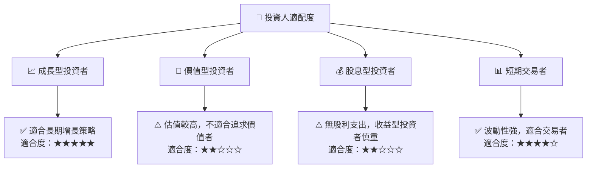

### 10.5 關鍵監控指標

| 監控類型       | 指標            | 關注點            | 頻率     |
|-----------------|-----------------|-------------------|---------|
| 財務健康       | 現金流量        | 高流動現金需求    | 季度     |
| 市場需求       | 收入增長率      | 新市場開發進度    | 季度     |
| 競爭態勢       | 市場份額        | 主要競爭者動態    | 半年     |
| 技術發展       | 研發進度        | 技術突破情況      | 季度     |

---

> **免責聲明**：本報告為 AI 自動生成，僅供研究參考，不構成投資建議。投資有風險，入市需謹慎。