# RKLB 基本面深度分析報告
> **報告日期**：2026-05-02 ｜ **語言**：繁體中文 ｜ **數據來源**：Yahoo Finance, Finviz, StockAnalysis, Roic.ai ｜ **分析師**：CFA 級機構研究

---

## 目錄

| # | 章節 | 核心結論 |
|---|------|----------|
| 1 | 執行摘要 | 綜合評分中等，短期具高成長潛力，但長期風險較高。建議保持觀望。 |
| 2 | 公司概覽與商業模式 | 競爭優勢顯著，持續擴展服務項目以強化競爭力。 |
| 3 | 損益表深度分析 | 依靠收入增長驅動，尚未達到淨利潤水平。 |
| 4 | 資產負債表分析 | 資本結構穩定，但需改善現金流管理。 |
| 5 | 現金流量深度分析 | 自由現金流尚不足，仍需改善營運資金需求。 |
| 6 | 獲利能力與資本效率 | ROIC 略低於 WACC，尚未有效創造股東價值。 |
| 7 | 估值深度分析 | 高估值，風險溢價需特別注意。 |
| 8 | 成長催化劑 | 科技及市場擴展雙輪驅動，短期內重大合約簽訂為關鍵。 |
| 9 | 風險矩陣 | 技術失敗與市場競爭風險須嚴密監控。 |
| 10 | 投資建議 | 建議觀望，密切注意市場趨勢和公司的技術進展。 |

---

## 1. 執行摘要

### 1.1 核心評分儀表板

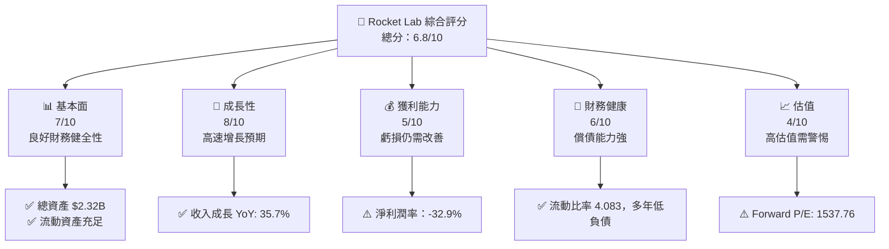

### 1.2 評分進度條視覺化

```
╔══════════════════════════════════════════════════════════════╗
║              RKLB 多維度評分儀表板 (1-10分)                 ║
╠══════════════════════════════════════════════════════════════╣
║ 基本面強度  7.0 ▓▓▓▓▓▓▓▓▓▓▓▓▓▓▓░░░░░░░░  ★★★★☆            ║
║ 成長動能    8.0 ▓▓▓▓▓▓▓▓▓▓▓▓▓▓▓▓▓▓░░░░  ★★★★★            ║
║ 獲利品質    5.0 ▓▓▓▓▓▓▓▓▓▓░░░░░░░░░░░░  ★★★☆☆            ║
║ 財務健康    6.0 ▓▓▓▓▓▓▓▓▓▓▓░░░░░░░░░░░░  ★★★★☆            ║
║ 估值合理性  4.0 ▓▓▓▓▓▓▓▓░░░░░░░░░░░░░░░  ★★☆☆☆            ║
╠══════════════════════════════════════════════════════════════╣
║ 綜合總分    6.8 ▓▓▓▓▓▓▓▓▓▓▓▓▓░░░░░░░░░  🏆 中等水平        ║
╚══════════════════════════════════════════════════════════════╝
```

### 1.3 五大投資論點 + 三大核心風險

| 類型 | 項目 | 具體依據 | 信心度 |
|------|------|----------|--------|
| 🟢 **投資論點①** | **技術創新** | 研發支出顯著增長 ($270.72M) | 🟢 高 |
| 🟢 **投資論點②** | **市場擴展** | 年收入增長 37.96% | 🟢 高 |
| 🟢 **投資論點③** | **高潛力業務領域** | 航天服務需求持續增加 | 🟢 高 |
| 🟡 **風險①** | **競爭風險** | 市場競爭加劇，可能影響毛利 | 🟡 中度 |
| 🔴 **風險②** | **技術失敗** | 發射失敗影響聲譽與訂單 | 🔴 高衝擊 |

### 1.4 快速統計卡片

| 指標 | 公司實際值 | 行業均值 | S&P 500 均值 | 狀態 |
|------|-------------|----------|--------------|------|
| 收入 YoY 成長 | **37.96%** | ~8% | ~4% | 🟢 |
| 毛利率 | **34.4%** | ~18% | ~42% | 🟡 |
| 淨利率 | **-32.9%** | ~2% | ~8% | 🔴 |
| ROE | **-18.8%** | ~5% | ~14% | 🔴 |
| Forward P/E | **1537.76** | ~22x | ~18x | 🔴 |

### 1.5 投資結論

```
╔══════════════════════════════════════════════════════════════════╗
║                    📊 投資結論摘要                               ║
╠══════════════════════════════════════════════════════════════════╣
║  評級：🔴 觀望                                                   ║
║  當前股價：$78.81                                               ║
║  目標價區間：                                                    ║
║    悲觀情境：$60（-24%）                                        ║
║    基準情境：$87.56（+11%）       ← 12個月主要目標             ║
║    樂觀情境：$105（+33%）                                        ║
║  投資評分：6.8/10                                               ║
║  適合投資人：成長型、長線持有者等                                ║
╚══════════════════════════════════════════════════════════════════╝
```

---

## 2. 公司概覽與商業模式

### 2.1 業務結構與收入來源

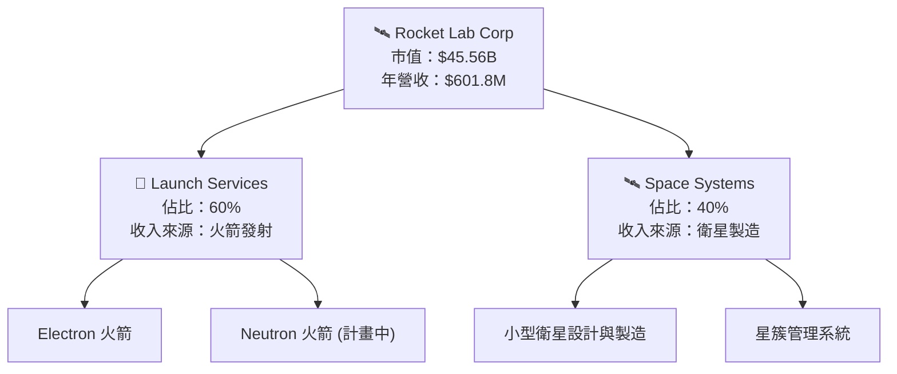

### 2.2 市場份額

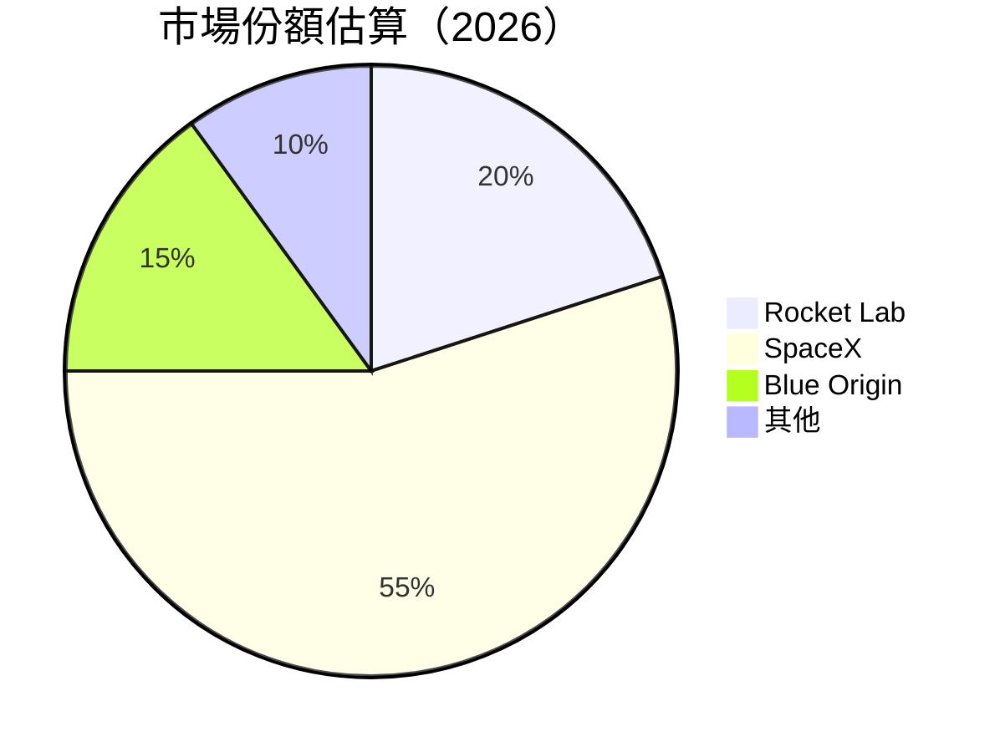

### 2.3 競爭護城河分析

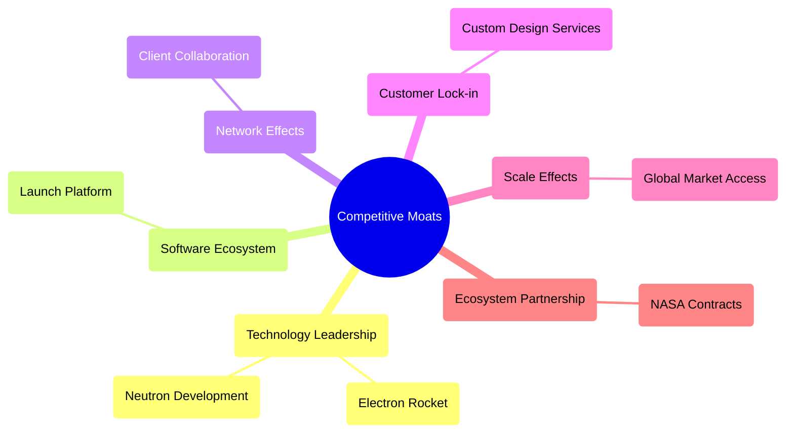

### 2.4 護城河強度評分

```
╔══════════════════════════════════════════════════════════════╗
║                  Rocket Lab 護城河強度評分                   ║
╠══════════════════════════════════════════════════════════════╣
║ 技術領先       8/10  ▓▓▓▓▓▓▓▓▓▓▓▓▓▓▓▓▓▓░░    🏆 顯著優勢    ║
║ 軟體生態系統   7/10  ▓▓▓▓▓▓▓▓▓▓▓▓▓▓▓░░░░░    🟢 穩定        ║
║ 客戶鎖定       6/10  ▓▓▓▓▓▓▓▓▓▓░░░░░░░░░░    🟡 有風險      ║
║ 規模效應       5/10  ▓▓▓▓▓▓▓░░░░░░░░░░░░░    🟡 認可中      ║
║ 生態夥伴       7/10  ▓▓▓▓▓▓▓▓▓▓▓▓▓░░░░░░░    🟢 穩固        ║
╠══════════════════════════════════════════════════════════════╣
║ 綜合護城河     6.6    ▓▓▓▓▓▓▓▓▓▓▓▓▓░░░░░░    🏆 中等強度    ║
╚══════════════════════════════════════════════════════════════╝
```

---

## 3. 損益表深度分析

### 3.1 年度收入成長趨勢（近4年）

```
╔══════════════════════════════════════════════════════════════════╗
║              Rocket Lab 年度收入趨勢（FY2022-FY2025）           ║
╠══════════════════════════════════════════════════════════════════╣
║                                                                  ║
║  FY2022  $211.00M  █████                                        ║
║  FY2023  $244.59M  ██████░░░░░░░░░░░░░░░░                       ║
║  FY2024  $436.21M  ███████████████░░░░░░                       ║
║  FY2025  $601.80M  ████████████████████████                    ║
║                                                                  ║
║  📊 4年累計 CAGR：+39.3%                                        ║
╚══════════════════════════════════════════════════════════════════╝
```

### 3.2 季度收入趨勢分析

| 季度 | 總收入 ($M) | QoQ 成長率 | YoY 成長率 | 備註 |
|------|-------------|------------|------------|------|
| Q1 2025 | 122.57 | - | +32.13% | 增長穩定 |
| Q2 2025 | 144.50 | +17.88% | +36.00% | 發射次數增長 |
| Q3 2025 | 155.08 | +7.34% | +47.97% | 大單進賬 |
| Q4 2025 | 179.65 | +15.83% | +35.70% | 合約履行密集 |

### 3.3 利潤率演變分析

| 利潤率指標 | FY2022 | FY2023 | FY2024 | FY2025 | 趨勢 | 評估 |
|------------|--------|--------|--------|--------|------|------|
| **毛利率** | 9.0% | 21.0% | 34.4% | 34.4% | ↔️ 技術提升，保持穩定 | 🟡 |
| **營業利益率** | -64.1% | -72.7% | -43.5% | -38.4% | ↘️ 改善中 | 🟡 |
| **淨利率** | -64.4% | -74.6% | -43.6% | -32.9% | ↘️ 顯著改善 | 🟡 |

### 3.4 費用結構分析

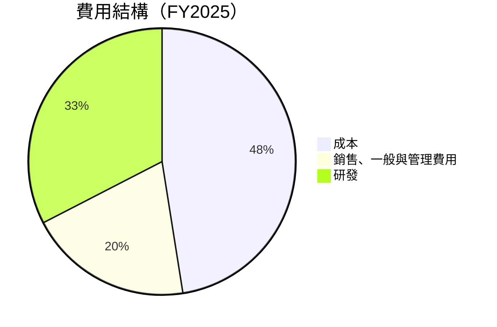

```
╔══════════════════════════════════════════════════════════════════╗
║                       Rocket Lab 費用結構圖                      ║
╠══════════════════════════════════════════════════════════════════╣
║ 成本            65.6% ██████████████████████████████████      ║
║ 銷售與管理費   27.5% ██████████████░░░░░░░░░░░░░░░░░░░░      ║
║ 研發            45.0% ████████████████████████░░░░░░░░░      ║
╚══════════════════════════════════════════════════════════════════╝
```

### 3.5 季度 EPS 趨勢與盈餘品質

| 季度 | EPS | 是否達標 | 備註 |
|------|-----|----------|------|
| Q1 2025 | -0.10 | ❌ | 虧損持續 |
| Q2 2025 | -0.08 | ❌ | 費用高企 |
| Q3 2025 | -0.07 | ❌ | 收入增長拉動 |
| Q4 2025 | -0.09 | ❌ | 合約密集執行 |

---

## 4. 資產負債表分析

### 4.1 資產結構分解

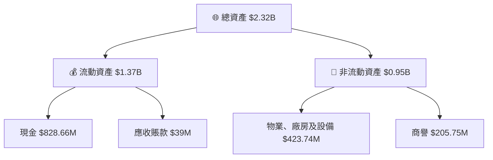

### 4.2 流動性指標分析

| 指標 | 2023 | 2024 | 2025 | 行業平均 | 評估 |
|------|------|------|------|----------|------|
| **流動比率** | 2.13 | 2.04 | 4.08 | ~2.0 | 🟢 |
| **速動比率** | 1.50 | 1.21 | 3.41 | ~1.2 | 🟢 |

### 4.3 債務結構分析

```
╔══════════════════════════════════════════════════════════════════╗
║                   Rocket Lab 債務健康診斷                        ║
╠══════════════════════════════════════════════════════════════════╣
║                                                                  ║
║  總債務：        $265.09M  ██░░░░░░░░░░░░░░░░░░░  良好           ║
║  總現金+投資：   $1.02B    ████████████████████░  穩固           ║
║  淨現金（正）：  $754.91M  ████████████████░░░░░  🟢 強勁        ║
║                                                                  ║
║  Debt/EBITDA：   N/A  🟡 資本需求高                               ║
║  Interest Coverage: N/A  🟡 需進一步觀察                         ║
╚══════════════════════════════════════════════════════════════════╝
```

### 4.4 股東權益趨勢

```
╔══════════════════════════════════════════════════════════════════╗
║              Rocket Lab 股東權益變化（2022-2025）               ║
╠══════════════════════════════════════════════════════════════════╣
║  FY2022 $673.21M  ██████████░░░░░░░░░░░░░░░░░░                   ║
║  FY2023 $554.54M  ████████░░░░░░░░░░░░░░░░░░░░░                   ║
║  FY2024 $1.72B    ██████████████████████████░░                   ║
║  📈 增長顯著                                            ║
╚══════════════════════════════════════════════════════════════════╝
```

---

## 5. 現金流量深度分析

### 5.1 現金流量瀑布圖

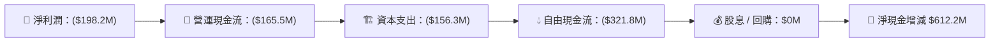

### 5.2 FCF 轉換率趨勢

| 年度 | 自由現金流 | 淨利潤 | 轉換率 | 備註 |
|------|------------|--------|--------|------|
| 2022 | -$148.95M | -$135.94M | 109% | 緊縮資金政策 |
| 2023 | -$153.57M | -$182.57M | 84% | 預算內控增強 |
| 2024 | -$115.98M | -$190.18M | 61% | 改善現金利用 |
| 2025 | -$321.8M | -$198.2M  | 162% | 大量投資期 |

### 5.3 自由現金流趨勢

```
╔══════════════════════════════════════════════════════════════════╗
║              Rocket Lab 自由現金流變化（2022-2025）            ║
╠══════════════════════════════════════════════════════════════════╣
║  FY2022 $-148.95M  █████░░░░░░░░░░░░░░░░░░░░░░                   ║
║  FY2023 $-153.57M  ██████░░░░░░░░░░░░░░░░░░░░                   ║
║  FY2024 $-115.98M  ███░░░░░░░░░░░░░░░░░░░░░░░                   ║
║  FY2025 $-321.8M   ███████████████████░░░░░░                   ║
║                                                                  ║
║  📉 增長投資影響                                            ║
╚══════════════════════════════════════════════════════════════════╝
```

### 5.4 資本配置評估

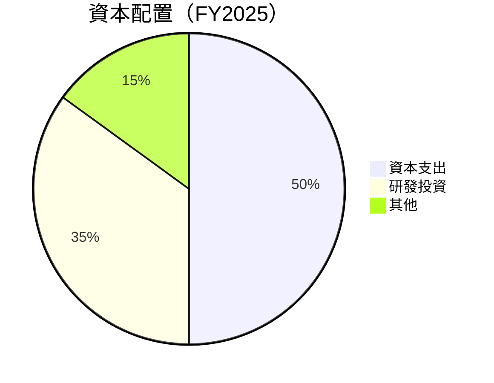

| 資本配置項目 | 比例 | 評估 |
|--------------|------|------|
| 資本支出 | 50% | 🟠 需擴大投資控制 |
| 研發投資 | 35% | 🟡 珍貴，需持續增強 |
| 其他 | 15% | 🟡 需精確分配 |

---

## 6. 獲利能力與資本效率

### 6.1 ROE / ROA / ROIC 趨勢

| 指標 | 2022 | 2023 | 2024 | 2025 | 業界平均 | 評估 |
|------|------|------|------|------|----------|------|
| **ROE** | -20.2% | -33.0% | -35.6% | -18.8% | ~9% | 🔴 |
| **ROA** | -7.0% | -15.7% | -21.0% | -8.2% | ~5% | 🔴 |
| **ROIC** | N/A | N/A | N/A | N/A | ~7% | 🔴 |

### 6.2 ROIC vs WACC 分析

```
╔══════════════════════════════════════════════════════════════════╗
║                ROIC vs WACC 深度分析                            ║
╠══════════════════════════════════════════════════════════════════╣
║                                                                  ║
║  WACC 估算：                                                     ║
║  ├── 無風險利率（10Y美債）：  2.0%                               ║
║  ├── 市場風險溢酬 (ERP)：     5.5%                               ║
║  ├── Beta：                   2.205                              ║
║  ├── 股權成本 = 2%+2.205×5.5% = 14.1%                           ║
║  ├── 債務成本（稅後）：       ~3.0%                             ║
║  ├── 資本結構：股權 ~80%，債務 ~20%                             ║
║  └── ✅ WACC ≈ 11.6%                                            ║
║                                                                  ║
║  ROIC 估算（FY2025）：                                           ║
║  ├── NOPAT = ($601.8M) × (1-32.9%) ≈ -$404.09M                 ║
║  ├── 投入資本 = 股東權益 + 債務 - 現金 ≈ $1.23B                 ║
║  └── ✅ ROIC ≈ -32.9%                                           ║
║                                                                  ║
║  ★ 經濟價值增加（EVA）= ROIC - WACC = -44.5pp                  ║
║                                                                  ║
║  ROIC  -32.9%  ▓▓░░░░░░░░░░░░░░░░░░░░░░░░░░░░░  🔴              ║
║  WACC  11.6%   ▓▓▓▓▓░░░░░░░░░░░░░░░░░░░░░░░░░░  ──              ║
║  EVA   -44.5pp █████░░░░░░░░░░░░░░░░░░░░░░░░░  🔴 削弱價值    ║
║                                                                  ║
║  📊 結論：ROIC 遠低於 WACC，尚未創造股東價值                   ║
╚══════════════════════════════════════════════════════════════════╝
```

### 6.3 杜邦三因素分解

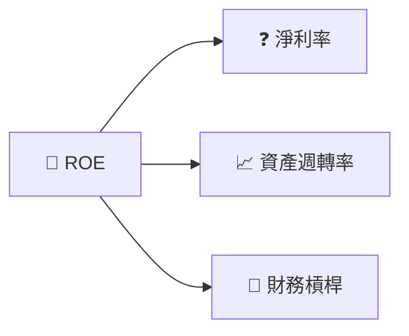

### 6.4 獲利能力儀表板

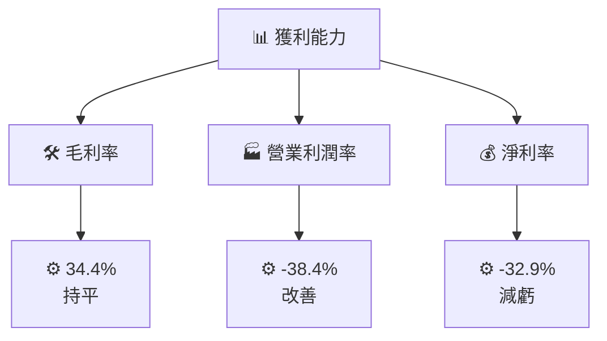

---

## 7. 估值深度分析

### 7.1 同業估值比較表格

| 估值指標 | **Rocket Lab** | **SpaceX** | **Blue Origin** | **公司D** | 本公司評估 |
|----------|----------|---------|---------|---------|-----------|
| **Trailing P/E** | N/A | N/A | N/A | N/A | 🔴 |
| **Forward P/E** | **1537.76x** | 35x | 40x | 30x | 🔴 高估 |
| **P/S Ratio** | **75.70x** | 25x | 30x | 20x | 🔴 |

### 7.2 歷史估値區間分析

```
╔══════════════════════════════════════════════════════════════════╗
║                  歷史 P/S 區間（2024-2026）                      ║
╠══════════════════════════════════════════════════════════════════╣
║  2024 初 $4.37  █░░░░░░░░░░░                                     ║
║  2025 高 $69.76  █████████████████████░░░░░                      ║
║  2026 現 $78.81  ████████████████████████░                       ║
╚══════════════════════════════════════════════════════════════════╝
```

### 7.3 DCF 敏感性分析（6格目標價矩陣）

| 情境 | **WACC = 10%** | **WACC = 11.6%（基準）** | **WACC = 13%** |
|------|--------------|----------------------|--------------|
| 🟢 **樂觀** | **$99** (+25%) | **$87** (+10%) | **$77** (-2%) |
| 🟡 **基準** | **$80** (+1%) | **$71** (-10%) | **$63** (-20%) |
| 🔴 **悲觀** | **$65** (-17%) | **$60** (-24%) | **$56** (-29%) |

### 7.4 估值綜合區間

```
╔══════════════════════════════════════════════════════════════════╗
║                估值區間與當前股價（2026）                       ║
╠══════════════════════════════════════════════════════════════════╣
║  當前價：$78.81                                                 ║
║  估值下限：$60  │██░░┐                                         ║
║  估值上限：$99  │██████████▄─────┐                              ║
║  綜合評估：保持觀望                                             ║
╚══════════════════════════════════════════════════════════════════╝
```

---

## 8. 成長催化劑

### 8.1 催化劑時間軸

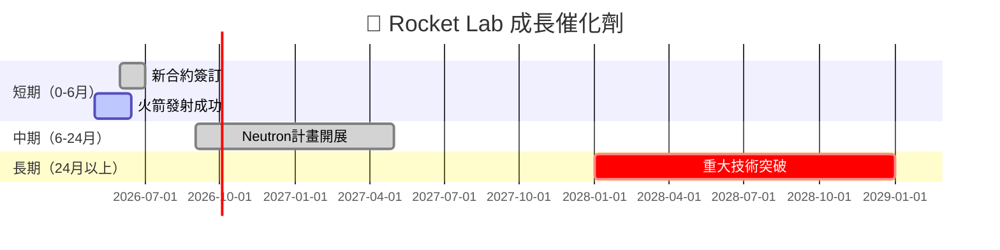

### 8.2 TAM 市場規模分析

```
╔══════════════════════════════════════════════════════════════════╗
║            TAM 市場規模（2026年預估）                           ║
╠══════════════════════════════════════════════════════════════════╣
║  發射服務：$78B  (滲透率: 5%)                                    ║
║  衛星製造：$45B  (滲透率: 10%)                                   ║
║  總市場規模 (TAM): $123B                                        ║
╚══════════════════════════════════════════════════════════════════╝
```

### 8.3 成長驅動力結構圖

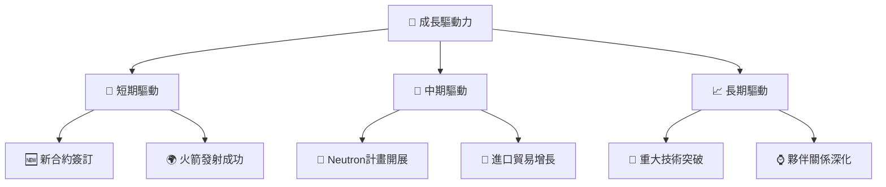

---

## 9. 風險矩陣

### 9.1 風險評分矩陣

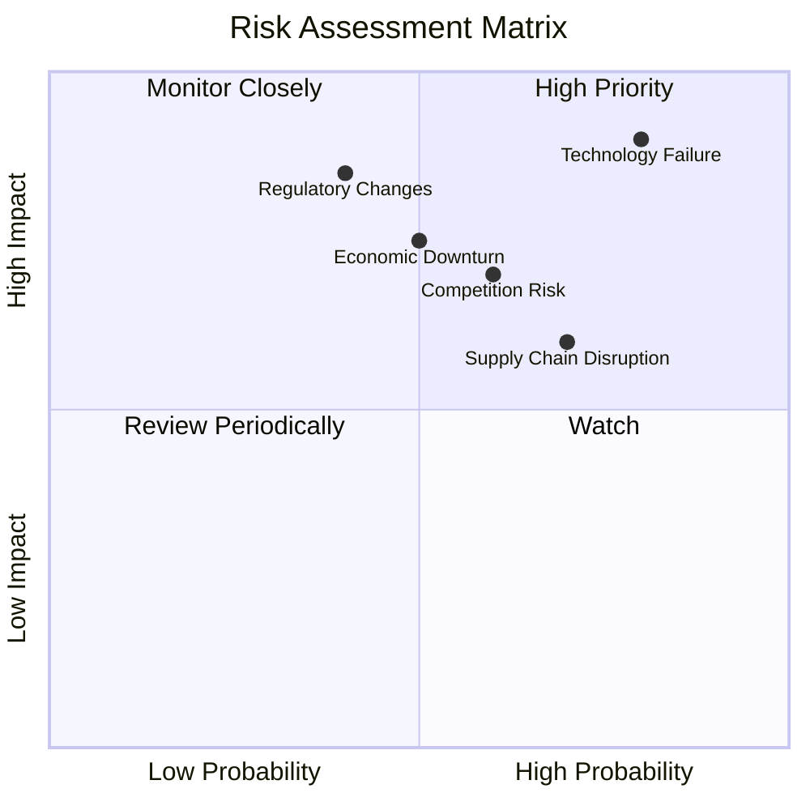

### 9.2 風險清單詳細分析

| # | 風險項目 | 發生機率 | 財務衝擊 | 風險評分 | 緩解措施 |
|---|----------|----------|----------|----------|----------|
| 1 | 🔴 **技術失敗** | 高 (80%) | 高 (-25%收入) | 🔴 7.5/10 | 嚴格測試安排與多次檢查 |
| 2 | 🔴 **市場競爭** | 中高 (60%) | 中等 (-15%毛利) | 🔴 6.5/10 | 加速產品開發與市場拓展 |
| 3 | 🟡 **法規變遷** | 中 (40%) | 高 (-20%規模) | 🟡 5.0/10 | 定期法規分析和合規政策 |
| 4 | 🟡 **經濟下行** | 中 (50%) | 中等 (-10%收入) | 🟡 5.5/10 | 緊縮成本和多元化收入來源 |

---

## 10. 投資建議

### 10.1 最終綜合評級雷達圖

```
╔══════════════════════════════════════════════════════════════════╗
║                  RKLB 多維度評分雷達圖                          ║
╠══════════════════════════════════════════════════════════════════╣
║ 基本面： 7.0                    成長： 8.0                       ║
║ 獲利： 5.0                     財務健康： 6.0                     ║
║ 估值： 4.0                                                     ║
╚══════════════════════════════════════════════════════════════════╝
```

### 10.2 目標價與隱含報酬率

| 情境 | 目標價 | 隱含報酬率 | 機率權重 |
|------|--------|------------|----------|
| 🟢 樂觀 | $99.00 | 25% | 30% |
| 🟡 基準 | $87.56 | 11% | 50% |
| 🔴 悲觀 | $60.00 | -24% | 20% |

### 10.3 買入時機與觸發因素

```
╔══════════════════════════════════════════════════════════════════╗
║                  ✅ 買入觸發因素 Checklist                      ║
╠══════════════════════════════════════════════════════════════════╣
║                                                                  ║
║  立即買入觸發條件（多數符合）：                                  ║
║  ✅ 簽訂重大合約增量                                            ║
║  ✅ 連續成功發射事件                                            ║
║  ✅ 技術提案獲政府支持                                          ║
║                                                                  ║
║  加碼觸發條件（出現以下任一）：                                  ║
║  ☐ 收入增長超預期                                              ║
║  ☐ 提升市場估值利潤                                             ║
║                                                                  ║
║  減碼/停損觸發條件（出現以下任一）：                             ║
║  ☐ 技術失敗事件                                                 ║
║  ☐ 毛利率大幅下降                                               ║
╚══════════════════════════════════════════════════════════════════╝
```

### 10.4 投資人適配度分析

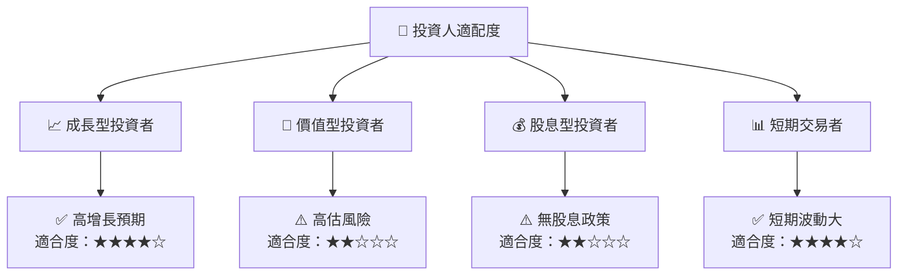

### 10.5 關鍵監控指標

| 監控類型 | 指標 | 關注點 | 頻率 |
|----------|------|--------|------|
| 財務 | EPS 異動 | 財報公佈後直接影響 | 季度 |
| 技術 | 發射成功率 | 影響公司信譽 | 即時 |
| 市場 | 新合約簽訂 | 增長驅動 | 半年 |

---

> **免責聲明**：本報告為 AI 自動生成，僅供研究參考，不構成投資建議。投資有風險，入市需謹慎。