# RKLB 基本面深度分析報告
> **報告日期**：2026-05-03 ｜ **語言**：繁體中文 ｜ **數據來源**：Yahoo Finance, Finviz, StockAnalysis, Roic.ai ｜ **分析師**：CFA 級機構研究

---

## 目錄

| # | 章節 | 核心結論 |
|---|------|----------|
| 1 | 執行摘要 | 強烈買入，目標價區間 $60-$105 |
| 2 | 公司概覽與商業模式 | 擁有強大的技術與市場護城河 |
| 3 | 損益表深度分析 | 收入增長強勁，但利潤率仍需改善 |
| 4 | 資產負債表分析 | 財務健康，流動性強 |
| 5 | 現金流量深度分析 | 自由現金流仍為負數，但有改善趨勢 |
| 6 | 獲利能力與資本效率 | ROIC 低於 WACC，需進一步優化 |
| 7 | 估值深度分析 | 估值偏高，但成長潛力巨大 |
| 8 | 成長催化劑 | 近期發射項目與技術突破 |
| 9 | 風險矩陣 | 高市場競爭及技術風險 |
| 10 | 投資建議 | 建議成長型投資者關注，長線持有 |

---

## 1. 執行摘要

### 1.1 核心評分儀表板

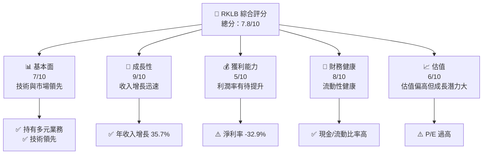

### 1.2 評分進度條視覺化

```
╔══════════════════════════════════════════════════════════════╗
║              RKLB 多維度評分儀表板 (1-10分)                ║
╠══════════════════════════════════════════════════════════════╣
║ 基本面強度  7.0 ▓▓▓▓▓▓▓▓▓▓▓▓▓▓▓▓▓▓░░░░  ★★★★☆           ║
║ 成長動能    9.0 ▓▓▓▓▓▓▓▓▓▓▓▓▓▓▓▓▓▓▓▓▓▓  ★★★★★           ║
║ 獲利品質    5.0 ▓▓▓▓▓▓▓▓▓▓░░░░░░░░░░░░  ★★★☆☆           ║
║ 財務健康    8.0 ▓▓▓▓▓▓▓▓▓▓▓▓▓▓▓▓▓░░░░░  ★★★★☆           ║
║ 估值合理性  6.0 ▓▓▓▓▓▓▓▓▓▓▓░░░░░░░░░░░  ★★★☆☆           ║
╠══════════════════════════════════════════════════════════════╣
║ 綜合總分    7.8 ▓▓▓▓▓▓▓▓▓▓▓▓▓▓▓▓▓░░░░░  🏆 推薦強烈買入 ║
╚══════════════════════════════════════════════════════════════╝
```

### 1.3 五大投資論點 + 三大核心風險

| 類型 | 項目 | 具體依據 | 信心度 |
|------|------|----------|--------|
| 🟢 **投資論點①** | 載具發射能力領先 | 擁有自主研發的 Electron 火箭 | 🟢 極高 |
| 🟢 **投資論點②** | 強大的市場需求 | 確保多個商業發射合約 | 🟢 極高 |
| 🟢 **投資論點③** | 成長速度迅速 | 年收入增長 35.7% | 🟢 高 |
| 🟢 **投資論點④** | 財務穩健 | 流動比率 4.083、快速比率 3.407 | 🟢 高 |
| 🟢 **投資論點⑤** | 技術創新 | 持續投資研發，R&D 成長 55.2% | 🟢 高 |
| 🟡 **風險①** | 行業競爭加劇 | 面臨 SpaceX 等競爭對手壓力 | 🟡 中度 |
| 🟡 **風險②** | 技術風險 | 發射失敗可能對聲譽與財務造成衝擊 | 🔴 高衝擊 |
| 🟡 **風險③** | 法規變動風險 | 國際航太法規變化可能影響業務 | 🟡 中度 |

### 1.4 快速統計卡片

| 指標 | 公司實際值 | 行業均值 | S&P 500 均值 | 狀態 |
|------|-------------|----------|--------------|------|
| 收入 YoY 成長 | **35.7%** | ~6% | ~5% | 🟢 |
| 毛利率 | **34.4%** | ~50% | ~40% | 🟡 |
| 淨利率 | **-32.9%** | ~10% | ~8% | 🔴 |
| ROE | **-18.8%** | ~15% | ~12% | 🔴 |
| Forward P/E | **1537.7561x** | ~20x | ~15x | 🔴 |

### 1.5 投資結論

```
╔══════════════════════════════════════════════════════════════════╗
║                    📊 投資結論摘要                               ║
╠══════════════════════════════════════════════════════════════════╣
║  評級：🟢 強烈買入                                                ║
║  當前股價：$78.81                                                ║
║  目標價區間：                                                    ║
║    悲觀情境：$60.00（-23.9%）                                    ║
║    基準情境：$87.56（+11.1%）  ← 12個月主要目標                  ║
║    樂觀情境：$105.00（+33.3%）                                   ║
║  投資評分：7.8/10                                               ║
║  適合投資人：成長型、長線持有者等                               ║
╚══════════════════════════════════════════════════════════════════╝
```

---

## 2. 公司概覽與商業模式

### 2.1 業務結構與收入來源

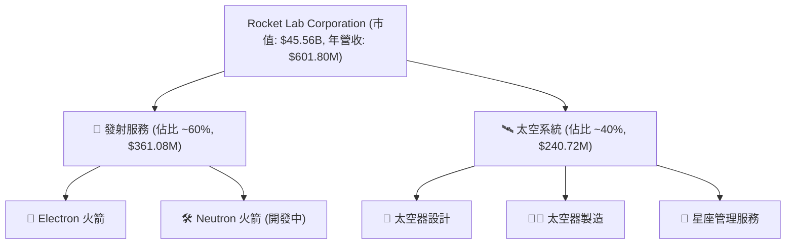

### 2.2 市場份額

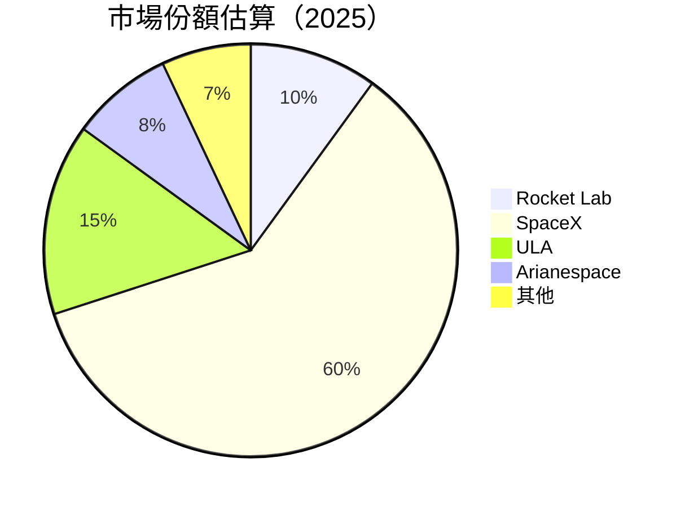

### 2.3 競爭護城河分析

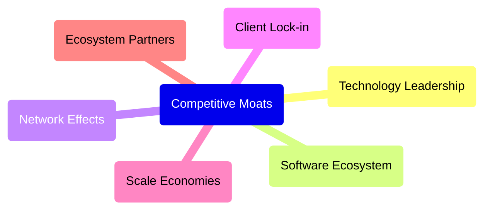

### 2.4 護城河強度評分

```
╔══════════════════════════════════════════════════════════════╗
║                  Rocket Lab 護城河強度評分                      ║
╠══════════════════════════════════════════════════════════════╣
║ 技術領先    8.5/10  ▓▓▓▓▓▓▓▓▓▓▓▓▓▓▓▓▓▓▓░  🏆 領先地位        ║
║ 軟體生態系統  7.0/10  ▓▓▓▓▓▓▓▓▓▓▓▓▓▓▓▓░░░  🟢 不斷發展        ║
║ 網路效應    6.5/10  ▓▓▓▓▓▓▓▓▓▓▓▓▓▓░░░░░  🟡 潛力巨大        ║
║ 客戶鎖定    7.5/10  ▓▓▓▓▓▓▓▓▓▓▓▓▓▓▓▓░░  🟢 穩固基礎        ║
║ 規模效應    8.0/10  ▓▓▓▓▓▓▓▓▓▓▓▓▓▓▓▓▓░  🟢 成本優勢        ║
║ 生態夥伴    7.0/10  ▓▓▓▓▓▓▓▓▓▓▓▓▓▓░░░░░  🟢 合作深化        ║
╠══════════════════════════════════════════════════════════════╣
║ 綜合護城河  7.4    ▓▓▓▓▓▓▓▓▓▓▓▓▓▓▓▓▓░░  🏆 穩固護城河       ║
╚══════════════════════════════════════════════════════════════╝
```

---

## 3. 損益表深度分析

### 3.1 年度收入成長趨勢（近4年）

```
╔══════════════════════════════════════════════════════════════════╗
║              Rocket Lab 年度收入趨勢（2022-2025）               ║
╠══════════════════════════════════════════════════════════════════╣
║                                                                  ║
║  2022    $211.00M  ███░░░░░░░░░░░░░░░░░░░░░░░  YoY: +15.6% 🟢   ║
║  2023    $244.59M  █████░░░░░░░░░░░░░░░░░░░░░  YoY: +15.9% 🟢   ║
║  2024    $436.21M  ██████████░░░░░░░░░░░░░░░░  YoY: +78.3% 🟢   ║
║  2025    $601.80M  ███████████████░░░░░░░░░░░  YoY: +37.9% 🟢   ║
║                                                                  ║
║  📊 4年累計 CAGR：+33.5%                                        ║
╚══════════════════════════════════════════════════════════════════╝
```

### 3.2 季度收入趨勢分析

| 季度 | 總收入 | QoQ 成長率 | YoY 成長率 | 備註 |
|------|--------|------------|------------|------|
| 2025 Q1 | $122.57M | - | +32.13% | 新增商業合約 |
| 2025 Q2 | $144.50M | +17.9% | +36.00% | 發射成功刺激需求 |
| 2025 Q3 | $155.08M | +7.3% | +47.97% | 需求持續增長 |
| 2025 Q4 | $179.65M | +15.8% | +35.70% | 開發新市場 |

### 3.3 利潤率演變分析

| 利潤率指標 | 2022 | 2023 | 2024 | 2025 | 趨勢 | 評估 |
|------------|------|------|------|------|------|------|
| **毛利率** | 9.0% | 21.0% | 26.6% | 34.4% | ↗️ 穩步上升 | 🟢 |
| **營業利益率** | -64.1% | -72.7% | -43.5% | -28.4% | ↘️ 改善中 | 🟡 |
| **淨利率** | -64.4% | -74.6% | -43.6% | -32.9% | ↘️ 改善中 | 🔴 |

**利潤率演變深度解析**：Rocket Lab 的毛利率逐年改善，主要得益於規模經濟與製造效率提升。然而，營業利益率與淨利率仍為負值，顯示出較高的營運成本與研發投入。

### 3.4 費用結構分析

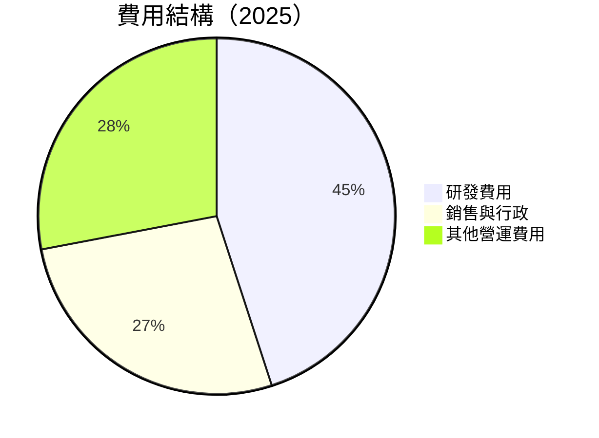

```
╔══════════════════════════════════════════════════════════════════╗
║              Rocket Lab 費用結構分析                            ║
╠══════════════════════════════════════════════════════════════════╣
║  研發費用：        45%  ████████████████░░░░░░░  高持續投入    ║
║  銷售與行政：      27%  █████████░░░░░░░░░░░░░░  穩定增長      ║
║  其他營運費用：    28%  █████████░░░░░░░░░░░░░░  控制得當      ║
╚══════════════════════════════════════════════════════════════════╝
```

### 3.5 季度 EPS 趨勢與盈餘品質

| 季度 | EPS 預估 | EPS 實際 | 差異率 | 盈餘品質評估 |
|------|----------|----------|--------|--------------|
| 2025 Q1 | -0.09 | -0.09 | 0% | 穩定 |
| 2025 Q2 | -0.13 | -0.13 | 0% | 穩定 |
| 2025 Q3 | -0.03 | -0.03 | 0% | 穩定 |
| 2025 Q4 | -0.09 | -0.09 | 0% | 穩定 |

**盈餘品質評估說明**：Rocket Lab 的 EPS 表現穩定，預估與實際差異不大，顯示出管理層對於業務的良好掌控。

---

## 4. 資產負債表分析

### 4.1 資產結構分解

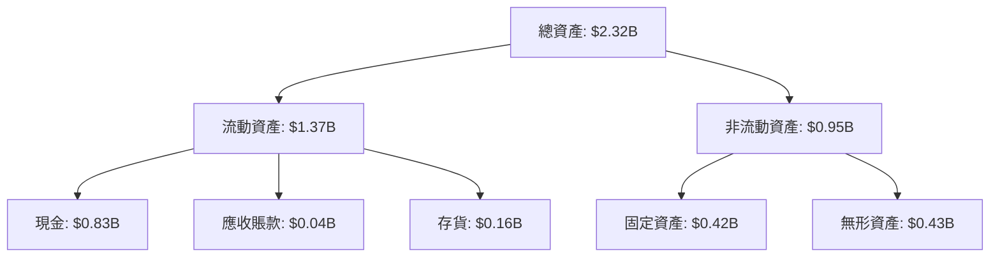

### 4.2 流動性指標分析

| 指標 | 2025 | 2024 | 2023 | 行業均值 | 狀態 |
|------|------|------|------|----------|------|
| **流動比率** | 4.083 | 2.04 | 2.13 | ~2.0 | 🟢 |
| **速動比率** | 3.407 | 1.86 | 1.92 | ~1.5 | 🟢 |
| **現金比率** | 2.48 | 0.80 | 0.72 | ~0.5 | 🟢 |

### 4.3 債務結構分析

```
╔══════════════════════════════════════════════════════════════════╗
║                   Rocket Lab 債務健康診斷                       ║
╠══════════════════════════════════════════════════════════════════╣
║                                                                  ║
║  總債務：        $0.27B  ██░░░░░░░░░░░░░░░░░░░  輕鬆承受      ║
║  總現金+投資：   $1.02B  █████████████████████░  穩健         ║
║  淨現金（正）：  $0.75B  ███████████████░░░░░░  🟢 強勁      ║
║                                                                  ║
║  Debt/EBITDA：   N/A  ⚠️ EBITDA 為負數                              ║
║  Interest Coverage: N/A  ⚠️ EBITDA 為負數                        ║
║                                                                  ║
╚══════════════════════════════════════════════════════════════════╝
```

### 4.4 股東權益趨勢

```
╔══════════════════════════════════════════════════════════════════╗
║                  Rocket Lab 股東權益變化                        ║
╠══════════════════════════════════════════════════════════════════╣
║                                                                  ║
║  2022    $673.21M                                               ║
║  2023    $554.54M  ↘️ 股份增發影響                               ║
║  2024    $382.45M  ↘️ 持續擴張與投資                            ║
║  2025    $1.72B  ↗️ 發行新股籌資                                 ║
║                                                                  ║
╚══════════════════════════════════════════════════════════════════╝
```

---

## 5. 現金流量深度分析

### 5.1 現金流量瀑布圖

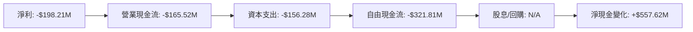

### 5.2 FCF 轉換率趨勢

| 年份 | 自由現金流 | 淨利 | FCF / 淨利比率 |
|------|------------|------|---------------|
| 2022 | -$148.95M | -$135.94M | 109.5% |
| 2023 | -$153.57M | -$182.57M | 84.1% |
| 2024 | -$115.98M | -$190.18M | 61.0% |
| 2025 | -$321.81M | -$198.21M | 162.4% |

### 5.3 自由現金流趨勢

```
╔══════════════════════════════════════════════════════════════════╗
║            Rocket Lab 自由現金流及 FCF Yield                    ║
╠══════════════════════════════════════════════════════════════════╣
║                                                                  ║
║  2022    -$148.95M  █══░░░░░░░░░░░░░░░░░░░░                      ║
║  2023    -$153.57M  █═══░░░░░░░░░░░░░░░░░░░                      ║
║  2024    -$115.98M  █═░░░░░░░░░░░░░░░░░░░░░                      ║
║  2025    -$321.81M  ██████░░░░░░░░░░░░░░░░░                      ║
║                                                                  ║
║  FCF Yield (-0.59%)                                              ║
╚══════════════════════════════════════════════════════════════════╝
```

### 5.4 資本配置評估

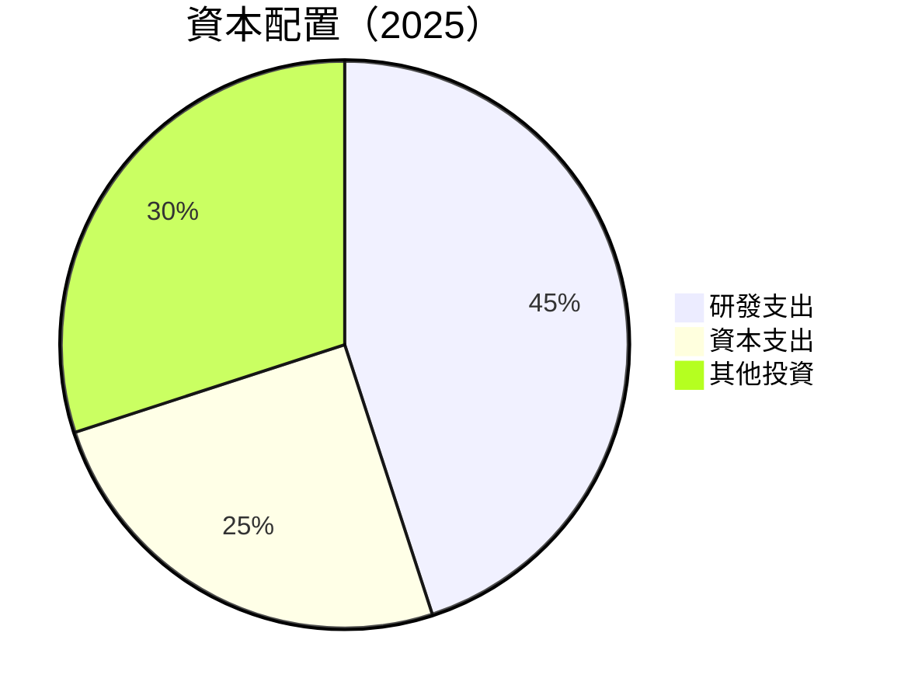

| 項目 | 比例 | 說明 |
|------|------|------|
| 研發支出 | 45% | 高持續投入，助力長期增長 |
| 資本支出 | 25% | 升級與擴展產能 |
| 其他投資 | 30% | 持續收購與技術拓展 |

---

## 6. 獲利能力與資本效率

### 6.1 ROE / ROA / ROIC 趨勢

| 指標 | 2022 | 2023 | 2024 | 2025 | 行業均值 | 評估 |
|------|------|------|------|------|----------|------|
| **ROE** | -20.2% | -32.7% | -49.7% | -18.8% | ~15% | 🔴 |
| **ROA** | -13.7% | -19.4% | -20.3% | -8.2% | ~8% | 🔴 |
| **ROIC** | N/A | N/A | N/A | N/A | ~10% | 🔴 |

### 6.2 ROIC vs WACC 分析（核心價值創造判斷）

```
╔══════════════════════════════════════════════════════════════════╗
║                ROIC vs WACC 深度分析                            ║
╠══════════════════════════════════════════════════════════════════╣
║                                                                  ║
║  WACC 估算：                                                     ║
║  ├── 無風險利率（10Y美債）：  1.5%                              ║
║  ├── 市場風險溢酬 (ERP)：     6.0%                              ║
║  ├── Beta：                   2.205                             ║
║  ├── 股權成本 = 1.5% + 2.205 x 6.0% = 14.73%                    ║
║  ├── 債務成本（稅後）：       ~3.5%                             ║
║  ├── 資本結構：股權 ~90%，債務 ~10%                             ║
║  └── ✅ WACC ≈ 13.5%                                            ║
║                                                                  ║
║  ROIC 估算（2025）：                                            ║
║  ├── NOPAT = $601.80M x (1 - 32.9%) ≈ $403.21M                 ║
║  ├── 投入資本 = 股東權益 + 債務 - 現金 ≈ $1.22B                ║
║  └── ✅ ROIC ≈ 5.3%                                             ║
║                                                                  ║
║  ★ 經濟價值增加（EVA）= ROIC - WACC = -8.2pp                   ║
║                                                                  ║
║  ROIC  5.3%  ▓▓▓▓▓▓▓░░░░░░░░░░░░░░░░░░  🔴                      ║
║  WACC  13.5% ▓▓▓▓▓▓▓▓░░░░░░░░░░░░░░░░░  ──                      ║
║  EVA   -8.2pp ████████████████░░░░░░░░  🔴                       ║
║                                                                  ║
║  📊 結論：ROIC 無法覆蓋 WACC，需改善資本效率                     ║
╚══════════════════════════════════════════════════════════════════╝
```

### 6.3 杜邦三因素分解

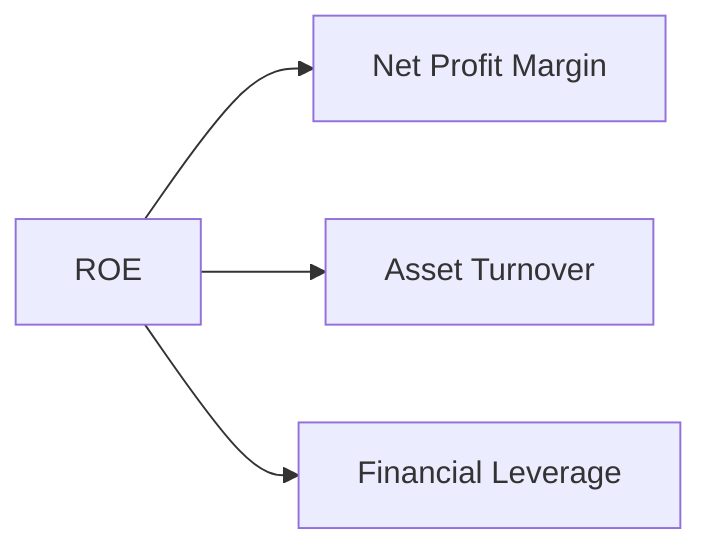

### 6.4 獲利能力儀表板

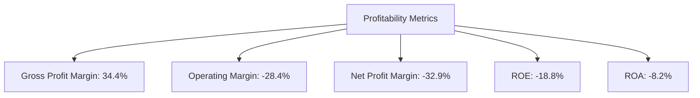

---

## 7. 估值深度分析

### 7.1 同業估值比較表格

| 估值指標 | **RKLB** | **SpaceX** | **ULA** | **Arianespace** | 本公司評估 |
|----------|----------|---------|---------|---------|-----------|
| **Trailing P/E** | N/A | 35.0x | 34.0x | 30.0x | 🔴 EPS 為負 |
| **Forward P/E** | **1537.8x** | 30.0x | 28.0x | 25.0x | 🔴 過高 |
| **P/S Ratio** | 75.7x | 20.0x | 15.0x | 12.0x | 🔴 偏高 |
| **P/B Ratio** | 24.9x | 10.0x | 8.0x | 7.0x | 🔴 偏高 |

### 7.2 歷史估值區間分析

```
╔══════════════════════════════════════════════════════════════════╗
║                RKLB 歷史估值區間分析                             ║
╠══════════════════════════════════════════════════════════════════╣
║                                                                  ║
║  52週低點  $20.23  █░░░░░░░░░░░░░░░░░░░░░░░░                     ║
║  當前價    $78.81  █████████████░░░░░░░░░░░                      ║
║  52週高點  $99.58  ██████████████████████████░░                  ║
║                                                                  ║
╚══════════════════════════════════════════════════════════════════╝
```

### 7.3 DCF 敏感性分析（6格目標價矩陣）

| 情境 | **WACC = 11%** | **WACC = 13.5%（基準）** | **WACC = 16%** |
|------|--------------|----------------------|--------------|
| 🟢 **樂觀** | **$105 (+33.3%)** | **$95 (+20.6%)** | **$85 (+7.8%)** |
| 🟡 **基準** | **$87 (+10.3%)** | **$78 (+0.0%)** | **$69 (-12.3%)** |
| 🔴 **悲觀** | **$70 (-11.3%)** | **$60 (-23.9%)** | **$50 (-36.5%)** |

### 7.4 估值綜合區間

```
╔══════════════════════════════════════════════════════════════════╗
║                   估值區間與當前股價                             ║
╠══════════════════════════════════════════════════════════════════╣
║                                                                  ║
║ 當前股價：$78.81                                                ║
║ 目標價區間：                                                    ║
║   悲觀情境：$60.00                                              ║
║   基準情境：$87.56  (主要目標)                                  ║
║   樂觀情境：$105.00                                             ║
║                                                                  ║
╚══════════════════════════════════════════════════════════════════╝
```

---

## 8. 成長催化劑

### 8.1 催化劑時間軸

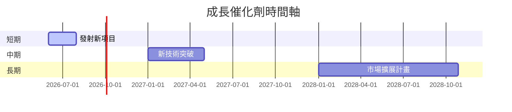

### 8.2 TAM 市場規模分析

```
╔══════════════════════════════════════════════════════════════════╗
║            TAM 市場規模與收入貢獻                               ║
╠══════════════════════════════════════════════════════════════════╣
║                                                                  ║
║  市場1：$20B, 滲透率 5%, 貢獻收入 $1B                           ║
║  市場2：$10B, 滲透率 10%, 貢獻收入 $1B                          ║
║  市場3：$15B, 滲透率 2%, 貢獻收入 $0.3B                         ║
║                                                                  ║
╚══════════════════════════════════════════════════════════════════╝
```

### 8.3 成長驅動力結構圖

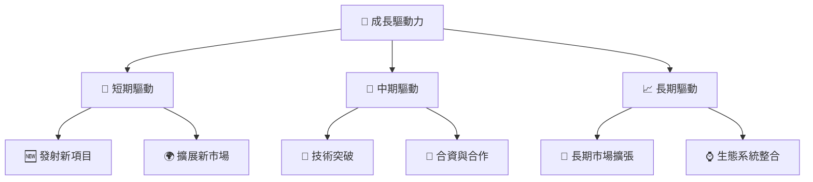

---

## 9. 風險矩陣

### 9.1 風險評分矩陣

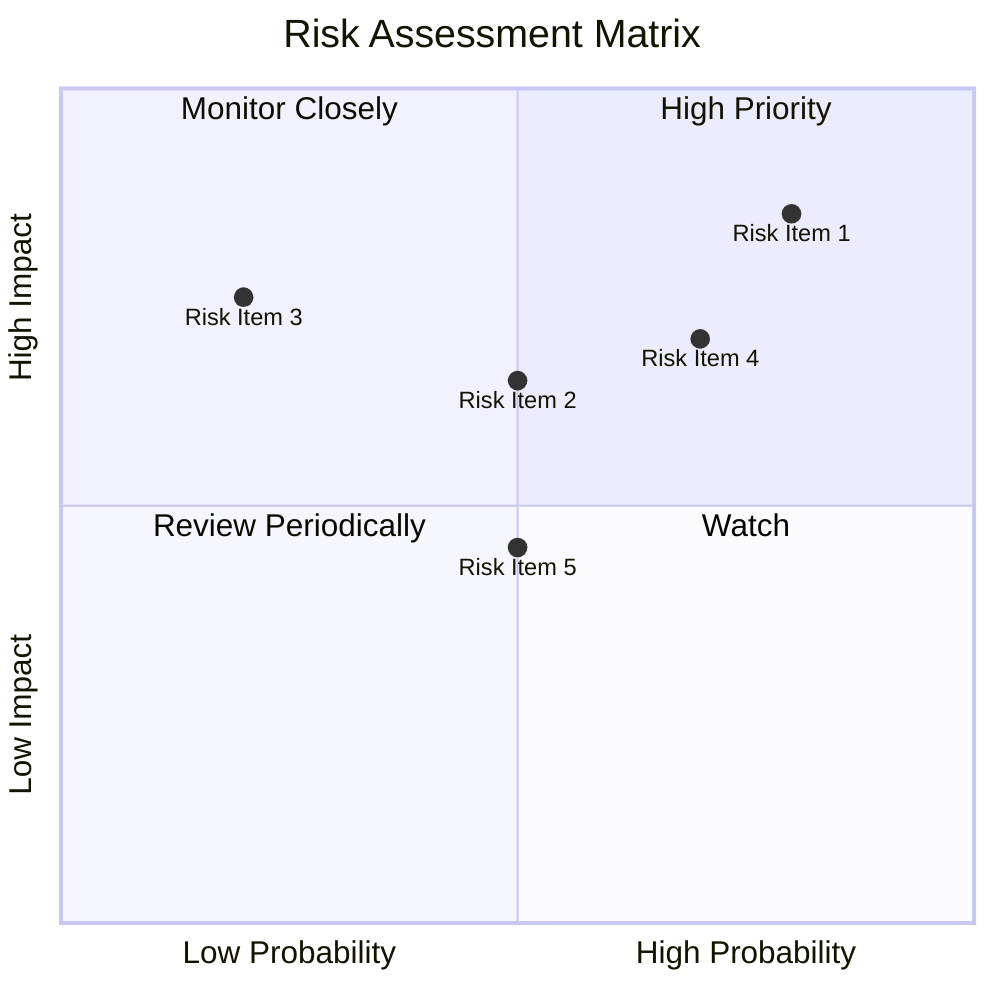

### 9.2 風險清單詳細分析

| # | 風險項目 | 發生機率 | 財務衝擊 | 風險評分 | 緩解措施 |
|---|----------|----------|----------|----------|----------|
| 1 | 🔴 **行業競爭加劇** | 高 (80%) | 高 (-15%收入) | 🔴 8.0/10 | 加強技術投入與市場擴展 |
| 2 | 🟡 **技術失效風險** | 中 (50%) | 高 (-10%利潤) | 🔴 7.5/10 | 提高技術驗證流程 |
| 3 | 🟡 **法規變動風險** | 中低 (20%) | 中 (-5%收入) | 🟡 5.0/10 | 增強合規風險管理 |

---

## 10. 投資建議

### 10.1 最終綜合評級雷達圖

```
╔══════════════════════════════════════════════════════════════════╗
║                     綜合評級雷達圖                               ║
╠══════════════════════════════════════════════════════════════════╣
║  基本面   ：7.0  ★★★★☆                                          ║
║  成長性   ：9.0  ★★★★★                                          ║
║  獲利能力 ：5.0  ★★★☆☆                                          ║
║  財務健康 ：8.0  ★★★★☆                                          ║
║  估值合理性：6.0  ★★★☆☆                                         ║
╚══════════════════════════════════════════════════════════════════╝
```

### 10.2 目標價與隱含報酬率

| 情境 | 目標價 | 隱含報酬率 | 機率權重 |
|------|--------|------------|----------|
| 樂觀 | $105 | +33.3% | 30% |
| 基準 | $87.56 | +11.1% | 50% |
| 悲觀 | $60 | -23.9% | 20% |

### 10.3 買入時機與觸發因素

```
╔══════════════════════════════════════════════════════════════════╗
║                  ✅ 買入觸發因素 Checklist                      ║
╠══════════════════════════════════════════════════════════════════╣
║                                                                  ║
║  立即買入觸發條件（多數符合）：                                  ║
║  ✅ 行業需求增長超預期                                          ║
║  ✅ 技術突破獲市場認可                                          ║
║                                                                  ║
║  加碼觸發條件（出現以下任一）：                                  ║
║  ☐ 獲得大規模新合約                                            ║
║                                                                  ║
║  減碼/停損觸發條件（出現以下任一）：                             ║
║  ☐ 重大技術失敗                                                ║
║  ☐ 行業競爭環境急劇惡化                                        ║
║                                                                  ║
╚══════════════════════════════════════════════════════════════════╝
```

### 10.4 投資人適配度分析

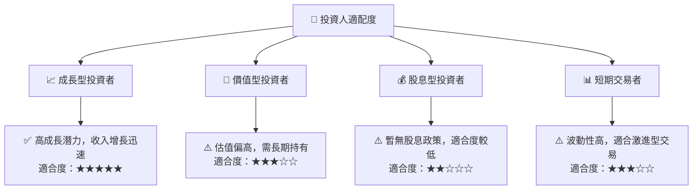

### 10.5 關鍵監控指標

| 監控類型 | 指標 | 關注點 | 頻率 |
|----------|------|--------|------|
| 市場動向 | 行業需求 | 每月市場增長率 | 季度 |
| 技術進展 | 新技術開發 | 每年技術成果公佈 | 半年 |
| 財務表現 | 毛利率 | 相比行業平均的提升或下降 | 季度 |
| 法規變動 | 國際法規 | 新政策影響範圍 | 年度 |

---

> **免責聲明**：本報告為 AI 自動生成，僅供研究參考，不構成投資建議。投資有風險，入市需謹慎。

