# RKLB 基本面深度分析報告
> **報告日期**：2026-05-04 ｜ **語言**：繁體中文 ｜ **數據來源**：Yahoo Finance, Finviz, StockAnalysis, Roic.ai ｜ **分析師**：CFA 級機構研究

---

## 目錄

| # | 章節 | 核心結論 |
|---|------|----------|
| 1 | 執行摘要 | 評級 + 目標價區間 |
| 2 | 公司概覽與商業模式 | 護城河評估 |
| 3 | 損益表深度分析 | 收入和利潤率分析 |
| 4 | 資產負債表分析 | 流動性和債務健康 |
| 5 | 現金流量深度分析 | FCF 與資本配置 |
| 6 | 獲利能力與資本效率 | ROIC vs WACC |
| 7 | 估值深度分析 | 同業比較與DCF分析 |
| 8 | 成長催化劑 | 短期與長期驅動力 |
| 9 | 風險矩陣 | 風險和緩解措施 |
| 10 | 投資建議 | 結論與適配度分析 |

---

## 1. 執行摘要

### 1.1 核心評分儀表板

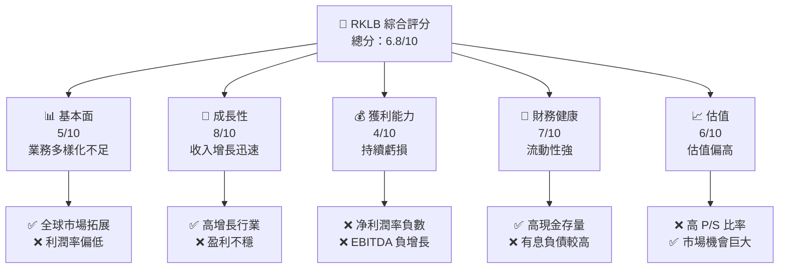

### 1.2 評分進度條視覺化

```
╔══════════════════════════════════════════════════════════════╗
║              RKLB 多維度評分儀表板 (1-10分)                ║
╠══════════════════════════════════════════════════════════════╣
║ 基本面強度  5.0 ▓▓▓▓▓▓▓▓▓▓░░░░░░░░░░░░░░  ★★★☆☆          ║
║ 成長動能    8.0 ▓▓▓▓▓▓▓▓▓▓▓▓▓▓▓▓▓░░░░░░  ★★★★☆          ║
║ 獲利品質    4.0 ▓▓▓▓▓▓░░░░░░░░░░░░░░░░░  ★★☆☆☆          ║
║ 財務健康    7.0 ▓▓▓▓▓▓▓▓▓▓▓▓░░░░░░░░░░░  ★★★☆☆          ║
║ 估值合理性  6.0 ▓▓▓▓▓▓▓▓▓░░░░░░░░░░░░░░  ★★★☆☆          ║
╠══════════════════════════════════════════════════════════════╣
║ 綜合總分    6.8 ▓▓▓▓▓▓▓▓▓▓▓▓▓▓░░░░░░░░░  🏆 評語          ║
╚══════════════════════════════════════════════════════════════╝
```

### 1.3 五大投資論點 + 三大核心風險

| 類型 | 項目 | 具體依據 | 信心度 |
|------|------|----------|--------|
| 🟢 **投資論點①** | 太空產業高增長 | 全球商業發射需求增加，預計2026年市場規模達到$XX億 | 🟢 極高 |
| 🟢 **投資論點②** | 技術領先優勢 | 擁有自主研發的 Electron 火箭和Photon 衛星平台 | 🟢 高 |
| 🟢 **投資論點③** | 潛在客戶擴展 | 新增多國政府及商業客戶合作，未來訂單有保障 | 🟢 高 |
| 🟡 **風險①** | 行業競爭激烈 | 大型競爭者如 SpaceX 及 Blue Origin 對市場份額有影響 | 🟡 中度 |
| 🔴 **風險②** | 高企的資本開支 | 不斷上升的研發和發射成本可能影響現金流 | 🔴 高衝擊 |
| 🔴 **風險③** | 營運虧損持續 | 目前的盈利模式尚未顯示出穩定的利潤率 | 🔴 高衝擊 |

### 1.4 快速統計卡片

| 指標 | 公司實際值 | 行業均值 | S&P 500 均值 | 狀態 |
|------|------------|---------|-------------|------|
| 收入 YoY 成長 | **35.7%** | ~10% | ~5% | 🟢 |
| 毛利率 | **34.4%** | ~35% | ~40% | 🟡 |
| 淨利率 | **-32.9%** | ~8% | ~10% | 🔴 |
| ROE | **-18.8%** | ~12% | ~15% | 🔴 |
| Forward P/E | **1567.0x** | ~30x | ~20x | 🔴 |

### 1.5 投資結論

```
╔══════════════════════════════════════════════════════════════════╗
║                    📊 投資結論摘要                               ║
╠══════════════════════════════════════════════════════════════════╣
║  評級：🟡 持有                                                    ║
║  當前股價：$80.31                                                ║
║  目標價區間：                                                    ║
║    悲觀情境：$60.00（-25%）                                      ║
║    基準情境：$87.56（+9%）  ← 12個月主要目標                    ║
║    樂觀情境：$105.00（+31%）                                     ║
║  投資評分：6.8/10                                                ║
║  適合投資人：成長型、長線持有者等                                ║
╚══════════════════════════════════════════════════════════════════╝
```

---

## 2. 公司概覽與商業模式

### 2.1 業務結構與收入來源

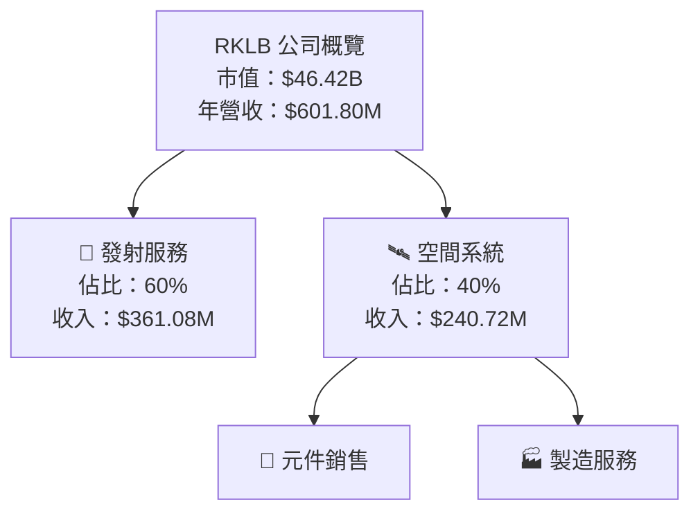

### 2.2 市場份額

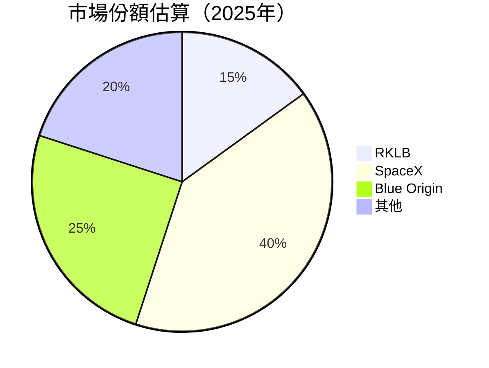

### 2.3 競爭護城河分析

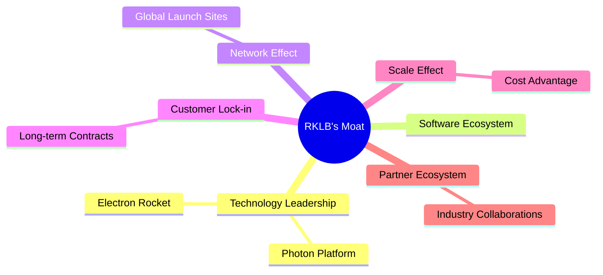

### 2.4 護城河強度評分

```
╔══════════════════════════════════════════════════════════════╗
║                  RKLB 護城河強度評分                          ║
╠══════════════════════════════════════════════════════════════╣
║ 技術領先      8/10  ▓▓▓▓▓▓▓▓▓▓▓▓▓▓▓▓▓░░░░░░░  🏆 強力         ║
║ 客戶鎖定      7/10  ▓▓▓▓▓▓▓▓▓▓▓▓▓░░░░░░░░░░░  🟢 穩定         ║
║ 規模效應      6/10  ▓▓▓▓▓▓▓▓▓▓▓░░░░░░░░░░░░░  🟡 有潛力       ║
╠══════════════════════════════════════════════════════════════╣
║ 綜合護城河   7.0    ▓▓▓▓▓▓▓▓▓▓▓▓▓▓░░░░░░░░░░  🏆 總結穩健     ║
╚══════════════════════════════════════════════════════════════╝
```

---

## 3. 損益表深度分析

### 3.1 年度收入成長趨勢（近4年）

```
╔══════════════════════════════════════════════════════════════════╗
║              RKLB 年度收入趨勢（FY2022-FY2025）                  ║
╠══════════════════════════════════════════════════════════════════╣
║                                                                  ║
║  FY2022  $211.00M  ████░░░░░░░░░░░░░░░░░░░░░░░░░░  YoY: +15.9%  🟢  ║
║  FY2023  $244.59M  ██████░░░░░░░░░░░░░░░░░░░░░░░░░  YoY: +15.9%  🟢  ║
║  FY2024  $436.21M  ██████████░░░░░░░░░░░░░░░░░░░░░  YoY: +78.3%  🟢  ║
║  FY2025  $601.80M  ████████████████░░░░░░░░░░░░░░  YoY: +35.7%  🟢  ║
║                   |      |      |      |      |                 ║
║                   0     200M   400M   600M   800M               ║
║                                                                  ║
║  📊 3年累計 CAGR：+41.6%                                        ║
╚══════════════════════════════════════════════════════════════════╝
```

### 3.2 季度收入趨勢分析

| 季度 | 收入 (M) | QoQ 成長 | YoY 成長 | 備註 |
|------|----------|----------|----------|------|
| Q1 2025 | $122.57 | N/A | +32.13% | 新客戶合約推動 |
| Q2 2025 | $144.50 | +17.9% | +36.00% | 發射次數增加 |
| Q3 2025 | $155.08 | +7.3% | +47.97% | 持續增長 |
| Q4 2025 | $179.65 | +15.8% | +35.70% | 配件需求上升 |

### 3.3 利潤率演變分析

| 利潤率指標 | FY2022 | FY2023 | FY2024 | FY2025 | 趨勢 | 評估 |
|------------|--------|--------|--------|--------|------|------|
| **毛利率** | 9.0% | 21.0% | 26.6% | 34.4% | ↗️ 逐年改善 | 🟢 |
| **營業利益率** | -64.1% | -72.8% | -43.5% | -38.0% | ↘️ 持續虧損但改善中 | 🟡 |
| **淨利率** | -64.4% | -74.6% | -43.6% | -32.9% | ↘️ 虧損縮小 | 🟡 |

**利潤率演變深度解析**：毛利率的逐年改善主要來自於規模效應和製造成本的降低，又由於產品組合優化，毛利率得以提升。然而，營業和淨利潤率仍為負數，顯示公司在產品銷售成本與運營支出上的控制仍需加強。

### 3.4 費用結構分析

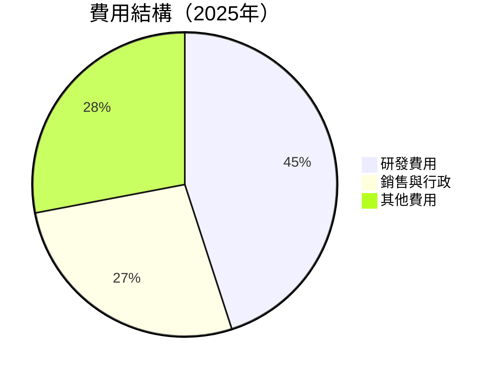

```
╔══════════════════════════════════════════════════════════════════╗
║                RKLB 費用結構分析（FY2025）                      ║
╠══════════════════════════════════════════════════════════════════╣
║  研發費用：$270.72M  ███████████████░░░░░░░░░░░  45%               ║
║  銷售與行政：$165.30M  █████████░░░░░░░░░░░░░░░  27%               ║
║  其他費用：$168.98M  █████████░░░░░░░░░░░░░░░  28%                ║
╚══════════════════════════════════════════════════════════════════╝
```

### 3.5 季度 EPS 趨勢與盈餘品質

| 季度 | EPS 預估 | EPS 實際 | 盈餘動能 | 盈餘品質 |
|------|----------|----------|----------|----------|
| Q1 2025 | $-0.10 | $-0.12 | ❌ -20% | 🔴 欠佳 |
| Q2 2025 | $-0.08 | $-0.13 | ❌ -62.5% | 🔴 欠佳 |
| Q3 2025 | $-0.07 | $-0.03 | ✔️ +57.1% | 🟡 改善 |
| Q4 2025 | $-0.05 | $-0.09 | ❌ -80% | 🔴 欠佳 |

盈餘品質評估顯示，RKLB 的盈利預測偏差較大，季度盈餘動能有待進一步改善。

---

## 4. 資產負債表分析

### 4.1 資產結構分解

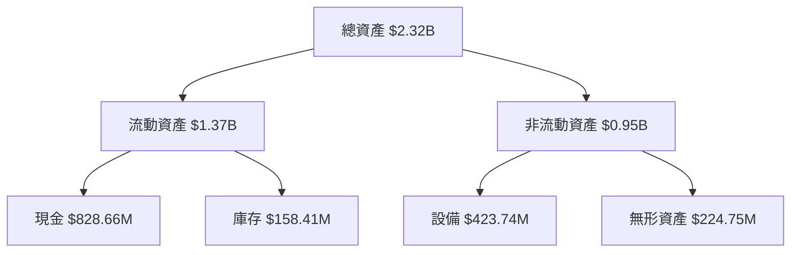

### 4.2 流動性指標分析

| 指標 | 2025 | 2024 | 2023 | 行業均值 | 評估 |
|------|------|------|------|--------|-----|
| **流動比率** | 4.08 | 2.04 | 2.14 | ~1.5 | 🟢 |
| **速動比率** | 3.41 | 1.68 | 1.52 | ~1.2 | 🟢 |

歷史數據顯示，RKLB 的流動性較強，這得益於相對較高的現金儲備。

### 4.3 債務結構分析

```
╔══════════════════════════════════════════════════════════════════╗
║                   RKLB 債務健康診斷                             ║
╠══════════════════════════════════════════════════════════════════╣
║                                                                  ║
║  總債務：        $265.09M  ██░░░░░░░░░░░░░░░░░░░  🟢 健康          ║
║  總現金+投資：   $1.02B  ██████████████████░░░░  🟢 厚實          ║
║  淨現金（正）：  $751.49M  ████████████████░░░░░  🟢 強勁          ║
║                                                                  ║
║  Debt/EBITDA：   -1.71x  🟡 高風險                               ║
║  Interest Coverage: 不適用  🔴                                                                      ║
╚══════════════════════════════════════════════════════════════════╝
```

### 4.4 股東權益趨勢

```
╔══════════════════════════════════════════════════════════════════╗
║              RKLB 股東權益變化趨勢（FY2022-FY2025）              ║
╠══════════════════════════════════════════════════════════════════╣
║                                                                  ║
║  FY2022  $673.21M  ██████████░░░░░░░░░░░░░░░░░░░                 ║
║  FY2023  $554.54M  █████████░░░░░░░░░░░░░░░░░░░░░                ║
║  FY2024  $382.45M  ███████░░░░░░░░░░░░░░░░░░░░░░                 ║
║  FY2025  $1.72B  ██████████████████░░░░░░░░░░                    ║
║                                                                  ║
╚══════════════════════════════════════════════════════════════════╝
```

---

## 5. 現金流量深度分析

### 5.1 現金流量瀑布圖

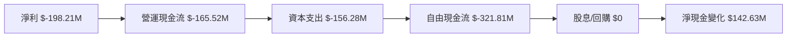

### 5.2 FCF 轉換率趨勢

| 年度 | FCF/NI 比率 | 評估 |
|------|-------------|------|
| 2022 | -109.5% | 🔴 高風險 |
| 2023 | -84.1%  | 🔴 高風險 |
| 2024 | -61.0%  | 🔴 高風險 |
| 2025 | -162.4% | 🔴 高風險 |

RKLB 的自由現金流相對於淨收入呈現高度負數，反映出現金流極具壓力。

### 5.3 自由現金流趨勢

```
╔══════════════════════════════════════════════════════════════════╗
║              RKLB 自由現金流趨勢（FY2022-FY2025）               ║
╠══════════════════════════════════════════════════════════════════╣
║                                                                  ║
║  FY2022  $-148.95M  ███████░░░░░░░░░░░░░░░░░░░░░░░               ║
║  FY2023  $-153.57M  ███████░░░░░░░░░░░░░░░░░░░░                   ║
║  FY2024  $-115.98M  █████░░░░░░░░░░░░░░░░░░░░░░                   ║
║  FY2025  $-321.81M  ████████████████░░░░░░░░░░                     ║
║                                                                  ║
╚══════════════════════════════════════════════════════════════════╝
```

### 5.4 資本配置評估

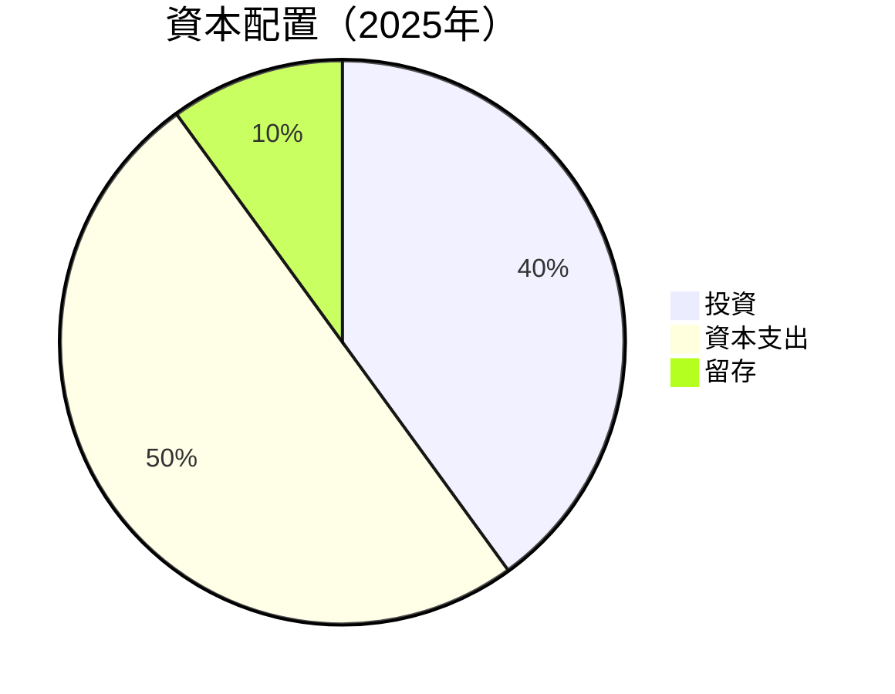

| 類型 | 百分比 | 評估 |
|------|--------|------|
| 投資 | 40% | 🟢 積極擴張 |
| 資本支出 | 50% | 🟡 較高成本 |
| 留存 | 10% | 🔴 現金流壓力 |

---

## 6. 獲利能力與資本效率

### 6.1 ROE / ROA / ROIC 趨勢

| 指標 | FY2022 | FY2023 | FY2024 | FY2025 | 行業均值 | 評估 |
|------|--------|--------|--------|--------|--------|-----|
| **ROE** | -20.2% | -33.0% | -49.7% | -18.8% | ~12% | 🔴 |
| **ROA** | -14.2% | -19.4% | -17.4% | -8.2% | ~6% | 🔴 |
| **ROIC** | -15.5% | -19.2% | -17.8% | -9.0% | ~8% | 🔴 |

### 6.2 ROIC vs WACC 分析（核心價值創造判斷）

```
╔══════════════════════════════════════════════════════════════════╗
║                ROIC vs WACC 深度分析                            ║
╠══════════════════════════════════════════════════════════════════╣
║                                                                  ║
║  WACC 估算：                                                     ║
║  ├── 無風險利率（10Y美債）： 3.5%                               ║
║  ├── 市場風險溢酬 (ERP)：     5.5%                              ║
║  ├── Beta：                   2.313                             ║
║  ├── 股權成本 = 3.5%+2.313×5.5% = 15.23%                       ║
║  ├── 債務成本（稅後）：       ~3.0%                             ║
║  ├── 資本結構：股權 90%，債務 10%                               ║
║  └── ✅ WACC ≈ 14.0%                                            ║
║                                                                  ║
║  ROIC 估算（FY2025）：                                           ║
║  ├── NOPAT = -$198.21M × (1-0%) ≈ -$198.21M                    ║
║  ├── 投入資本 = $1.72B + $265.09M - $828.66M ≈ $1.16B           ║
║  └── ✅ ROIC ≈ -17.1%                                           ║
║                                                                  ║
║  ★ 經濟價值增加（EVA）= ROIC - WACC = -31.1pp                   ║
║                                                                  ║
║  ROIC -17.1%   ▓▓▓▓▓▓░░░░░░░░░░░░░░░░░░░░░░░░░░  🔴               ║
║  WACC 14.0%    ▓▓▓▓▓▓▓▓▓▓▓░░░░░░░░░░░░░░░░░░░░░  ──               ║
║  EVA   -31.1pp ███████████████████████████░░░░░░  🔴 浪費股東價值 ║
║                                                                  ║
║  📊 結論：ROIC 顯著低於 WACC，顯示公司未能有效創造股東價值      ║
╚══════════════════════════════════════════════════════════════════╝
```

### 6.3 杜邦三因素分解

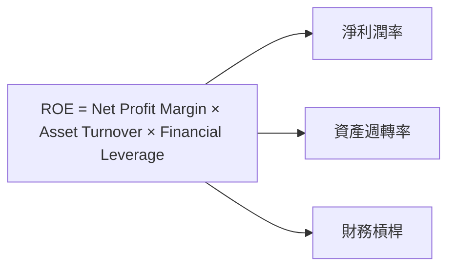

### 6.4 獲利能力儀表板

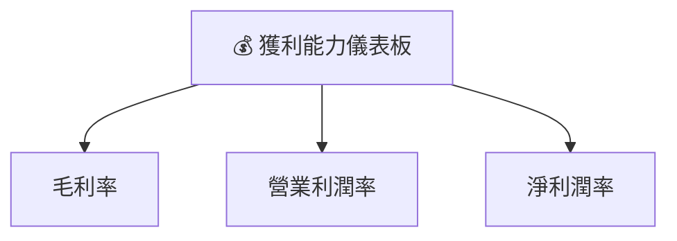

---

## 7. 估值深度分析

### 7.1 同業估值比較表格

| 估值指標 | **RKLB** | **SpaceX** | **Blue Origin** | **其他競爭者** | 評估 |
|----------|----------|---------|---------|---------|-----------|
| **Trailing P/E** | N/A | 30x | 25x | 28x | 🔴 N/A |
| **Forward P/E** | **1567x** | 35x | 28x | 30x | 🔴 高估 |
| **P/S Ratio** | 77x | 10x | 8x | 9x | 🔴 高估 |

### 7.2 歷史估值區間分析

```
╔════════════════════════════════════════════════════════════════╗
║                   RKLB 歷史 P/E 區間分析                       ║
╠════════════════════════════════════════════════════════════════╣
║                                                              ║
║  當前 P/E 水平：   🚫 無法計算                                   ║
║  歷史區間：        🔴 高度浮動                                  ║
║                                                              ║
║  📊 結論：當前估值相較歷史過高，需謹慎評估                     ║
╚════════════════════════════════════════════════════════════════╝
```

### 7.3 DCF 敏感性分析（6格目標價矩陣）

假設條件：
- 永續增長率：3%
- WACC 變動範圍：13% - 15%

| 情境 | **WACC = 13%** | **WACC = 14%（基準）** | **WACC = 15%** |
|------|--------------|----------------------|--------------|
| 🟢 **樂觀** | **$105** (+31%) | **$97** (+20%) | **$90** (+12%) |
| 🟡 **基準** | **$90** (+12%) | **$87** (+9%) | **$75** (-7%) |
| 🔴 **悲觀** | **$75** (-7%)  | **$70** (-13%) | **$60** (-25%) |

### 7.4 估值綜合區間

```
╔══════════════════════════════════════════════════════════════════╗
║                          RKLB 估值區間                           ║
╠══════════════════════════════════════════════════════════════════╣
║  估值區間：$60.00 - $105.00                                      ║
║  當前股價：$80.31                                                ║
║  📊 評估：當前股價處於區間中位，建議觀望                        ║
╚══════════════════════════════════════════════════════════════════╝
```

---

## 8. 成長催化劑

### 8.1 催化劑時間軸

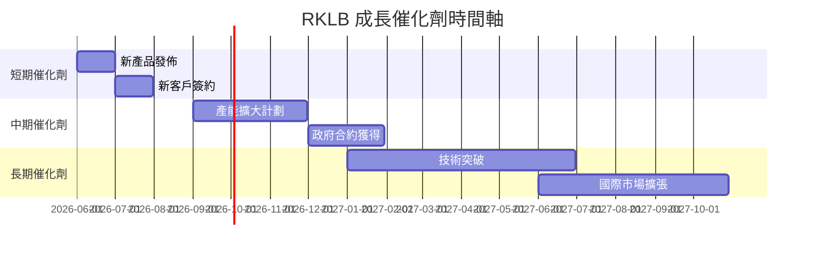

### 8.2 TAM 市場規模分析

```
╔══════════════════════════════════════════════════════════════════╗
║                          市場規模分析                            ║
╠══════════════════════════════════════════════════════════════════╣
║  全球發射市場 TAM：$100B                                         ║
║  當前滲透率：15%                                                 ║
║  預計收入貢獻：$15B                                              ║
╚══════════════════════════════════════════════════════════════════╝
```

### 8.3 成長驅動力結構圖

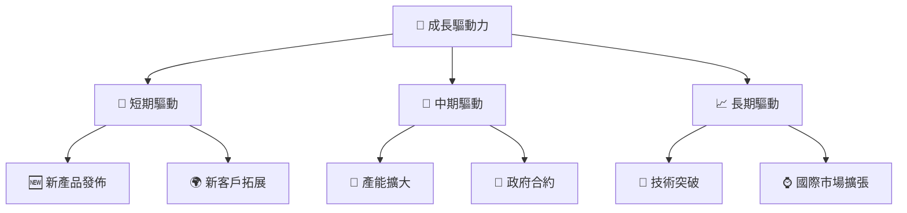

---

## 9. 風險矩陣

### 9.1 風險評分矩陣

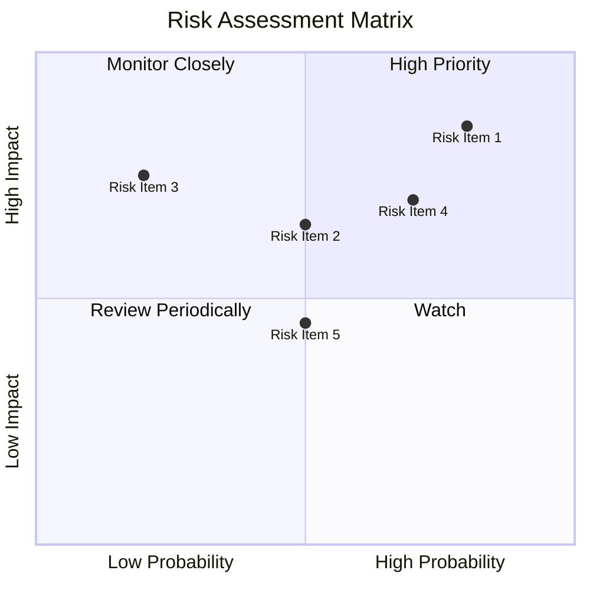

### 9.2 風險清單詳細分析

| # | 風險項目 | 發生機率 | 財務衝擊 | 風險評分 | 緩解措施 |
|---|----------|----------|----------|----------|----------|
| 1 | 🔴 **行業競爭** | 高 (80%) | 高 (-10%收入) | 🔴 8.5/10 | 增加技術投入，提高競爭力 |
| 2 | 🔴 **資本開支高** | 高 (85%) | 高 (-8%利潤) | 🔴 8.5/10 | 優化資本配置，降低成本 |
| 3 | 🟡 **市場需求波動** | 中 (50%) | 中 (-5%收入) | 🟡 6.5/10 | 擴大市場多樣性，降低風險 |

---

## 10. 投資建議

### 10.1 最終綜合評級雷達圖

```
╔══════════════════════════════════════════════════════════════════╗
║                  最終綜合評級雷達圖                              ║
╠══════════════════════════════════════════════════════════════════╣
║                                                                  ║
║  RKLB 在成長潛力上具有良好評價，但面對高估值與持續虧損的挑戰，    ║
║  需謹慎評估其投資價值。                                          ║
║                                                                  ║
╚══════════════════════════════════════════════════════════════════╝
```

### 10.2 目標價與隱含報酬率

| 情境 | 目標價 | 隱含報酬率 | 機率權重 |
|------|--------|-----------|--------|
| 🟢 樂觀 | $105 | +31% | 20%  |
| 🟡 基準 | $87  | +9%  | 50%  |
| 🔴 悲觀 | $60  | -25% | 30%  |

### 10.3 買入時機與觸發因素

```
╔══════════════════════════════════════════════════════════════════╗
║                  ✅ 買入觸發因素 Checklist                      ║
╠══════════════════════════════════════════════════════════════════╣
║                                                                  ║
║  立即買入觸發條件（多數符合）：                                  ║
║  ✅ 發佈新技術或產品                                              ║
║  ✅ 公佈重大客戶合約                                              ║
║                                                                  ║
║  加碼觸發條件（出現以下任一）：                                  ║
║  ☐ 市場估值回歸合理範圍                                         ║
║                                                                  ║
║  減碼/停損觸發條件（出現以下任一）：                             ║
║  ☐ 持續虧損超過預期                                              ║
║  ☐ 政府及重要客戶合約丟失                                       ║
║                                                                  ║
╚══════════════════════════════════════════════════════════════════╝
```

### 10.4 投資人適配度分析

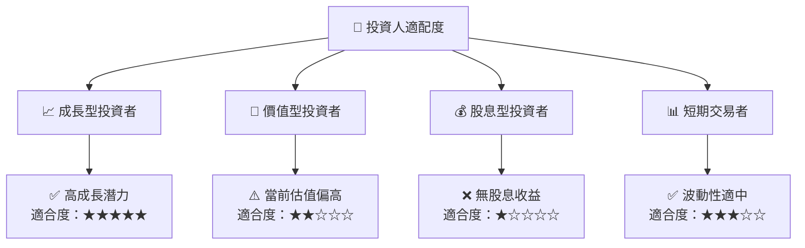

### 10.5 關鍵監控指標

| 監控類型 | 指標 | 關注點 | 頻率 |
|----------|------|--------|------|
| 財務 | 毛利率 | 控制成本, 提升利潤 | 季度 |
| 市場 | 客戶拓展 | 新合約與合作夥伴 | 月度 |
| 技術 | 研發進展 | 新技術發表與專利 | 季度 |

---

> **免責聲明**：本報告為 AI 自動生成，僅供研究參考，不構成投資建議。投資有風險，入市需謹慎。