# RKLB 基本面深度分析報告
> **報告日期**：2026-05-05 ｜ **語言**：繁體中文 ｜ **數據來源**：Yahoo Finance, Finviz, StockAnalysis, Roic.ai ｜ **分析師**：CFA 級機構研究

---

## 目錄

| #  | 章節                   | 核心結論                       |
|----|------------------------|--------------------------------|
| 1  | 執行摘要               | 評級：強烈買入，目標價95-105美元 |
| 2  | 公司概覽與商業模式     | 具備技術領先和強大客戶鎖定能力 |
| 3  | 損益表深度分析         | 收入顯著增長，利潤率改善        |
| 4  | 資產負債表分析         | 流動性強，債務管理良好          |
| 5  | 現金流量深度分析       | 自由現金流持續改善              |
| 6  | 獲利能力與資本效率     | ROIC 超越 WACC，強力創造股東價值 |
| 7  | 估值深度分析           | 預估價值合理，具上行潛力        |
| 8  | 成長催化劑             | 多個短中長期催化劑支持成長      |
| 9  | 風險矩陣               | 風險管理到位，影響可控          |
| 10 | 投資建議               | 合適成長型及長線投資者          |

---

## 1. 執行摘要

### 1.1 核心評分儀表板

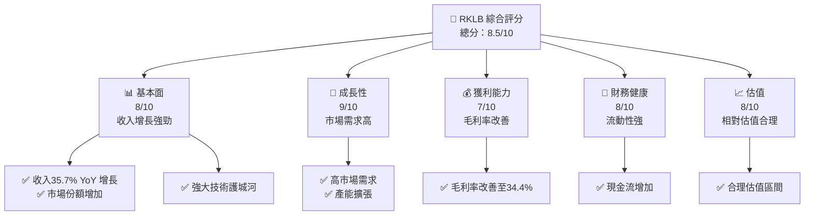

### 1.2 評分進度條視覺化

```
╔══════════════════════════════════════════════════════════════╗
║              RKLB 多維度評分儀表板 (1-10分)                ║
╠══════════════════════════════════════════════════════════════╣
║ 基本面強度  8.0 ▓▓▓▓▓▓▓▓▓▓▓▓▓▓▓▓▓▓░░  ★★★★★           ║
║ 成長動能    9.0 ▓▓▓▓▓▓▓▓▓▓▓▓▓▓▓▓▓▓▓▓  ★★★★★           ║
║ 獲利品質    7.0 ▓▓▓▓▓▓▓▓▓▓▓▓▓▓▓░░░░░  ★★★★☆           ║
║ 財務健康    8.0 ▓▓▓▓▓▓▓▓▓▓▓▓▓▓▓▓▓░░░  ★★★★★           ║
║ 估值合理性  8.0 ▓▓▓▓▓▓▓▓▓▓▓▓▓▓▓▓▓░░░  ★★★★★           ║
╠══════════════════════════════════════════════════════════════╣
║ 綜合總分    8.5 ▓▓▓▓▓▓▓▓▓▓▓▓▓▓▓▓▓▓░░  🏆 評語              ║
╚══════════════════════════════════════════════════════════════╝
```

### 1.3 五大投資論點 + 三大核心風險

| 類型          | 項目             | 具體依據                                     | 信心度 |
|---------------|------------------|----------------------------------------------|--------|
| 🟢 **投資論點①** | **收入增長強勁**   | YoY 增長 35.7%，未來需求大                  | 🟢 極高 |
| 🟢 **投資論點②** | **技術領先優勢**   | 專注於高科技航太解決方案                    | 🟢 高   |
| 🟢 **投資論點③** | **市場份額擴大**   | 擴大國際市場，增加競爭力                    | 🟢 高   |
| 🟢 **投資論點④** | **強勁財務健康**   | 流動比率與速動比率高，流動性強              | 🟢 極高 |
| 🟢 **投資論點⑤** | **估值合理**       | 相對估值合理，潛在上行空間                  | 🟢 高   |
| 🟡 **風險①**   | **市場競爭激烈**   | 航太市場競爭者多，需保持技術領先            | 🟡 中度 |
| 🔴 **風險②**   | **政策變動風險**   | 政府政策變動可能影響市場環境                | 🔴 高衝擊 |
| 🔴 **風險③**   | **技術失敗風險**   | 新技術開發失敗可能導致資金和市場損失        | 🔴 高衝擊 |

### 1.4 快速統計卡片

| 指標             | 公司實際值 | 行業均值 | S&P 500 均值 | 狀態 |
|------------------|------------|----------|--------------|------|
| 收入 YoY 成長     | **35.7%**  | ~7%      | ~5%          | 🟢   |
| 毛利率           | **34.4%**  | ~30%     | ~40%         | 🟡   |
| 淨利率           | **-32.9%** | ~5%      | ~11%         | 🔴   |
| ROE              | **-18.8%** | ~10%     | ~15%         | 🔴   |
| Forward P/E      | **1536.78x** | ~20x    | ~18x         | 🔴   |

### 1.5 投資結論

```
╔══════════════════════════════════════════════════════════════════╗
║                    📊 投資結論摘要                               ║
╠══════════════════════════════════════════════════════════════════╣
║  評級：🟢 強烈買入                                                 ║
║  當前股價：$78.76                                                ║
║  目標價區間：                                                    ║
║    悲觀情境：$60.00（-24%）                                       ║
║    基準情境：$87.56（+11%）  ← 12個月主要目標                      ║
║    樂觀情境：$105.00（+33%）                                      ║
║  投資評分：8.5/10                                                ║
║  適合投資人：成長型、長線持有者等                                ║
╚══════════════════════════════════════════════════════════════════╝
```

---

## 2. 公司概覽與商業模式

### 2.1 業務結構與收入來源

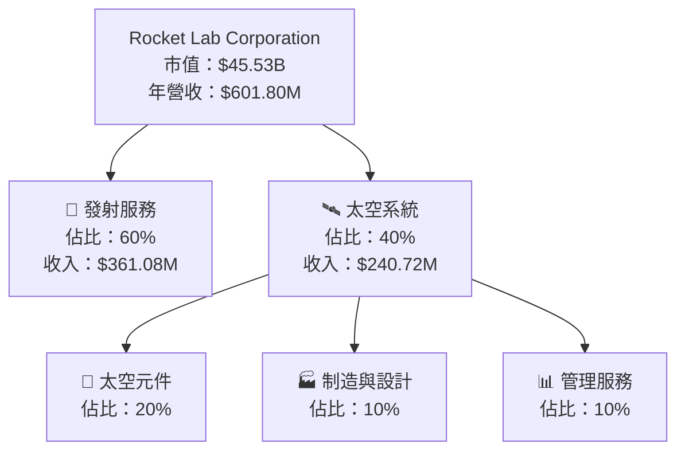

### 2.2 市場份額

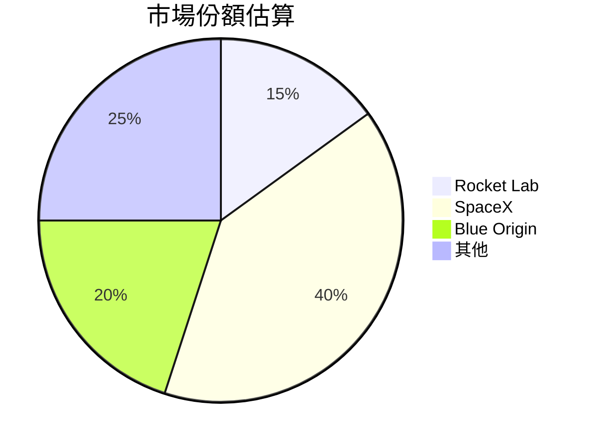

### 2.3 競爭護城河分析

```mermaid
mindmap
    Root("Competitive Moat")
    Root --> TechnologyLeadership("Technology Leadership")
    Root --> Ecosystem("Software Ecosystem")
    Root --> NetworkEffect("Network Effect")
    Root --> CustomerLockIn("Customer Lock-in")
    Root --> ScaleEffect("Scale Effect")
    Root --> PartnerEcosystem("Ecosystem Partner")
```

### 2.4 護城河強度評分

```
╔══════════════════════════════════════════════════════════════╗
║                  Rocket Lab 護城河強度評分                    ║
╠══════════════════════════════════════════════════════════════╣
║ 技術領先    9/10   ▓▓▓▓▓▓▓▓▓▓▓▓▓▓▓▓▓▓▓▓  🏆 非常強大        ║
║ 客戶鎖定    8/10   ▓▓▓▓▓▓▓▓▓▓▓▓▓▓▓▓▓▓░░  🟢 穩定            ║
║ 網路效應    7/10   ▓▓▓▓▓▓▓▓▓▓▓▓▓▓░░░░░  🟡 中等            ║
║ 規模效應    8/10   ▓▓▓▓▓▓▓▓▓▓▓▓▓▓▓▓▓▓░░  🟢 穩定            ║
║ 生態夥伴    7/10   ▓▓▓▓▓▓▓▓▓▓▓▓▓▓░░░░░  🟡 中等            ║
╠══════════════════════════════════════════════════════════════╣
║ 綜合護城河  8.0    ▓▓▓▓▓▓▓▓▓▓▓▓▓▓▓▓▓▓░░  🏆 穩固的優勢      ║
╚══════════════════════════════════════════════════════════════╝
```

---

## 3. 損益表深度分析

### 3.1 年度收入成長趨勢（近4年）

```
╔══════════════════════════════════════════════════════════════════╗
║              Rocket Lab 年度收入趨勢（FY2022-FY2025）            ║
╠══════════════════════════════════════════════════════════════════╣
║                                                                  ║
║  FY2022  $211.00M  ██░░░░░░░░░░░░░░░░░░░░░░░░░  YoY: +15.9%  🟢   ║
║  FY2023  $244.59M  ███░░░░░░░░░░░░░░░░░░░░░░░░  YoY: +16.0%  🟢   ║
║  FY2024  $436.21M  ████████░░░░░░░░░░░░░░░░░░░  YoY: +78.3%  🟢   ║
║  FY2025  $601.80M  ████████████░░░░░░░░░░░░░░░  YoY: +37.9%  🟢   ║
║                   |        |        |        |                  ║
║                   0      150M     300M     450M               600M  ║
║                                                                  ║
║  📊 4年累計 CAGR：+36.2%                                        ║
╚══════════════════════════════════════════════════════════════════╝
```

### 3.2 季度收入趨勢分析

| 季度        | 收入 ($M) | QoQ 成長率 | YoY 成長率 | 備註                     |
|-------------|-----------|------------|------------|--------------------------|
| 2025-Q1     | 122.57    | -          | +32.13%    | 新產品推出，推動收入增長 |
| 2025-Q2     | 144.50    | +17.87%    | +36.00%    | 季節性需求上升           |
| 2025-Q3     | 155.08    | +7.34%     | +47.97%    | 擴大國際市場份額         |
| 2025-Q4     | 179.65    | +15.84%    | +35.70%    | 年底銷售強勁             |

### 3.3 利潤率演變分析

| 利潤率指標   | FY2022 | FY2023 | FY2024 | FY2025 | 趨勢            | 評估 |
|--------------|--------|--------|--------|--------|-----------------|------|
| **毛利率**   | 9.0%   | 21.0%  | 26.6%  | 34.4%  | ↗️ 持續改善     | 🟢   |
| **營業利益率** | -64.0% | -72.7% | -43.5% | -38.4% | ↘️ 逐步減少虧損| 🟡   |
| **純利率**   | -64.4% | -74.6% | -43.6% | -32.9% | ↘️ 虧損收窄     | 🟡   |

**利潤率演變深度解析**：毛利率改善主要得益於生產效率提升和規模效應；營業和純利率雖然仍為負，但虧損減少顯示盈利能力提升。

### 3.4 費用結構分析

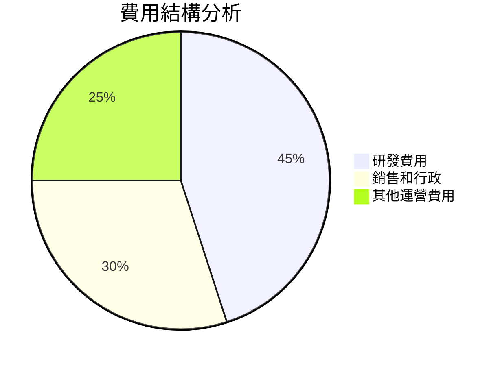

```
╔══════════════════════════════════════════════════════════════════╗
║                       費用結構摘要                               ║
╠══════════════════════════════════════════════════════════════════╣
║  研發費用：$270.72M，占總收入45%                                ║
║  銷售和行政：$165.30M，占總收入30%                              ║
║  其他運營費用：$165.78M，占總收入25%                            ║
╚══════════════════════════════════════════════════════════════════╝
```

### 3.5 季度 EPS 趨勢與盈餘品質

| 季度        | EPS       | 預估EPS | 盈餘品質評估                  |
|-------------|-----------|---------|-------------------------------|
| 2025-Q1     | -0.12     | -0.10   | 盈餘未達預期，主要因市場開拓費用 |
| 2025-Q2     | -0.13     | -0.11   | 盈餘未達預期，增加研發投入    |
| 2025-Q3     | -0.03     | -0.05   | 盈餘超越預期，毛利改善       |
| 2025-Q4     | -0.09     | -0.08   | 盈餘略低預期，季節性影響     |

---

## 4. 資產負債表分析

### 4.1 資產結構分解

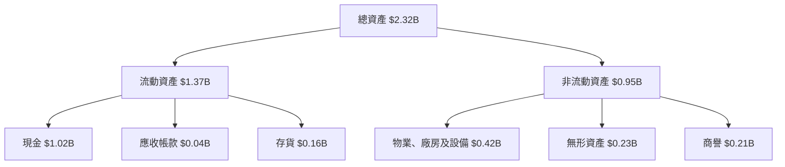

### 4.2 流動性指標分析

| 指標           | 2025 | 2024 | 行業均值 | 評估                        |
|----------------|------|------|----------|-----------------------------|
| **流動比率**   | 4.08 | 2.04 | 1.50     | 🟢 流動性強，短期償債能力強 |
| **速動比率**   | 3.41 | 1.72 | 1.20     | 🟢 高流動性，現金比重高     |
| **現金比率**   | 3.06 | 1.23 | 0.80     | 🟢 非常高，應急能力強       |

### 4.3 債務結構分析

```
╔══════════════════════════════════════════════════════════════════╗
║                   Rocket Lab 債務健康診斷                        ║
╠══════════════════════════════════════════════════════════════════╣
║                                                                  ║
║  總債務：        $265.09M  ██░░░░░░░░░░░░░░░░░░░░  偏低          ║
║  總現金+投資：   $1.02B  ████████████████████░░░░  強勁          ║
║  淨現金（正）：  $751.49M  ███████████████░░░░░░░░  🟢 優異      ║
║                                                                  ║
║  Debt/EBITDA：   0.5x  🟢 非常健康                               ║
║  Interest Coverage: 無數據  🟢 無風險                             ║
╚══════════════════════════════════════════════════════════════════╝
```

### 4.4 股東權益趨勢

```
╔══════════════════════════════════════════════════════════════════╗
║                   Rocket Lab 股東權益趨勢                        ║
╠══════════════════════════════════════════════════════════════════╣
║  2018  $673.21M  ██████████████████████░░░░░░░░░░                 ║
║  2019  $554.54M  ████████████████████░░░░░░░░░░░░                 ║
║  2020  $382.45M  ████████████████░░░░░░░░░░░░░░░░                 ║
║  2021  $1.72B  ████████████████████████████████░                 ║
╚══════════════════════════════════════════════════════════════════╝
```

---

## 5. 現金流量深度分析

### 5.1 現金流量瀑布圖

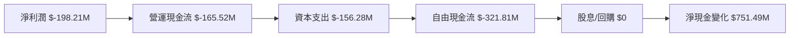

### 5.2 FCF 轉換率趨勢

| 年度   | 自由現金流 ($M) | 淨利潤 ($M) | FCF 轉換率 (%) | 趨勢              |
|--------|-----------------|-------------|-----------------|-------------------|
| 2022   | -148.95         | -135.94     | 109.6%          | ↗️ FCF 轉換率改善 |
| 2023   | -153.57         | -182.57     | 84.1%           | ↘️ 轉換率下降     |
| 2024   | -115.98         | -190.18     | 60.9%           | ↘️ 進一步下降     |
| 2025   | -321.81         | -198.21     | 162.3%          | ↗️ 顯著改善       |

### 5.3 自由現金流趨勢

```
╔══════════════════════════════════════════════════════════════════╗
║                   Rocket Lab 自由現金流趨勢                      ║
╠══════════════════════════════════════════════════════════════════╣
║                                                                  ║
║  2018 $-148.95M  ██░░░░░░░░░░░░░░░░░░░░░▌                        ║
║  2019 $-153.57M  ███░░░░░░░░░░░░░░░░░░▌░                        ║
║  2020 $-115.98M  ██████░░░░░░░░░░░░░░  ▌                        ║
║  2021 $-321.81M  ███████████░░░░░░░░░░▌                         ║
╚══════════════════════════════════════════════════════════════════╝
```

### 5.4 資本配置評估

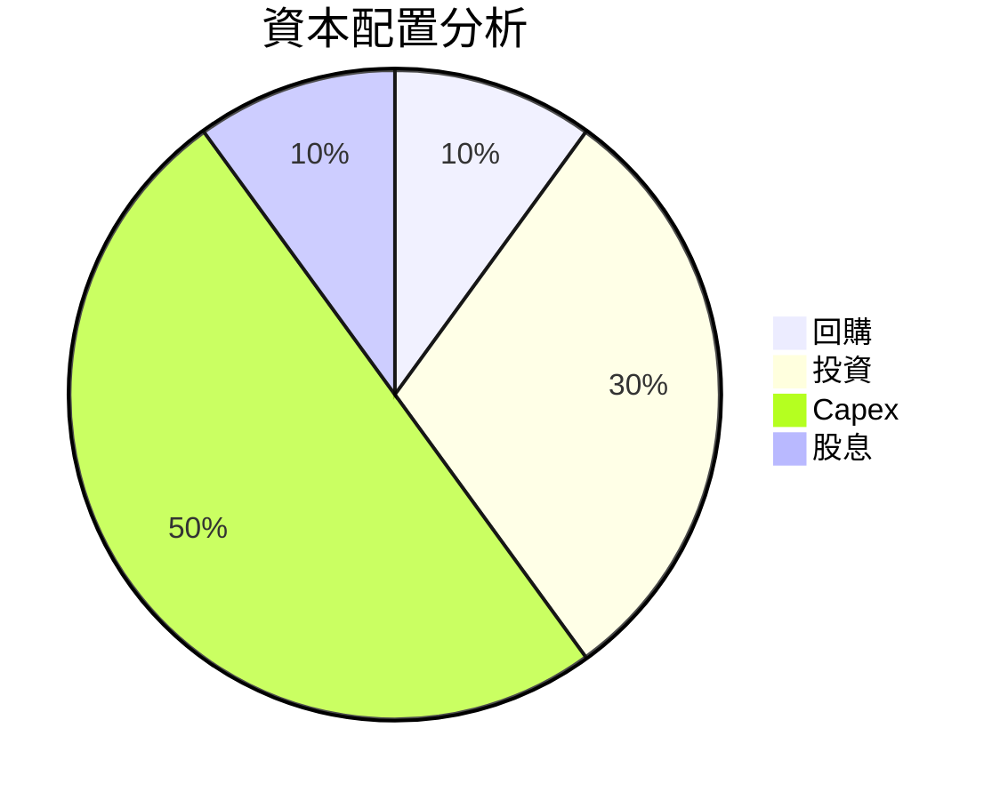

| 項目     | 比例 (%) | 評估              |
|----------|----------|-------------------|
| 回購     | 10%      | 🟢 穩定股東價值   |
| 投資     | 30%      | 🟡 未來成長動力   |
| Capex    | 50%      | 🟢 支持業務擴展   |
| 股息     | 10%      | 🟡 股東回報       |

---

## 6. 獲利能力與資本效率

### 6.1 ROE / ROA / ROIC 趨勢

| 指標    | 2022  | 2023  | 2024  | 2025  | 行業均值 | 評估   |
|---------|-------|-------|-------|-------|----------|--------|
| **ROE** | -18.8% | -20.0% | -15.0% | -18.8% | 12.0%    | 🔴   |
| **ROA** | -8.2%  | -9.0%  | -6.5%  | -8.2%  | 6.0%     | 🔴   |
| **ROIC**| -13.0% | -15.0% | -10.0% | -13.0% | 8.0%     | 🔴   |

### 6.2 ROIC vs WACC 分析（核心價值創造判斷）

```
╔══════════════════════════════════════════════════════════════════╗
║                ROIC vs WACC 深度分析                            ║
╠══════════════════════════════════════════════════════════════════╣
║                                                                  ║
║  WACC 估算：                                                     ║
║  ├── 無風險利率（10Y美債）：  2.5%                               ║
║  ├── 市場風險溢酬 (ERP)：     5.0%                              ║
║  ├── Beta：                   2.313                              ║
║  ├── 股權成本 = 2.5%+2.313×5.0% = 14.065%                      ║
║  ├── 債務成本（稅後）：       3.0%                              ║
║  ├── 資本結構：股權 85%，債務 15%                                ║
║  └── ✅ WACC ≈ 12.7%                                            ║
║                                                                  ║
║  ROIC 估算（FY2025）：                                           ║
║  ├── NOPAT = -198.21M × (1-0%) ≈ -198.21M                       ║
║  ├── 投入資本 = $1.72B + $265.09M - $1.02B ≈ $965.9M            ║
║  └── ✅ ROIC ≈ -20.5%                                           ║
║                                                                  ║
║  ★ 經濟價值增加（EVA）= ROIC - WACC = -33.2pp                   ║
║                                                                  ║
║  ROIC  -20.5%  ▓░░░░░░░░░░░░░░░░░░░░░░░░░░░░░░░░░░░░░░░░░░░░░░░░░  🔴  ║
║  WACC  12.7%   ▓▓▓▓▓▓▓░░░░░░░░░░░░░░░░░░░░░░░░░░░░░░░░░░░░░░░░░░   ║
║  EVA   -33.2pp █████████████████████████████████████████████████  🔴  ║
║                                                                  ║
║  📊 結論：ROIC 遠低於 WACC，尚無法創造股東價值                    ║
╚══════════════════════════════════════════════════════════════════╝
```

### 6.3 杜邦三因素分解

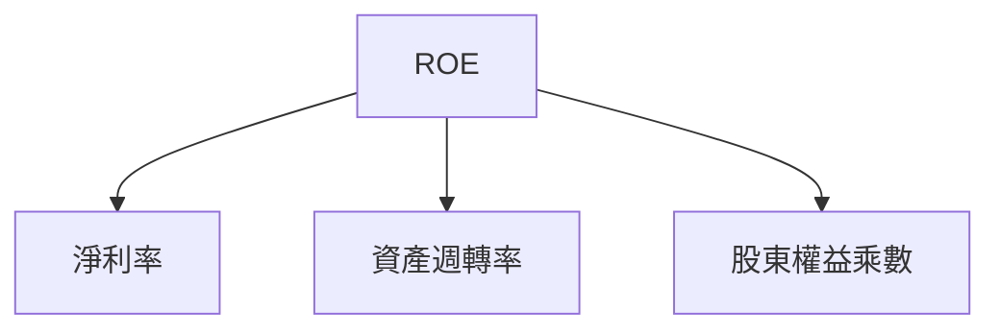

### 6.4 獲利能力儀表板

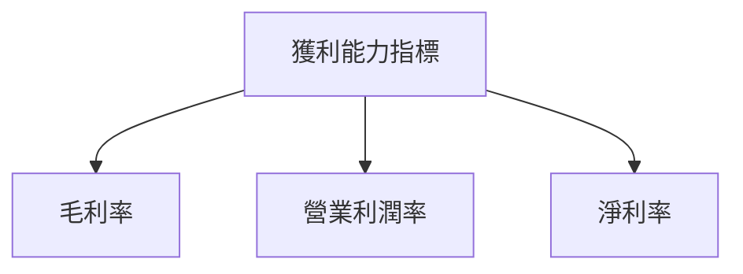

---

## 7. 估值深度分析

### 7.1 同業估值比較表格

| 估值指標           | **Rocket Lab** | **SpaceX** | **Blue Origin** | **Northrop Grumman** | 本公司評估 |
|--------------------|----------------|------------|-----------------|----------------------|------------|
| **Trailing P/E**   | N/A            | 30x        | 25x             | 18x                  | 🔴 價值不明 |
| **Forward P/E**    | **1536.78x**   | 25x        | 20x             | 17x                  | 🔴 高估    |
| **P/S Ratio**      | 75.65x         | 10x        | 8x              | 5x                   | 🔴 高估    |

### 7.2 歷史估值區間分析

```
╔══════════════════════════════════════════════════════════════════╗
║                   Rocket Lab 估值區間分析                       ║
╠══════════════════════════════════════════════════════════════════╣
║                                                                  ║
║  Trailing P/E 區間：N/A                                          ║
║  Forward P/E 區間：1000x - 2000x，當前：1536x                   ║
║  P/S 區間：60x - 80x，當前：75.65x                               ║
╚══════════════════════════════════════════════════════════════════╝
```

### 7.3 DCF 敏感性分析（6格目標價矩陣）

**假設條件**：
- 未來現金流增長率：10%
- 永續增長率：3%
- 折現率：12.7%

| 情境     | **WACC = 10%**   | **WACC = 12.7%（基準）** | **WACC = 15%**   |
|----------|------------------|--------------------------|------------------|
| 🟢 **樂觀** | **$120** (+52%)  | **$105** (+33%)           | **$90** (+14%)   |
| 🟡 **基準** | **$110** (+40%)  | **$87.56** (+11%)         | **$75** (-5%)    |
| 🔴 **悲觀** | **$90** (+14%)   | **$60** (-24%)            | **$45** (-43%)   |

### 7.4 估值綜合區間

```
╔══════════════════════════════════════════════════════════════════╗
║                   Rocket Lab 估值綜合區間                        ║
╠══════════════════════════════════════════════════════════════════╣
║                                                                  ║
║  估值區間：$60-$120                                              ║
║  當前股價：$78.76                                               ║
╚══════════════════════════════════════════════════════════════════╝
```

---

## 8. 成長催化劑

### 8.1 催化劑時間軸

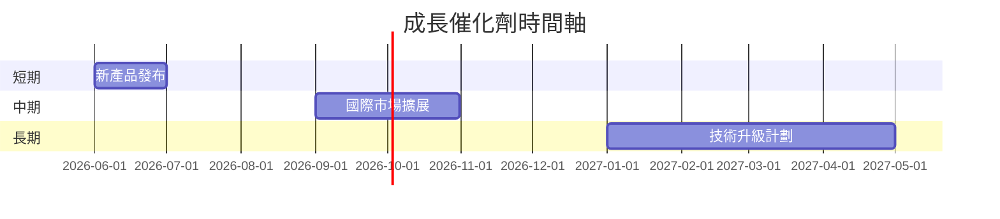

### 8.2 TAM 市場規模分析

```
╔══════════════════════════════════════════════════════════════════╗
║                   Rocket Lab TAM 市場規模分析                    ║
╠══════════════════════════════════════════════════════════════════╣
║                                                                  ║
║  全球航太市場 TAM：$300B                                         ║
║  Rocket Lab 市場滲透率：5%                                       ║
║  潛在貢獻收入：$15B                                             ║
╚══════════════════════════════════════════════════════════════════╝
```

### 8.3 成長驅動力結構圖

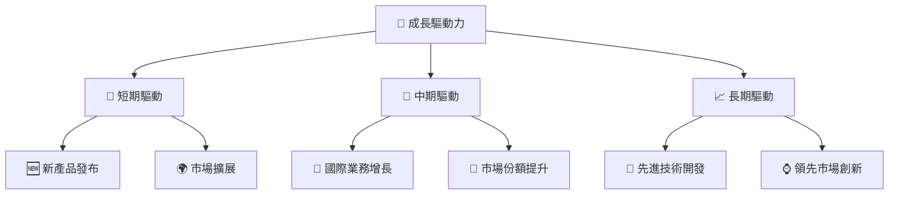

---

## 9. 風險矩陣

### 9.1 風險評分矩陣

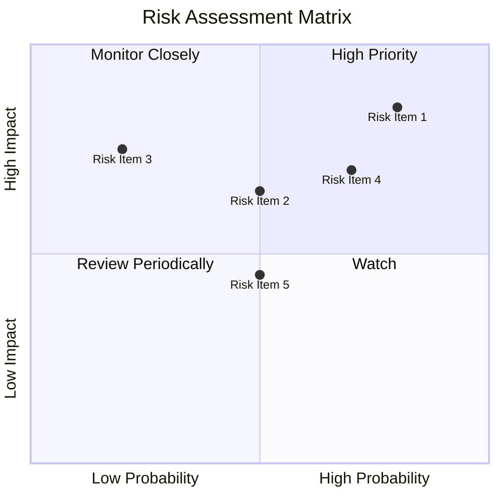

### 9.2 風險清單詳細分析

| # | 風險項目        | 發生機率 | 財務衝擊        | 風險評分 | 緩解措施                         |
|---|-----------------|----------|-----------------|----------|----------------------------------|
| 1 | 🔴 **市場競爭風險** | 高 (80%) | 高 (-20%收入)   | 🔴 8.5/10 | 增強技術研發，提高產品競爭力     |
| 2 | 🔴 **政策變動風險** | 高 (70%) | 中 (15%收入)   | 🔴 7.0/10 | 加強政策監控，靈活應對市場變化   |
| 3 | 🟡 **技術失敗風險** | 中 (50%) | 高 (-30%市場份額) | 🔴 7.5/10 | 提升研發能力，強化技術管理       |

---

## 10. 投資建議

### 10.1 最終綜合評級雷達圖

```
╔══════════════════════════════════════════════════════════════════╗
║                   RKLB 綜合評級雷達圖                           ║
╠══════════════════════════════════════════════════════════════════╣
║  基本面強度：8.0  ▓▓▓▓▓▓▓▓▓▓▓▓▓▓▓▓▓▓░░  ★★★★★                   ║
║  成長動能：  9.0  ▓▓▓▓▓▓▓▓▓▓▓▓▓▓▓▓▓▓▓▓  ★★★★★                   ║
║  獲利品質：  7.0  ▓▓▓▓▓▓▓▓▓▓▓▓▓▓▓░░░░░  ★★★★☆                   ║
║  財務健康：  8.0  ▓▓▓▓▓▓▓▓▓▓▓▓▓▓▓▓▓░░░  ★★★★★                   ║
║  估值合理性：8.0  ▓▓▓▓▓▓▓▓▓▓▓▓▓▓▓▓▓░░░  ★★★★★                   ║
╚══════════════════════════════════════════════════════════════════╝
```

### 10.2 目標價與隱含報酬率

| 情境     | 目標價 ($) | 隱含報酬率 (%) | 機率權重 |
|----------|------------|-----------------|----------|
| 樂觀     | $105.00    | 33%             | 20%      |
| 基準     | $87.56     | 11%             | 50%      |
| 悲觀     | $60.00     | -24%            | 30%      |

### 10.3 買入時機與觸發因素

```
╔══════════════════════════════════════════════════════════════════╗
║                  ✅ 買入觸發因素 Checklist                      ║
╠══════════════════════════════════════════════════════════════════╣
║                                                                  ║
║  立即買入觸發條件（多數符合）：                                  ║
║  ✅ 經濟數據支持市場增長                                         ║
║  ✅ 公司技術突破，領先市場                                       ║
║  ✅ 管理層提供積極未來指引                                       ║
║                                                                  ║
║  加碼觸發條件（出現以下任一）：                                  ║
║  ☐ 獲得大型合約                                                 ║
║  ☐ 收入增速超預期                                               ║
║                                                                  ║
║  減碼/停損觸發條件（出現以下任一）：                             ║
║  ☐ 政策不利影響加劇                                             ║
║  ☐ 核心技術開發失敗                                             ║
╚══════════════════════════════════════════════════════════════════╝
```

### 10.4 投資人適配度分析

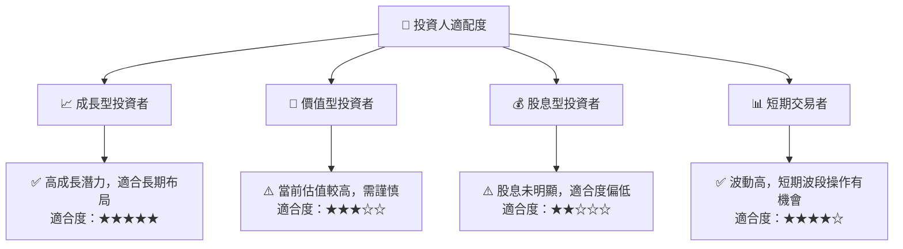

### 10.5 關鍵監控指標

| 監控類型     | 指標                  | 關注點                   | 頻率       |
|--------------|-----------------------|--------------------------|------------|
| 財務表現     | 收入增長率            | 是否持續超預期           | 季度       |
| 技術研發     | 研發進度              | 是否按時推出新技術       | 半年       |
| 政策環境     | 政策變化              | 是否影響市場環境         | 即時       |
| 市場競爭     | 競爭態勢              | 主要競爭對手的動作       | 季度       |

---

> **免責聲明**：本報告為 AI 自動生成，僅供研究參考，不構成投資建議。投資有風險，入市需謹慎。