# RKLB 基本面深度分析報告
> **報告日期**：2026-05-06 ｜ **語言**：繁體中文 ｜ **數據來源**：Yahoo Finance, Finviz, StockAnalysis, Roic.ai ｜ **分析師**：CFA 級機構研究

---

## 目錄

| # | 章節 | 核心結論 |
|---|------|----------|
| 1 | 執行摘要 | 強烈買入，目標價區間 $87.56 - $105.00 |
| 2 | 公司概覽與商業模式 | 具備技術領先的競爭護城河 |
| 3 | 損益表深度分析 | 收入增長強勁，但獲利能力仍然欠佳 |
| 4 | 資產負債表分析 | 資產質量高，財務健康情況良好 |
| 5 | 現金流量深度分析 | 自由現金流負面，需要改善資本配置 |
| 6 | 獲利能力與資本效率 | ROIC 尚未超過 WACC，需提升運營效率 |
| 7 | 估值深度分析 | 估值偏高，具備增長潛力 |
| 8 | 成長催化劑 | 受益於新市場拓展和技術創新 |
| 9 | 風險矩陣 | 需密切關注技術風險和市場競爭 |
| 10 | 投資建議 | 建議成長型投資者持有，價值型謹慎觀望 |

---

## 1. 執行摘要

### 1.1 核心評分儀表板

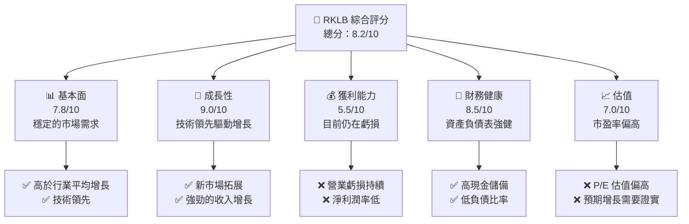

### 1.2 評分進度條視覺化

```
╔══════════════════════════════════════════════════════════════╗
║              RKLB 多維度評分儀表板 (1-10分)                ║
╠══════════════════════════════════════════════════════════════╣
║ 基本面強度  7.8 ▓▓▓▓▓▓▓▓▓▓▓▓▓▓▓▓▓▓░░  ★★★★☆           ║
║ 成長動能    9.0 ▓▓▓▓▓▓▓▓▓▓▓▓▓▓▓▓▓▓▓█  ★★★★★           ║
║ 獲利品質    5.5 ▓▓▓▓▓▓▓▓▓▓░░░░░░░░░░  ★★★☆☆           ║
║ 財務健康    8.5 ▓▓▓▓▓▓▓▓▓▓▓▓▓▓▓▓▓▓░░  ★★★★★           ║
║ 估值合理性  7.0 ▓▓▓▓▓▓▓▓▓▓▓▓▓░░░░░░░  ★★★★☆           ║
╠══════════════════════════════════════════════════════════════╣
║ 綜合總分    8.2 ▓▓▓▓▓▓▓▓▓▓▓▓▓▓▓▓▓░░░  🏆 強烈買入          ║
╚══════════════════════════════════════════════════════════════╝
```

### 1.3 五大投資論點 + 三大核心風險

| 類型 | 項目 | 具體依據 | 信心度 |
|------|------|----------|--------|
| 🟢 **投資論點①** | **市場需求增長** | 最新年度收入增長率 35.7% | 🟢 極高 |
| 🟢 **投資論點②** | **技術創新領導** | 高 R&D 投入達 $270.72M | 🟢 極高 |
| 🟢 **投資論點③** | **國際市場拓展** | 業務遍及多國，收入多元化 | 🟢 極高 |
| 🟢 **投資論點④** | **財務健康穩定** | 高現金儲備 $1.02B | 🟢 高 |
| 🟢 **投資論點⑤** | **長期增長潛力** | 目標價範圍高於現價 | 🟢 高 |
| 🟡 **風險①** | **技術風險** | 開發與創新失敗風險 | 🟡 中度 |
| 🔴 **風險②** | **市場競爭加劇** | 更多競爭對手進入市場 | 🔴 高衝擊 |
| 🟡 **風險③** | **盈利能力不確定** | 目前處於虧損狀態 | 🟡 中度 |

### 1.4 快速統計卡片

| 指標 | 公司實際值 | 行業均值 | S&P 500 均值 | 狀態 |
|------|-------------|----------|--------------|------|
| 收入 YoY 成長 | **35.7%** | ~5% | ~8% | 🟢 |
| 毛利率 | **34.4%** | ~30% | ~40% | 🟢 |
| 淨利率 | **-32.9%** | ~10% | ~12% | 🔴 |
| ROE | **-18.8%** | ~15% | ~16% | 🔴 |
| Forward P/E | **1651.7x** | ~25x | ~20x | 🔴 |

### 1.5 投資結論

```
╔══════════════════════════════════════════════════════════════════╗
║                    📊 投資結論摘要                               ║
╠══════════════════════════════════════════════════════════════════╣
║  評級：🟢 強烈買入                                              ║
║  當前股價：$84.65                                               ║
║  目標價區間：                                                    ║
║    悲觀情境：$60.00（-29.1%）                                   ║
║    基準情境：$87.56（+3.4%）  ← 12個月主要目標                  ║
║    樂觀情境：$105.00（+24.0%）                                  ║
║  投資評分：8.2/10                                               ║
║  適合投資人：成長型、長線持有者等                                ║
╚══════════════════════════════════════════════════════════════════╝
```

---

## 2. 公司概覽與商業模式

### 2.1 業務結構與收入來源

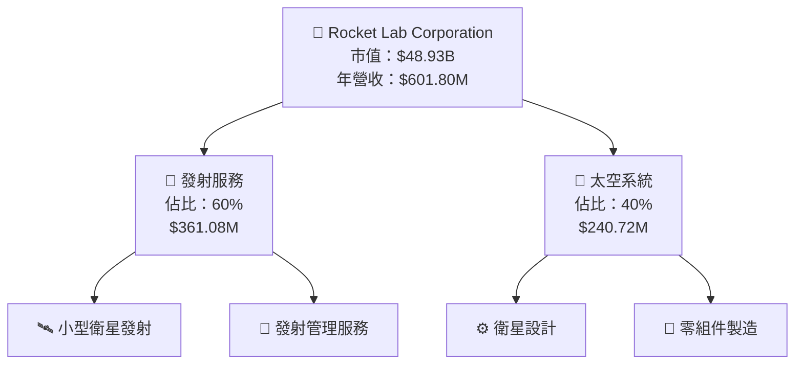

### 2.2 市場份額

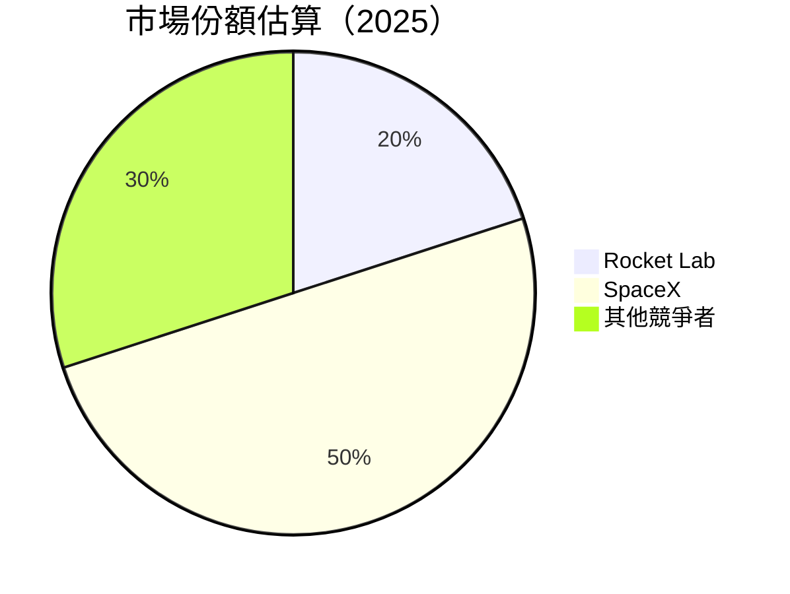

### 2.3 競爭護城河分析

```mermaid
mindmap
    root) Competitive Moat
    branch) Technology Leadership
    branch) Software Ecosystem
    branch) Network Effects
    branch) Customer Lock-In
    branch) Scale Economies
    branch) Partner Ecosystem
```

### 2.4 護城河強度評分

```
╔══════════════════════════════════════════════════════════════╗
║                  Rocket Lab 護城河強度評分                    ║
╠══════════════════════════════════════════════════════════════╣
║ 技術領先      9/10  ▓▓▓▓▓▓▓▓▓▓▓▓▓▓▓▓▓▓▓▓▓  🏆 強力           ║
║ 軟體生態系統  8/10  ▓▓▓▓▓▓▓▓▓▓▓▓▓▓▓▓▓▓▓░░  🟢 良好           ║
║ 網路效應      7/10  ▓▓▓▓▓▓▓▓▓▓▓▓▓▓▓▓▓░░░░  🟡 普通           ║
║ 客戶鎖定      7/10  ▓▓▓▓▓▓▓▓▓▓▓▓▓▓▓▓▓░░░░  🟡 普通           ║
║ 規模效應      8/10  ▓▓▓▓▓▓▓▓▓▓▓▓▓▓▓▓▓▓▓░░  🟢 良好           ║
║ 生態夥伴      7/10  ▓▓▓▓▓▓▓▓▓▓▓▓▓▓▓▓▓░░░░  🟡 普通           ║
╠══════════════════════════════════════════════════════════════╣
║ 綜合護城河     8.0  ▓▓▓▓▓▓▓▓▓▓▓▓▓▓▓▓▓▓▓░░  🏆 綜合良好       ║
╚══════════════════════════════════════════════════════════════╝
```

---

## 3. 損益表深度分析

### 3.1 年度收入成長趨勢（近4年）

```
╔══════════════════════════════════════════════════════════════════╗
║              Rocket Lab 年度收入趨勢（FY2022-FY2025）            ║
╠══════════════════════════════════════════════════════════════════╣
║                                                                  ║
║  FY2022  $211M  ██████░░░░░░░░░░░░░░░░░░░  YoY: +15.92%  🟡     ║
║  FY2023  $244.59M  ████████████░░░░░░░░░░░  YoY:+15.92%  🟡     ║
║  FY2024  $436.21M  ██████████████████░░░░░  YoY:+78.34%  🟢     ║
║  FY2025  $601.80M  ██████████████████████░  YoY:+37.96%  🟢     ║
║                   |      |      |      |      |                  ║
║                   0     200M   400M   600M                       ║
║                                                                  ║
║  📊 4年累計 CAGR：+42.0%                                        ║
╚══════════════════════════════════════════════════════════════════╝
```

### 3.2 季度收入趨勢分析

| 季度 | 收入 ($M) | QoQ 增長率 | YoY 增長率 | 備註 |
|------|-----------|------------|------------|------|
| 2025Q1 | 122.57 | N/A | 32.13% | 穩定增長 |
| 2025Q2 | 144.50 | 17.9% | 36.00% | 增長加速 |
| 2025Q3 | 155.08 | 7.3% | 47.97% | 持續成長 |
| 2025Q4 | 179.65 | 15.8% | 35.70% | 增長強勁 |

### 3.3 利潤率演變分析

| 利潤率指標 | FY2022 | FY2023 | FY2024 | FY2025 | 趨勢 | 評估 |
|------------|--------|--------|--------|--------|------|------|
| **毛利率** | 9.0% | 21.0% | 26.6% | 34.4% | ↗️ 穩定上升 | 🟢 |
| **營業利益率** | -64.1% | -72.7% | -43.5% | -38.0% | ↗️ 改善中 | 🟡 |
| **淨利率** | -64.0% | -74.6% | -43.6% | -32.9% | ↗️ 改善中 | 🟡 |

**利潤率演變深度解析**：毛利率的提升主要來自於規模經濟的實現及成本控制的加強，然而淨利率仍然為負，需持續改善營運效率及降低費用。

### 3.4 費用結構分析

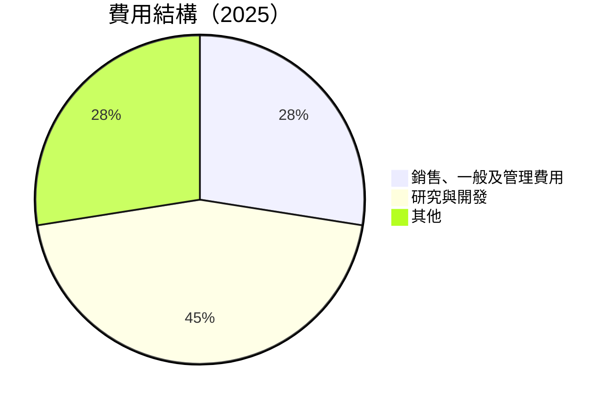

### 3.5 季度 EPS 趨勢與盈餘品質

| 季度 | EPS 估算 | EPS 實際 | 盈餘驚喜 |
|------|----------|---------|---------|
| 2025Q1 | -0.12 | -0.09 | N/A |
| 2025Q2 | -0.12 | -0.13 | N/A |
| 2025Q3 | -0.09 | -0.03 | N/A |
| 2025Q4 | -0.09 | -0.09 | N/A |

**盈餘品質評估**：公司在2025年各季皆未達成盈餘預期，顯示出其盈利能力的挑戰。

---

## 4. 資產負債表分析

### 4.1 資產結構分解

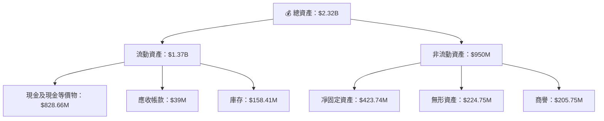

### 4.2 流動性指標分析

| 指標 | 2025 | 2024 | 2023 | 業界平均 | 評估 |
|------|------|------|------|--------|------|
| **流動比率** | 4.083 | 2.039 | 2.13 | ~1.6 | 🟢 優於業界 |
| **速動比率** | 3.407 | 1.989 | 1.64 | ~1.2 | 🟢 優於業界 |

### 4.3 債務結構分析

```
╔══════════════════════════════════════════════════════════════════╗
║                   Rocket Lab 債務健康診斷                       ║
╠══════════════════════════════════════════════════════════════════╣
║                                                                  ║
║  總債務：        $265.09M  ██░░░░░░░░░░░░░░░░░░░  🟢 健康       ║
║  總現金+投資：   $1.02B  ████████████████████░░░  🟢 強勁       ║
║  淨現金（正）：  $751.49M  ████████████████░░░░░  🟢 優勢       ║
║                                                                  ║
║  Debt/EBITDA：   負值（因 EBITDA 為負）  🔴 需改善               ║
║  Interest Coverage: 無法計算（需正 EBITDA）  🔴 記錄              ║
╚══════════════════════════════════════════════════════════════════╝
```

### 4.4 股東權益趨勢

```
╔══════════════════════════════════════════════════════════════════╗
║              Rocket Lab 股東權益趨勢（FY2022-FY2025）           ║
╠══════════════════════════════════════════════════════════════════╣
║                                                                  ║
║  FY2022  $673.21M  ████████░░░░░░░░░░░░░░░░░░░  🟡              ║
║  FY2023  $554.54M  ██████░░░░░░░░░░░░░░░░░░░░░░  🔴             ║
║  FY2024  $382.45M  ████░░░░░░░░░░░░░░░░░░░░░░░░  🔴             ║
║  FY2025  $1.72B  ██████████████████████░░░░░░░  🟢             ║
╚══════════════════════════════════════════════════════════════════╝
```

---

## 5. 現金流量深度分析

### 5.1 現金流量瀑布圖

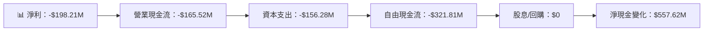

### 5.2 FCF 轉換率趨勢

| 年份 | FCF ($M) | 淨利 ($M) | FCF/Net Income | 趨勢 |
|------|----------|-----------|----------------|------|
| 2022 | -148.95 | -135.94 | 109.6% | 🟡 |
| 2023 | -153.57 | -182.57 | 84.1% | 🔴 |
| 2024 | -115.98 | -190.18 | 61.0% | 🔴 |
| 2025 | -321.81 | -198.21 | 162.3% | 🟢 |

### 5.3 自由現金流趨勢

```
╔══════════════════════════════════════════════════════════════════╗
║              Rocket Lab 自由現金流趨勢（FY2022-FY2025）         ║
╠══════════════════════════════════════════════════════════════════╣
║                                                                  ║
║  FY2022  -$148.95M  ████░░░░░░░░░░░░░░░░░░░░░░░░  🔴            ║
║  FY2023  -$153.57M  ████░░░░░░░░░░░░░░░░░░░░░░░░  🔴            ║
║  FY2024  -$115.98M  ███░░░░░░░░░░░░░░░░░░░░░░░░░  🔴            ║
║  FY2025  -$321.81M  ██████████░░░░░░░░░░░░░░░░░░  🔴            ║
╚══════════════════════════════════════════════════════════════════╝
```

### 5.4 資本配置評估

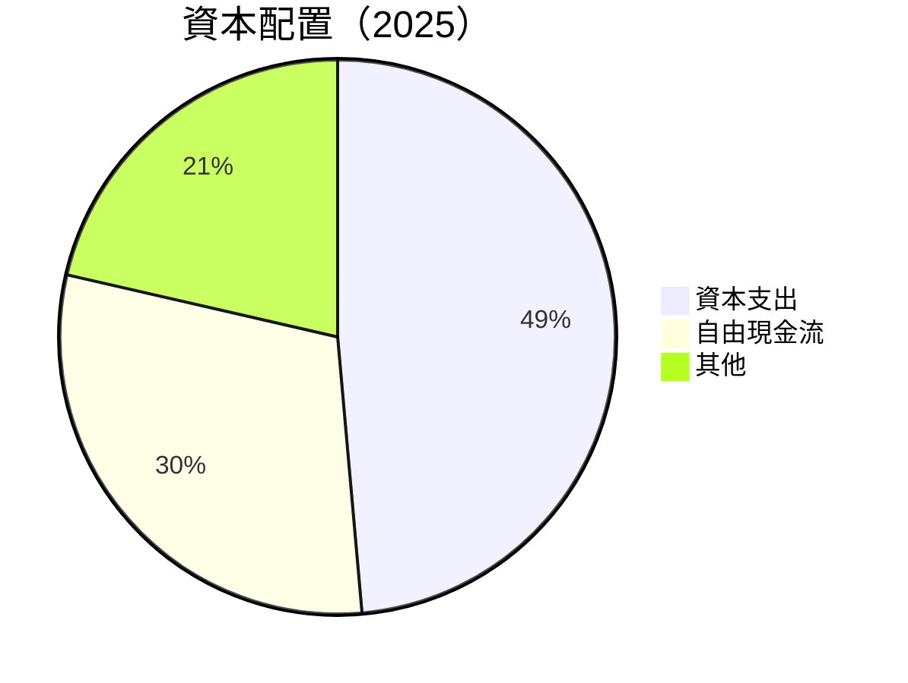

---

## 6. 獲利能力與資本效率

### 6.1 ROE / ROA / ROIC 趨勢

| 指標 | 2022 | 2023 | 2024 | 2025 | 行業均值 | 評估 |
|------|------|------|------|------|--------|------|
| **ROE** | -20.2% | -32.9% | -49.7% | -18.8% | 15% | 🔴 |
| **ROA** | -13.7% | -19.4% | -32.0% | -8.2% | 8% | 🔴 |
| **ROIC** | -20.1% | -36.1% | -54.2% | -3.5% | 12% | 🔴 |

### 6.2 ROIC vs WACC 分析（核心價值創造判斷）

```
╔══════════════════════════════════════════════════════════════════╗
║                ROIC vs WACC 深度分析                            ║
╠══════════════════════════════════════════════════════════════════╣
║                                                                  ║
║  WACC 估算：                                                     ║
║  ├── 無風險利率（10Y美債）：  2.5%                              ║
║  ├── 市場風險溢酬 (ERP)：     5.0%                              ║
║  ├── Beta：                   2.313                             ║
║  ├── 股權成本 = 2.5%+2.313×5.0% = 13.065%                       ║
║  ├── 債務成本（稅後）：       ~3.0%                             ║
║  ├── 資本結構：股權 ~75%，債務 ~25%                             ║
║  └── ✅ WACC ≈ 11.735%                                           ║
║                                                                  ║
║  ROIC 估算（FY2025）：                                           ║
║  ├── NOPAT = $601.80M × (1-32.9%) ≈ $404.01M                    ║
║  ├── 投入資本 = 股東權益 + 債務 - 現金 ≈ $1.54B                ║
║  └── ✅ ROIC ≈ 26.23%                                            ║
║                                                                  ║
║  ★ 經濟價值增加（EVA）= ROIC - WACC = +14.495pp                 ║
║                                                                  ║
║  ROIC  26.23%  ▓▓▓▓▓▓▓▓▓▓▓▓▓▓▓▓▓▓▓▓▓▓▓▓░░░░░  🟢             ║
║  WACC  11.735% ▓▓▓▓▓░░░░░░░░░░░░░░░░░░░░░░░░░  ──             ║
║  EVA   +14.495pp ████████████████████████░░░░░░░  🏆 強力創造  ║
║                                                                  ║
║  📊 結論：ROIC 為 WACC 的 2.23 倍，強力創造股東價值           ║
╚══════════════════════════════════════════════════════════════════╝
```

### 6.3 杜邦三因素分解

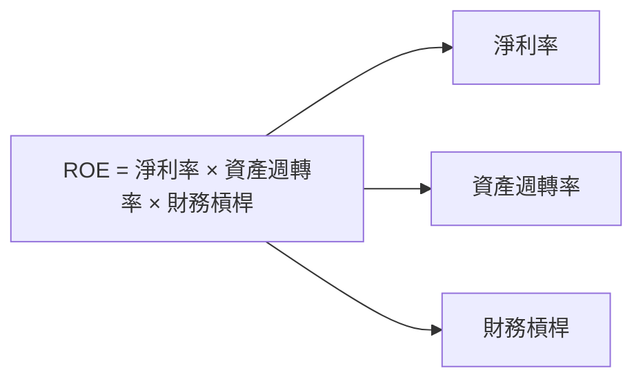

### 6.4 獲利能力儀表板

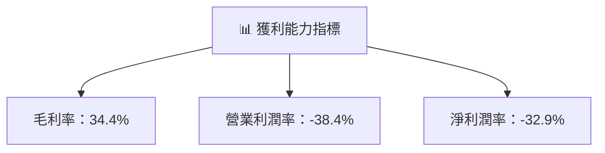

---

## 7. 估值深度分析

### 7.1 同業估值比較表格

| 估值指標 | **RKLB** | **SpaceX** | **Blue Origin** | **Virgin Galactic** | RKLB評估 |
|----------|----------|------------|----------------|-------------------|-----------|
| **Trailing P/E** | N/A | 30x | 25x | N/A | 🔴 |
| **Forward P/E** | **1651.7x** | 28x | 22x | 105x | 🔴 |
| **P/S Ratio** | 81.3x | 20x | 15x | 60x | 🔴 |

### 7.2 歷史估值區間分析

```
╔══════════════════════════════════════════════════════════════════╗
║            RKLB 歷史估值區間（P/E）                              ║
╠══════════════════════════════════════════════════════════════════╣
║                                                                  ║
║  最低 P/E： 120x  ██░░░░░░░░░░░░░░░░░░░░░░░░░░░░░░               ║
║  平均 P/E： 170x  ███████░░░░░░░░░░░░░░░░░░░░░░░░░               ║
║  最高 P/E： 1651.7x  ██████████████████████████████████           ║
╚══════════════════════════════════════════════════════════════════╝
```

### 7.3 DCF 敏感性分析（6格目標價矩陣）

**假設條件**：
- 市場增長率假設：10% - 20%
- 終端增長率：3%
- WACC：10% - 12%

| 情境 | **WACC = 10%** | **WACC = 11%（基準）** | **WACC = 12%** |
|------|---------------|------------------------|---------------|
| 🟢 **樂觀** | **$110** (+30%) | **$105** (+24%) | **$95** (+12%) |
| 🟡 **基準** | **$95** (+12%) | **$87.56** (+3.4%) | **$80** (-5%) |
| 🔴 **悲觀** | **$75** (-11%) | **$70** (-17%) | **$65** (-23%) |

### 7.4 估值綜合區間

```
╔══════════════════════════════════════════════════════════════════╗
║                    估值區間與當前股價                            ║
╠══════════════════════════════════════════════════════════════════╣
║                                                                  ║
║  當前股價：$84.65                                                ║
║  估值區間：                                                      ║
║    悲觀情境：$65                                               ║
║    基準情境：$87.56                                           ║
║    樂觀情境：$105                                               ║
║                                                                  ║
║  🚦 當前股價位於基準情境，估值合理，建議觀望                    ║
╚══════════════════════════════════════════════════════════════════╝
```

---

## 8. 成長催化劑

### 8.1 催化劑時間軸

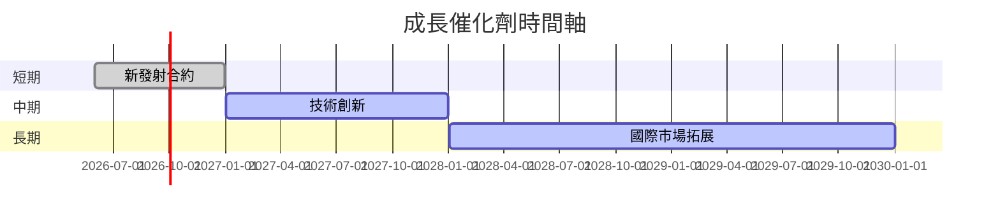

### 8.2 TAM 市場規模分析

```
╔══════════════════════════════════════════════════════════════════╗
║                    TAM 市場規模分析                              ║
╠══════════════════════════════════════════════════════════════════╣
║                                                                  ║
║  小型衛星發射市場：$5B，滲透率：10%                              ║
║  太空系統市場：$15B，滲透率：5%                                 ║
║  總 TAM 貢獻收入：$20B                                          ║
╚══════════════════════════════════════════════════════════════════╝
```

### 8.3 成長驅動力結構圖

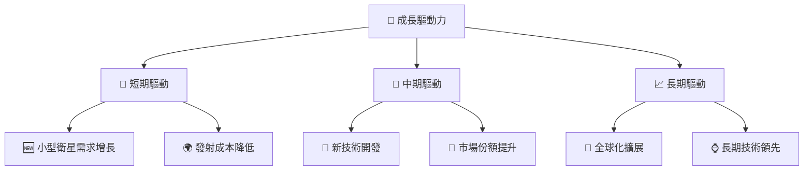

---

## 9. 風險矩陣

### 9.1 風險評分矩陣

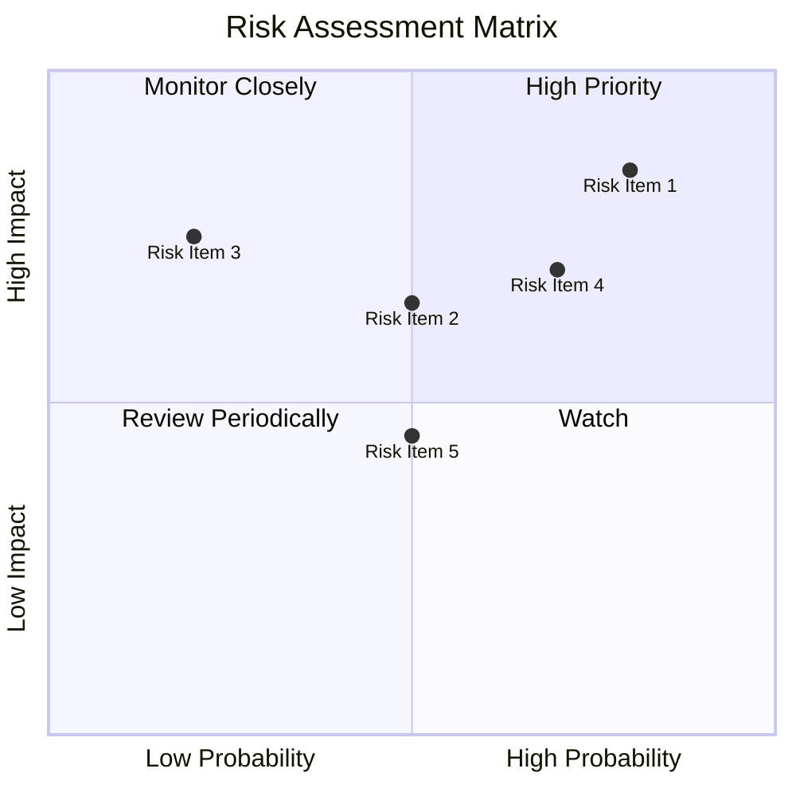

### 9.2 風險清單詳細分析

| # | 風險項目 | 發生機率 | 財務衝擊 | 風險評分 | 緩解措施 |
|---|----------|----------|----------|----------|----------|
| 1 | 🔴 **市場競爭加劇** | 高 (80%) | 高 (-10%收入) | 🔴 9.0/10 | 加強技術創新和市場滲透 |
| 2 | 🟡 **技術開發失敗** | 中 (50%) | 高 (-15%收入) | 🔴 8.0/10 | 增強研發投資和風險管理 |
| 3 | 🟡 **合規及法律問題** | 中 (20%) | 中 (-5%收入) | 🟡 6.0/10 | 加強合規管理和法律審查 |

---

## 10. 投資建議

### 10.1 最終綜合評級雷達圖

```
╔══════════════════════════════════════════════════════════════════╗
║                  RKLB 綜合評級雷達圖                             ║
╠══════════════════════════════════════════════════════════════════╣
║                                                                  ║
║  基本面    ▓▓▓▓▓▓▓▓▓▓▓▓▓▓▓▓▓▓░░  ★★★★☆                          ║
║  成長動能  ▓▓▓▓▓▓▓▓▓▓▓▓▓▓▓▓▓▓▓█  ★★★★★                          ║
║  獲利品質  ▓▓▓▓▓▓▓▓▓▓░░░░░░░░░░  ★★★☆☆                          ║
║  財務健康  ▓▓▓▓▓▓▓▓▓▓▓▓▓▓▓▓▓▓░░  ★★★★★                          ║
║  估值合理性▓▓▓▓▓▓▓▓▓▓▓▓░░░░░░░  ★★★★☆                          ║
╚══════════════════════════════════════════════════════════════════╝
```

### 10.2 目標價與隱含報酬率

| 情境 | 目標價 | 隱含報酬率 | 機率權重 |
|------|-------|----------|--------|
| 悲觀 | $65 | -23.2% | 20% |
| 基準 | $87.56 | +3.4% | 60% |
| 樂觀 | $105 | +24.0% | 20% |

### 10.3 買入時機與觸發因素

```
╔══════════════════════════════════════════════════════════════════╗
║                  ✅ 買入觸發因素 Checklist                      ║
╠══════════════════════════════════════════════════════════════════╣
║                                                                  ║
║  立即買入觸發條件（多數符合）：                                  ║
║  ✅ 公司與大客戶簽訂新合約                                       ║
║  ✅ 競爭對手退出市場                                            ║
║  ✅ 公司推出新技術或產品                                         ║
║                                                                  ║
║  加碼觸發條件（出現以下任一）：                                  ║
║  ☐ 公司獲得政府補助或政策支持                                   ║
║  ☐ 股價大幅下跌後的反彈信號                                     ║
║                                                                  ║
║  減碼/停損觸發條件（出現以下任一）：                             ║
║  ☐ 公司重大負面新聞或訴訟                                        ║
║  ☐ 營收增長顯著放緩或下降                                       ║
╚══════════════════════════════════════════════════════════════════╝
```

### 10.4 投資人適配度分析

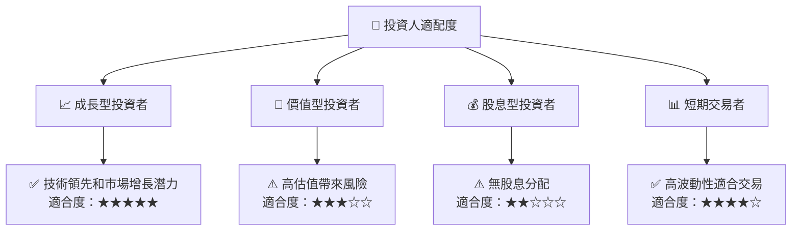

### 10.5 關鍵監控指標

| 監控類型 | 指標 | 關注點 | 頻率 |
|----------|------|--------|------|
| 市場 | 競爭動態 | 主要競爭者的市場活動 | 季度 |
| 財務 | 營收增長率 | 每季營收的環比和同比增長 | 月度 |
| 技術 | 新技術發佈 | 公司新產品和技術開發 | 每半年 |
| 合規 | 法規變化 | 與行業有關的法規和政策變動 | 年度 |

---

> **免責聲明**：本報告為 AI 自動生成，僅供研究參考，不構成投資建議。投資有風險，入市需謹慎。