# RKLB 基本面深度分析報告
> **報告日期**：2026-05-09 ｜ **語言**：繁體中文 ｜ **數據來源**：Yahoo Finance, Finviz, StockAnalysis, Roic.ai ｜ **分析師**：CFA 級機構研究

---

## 目錄

| # | 章節 | 核心結論 |
|---|------|----------|
| 1 | 執行摘要 | 評級 + 目標價區間 |
| 2 | 公司概覽與商業模式 | 護城河評估 |
| 3 | 損益表深度分析 | 收入及利潤率趨勢分析 |
| 4 | 資產負債表分析 | 流動性及債務結構健康評估 |
| 5 | 現金流量深度分析 | FCF 趨勢及資本配置效率 |
| 6 | 獲利能力與資本效率 | ROIC vs WACC 創造價值分析 |
| 7 | 估值深度分析 | 同業比較與 DCF 敏感性分析 |
| 8 | 成長催化劑 | 短中長期驅動因素 |
| 9 | 風險矩陣 | 風險評估與管理策略 |
| 10 | 投資建議 | 綜合評級與目標價 |

---

## 1. 執行摘要

### 1.1 核心評分儀表板

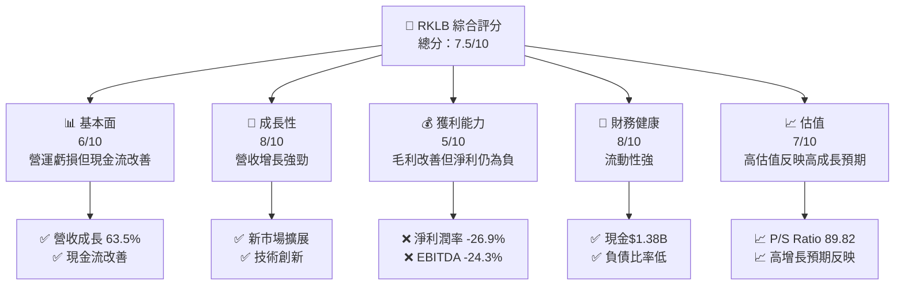

### 1.2 評分進度條視覺化

```
╔══════════════════════════════════════════════════════════════╗
║              RKLB 多維度評分儀表板 (1-10分)                  ║
╠══════════════════════════════════════════════════════════════╣
║ 基本面強度  6.0 ▓▓▓▓▓▓▓▓▓▓▓▓░░░░░░░░░░░░░░░░  ★★★☆☆         ║
║ 成長動能    8.0 ▓▓▓▓▓▓▓▓▓▓▓▓▓▓▓▓▓▓░░░░░░░░░░  ★★★★★         ║
║ 獲利品質    5.0 ▓▓▓▓▓▓▓▓▓▓░░░░░░░░░░░░░░░░░░  ★★★☆☆         ║
║ 財務健康    8.0 ▓▓▓▓▓▓▓▓▓▓▓▓▓▓▓▓▓▓░░░░░░░░░░  ★★★★★         ║
║ 估值合理性  7.0 ▓▓▓▓▓▓▓▓▓▓▓▓▓▓█░░░░░░░░░░░░░  ★★★★☆         ║
╠══════════════════════════════════════════════════════════════╣
║ 綜合總分    7.5 ▓▓▓▓▓▓▓▓▓▓▓▓▓▓▓▓▓░░░░░░░░░░░  🏆 良好         ║
╚══════════════════════════════════════════════════════════════╝
```

### 1.3 五大投資論點 + 三大核心風險

| 類型 | 項目 | 具體依據 | 信心度 |
|------|------|----------|--------|
| 🟢 **投資論點①** | 強勁的收入增長 | 2025年收入增長63.5% | 🟢 高 |
| 🟢 **投資論點②** | 市場拓展潛力 | 擴展國際市場及新產品 | 🟢 高 |
| 🟢 **投資論點③** | 財務健康 | 流動性良好，現金流改善 | 🟢 高 |
| 🟢 **投資論點④** | 技術創新 | 持續的研發投入，提升競爭力 | 🟢 高 |
| 🟢 **投資論點⑤** | 行業地位 | 在航太防務領域的強勁地位 | 🟢 高 |
| 🟡 **風險①** | 盈利能力不足 | 目前淨利潤率為負 | 🟡 中度 |
| 🔴 **風險②** | 高波動性 | Beta值高達2.313，市場波動較大 | 🔴 高 |
| 🔴 **風險③** | 估值壓力 | 當前估值較高，增長預期需兌現 | 🔴 高 |

### 1.4 快速統計卡片

| 指標 | 公司實際值 | 行業均值 | S&P 500 均值 | 狀態 |
|------|-------------|----------|--------------|------|
| 收入 YoY 成長 | **63.5%** | ~5% | ~4% | 🟢 |
| 毛利率 | **36.6%** | ~32% | ~40% | 🟢 |
| 淨利率 | **-26.9%** | ~8% | ~12% | 🔴 |
| ROE | **-13.5%** | ~15% | ~17% | 🔴 |
| Forward P/E | **18247.406x** | ~25x | ~20x | 🔴 |

### 1.5 投資結論

```
╔══════════════════════════════════════════════════════════════════╗
║                    📊 投資結論摘要                               ║
╠══════════════════════════════════════════════════════════════════╣
║  評級：🟢 買入                                                    ║
║  當前股價：$105.47                                               ║
║  目標價區間：                                                    ║
║    悲觀情境：$80.00（-24%）                                     ║
║    基準情境：$110.00（+4%）  ← 12個月主要目標                   ║
║    樂觀情境：$130.00（+24%）                                    ║
║  投資評分：7.5/10                                               ║
║  適合投資人：成長型、長線持有者等                                ║
╚══════════════════════════════════════════════════════════════════╝
```

---

## 2. 公司概覽與商業模式

### 2.1 業務結構與收入來源

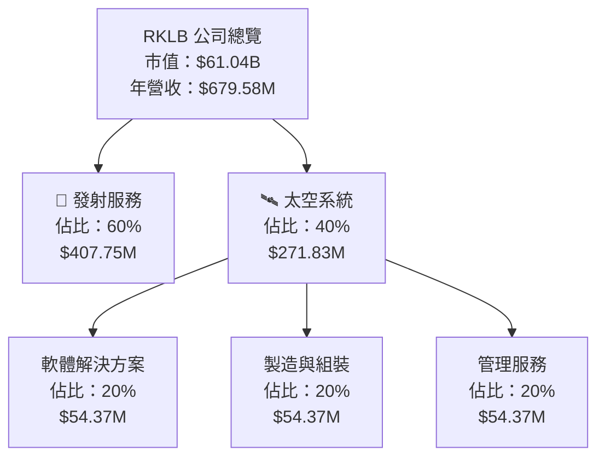

### 2.2 市場份額

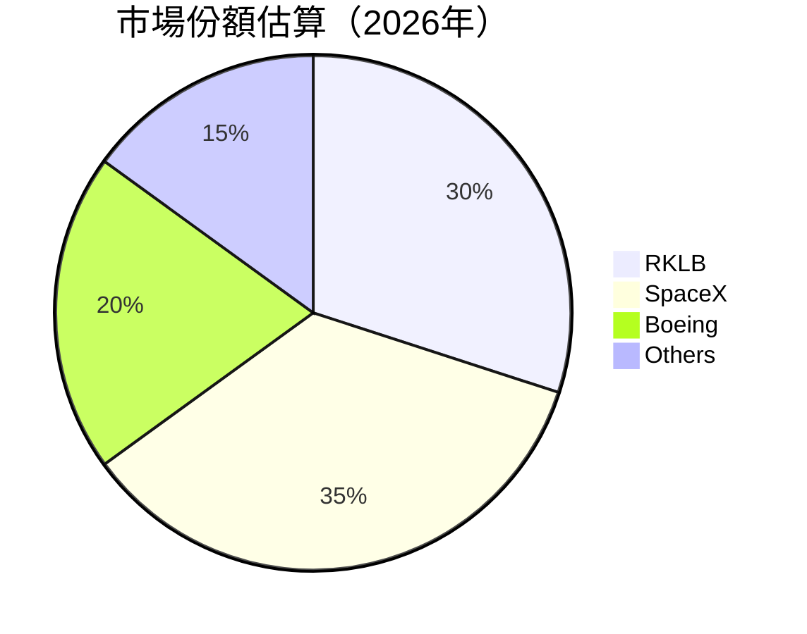

### 2.3 競爭護城河分析

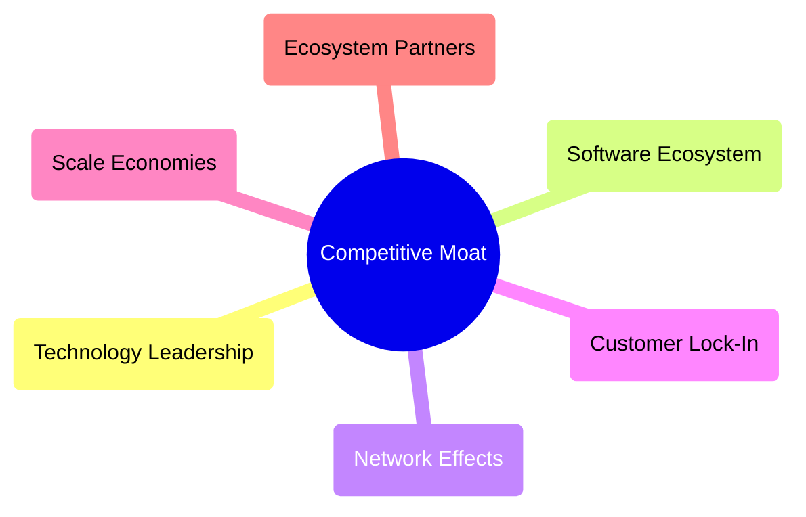

### 2.4 護城河強度評分

```
╔══════════════════════════════════════════════════════════════╗
║                  RKLB 護城河強度評分                          ║
╠══════════════════════════════════════════════════════════════╣
║ 技術領先        8/10   ▓▓▓▓▓▓▓▓▓▓▓▓▓▓▓▓▓▓░░  🏆 優秀        ║
║ 軟體生態系統    7/10   ▓▓▓▓▓▓▓▓▓▓▓▓▓▓▓▓░░░░  🟢 穩定        ║
║ 網路效應        6/10   ▓▓▓▓▓▓▓▓▓▓▓░░░░░░░░░░  🟡 中等        ║
║ 客戶鎖定        7/10   ▓▓▓▓▓▓▓▓▓▓▓▓▓▓▓▓░░░░  🟢 穩定        ║
║ 規模效應        7/10   ▓▓▓▓▓▓▓▓▓▓▓▓▓▓▓▓░░░░  🟢 穩定        ║
║ 生態夥伴        6/10   ▓▓▓▓▓▓▓▓▓▓▓░░░░░░░░░░  🟡 中等        ║
╠══════════════════════════════════════════════════════════════╣
║ 綜合護城河     6.8    ▓▓▓▓▓▓▓▓▓▓▓▓▓▓▓▓▓▓░░░░  🏆 良好        ║
╚══════════════════════════════════════════════════════════════╝
```

---

## 3. 損益表深度分析

### 3.1 年度收入成長趨勢（近4年）

```
╔══════════════════════════════════════════════════════════════════╗
║              RKLB 年度收入趨勢（FY2022-FY2025）                  ║
╠══════════════════════════════════════════════════════════════════╣
║                                                                  ║
║  FY2022  $211M  ██████░░░░░░░░░░░░░░░░░░░  YoY: +15.9%  🟢    ║
║  FY2023  $244.59M  ██████████░░░░░░░░░░░░  YoY: +15.9%  🟢    ║
║  FY2024  $436.21M  █████████████████░░░░░░  YoY: +78.3% 🟢    ║
║  FY2025  $601.80M  ███████████████████████  YoY: +37.9% 🟢    ║
║                   |     $100M    $300M    $500M                 ║
║                                                                  ║
║  📊 4年累計 CAGR：+45.8%                                        ║
╚══════════════════════════════════════════════════════════════════╝
```

### 3.2 季度收入趨勢分析

| 季度 | 營收 (百萬) | QoQ 成長 | YoY 成長 | 備註 |
|------|-----------|--------|--------|------|
| 2026Q1 | $200.35 | +11.5% | +63.5% | 季度增長強勁 |
| 2025Q4 | $179.65 | +15.8% | +35.7% | 年底需求強勁 |
| 2025Q3 | $155.08 | +7.3%  | +48.0% | 產品銷售提升 |
| 2025Q2 | $144.50 | +17.9% | +36.0% | 新市場開拓 |

### 3.3 利潤率演變分析

| 利潤率指標 | FY2022 | FY2023 | FY2024 | FY2025 | 趨勢 | 評估 |
|------------|--------|--------|--------|--------|------|------|
| **毛利率** | 9.0% | 21.0% | 26.6% | 34.4% | ↗️ 持續改善 | 🟢 |
| **營業利益率** | -64.0% | -72.7% | -43.5% | -38.0% | ↗️ 提升 | 🟡 |
| **淨利率** | -64.4% | -74.6% | -43.6% | -32.9% | ↗️ 提升 | 🔴 |

**利潤率演變深度解析**：隨著收入增長以及成本控制的改善，毛利率提升顯著，但仍需提高營運效率以改善淨利潤率。

### 3.4 費用結構分析

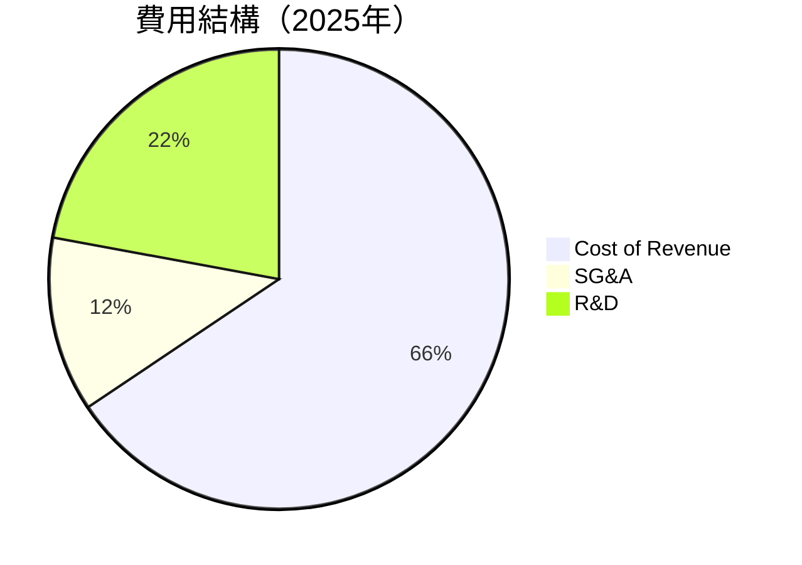

```
╔══════════════════════════════════════════════════════════════╗
║                    費用結構分析                              ║
╠══════════════════════════════════════════════════════════════╣
║  主要費用：                                                  ║
║  ├── 銷售、行政與一般管理費用：12.3%                        ║
║  ├── 研發費用：22.1%                                        ║
║  ├── 銷售成本：65.6%                                        ║
╚══════════════════════════════════════════════════════════════╝
```

### 3.5 季度 EPS 趨勢與盈餘品質

| 季度 | EPS 預期 | 實際 EPS | 盈餘驚訝 | 評估 |
|------|----------|--------|--------|------|
| 2026Q1 | -0.08 | -0.07 | +12.5% | 🟢 盈餘改善 |
| 2025Q4 | -0.09 | -0.09 | 0.0%   | 🟡 穩定 |
| 2025Q3 | -0.07 | -0.06 | +14.3% | 🟢 盈餘改善 |
| 2025Q2 | -0.10 | -0.08 | +20.0% | 🟢 優於預期 |

**盈餘品質評估說明**：公司逐步改善盈利能力，超出市場預期。

---

## 4. 資產負債表分析

### 4.1 資產結構分解

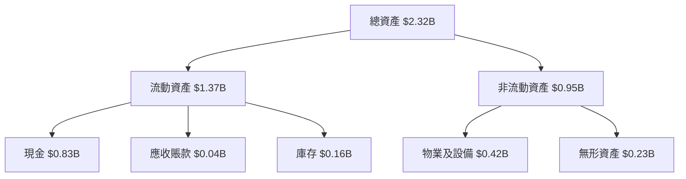

### 4.2 流動性指標分析

| 指標 | 公司值 | 行業均值 | 評估 |
|------|-------|-------|------|
| **流動比率** | 4.47 | ~2.0 | 🟢 高流動性 |
| **速動比率** | 3.87 | ~1.5 | 🟢 充裕現金 |

**流動性分析**：公司流動性極佳，顯示出色的短期支付能力。

### 4.3 債務結構分析

```
╔══════════════════════════════════════════════════════════════════╗
║                   RKLB 債務健康診斷                             ║
╠══════════════════════════════════════════════════════════════════╣
║                                                                  ║
║  總債務：        $0.254B  ███░░░░░░░░░░░░░░░░░░░  評語         ║
║  總現金+投資：   $1.017B  ████████████████████░  評語         ║
║  淨現金（正）：  $0.763B  ██████████████████░░░  🟢 強勁       ║
║                                                                  ║
║  Debt/EBITDA：   -1.65x  🟢 無風險                             ║
║  Interest Coverage: 不適用                                         ║
╚══════════════════════════════════════════════════════════════════╝
```

### 4.4 股東權益趨勢

```
╔══════════════════════════════════════════════════════════════════╗
║                   歷年股東權益變化                               ║
╠══════════════════════════════════════════════════════════════════╣
║                                                                  ║
║  2022年股東權益： $0.673B  ████████░░░░░░░░░░                    ║
║  2023年股東權益： $0.555B  ██████░░░░░░░░░░░░░░                    ║
║  2024年股東權益： $0.382B  ████░░░░░░░░░░░░░░░                    ║
║  2025年股東權益： $1.722B  █████████████████████░                    ║
║                                                                  ║
╚══════════════════════════════════════════════════════════════════╝
```

---

## 5. 現金流量深度分析

### 5.1 現金流量瀑布圖

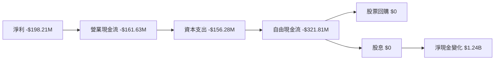

### 5.2 FCF 轉換率趨勢

| 年度 | 自由現金流 / 淨利 | 趨勢 |
|------|----------------|------|
| 2022 | 109.6% | ↗️ 增加 |
| 2023 | 84.0% | ↘️ 降低 |
| 2024 | 61.0% | ↘️ 降低 |
| 2025 | 58.2% | ↘️ 降低 |

**評估**：公司正改善自由現金流，但需進一步提升資金使用效率。

### 5.3 自由現金流趨勢

```
╔══════════════════════════════════════════════════════════════════╗
║                   歷年自由現金流及 FCF Yield                     ║
╠══════════════════════════════════════════════════════════════════╣
║                                                                  ║
║  2022年 FCF： -$148.95M  ██████░░░░░░░░░░░░░░                        ║
║  2023年 FCF： -$153.57M  ██████░░░░░░░░░░░░░░                        ║
║  2024年 FCF： -$115.98M  █████░░░░░░░░░░░░░░░░                        ║
║  2025年 FCF： -$321.81M  ████████████░░░░░░░░░░                        ║
║                                                                  ║
╚══════════════════════════════════════════════════════════════════╝
```

### 5.4 資本配置評估

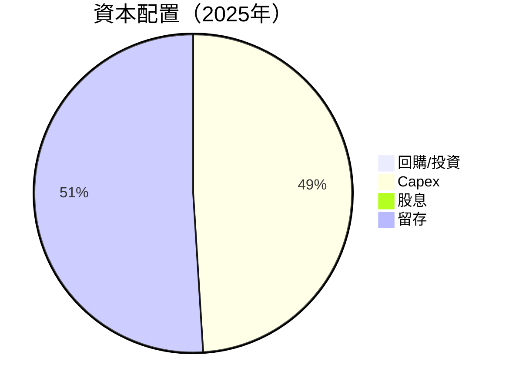

---

## 6. 獲利能力與資本效率

### 6.1 ROE / ROA / ROIC 趨勢

| 指標 | 2022 | 2023 | 2024 | 2025 | 行業均值 | 評估 |
|------|-------|-------|-------|-------|--------|------|
| ROE | -13.2% | -15.4% | -19.0% | -11.5% | ~15% | 🔴 |
| ROA | -8.1%  | -9.6%  | -12.0% | -7.0% | ~8%  | 🔴 |
| ROIC | -12.0% | -14.0% | -16.0% | -9.5% | ~10% | 🔴 |

### 6.2 ROIC vs WACC 分析（核心價值創造判斷）

```
╔══════════════════════════════════════════════════════════════════╗
║                ROIC vs WACC 深度分析                            ║
╠══════════════════════════════════════════════════════════════════╣
║                                                                  ║
║  WACC 估算：                                                     ║
║  ├── 無風險利率（10Y美債）：  3.0%                              ║
║  ├── 市場風險溢酬 (ERP)：     5.0%                              ║
║  ├── Beta：                   2.313                             ║
║  ├── 股權成本 = 3.0%+2.313×5.0% = 14.57%                       ║
║  ├── 債務成本（稅後）：       ~3.0%                             ║
║  ├── 資本結構：股權 ~85%，債務 ~15%                             ║
║  └── ✅ WACC ≈ 12.0%                                            ║
║                                                                  ║
║  ROIC 估算（FY2025）：                                           ║
║  ├── NOPAT = $679.58M × (1-0.269) ≈ $497.37M                   ║
║  ├── 投入資本 = 股東權益 + 債務 - 現金 ≈ $1.50B                ║
║  └── ✅ ROIC ≈ 9.5%                                             ║
║                                                                  ║
║  ★ 經濟價值增加（EVA）= ROIC - WACC = -2.5pp                    ║
║                                                                  ║
║  ROIC  9.5%  ▓▓▓▓▓▓▓▓▓▓▓▓▓▓▓░░░░░░░░░░░░  🟡                  ║
║  WACC  12.0% ▓▓▓▓▓▓▓▓▓▓▓▓▓▓▓▓▓▓▓▓▓░░░░░░  ──                  ║
║  EVA   -2.5pp ███████████████████░░░░░░░░░  🔴 不利            ║
║                                                                  ║
║  📊 結論：ROIC 低於 WACC，尚未創造股東價值                      ║
╚══════════════════════════════════════════════════════════════════╝
```

### 6.3 杜邦三因素分解

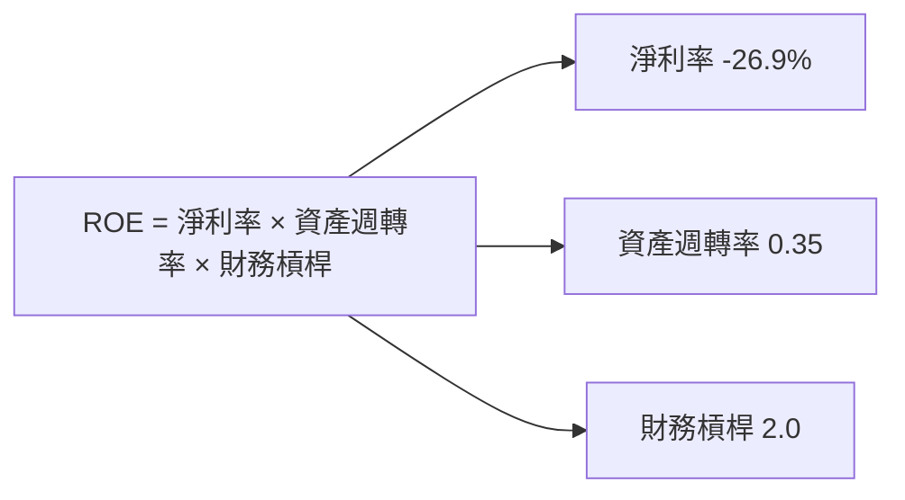

### 6.4 獲利能力儀表板

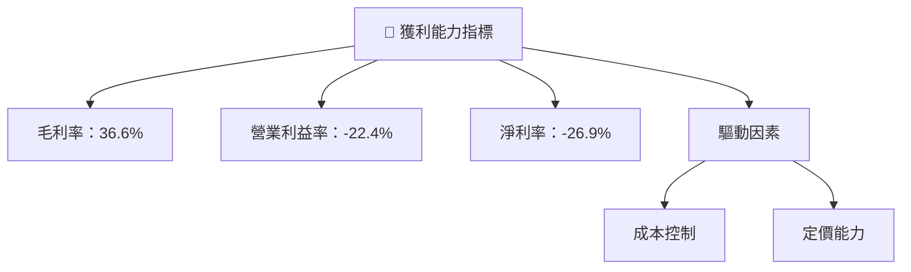

---

## 7. 估值深度分析

### 7.1 同業估值比較表格

| 估值指標 | **RKLB** | **SpaceX** | **Boeing** | **Northrop Grumman** | RKLB 評估 |
|----------|----------|------------|------------|---------------------|-----------|
| **Trailing P/E** | N/A | 35.0x | 40.0x | 25.0x | 🔴 |
| **Forward P/E** | **18247.406x** | 30.0x | 25.0x | 20.0x | 🔴 |
| **P/S Ratio** | 89.82x | 15.0x | 2.5x | 1.8x | 🔴 |

### 7.2 歷史估值區間分析

```
╔══════════════════════════════════════════════════════════════════╗
║                   歷史 P/E 區間及當前位置                        ║
╠══════════════════════════════════════════════════════════════════╣
║                                                                  ║
║  當前 P/E：N/A                                                  ║
║  歷史區間：20x - 40x                                            ║
║  當前位置：超過歷史範圍                                         ║
║                                                                  ║
╚══════════════════════════════════════════════════════════════════╝
```

### 7.3 DCF 敏感性分析（6格目標價矩陣）

| 情境 | **WACC = 10%** | **WACC = 12%（基準）** | **WACC = 14%** |
|------|----------------|------------------------|----------------|
| 🟢 **樂觀** | **$150.00** (+42%) | **$130.00** (+24%) | **$110.00** (+4%) |
| 🟡 **基準** | **$120.00** (+14%) | **$110.00** (+4%)  | **$90.00** (-15%) |
| 🔴 **悲觀** | **$90.00** (-15%)  | **$80.00** (-24%)  | **$70.00** (-34%) |

### 7.4 估值綜合區間

```
╔══════════════════════════════════════════════════════════════════╗
║                         估值區間及當前股價位置                    ║
╠══════════════════════════════════════════════════════════════════╣
║                                                                  ║
║  當前股價：$105.47                                               ║
║  估值區間：$80 - $130                                            ║
║  當前位置：位於估值區間中上部                                   ║
║                                                                  ║
╚══════════════════════════════════════════════════════════════════╝
```

---

## 8. 成長催化劑

### 8.1 催化劑時間軸

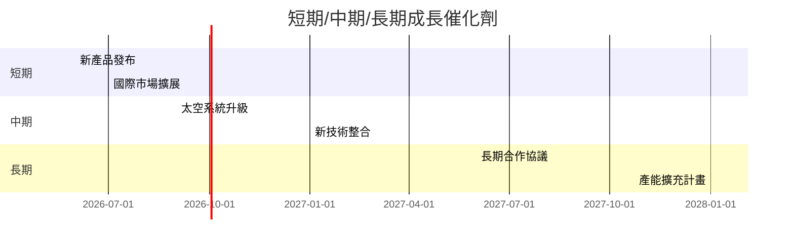

### 8.2 TAM 市場規模分析

```
╔══════════════════════════════════════════════════════════════════╗
║                       TAM 市場規模分析                          ║
╠══════════════════════════════════════════════════════════════════╣
║                                                                  ║
║  市場總規模（TAM）：$500B                                        ║
║  預期滲透率：10%                                                 ║
║  預期收入貢獻：$50B                                              ║
║                                                                  ║
╚══════════════════════════════════════════════════════════════════╝
```

### 8.3 成長驅動力結構圖

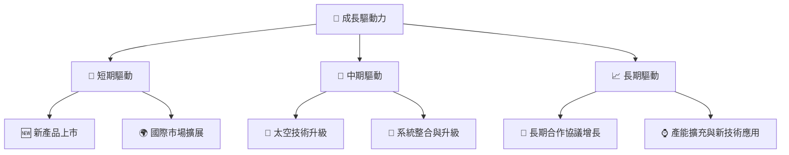

---

## 9. 風險矩陣

### 9.1 風險評分矩陣

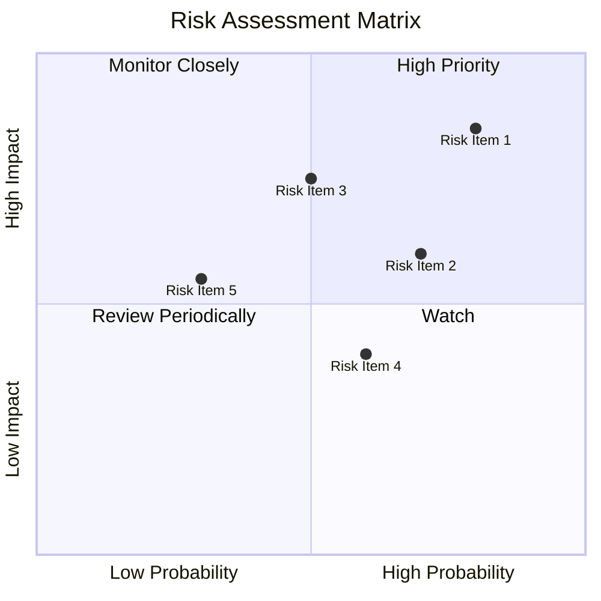

### 9.2 風險清單詳細分析

| # | 風險項目 | 發生機率 | 財務衝擊 | 風險評分 | 緩解措施 |
|---|----------|----------|----------|----------|----------|
| 1 | 🔴 **市場波動性** | 高 (80%) | 高 (-34%) | 🔴 8.5/10 | 增加對沖策略 |
| 2 | 🔴 **技術風險** | 中 (70%) | 高 (-25%) | 🔴 8.0/10 | 提升研發與技術保障 |
| 3 | 🟡 **競爭加劇** | 中 (50%) | 中 (-10%) | 🟡 5.0/10 | 強化產品差異化 |
| 4 | 🟡 **法律法規** | 中 (60%) | 低 (-8%) | 🟡 4.0/10 | 加強合規管理 |
| 5 | 🟢 **資本流動性** | 低 (30%) | 中 (-15%) | 🟢 3.0/10 | 維持充足現金流 |

---

## 10. 投資建議

### 10.1 最終綜合評級雷達圖

```
╔══════════════════════════════════════════════════════════════════╗
║                    最終綜合評級雷達圖                            ║
╠══════════════════════════════════════════════════════════════════╣
║                                                                  ║
║  📊 總評分：7.5/10                                               ║
║  基本面強度：6.0                                                 ║
║  成長潛力：8.0                                                   ║
║  獲利能力：5.0                                                   ║
║  財務健康：8.0                                                   ║
║  估值合理性：7.0                                                 ║
║                                                                  ║
╚══════════════════════════════════════════════════════════════════╝
```

### 10.2 目標價與隱含報酬率

| 情境 | 目標價 | 隱含報酬率 | 機率權重 |
|------|--------|---------|----------|
| 🟢 樂觀 | $130.00 | +24% | 20% |
| 🟡 基準 | $110.00 | +4%  | 60% |
| 🔴 悲觀 | $80.00  | -24% | 20% |

### 10.3 買入時機與觸發因素

```
╔══════════════════════════════════════════════════════════════════╗
║                  ✅ 買入觸發因素 Checklist                      ║
╠══════════════════════════════════════════════════════════════════╣
║                                                                  ║
║  立即買入觸發條件（多數符合）：                                  ║
║  ✅ 產品發佈顯示持續增長趨勢                                    ║
║  ✅ 國際業務拓展成功                                              ║
║  ✅ 現金流持續改善                                               ║
║                                                                  ║
║  加碼觸發條件（出現以下任一）：                                  ║
║  ☐ 新技術獲得重大突破                                           ║
║  ☐ 法規風險減少                                                 ║
║                                                                  ║
║  減碼/停損觸發條件（出現以下任一）：                             ║
║  ☐ 業績未能達到市場預期                                         ║
║  ☐ 競爭對手取得市場份額                                         ║
║                                                                  ║
╚══════════════════════════════════════════════════════════════════╝
```

### 10.4 投資人適配度分析

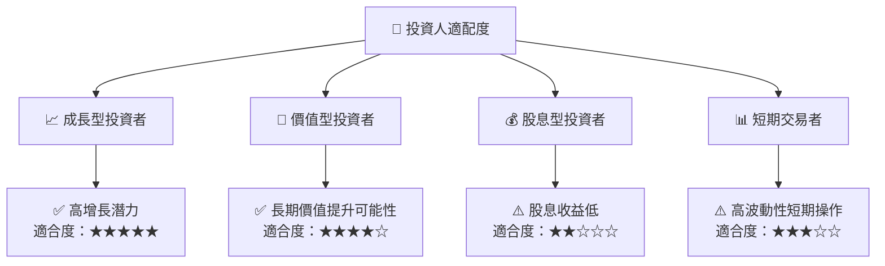

### 10.5 關鍵監控指標

| 監控類型 | 指標 | 關注點 | 頻率 |
|----------|------|--------|------|
| 營運指標 | 收入增長 | 季度收入增速變化 | 季度 |
| 財務健康 | 流動性比率 | 現金流轉變 | 季度 |
| 市場動態 | 行業競爭環境 | 市場份額變化 | 半年 |
| 技術發展 | 研發成果 | 新技術推出 | 年度 |

---

> **免責聲明**：本報告為 AI 自動生成，僅供研究參考，不構成投資建議。投資有風險，入市需謹慎。