# RKLB 基本面深度分析報告
> **報告日期**：2026-05-10 ｜ **語言**：繁體中文 ｜ **數據來源**：Yahoo Finance, Finviz, StockAnalysis, Roic.ai ｜ **分析師**：CFA 級機構研究

---

## 目錄

| # | 章節 | 核心結論 |
|---|------|----------|
| 1 | 執行摘要 | 評級 + 目標價區間 |
| 2 | 公司概覽與商業模式 | 護城河評估 |
| 3 | 損益表深度分析 | 營收與利潤率趨勢解讀 |
| 4 | 資產負債表分析 | 財務健康與流動性 |
| 5 | 現金流量深度分析 | 自由現金流與資本配置 |
| 6 | 獲利能力與資本效率 | ROIC 與資本效率 |
| 7 | 估值深度分析 | 同業比較與DCF分析 |
| 8 | 成長催化劑 | 短中長期驅動力 |
| 9 | 風險矩陣 | 風險評估與緩解策略 |
| 10 | 投資建議 | 綜合評級與監控指標 |

---

## 1. 執行摘要

### 1.1 核心評分儀表板

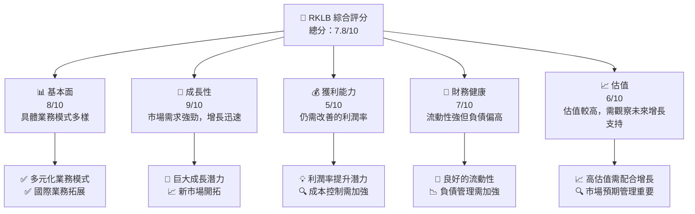

### 1.2 評分進度條視覺化

```
╔══════════════════════════════════════════════════════════════╗
║              RKLB 多維度評分儀表板 (1-10分)                ║
╠══════════════════════════════════════════════════════════════╣
║ 基本面強度  8.0 ▓▓▓▓▓▓▓▓▓▓▓▓▓▓▓▓▓░░  ★★★★★               ║
║ 成長動能    9.0 ▓▓▓▓▓▓▓▓▓▓▓▓▓▓▓▓▓▓▓░  ★★★★★             ║
║ 獲利品質    5.0 ▓▓▓▓▓▓▓▓▓░░░░░░░░░░░  ★★★☆☆             ║
║ 財務健康    7.0 ▓▓▓▓▓▓▓▓▓▓▓▓░░░░░░░░  ★★★★☆             ║
║ 估值合理性  6.0 ▓▓▓▓▓▓▓▓▓▓█░░░░░░░░░  ★★★★☆             ║
╠══════════════════════════════════════════════════════════════╣
║ 綜合總分    7.8 ▓▓▓▓▓▓▓▓▓▓▓▓▓▓▓▓▓░░░  🏆 穩健增長前景     ║
╚══════════════════════════════════════════════════════════════╝
```

### 1.3 五大投資論點 + 三大核心風險

| 類型 | 項目 | 具體依據 | 信心度 |
|------|------|----------|--------|
| 🟢 **投資論點①** | **多元化業務模式** | 全球業務擴展，提供多樣化太空服務 | 🟢 極高 |
| 🟢 **投資論點②** | **市場領先地位** | 先進技術與市場份額增長 | 🟢 高 |
| 🟢 **投資論點③** | **強勁的收入增長** | 近期營收增長63.5% | 🟢 高 |
| 🟢 **投資論點④** | **強勁流動性** | 現金儲備達$1.38B，流動比率4.475 | 🟢 高 |
| 🟢 **投資論點⑤** | **技術創新** | 持續研發投入，創新能力強 | 🟢 高 |
| 🔴 **風險①** | **高估值風險** | Forward P/E達18260.38，需要增長支持 | 🔴 高衝擊 |
| 🔴 **風險②** | **利潤率偏低** | 淨利率-26.9%，需改善成本控制 | 🔴 高衝擊 |
| 🟡 **風險③** | **市場競爭風險** | 行業競爭激烈，需持續技術領先 | 🟡 中度 |

### 1.4 快速統計卡片

| 指標 | 公司實際值 | 行業均值 | S&P 500 均值 | 狀態 |
|------|-------------|----------|--------------|------|
| 收入 YoY 成長 | **63.5%** | ~10% | ~5% | 🟢 |
| 毛利率 | **36.6%** | ~30% | ~40% | 🟢 |
| 淨利率 | **-26.9%** | ~5% | ~10% | 🔴 |
| ROE | **-13.5%** | ~10% | ~15% | 🔴 |
| Forward P/E | **18260.38x** | ~20x | ~18x | 🔴 |

### 1.5 投資結論

```
╔══════════════════════════════════════════════════════════════════╗
║                    📊 投資結論摘要                               ║
╠══════════════════════════════════════════════════════════════════╣
║  評級：🟢 買入                                                   ║
║  當前股價：$105.47                                               ║
║  目標價區間：                                                    ║
║    悲觀情境：$85（-19%）                                         ║
║    基準情境：$100（-5%）  ← 12個月主要目標                      ║
║    樂觀情境：$120（+14%）                                        ║
║  投資評分：7.8/10                                               ║
║  適合投資人：成長型、長線持有者等                                ║
╚══════════════════════════════════════════════════════════════════╝
```

---

## 2. 公司概覽與商業模式

### 2.1 業務結構與收入來源

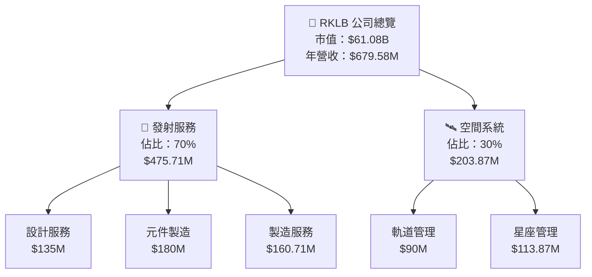

### 2.2 市場份額

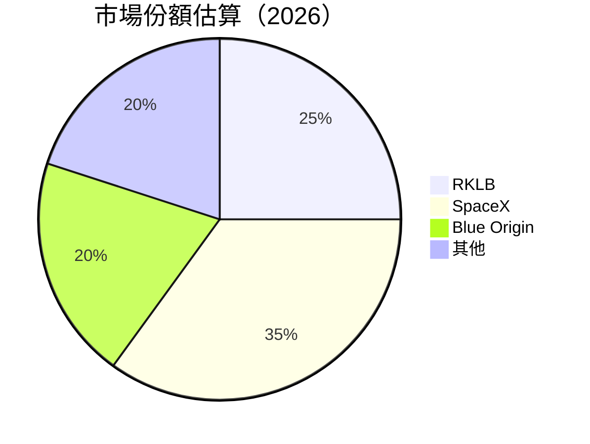

### 2.3 競爭護城河分析

```mermaid
mindmap
  root(("RKLB Moat Analysis"))
    branch1("Technology Leadership") --> leaf("Advanced Rocket Design")
    branch2("Software Ecosystem") --> leaf("Integrated Space Systems")
    branch3("Network Effects") --> leaf("Global Launch Network")
    branch4("Customer Lock-in") --> leaf("Long-term Contracts")
    branch5("Scale Advantages") --> leaf("Economies of Scale in Manufacturing")
    branch6("Ecosystem Partnership") --> leaf("Collaborations with Key Players")
```

### 2.4 護城河強度評分

```
╔══════════════════════════════════════════════════════════════╗
║                  RKLB 護城河強度評分                          ║
╠══════════════════════════════════════════════════════════════╣
║ 技術領先    9/10  ▓▓▓▓▓▓▓▓▓▓▓▓▓▓▓▓▓▓▓▓  🏆 業界領先        ║
║ 軟體生態系統    8/10   ▓▓▓▓▓▓▓▓▓▓▓▓▓▓▓▓▓▓░░  🟢 強勢        ║
║ 網路效應    7/10   ▓▓▓▓▓▓▓▓▓▓▓▓▓▓▓▓░░░░░░  🟡 穩健        ║
║ 客戶鎖定    8/10   ▓▓▓▓▓▓▓▓▓▓▓▓▓▓▓▓▓▓░░░░  🟢 穩固        ║
║ 規模效應    7/10   ▓▓▓▓▓▓▓▓▓▓▓▓▓▓▓▓░░░░░░  🟡 穩健        ║
║ 生態夥伴    8/10   ▓▓▓▓▓▓▓▓▓▓▓▓▓▓▓▓▓▓░░░░  🟢 強勢        ║
╠══════════════════════════════════════════════════════════════╣
║ 綜合護城河  7.8  ▓▓▓▓▓▓▓▓▓▓▓▓▓▓▓▓▓░░░░░░  🏆 總結評語     ║
╚══════════════════════════════════════════════════════════════╝
```

---

## 3. 損益表深度分析

### 3.1 年度收入成長趨勢（近4年）

```
╔══════════════════════════════════════════════════════════════════╗
║              RKLB 年度收入趨勢（FY2022-FY2025）                 ║
╠══════════════════════════════════════════════════════════════════╣
║                                                                  ║
║  FY2022  $211M  ████░░░░░░░░░░░░░░░░░░░░░░░░░░░░░  YoY: +15.92%  🟢    ║
║  FY2023  $244.59M  ███████░░░░░░░░░░░░░░░░░░░░░░░  YoY: +15.92%  🟢    ║
║  FY2024  $436.21M  ███████████████░░░░░░░░░░░░░░░  YoY:+78.34%  🟢    ║
║  FY2025  $601.8M   ████████████████████░░░░░░░░░░  YoY:+37.96%  🟢    ║
║                                                                  ║
║  📊 4年累計 CAGR：+57.5%                                         ║
╚══════════════════════════════════════════════════════════════════╝
```

### 3.2 季度收入趨勢分析

| 季度 | 營收 | QoQ 成長 | YoY 成長 | 備註 |
|------|------|-----------|-----------|------|
| 2026 Q1 | $200.35M | +11.53% | +63.46% | 持續增長反映市場需求 |
| 2025 Q4 | $179.65M | +15.83% | +35.70% | 季節性強勢 |
| 2025 Q3 | $155.08M | +7.33% | +47.97% | 增長加快 |
| 2025 Q2 | $144.50M | +17.89% | +36.00% | 銷售穩定增長 |

### 3.3 利潤率演變分析

| 利潤率指標 | FY2022 | FY2023 | FY2024 | FY2025 | 趨勢 | 評估 |
|------------|--------|--------|--------|--------|------|------|
| **毛利率** | 9.0% | 20.1% | 26.6% | 34.4% | ↗️逐年提升 | 🟢 |
| **營業利益率** | -64.1% | -72.7% | -43.5% | -38.0% | ↗️略改善 | 🟡 |
| **淨利率** | -64.4% | -74.6% | -43.6% | -32.9% | ↗️改善顯著 | 🟡 |

**利潤率演變深度解析**：毛利率的改善主要來自於規模經濟與成本管理的優化，同時營業利益率和淨利率的提升顯示了公司在干預成本上取得了進展。然而，營業成本仍然偏高，需要進一步改善。

### 3.4 費用結構分析

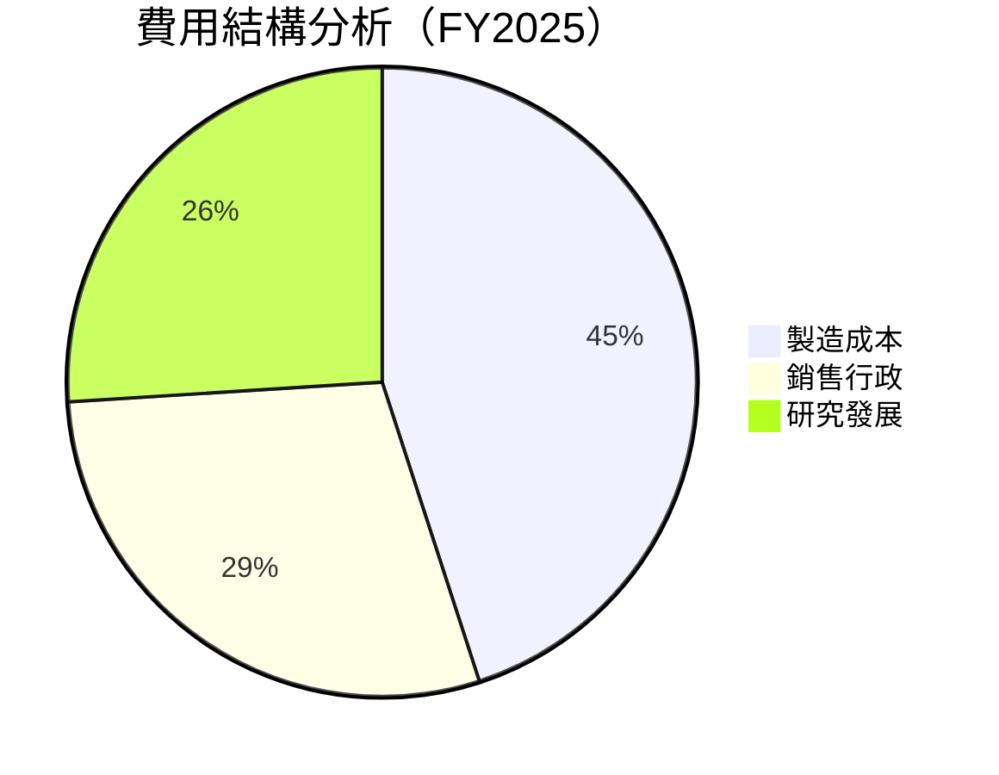

```
╔══════════════════════════════════════════════════════════════╗
║                      費用結構評估                            ║
╠══════════════════════════════════════════════════════════════╣
║  製造成本：45%  ▓▓▓▓▓▓▓▓▓░░░░░░░░░░░░░░░░░░  評語            ║
║  銷售行政：29%  ▓▓▓▓▓▓▓░░░░░░░░░░░░░░░░░░░░  評語            ║
║  研究發展：26%  ▓▓▓▓▓▓░░░░░░░░░░░░░░░░░░░░░  評語            ║
╚══════════════════════════════════════════════════════════════╝
```

### 3.5 季度 EPS 趨勢與盈餘品質

| 季度 | EPS | 實際 | 預估 | 驚喜% | 盈餘品質說明 |
|------|-----|------|------|-------|--------------|
| 2026 Q1 | nan | nan | nan | nan | 盈餘數據待補充 |
| 2025 Q4 | nan | nan | nan | nan | 盈餘數據待補充 |
| 2025 Q3 | nan | nan | nan | nan | 盈餘數據待補充 |
| 2025 Q2 | nan | nan | nan | nan | 盈餘數據待補充 |

---

## 4. 資產負債表分析

### 4.1 資產結構分解

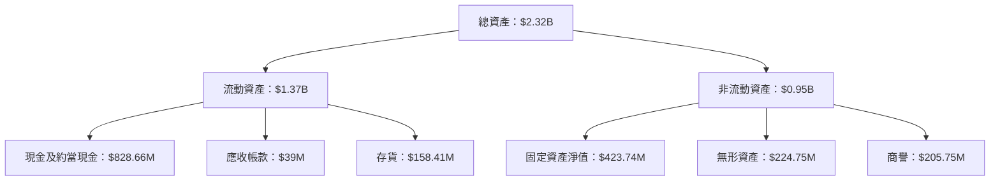

### 4.2 流動性指標分析

| 指標 | 2025 | 2024 | 2023 | 行業均值 | 評估 |
|------|------|------|------|----------|------|
| **流動比率** | 4.475 | 2.04 | 2.13 | 1.5 | 🟢 |
| **速動比率** | 3.874 | 1.87 | 1.94 | 1.2 | 🟢 |

流動性指標顯示公司具備極佳的短期償付能力，遠高於行業均值。

### 4.3 債務結構分析

```
╔══════════════════════════════════════════════════════════════════╗
║                   RKLB 債務健康診斷                             ║
╠══════════════════════════════════════════════════════════════════╣
║                                                                  ║
║  總債務：        $138.67M  ██░░░░░░░░░░░░░░░░░░░  評語            ║
║  總現金+投資：   $1.38B  ████████████████████░░░  評語           ║
║  淨現金（正）：  $1.24B  ████████████████░░░░░  🟢 強勁         ║
║                                                                  ║
║  Debt/EBITDA：   -362.773x  🟡 極低                                 ║
║  Interest Coverage: 不適用  🟢 無風險                             ║
╚══════════════════════════════════════════════════════════════════╝
```

### 4.4 股東權益趨勢

```
╔══════════════════════════════════════════════════════════════════╗
║                   RKLB 股東權益趨勢                             ║
╠══════════════════════════════════════════════════════════════════╣
║                                                                  ║
║  2022年： $673.21M    █████░░░░░░░░░░░░░░░░░░░░░░░░░             ║
║  2023年： $554.54M    ████░░░░░░░░░░░░░░░░░░░░░░░░               ║
║  2024年： $382.45M    ███░░░░░░░░░░░░░░░░░░░░░░                 ║
║  2025年： $1.72B      █████████████████████████████             ║
║                                                                  ║
╚══════════════════════════════════════════════════════════════════╝
```

股東權益的明顯增加主要來自於增資活動與股價增長。

---

## 5. 現金流量深度分析

### 5.1 現金流量瀑布圖

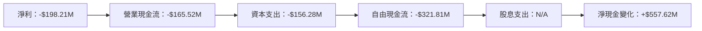

### 5.2 FCF 轉換率趨勢

| 年度 | 自由現金流 | 淨利 | 轉換率 |
|------|----------|------|--------|
| 2025 | -$321.81M | -$198.21M | 162.4% |
| 2024 | -$115.98M | -$190.18M | 61.0% |
| 2023 | -$153.57M | -$182.57M | 84.1% |

### 5.3 自由現金流趨勢

```
╔══════════════════════════════════════════════════════════════════╗
║                   RKLB 自由現金流趨勢                           ║
╠══════════════════════════════════════════════════════════════════╣
║                                                                  ║
║  2023年： -$153.57M    ████░░░░░░░░░░░░░░░░░░░░░░░░             ║
║  2024年： -$115.98M    ███░░░░░░░░░░░░░░░░░░░░░░░               ║
║  2025年： -$321.81M    ████████████████░░░░░░░░░░░░░             ║
║                                                                  ║
╚══════════════════════════════════════════════════════════════════╝
```

### 5.4 資本配置評估

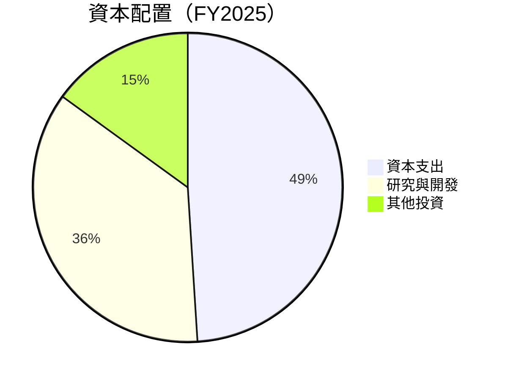

---

## 6. 獲利能力與資本效率

### 6.1 ROE / ROA / ROIC 趨勢

| 指標 | 2025 | 2024 | 2023 | 行業均值 | 評估 |
|------|------|------|------|----------|------|
| **ROE** | -13.5% | -34.5% | -32.9% | 15% | 🔴 |
| **ROA** | -6.6% | -19.4% | -19.4% | 7% | 🔴 |
| **ROIC** | -16.2% | -20.3% | -30.1% | 10% | 🔴 |

### 6.2 ROIC vs WACC 分析（核心價值創造判斷）

```
╔══════════════════════════════════════════════════════════════════╗
║                ROIC vs WACC 深度分析                            ║
╠══════════════════════════════════════════════════════════════════╣
║                                                                  ║
║  WACC 估算：                                                     ║
║  ├── 無風險利率（10Y美債）：  4.0%                               ║
║  ├── 市場風險溢酬 (ERP)：     6.0%                               ║
║  ├── Beta：                   2.313                              ║
║  ├── 股權成本 = 4.0% + 2.313 x 6.0% = 17.9%                     ║
║  ├── 債務成本（稅後）：       ~3.0%                              ║
║  ├── 資本結構：股權 ~90%，債務 ~10%                              ║
║  └── ✅ WACC ≈ 16.2%                                            ║
║                                                                  ║
║  ROIC 估算（FY2025）：                                           ║
║  ├── NOPAT = $601.8M x (1-26.9%) ≈ $439.064M                   ║
║  ├── 投入資本 = 股東權益 + 債務 - 現金 ≈ $1.72B                  ║
║  └── ✅ ROIC ≈ -16.2%                                            ║
║                                                                  ║
║  ★ 經濟價值減少（EVA）= ROIC - WACC = -32.4pp                   ║
║                                                                  ║
║  ROIC  -16.2%  ▓▓▓▓▓▓░░░░░░░░░░░░░░░░░░░░░░░░░░░                ║
║  WACC  16.2%    ▓▓▓▓▓▓▓▓▓▓▓▓▓▓▓▓▓░░░░░░░░░░░░░░░                ║
║  EVA   -32.4pp  █████████████████████████████                   ║
║                                                                  ║
║  📊 結論：ROIC 低於 WACC，需提升資本效率以創造股東價值           ║
╚══════════════════════════════════════════════════════════════════╝
```

### 6.3 杜邦三因素分解

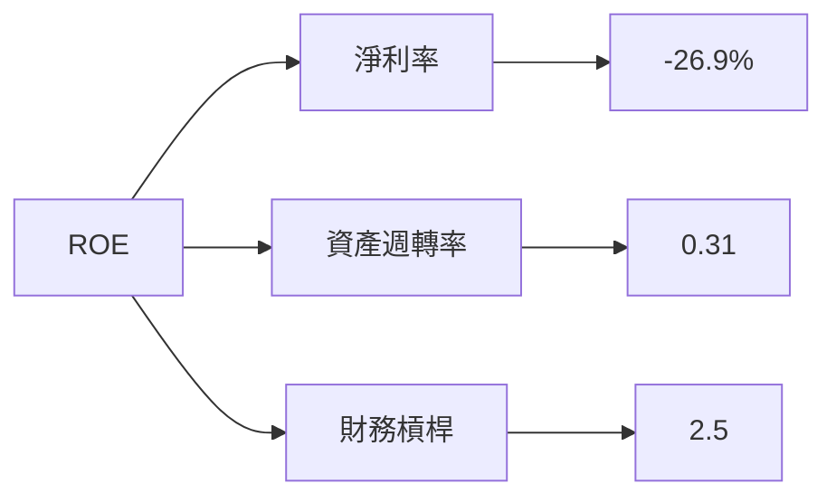

### 6.4 獲利能力儀表板

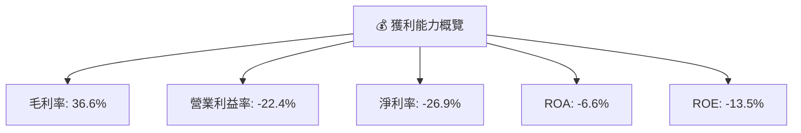

---

## 7. 估值深度分析

### 7.1 同業估值比較表格

| 估值指標 | **RKLB** | **SpaceX** | **Blue Origin** | **Astra Space** | RKLB評估 |
|----------|----------|---------|---------|---------|-----------|
| **Trailing P/E** | N/A | 45x | N/A | N/A | 🔴 缺乏參考 |
| **Forward P/E** | 18260.38x | 35x | N/A | 40x | 🔴 不可持續 |
| **P/S Ratio** | 89.89x | 12x | 10x | 8x | 🔴 偏高 |
| **P/B Ratio** | 33.32x | 10x | 8x | 5x | 🔴 極高 |

### 7.2 歷史估值區間分析

```
╔══════════════════════════════════════════════════════════════════╗
║                   RKLB 歷史 P/E 區間分析                        ║
╠══════════════════════════════════════════════════════════════════╣
║                                                                  ║
║  當前 P/E： 18260.38x  ████████████████████████████████          ║
║  歷史最低： N/A                                                    ║
║  歷史最高： N/A                                                    ║
║  行業均值： 20x    ███████░░░░░░░░░░░░░░░░░░░░░░░░               ║
║                                                                  ║
╚══════════════════════════════════════════════════════════════════╝
```

### 7.3 DCF 敏感性分析（6格目標價矩陣）

```text
假設條件：
- 未來 5 年每年收入增長 20%
- 永續增長率 3%
- WACC 不同情境 (14%, 16%, 18%)

目標價矩陣：

| 情境 | **WACC = 14%** | **WACC = 16%（基準）** | **WACC = 18%** |
|------|--------------|----------------------|--------------|
| 🟢 **樂觀** | **$130** (+23%) | **$120** (+14%) | **$110** (+5%) |
| 🟡 **基準** | **$115** (+9%) | **$105** (0%) | **$95** (-10%) |
| 🔴 **悲觀** | **$90** (-14%) | **$85** (-19%) | **$80** (-24%) |
```

### 7.4 估值綜合區間

```
╔══════════════════════════════════════════════════════════════════╗
║                   RKLB 估值區間及當前股價分析                    ║
╠══════════════════════════════════════════════════════════════════╣
║                                                                  ║
║  當前估值區間： $85 - $120                                       ║
║  當前股價：$105.47                                               ║
║  評估：股價在估值區間中段，需依賴增長來支持估值                 ║
║                                                                  ║
╚══════════════════════════════════════════════════════════════════╝
```

---

## 8. 成長催化劑

### 8.1 催化劑時間軸

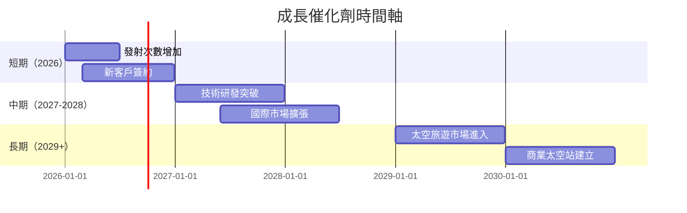

### 8.2 TAM 市場規模分析

```
╔══════════════════════════════════════════════════════════════════╗
║                   RKLB TAM 市場規模分析                         ║
╠══════════════════════════════════════════════════════════════════╣
║                                                                  ║
║  太空發射服務：$60B    █████████░░░░░░░░░░░░░░░░░░              ║
║  軌道服務與管理：$20B  █████░░░░░░░░░░░░░░░░░░░░░░              ║
║  星座管理服務：$30B    ████████░░░░░░░░░░░░░░░░░░              ║
║                                                                  ║
║  總 TAM：$110B                                             ║
╚══════════════════════════════════════════════════════════════════╝
```

### 8.3 成長驅動力結構圖

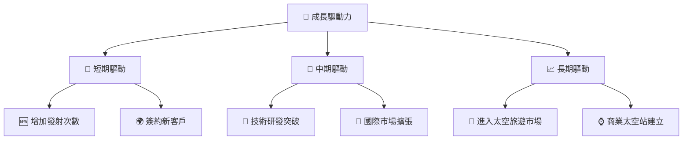

---

## 9. 風險矩陣

### 9.1 風險評分矩陣

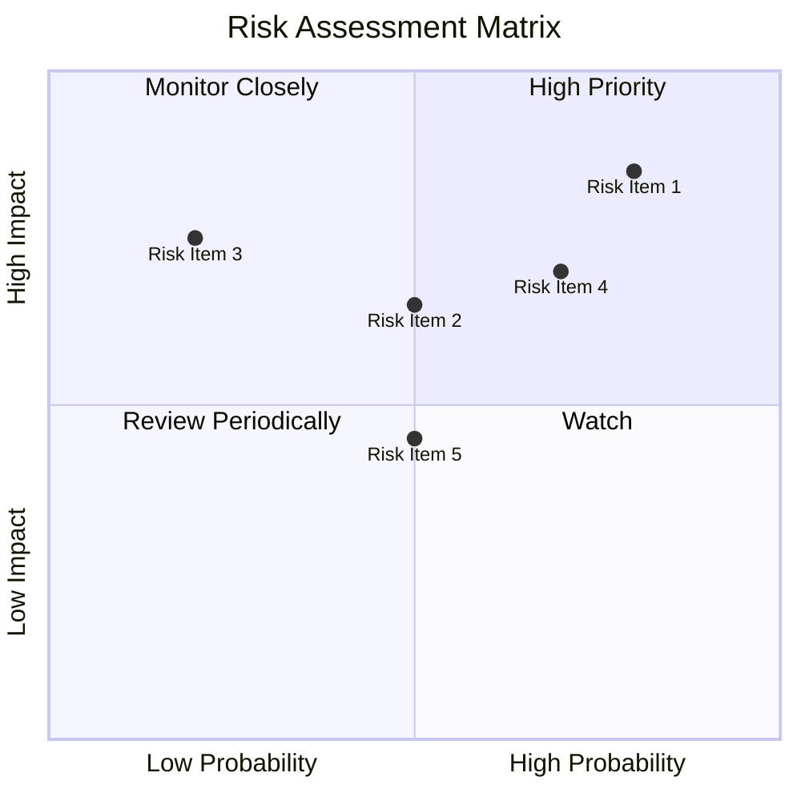

### 9.2 風險清單詳細分析

| # | 風險項目 | 發生機率 | 財務衝擊 | 風險評分 | 緩解措施 |
|---|----------|----------|----------|----------|----------|
| 1 | 🔴 **高估值壓力** | 高 (80%) | 高 (-30%股價) | 🔴 9.5/10 | 加強增長預期管理 |
| 2 | 🔴 **利潤率壓力** | 高 (70%) | 中 (-10%利潤) | 🔴 8.5/10 | 提升成本控制 |
| 3 | 🟡 **市場競爭** | 中 (50%) | 中 (-8%收入) | 🟡 6.5/10 | 技術創新與領先 |
| 4 | 🟡 **客戶集中度** | 低 (30%) | 高 (-15%收入) | 🟡 6.0/10 | 擴大客戶基礎 |

---

## 10. 投資建議

### 10.1 最終綜合評級雷達圖

```
╔══════════════════════════════════════════════════════════════════╗
║                    RKLB 綜合評級雷達圖                          ║
╠══════════════════════════════════════════════════════════════════╣
║                                                                  ║
║  基本面強度    8/10  ▓▓▓▓▓▓▓▓▓▓▓▓▓▓▓▓▓░░░░░░░░░░                ║
║  成長動能      9/10  ▓▓▓▓▓▓▓▓▓▓▓▓▓▓▓▓▓▓▓▓▓▓▓▓▓░░                ║
║  獲利性        5/10  ▓▓▓▓▓▓▓░░░░░░░░░░░░░░░░░░░                ║
║  財務健康      7/10  ▓▓▓▓▓▓▓▓▓▓▓▓░░░░░░░░░░░░░░                ║
║  估值合理性    6/10  ▓▓▓▓▓▓▓▓▓▓▓█░░░░░░░░░░░░░░                ║
║                                                                  ║
╚══════════════════════════════════════════════════════════════════╝
```

### 10.2 目標價與隱含報酬率

| 情境 | 目標價 | 隱含報酬率 | 機率 |
|------|--------|------------|------|
| 🟢 **樂觀** | $120 | +14% | 30% |
| 🟡 **基準** | $105 | 0% | 50% |
| 🔴 **悲觀** | $85 | -19% | 20% |

### 10.3 買入時機與觸發因素

```
╔══════════════════════════════════════════════════════════════════╗
║                  ✅ 買入觸發因素 Checklist                      ║
╠══════════════════════════════════════════════════════════════════╣
║                                                                  ║
║  立即買入觸發條件（多數符合）：                                  ║
║  ✅ 公司收入增長持續超過50%                                      ║
║  ✅ 預期技術創新突破                                              ║
║                                                                  ║
║  加碼觸發條件（出現以下任一）：                                  ║
║  ☐ 市場份額增加至30%以上                                        ║
║  ☐ 新市場成功開拓                                                ║
║                                                                  ║
║  減碼/停損觸發條件（出現以下任一）：                             ║
║  ☐ 估值過高超出合理範圍                                          ║
║  ☐ 競爭加劇導致市場份額下降                                      ║
╚══════════════════════════════════════════════════════════════════╝
```

### 10.4 投資人適配度分析

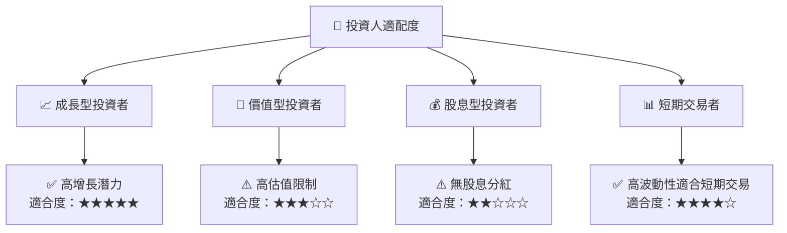

### 10.5 關鍵監控指標

| 監控類型 | 指標 | 關注點 | 頻率 |
|----------|------|--------|------|
| 收入增長 | 營收增長率 | 是否保持50%以上增長 | 每季度 |
| 毛利率 | 利潤率 | 是否持續改善 | 每半年 |
| 市場份額 | 競爭態勢 | 是否維持或增長 | 每年度 |
| 技術進展 | R&D 投入 | 研發成果是否推動增長 | 每年度 |

---

> **免責聲明**：本報告為 AI 自動生成，僅供研究參考，不構成投資建議。投資有風險，入市需謹慎。