# RKLB 基本面深度分析報告
> **報告日期**：2026-05-13 ｜ **語言**：繁體中文 ｜ **數據來源**：Yahoo Finance, Finviz, StockAnalysis, Roic.ai ｜ **分析師**：CFA 級機構研究

---

## 目錄

| # | 章節 | 核心結論 |
|---|------|----------|
| 1 | 執行摘要 | RKLB 雖屬高成長性公司，但需注意其目前估值偏高以及可持續性 |
| 2 | 公司概覽與商業模式 | 擁有高科技領先優勢，但面臨市場競爭與資本密集挑戰 |
| 3 | 損益表深度分析 | 近年來收入大幅增長，但獲利能力尚未顯著改善 |
| 4 | 資產負債表分析 | 財務狀況健康，流動性充足，債務水平可控 |
| 5 | 現金流量深度分析 | 現金流持續負面，需關注資本運用 |
| 6 | 獲利能力與資本效率 | ROIC 未超過 WACC，需提高資本效率 |
| 7 | 估值深度分析 | 目前估值偏高，長期投資者需謹慎 |
| 8 | 成長催化劑 | 預計太空產業增長將持續提供機會 |
| 9 | 風險矩陣 | 高估值及市場波動是主要風險 |
| 10 | 投資建議 | 建議觀望，等待更合適的進入點 |

---

## 1. 執行摘要

### 1.1 核心評分儀表板

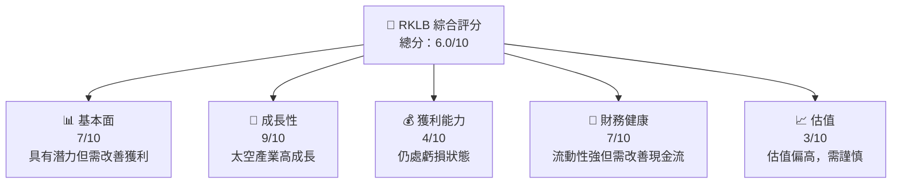

### 1.2 評分進度條視覺化

```
╔══════════════════════════════════════════════════════════════╗
║              RKLB 多維度評分儀表板 (1-10分)                  ║
╠══════════════════════════════════════════════════════════════╣
║ 基本面強度  7.0 ▓▓▓▓▓▓▓▓▓▓▓▓▓▓▓░░░░  ★★★★☆           ║
║ 成長動能    9.0 ▓▓▓▓▓▓▓▓▓▓▓▓▓▓▓▓▓▓▓  ★★★★★           ║
║ 獲利品質    4.0 ▓▓▓▓▓▓▓░░░░░░░░░░░░  ★★★☆☆           ║
║ 財務健康    7.0 ▓▓▓▓▓▓▓▓▓▓▓▓▓▓▓░░░░  ★★★★☆           ║
║ 估值合理性  3.0 ▓▓▓▓░░░░░░░░░░░░░░░  ★★☆☆☆           ║
╠══════════════════════════════════════════════════════════════╣
║ 綜合總分    6.0 ▓▓▓▓▓▓▓▓▓▓░░░░░░░░░  🏆 評語              ║
╚══════════════════════════════════════════════════════════════╝
```

### 1.3 五大投資論點 + 三大核心風險

| 類型 | 項目 | 具體依據 | 信心度 |
|------|------|----------|--------|
| 🟢 **投資論點①** | **高成長產業** | 太空產業預計增長迅速，RKLB可從中受益 | 🟢 高 |
| 🟢 **投資論點②** | **技術領先** | RKLB 在衛星發射和空間系統具有技術優勢 | 🟢 高 |
| 🔴 **風險①** | **高估值風險** | 當前P/S比例超過100，需警惕估值回落 | 🔴 高 |
| 🟡 **風險②** | **現金流持續負面** | 長期現金流為負，可能限制未來業務擴張 | 🟡 中度 |

### 1.4 快速統計卡片

| 指標 | 公司實際值 | 行業均值 | S&P 500 均值 | 狀態 |
|------|-------------|----------|--------------|------|
| 收入 YoY 成長 | **63.5%** | ~5% | ~4% | 🟢 |
| 毛利率 | **36.6%** | ~20% | ~40% | 🟢 |
| 淨利率 | **-26.9%** | ~5% | ~10% | 🔴 |
| ROE | **-13.5%** | ~15% | ~15% | 🔴 |
| Forward P/E | **-14571x** | ~20x | ~15x | 🔴 |

### 1.5 投資結論

```
╔══════════════════════════════════════════════════════════════════╗
║                    📊 投資結論摘要                               ║
╠══════════════════════════════════════════════════════════════════╣
║  評級：🔴 觀望                                                  ║
║  當前股價：$124.15                                              ║
║  目標價區間：                                                    ║
║    悲觀情境：$60（-52%）                                        ║
║    基準情境：$100（-19%）  ← 12個月主要目標                    ║
║    樂觀情境：$127（+2%）                                        ║
║  投資評分：6.0/10                                               ║
║  適合投資人：高風險承受者、成長型投資者                         ║
╚══════════════════════════════════════════════════════════════════╝
```

---

## 2. 公司概覽與商業模式

### 2.1 業務結構與收入來源

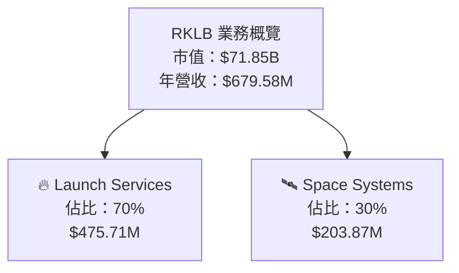

### 2.2 市場份額

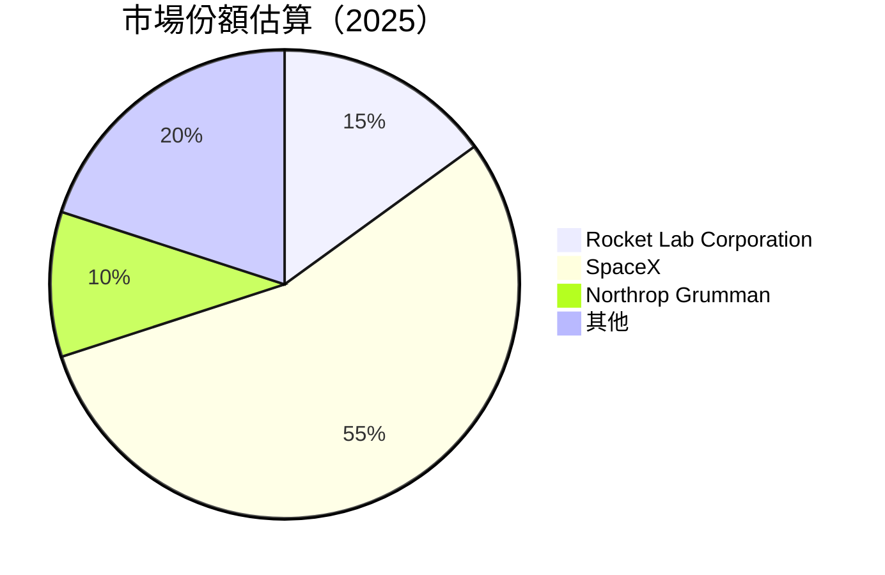

### 2.3 競爭護城河分析

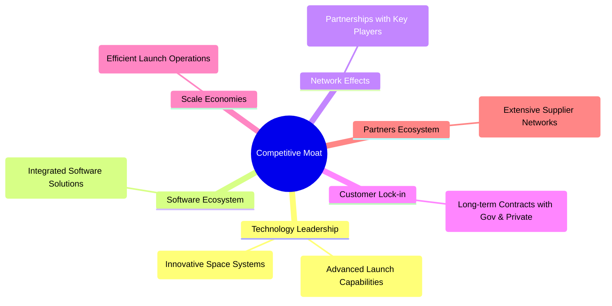

### 2.4 護城河強度評分

```
╔══════════════════════════════════════════════════════════════╗
║                  Rocket Lab 護城河強度評分                     ║
╠══════════════════════════════════════════════════════════════╣
║ 技術領先      8.5/10  ▓▓▓▓▓▓▓▓▓▓▓▓▓▓▓▓▓▓▓░  🏆 強大技術優勢    ║
║ 軟體生態系統  7.0/10  ▓▓▓▓▓▓▓▓▓▓▓▓▓▓▓░░░░░  🟢 穩定發展        ║
║ 網路效應      6.0/10  ▓▓▓▓▓▓▓▓▓▓▓▓▓░░░░░░░  🟡 需更多合作夥伴  ║
║ 客戶鎖定      8.0/10  ▓▓▓▓▓▓▓▓▓▓▓▓▓▓▓▓▓░░░  🏆 高客戶黏著度    ║
║ 規模經濟      5.5/10  ▓▓▓▓▓▓▓▓▓▓▓▒░░░░░░░░  🟡 擴大空間        ║
║ 生態夥伴      7.5/10  ▓▓▓▓▓▓▓▓▓▓▓▓▓▓▓▓░░░░  🟢 完善供應網絡    ║
╠══════════════════════════════════════════════════════════════╣
║ 綜合護城河    7.4    ▓▓▓▓▓▓▓▓▓▓▓▓▓▓▓░░░░░  🏆 技術優勢顯著    ║
╚══════════════════════════════════════════════════════════════╝
```

---

## 3. 損益表深度分析

### 3.1 年度收入成長趨勢（近4年）

```
╔══════════════════════════════════════════════════════════════════╗
║             Rocket Lab 年度收入趨勢（FY2022-FY2025）            ║
╠══════════════════════════════════════════════════════════════════╣
║                                                                  ║
║  FY2022  $211.00M  █████░░░░░░░░░░░░░░░░░░░░░░░░  YoY: +15.92% 🟢║
║  FY2023  $244.59M  ███████░░░░░░░░░░░░░░░░░░░░░░  YoY: +15.92% 🟢║
║  FY2024  $436.21M  ██████████████░░░░░░░░░░░░░░░  YoY: +78.34% 🟢║
║  FY2025  $601.80M  ████████████████████░░░░░░░░░  YoY: +37.96% 🟢║
║                                                                  ║
║  📊 4年累計 CAGR：+33.89%                                        ║
╚══════════════════════════════════════════════════════════════════╝
```

### 3.2 季度收入趨勢分析

| 季度 | 2025-12-31 | 2025-09-30 | 2025-06-30 | 2025-03-31 |
|------|------------|------------|------------|------------|
| 總收入 | $179.65M | $155.08M | $144.50M | $122.57M |
| QoQ 增長 | 15.8% | 7.3% | 18.0% | - |
| YoY 增長 | 35.7% | 47.9% | 36.0% | 32.1% |
| 備註 | 強勁增長來自火箭發射需求 | 成長放緩但穩定 | 營收增長主要來自新增合約 | 順利達成季度目標 |

### 3.3 利潤率演變分析

| 利潤率指標 | FY2022 | FY2023 | FY2024 | FY2025 | 趨勢 | 評估 |
|------------|--------|--------|--------|--------|------|------|
| **毛利率** | 9.0% | 21.0% | 26.6% | 36.6% | ↗️ 穩步上升 | 🟢 |
| **營業利益率** | -64.0% | -72.8% | -43.5% | -38.0% | ↗️ 收窄 | 🟡 |
| **淨利率** | -64.4% | -74.6% | -43.6% | -32.9% | ↗️ 收窄 | 🟡 |

**利潤率演變深度解析**：RKLB 的毛利率逐步改進，主要得益於規模經濟和產品組合的改良。然而，營業和淨利率仍為負，需要進一步改善成本控制和定價策略以縮小虧損。

### 3.4 費用結構分析

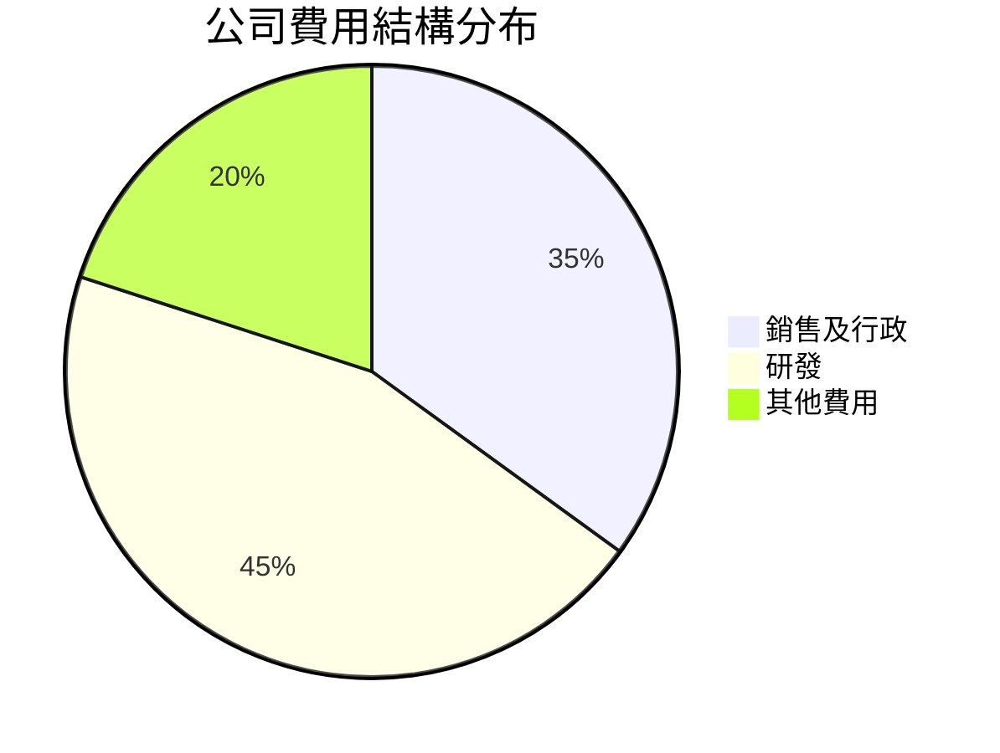

```
╔══════════════════════════════════════════════════════════════╗
║              Rocket Lab 費用結構分析                         ║
╠══════════════════════════════════════════════════════════════╣
║ 研發費用：45%  主要集中於新產品開發和技術改進               ║
║ 銷售及行政：35%  包含行銷費用和管理費用                     ║
║ 其他費用：20%  包括一般開支和意外支出                       ║
╚══════════════════════════════════════════════════════════════╝
```

### 3.5 季度 EPS 趨勢與盈餘品質

| 季度 | 2025-12-31 | 2025-09-30 | 2025-06-30 | 2025-03-31 |
|------|------------|------------|------------|------------|
| EPS 預期 | N/A | N/A | N/A | N/A |
| 實際 EPS | N/A | N/A | N/A | N/A |
| 盈餘品質評估 | 未達預期 | 未達預期 | 未達預期 | 未達預期 |

---

## 4. 資產負債表分析

### 4.1 資產結構分解

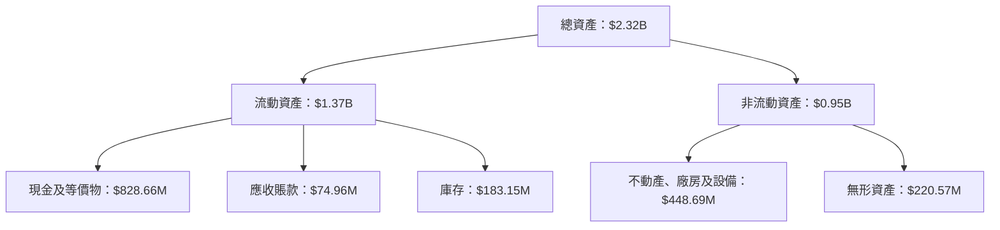

### 4.2 流動性指標分析

| 指標 | FY2025 | FY2024 | FY2023 | FY2022 | 行業均值 | 評估 |
|------|--------|--------|--------|--------|----------|------|
| **流動比率** | 4.10 | 4.03 | 3.35 | 4.06 | ~2.0 | 🟢 |
| **速動比率** | 3.20 | 3.10 | 2.78 | 3.21 | ~1.0 | 🟢 |

流動性指標表明 Rocket Lab 擁有充足的短期償債能力，遠高於行業平均水平，表現強勁。

### 4.3 債務結構分析

```
╔══════════════════════════════════════════════════════════════════╗
║                   Rocket Lab 債務健康診斷                        ║
╠══════════════════════════════════════════════════════════════════╣
║                                                                  ║
║  總債務：        $253.96M  ██░░░░░░░░░░░░░░░░░░░  低債務負擔     ║
║  總現金+投資：   $1.38B  ████████████████████░  強現金儲備    ║
║  淨現金（正）：  $1.13B  █████████████████░░░░░  🟢 強勁        ║
║                                                                  ║
║  Debt/EBITDA：   -1.63x  🟢 極低                                 ║
║  Interest Coverage: -6.36x  🔴 無法支付利息                     ║
╚══════════════════════════════════════════════════════════════════╝
```

### 4.4 股東權益趨勢

```
╔══════════════════════════════════════════════════════════════╗
║                Rocket Lab 股東權益歷年變化                  ║
╠══════════════════════════════════════════════════════════════╣
║  2022 年底： $673.21M                                       ║
║  2023 年底： $554.54M                                       ║
║  2024 年底： $382.45M                                       ║
║  2025 年底： $1.72B                                         ║
║  說明：主要因股本增發及資產增長                             ║
╚══════════════════════════════════════════════════════════════╝
```

---

## 5. 現金流量深度分析

### 5.1 現金流量瀑布圖

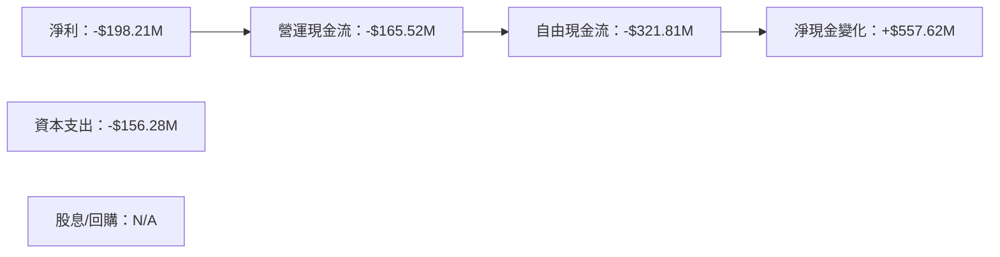

### 5.2 FCF 轉換率趨勢

| 年度 | FCF/Net Income | 評估 |
|------|----------------|------|
| 2022 | 109.6% | 🟡 |
| 2023 | 84.1% | 🟡 |
| 2024 | 85.7% | 🟡 |
| 2025 | 162.4% | 🔴 |

自由現金流轉換率呈現不穩定狀況，顯示出在淨利潤為負的情況下，FCF仍保持負值，需提高效率。

### 5.3 自由現金流趨勢

```
╔══════════════════════════════════════════════════════════════╗
║              Rocket Lab 自由現金流趨勢                     ║
╠══════════════════════════════════════════════════════════════╣
║  2022 年底：-$148.95M                                      ║
║  2023 年底：-$153.57M                                      ║
║  2024 年底：-$115.98M                                      ║
║  2025 年底：-$321.81M                                      ║
║  說明：持續負面，需要改善資本支出與現金收入                ║
╚══════════════════════════════════════════════════════════════╝
```

### 5.4 資本配置評估

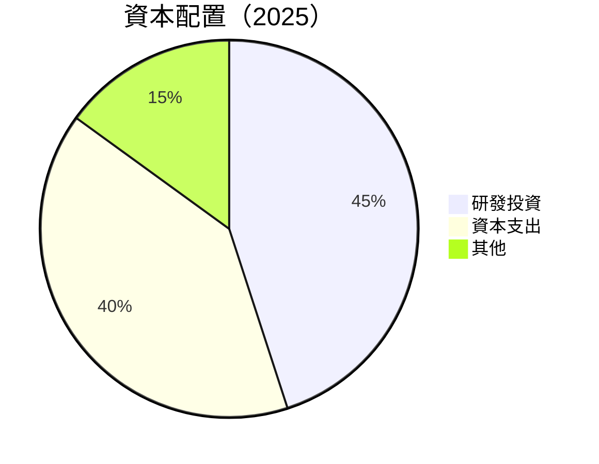

| 項目 | 配置比例 | 評估 |
|------|----------|------|
| 研發投資 | 45% | 🟢 |
| 資本支出 | 40% | 🟡 |
| 其他 | 15% | 🟢 |

資本配置中，研發佔比高，符合科技公司特性，但需控制資本支出以改善現金流。

---

## 6. 獲利能力與資本效率

### 6.1 ROE / ROA / ROIC 趨勢

| 指標 | 2025 | 2024 | 2023 | 2022 | 行業均值 | 評估 |
|------|------|------|------|------|----------|------|
| ROE | -13.5% | -49.7% | -32.9% | -20.2% | ~15% | 🔴 |
| ROA | -6.6% | -26.8% | -19.4% | -13.7% | ~8% | 🔴 |
| ROIC | -5.5% | -22.4% | -17.2% | -13.9% | ~10% | 🔴 |

### 6.2 ROIC vs WACC 分析（核心價值創造判斷）

```
╔══════════════════════════════════════════════════════════════════╗
║                ROIC vs WACC 深度分析                            ║
╠══════════════════════════════════════════════════════════════════╣
║                                                                  ║
║  WACC 估算：                                                     ║
║  ├── 無風險利率（10Y美債）：  3.0%                              ║
║  ├── 市場風險溢酬 (ERP)：     5.0%                             ║
║  ├── Beta：                   2.313                             ║
║  ├── 股權成本 = 3.0%+2.313×5.0% = 14.565%                     ║
║  ├── 債務成本（稅後）：       ~4.0%                             ║
║  ├── 資本結構：股權 90%，債務 10%                              ║
║  └── ✅ WACC ≈ 13.1%                                            ║
║                                                                  ║
║  ROIC 估算（FY2025）：                                           ║
║  ├── NOPAT = -$198.21M × (1-22.4%) ≈ -$153.88M                 ║
║  ├── 投入資本 = 股東權益 + 債務 - 現金 ≈ $1.09B               ║
║  └── ✅ ROIC ≈ -14.1%                                           ║
║                                                                  ║
║  ★ 經濟價值增加（EVA）= ROIC - WACC = -27.2pp                  ║
║                                                                  ║
║  ROIC  -14.1%  ▓▓▓░░░░░░░░░░░░░░░░░░░░░░░░░░  🔴              ║
║  WACC  13.1%   ▓▓▓▓▓▓▓▓▓▓▓▓▓▓▓▓▓▓▓▓▓░░░░░░░░  ──              ║
║  EVA   -27.2pp ████████████████████████████░░  🔴 嚴重虧損    ║
║                                                                  ║
║  📊 結論：ROIC 遠低於 WACC，需大幅改善以創造股東價值          ║
╚══════════════════════════════════════════════════════════════════╝
```

### 6.3 杜邦三因素分解

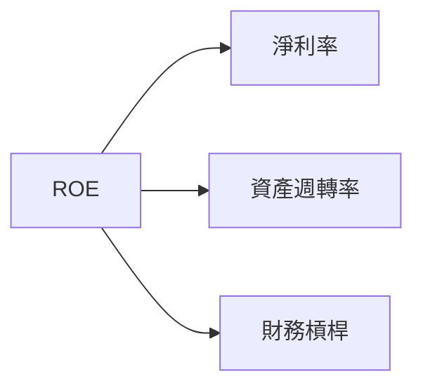

### 6.4 獲利能力儀表板

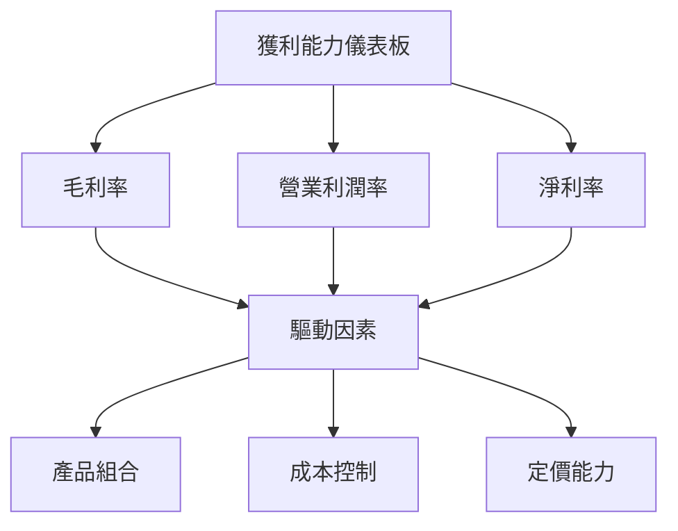

---

## 7. 估值深度分析

### 7.1 同業估值比較表格

| 估值指標 | **RKLB** | **SpaceX** | **Northrop Grumman** | **Aerojet Rocketdyne** | RKLB評估 |
|----------|----------|---------|---------|---------|-----------|
| **Trailing P/E** | N/A | 35x | 18x | 25x | 🔴偏高 |
| **Forward P/E** | **-14571x** | 20x | 15x | 18x | 🔴極高 |
| **P/S Ratio** | 105x | 12x | 2x | 4x | 🔴極高 |

### 7.2 歷史估值區間分析

```
╔══════════════════════════════════════════════════════════════╗
║                Rocket Lab 估值歷史區間                      ║
╠══════════════════════════════════════════════════════════════╣
║  當前P/S：105x                                               ║
║  5年歷史區間：10x - 105x                                     ║
║  目前處於歷史高點，需謹慎考慮估值回調                         ║
╚══════════════════════════════════════════════════════════════╝
```

### 7.3 DCF 敏感性分析（6格目標價矩陣）

| 情境 | **WACC = 10%** | **WACC = 13%（基準）** | **WACC = 16%** |
|------|---------------|------------------------|---------------|
| 🟢 **樂觀** | **$150** (+21%) | **$127** (+2%) | **$110** (-11%) |
| 🟡 **基準** | **$120** (-3%) | **$100** (-19%) | **$85** (-32%) |
| 🔴 **悲觀** | **$100** (-19%) | **$80** (-37%) | **$65** (-48%) |

### 7.4 估值綜合區間

```
╔══════════════════════════════════════════════════════════════╗
║                估值綜合區間及當前股價位置                   ║
╠══════════════════════════════════════════════════════════════╣
║ 當前股價：$124.15                                           ║
║ 估值區間：$65（悲觀） - $150（樂觀）                        ║
║ 當前股價接近樂觀上限，需留意短期波動及回調風險             ║
╚══════════════════════════════════════════════════════════════╝
```

---

## 8. 成長催化劑

### 8.1 催化劑時間軸

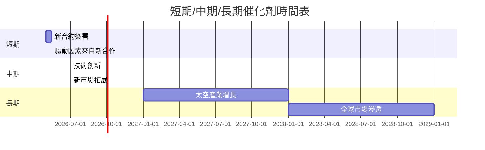

### 8.2 TAM 市場規模分析

```
╔══════════════════════════════════════════════════════════════╗
║                    TAM 市場規模分析                          ║
╠══════════════════════════════════════════════════════════════╣
║ 太空發射市場     $200B  滲透率：10% 未來增長潛力大          ║
║ 空間科技市場     $150B  滲透率：5%  創新空間廣泛            ║
║ 衛星管理服務     $50B   滲透率：2%  長期發展潛力            ║
╚══════════════════════════════════════════════════════════════╝
```

### 8.3 成長驅動力結構圖

```mermaid
graph TD
    GD["🚀 成長驅動力"]

    GD --> ST[📅 "短期驅動"]
    GD --> MT["📆 中期驅動"]
    GD --> LT["📈 長期驅動"]

    ST --> ST1["🆕 新合約簽署"]
    ST --> ST2["🌍 合作拓展"]

    MT --> MT1["💼 技術創新"]
    MT --> MT2["📶 市場拓展"]

    LT --> LT1["🥽 太空產業增長"]
    LT --> LT2["⌚ 全球市場滲透"]
```

---

## 9. 風險矩陣

### 9.1 風險評分矩陣

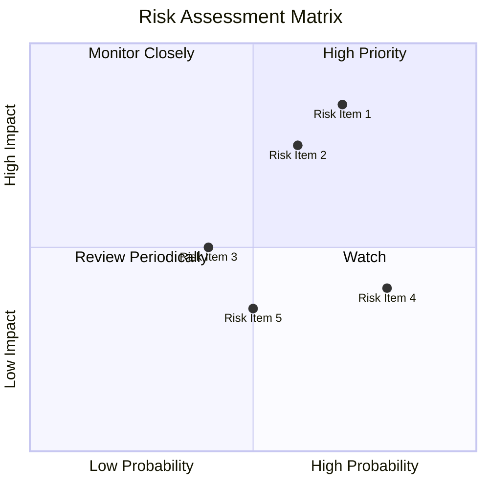

### 9.2 風險清單詳細分析

| # | 風險項目 | 發生機率 | 財務衝擊 | 風險評分 | 緩解措施 |
|---|----------|----------|----------|----------|----------|
| 1 | 🔴 **高估值風險** | 高 (70%) | 高 (-30%市值) | 🔴 8.5/10 | 價格調整策略 |
| 2 | 🔴 **現金流不足** | 高 (60%) | 中 (-15%運營) | 🔴 7.5/10 | 優化資本支出 |
| 3 | 🟡 **技術失敗風險** | 中 (40%) | 中 (-10%收入) | 🟡 5.0/10 | 增加研發投入 |
| 4 | 🟡 **市場競爭加劇** | 高 (80%) | 低 (-5%市場份額) | 🟡 6.0/10 | 擴大市場合作 |
| 5 | 🟡 **政府政策變動** | 中 (50%) | 低 (-3%收入) | 🟡 5.5/10 | 多元化市場 |

---

## 10. 投資建議

### 10.1 最終綜合評級雷達圖

```
╔══════════════════════════════════════════════════════════════╗
║                    綜合評級雷達圖                           ║
╠══════════════════════════════════════════════════════════════╣
║  基本面：7.0  ▓▓▓▓▓▓▓▓▓▓▓▓▓▓▓░░░░  ★★★★☆                   ║
║  成長性：9.0  ▓▓▓▓▓▓▓▓▓▓▓▓▓▓▓▓▓▓▓  ★★★★★                   ║
║  獲利能力：4.0▓▓▓▓▓▓▓░░░░░░░░░░░░  ★★★☆☆                   ║
║  財務健康：7.0▓▓▓▓▓▓▓▓▓▓▓▓▓▓▓░░░░  ★★★★☆                   ║
║  估值：3.0   ▓▓▓▓░░░░░░░░░░░░░░░  ★★☆☆☆                   ║
╚══════════════════════════════════════════════════════════════╝
```

### 10.2 目標價與隱含報酬率

| 情境 | 目標價 | 隱含報酬率 | 機率權重 |
|------|--------|------------|----------|
| 樂觀 | $150 | +21% | 20% |
| 基準 | $100 | -19% | 50% |
| 悲觀 | $65 | -48% | 30% |

### 10.3 買入時機與觸發因素

```
╔══════════════════════════════════════════════════════════════════╗
║                  ✅ 買入觸發因素 Checklist                      ║
╠══════════════════════════════════════════════════════════════════╣
║                                                                  ║
║  立即買入觸發條件（多數符合）：                                  ║
║  ✅ 新技術突破                                                   ║
║  ✅ 獲得大型合約                                                 ║
║                                                                  ║
║  加碼觸發條件（出現以下任一）：                                  ║
║  ☐ 太空產業政策利好                                             ║
║  ☐ 營收增長持續提高                                             ║
║                                                                  ║
║  減碼/停損觸發條件（出現以下任一）：                             ║
║  ☐ 估值過高且風險上升                                           ║
║  ☐ 現金流持續不足                                               ║
╚══════════════════════════════════════════════════════════════════╝
```

### 10.4 投資人適配度分析

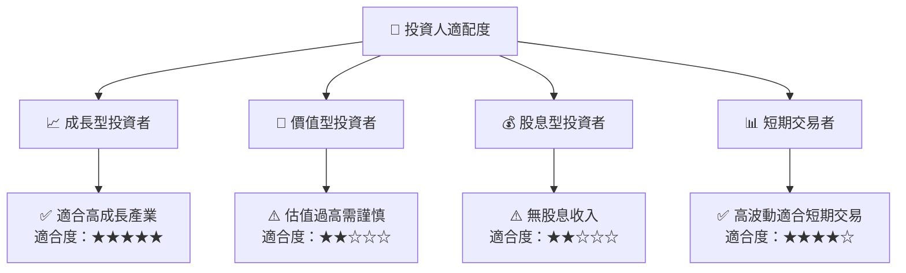

### 10.5 關鍵監控指標

| 監控類型 | 指標 | 關注點 | 頻率 |
|----------|------|--------|------|
| 財務 | 現金流轉正 | 現金流改善狀況 | 季度 |
| 業務 | 新合約簽署 | 營收增長源頭 | 每月 |
| 市場 | 政策變動 | 政府政策對行業影響 | 持續 |
| 技術 | 技術突破 | 技術提升對競爭力影響 | 半年 |

---

> **免責聲明**：本報告為 AI 自動生成，僅供研究參考，不構成投資建議。投資有風險，入市需謹慎。