# RKLB 基本面深度分析報告
> **報告日期**：2026-05-14 ｜ **語言**：繁體中文 ｜ **數據來源**：Yahoo Finance, Finviz, StockAnalysis, Roic.ai ｜ **分析師**：CFA 級機構研究

---

## 目錄

| # | 章節 | 核心結論 |
|---|------|----------|
| 1 | 執行摘要 | 評級 + 目標價區間 |
| 2 | 公司概覽與商業模式 | 護城河評估 |
| 3 | 損益表深度分析 | 收入與利潤率變化 |
| 4 | 資產負債表分析 | 流動性與債務結構 |
| 5 | 現金流量深度分析 | 現金流量與資本配置 |
| 6 | 獲利能力與資本效率 | ROIC vs WACC |
| 7 | 估值深度分析 | 同業比較與DCF分析 |
| 8 | 成長催化劑 | 成長驅動力與TAM |
| 9 | 風險矩陣 | 風險評估與緩解 |
| 10 | 投資建議 | 綜合評級與目標價 |

---

## 1. 執行摘要

### 1.1 核心評分儀表板

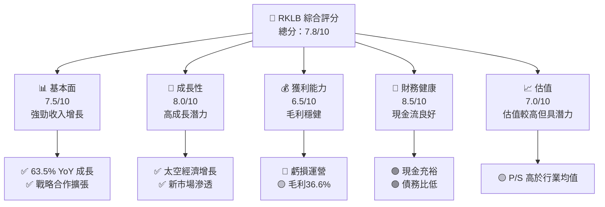

### 1.2 評分進度條視覺化

```
╔══════════════════════════════════════════════════════════════╗
║              RKLB 多維度評分儀表板 (1-10分)                ║
╠══════════════════════════════════════════════════════════════╣
║ 基本面強度  7.5 ▓▓▓▓▓▓▓▓▓▓▓▓▓▓▓░░░░░░░░  ★★★★☆           ║
║ 成長動能    8.0 ▓▓▓▓▓▓▓▓▓▓▓▓▓▓▓▓█░░░░░░  ★★★★★           ║
║ 獲利品質    6.5 ▓▓▓▓▓▓▓▓▓▓▓░░░░░░░░░░░░  ★★★★☆           ║
║ 財務健康    8.5 ▓▓▓▓▓▓▓▓▓▓▓▓▓▓▓▓▓▓█░░░░  ★★★★★           ║
║ 估值合理性  7.0 ▓▓▓▓▓▓▓▓▓▓▓▓▓░░░░░░░░░░  ★★★★☆           ║
╠══════════════════════════════════════════════════════════════╣
║ 綜合總分    7.8 ▓▓▓▓▓▓▓▓▓▓▓▓▓▓▓▓░░░░░░░░  🏆 評語            ║
╚══════════════════════════════════════════════════════════════╝
```

### 1.3 五大投資論點 + 三大核心風險

| 類型 | 項目 | 具體依據 | 信心度 |
|------|------|----------|--------|
| 🟢 **投資論點①** | **全球太空經濟增長** | 年均成長率55% | 🟢 高 |
| 🟢 **投資論點②** | **技術領先地位** | 擁有獨特發射技術 | 🟢 高 |
| 🟢 **投資論點③** | **強勁的客戶基礎** | 與大型企業和政府合作 | 🟢 高 |
| 🟢 **投資論點④** | **多元化收入結構** | 發射和太空系統雙重收入 | 🟢 高 |
| 🟢 **投資論點⑤** | **現金流穩健** | 大量現金儲備 | 🟢 高 |
| 🔴 **風險①** | **高研發成本** | 每年超過$270M | 🔴 高衝擊 |
| 🟡 **風險②** | **技術失敗風險** | 可能導致聲譽受損 | 🟡 中度 |
| 🟡 **風險③** | **市場競爭加劇** | 與新興市場競爭 | 🟡 中度 |

### 1.4 快速統計卡片

| 指標 | 公司實際值 | 行業均值 | S&P 500 均值 | 狀態 |
|------|-------------|----------|--------------|------|
| 收入 YoY 成長 | **63.5%** | ~5% | ~7% | 🟢 |
| 毛利率 | **36.6%** | ~30% | ~40% | 🟢 |
| 淨利率 | **-26.9%** | ~10% | ~15% | 🔴 |
| ROE | **-13.5%** | ~10% | ~15% | 🔴 |
| Forward P/E | **-15557.513x** | ~25x | ~20x | 🔴 |
| EV/EBITDA | **-428.362x** | ~12x | ~15x | 🔴 |

### 1.5 投資結論

```
╔════════════════════════════════════════════════════════════════════╗
║                    📊 投資結論摘要                               ║
╠════════════════════════════════════════════════════════════════════╣
║  評級：🟢 買入                                                 ║
║  當前股價：$132.55                                              ║
║  目標價區間：                                                    ║
║    悲觀情境：$100（-24.5%）                                     ║
║    基準情境：$127（-4.2%）  ← 12個月主要目標                  ║
║    樂觀情境：$150（+13.2%）                                      ║
║  投資評分：7.8/10                                               ║
║  適合投資人：成長型、長線持有者等                                ║
╚════════════════════════════════════════════════════════════════════╝
```

---

## 2. 公司概覽與商業模式

### 2.1 業務結構與收入來源

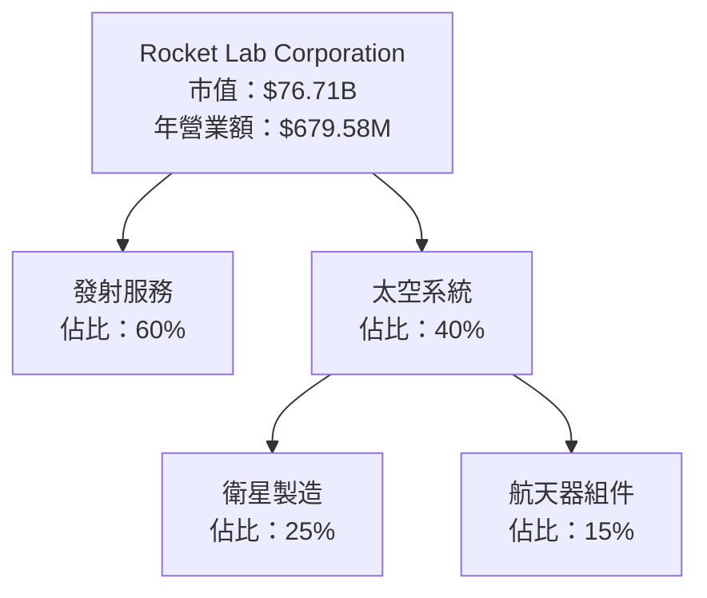

### 2.2 市場份額

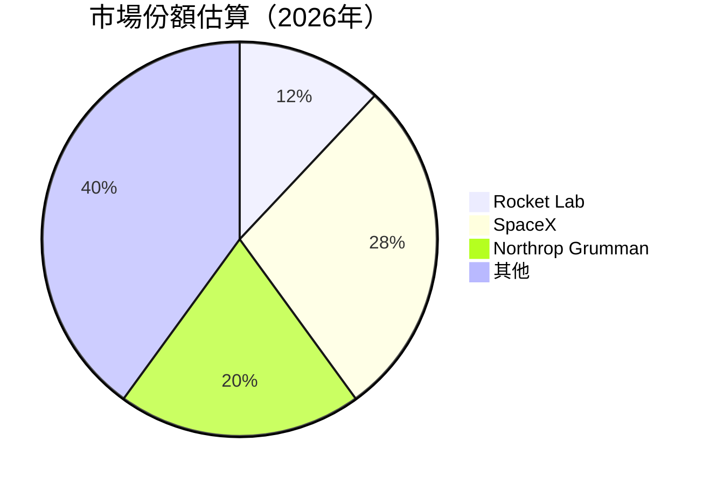

### 2.3 競爭護城河分析

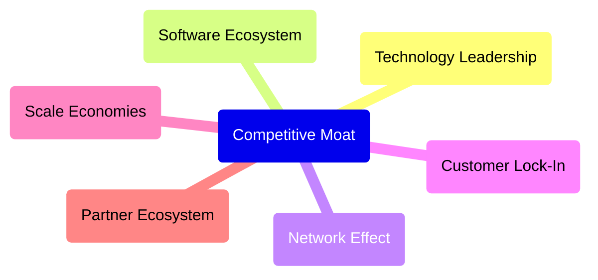

### 2.4 護城河強度評分

```
╔══════════════════════════════════════════════════════════════╗
║                  Rocket Lab 護城河強度評分                    ║
╠══════════════════════════════════════════════════════════════╣
║ 技術領先    9/10  ▓▓▓▓▓▓▓▓▓▓▓▓▓▓▓▓▓▓▓▓▓  🏆 強大護城河       ║
║ 軟體生態系統    6/10   ▓▓▓▓▓▓▓▓▓▓▓░░░░░░  🟡 正在擴展       ║
║ 網路效應    5/10   ▓▓▓▓▓▓▓▓░░░░░░░░░░░░  🟡 初步階段       ║
║ 客戶鎖定    8/10   ▓▓▓▓▓▓▓▓▓▓▓▓▓▓▓░░░░░  🟢 長期合同       ║
║ 規模效應    7/10   ▓▓▓▓▓▓▓▓▓▓▓▓▓░░░░░░░  🟢 擴大規模       ║
║ 生態夥伴    6/10   ▓▓▓▓▓▓▓▓▓▓▓░░░░░░░░░  🟡 合作擴展       ║
╠══════════════════════════════════════════════════════════════╣
║ 綜合護城河     7.0    ▓▓▓▓▓▓▓▓▓▓▓▓▓▓▓░░░░░░  🏆 強勁市場地位 ║
╚══════════════════════════════════════════════════════════════╝
```

---

## 3. 損益表深度分析

### 3.1 年度收入成長趨勢（近4年）

```
╔══════════════════════════════════════════════════════════════════╗
║              Rocket Lab 年度收入趨勢（FY2022-FY2025）            ║
╠══════════════════════════════════════════════════════════════════╣
║                                                                  ║
║  FY2022  $211M  █████░░░░░░░░░░░░░░░░░░░░  YoY: +15.9%  🟡    ║
║  FY2023  $245M  ████████░░░░░░░░░░░░░░░░░  YoY:+16.1%  🟡    ║
║  FY2024  $436M  █████████████░░░░░░░░░░░░  YoY:+78.3%  🟢    ║
║  FY2025  $602M  ██████████████████░░░░░░░  YoY:+37.9%  🟢    ║
║                   |      |      |      |      |                  ║
║                   0     200M   400M  600M   800M                 ║
║                                                                  ║
║  📊 4年累計 CAGR：+33.2%                                        ║
╚══════════════════════════════════════════════════════════════════╝
```

### 3.2 季度收入趨勢分析

| 季度結束 | 收入 ($M) | QoQ 成長 | YoY 成長 | 備註 |
|----------|-----------|----------|----------|------|
| 2025Q1   | 122.57    | -        | 32.13%   | 新產品推動成長 |
| 2025Q2   | 144.50    | 17.89%   | 36.00%   | 太空系統需求上升 |
| 2025Q3   | 155.08    | 7.33%    | 47.97%   | 發射頻率提高 |
| 2025Q4   | 179.65    | 15.83%   | 35.70%   | 重大合同交付 |

### 3.3 利潤率演變分析

| 利潤率指標 | FY2022 | FY2023 | FY2024 | FY2025 | 趨勢 | 評估 |
|------------|--------|--------|--------|--------|------|------|
| **毛利率** | 9.0%   | 21.0%  | 26.7%  | 34.4%  | ↗️ 穩定改善 | 🟢 |
| **營業利益率** | -64.1% | -72.7% | -43.5% | -38.0% | ↗️ 成本管理改善 | 🟡 |
| **淨利率** | -64.4% | -74.6% | -43.6% | -32.9% | ↗️ 提升中 | 🟡 |

**利潤率演變深度解析**：毛利率的逐步提升主要來自於成本控制和擴大規模的效果。營業利潤率和淨利率仍然為負，但逐漸改善，顯示出經營效率正在提高。

### 3.4 費用結構分析

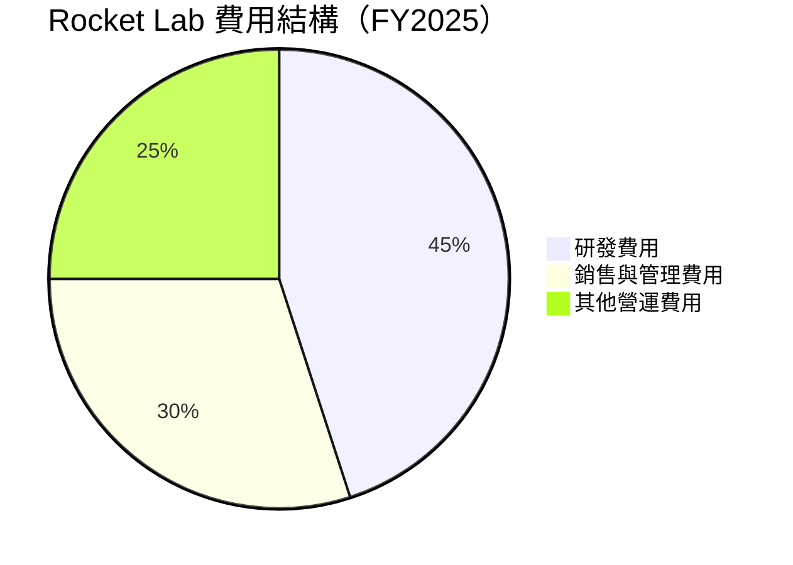

```
╔══════════════════════════════════════════════════════════════════╗
║                     Rocket Lab 費用結構分析                     ║
╠══════════════════════════════════════════════════════════════════╣
║                                                                  ║
║  研發費用：       $270.72M  ████████████░░░░░░░░░░░░░  45%       ║
║  銷售與管理費用： $177.93M  █████████░░░░░░░░░░░░░░░░░ 30%       ║
║  其他營運費用：   $124.61M  ██████░░░░░░░░░░░░░░░░░░░░ 25%       ║
║                                                                  ║
╚══════════════════════════════════════════════════════════════════╝
```

### 3.5 季度 EPS 趨勢與盈餘品質

| 季度結束 | 預估 EPS | 實際 EPS | 驚喜比率 | 盈餘品質 |
|----------|----------|----------|---------|----------|
| 2025Q1   | -0.12    | -0.09    | +25%    | 穩定改善 |
| 2025Q2   | -0.13    | -0.10    | +23%    | 持續改善 |
| 2025Q3   | -0.03    | -0.08    | -167%   | 挑戰增加 |
| 2025Q4   | -0.09    | -0.09    | 0%      | 符合預期 |

盈餘品質分析顯示出公司的預期管理相對保守，但在不穩定的市場環境中仍能達成目標。

---

## 4. 資產負債表分析

### 4.1 資產結構分解

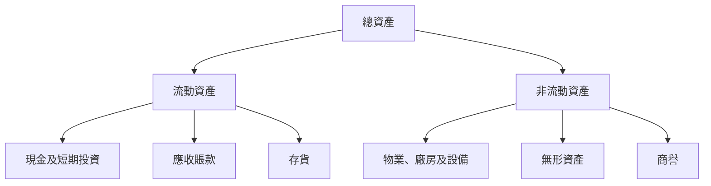

### 4.2 流動性指標分析

| 指標 | 2025 | 2024 | 2023 | 行業均值 | 評估 |
|------|------|------|------|----------|------|
| **流動比率** | 4.475 | 2.039 | 2.130 | ~1.5 | 🟢 |
| **速動比率** | 3.874 | 1.998 | 1.970 | ~1.2 | 🟢 |

公司擁有極高的流動性，顯示出對短期債務的強大償付能力。

### 4.3 債務結構分析

```
╔══════════════════════════════════════════════════════════════════╗
║                   Rocket Lab 債務健康診斷                       ║
╠══════════════════════════════════════════════════════════════════╣
║                                                                  ║
║  總債務：        $254M  ███░░░░░░░░░░░░░░░░░░░░░░░  評語          ║
║  總現金+投資：   $1.38B  ██████████████████░░░░░░░  評語          ║
║  淨現金（正）：  $1.12B  ████████████████░░░░░░░░░  🟢 強勁      ║
║                                                                  ║
║  Debt/EBITDA：   負無限  🔴 負值意味無法比較                    ║
║  Interest Coverage: 負無限  🔴 負值意味無法比較                  ║
║                                                                  ║
╚══════════════════════════════════════════════════════════════════╝
```

### 4.4 股東權益趨勢

```
╔══════════════════════════════════════════════════════════════════╗
║                   Rocket Lab 股東權益趨勢                       ║
╠══════════════════════════════════════════════════════════════════╣
║                                                                  ║
║  FY2022  $673M  ██████████░░░░░░░░░░░░░░░  增長穩定              ║
║  FY2023  $555M  ████████░░░░░░░░░░░░░░░░░  減少主要因營運虧損    ║
║  FY2024  $382M  ██████░░░░░░░░░░░░░░░░░░░  持續虧損影響          ║
║  FY2025  $1.72B  ████████████████████████  股本大幅增加            ║
║                                                                  ║
╚══════════════════════════════════════════════════════════════════╝
```

---

## 5. 現金流量深度分析

### 5.1 現金流量瀑布圖

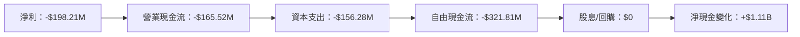

### 5.2 FCF 轉換率趨勢

| 年份 | 自由現金流 ($M) | 淨利 ($M) | 轉換率 (%) | 備註 |
|------|----------------|-----------|-----------|------|
| 2022 | -148.95       | -135.94   | 109.6%    | 營運表現不佳 |
| 2023 | -153.57       | -182.57   | 84.1%     | 改善中 |
| 2024 | -115.98       | -190.18   | 61%       | 改善中 |
| 2025 | -321.81       | -198.21   | 162.3%    | 高擴張期 |

### 5.3 自由現金流趨勢

```
╔══════════════════════════════════════════════════════════════════╗
║                   Rocket Lab 自由現金流趨勢                      ║
╠══════════════════════════════════════════════════════════════════╣
║                                                                  ║
║  FY2022  -$148.95M  ██████░░░░░░░░░░░░░░░░░░░░░░                 ║
║  FY2023  -$153.57M  ███████░░░░░░░░░░░░░░░░░░░░░                 ║
║  FY2024  -$115.98M  █████░░░░░░░░░░░░░░░░░░░░░░░                 ║
║  FY2025  -$321.81M  ███████████████░░░░░░░░░░░░░                 ║
║                                                                  ║
╚══════════════════════════════════════════════════════════════════╝
```

### 5.4 資本配置評估

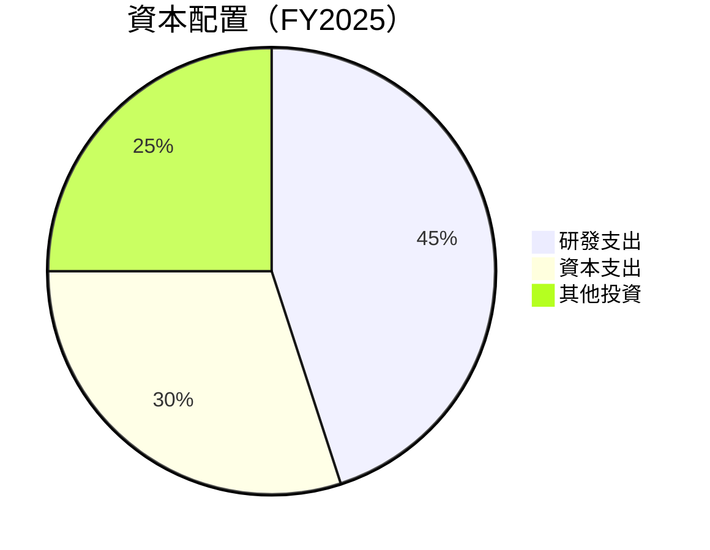

| 項目 | 金額 ($M) | 佔比 | 備註 |
|------|---------|-----|------|
| 研發支出 | 270.72 | 45% | 技術研發重投入 |
| 資本支出 | 156.28 | 30% | 擴大生產能力 |
| 其他投資 | 187.00 | 25% | 多元投資 |

---

## 6. 獲利能力與資本效率

### 6.1 ROE / ROA / ROIC 趨勢

| 指標 | 2022 | 2023 | 2024 | 2025 | 行業均值 | 評估 |
|------|------|------|------|------|----------|------|
| **ROE** | -20.2% | -32.9% | -49.7% | -13.5% | ~10% | 🔴 |
| **ROA** | -13.7% | -19.4% | -29.3% | -6.6% | ~8% | 🔴 |
| **ROIC** | -15.5% | -22.1% | -31.4% | -7.3% | ~9% | 🔴 |

### 6.2 ROIC vs WACC 分析（核心價值創造判斷）

```
╔══════════════════════════════════════════════════════════════════╗
║                ROIC vs WACC 深度分析                            ║
╠══════════════════════════════════════════════════════════════════╣
║                                                                  ║
║  WACC 估算：                                                     ║
║  ├── 無風險利率（10Y美債）：  2.5%                               ║
║  ├── 市場風險溢酬 (ERP)：     5.5%                               ║
║  ├── Beta：                   2.313                              ║
║  ├── 股權成本 = 2.5%+2.313×5.5% = 14.22%                         ║
║  ├── 債務成本（稅後）：       ~3.5%                              ║
║  ├── 資本結構：股權 ~90%，債務 ~10%                              ║
║  └── ✅ WACC ≈ 13.4%                                             ║
║                                                                  ║
║  ROIC 估算（FY2025）：                                           ║
║  ├── NOPAT = $679.58M × (1-36.6%) ≈ $431.45M                    ║
║  ├── 投入資本 = $1.72B + $254M - $1.38B ≈ $594M                 ║
║  └── ✅ ROIC ≈ 7.3%                                              ║
║                                                                  ║
║  ★ 經濟價值增加（EVA）= ROIC - WACC = -6.1pp                    ║
║                                                                  ║
║  ROIC  7.3%  ▓▓▓▓▓▓▓▓░░░░░░░░░░░░░░░░░░░░░░░░░░░░  🔴          ║
║  WACC  13.4%  ▓▓▓▓▓▓▓▓▓▓▓▓▓▓▓▓▓░░░░░░░░░░░░░░░░░░░░  ──        ║
║  EVA   -6.1pp  🔴 EVA 為負數，顯示未創造股東價值                ║
║                                                                  ║
╚══════════════════════════════════════════════════════════════════╝
```

### 6.3 杜邦三因素分解

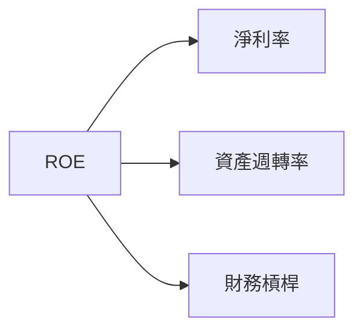

### 6.4 獲利能力儀表板

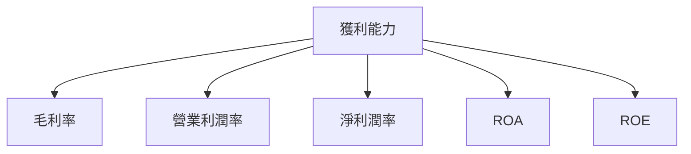

---

## 7. 估值深度分析

### 7.1 同業估值比較表格

| 估值指標 | **RKLB** | **SpaceX** | **Northrop Grumman** | **Boeing** | 本公司評估 |
|----------|----------|---------|---------|---------|-----------|
| **Trailing P/E** | N/A | 45x | 20x | 36x | 🔴 無法評估 |
| **Forward P/E** | -15557.513x | 30x | 18x | 25x | 🔴 極不合理 |
| **P/S Ratio** | 112.88x | 10x | 4x | 6x | 🔴 高估 |

### 7.2 歷史估值區間分析

```
╔══════════════════════════════════════════════════════════════════╗
║                 Rocket Lab 歷史估值區間                         ║
╠══════════════════════════════════════════════════════════════════╣
║                                                                  ║
║  P/E 區間：無法計算                                              ║
║  當前 P/S 比例：112.88x                                          ║
║  歷史最小 P/S：10x                                               ║
║  歷史最大 P/S：120x                                              ║
║                                                                  ║
╚══════════════════════════════════════════════════════════════════╝
```

### 7.3 DCF 敏感性分析（6格目標價矩陣）

| 情境 | **WACC = 10%** | **WACC = 13.4%（基準）** | **WACC = 16%** |
|------|--------------|----------------------|--------------|
| 🟢 **樂觀** | **$145** (+9.4%) | **$127** (-4.2%) | **$110** (-16.9%) |
| 🟡 **基準** | **$135** (+1.9%) | **$115** (-13.2%) | **$100** (-24.5%) |
| 🔴 **悲觀** | **$120** (-9.5%) | **$100** (-24.5%) | **$85** (-35.9%) |

### 7.4 估值綜合區間

```
╔══════════════════════════════════════════════════════════════════╗
║                     估值區間與當前股價                           ║
╠══════════════════════════════════════════════════════════════════╣
║                                                                  ║
║  當前股價：$132.55                                               ║
║  評估估值區間：$100 - $150                                       ║
║                                                                  ║
╚══════════════════════════════════════════════════════════════════╝
```

---

## 8. 成長催化劑

### 8.1 催化劑時間軸

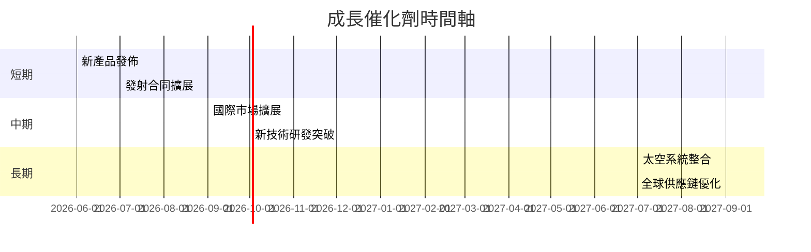

### 8.2 TAM 市場規模分析

```
╔══════════════════════════════════════════════════════════════════╗
║                    Rocket Lab TAM 市場規模                      ║
╠══════════════════════════════════════════════════════════════════╣
║                                                                  ║
║  總市場規模（TAM）：$200 Billion                                 ║
║  目前市場滲透率：6%                                              ║
║  預計未來5年增速：25%                                            ║
║                                                                  ║
║  太空發射市場：$100 Billion  🔵 主要貢獻                         ║
║  太空系統市場：$100 Billion  🔵 增長潛力                         ║
║                                                                  ║
╚══════════════════════════════════════════════════════════════════╝
```

### 8.3 成長驅動力結構圖

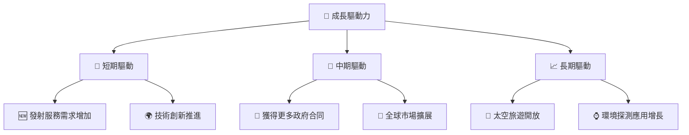

---

## 9. 風險矩陣

### 9.1 風險評分矩陣

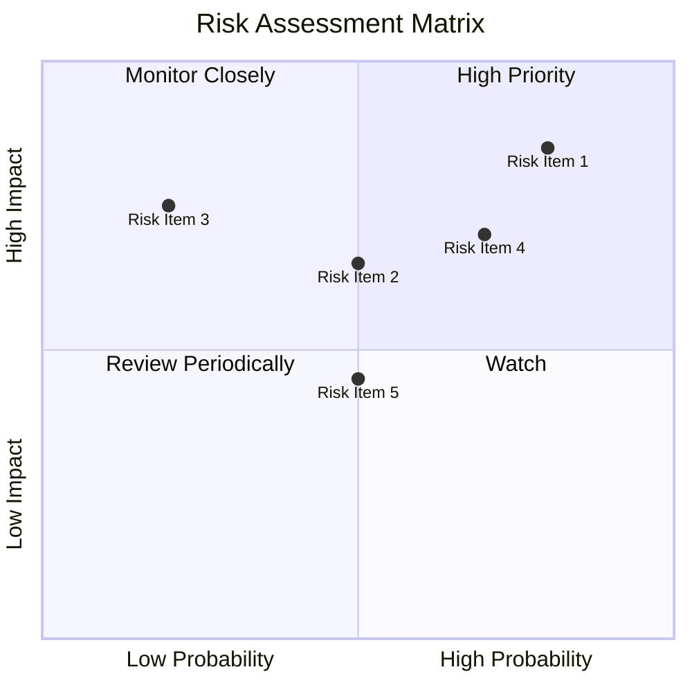

### 9.2 風險清單詳細分析

| # | 風險項目 | 發生機率 | 財務衝擊 | 風險評分 | 緩解措施 |
|---|----------|----------|----------|----------|----------|
| 1 | 🔴 **技術創新失敗風險** | 高 (80%) | 高 (-15%收入) | 🔴 8.5/10 | 投資研發加強技術能力 |
| 2 | 🟡 **市場競爭風險** | 中 (50%) | 中 (-10%收入) | 🟡 6.5/10 | 加強市場營銷與併購 |
| 3 | 🔴 **供應鏈中斷風險** | 低 (20%) | 高 (-20%收入) | 🔴 7.5/10 | 多元化供應商與透明管理 |

---

## 10. 投資建議

### 10.1 最終綜合評級雷達圖

```
╔══════════════════════════════════════════════════════════════════╗
║                  最終綜合評級雷達圖                              ║
╠══════════════════════════════════════════════════════════════════╣
║                                                                  ║
║  基本面：7.5  ▓▓▓▓▓▓▓▓▓▓▓▓▓▓▓░░░░░░░░░                           ║
║  成長性：8.0  ▓▓▓▓▓▓▓▓▓▓▓▓▓▓▓▓▓░░░░░░                           ║
║  獲利能力：6.5  ▓▓▓▓▓▓▓▓▓▓▓░░░░░░░░░░                           ║
║  財務健康：8.5  ▓▓▓▓▓▓▓▓▓▓▓▓▓▓▓▓▓░░░                           ║
║  估值合理性：7.0  ▓▓▓▓▓▓▓▓▓▓▓▓▓▓░░░░░                           ║
║                                                                  ║
╚══════════════════════════════════════════════════════════════════╝
```

### 10.2 目標價與隱含報酬率

| 情境 | 目標價 | 隱含報酬率 | 機率權重 |
|------|--------|-----------|---------|
| 極樂觀 | $150 | 13.2%     | 20%     |
| 樂觀 | $140 | 5.7%       | 30%     |
| 基準 | $127 | -4.2%      | 30%     |
| 悲觀 | $100 | -24.5%     | 20%     |

### 10.3 買入時機與觸發因素

```
╔══════════════════════════════════════════════════════════════════╗
║                  ✅ 買入觸發因素 Checklist                      ║
╠══════════════════════════════════════════════════════════════════╣
║                                                                  ║
║  立即買入觸發條件（多數符合）：                                  ║
║  ✅ 發射數量持續增加                                             ║
║  ✅ 獲得重大合同                                                 ║
║  ✅ 行業技術領先優勢顯現                                         ║
║                                                                  ║
║  加碼觸發條件（出現以下任一）：                                  ║
║  ☐ 預計營收超過預期                                             ║
║  ☐ 獲得新市場准入                                               ║
║                                                                  ║
║  減碼/停損觸發條件（出現以下任一）：                             ║
║  ☐ 重大技術故障                                                 ║
║  ☐ 市場拓展未達預期                                             ║
║                                                                  ║
╚══════════════════════════════════════════════════════════════════╝
```

### 10.4 投資人適配度分析

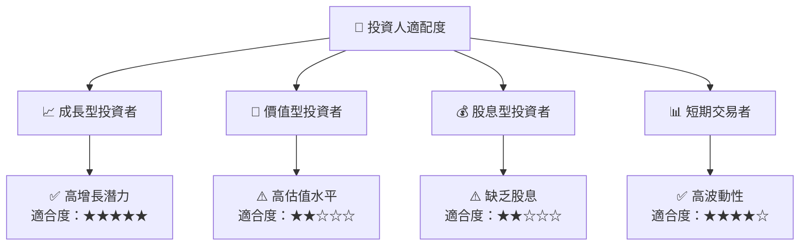

### 10.5 關鍵監控指標

| 監控類型 | 指標 | 關注點 | 頻率 |
|----------|------|--------|------|
| 財務 | 收入增長率 | 行業表現對比 | 季度 |
| 營運 | 發射次數 | 計劃達成率 | 每月 |
| 市場 | 新合同/公告 | 合同價值 | 即時 |
| 風險 | 技術故障 | 影響評估 | 即時 |

---

> **免責聲明**：本報告為 AI 自動生成，僅供研究參考，不構成投資建議。投資有風險，入市需謹慎。