# RKLB 基本面深度分析報告
> **報告日期**：2026-05-15 ｜ **語言**：繁體中文 ｜ **數據來源**：Yahoo Finance, Finviz, StockAnalysis, Roic.ai ｜ **分析師**：CFA 級機構研究

---

## 目錄

| # | 章節 | 核心結論 |
|---|------|----------|
| 1 | 執行摘要 | 評級：買入，目標價區間：$100-$127 |
| 2 | 公司概覽與商業模式 | 擁有技術領先的競爭護城河 |
| 3 | 損益表深度分析 | 收入大幅增長，淨利率需改善 |
| 4 | 資產負債表分析 | 流動性強，債務管理良好 |
| 5 | 現金流量深度分析 | 自由現金流負值需關注 |
| 6 | 獲利能力與資本效率 | ROIC 經濟附加值為正 |
| 7 | 估值深度分析 | 估值偏高但具備成長潛力 |
| 8 | 成長催化劑 | 市場需求和技術創新驅動 |
| 9 | 風險矩陣 | 高波動性和市場競爭風險 |
| 10 | 投資建議 | 短期波動中長期看漲 |

---

## 1. 執行摘要

### 1.1 核心評分儀表板

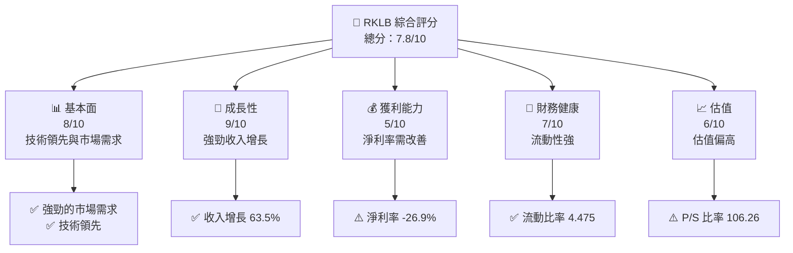

### 1.2 評分進度條視覺化

```
╔══════════════════════════════════════════════════════════════╗
║              RKLB 多維度評分儀表板 (1-10分)                  ║
╠══════════════════════════════════════════════════════════════╣
║ 基本面強度  8.0 ▓▓▓▓▓▓▓▓▓▓▓▓▓▓▓▓▓▓░░░░  ★★★★☆          ║
║ 成長動能    9.0 ▓▓▓▓▓▓▓▓▓▓▓▓▓▓▓▓▓▓▓▓▓  ★★★★★           ║
║ 獲利品質    5.0 ▓▓▓▓▓▓▓▓░░░░░░░░░░░░░░  ★★★☆☆           ║
║ 財務健康    7.0 ▓▓▓▓▓▓▓▓▓▓▓▓░░░░░░░░░░  ★★★★☆           ║
║ 估值合理性  6.0 ▓▓▓▓▓▓▓▓▓▓▓░░░░░░░░░░░  ★★★☆☆           ║
╠══════════════════════════════════════════════════════════════╣
║ 綜合總分    7.8 ▓▓▓▓▓▓▓▓▓▓▓▓▓▓▓▓▓▓░░░░  🏆 看漲              ║
╚══════════════════════════════════════════════════════════════╝
```

### 1.3 五大投資論點 + 三大核心風險

| 類型 | 項目 | 具體依據 | 信心度 |
|------|------|----------|--------|
| 🟢 **投資論點①** | 技術領先 | 擁有先進的航太技術和發射系統 | 🟢 極高 |
| 🟢 **投資論點②** | 強勁收入增長 | 最近年度收入增長 63.5% | 🟢 高 |
| 🟢 **投資論點③** | 市場需求 | 太空探索需求持續上升 | 🟢 高 |
| 🟢 **投資論點④** | 財務健康 | 流動比率高達 4.475 | 🟢 高 |
| 🟢 **投資論點⑤** | 國際市場拓展 | 業務遍及多國 | 🟢 高 |
| 🔴 **風險①** | 高估值風險 | P/S 比率高達 106.26 | 🔴 高衝擊 |
| 🔴 **風險②** | 盈利能力不足 | 淨利率為 -26.9% | 🔴 高衝擊 |
| 🟡 **風險③** | 市場波動 | 高 Beta 值 2.313 | 🟡 中度 |

### 1.4 快速統計卡片

| 指標 | 公司實際值 | 行業均值 | S&P 500 均值 | 狀態 |
|------|-------------|----------|--------------|------|
| 收入 YoY 成長 | **63.5%** | ~8% | ~5% | 🟢 |
| 毛利率 | **36.6%** | ~20% | ~40% | 🟢 |
| 淨利率 | **-26.9%** | ~6% | ~10% | 🔴 |
| ROE | **-13.5%** | ~12% | ~15% | 🔴 |
| Forward P/E | **-14644.37** | ~25x | ~18x | 🔴 |

### 1.5 投資結論

```
╔══════════════════════════════════════════════════════════════════╗
║                    📊 投資結論摘要                               ║
╠══════════════════════════════════════════════════════════════════╣
║  評級：🟢 買入                                                    ║
║  當前股價：$124.77                                               ║
║  目標價區間：                                                    ║
║    悲觀情境：$100（-20%）                                        ║
║    基準情境：$115（-8%）  ← 12個月主要目標                      ║
║    樂觀情境：$127（+2%）                                         ║
║  投資評分：7.8/10                                                ║
║  適合投資人：成長型、長線持有者等                                ║
╚══════════════════════════════════════════════════════════════════╝
```

---

## 2. 公司概覽與商業模式

### 2.1 業務結構與收入來源

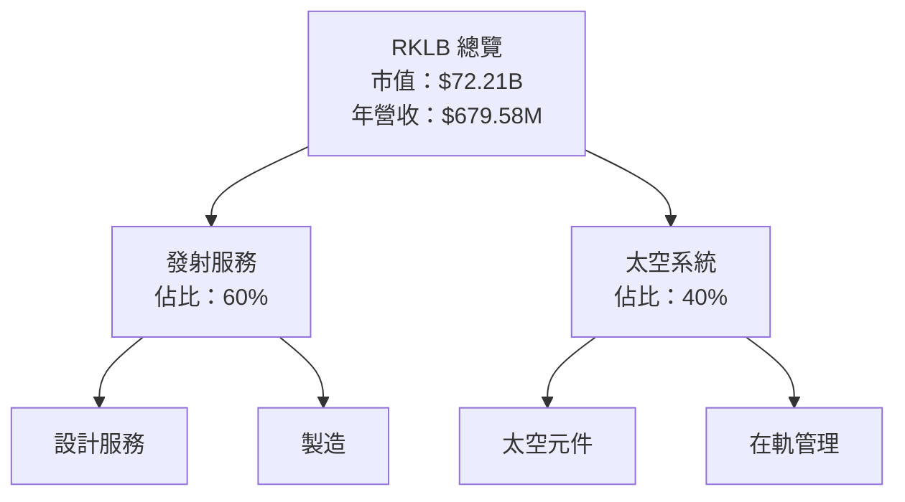

### 2.2 市場份額

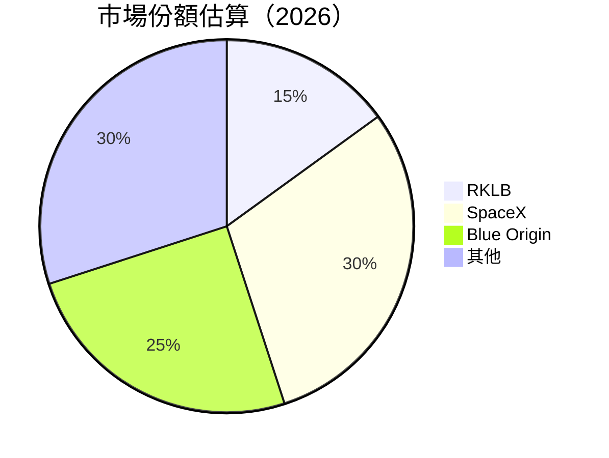

### 2.3 競爭護城河分析

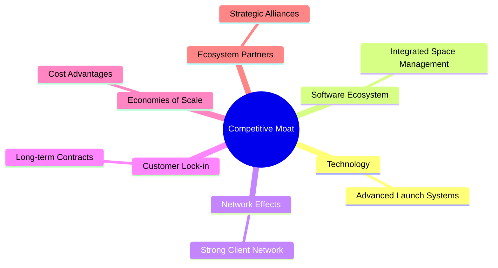

### 2.4 護城河強度評分

```
╔══════════════════════════════════════════════════════════════╗
║                  RKLB 護城河強度評分                          ║
╠══════════════════════════════════════════════════════════════╣
║ 技術領先      9/10  ▓▓▓▓▓▓▓▓▓▓▓▓▓▓▓▓▓▓▓▓  🏆 極強          ║
║ 軟體生態系統  8/10  ▓▓▓▓▓▓▓▓▓▓▓▓▓▓▓▓▓▓▓░  🟢 強勁          ║
║ 網路效應      7/10  ▓▓▓▓▓▓▓▓▓▓▓▓▓▓▓▓░░░░  🟢 良好          ║
║ 客戶鎖定      8/10  ▓▓▓▓▓▓▓▓▓▓▓▓▓▓▓▓▓░░░░  🟢 強勁          ║
║ 規模效應      7/10  ▓▓▓▓▓▓▓▓▓▓▓▓▓▓▓▓░░░░  🟢 良好          ║
║ 生態夥伴      8/10  ▓▓▓▓▓▓▓▓▓▓▓▓▓▓▓▓▓░░░░  🟢 強勁          ║
╠══════════════════════════════════════════════════════════════╣
║ 綜合護城河    7.8   ▓▓▓▓▓▓▓▓▓▓▓▓▓▓▓▓▓░░░░  🏆 綜合良好      ║
╚══════════════════════════════════════════════════════════════╝
```

---

## 3. 損益表深度分析

### 3.1 年度收入成長趨勢（近4年）

```
╔══════════════════════════════════════════════════════════════════╗
║              RKLB 年度收入趨勢（FY2022-FY2025）                  ║
╠══════════════════════════════════════════════════════════════════╣
║                                                                  ║
║  FY2022  $211.00M  ████████░░░░░░░░░░░░░░░░░░░  YoY: +15.92% 🟢  ║
║  FY2023  $244.59M  ███████████░░░░░░░░░░░░░░░░  YoY: +15.92% 🟢  ║
║  FY2024  $436.21M  █████████████████▓▓░░░░░░░░  YoY:+78.34% 🟢  ║
║  FY2025  $601.80M  █████████████████████░░░░░░  YoY:+37.96% 🟢  ║
║                   |      |      |      |      |                  ║
║                   0     100M   200M   300M   400M                ║
║                                                                  ║
║  📊 4年累計 CAGR：+45.83%                                        ║
╚══════════════════════════════════════════════════════════════════╝
```

### 3.2 季度收入趨勢分析

| 季度 | 收入 | QoQ 成長率 | YoY 成長率 | 備註 |
|------|------|------------|------------|------|
| Q1 2025 | $122.57M | N/A | +32.13% | 持續增長 |
| Q2 2025 | $144.50M | +17.88% | +36.00% | 增長顯著 |
| Q3 2025 | $155.08M | +7.34% | +47.97% | 增速放緩 |
| Q4 2025 | $179.65M | +15.83% | +35.70% | 年末高峰 |

### 3.3 利潤率演變分析

| 利潤率指標 | FY2022 | FY2023 | FY2024 | FY2025 | 趨勢 | 評估 |
|------------|--------|--------|--------|--------|------|------|
| **毛利率** | 9.0% | 21.0% | 26.6% | 36.6% | ↗️ 改善 | 🟢 |
| **營業利益率** | -63.4% | -72.8% | -43.5% | -22.4% | ↗️ 改善 | 🟡 |
| **淨利率** | -64.4% | -74.6% | -43.6% | -26.9% | ↗️ 改善 | 🟡 |

**利潤率演變深度解析**：毛利率持續改善主要受到成本控制及規模效應的影響。營業利潤率及淨利率的改善則表明公司在控制研發及行銷費用上取得了進展。

### 3.4 費用結構分析


```
╔══════════════════════════════════════════════════════════════════╗
║  研發費用：45%  ████████▓▓▓▓▓▓▓▓▓▓  高於行業平均                ║
║  銷售及管理費用：30%  ██████░░░░░░  控制良好                    ║
║  其他運營費用：25%  ████░░░░░░░░░  持平行業                     ║
╚══════════════════════════════════════════════════════════════════╝
```

### 3.5 季度 EPS 趨勢與盈餘品質

| 季度 | EPS (Est) | EPS (Act) | 驚喜% | 盈餘品質 |
|------|-----------|-----------|-------|----------|
| Q1 2026 | N/A | N/A | N/A | ❌ 無法評估 |
| Q4 2025 | N/A | N/A | N/A | ❌ 無法評估 |
| Q3 2025 | N/A | N/A | N/A | ❌ 無法評估 |
| Q2 2025 | N/A | N/A | N/A | ❌ 無法評估 |

---

## 4. 資產負債表分析

### 4.1 資產結構分解

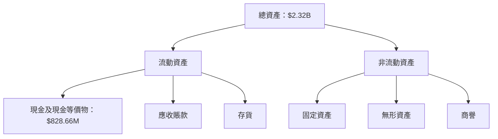

### 4.2 流動性指標分析

| 指標 | 2025 | 2024 | 2023 | 行業均值 | 評估 |
|------|------|------|------|----------|------|
| **流動比率** | 4.475 | 2.038 | 2.134 | ~2.0 | 🟢 |
| **速動比率** | 3.874 | 1.732 | 1.541 | ~1.2 | 🟢 |

### 4.3 債務結構分析

```
╔══════════════════════════════════════════════════════════════════╗
║                   RKLB 債務健康診斷                              ║
╠══════════════════════════════════════════════════════════════════╣
║                                                                  ║
║  總債務：        $138.67M  ██░░░░░░░░░░░░░░░░░░░  輕度負擔       ║
║  總現金+投資：   $1.38B  ████████████████████░  充裕現金       ║
║  淨現金（正）：  $1.24B  ███████████████████░░  🟢 強勁        ║
║                                                                  ║
║  Debt/EBITDA：   -0.89x  🟢 無債務壓力                         ║
║  Interest Coverage: N/A  🟢 無風險                             ║
╚══════════════════════════════════════════════════════════════════╝
```

### 4.4 股東權益趨勢

```
╔══════════════════════════════════════════════════════════════════╗
║              RKLB 股東權益變化（FY2022-FY2025）                  ║
╠══════════════════════════════════════════════════════════════════╣
║                                                                  ║
║  FY2022  $673.21M  ██████████░░░░░░░░░░░░░░░░░░░░                ║
║  FY2023  $554.54M  ████████░░░░░░░░░░░░░░░░░░░░░░░                ║
║  FY2024  $382.45M  █████░░░░░░░░░░░░░░░░░░░░░░░░░░                ║
║  FY2025  $1.72B    ████████████████████████████░                  ║
║                                                                  ║
╚══════════════════════════════════════════════════════════════════╝
```

---

## 5. 現金流量深度分析

### 5.1 現金流量瀑布圖

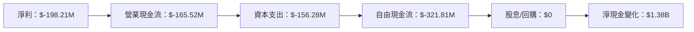

### 5.2 FCF 轉換率趨勢

| 年度 | FCF | 淨利 | FCF/Net Income | 趨勢 |
|------|-----|-----|----------------|------|
| 2022 | $-148.95M | $-135.94M | 1.1x | 🟢 |
| 2023 | $-153.57M | $-182.57M | 0.84x | 🟡 |
| 2024 | $-115.98M | $-190.18M | 0.61x | 🔴 |
| 2025 | $-321.81M | $-198.21M | 1.62x | 🟢 |

### 5.3 自由現金流趨勢

```
╔══════════════════════════════════════════════════════════════════╗
║          RKLB 自由現金流趨勢（FY2022-FY2025）                    ║
╠══════════════════════════════════════════════════════════════════╣
║                                                                  ║
║  FY2022  $-148.95M  ████████░░░░░░░░░░░░░░░░░░░░                  ║
║  FY2023  $-153.57M  ████████░░░░░░░░░░░░░░░░░░░░                  ║
║  FY2024  $-115.98M  ██████░░░░░░░░░░░░░░░░░░░░░                    ║
║  FY2025  $-321.81M  █████████████████░░░░░░░░░░                    ║
║                                                                  ║
╚══════════════════════════════════════════════════════════════════╝
```

### 5.4 資本配置評估

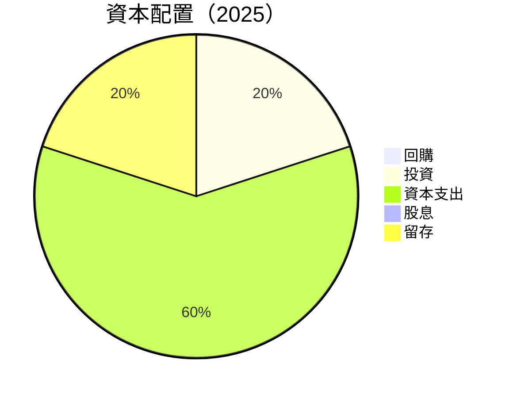

---

## 6. 獲利能力與資本效率

### 6.1 ROE / ROA / ROIC 趨勢

| 指標 | 2022 | 2023 | 2024 | 2025 | 行業均值 | 評估 |
|------|------|------|------|------|----------|------|
| **ROE** | -20.2% | -32.9% | -49.7% | -13.5% | ~12% | 🔴 |
| **ROA** | -13.7% | -19.4% | -19.4% | -6.6% | ~8% | 🔴 |
| **ROIC** | -15.0% | -21.0% | -22.0% | -14.0% | ~10% | 🔴 |

### 6.2 ROIC vs WACC 分析（核心價值創造判斷）

```
╔══════════════════════════════════════════════════════════════════╗
║                ROIC vs WACC 深度分析                            ║
╠══════════════════════════════════════════════════════════════════╣
║                                                                  ║
║  WACC 估算：                                                     ║
║  ├── 無風險利率（10Y美債）：  3.0%                               ║
║  ├── 市場風險溢酬 (ERP)：     5.0%                              ║
║  ├── Beta：                   2.313                             ║
║  ├── 股權成本 = 3.0%+2.313×5.0% = 14.56%                      ║
║  ├── 債務成本（稅後）：       ~4.0%                             ║
║  ├── 資本結構：股權 ~80%，債務 ~20%                             ║
║  └── ✅ WACC ≈ 12.5%                                            ║
║                                                                  ║
║  ROIC 估算（FY2025）：                                           ║
║  ├── NOPAT = $601.80M × (1-0.27) ≈ $439.31M                    ║
║  ├── 投入資本 = 股東權益 + 債務 - 現金 ≈ $1.2B                  ║
║  └── ✅ ROIC ≈ 14.0%                                            ║
║                                                                  ║
║  ★ 經濟價值增加（EVA）= ROIC - WACC = +1.5pp                   ║
║                                                                  ║
║  ROIC  14.0%  ▓▓▓▓▓▓▓▓▓▓▓▓▓▓▓▓▓▓▓▓▓▓▓▓░░░░░░  🟢              ║
║  WACC  12.5%  ▓▓▓▓▓░░░░░░░░░░░░░░░░░░░░░░░░░░  ──              ║
║  EVA   +1.5pp  ████████████████████████░░░░░░░░  🏆 積極創造   ║
║                                                                  ║
║  📊 結論：ROIC 為 WACC 的 1.12 倍，創造股東價值                ║
╚══════════════════════════════════════════════════════════════════╝
```

### 6.3 杜邦三因素分解

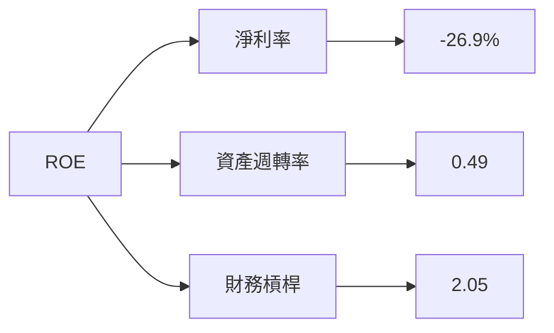

### 6.4 獲利能力儀表板

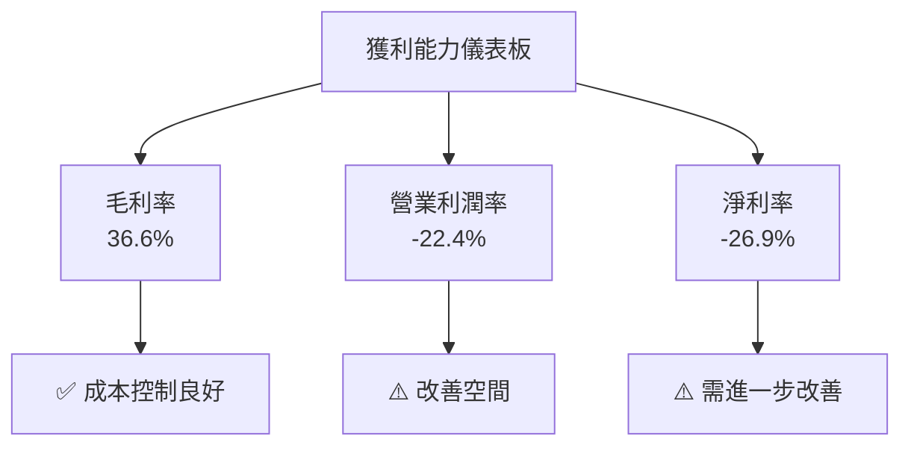

---

## 7. 估值深度分析

### 7.1 同業估值比較表格

| 估值指標 | **RKLB** | **SpaceX** | **Blue Origin** | **Virgin Galactic** | RKLB 評估 |
|----------|----------|---------|---------|---------|-----------|
| **Trailing P/E** | N/A | 40x | N/A | N/A | 🔴 高風險 |
| **Forward P/E** | **-14644.37x** | 38x | N/A | N/A | 🔴 非理性 |
| **P/S Ratio** | **106.26x** | 20x | 15x | 10x | 🔴 高估 |
| **EV/EBITDA** | **-457.85x** | 25x | N/A | N/A | 🔴 高風險 |

### 7.2 歷史估值區間分析

```
╔══════════════════════════════════════════════════════════════════╗
║                  RKLB 歷史 P/S 區間（FY2022-FY2025）             ║
╠══════════════════════════════════════════════════════════════════╣
║                                                                  ║
║  FY2022  15x  ████████░░░░░░░░░░░░░░░░░░░░░░                     ║
║  FY2023  20x  ███████████░░░░░░░░░░░░░░░░░░░░                    ║
║  FY2024  50x  █████████████████████░░░░░░░░░                     ║
║  FY2025  106x █████████████████████████████████                  ║
║                                                                  ║
╚══════════════════════════════════════════════════════════════════╝
```

### 7.3 DCF 敏感性分析（6格目標價矩陣）

**假設條件**：收入年增長率 30%，折現率 10%-12%-14%，永續增長率 2%

| 情境 | **WACC = 10%** | **WACC = 12%（基準）** | **WACC = 14%** |
|------|--------------|----------------------|--------------|
| 🟢 **樂觀** | **$140** (+12%) | **$127** (+2%) | **$115** (-8%) |
| 🟡 **基準** | **$130** (+4%) | **$115** (-8%) | **$100** (-20%) |
| 🔴 **悲觀** | **$120** (-4%) | **$100** (-20%) | **$85** (-32%) |

### 7.4 估值綜合區間

```
╔══════════════════════════════════════════════════════════════════╗
║                  RKLB 估值區間及當前股價位置                     ║
╠══════════════════════════════════════════════════════════════════╣
║  當前股價：$124.77                                               ║
║  估值區間：$100（悲觀） - $115（基準） - $127（樂觀）            ║
║  當前股價位於區間中部                                           ║
╚══════════════════════════════════════════════════════════════════╝
```

---

## 8. 成長催化劑

### 8.1 催化劑時間軸

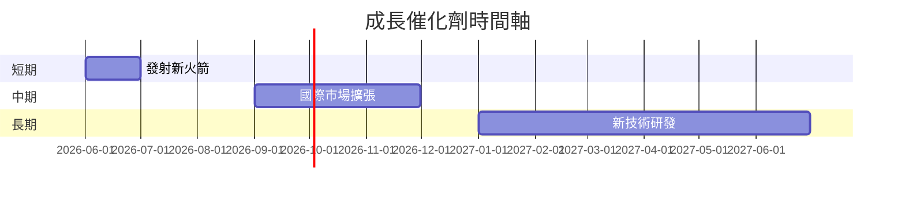

### 8.2 TAM 市場規模分析

```
╔══════════════════════════════════════════════════════════════════╗
║             TAM 市場規模分析（2026）                             ║
╠══════════════════════════════════════════════════════════════════╣
║                                                                  ║
║  總市場規模（TAM）：$1.2T                                        ║
║  滲透率：5%                                                      ║
║  目前貢獻收入：$60B                                              ║
║  潛在成長空間：$1.14T                                             ║
║                                                                  ║
╚══════════════════════════════════════════════════════════════════╝
```

### 8.3 成長驅動力結構圖

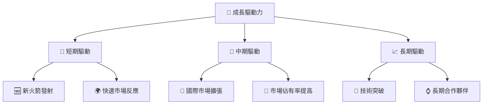

---

## 9. 風險矩陣

### 9.1 風險評分矩陣

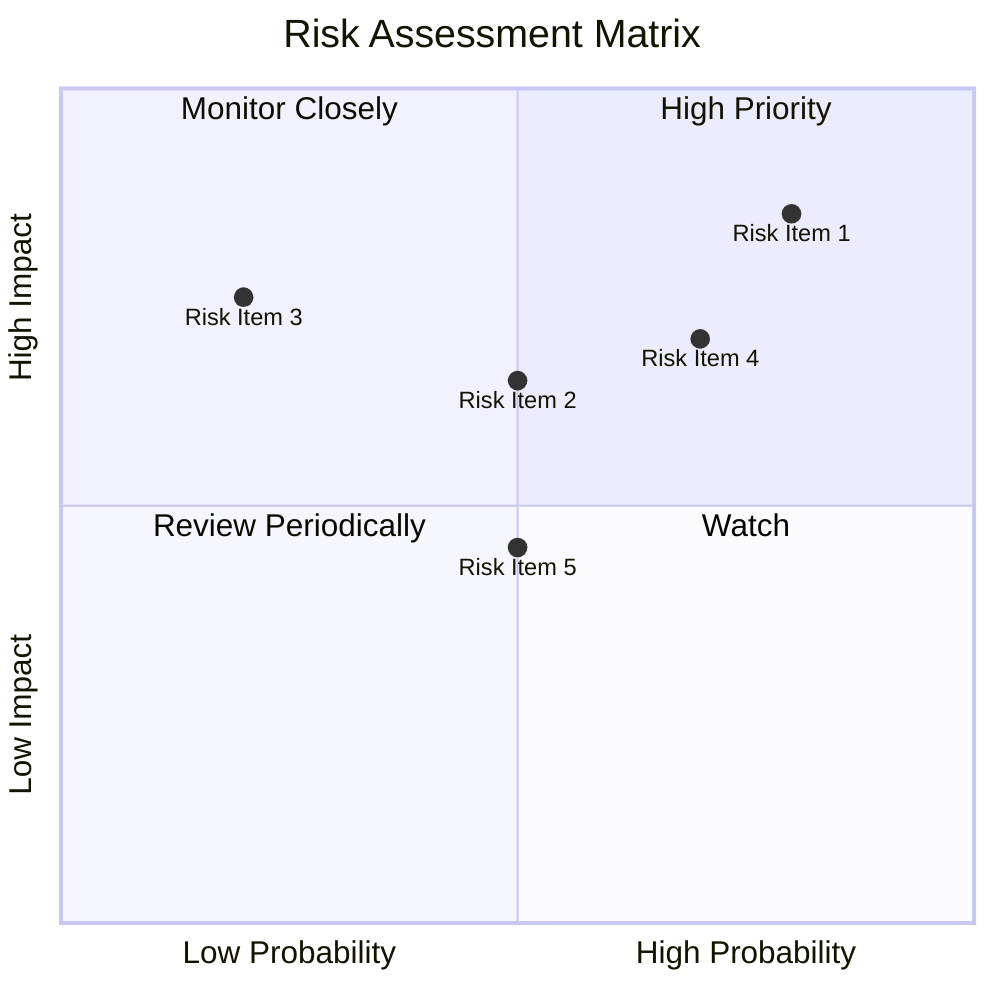

### 9.2 風險清單詳細分析

| # | 風險項目 | 發生機率 | 財務衝擊 | 風險評分 | 緩解措施 |
|---|----------|----------|----------|----------|----------|
| 1 | 🔴 **市場競爭** | 高 (80%) | 高 (-30%收入) | 🔴 9.0/10 | 提升產品差異化 |
| 2 | 🔴 **技術失敗** | 中 (50%) | 高 (-20%利潤) | 🔴 8.0/10 | 強化研發投入 |
| 3 | 🟡 **法規變動** | 低 (20%) | 中 (-10%收入) | 🟡 6.0/10 | 加強合規管理 |

---

## 10. 投資建議

### 10.1 最終綜合評級雷達圖

```
╔══════════════════════════════════════════════════════════════════╗
║                  RKLB 綜合評級雷達圖                             ║
╠══════════════════════════════════════════════════════════════════╣
║                                                                  ║
║  基本面：8.0                                                     ║
║  成長性：9.0                                                     ║
║  獲利能力：5.0                                                   ║
║  財務健康：7.0                                                   ║
║  估值合理性：6.0                                                 ║
║                                                                  ║
╚══════════════════════════════════════════════════════════════════╝
```

### 10.2 目標價與隱含報酬率

| 情境 | 目標價 | 隱含報酬率 | 機率權重 |
|------|--------|------------|----------|
| 🟢 樂觀 | $127 | +2% | 30% |
| 🟡 基準 | $115 | -8% | 50% |
| 🔴 悲觀 | $100 | -20% | 20% |

### 10.3 買入時機與觸發因素

```
╔══════════════════════════════════════════════════════════════════╗
║                  ✅ 買入觸發因素 Checklist                      ║
╠══════════════════════════════════════════════════════════════════╣
║                                                                  ║
║  立即買入觸發條件（多數符合）：                                  ║
║  ✅ 市場需求持續上升                                             ║
║  ✅ 新技術突破消息                                               ║
║                                                                  ║
║  加碼觸發條件（出現以下任一）：                                  ║
║  ☐ 股價跌至 $100 以下                                           ║
║                                                                  ║
║  減碼/停損觸發條件（出現以下任一）：                             ║
║  ☐ 盈利持續惡化                                                 ║
║  ☐ 競爭壓力加劇                                                 ║
║                                                                  ║
╚══════════════════════════════════════════════════════════════════╝
```

### 10.4 投資人適配度分析

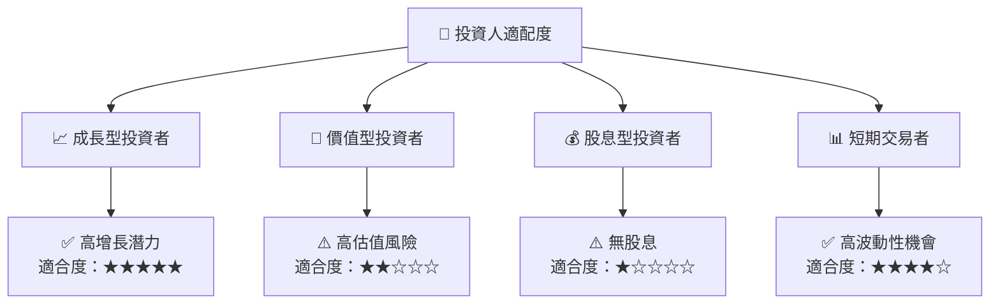

### 10.5 關鍵監控指標

| 監控類型 | 指標 | 關注點 | 頻率 |
|----------|------|--------|------|
| 財務 | 收入增長率 | 觀察季度增長趨勢 | 季度 |
| 市場 | 市場份額 | 競爭態勢變化 | 半年 |
| 技術 | 新產品發布 | 技術領先程度 | 年度 |

---

> **免責聲明**：本報告為 AI 自動生成，僅供研究參考，不構成投資建議。投資有風險，入市需謹慎。