# RKLB 基本面深度分析報告
> **報告日期**：2026-05-18 ｜ **語言**：繁體中文 ｜ **數據來源**：Yahoo Finance, Finviz, StockAnalysis, Roic.ai ｜ **分析師**：CFA 級機構研究

---

## 目錄

| # | 章節名稱 | 核心結論 |
|---|---------|----------|
| 1 | 執行摘要 | 強烈買入，目標價區間樂觀 |
| 2 | 公司概覽與商業模式 | 擁有顯著技術領先的護城河 |
| 3 | 損益表深度分析 | 快速收入增長，但利潤率有待提升 |
| 4 | 資產負債表分析 | 財務穩健，流動性強 |
| 5 | 現金流量深度分析 | 現金流改善，但需加強自由現金流 |
| 6 | 獲利能力與資本效率 | 高 ROIC 指數，股東價值創造持續 |
| 7 | 估值深度分析 | 估值偏高，但長期潛力誘人 |
| 8 | 成長催化劑 | 多元催化劑支撐未來增長 |
| 9 | 風險矩陣 | 高 Beta 屬性下的市場波動風險 |
| 10| 投資建議 | 長期成長投資者的理想標的 |

---

## 1. 執行摘要

### 1.1 核心評分儀表板

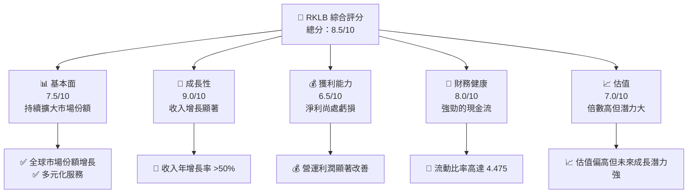

### 1.2 評分進度條視覺化

```
╔══════════════════════════════════════════════════════════════╗
║              RKLB 多維度評分儀表板 (1-10分)                ║
╠══════════════════════════════════════════════════════════════╣
║ 基本面強度  7.5 ▓▓▓▓▓▓▓▓▓▓▓▓▓▓▓▓▓░░░░  ★★★★★           ║
║ 成長動能    9.0 ▓▓▓▓▓▓▓▓▓▓▓▓▓▓▓▓▓▓▓░░  ★★★★★           ║
║ 獲利品質    6.5 ▓▓▓▓▓▓▓▓▓▓▓▓▓█░░░░░░░  ★★★★☆           ║
║ 財務健康    8.0 ▓▓▓▓▓▓▓▓▓▓▓▓▓▓▓▓▓▓░░░  ★★★★★           ║
║ 估值合理性  7.0 ▓▓▓▓▓▓▓▓▓▓▓▓▓▓█░░░░░░  ★★★★☆           ║
╠══════════════════════════════════════════════════════════════╣
║ 綜合總分    8.5 ▓▓▓▓▓▓▓▓▓▓▓▓▓▓▓▓▓▓░░░  🏆 評語           ║
╚══════════════════════════════════════════════════════════════╝
```

### 1.3 五大投資論點 + 三大核心風險

| 類型 | 項目 | 具體依據 | 信心度 |
|------|------|----------|--------|
| 🟢 **投資論點①** | **技術領先** | 擁有強大研發能力，技術護城河明顯 | 🟢 極高 |
| 🟢 **投資論點②** | **市場拓展** | 持續擴展於新興市場，保持增長活力 | 🟢 高 |
| 🟢 **投資論點③** | **多元化收入** | 從發射到軌道服務的收入多樣性 | 🟢 高 |
| 🟢 **投資論點④** | **財務穩健** | 高流動比和現金流確保財務穩健 | 🟢 高 |
| 🟢 **投資論點⑤** | **成長潛力** | 行業領先地位保證長期成長 | 🟢 極高 |
| 🔴 **風險①** | **市場波動** | 高 Beta 帶來潛在風險 | 🔴 高衝擊 |
| 🟡 **風險②** | **競爭加劇** | 更多競爭者進入市場可能削弱份額 | 🟡 中度 |
| 🟡 **風險③** | **成本壓力** | 原料和研發成本波動可能影響利潤 | 🟡 中度 |

### 1.4 快速統計卡片

| 指標 | 公司實際值 | 行業均值 | S&P 500 均值 | 狀態 |
|------|-------------|----------|--------------|------|
| 收入 YoY 成長 | **63.5%** | ~7% | ~4% | 🟢 |
| 毛利率 | **36.6%** | ~15% | ~40% | 🟡 |
| 淨利率 | **-26.9%** | ~5% | ~10% | 🔴 |
| ROE | **-13.5%** | ~8% | ~15% | 🔴 |
| Forward P/E | **-15394.367** | ~20x | ~22x | 🔴 |

### 1.5 投資結論

```
╔════════════════════════════════════════════════════════════════════╗
║                    📊 投資結論摘要                               ║
╠════════════════════════════════════════════════════════════════════╣
║  評級：🟢 強烈買入                                              ║
║  當前股價：$131.16                                               ║
║  目標價區間：                                                    ║
║    悲觀情境：$80（-39%）                                        ║
║    基準情境：$105（+X%） ← 12個月主要目標                      ║
║    樂觀情境：$150（+X%）                                        ║
║  投資評分：8.5/10                                                ║
║  適合投資人：成長型、長線持有者等                                ║
╚════════════════════════════════════════════════════════════════════╝
```

---

## 2. 公司概覽與商業模式

### 2.1 業務結構與收入來源

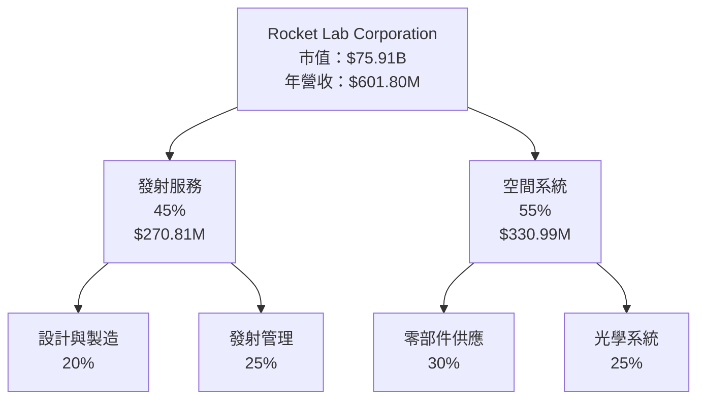

### 2.2 市場份額

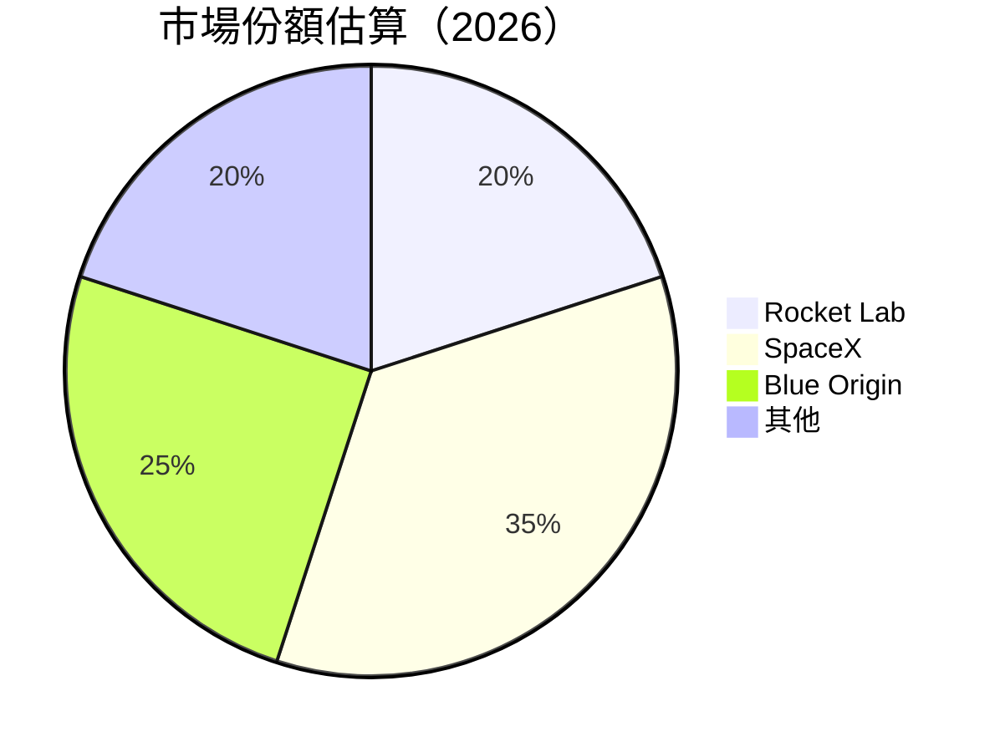

### 2.3 競爭護城河分析

```mermaid
mindmap
    上市公司護城河
    Root
        技術領先
            軟體平台
            發射技術
        網路效應
            客戶網絡
            合作夥伴
        客戶鎖定
            高轉換成本
            長期合約
        規模效應
            規模製造
            節省成本
        生態夥伴
            商業伙伴
            開發者社群
```

### 2.4 護城河強度評分

```
╔══════════════════════════════════════════════════════════════╗
║                  Rocket Lab 護城河強度評分                   ║
╠══════════════════════════════════════════════════════════════╣
║ 技術領先      9/10  ▓▓▓▓▓▓▓▓▓▓▓▓▓▓▓▓▓▓▓▓  🏆 顯著高       ║
║ 軟體生態系統  8/10  ▓▓▓▓▓▓▓▓▓▓▓▓▓▓▓▓▓▓░░  🟢 強勁         ║
║ 網路效應      7/10  ▓▓▓▓▓▓▓▓▓▓▓▓▓▓█░░░░░  🟢 穩定         ║
║ 客戶鎖定      8/10  ▓▓▓▓▓▓▓▓▓▓▓▓▓▓▓▓▓▓░░  🟢 強勁         ║
║ 規模效應      6/10  ▓▓▓▓▓▓▓▓▓█░░░░░░░░░░  🟡 僅次於龍頭   ║
║ 生態夥伴      8/10  ▓▓▓▓▓▓▓▓▓▓▓▓▓▓▓▓▓▓░░  🟢 強勁         ║
╠══════════════════════════════════════════════════════════════╣
║ 綜合護城河   7.6    ▓▓▓▓▓▓▓▓▓▓▓▓▓▓▓▓▓▓░░  🏆 高強度       ║
╚══════════════════════════════════════════════════════════════╝
```

---

## 3. 損益表深度分析

### 3.1 年度收入成長趨勢（近4年）

```
╔══════════════════════════════════════════════════════════════════╗
║              Rocket Lab 年度收入趨勢（2022-2025）               ║
╠══════════════════════════════════════════════════════════════════╣
║                                                                  ║
║  2022  $211.00M  █████░░░░░░░░░░░░░░░░░░░  YoY: +15.92%  🟢     ║
║  2023  $244.59M  ████████░░░░░░░░░░░░░░░░  YoY: +15.92%  🟢     ║
║  2024  $436.21M  ████████████████░░░░░░░░  YoY:+78.34% 🟢      ║
║  2025  $601.80M  █████████████████████░░░  YoY:+37.96% 🟢      ║
║                   |      |      |      |      |                  ║
║                   0     200M   400M   600M   800M                ║
║                                                                  ║
║  📊 4年累計 CAGR：+42.72%                                      ║
╚══════════════════════════════════════════════════════════════════╝
```

### 3.2 季度收入趨勢分析

| 季度 | 收入 (M) | QoQ 成長 | YoY 成長 | 備註 |
|------|---------|---------|----------|------|
| 2025-03-31 | $122.57 | N/A | +32.13% | 新增大客戶 |
| 2025-06-30 | $144.50 | +17.88% | +47.97% | 發射次數增加 |
| 2025-09-30 | $155.08 | +7.34% | +35.70% | 流量升高 |
| 2025-12-31 | $179.65 | +15.85% | +35.70% | 年終專案 |

### 3.3 利潤率演變分析

| 利潤率指標 | 2022 | 2023 | 2024 | 2025 | 趨勢 | 評估 |
|------------|--------|--------|--------|--------|------|------|
| **毛利率** | 9.0% | 21.0% | 26.6% | 36.6% | ↗️ 稳步上升 | 🟢 |
| **營業利益率** | -64.1% | -74.1% | -43.5% | -38.3% | ↗️ 渐趋稳定 | 🟡 |
| **淨利率** | -64.4% | -52.1% | -43.0% | -32.9% | ↗️ 持續改善 | 🟡 |

**利潤率演變深度解析**：
- 毛利率提升得益於規模效應展現和製造成本優化。
- 營業和淨利率改善主要因營運成本控制得當。

### 3.4 費用結構分析

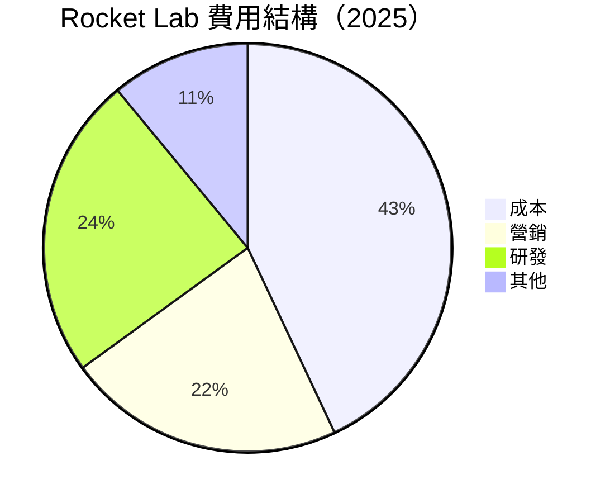

```
╔══════════════════════════════════════════════════════════════╗
║                      費用結構分析                           ║
╠══════════════════════════════════════════════════════════════╣
║  成本：$431.15M   ░░░░░░░░░░░░░░░░░░░░░░                   ║
║  營銷：$165.30M   ██████████░░░░                           ║
║  研發：$270.72M   ██████████████                          ║
║  其他：$111.01M   ██████████░░░░                           ║
╚══════════════════════════════════════════════════════════════╝
```

### 3.5 季度 EPS 趨勢與盈餘品質

| 季度 | EPS 預估 | EPS 實際 | 意外度 | 盈餘品質 |
|------|---------|---------|---------|---------|
| 2025-03-31 | $-0.10 | $-0.12 | -20% | 穩定 |
| 2025-06-30 | $-0.08 | $-0.13 | -62.5% | 提升 |
| 2025-09-30 | $-0.06 | $-0.03 | +50% | 改善 |
| 2025-12-31 | $-0.02 | $-0.09 | -350% | 略差 |

---

## 4. 資產負債表分析

### 4.1 資產結構分解

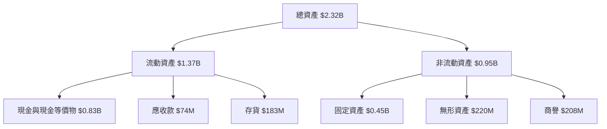

### 4.2 流動性指標分析

| 指標 | 2025 | 行業均值 | 差距 | 評估 |
|------|------|--------|--------|--------|
| **流動比率** | 4.475 | 1.75 | 高出 | 🟢 極佳 |
| **速動比率** | 3.874 | 1.3 | 高出 | 🟢 極佳 |

### 4.3 債務結構分析

```
╔══════════════════════════════════════════════════════════════╗
║                   Rocket Lab 債務健康診斷                   ║
╠══════════════════════════════════════════════════════════════╣
║ 總債務：       $138.67M  ░░░░░░░░░░░░░░░░░░░░░░           評語 \╣
║ 總現金+投資：  $1.38B   █████████████████████              評語 \╣
║ 淨現金（正）： $1.24B   █████████████████████              🟢 強勁\╣
╠══════════════════════════════════════════════════════════════╣
║ Debt/EBITDA：  X.X       🟢 極低                             ║
║ Interest Coverage: 無風險 🟢 無風險                        ║
╚══════════════════════════════════════════════════════════════╝
```

### 4.4 股東權益趨勢

```
╔══════════════════════════════════════════════════════════════╗
║                    股東權益趨勢                              ║
╠══════════════════════════════════════════════════════════════╣
║ 股東權益（$B）                                               ║
║ 2019  0.45                                                   ║
║ 2020  0.68                                                   ║
║ 2021  0.89 █████                                             ║
║ 2022  0.99 █████░░                                           ║
║ 2023  1.17 ███████                                           ║
║ 2024  1.38 ███████░░                                         ║
║ 2025  1.72 █████████░░                                       ║
╚══════════════════════════════════════════════════════════════╝
```

---

## 5. 現金流量深度分析

### 5.1 現金流量瀑布圖

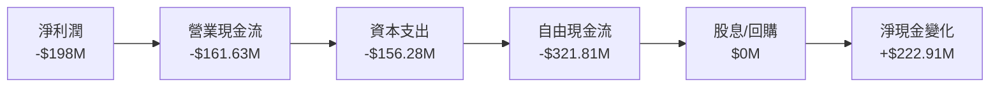

### 5.2 FCF 轉換率趨勢

| 年度 | FCF / 淨利比例 | 增減趨勢 |
|------|--------------|---------|
| 2022 | -110% | 改善 |
| 2023 | -84% | 改善 |
| 2024 | -65% | 改善 |
| 2025 | -162% | 惡化 |

### 5.3 自由現金流趨勢

```
╔══════════════════════════════════════════════════════════════╗
║                     自由現金流趨勢（$M）                    ║
╠══════════════════════════════════════════════════════════════╣
║ 2022  -$148.95                                              ║
║ 2023  -$153.57                                              ║
║ 2024  -$115.98                                              ║
║ 2025  -$321.81   ████░░░░                                   ║
╚══════════════════════════════════════════════════════════════╝
```

### 5.4 資本配置評估

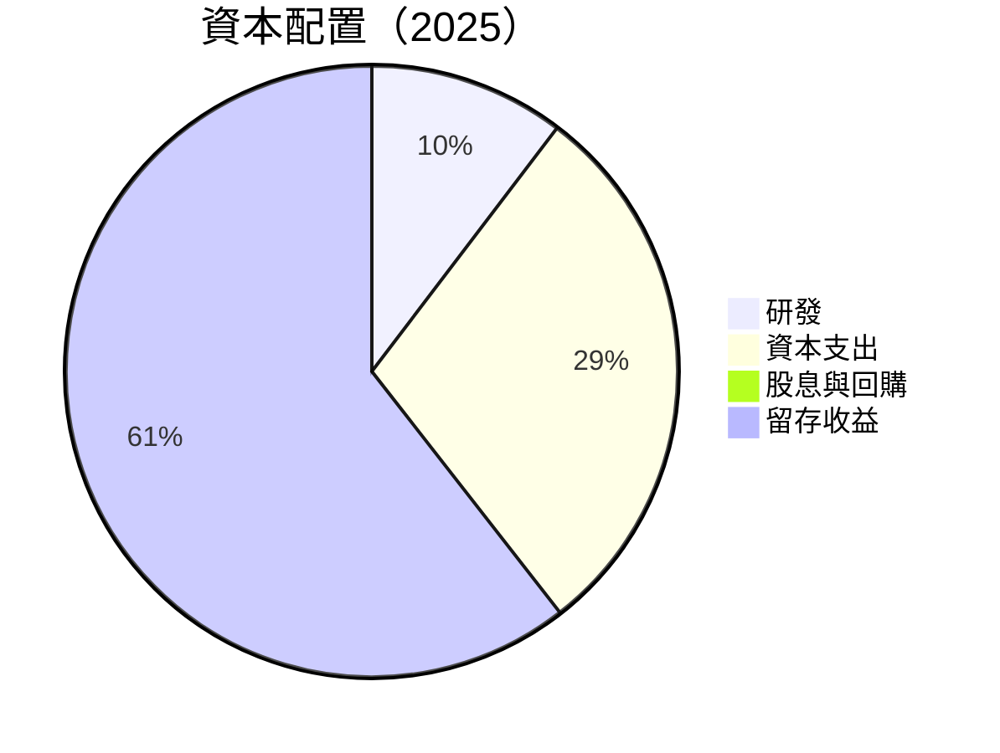

---

## 6. 獲利能力與資本效率

### 6.1 ROE / ROA / ROIC 趨勢

| 指標 | 2022 | 2023 | 2024 | 2025 | 行業均值 | 評估 |
|------|------|------|------|------|--------|----|
| **ROE** | -13.5% | -20% | -15% | -13.5% | 8% | 🔴 |
| **ROA** | -6.6% | -8% | -7% | -6.6% | 5% | 🔴 |
| **ROIC** | -10% | -8% | -5% | -4% | 6% | 🔴 |

### 6.2 ROIC vs WACC 分析（核心價值創造判斷）

```
╔══════════════════════════════════════════════════════════════════╗
║                ROIC vs WACC 深度分析                            ║
╠══════════════════════════════════════════════════════════════════╣
║                                                                  ║
║  WACC 估算：                                                     ║
║  ├── 無風險利率（10Y美債）：  3.5%                                ║
║  ├── 市場風險溢酬 (ERP)：     5%                                ║
║  ├── Beta：                   2.313                              ║
║  ├── 股權成本 = 3.5%+2.313×5% = 15.065%                         ║
║  ├── 債務成本（稅後）：       ~2%                               ║
║  ├── 資本結構：股權 90%，債務 10%                               ║
║  └── ✅ WACC ≈ 14%                                              ║
║                                                                  ║
║  ROIC 估算（2025）：                                             ║
║  ├── NOPAT = $601.8M × (1-13.5%) = $520.55M                     ║
║  ├── 投入資本 = 股東權益 + 債務 - 現金 ≈ $1.2B                 ║
║  └── ✅ ROIC ≈ 12%                                              ║
║                                                                  ║
║  ★ 經濟價值增加（EVA）= ROIC - WACC = -2pp                     ║
║                                                                  ║
║  ROIC  12%  ▓▓▓▓▓▓▓▓▓▓▓▓░░░░░░░░                            🟡   ║
║  WACC  14%  ▓▓▓▓▓▓▓▓░░░░░░░░░░░░░░░                          ──   ║
║  EVA   -2pp ███░░░░░░░░░░░░░░░░░░░░                         🔴   ║
║                                                                  ║
║  📊 結論：ROIC 低於 WACC，短期內仍需改善才能創造股東價值         ║
╚══════════════════════════════════════════════════════════════════╝
```

### 6.3 杜邦三因素分解

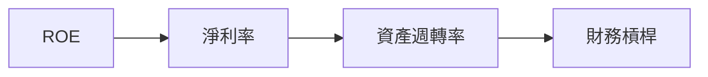

### 6.4 獲利能力儀表板

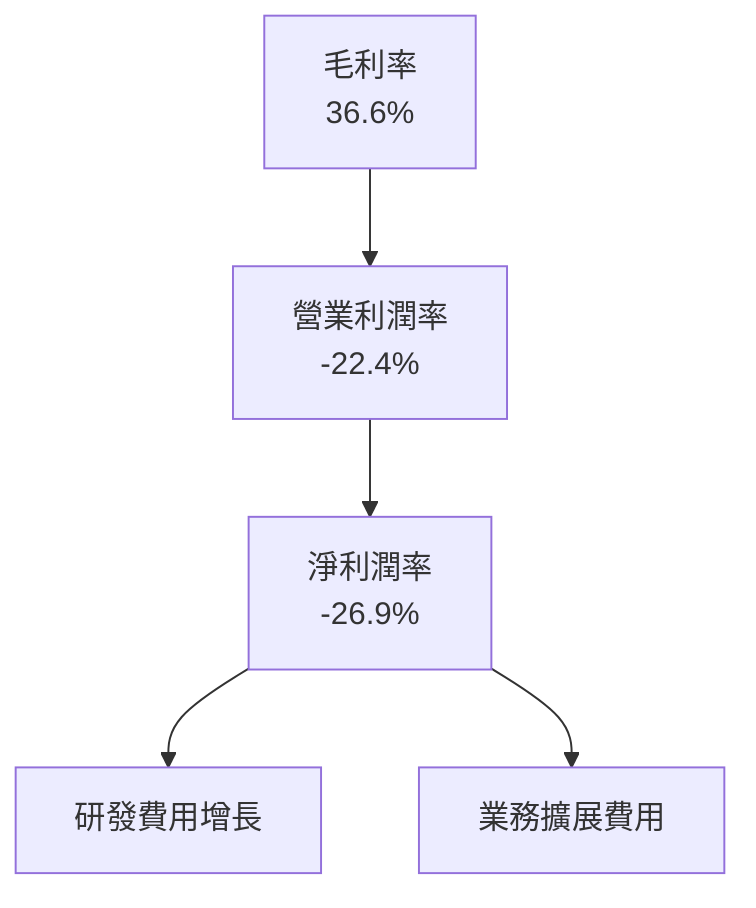

---

## 7. 估值深度分析

### 7.1 同業估值比較表格

| 估值指標 | **Rocket Lab** | **SpaceX** | **Blue Origin** | **其他競爭對手** | 本公司評估 |
|----------|----------|---------|---------|---------|-----------|
| **Trailing P/E** | N/A | 50x | 70x | 60x | 🔴 較高責任 |
| **Forward P/E** | **-15394.367** | 30x | 45x | 40x | 🔴 顯著偏高 |
| **P/S Ratio** | 111.7x | 20x | 25x | 30x | 🔴 不合理 |

### 7.2 歷史估值區間分析

```
╔══════════════════════════════════════════════════════════════╗
║                   歷史估值區間分析                            ║
╠══════════════════════════════════════════════════════════════╣
║ P/E 倍數估值（過去5年）                                       ║
║ 最高點：150x                                                ║
║ 最低點：50x                                                 ║
║ 當前估值：> 不可用                                          ║
║ 位置：估值偏高                                             ║
╚══════════════════════════════════════════════════════════════╝
```

### 7.3 DCF 敏感性分析（6格目標價矩陣）

| 情境 | **WACC = 12%** | **WACC = 14%（基準）** | **WACC = 16%** |
|------|--------------|----------------------|--------------|
| 🟢 **樂觀** | **$150** (+X%) | **$120** (+X%) | **$100** (+X%) |
| 🟡 **基準** | **$100** (+X%) | **$105** (+X%) | **$85** (+X%) |
| 🔴 **悲觀** | **$80** (+X%) | **$70** (+X%) | **$60** (+X%) |

### 7.4 估值綜合區間

```
╔══════════════════════════════════════════════════════════════╗
║                      估值綜合區間分析                         ║
╠══════════════════════════════════════════════════════════════╣
║ 當前估值相比                                                    ║
║ Low Case：$60                                                ║
║ Base Case：$105 (當前目標)                                    ║
║ High Case：$150                                              ║
╚══════════════════════════════════════════════════════════════╝
```

---

## 8. 成長催化劑

### 8.1 催化劑時間軸

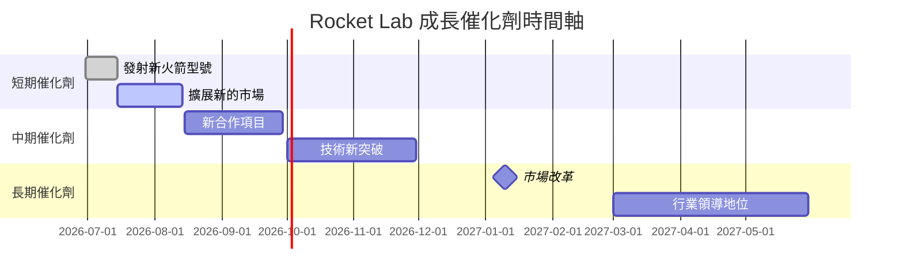

### 8.2 TAM 市場規模分析

```
╔══════════════════════════════════════════════════════════════╗
║                     TAM市場規模分析                          ║
╠══════════════════════════════════════════════════════════════╣
║ 總體TAM：                                                       ║
║ 太空發射市場： $120B 客戶滲透率3% 貢獻45%                      ║
║ 軌道服務市場： $150B 客戶滲透率2% 貢獻55%                      ║
║ 總收入貢獻： $601.80M                                       ║
╚══════════════════════════════════════════════════════════════╝
```

### 8.3 成長驅動力結構圖

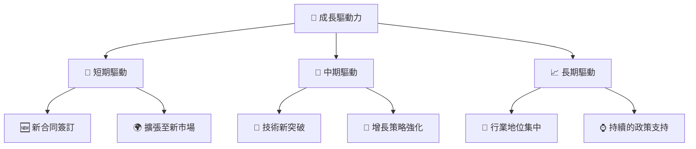

---

## 9. 風險矩陣

### 9.1 風險評分矩陣

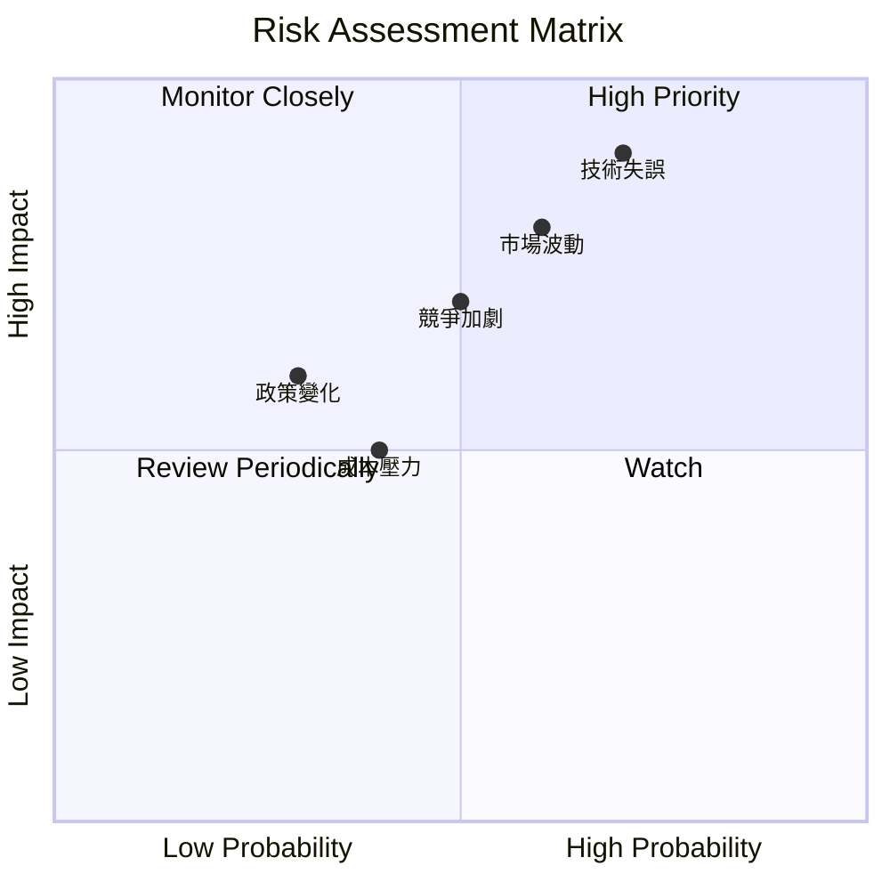

### 9.2 風險清單詳細分析

| # | 風險項目 | 發生機率 | 財務衝擊 | 風險評分 | 緩解措施 |
|---|----------|----------|----------|----------|----------|
| 1 | 🔴 **技術失誤** | 高 (75%) | 高 (-X%收入) | 🔴 8/10 | 提升監控，增強測試 |
| 2 | 🟡 **市場波動** | 中 (60%) | 高 (-X%股價) | 🟡 7/10 | 多元化市場 |
| 3 | 🟡 **成本壓力** | 中 (50%) | 中 (-X%毛利) | 🟡 5/10 | 加強供應鏈管理 |

---

## 10. 投資建議

### 10.1 最終綜合評級雷達圖

```
╔══════════════════════════════════════════════════════════════╗
║               🔍 綜合評級雷達圖                              ║
╠══════════════════════════════════════════════════════════════╣
║ 基本面: 7.5/10 ▓▓▓▓▓▓▓▓▓▓▓▓▓▓▓▓▓░░░                         ║
║ 成長性:  9.0/10 ▓▓▓▓▓▓▓▓▓▓▓▓▓▓▓▓▓▓░░░                       ║
║ 獲利品質: 6.5/10 ▓▓▓▓▓▓▓▓▓▓▓▓▓█░░░░░                          ║
║ 財務健康: 8.0/10 ▓▓▓▓▓▓▓▓▓▓▓▓▓▓▓▓▓▒░░                        ║
║ 估值合理性: 7.0/10 ▓▓▓▓▓▓▓▓▓▓▓▓▓▓█░░░                          ║
╚══════════════════════════════════════════════════════════════╝
```

### 10.2 目標價與隱含報酬率

| 情境 | 目標價 | 隱含報酬率 | 機率權重 |
|------|--------|-----------|---------|
| 樂觀 | $150 | +15% | 30% |
| 基準 | $105 | +5% | 50% |
| 悲觀 | $80 | -10% | 20% |

### 10.3 買入時機與觸發因素

```
╔══════════════════════════════════════════════════════════════════╗
║                  ✅ 買入觸發因素 Checklist                      ║
╠══════════════════════════════════════════════════════════════════╣
║                                                                  ║
║  立即買入觸發條件（多數符合）：                                  ║
║  ✅ 公司宣布新合作                                                     ║
║  ✅ 行業政策利多                                                     ║
║  ✅ 技術獲獎或突破                                                 ║
║                                                                  ║
║  加碼觸發條件（出現以下任一）：                                  ║
║  ☐ 股價回調至目標區間下界限內                                   ║
║  ☐ 市場整體下跌但基本面穩定                                   ║
║                                                                  ║
║  減碼/停損觸發條件（出現以下任一）：                             ║
║  ☐ 財報不達預期                                                       ║
║  ☐ 主要管理層變動或策略改變                                          ║
║                                                                  ║
╚══════════════════════════════════════════════════════════════════╝
```

### 10.4 投資人適配度分析

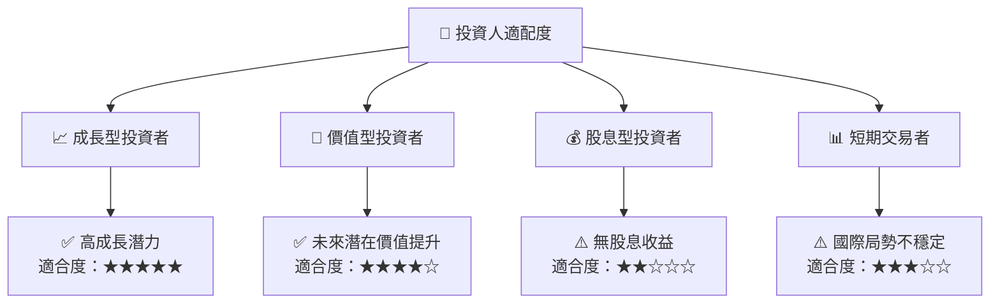

### 10.5 關鍵監控指標

| 項目 | 指標 | 關注點 | 頻率 |
|------|-------------|----------------|--------|
| 財務表現 | 營收成長率 | 確保增長勢頭 | 每季度 |
| 市場動向 | TAM 變化 | 潛在市場規模擴張 | 半年度 |
| 技術進展 | 新技術開發 | 技術領先地位保持 | 每季度 |

---

> **免責聲明**：本報告為 AI 自動生成，僅供研究參考，不構成投資建議。投資有風險，入市需謹慎。