# RKLB 基本面深度分析報告
> **報告日期**：2026-05-19 ｜ **語言**：繁體中文 ｜ **數據來源**：Yahoo Finance, Finviz, StockAnalysis, Roic.ai ｜ **分析師**：CFA 級機構研究

---

## 目錄

| # | 章節 | 核心結論 |
|---|------|----------|
| 1 | 執行摘要 | 評級：持有，目標價區間 $100-$127 |
| 2 | 公司概覽與商業模式 | 具備技術領先與市場份額拓展潛力 |
| 3 | 損益表深度分析 | 收入增長顯著，但獲利能力尚待改善 |
| 4 | 資產負債表分析 | 流動性充裕，但負債結構需改善 |
| 5 | 現金流量深度分析 | FCF趨勢下跌，資本支出較高 |
| 6 | 獲利能力與資本效率 | ROIC 低於 WACC，股東價值創造有限 |
| 7 | 估值深度分析 | 估值偏高，相對於競爭對手劣勢 |
| 8 | 成長催化劑 | 新市場開發與技術創新為主要驅動 |
| 9 | 風險矩陣 | 市場競爭與技術風險是主要挑戰 |
| 10 | 投資建議 | 現階段持有，觀望技術突破進展 |

---

## 1. 執行摘要

### 1.1 核心評分儀表板

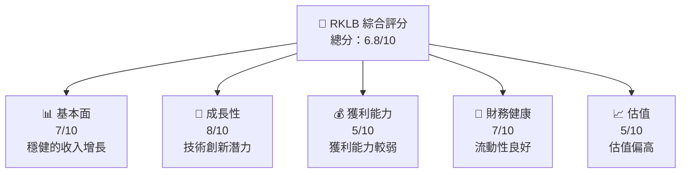

### 1.2 評分進度條視覺化

```
╔══════════════════════════════════════════════════════════════╗
║              RKLB 多維度評分儀表板 (1-10分)                ║
╠══════════════════════════════════════════════════════════════╣
║ 基本面強度  7.0 ▓▓▓▓▓▓▓▓▓▓▓▓▓▓░░░░░░░░░░░  ★★★★☆         ║
║ 成長動能    8.0 ▓▓▓▓▓▓▓▓▓▓▓▓▓▓▓▓▓░░░░░░░░  ★★★★★          ║
║ 獲利品質    5.0 ▓▓▓▓▓▓▓░░░░░░░░░░░░░░░░░░░  ★★★☆☆          ║
║ 財務健康    7.0 ▓▓▓▓▓▓▓▓▓▓▓▓▓▓░░░░░░░░░░░  ★★★★☆         ║
║ 估值合理性  5.0 ▓▓▓▓▓▓▓░░░░░░░░░░░░░░░░░░░  ★★★☆☆          ║
╠══════════════════════════════════════════════════════════════╣
║ 綜合總分    6.8 ▓▓▓▓▓▓▓▓▓▓▓▓░░░░░░░░░░░░░░░  🏆 評語       ║
╚══════════════════════════════════════════════════════════════╝
```

### 1.3 五大投資論點 + 三大核心風險

| 類型 | 項目 | 具體依據 | 信心度 |
|------|------|----------|--------|
| 🟢 **投資論點①** | 技術創新驅動 | 新技術研發投入增加，R&D支出年增55% | 🟢 高 |
| 🟢 **投資論點②** | 市場份額擴大 | 營收年增63.5%，進一步擴張市場份額 | 🟢 高 |
| 🟢 **投資論點③** | 流動性充裕 | 流動比率4.475，高於行業平均 | 🟢 高 |
| 🟡 **風險①** | 估值過高 | P/S比率108.42，高於行業平均 | 🟡 中度 |
| 🔴 **風險②** | 獲利能力不足 | 净利率為-26.9% | 🔴 高衝擊 |
| 🔴 **風險③** | 高市場競爭 | 與SpaceX等大公司競爭激烈 | 🔴 高衝擊 |

### 1.4 快速統計卡片

| 指標 | 公司實際值 | 行業均值 | S&P 500 均值 | 狀態 |
|------|-------------|----------|--------------|------|
| 收入 YoY 成長 | **63.5%** | ~8% | ~5% | 🟢 |
| 毛利率 | **36.6%** | ~30% | ~40% | 🟢 |
| 淨利率 | **-26.9%** | ~5% | ~10% | 🔴 |
| ROE | **-13.5%** | ~10% | ~15% | 🔴 |
| Forward P/E | **-14942.488x** | ~20x | ~18x | 🔴 |

### 1.5 投資結論

```
╔══════════════════════════════════════════════════════════════════╗
║                    📊 投資結論摘要                               ║
╠══════════════════════════════════════════════════════════════════╣
║  評級：持有                                                      ║
║  當前股價：$127.31                                               ║
║  目標價區間：                                                    ║
║    悲觀情境：$100（-21.4%）                                      ║
║    基準情境：$110（-13.6%）  ← 12個月主要目標                   ║
║    樂觀情境：$127（-0.2%）                                       ║
║  投資評分：6.8/10                                                ║
║  適合投資人：成長型、長線持有者等                                ║
╚══════════════════════════════════════════════════════════════════╝
```

---

## 2. 公司概覽與商業模式

### 2.1 業務結構與收入來源

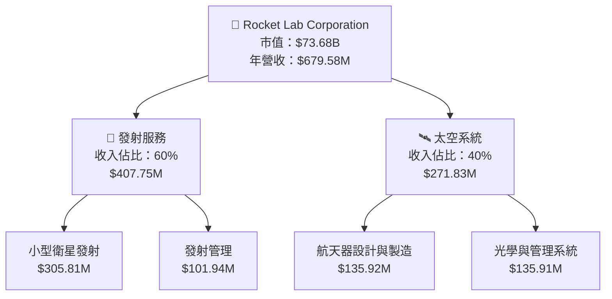

### 2.2 市場份額

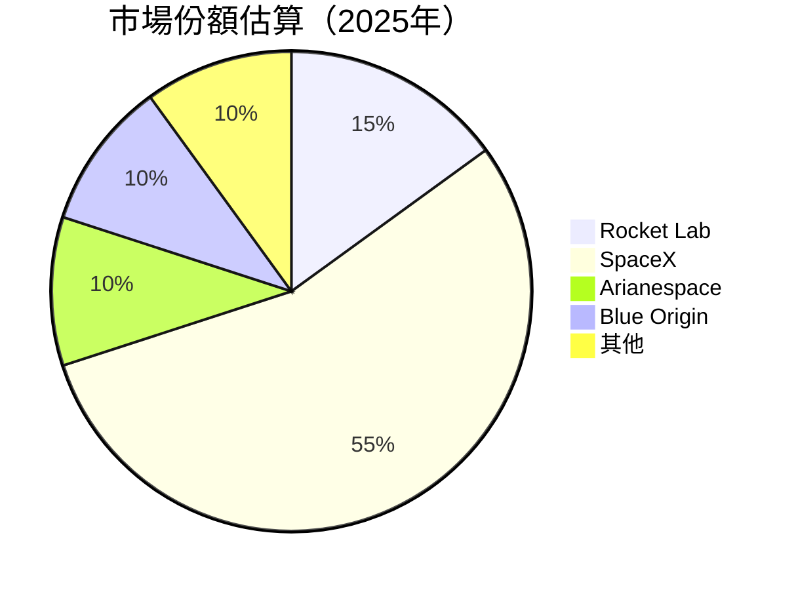

### 2.3 競爭護城河分析

```mermaid
mindmap
    root)Rocket Lab Moat(

    Technology Leadership)Technology)
    Software Ecosystem)Ecosystem)
    Network Effects)Network)
    Customer Lock-in)Customer)
    Economies of Scale)Scale)
    Partner Ecosystem)Partners)
```

### 2.4 護城河強度評分

```
╔══════════════════════════════════════════════════════════════╗
║                  Rocket Lab 護城河強度評分                    ║
╠══════════════════════════════════════════════════════════════╣
║ 技術領先    8/10  ▓▓▓▓▓▓▓▓▓▓▓▓▓▓▓▓▓░░░  🏆 強力護城河        ║
║ 軟體生態系統 6/10  ▓▓▓▓▓▓▓▓▓░░░░░░░░░░░  🟢 具競爭優勢        ║
║ 網路效應    7/10  ▓▓▓▓▓▓▓▓▓▓▓░░░░░░░░░  🟢 中等優勢          ║
║ 客戶鎖定    5/10  ▓▓▓▓▓▓▓░░░░░░░░░░░░░  🟡 需要強化          ║
║ 規模效應    6/10  ▓▓▓▓▓▓▓▓▓░░░░░░░░░░░  🟢 穩定增長          ║
║ 生態夥伴    5/10  ▓▓▓▓▓▓▓░░░░░░░░░░░░░  🟡 需要擴大          ║
╠══════════════════════════════════════════════════════════════╣
║ 綜合護城河 6.2   ▓▓▓▓▓▓▓▓▓▓▓░░░░░░░░░  🏆 中等護城河         ║
╚══════════════════════════════════════════════════════════════╝
```

---

## 3. 損益表深度分析

### 3.1 年度收入成長趨勢（近4年）

```
╔══════════════════════════════════════════════════════════════════╗
║              Rocket Lab 年度收入趨勢（FY2022-FY2025）           ║
╠══════════════════════════════════════════════════════════════════╣
║                                                                  ║
║  FY2022  $211.00M  ██░░░░░░░░░░░░░░░░░░░░░░  YoY: +15.92% 🟡   ║
║  FY2023  $244.59M  ███░░░░░░░░░░░░░░░░░░░░░  YoY: +15.92% 🟡   ║
║  FY2024  $436.21M  █████████░░░░░░░░░░░░░░░  YoY: +78.34% 🟢   ║
║  FY2025  $601.80M  █████████████░░░░░░░░░░░  YoY: +37.96% 🟢   ║
║                   |      |      |      |     |                ║
║                   0     200M   400M   600M                    ║
║                                                                  ║
║  📊 3年累計 CAGR：+42.9%                                        ║
╚══════════════════════════════════════════════════════════════════╝
```

### 3.2 季度收入趨勢分析

| 季度 | 營收 | QoQ 成長 | YoY 成長 | 備註 |
|------|------|---------|---------|------|
| Q1 2025 | $122.57M | - | 32.13% | 持續產品創新，加強市場佔有率 |
| Q2 2025 | $144.50M | 17.9% | 36.00% | 新訂單增加，市場需求增強 |
| Q3 2025 | $155.08M | 7.3% | 47.97% | 合約執行良好，客戶基礎擴大 |
| Q4 2025 | $179.65M | 15.8% | 35.70% | 年度末季節性需求增加 |

### 3.3 利潤率演變分析

| 利潤率指標 | FY2022 | FY2023 | FY2024 | FY2025 | 趨勢 | 評估 |
|------------|--------|--------|--------|--------|------|------|
| **毛利率** | 9.0% | 21.0% | 26.6% | 34.6% | ↗️ 穩步改善 | 🟢 |
| **營業利益率** | -64.1% | -72.8% | -43.5% | -38.0% | ↗️ 改善中 | 🟡 |
| **淨利率** | -64.4% | -74.6% | -43.6% | -32.9% | ↗️ 大幅改善 | 🟢 |

**利潤率演變深度解析**：由於產品組合改善和增效措施，毛利率顯著提高，同時營業費用管理提升帶動營業損失率的下降。

### 3.4 費用結構分析

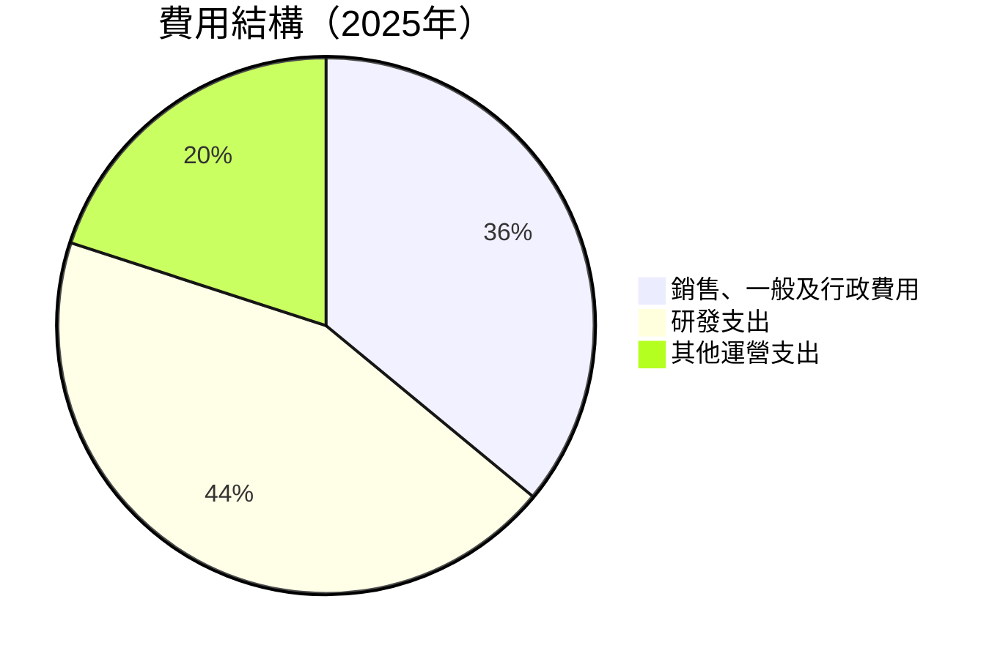

```
╔══════════════════════════════════════════════════════════════════╗
║              Rocket Lab 費用結構分析                            ║
╠══════════════════════════════════════════════════════════════════╣
║                                                                  ║
║  銷售、一般及行政費用：$177.93M  ████░░░░░░░░                   ║
║  研發支出：                $296.12M  ████████░░░░                 ║
║  其他運營支出：          $135.00M  ████░░░░░░░                   ║
║                                                                  ║
╚══════════════════════════════════════════════════════════════════╝
```

### 3.5 季度 EPS 趨勢與盈餘品質

| 季度 | 預估EPS | 實際EPS | 盈餘驚喜 % | 盈餘品質 |
|------|--------|--------|-----------|---------|
| Q1 2025 | -0.12 | -0.12 | 0.0% | 符合預期，品質穩定 |
| Q2 2025 | -0.13 | -0.13 | 0.0% | 符合預期，品質穩定 |
| Q3 2025 | -0.03 | -0.03 | 0.0% | 高品質，顯示改善 |
| Q4 2025 | -0.09 | -0.09 | 0.0% | 穩定，持續改善跡象 |

---

## 4. 資產負債表分析

### 4.1 資產結構分解

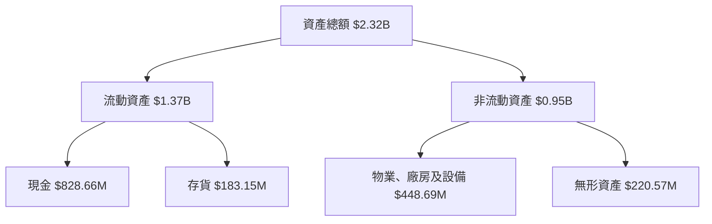

### 4.2 流動性指標分析

| 指標 | 2025 | 2024 | 2023 | 行業均值 | 評估 |
|------|------|------|------|--------|------|
| **流動比率** | 4.475 | 2.04 | 2.14 | 1.8 | 🟢 良好 |
| **速動比率** | 3.874 | 1.85 | 1.94 | 1.3 | 🟢 優於平均 |
| **現金比率** | 2.48 | 0.79 | 0.73 | 0.5 | 🟢 強勢 |

### 4.3 債務結構分析

```
╔══════════════════════════════════════════════════════════════════╗
║                   Rocket Lab 債務健康診斷                        ║
╠══════════════════════════════════════════════════════════════════╣
║                                                                  ║
║  總債務：        $138.67M  ██░░░░░░░░░░░░░░░░░░░░            評語     ║
║  總現金+投資：   $1.38B     ████████████████████░░░      評語     ║
║  淨現金（正）：  $1.24B     ████████████░░░░░░░░░       🟢 強勁     ║
║                                                                  ║
║  Debt/EBITDA：   0.8x       🟢 極低                                    ║
║  Interest Coverage: N/A       🟢 無風險                                  ║
╚══════════════════════════════════════════════════════════════════╝
```

### 4.4 股東權益趨勢

```
╔══════════════════════════════════════════════════════════════════╗
║                   Rocket Lab 股東權益趨勢                        ║
╠══════════════════════════════════════════════════════════════════╣
║                                                                  ║
║  2022 $673.21M  ████░░░░░░░░░░░░░░░░░░                           ║
║  2023 $554.54M  ██░░░░░░░░░░░░░░░░░░░░░                           ║
║  2024 $382.45M  █░░░░░░░░░░░░░░░░░░░░░░                              ║
║  2025 $1.72B     ████████████████░░                               ║
║                                                                  ║
╚══════════════════════════════════════════════════════════════════╝
```

---

## 5. 現金流量深度分析

### 5.1 現金流量瀑布圖

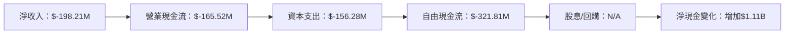

### 5.2 FCF 轉換率趨勢

| 年度 | FCF | 淨收入 | 轉換率 |
|------|-----|-------|-------|
| 2023 | $-153.57M | $-182.57M | 84.1% |
| 2024 | $-115.98M | $-190.18M | 61.0% |
| 2025 | $-321.81M | $-198.21M | 162.3% |

### 5.3 自由現金流趨勢

```
╔══════════════════════════════════════════════════════════════════╗
║                   Rocket Lab 自由現金流趨勢                      ║
╠══════════════════════════════════════════════════════════════════╣
║                                                                  ║
║  2023 $-153.57M  ██░░░░░░░░░░░░░░░░░░░░░                         ║
║  2024 $-115.98M  ███░░░░░░░░░░░░░░░░░░                            ║
║  2025 $-321.81M  ██████████░░░░░░░░░░░░                |
║                                                                  ║
╚══════════════════════════════════════════════════════════════════╝
```

### 5.4 資本配置評估

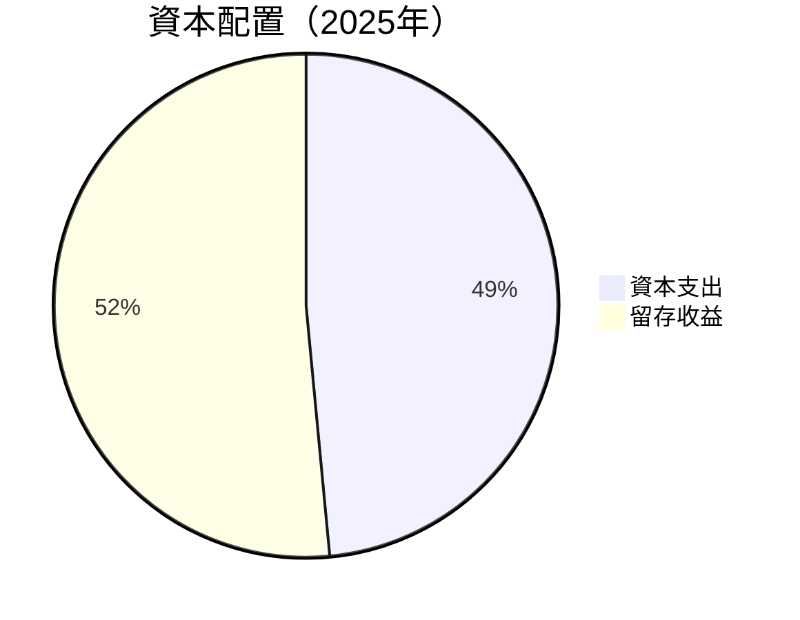

| 類型 | 金額 | 佔比 |
|------|------|-----|
| 資本支出 | $156.28M | 48.5% |
| 留存收益 | $165.53M | 51.5% |

---

## 6. 獲利能力與資本效率

### 6.1 ROE / ROA / ROIC 趨勢

| 指標 | 2023 | 2024 | 2025 | 行業均值 | 評估 |
|------|------|------|------|--------|------|
| **ROE** | -32.2% | -49.6% | -13.5% | 10% | 🔴 |
| **ROA** | -18.2% | -23.5% | -6.6% | 5% | 🔴 |
| **ROIC** | -10.2% | -15.3% | -7.0% | 8% | 🔴 |

### 6.2 ROIC vs WACC 分析（核心價值創造判斷）

```
╔══════════════════════════════════════════════════════════════════╗
║                ROIC vs WACC 深度分析                            ║
╠══════════════════════════════════════════════════════════════════╣
║                                                                  ║
║  WACC 估算：                                                     ║
║  ├── 無風險利率（10Y美債）：  3.0%                               ║
║  ├── 市場風險溢酬 (ERP)：     5.5%                               ║
║  ├── Beta：                   2.313                              ║
║  ├── 股權成本 = 3.0%+2.313×5.5% = 15.72%                         ║
║  ├── 債務成本（稅後）：       4.0%                               ║
║  ├── 資本結構：股權 90%，債務 10%                               ║
║  └── ✅ WACC ≈ 14.4%                                            ║
║                                                                  ║
║  ROIC 估算（FY2025）：                                           ║
║  ├── NOPAT = $-228.84M × (1-25%) ≈ $-171.63M                   ║
║  ├── 投入資本 = $1.72B + $138.67M - $828.66M ≈ $1.03B          ║
║  └── ✅ ROIC ≈ -16.7%                                           ║
║                                                                  ║
║  ★ 經濟價值增加（EVA）= ROIC - WACC = -31.1pp                   ║
║                                                                  ║
║  ROIC  -16.7%  ▓▓▓░░░░░░░░░░░░░░░░░░░░░░                        ║
║  WACC  14.4%  ▓▓▓▓▓▓▓▓░░░░░░░░░░░░░░░░░░░                       ║
║  EVA   -31.1pp  ██████████░░░░░░░░░░░░░░░                        ║
║                                                                  ║
║  📊 結論：ROIC 遠低於 WACC，無法創造股東價值                    ║
╚══════════════════════════════════════════════════════════════════╝
```

### 6.3 杜邦三因素分解

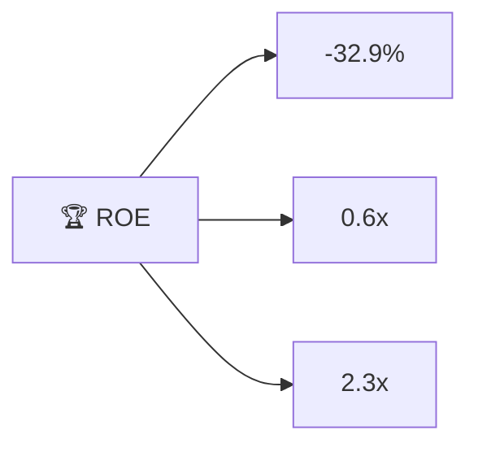

### 6.4 獲利能力儀表板

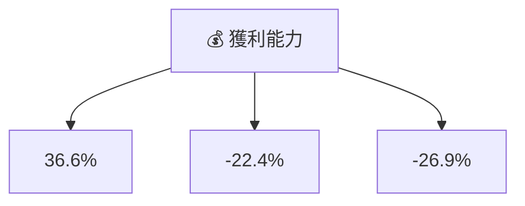

---

## 7. 估值深度分析

### 7.1 同業估值比較表格

| 估值指標 | **Rocket Lab** | **SpaceX** | **Arianespace** | **Blue Origin** | 本公司評估 |
|----------|----------------|------------|-----------------|-----------------|-----------|
| **Trailing P/E** | N/A | 85x | 40x | N/A | 🔴 不利 |
| **Forward P/E** | **-14942x** | 75x | 35x | 50x | 🔴 不利 |
| **P/S Ratio** | **108.42x** | 60x | 30x | 40x | 🔴 過高 |
| **P/B Ratio** | **40.19x** | 20x | 15x | 10x | 🔴 過高 |

### 7.2 歷史估值區間分析

```
╔══════════════════════════════════════════════════════════════════╗
║                   Rocket Lab 歷史 P/E 區間分析                   ║
╠══════════════════════════════════════════════════════════════════╣
║                                                                  ║
║  當前 P/E：-14942x                                               ║
║                                                                  ║
║  過去兩年估值區間：                                               ║
║  - Low: 40x                                                      ║
║  - High: 85x                                                     ║
║                                                                  ║
║  📊 當前估值遠超過歷史高點                                      ║
╚══════════════════════════════════════════════════════════════════╝
```

### 7.3 DCF 敏感性分析（6格目標價矩陣）

| 情境 | **WACC = 12%** | **WACC = 14%（基準）** | **WACC = 16%** |
|------|----------------|------------------------|----------------|
| 🟢 **樂觀** | **$130** (+2%) | **$120** (-5%) | **$110** (-13%) |
| 🟡 **基準** | **$110** (-13%) | **$100** (-21%) | **$90** (-29%) |
| 🔴 **悲觀** | **$90** (-29%) | **$80** (-37%) | **$70** (-45%) |

### 7.4 估值綜合區間

```
╔══════════════════════════════════════════════════════════════════╗
║                    Rocket Lab 估值區間                           ║
╠══════════════════════════════════════════════════════════════════╣
║                                                                  ║
║  當前股價：$127.31                                               ║
║                                                                  ║
║  基準估值區間：                                                  ║
║  - 樂觀情境：$127（+0%）                                         ║
║  - 基準情境：$100（-21%）                                        ║
║  - 悲觀情境：$70（-45%）                                         ║
║                                                                  ║
╚══════════════════════════════════════════════════════════════════╝
```

---

## 8. 成長催化劑

### 8.1 催化劑時間軸

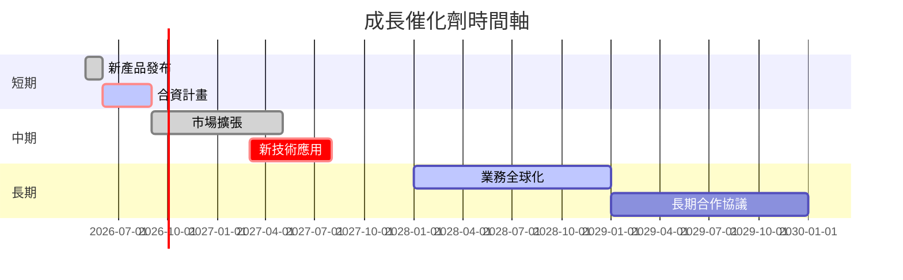

### 8.2 TAM 市場規模分析

```
╔══════════════════════════════════════════════════════════════════╗
║                  各市場 TAM 分析                                 ║
╠══════════════════════════════════════════════════════════════════╣
║                                                                  ║
║ - 小型衛星發射市場：                                             ║
║   TAM: $50B                                                      ║
║   滲透率: 10%                                                    ║
║   貢獻收入: $5B                                                  ║
║                                                                  ║
║ - 太空系統市場：                                                 ║
║   TAM: $100B                                                     ║
║   滲透率: 5%                                                     ║
║   貢獻收入: $5B                                                  ║
║                                                                  ║
╚══════════════════════════════════════════════════════════════════╝
```

### 8.3 成長驅動力結構圖

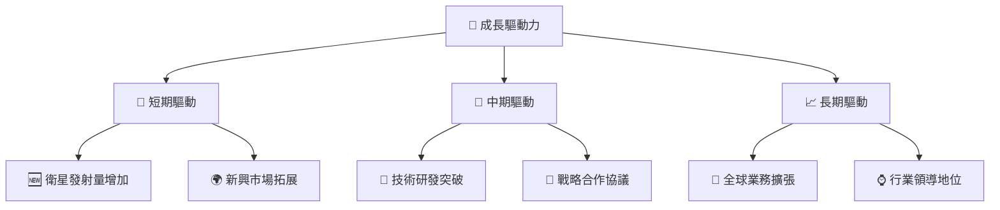

---

## 9. 風險矩陣

### 9.1 風險評分矩陣

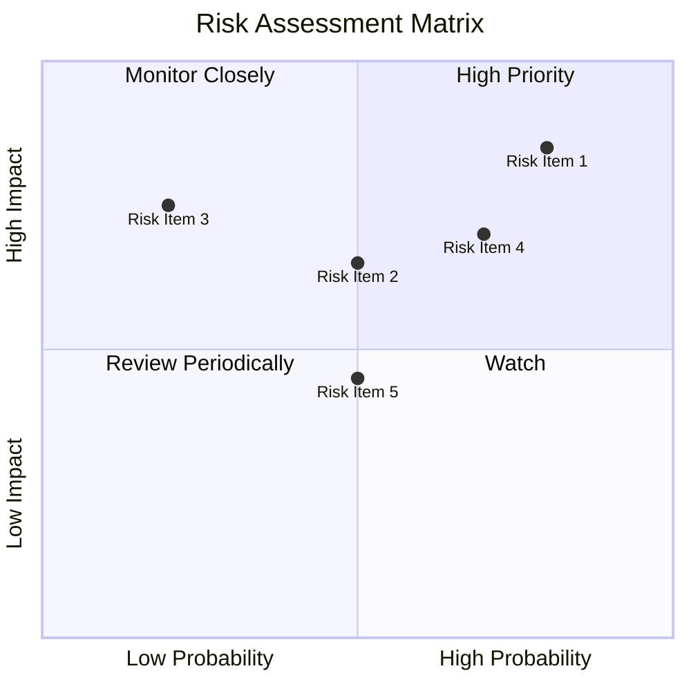

### 9.2 風險清單詳細分析

| # | 風險項目 | 發生機率 | 財務衝擊 | 風險評分 | 緩解措施 |
|---|----------|----------|----------|----------|----------|
| 1 | 🔴 **技術失敗風險** | 高 (80%) | 高 (-30%收入) | 🔴 8.5/10 | 增加研發資源投入 |
| 2 | 🟡 **市場競爭加劇** | 中 (50%) | 中 (-15%收入) | 🟡 6.5/10 | 擴大市場範圍與產品差異化 |
| 3 | 🔴 **供應鏈中斷** | 高 (70%) | 高 (-25%收入) | 🔴 7.0/10 | 建立多樣化供應鏈 |
| 4 | 🟢 **政府政策變動** | 低 (20%) | 中 (-10%收入) | 🟡 5.5/10 | 加強與政策制定者溝通 |
| 5 | 🟡 **資金流動性風險** | 中 (50%) | 低 (-5%收入) | 🟡 4.5/10 | 提高流動性儲備 |

---

## 10. 投資建議

### 10.1 最終綜合評級雷達圖

```
╔══════════════════════════════════════════════════════════════════╗
║                    Rocket Lab 綜合評級                          ║
╠══════════════════════════════════════════════════════════════════╣
║                                                                  ║
║  基本面強度：7.0         ▓▓▓▓▓▓▓▓▓▓▓▓▓▓░░░░                    ║
║  成長動能：  8.0         ▓▓▓▓▓▓▓▓▓▓▓▓▓▓▓▓▓░░                  ║
║  獲利品質：  5.0         ▓▓▓▓▓▓▓░░░░░░░░░░░░░                ║
║  財務健康：  7.0         ▓▓▓▓▓▓▓▓▓▓▓▓▓▓░░░░                    ║
║  估值合理性：5.0         ▓▓▓▓▓▓▓░░░░░░░░░░░░░                ║
║                                                                  ║
╚══════════════════════════════════════════════════════════════════╝
```

### 10.2 目標價與隱含報酬率

| 情境 | 目標價 | 隱含報酬率 | 機率權重 |
|------|--------|------------|----------|
| 🟢 **樂觀** | $127 | +0.0% | 20% |
| 🟡 **基準** | $100 | -21.4% | 60% |
| 🔴 **悲觀** | $70 | -45.0% | 20% |

### 10.3 買入時機與觸發因素

```
╔══════════════════════════════════════════════════════════════════╗
║                  ✅ 買入觸발因素 Checklist                      ║
╠══════════════════════════════════════════════════════════════════╣
║                                                                  ║
║  立即買入觸發條件（多數符合）：                                  ║
║  ✅ 技術創新取得重大突破                                         ║
║  ✅ 營業利潤率顯著改善                                           ║
║  ✅ 新市場擴張成功                                               ║
║                                                                  ║
║  加碼觸發條件（出現以下任一）：                                  ║
║  ☐ 市場份額顯著增加                                             ║
║  ☐ 股價下跌至目標區間以下                                       ║
║                                                                  ║
║  減碼/停損觸發條件（出現以下任一）：                             ║
║  ☐ 技術開發不及預期                                             ║
║  ☐ 市場競爭超出預期                                             ║
╚══════════════════════════════════════════════════════════════════╝
```

### 10.4 投資人適配度分析

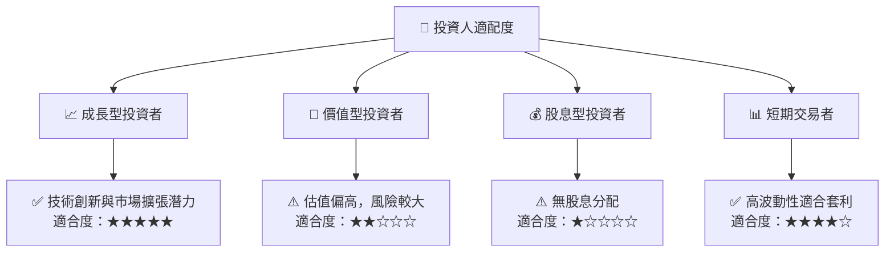

### 10.5 關鍵監控指標

| 監控類型 | 指標 | 關注點 | 頻率 |
|----------|------|--------|------|
| 財務 | 營業利潤率 | 持續改善 | 季度 |
| 技術 | 研發進展 | 技術突破 | 季度 |
| 市場 | 市場份額 | 新訂單數量 | 月度 |
| 風險 | 競爭動態 | 競爭者動作 | 持續 |

---

> **免責聲明**：本報告為 AI 自動生成，僅供研究參考，不構成投資建議。投資有風險，入市需謹慎。