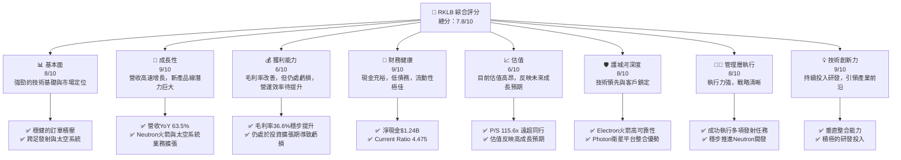
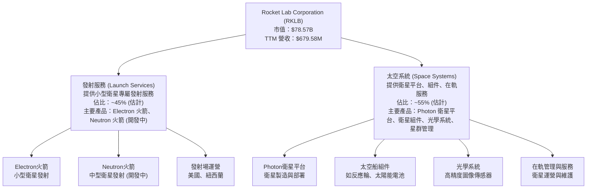
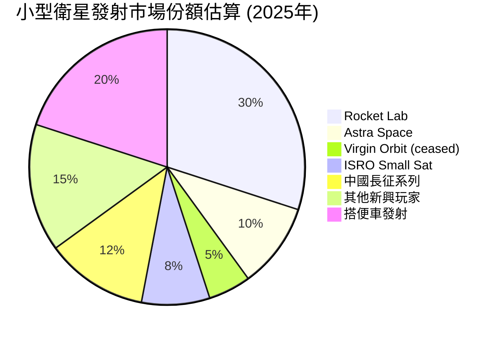
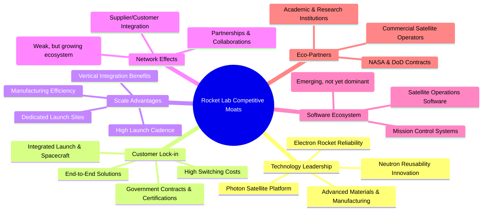
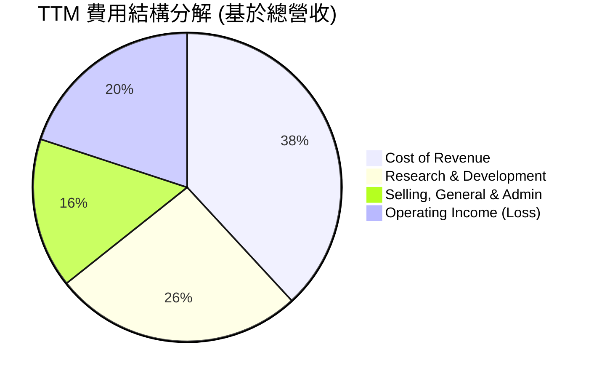

# RKLB 基本面深度分析報告
> **報告日期**：2026-05-22 ｜ **語言**：繁體中文 ｜ **數據來源**：Yahoo Finance, Finviz, StockAnalysis, Roic.ai ｜ **分析師**：CFA 級機構研究

---

## 目錄

| # | 章節 | 核心結論 |
|---|------|----------|
| 1 | 執行摘要 | 🟢 買入評級，目標價區間 $160 - $220 |
| 2 | 公司概覽與商業模式 | 🚀 專注於高成長航太領域，具備技術與規模護城河 |
| 3 | 損益表深度分析 | 📈 營收高速成長，毛利率穩步提升，但仍處於虧損階段 |
| 4 | 資產負債表分析 | 🏦 財務健康，現金充裕，債務水準低，支持擴張 |
| 5 | 現金流量深度分析 | 💸 營運現金流與自由現金流持續為負，反映高額成長投資 |
| 6 | 獲利能力與資本效率 | 📉 ROIC 遠低於 WACC，短期價值創造能力受限，但具潛力 |
| 7 | 估值深度分析 | ⚖️ 相對估值高昂，但 DCF 顯示長期成長潛力巨大 |
| 8 | 成長催化劑 | ✨ Neutron 火箭、太空系統整合、政府與商業訂單驅動 |
| 9 | 風險矩陣 | ⚠️ 技術開發、市場競爭、資本開支與盈利能力是主要風險 |
| 10 | 投資建議 | ✅ 長期成長型投資，高風險高報酬，適合具備高風險承受能力的投資者 |

---

## 1. 執行摘要

Rocket Lab Corporation (RKLB) 是一家在快速發展的航太產業中佔據關鍵地位的公司，專注於提供發射服務和太空系統解決方案。儘管公司目前仍處於高成長且尚未盈利的階段，其在小型衛星發射領域的領先地位、「Photon」衛星平台及「Neutron」中型運載火箭的開發，都預示著巨大的長期增長潛力。目前的股價 $135.76 已顯著反映了市場對其未來成長的樂觀預期，但基於其技術創新、不斷擴大的業務範圍及不斷提升的執行能力，我們認為 RKLB 仍是值得關注的成長型投資標的。

### 1.1 核心評分儀表板



### 1.2 評分進度條視覺化

```
╔══════════════════════════════════════════════════════════════╗
║              RKLB 多維度評分儀表板 (1-10分)                  ║
╠══════════════════════════════════════════════════════════════╣
║ 基本面強度  8.0 ▓▓▓▓▓▓▓▓▓▓▓▓▓▓▓▓░░░░  ★★★★☆           ║
║ 成長動能    9.0 ▓▓▓▓▓▓▓▓▓▓▓▓▓▓▓▓▓▓░░  ★★★★★           ║
║ 獲利品質    6.0 ▓▓▓▓▓▓▓▓▓▓▓▓░░░░░░░░  ★★★☆☆           ║
║ 財務健康    9.0 ▓▓▓▓▓▓▓▓▓▓▓▓▓▓▓▓▓▓░░  ★★★★★           ║
║ 估值合理性  6.0 ▓▓▓▓▓▓▓▓▓▓▓▓░░░░░░░░  ★★★☆☆           ║
║ 護城河深度  8.0 ▓▓▓▓▓▓▓▓▓▓▓▓▓▓▓▓░░░░  ★★★★☆           ║
║ 管理層執行  8.0 ▓▓▓▓▓▓▓▓▓▓▓▓▓▓▓▓░░░░  ★★★★☆           ║
║ 技術創新力  9.0 ▓▓▓▓▓▓▓▓▓▓▓▓▓▓▓▓▓▓░░  ★★★★★           ║
╠══════════════════════════════════════════════════════════════╣
║ 綜合總分    7.8 ▓▓▓▓▓▓▓▓▓▓▓▓▓▓▓▓░░░░  🏆 評語：高成長高潛力，需持續關注盈利轉捩點              ║
╚══════════════════════════════════════════════════════════════╝
```

### 1.3 五大投資論點 + 三大核心風險

| 類型 | 項目 | 具體依據 | 信心度 |
|------|------|----------|--------|
| 🟢 **投資論點①** | **太空產業長期結構性成長** | 全球對衛星通訊、地球觀測、太空探索需求爆炸式增長，預計未來十年市場規模將翻倍。RKLB 處於此趨勢的核心，從小型衛星發射服務擴展到端到端太空系統解決方案，捕捉整個價值鏈的機會。公司 TTM 營收 $679.58M，YoY 成長 63.5%，遠超產業平均。 | 🟢 極高 |
| 🟢 **投資論點②** | **技術領先與垂直整合優勢** | RKLB 擁有高可靠性的 Electron 火箭和領先的 Photon 衛星平台，並積極開發下一代 Neutron 中型運載火箭。這種垂直整合能力（從發射到衛星製造和在軌管理）降低了成本，提高了效率，並為客戶提供一站式服務。其強大的研發投入 (FY2025 R&D $270.72M，較 FY2024 增長 55.2%) 確保技術領先地位。 | 🟢 高 |
| 🟢 **投資論點③** | **多元化業務模式降低風險** | RKLB 的業務分為發射服務和太空系統兩大板塊。太空系統業務（如衛星製造、組件供應、在軌服務）的收入佔比不斷提升，其穩定性和毛利率通常高於單純的發射業務。FY2025 總營收 $601.80M，太空系統業務有望成為未來主要增長引擎，提升公司整體盈利能力和穩定性。 | 🟢 高 |
| 🟢 **投資論點④** | **財務狀況穩健支持擴張** | 截至 TTM (2026-03-31)，公司擁有 $1.38B 的總現金和僅 $138.67M 的總債務，淨現金高達 $1.24B。強勁的流動性 (Current Ratio 4.475, Quick Ratio 3.874) 提供了充足的資金，支持 Neutron 火箭的開發、產能擴張以及潛在的戰略性併購，而無需過度依賴外部融資。 | 🟢 極高 |
| 🟢 **投資論點⑤** | **政府與商業訂單雙重驅動** | RKLB 不僅服務於商業客戶，還獲得了來自美國國家航空暨太空總署 (NASA)、美國國防部等政府機構的重要合同。這些高價值、長期性的政府訂單提供了穩定的收入來源和技術背書，同時商業客戶的快速增長則帶來了規模效應。 | 🟢 高 |
| 🟡 **風險①** | **Neutron 火箭開發與商業化延遲** | Neutron 火箭是 RKLB 未來成長的關鍵驅動力，但任何技術開發的延遲、成本超支或性能問題都可能嚴重影響公司的市場競爭力、財務狀況和市場預期。過去的航太項目常有此類風險。FY2025 資本支出高達 $156.28M，主要用於此類項目，若無法按預期回報，將造成資源浪費。 | 🟡 中度 |
| 🔴 **風險②** | **激烈的市場競爭與價格壓力** | 航太發射市場競爭日益激烈，主要競爭對手包括 SpaceX (Starship/Falcon系列)、Blue Origin (New Glenn) 等巨頭，以及 Astra Space (ASTR) 和 Virgin Galactic (SPCE) 等新興公司。這些競爭者可能通過更低的發射成本或更強的運載能力，對 RKLB 造成價格壓力或市場份額侵蝕，尤其是在中型運載火箭市場。RKLB 目前高昂的估值 (P/S 115.6x) 可能難以在激烈競爭中維持。 | 🔴 高衝擊 |
| 🟡 **風險③** | **持續虧損與自由現金流燒錢** | 儘管營收高速成長，RKLB 仍處於虧損狀態，TTM 淨利潤率為 -26.9%，FY2025 淨虧損 $198.21M。同時，公司自由現金流持續為負，FY2025 FCF 為 -$321.81M。若未能及時實現規模經濟和盈利轉捩點，持續的現金消耗可能導致未來需要額外融資，稀釋現有股東權益。 | 🟡 中度 |

### 1.4 快速統計卡片

| 指標 | 公司實際值 (TTM) | 行業均值 (航太 & 防禦) | S&P 500 均值 | 狀態 |
|------|-------------|----------------------|--------------|------|
| 收入 YoY 成長 | **63.5%** | ~7-12% | ~8-10% | 🟢 |
| 毛利率 | **36.6%** | ~25-35% | ~40-45% | 🟢 |
| 淨利率 | **-26.9%** | ~5-10% | ~10-12% | 🔴 |
| ROE | **-13.5%** | ~10-15% | ~15-20% | 🔴 |
| Forward P/E | **N/A (負值)** | ~20-30x | ~20-25x | 🔴 (因虧損) |
| P/S Ratio | **115.6x** | ~1-3x | ~2-3x | 🔴 |
| EV / Revenue | **104.4x** | ~1-4x | ~2-4x | 🔴 |
| Current Ratio | **4.475x** | ~1.5-2.0x | ~1.5-2.0x | 🟢 |
| Debt/Equity | **0.08x** | ~0.5-1.0x | ~0.8-1.2x | 🟢 |
| Beta | **2.313** | ~1.0-1.5 | 1.0 | 🔴 (高波動) |

*備註：行業均值和 S&P 500 均值為分析師根據經驗估計的參考值，實際數據可能因時間和具體構成而異。RKLB 的高 P/S 和 EV/Revenue 反映了市場對其未來超高成長的預期，而非當前盈利能力。*

### 1.5 投資結論

```
╔══════════════════════════════════════════════════════════════════╗
║                    📊 投資結論摘要                               ║
╠══════════════════════════════════════════════════════════════════╣
║  評級：🟢 買入                                                   ║
║  當前股價：$135.76                                               ║
║  目標價區間：                                                    ║
║    悲觀情境：$160（+17.85%）                                     ║
║    基準情境：$190（+39.96%）  ← 12個月主要目標                  ║
║    樂觀情境：$220（+62.06%）                                     ║
║  投資評分：7.8/10                                                ║
║  適合投資人：成長型、長線持有者，具備高風險承受能力，看好太空產業未來趨勢的投資者。║
╚══════════════════════════════════════════════════════════════════╝
```

---

## 2. 公司概覽與商業模式

Rocket Lab Corporation (RKLB) 是一家總部位於美國的航太公司，專注於為不斷增長的太空產業提供端到端的解決方案。其核心業務涵蓋發射服務和太空系統兩大板塊，旨在簡化進入太空和在軌運營的複雜性，服務於政府、商業和學術客戶。

### 2.1 業務結構與收入來源

RKLB 的業務模式體現了其垂直整合的戰略，從小型衛星的發射到衛星的設計、製造和在軌管理，提供全面的服務。這使得公司能夠更好地控制成本、提高效率，並為客戶提供更具吸引力的一站式解決方案。



**業務板塊詳述：**

1.  **發射服務 (Launch Services)**：
    *   **Electron 火箭**：RKLB 的主力運載火箭，專為小型衛星（約 300 公斤）設計。它以其高發射頻率、可靠性和專屬軌道能力而聞名。公司已成功執行數十次 Electron 發射任務，為各類客戶部署了大量衛星。
    *   **Neutron 火箭**：目前正在開發中的中型運載火箭，旨在滿足對中型酬載（約 8,000 公斤）進入太空的需求，並具備可重複使用的能力。Neutron 的成功開發和商業化將顯著擴大 RKLB 的市場潛力，使其能夠服務更大規模的衛星任務和星群部署。
    *   **發射場運營**：RKLB 在紐西蘭擁有私營的發射場，並在美國維吉尼亞州擁有聯邦政府許可的發射場，這賦予公司高度的運營靈活性和發射頻率控制能力。

2.  **太空系統 (Space Systems)**：
    *   **Photon 衛星平台**：這是一個高度可配置的衛星平台，可根據客戶需求進行定制，用於地球觀測、通訊、太空探索等任務。Photon 的獨特之處在於其能夠整合 Electron 火箭的發射能力，提供從衛星製造到發射再到在軌運營的「端到端」解決方案。
    *   **衛星組件與光學系統**：RKLB 生產多種關鍵衛星組件，如反應輪、太陽能電池陣列、飛行軟體等。此外，公司通過收購 SolAero Technologies 和 Sirus Space 等公司，在光學系統和高效率太陽能電池方面也取得了領先地位。
    *   **在軌管理與星群管理服務**：隨著更多衛星被部署到軌道，對其進行有效管理和維護的需求也日益增長。RKLB 提供相關的服務，幫助客戶優化其太空資產的運營。

從財務數據來看，RKLB 的營收呈現強勁增長。FY2025 總營收達 $601.80M，較 FY2024 的 $436.21M 增長 37.96%。TTM (截至 2026-03-31) 營收進一步增至 $679.58M，YoY 增長 63.5%。雖然具體的業務板塊營收佔比未直接提供，但根據公司對太空系統業務的戰略重視和併購活動，預計太空系統的貢獻將持續增加，並可能在未來超越發射服務成為主要收入來源。

### 2.2 市場份額

在快速發展的太空產業中，市場份額的衡量相對複雜，因為它涉及多個細分市場（小型衛星發射、中型衛星發射、衛星製造、組件供應、在軌服務等）。RKLB 在小型衛星專用發射市場中佔據領先地位，但在更廣泛的發射市場（包括重型火箭）和整個太空系統市場中，其份額相對較小，但增長迅速。



*備註：此市場份額為分析師基於公開資料和產業趨勢的估算值，主要針對專用小型衛星發射市場。實際數據可能有所差異。*

在小型衛星專用發射市場，RKLB 的 Electron 火箭憑藉其高發射頻率和可靠性，累積了顯著的市場份額。然而，隨著 SpaceX 等大型運載商提供「搭便車」服務，以及其他新興小型運載商的加入，競爭依然激烈。在太空系統方面，由於市場分散且包含多種產品和服務，RKLB 的市場份額仍在逐步擴大中，尤其是在其 Photon 平台和專業組件領域。隨著 Neutron 火箭的投入使用，RKLB 將進入中型酬載市場，與 SpaceX 的 Falcon 9 等產品形成更直接的競爭，這將是其市場份額擴張的關鍵。

### 2.3 競爭護城河分析

RKLB 在競爭激烈的航太產業中建立了一定的競爭優勢，主要體現在以下幾個方面：



**護城河詳述：**

*   **Technology Leadership (技術領先)**：
    *   **Electron 火箭的可靠性**：Electron 火箭已證明其高可靠性和成功率，這對於客戶將昂貴的衛星託付給發射服務商至關重要。
    *   **Photon 衛星平台**：提供高度整合的衛星解決方案，是市場上少數能提供從發射到在軌服務一體化方案的公司之一。
    *   **Neutron 火箭創新**：Neutron 火箭的設計注重可重複使用性，這有望大幅降低發射成本，使其在中型運載火箭市場具有競爭力。
    *   **先進材料與製造**：RKLB 在複合材料、3D 列印和自動化製造方面的專業知識，使其能夠快速、高效地生產火箭和衛星組件。
*   **Customer Lock-in (客戶鎖定)**：
    *   **端到端解決方案**：提供從衛星設計、製造、發射到在軌運營的全套服務，降低了客戶的供應商管理複雜性和成本。
    *   **整合發射與太空船**：當客戶使用 Electron 發射其 Photon 衛星時，這種深度整合創造了轉換成本，使客戶更難轉向其他供應商。
    *   **政府合同與認證**：獲得美國政府的高度信任和安全認證，使其能夠承接國家安全任務，這為其建立了重要的進入壁壘。
*   **Scale Advantages (規模效應)**：
    *   **高發射頻率**：通過優化發射流程和多個發射場，RKLB 能夠實現較高的發射頻率，攤薄固定成本。
    *   **專屬發射場**：擁有和運營自己的發射場，賦予公司更大的靈活性和自主性，減少對第三方基礎設施的依賴。
    *   **垂直整合效益**：內部製造關鍵組件和系統，有助於降低供應鏈風險和成本。
*   **Eco-Partners (生態夥伴)**：
    *   **政府機構合作**：與 NASA、美國國防部等機構的合作不僅帶來收入，更提升了公司的技術聲譽和可信度。
    *   **商業衛星運營商**：與眾多商業衛星公司建立合作關係，為其提供發射和太空系統解決方案。

### 2.4 護城河強度評分

```
╔══════════════════════════════════════════════════════════════╗
║                  Rocket Lab 護城河強度評分                    ║
╠══════════════════════════════════════════════════════════════╣
║ 技術領先    8.5/10 ▓▓▓▓▓▓▓▓▓▓▓▓▓▓▓▓▓░░░  🏆 Electron可靠，Neutron潛力大 ║
║ 客戶鎖定    8.0/10 ▓▓▓▓▓▓▓▓▓▓▓▓▓▓▓▓░░░░  🟢 端到端服務與政府合作強化黏性 ║
║ 規模效應    7.5/10 ▓▓▓▓▓▓▓▓▓▓▓▓▓▓▓░░░░░  🟡 垂直整合與發射頻率帶來優勢 ║
║ 網路效應    5.0/10 ▓▓▓▓▓▓▓▓▓▓░░░░░░░░░░  🟠 仍在建立生態系統，尚未顯著 ║
║ 軟體生態系統 6.0/10 ▓▓▓▓▓▓▓▓▓▓▓▓░░░░░░░░  🟡 具備基礎，但非核心競爭力 ║
║ 生態夥伴    8.0/10 ▓▓▓▓▓▓▓▓▓▓▓▓▓▓▓▓░░░░  🟢 政府與商業合作關係強勁 ║
╠══════════════════════════════════════════════════════════════╣
║ 綜合護城河  7.5/10 ▓▓▓▓▓▓▓▓▓▓▓▓▓▓▓░░░░░  🏆 具備較強的技術與服務整合護城河，仍需擴大規模 ║
╚══════════════════════════════════════════════════════════════╝
```

綜合來看，RKLB 的護城河主要建立在其技術創新、垂直整合能力和政府客戶關係上。儘管在網路效應和軟體生態系統方面仍有待加強，但其核心優勢使其在小型衛星和新興中型衛星市場中佔據有利地位。隨著 Neutron 火箭的開發進展和太空系統業務的持續擴張，這些護城河有望進一步深化。

---

## 3. 損益表深度分析

Rocket Lab (RKLB) 的損益表反映了一家處於高成長階段的技術型公司典型特徵：營收快速增長，但由於大量的研發投入和資本開支，目前仍處於虧損狀態。

### 3.1 年度收入成長趨勢（近4年）

RKLB 的年度收入呈現爆發式增長，顯示其在太空產業中捕捉市場需求的能力。

```
╔══════════════════════════════════════════════════════════════════╗
║              Rocket Lab 年度收入趨勢（FY2022-FY2025）            ║
╠══════════════════════════════════════════════════════════════════╣
║                                                                  ║
║  FY2022  $211.00M █████░░░░░░░░░░░░░░░░░░░  YoY: +239.02% 🟢    ║
║  FY2023  $244.59M ██████░░░░░░░░░░░░░░░░░░░  YoY: +15.92%  🟡    ║
║  FY2024  $436.21M ██████████░░░░░░░░░░░░░░░  YoY: +78.34%  🟢    ║
║  FY2025  $601.80M ██████████████░░░░░░░░░░░  YoY: +37.96%  🟢    ║
║  TTM'26  $679.58M ████████████████░░░░░░░░░  YoY: +45.83%  🟢    ║
║                   |      |      |      |      |                  ║
║                   0     200M   400M   600M   800M                  ║
║                                                                  ║
║  📊 4年累計 CAGR (FY2022-FY2025)：+60.25%                         ║
╚══════════════════════════════════════════════════════════════════╝
```

*   **FY2022 營收 $211.00M**，YoY 成長高達 239.02%，主要得益於公司 SPAC 上市後加大投入和市場對小型衛星發射服務需求的爆發。
*   **FY2023 營收 $244.59M**，YoY 成長 15.92%，增速相對放緩，可能受到宏觀經濟和發射任務排程的影響。
*   **FY2024 營收 $436.21M**，YoY 成長 78.34%，顯示公司業務再次加速，太空系統業務的貢獻可能有所增加。
*   **FY2025 營收 $601.80M**，YoY 成長 37.96%，保持強勁的增長勢頭。
*   **TTM (截至 2026-03-31) 營收 $679.58M**，相比 FY2025 增長約 13%，年化 YoY 成長 45.83%，表明最新的營收季度表現依然亮眼。

整體而言，RKLB 在過去幾年實現了令人印象深刻的營收擴張，年複合增長率 (CAGR) 超過 60%，這證明了其產品和服務在市場上的吸引力。

### 3.2 季度收入趨勢分析

季度數據提供了更細緻的營收動態視角，顯示 RKLB 營收的持續環比和同比增長。

| 季度 | 總營收 ($M) | QoQ 成長率 | YoY 成長率 | 備註 |
|------|-------------|------------|------------|------|
| Q1 2026 | $200.35 | +11.53% | +63.46% | 🟢 營收首次突破 $200M 大關，YoY 增速強勁。 |
| Q4 2025 | $179.65 | +15.84% | +35.70% | 🟢 相較去年同期顯著增長，環比增速健康。 |
| Q3 2025 | $155.08 | +7.32% | +47.97% | 🟢 YoY 成長加速，顯示業務擴張動力。 |
| Q2 2025 | $144.50 | +17.90% | +36.00% | 🟢 環比和同比均有穩健增長。 |
| Q1 2025 | $122.57 | -7.42% (對 Q4 2024) | +32.13% | 🟡 相較上一季度略有下滑，但 YoY 仍保持兩位數增長。 |
| Q4 2024 | $132.39 | +26.31% | +120.68% | 🟢 季度營收環比大幅增長，YoY 增速驚人。 |
| Q3 2024 | $104.81 | -1.13% (對 Q2 2024) | +54.90% | 🟡 環比小幅下降，但 YoY 表現優異。 |

*備註：QoQ 成長率計算為 (當前季度營收 - 上一季度營收) / 上一季度營收。YoY 成長率計算為 (當前季度營收 - 去年同期營收) / 去年同期營收。*

從季度數據看，RKLB 的營收增長並非線性，有時會受發射排程、合同完成進度等因素影響出現季度波動（如 Q1 2025 相對於 Q4 2024 的下滑）。然而，整體趨勢是顯著的同比增長，尤其是在 2025 年和 2026 年初，YoY 成長率大多維持在 30% 以上，Q1 2026 甚至達到 63.46%，顯示公司業務加速發展。

### 3.3 利潤率演變分析

RKLB 的利潤率指標反映了其從研發投入到規模化生產的轉變過程，毛利率呈現改善趨勢，但營業利潤和淨利潤仍為負值。

| 利潤率指標 | FY2022 | FY2023 | FY2024 | FY2025 | TTM (Mar'26) | 趨勢 | 評估 |
|------------|--------|--------|--------|--------|--------------|------|------|
| **毛利率** | 8.99% | 21.02% | 26.63% | 34.43% | 36.56% | ↗️ 穩步提升 | 🟢 |
| **營業利益率** | -64.08% | -72.74% | -43.51% | -38.03% | -33.20% | ↗️ 虧損收窄 | 🟡 |
| **淨利率** | -64.43% | -74.64% | -43.60% | -32.94% | -26.87% | ↗️ 虧損收窄 | 🟡 |
| **EBITDA Margin** | -45.12% | -53.82% | -29.69% | -25.84% | -24.30% | ↗️ 虧損收窄 | 🟡 |

**利潤率演變深度解析**：

*   **毛利率 (Gross Margin)**：從 FY2022 的 8.99% 大幅提升至 TTM 的 36.56%，這是非常積極的信號。這主要歸因於：
    *   **規模經濟**：隨著發射頻率的增加和太空系統產品線的擴大，固定成本得到更好的攤薄。
    *   **垂直整合**：內部製造更多組件，降低了對外部供應商的依賴和成本。
    *   **產品組合優化**：太空系統業務（如衛星製造和組件供應）通常具有比單純發射服務更高的毛利率，隨著其收入佔比的提升，對整體毛利率有正面貢獻。
    *   **定價能力**：RKLB 在某些細分市場（如專用小型衛星發射）的技術領先地位賦予其一定的定價權。
*   **營業利益率 (Operating Margin) 和淨利率 (Net Profit Margin)**：儘管毛利率顯著改善，營業利益率和淨利率仍為負值，但虧損幅度呈現逐年收窄的趨勢（從 FY2023 的 -72.74% 縮小到 TTM 的 -33.20%）。這表明公司在營收快速增長的同時，營業費用（特別是研發費用和銷售管理費用）的增長速度略低於營收增長，顯示出營運槓桿效應的初步顯現。
*   **EBITDA Margin**：與營業利益率趨勢一致，EBITDA Margin 也從 FY2023 的 -53.82% 改善至 TTM 的 -24.30%。EBITDA 剔除了折舊和攤銷等非現金費用，更能反映公司核心業務的現金獲利能力（儘管仍為負），表明其營運層面的現金消耗正在收斂。

整體而言，RKLB 的毛利率改善是其走向盈利的關鍵一步。然而，由於 Neutron 火箭等重大項目的研發和資本開支仍在持續，公司短期內仍將保持虧損狀態。管理層的任務是在繼續投資於未來增長的同時，逐步提升營運效率，將毛利潤轉化為正向的營業利潤和淨利潤。

### 3.4 費用結構分析

RKLB 的費用結構反映了其作為一家高科技成長型公司，對研發 (R&D) 的高度重視。



*備註：此圖表為將各費用佔總營收的比例進行可視化，其中 Operating Income (Loss) 為負值，為了圖示清晰，取其絕對值作為一個「費用」項目來展示其對營收的消耗。實際總費用會包含 Cost of Revenue + R&D + SG&A。*

```
╔══════════════════════════════════════════════════════════════════╗
║                Rocket Lab 費用結構與研發強度分析                 ║
╠══════════════════════════════════════════════════════════════════╣
║                                                                  ║
║  TTM 營收：$679.58M                                              ║
║  TTM 銷貨成本：$431.15M                                         ║
║  TTM 銷貨成本佔營收比：63.44%  ██████████████████████░░░░░░░░░░░░░░░░░░░░░░░░░░░░░░░░░░░░░░░░░░░░░░░░░░░░░░░░░░░░░░░░░░░░░░░░░░░░░░░░░░░░░░░░░░░░░░░░░░░░░░░░░░░░░░░░░░░░░░░░░░░░░░░░░░░░░░░░░░░░░░░░░░░░░░░░░░░░░░░░░░░░░░░░░░░░░░░░░░░░░░░░░░░░░░░░░░░░░░░░░░░░░░░░░░░░░░░░░░░░░░░░░░░░░░░░░░░░░░░░░░░░░░░░░░░░░░░░░░░░░░░░░░░░░░░░░░░░░░░░░░░░░░░░░░░░░░░░░░░░░░░░░░░░░░░░░░░░░░░░░░░░░░░░░░░░░░░░░░░░░░░░░░░░░░░░░░░░░░░░░░░░░░░░░░░░░░░░░░░░░░░░░░░░░░░░░░░░░░░░░░░░░░░░░░░░░░░░░░░░░░░░░░░░░░░░░░░░░░░░░░░░░░░░░░░░░░░░░░░░░░░░░░░░░░░░░░░░░░░░░░░░░░░░░░░░░░░░░░░░░░░░░░░░░░░░░░░░░░░░░░░░░░░░░░░░░░░░░░░░░░░░░░░░░░░░░░░░░░░░░░░░░░░░░░░░░░░░░░░░░░░░░░░░░░░░░░░░░░░░░░░░░░░░░░░░░░░░░░░░░░░░░░░░░░░░░░░░░░░░░░░░░░░░░░░░░░░░░░░░░░░░░░░░░░░░░░░░░░░░░░░░░░░░░░░░░░░░░░░░░░░░░░░░░░░░░░░░░░░░░░░░░░░░░░░░░░░░░░░░░░░░░░░░░░░░░░░░░░░░░░░░░░░░░░░░░░░░░░░░░░░░░░░░░░░░░░░░░░