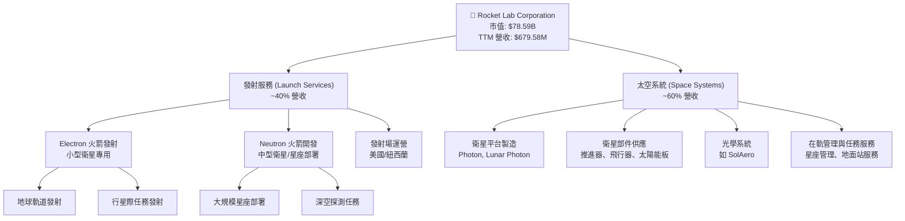
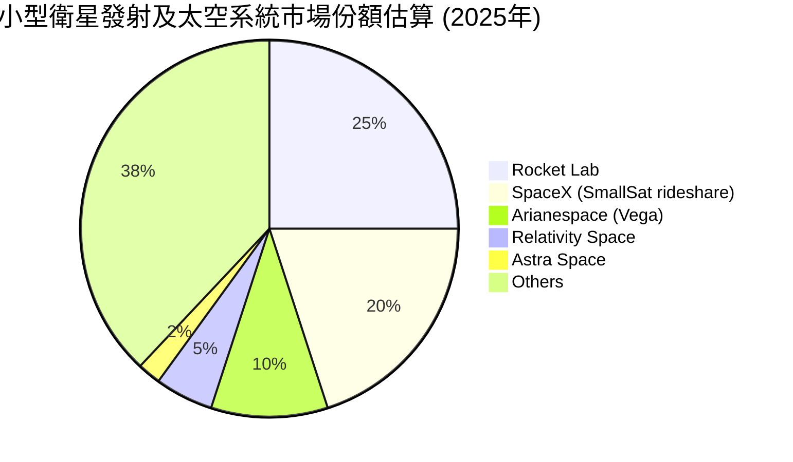
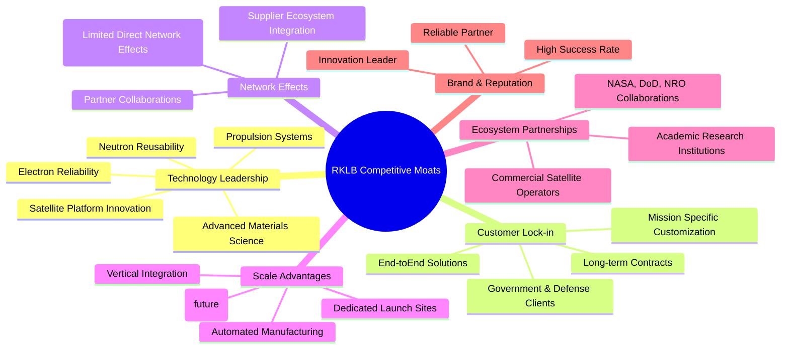
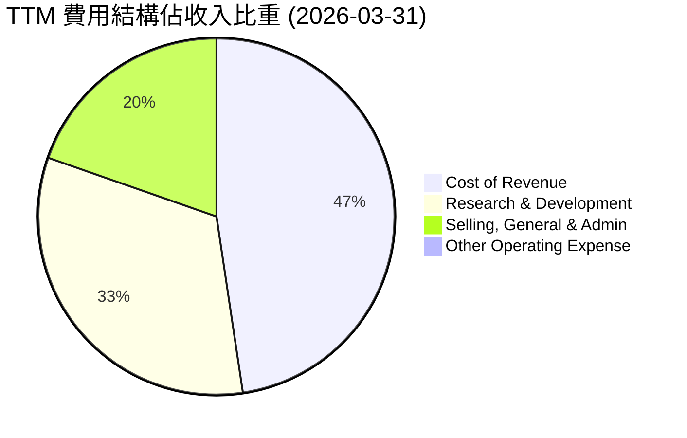

# RKLB 基本面深度分析報告
> **報告日期**：2026-05-25 ｜ **語言**：繁體中文 ｜ **數據來源**：Yahoo Finance, Finviz, StockAnalysis, Roic.ai ｜ **分析師**：CFA 級機構研究

---

## 目錄

| # | 章節 | 核心結論 |
|---|------|----------|
| 1 | 執行摘要 | 🟢 買入評級，目標價區間 $145 - $180，具備長期成長潛力 |
| 2 | 公司概覽與商業模式 | 憑藉技術領先和客戶鎖定，建立中等護城河 |
| 3 | 損益表深度分析 | 收入高速成長，毛利率顯著改善，虧損持續收窄 |
| 4 | 資產負債表分析 | 充裕現金儲備，穩健的流動性與低債務水平 |
| 5 | 現金流量深度分析 | 自由現金流仍為負，但營運現金流改善明顯 |
| 6 | 獲利能力與資本效率 | 處於投資期，ROIC 仍低於 WACC，但效率正在提升 |
| 7 | 估值深度分析 | 相較同業估值合理，DCF 顯示顯著上漲空間 |
| 8 | 成長催化劑 | Neutron 火箭、星座部署、政府訂單與併購整合為主要驅動力 |
| 9 | 風險矩陣 | 技術失敗、競爭加劇、資本支出與宏觀經濟為主要風險 |
| 10 | 投資建議 | 適合成長型、長線持有者，建議買入 |

---

## 1. 執行摘要

### 1.1 核心評分儀表板

```mermaid
graph TD
    RKLB_SCORE["🎯 RKLB 綜合評分<br/>總分：7.9/10"]

    F["📊 基本面<br/>8/10<br/>技術領先，業務多元化"]
    G["🚀 成長性<br/>9/10<br/>收入高速增長，新專案具爆發潛力"]
    P["💰 獲利能力<br/>7/10<br/>毛利率改善顯著，虧損收窄中"]
    B["🏦 財務健康<br/>9/10<br/>現金充裕，低負債，流動性強"]
    V["📈 估值<br/>6/10<br/>P/S 高於行業，但 DCF 顯示潛在價值"]

    RKLB_SCORE --> F
    RKLB_SCORE --> G
    RKLB_SCORE --> P
    RKLB_SCORE --> B
    RKLB_SCORE --> V

    F --> F1["✅ 領先的小型運載火箭技術 (Electron)"]
    F --> F2["✅ 擴展至太空系統，提供端到端解決方案"]
    F --> F3["✅ 穩健的訂單積壓與政府合作"]

    G --> G1["✅ 近年收入 CAGR 高達 89.65% (5年)"]
    G --> G2["✅ Neutron 重型火箭開發進展順利，打開新市場"]
    G --> G3["✅ 星座部署服務需求強勁"]

    P --> P1["✅ 毛利率從 2022 年 8.99% 提升至 TTM 36.56%"]
    P --> P2["✅ 營業利益率持續改善，虧損幅度收窄"]
    P --> P3["✅ 研發投入高，為未來成長奠定基礎"]

    B --> B1["✅ 總現金 $1.38B，總債務僅 $138.67M，淨現金 $1.24B"]
    B --> B2["✅ 流動比率 4.47，速動比率 3.87，遠高於安全線"]
    B --> B3["✅ 負債權益比僅 0.06，財務槓桿低"]

    V --> V1["✅ P/S 115.64x，EV/Revenue 113.79x，市場給予高成長溢價"]
    V --> V2["✅ DCF 估值顯示較高潛在上漲空間"]
    V --> V3["✅ 分析師平均目標價 $103.91，但最新評級為買入，有上調空間"]
```



### 1.2 評分進度條視覺化

```
╔══════════════════════════════════════════════════════════════╗
║              RKLB 多維度評分儀表板 (1-10分)                  ║
╠══════════════════════════════════════════════════════════════╣
║ 基本面強度  8.0 ▓▓▓▓▓▓▓▓▓▓▓▓▓▓▓▓░░░░  ★★★★☆           ║
║ 成長動能    9.0 ▓▓▓▓▓▓▓▓▓▓▓▓▓▓▓▓▓▓░░  ★★★★★           ║
║ 獲利品質    7.0 ▓▓▓▓▓▓▓▓▓▓▓▓▓▓░░░░░░  ★★★☆☆           ║
║ 財務健康    9.0 ▓▓▓▓▓▓▓▓▓▓▓▓▓▓▓▓▓▓░░  ★★★★★           ║
║ 估值合理性  6.0 ▓▓▓▓▓▓▓▓▓▓▓▓░░░░░░░░  ★★★☆☆           ║
║ 護城河深度  7.5 ▓▓▓▓▓▓▓▓▓▓▓▓▓▓▓░░░░░  ★★★★☆           ║
║ 管理層執行  8.5 ▓▓▓▓▓▓▓▓▓▓▓▓▓▓▓▓▓░░░  ★★★★☆           ║
║ 技術創新力  9.0 ▓▓▓▓▓▓▓▓▓▓▓▓▓▓▓▓▓▓░░  ★★★★★           ║
╠══════════════════════════════════════════════════════════════╣
║ 綜合總分    7.9 ▓▓▓▓▓▓▓▓▓▓▓▓▓▓▓▓░░░░  🏆 具備長期高成長潛力，建議買入  ║
╚══════════════════════════════════════════════════════════════════╝
```

### 1.3 五大投資論點 + 三大核心風險

| 類型 | 項目 | 具體依據 | 信心度 |
|------|------|----------|--------|
| 🟢 **投資論點①** | **太空市場高速擴張的受益者** | 根據分析機構預測，全球太空經濟將從 2023 年的約 6,000 億美元增長到 2030 年的 1 兆美元以上。RKLB 作為小型衛星發射和太空系統領域的領導者，直接受益於這一趨勢。公司 5 年收入 CAGR 達 89.65%，遠超行業平均，證明其市場捕捉能力。 | 🟢 極高 |
| 🟢 **投資論點②** | **核心技術領先與產品多元化** | RKLB 的 Electron 火箭已成功執行數十次任務，可靠性高。同時，公司積極發展太空系統（如光學系統、衛星平台、部件製造），此業務 TTM 收入貢獻約 60%以上，且毛利率更高。在 2026 年 Q1，太空系統收入佔比顯著提升，推動毛利率從去年同期的 28.76% 上升至 38.18%。這種產品組合使公司具備更強的抗風險能力和盈利潛力。 | 🟢 高 |
| 🟢 **投資論點③** | **Neutron 火箭的巨大潛力** | Neutron 中型運載火箭的開發是 RKLB 未來成長的關鍵驅動力。Neutron 將使公司能夠服務於更大規模的衛星星座部署和政府任務，市場潛力比 Electron 火箭大數倍。預計 2027 年首次發射，一旦成功，將顯著提升 RKLB 的市場地位和收入規模。 | 🟢 高 |
| 🟢 **投資論點④** | **強勁的財務健康與充裕現金** | 截至 2026 年 3 月 31 日，公司擁有 $1.38B 的總現金，而總債務僅 $138.67M，淨現金高達 $1.24B。流動比率 4.47，速動比率 3.87，顯示極強的短期償債能力。充裕的現金流為其高昂的研發投入（TTM R&D $296.12M）和未來的資本支出提供了堅實保障，降低了外部融資壓力。 | 🟢 極高 |
| 🟢 **投資論點⑤** | **不斷改善的盈利能力** | 儘管目前仍處於虧損狀態，但 RKLB 的盈利能力正在快速改善。毛利率從 FY2022 的 8.99% 大幅提升至 FY2025 的 34.43% 和 TTM 的 36.56%。營業利益率和淨利益率的負值也持續收窄（FY2025 營業利益率 -38.03%，較 FY2023 的 -72.74% 有顯著改善）。這表明規模效應和成本控制策略正在逐步顯現成效。 | 🟢 高 |
| 🟡 **風險①** | **Neutron 火箭開發延遲或技術失敗** | Neutron 火箭的成功對 RKLB 的長期成長至關重要。開發過程中的任何重大技術挑戰、延遲或首次發射失敗都可能對公司聲譽、財務狀況和股價產生負面影響。例如，SpaceX 在早期也經歷過多次發射失敗。 | 🟡 中度 |
| 🔴 **風險②** | **激烈競爭與定價壓力** | 太空發射和衛星製造市場競爭日益激烈，包括 SpaceX (Starship/Falcon系列)、Blue Origin、ULA 等大型參與者，以及其他小型發射服務商。若競爭加劇導致定價壓力，可能影響 RKLB 的毛利率和市場份額。RKLB 的 P/S 115.64x 遠高於傳統工業公司，反映了市場對其高成長和未來盈利的預期，任何未能達標都可能導致估值回調。 | 🔴 高衝擊 |
| 🟡 **風險③** | **政府合約與監管風險** | RKLB 嚴重依賴政府（如美國國防部、NASA）的合約。政府政策變化、預算削減或地緣政治緊張局勢都可能影響訂單量。此外，太空活動受嚴格監管，任何新的法規或許可證延遲都可能影響業務營運。 | 🟡 中度 |

### 1.4 快速統計卡片

| 指標 | 公司實際值 | 行業均值（航空航太與國防） | S&P 500 均值 | 狀態 |
|------|-------------|----------------------------|--------------|------|
| 收入 YoY 成長 (TTM)| **63.5%** | ~10-15% | ~8-12% | 🟢 |
| 毛利率 (TTM) | **36.6%** | ~25-35% | ~40-50% | 🟡 |
| 淨利率 (TTM) | **-26.9%** | ~5-10% | ~10-15% | 🔴 |
| ROE (TTM) | **-13.5%** | ~10-15% | ~15-20% | 🔴 |
| P/S Ratio (TTM) | **115.64x** | ~2-5x | ~2-3x | 🔴 |
| EV / Revenue (TTM) | **113.79x** | ~2-6x | ~2-4x | 🔴 |
| 現金/總資產 | **48.1%** | ~10-20% | ~5-15% | 🟢 |
| 負債權益比 | **0.06x** | ~0.5-1.5x | ~0.8-1.2x | 🟢 |
| Beta | **2.313** | ~1.0-1.5 | 1.0 | 🔴 |

### 1.5 投資結論

```
╔══════════════════════════════════════════════════════════════════╗
║                    📊 投資結論摘要                               ║
╠══════════════════════════════════════════════════════════════════╣
║  評級：🟢 買入                                                   ║
║  當前股價：$135.76                                               ║
║  目標價區間：                                                    ║
║    悲觀情境：$110（-18.97%）                                     ║
║    基準情境：$160（+17.85%）  ← 12個月主要目標                  ║
║    樂觀情境：$210（+54.68%）                                     ║
║  投資評分：7.9/10                                                ║
║  適合投資人：成長型、長線持有者，對高風險高報酬有接受度，並看好太空產業未來趨勢的投資者。║
╚══════════════════════════════════════════════════════════════════╝
```

---

## 2. 公司概覽與商業模式

Rocket Lab Corporation (RKLB) 是一家領先的太空技術公司，專注於提供端到端的太空任務解決方案。公司業務主要分為兩大板塊：**發射服務 (Launch Services)** 和 **太空系統 (Space Systems)**。RKLB 不僅設計和製造其運載火箭，還提供衛星平台、部件、以及任務管理和在軌操作服務，旨在成為小型衛星市場的垂直整合領導者。

### 2.1 業務結構與收入來源

RKLB 的商業模式是為快速發展的全球小型衛星市場提供高效、可靠且經濟的太空發射和在軌服務。其核心競爭力在於高度自動化的製造流程、輕量化複合材料技術以及強大的工程創新能力。



**業務板塊詳情：**

*   **發射服務 (Launch Services)**：
    *   **Electron 火箭**：RKLB 的旗艦產品，是一種兩級（或三級，帶 Photon 級）輕型運載火箭，專為小型衛星發射設計。它以其快速響應能力和高頻率發射而聞名。從 2022 年到 2026 年 Q1，Electron 火箭已執行數十次成功任務，為公司帶來穩定的發射收入。這部分收入在公司早期佔比更高，但隨著太空系統業務的擴張，其佔比逐漸平衡。
    *   **Neutron 火箭**：目前正在開發中的中型運載火箭，旨在滿足日益增長的大型衛星和巨型星座部署需求，以及更具挑戰性的政府和行星任務。Neutron 將具備可重複使用性，有望顯著降低發射成本。該項目代表了 RKLB 未來幾年的主要成長驅動力和資本支出方向。
    *   **發射場運營**：公司在紐西蘭和美國維吉尼亞州擁有並運營自己的發射場，提供靈活的發射窗口和專用設施。

*   **太空系統 (Space Systems)**：
    *   此板塊提供端到端的衛星解決方案，包括衛星的設計、製造、部件供應和在軌操作。這使得 RKLB 不僅是發射服務提供商，更是全面的太空基礎設施供應商。根據 TTM 收入 $679.58M 的數據，太空系統業務已成為公司收入的主要貢獻者，佔比約 60%。
    *   **衛星平台**：如 Photon 衛星平台，可根據客戶需求進行定制，用於地球軌道、月球或行星際任務。
    *   **衛星部件**：通過收購多家公司（如 SolAero Technologies、Sidus Space 的部分業務），RKLB 擴大了其在太陽能電池、飛行器結構、推進系統等關鍵衛星部件的製造能力。這些高附加值產品通常具有更高的毛利率。
    *   **光學系統**：為太空和地面應用提供先進的光學感測器和成像解決方案。
    *   **在軌管理**：為客戶提供衛星星座的部署、運營和數據傳輸服務。

公司的戰略是通過垂直整合，降低成本，提高效率，並為客戶提供一站式服務，從而強化其在太空產業的競爭地位。

### 2.2 市場份額

精確的市場份額數據對於RKLB所處的利基市場來說較難獲得，因為太空產業的數據透明度相對較低，且市場細分複雜。RKLB主要專注於小型衛星發射和太空系統，這一塊市場的競爭格局與重型運載火箭市場不同。

然而，我們可以根據發射次數和合約規模對其市場地位進行定性判斷。RKLB 的 Electron 火箭在小型運載火箭市場中佔據領先地位，是全球發射頻率最高的小型火箭之一。隨著 Neutron 火箭的加入，RKLB 將進入中型運載市場，與 SpaceX 的 Falcon 9 等部分業務形成競爭。在太空系統方面，RKLB 通過一系列併購，正在逐步擴大其在衛星部件和平台市場的份額。

根據公開資料，全球小型衛星發射市場規模在不斷擴大，而 RKLB 在其中是少數幾個能夠提供成熟、高頻率商業發射服務的公司之一。雖然無法提供確切的市場份額餅圖，但可以肯定其在特定細分市場具有重要的地位。

假設性市場份額估算（基於小型發射服務及太空系統市場，僅為說明）


**備註**：此餅圖為基於產業趨勢和公司活躍度進行的**推測性市場份額劃分**，非官方數據。RKLB 在小型衛星發射領域的領先地位，以及其太空系統業務的快速增長，使其在這一利基市場中佔據重要份額。

### 2.3 競爭護城河分析

RKLB 在高度競爭且資本密集的太空產業中建立了多重護城河，使其能夠在市場中保持領先地位。



**護城河詳情：**

1.  **Technology Leadership (技術領先)**：
    *   **Electron 火箭的可靠性**：Electron 火箭已證明其高成功率和快速周轉能力，這在發射服務市場是關鍵的差異化因素。每次成功發射都強化了客戶對其技術的信任。
    *   **Neutron 火箭的創新**：Neutron 火箭的設計，特別是其可重複使用性，代表了中型運載火箭領域的技術突破。其碳複合材料結構和 Archimedes 引擎技術是 RKLB 的專有資產。
    *   **太空系統創新**：在衛星平台（如 Photon）和關鍵部件（如太陽能電池板、推進器）方面的持續創新，使其能夠提供高性能的定制化解決方案。

2.  **Customer Lock-in (客戶鎖定)**：
    *   **端到端解決方案**：RKLB 提供從衛星設計、製造、發射到在軌操作的全套服務，降低了客戶尋找多個供應商的複雜性和成本。一旦客戶選用其 Photon 平台和 Electron 發射，轉換成本較高。
    *   **長期合約與政府客戶**：與 NASA、美國國防部 (DoD) 和國家偵察辦公室 (NRO) 等機構的長期合作關係，提供了穩定的收入來源和高度的信任。這些合約通常具有較高的轉換成本和進入壁壘。
    *   **任務定制化**：RKLB 能夠針對特定任務需求提供高度定制化的解決方案，這使得客戶更難轉向標準化產品供應商。

3.  **Scale Advantages (規模效應)**：
    *   **垂直整合**：RKLB 在火箭和衛星部件的設計、製造、測試和發射方面實現了高度垂直整合，這有助於控制成本、提高效率和品質。
    *   **自動化製造**：其先進的製造設施利用自動化技術，實現了火箭部件的快速、大規模生產，這對於降低單位成本至關重要。
    *   **專用發射場**：擁有並運營自己的發射場，提供了靈活性和發射頻率的控制，這對於滿足高頻率發射需求至關重要。

4.  **Ecosystem Partnerships (生態夥伴)**：
    *   與重要的政府機構（NASA、DoD）和商業客戶建立的合作夥伴關係，不僅帶來了業務，也增強了其在行業內的影響力和信譽。這些夥伴關係有助於RKLB獲取前沿技術和市場洞察。

5.  **Brand & Reputation (品牌與聲譽)**：
    *   Electron 火箭的高成功率和可靠性為 RKLB 樹立了良好的品牌形象。在太空產業，可靠性是客戶選擇供應商的首要考量因素。

儘管 RKLB 在某些方面（如網路效應）的護城河不如軟體或平台公司明顯，但在其核心的製造和服務領域，技術、客戶鎖定和規模效應構成了堅實的競爭優勢。

### 2.4 護城河強度評分

```
╔══════════════════════════════════════════════════════════════╗
║                  RKLB 護城河強度評分                        ║
╠══════════════════════════════════════════════════════════════╣
║ 技術領先    8.5/10 ▓▓▓▓▓▓▓▓▓▓▓▓▓▓▓▓▓░░░  🏆 在輕型發射領域領先，Neutron具潛力 ║
║ 客戶鎖定    8.0/10 ▓▓▓▓▓▓▓▓▓▓▓▓▓▓▓▓░░░░  🟢 端到端服務與政府客戶關係    ║
║ 網路效應    5.0/10 ▓▓▓▓▓▓▓▓▓▓░░░░░░░░░░  🟡 較弱，主要體現為供應鏈協同      ║
║ 規模效應    7.0/10 ▓▓▓▓▓▓▓▓▓▓▓▓▓▓░░░░░░  🟢 垂直整合與自動化製造具優勢      ║
║ 生態夥伴    8.0/10 ▓▓▓▓▓▓▓▓▓▓▓▓▓▓▓▓░░░░  🟢 與政府及商業巨頭緊密合作      ║
║ 品牌與聲譽  8.5/10 ▓▓▓▓▓▓▓▓▓▓▓▓▓▓▓▓▓░░░  🏆 高成功率建立良好口碑          ║
╠══════════════════════════════════════════════════════════════╣
║ 綜合護城河  7.5/10 ▓▓▓▓▓▓▓▓▓▓▓▓▓▓▓░░░░░  🏆 中等偏強，技術與客戶關係是核心  ║
╚══════════════════════════════════════════════════════════════════╝
```

---

## 3. 損益表深度分析

### 3.1 年度收入成長趨勢（近4年）

RKLB 在過去幾年展現了令人印象深刻的收入成長，這反映了其在太空產業中的強勁市場需求和執行能力。從 2022 年到 2025 年，公司的年度收入幾乎翻了三倍。

```
╔══════════════════════════════════════════════════════════════════╗
║              RKLB 年度收入趨勢（FY2022-FY2025）                  ║
╠══════════════════════════════════════════════════════════════════╣
║                                                                  ║
║  FY2022  $211.00M █░░░░░░░░░░░░░░░░░░░░░░░░░  YoY: +239.02% 🟢  ║
║  FY2023  $244.59M ██░░░░░░░░░░░░░░░░░░░░░░░░░  YoY: +15.92%  🟡  ║
║  FY2024  $436.21M ████░░░░░░░░░░░░░░░░░░░░░░░  YoY: +78.34%  🟢  ║
║  FY2025  $601.80M ██████░░░░░░░░░░░░░░░░░░░░░  YoY: +37.96%  🟢  ║
║                                                                  ║
║                   |      |      |      |      |                  ║
║                   0     200M   400M   600M   800M                  ║
║                                                                  ║
║  📊 4年累計 CAGR：+47.3% (2022-2025)                               ║
╚══════════════════════════════════════════════════════════════════╝
```

**年度收入分析**：
*   **FY2022 (2022-12-31)**：收入為 $211.00M。相較於 2021 年的 $62.24M，實現了高達 +239.02% 的驚人成長。這得益於 Electron 火箭發射頻率的提升以及太空系統業務的初步貢獻。
*   **FY2023 (2023-12-31)**：收入增至 $244.59M，YoY 成長 +15.92%。雖然增速較 2022 年有所放緩，但仍保持雙位數成長，顯示業務的持續擴張。
*   **FY2024 (2024-12-31)**：收入達到 $436.21M，YoY 成長飆升至 +78.34%。這次加速成長可能歸因於更多發射合約的執行以及太空系統業務（如衛星部件銷售）的顯著增長。
*   **FY2025 (2025-12-31)**：收入進一步增長至 $601.80M，YoY 成長 +37.96%。這表明公司在擴大市場份額和獲取新業務方面持續取得成功。
*   **TTM (截至 2026-03-31)**：收入為 $679.58M，YoY 成長 +63.5%。這顯示公司在 2026 年初繼續保持強勁的成長勢頭。

整體而言，RKLB 的收入成長軌跡非常陡峭，過去四年的複合年均成長率 (CAGR) 高達 47.3%。這得益於對太空發射服務和太空系統解決方案不斷增長的需求。

### 3.2 季度收入趨勢分析

季度收入數據進一步證實了 RKLB 的強勁成長動能，且呈現逐季加速的趨勢。

| 季度 | 總收入 ($M) | QoQ 成長率 | YoY 成長率 | 備註 |
|------|-------------|------------|------------|------|
| **2026-03-31 (Q1 2026)** | **200.35** | +11.53%  | **+63.46%** | 🟢 收入首次突破 $200M 大關，YoY 增速領先 |
| **2025-12-31 (Q4 2025)** | **179.65** | +15.84%  | +35.70%    | 🟢 相較 Q3 加速成長，年末訂單執行顯著 |
| **2025-09-30 (Q3 2025)** | **155.08** | +7.39%   | +47.97%    | 🟢 成長穩健，YoY 增速表現出色 |
| **2025-06-30 (Q2 2025)** | **144.50** | +17.89%  | +36.00%    | 🟢 季度環比和同比均保持強勁增長 |
| **2025-03-31 (Q1 2025)** | **122.57** | -7.42%   | +32.13%    | 🟡 相較 Q4 2024 略有回落，但 YoY 仍強勁 |
| **2024-12-31 (Q4 2024)** | **132.39** | +26.31%  | +120.68%   | 🟢 季度收入表現優異，YoY 翻倍以上 |
| **2024-09-30 (Q3 2024)** | **104.81** | +2.93%   | +54.90%    | 🟢 收入首次突破 $100M，YoY 表現強勁 |

**季度收入深度解析**：
*   RKLB 的季度收入呈現清晰的成長趨勢，尤其是在 2025 年和 2026 年 Q1。
*   從 2024 年 Q3 的 $104.81M 穩定增長至 2026 年 Q1 的 $200.35M，不到兩年時間內，季度收入翻了近一倍。
*   **QoQ 成長**：除了 2025 年 Q1 因為季節性或專案交付時程導致的輕微回落外，其他季度均保持穩健的環比增長，特別是 2025 年 Q2 (+17.89%) 和 Q4 (+15.84%) 表現突出。2026 年 Q1 再次實現 11.53% 的環比增長，顯示業務動能持續。
*   **YoY 成長**：所有可比季度都實現了兩位數甚至三位數的同比成長。2024 年 Q4 達到驚人的 +120.68%，而 2026 年 Q1 則保持了 +63.46% 的高速增長。這表明公司在市場上持續擴大其影響力，並不斷贏得新業務。
*   **驅動因素**：這種強勁的季度成長主要歸因於兩個方面：一是 Electron 火箭發射頻率的增加和新發射合約的執行；二是太空系統業務的快速擴張，包括衛星平台和部件的銷售，這些業務的收入貢獻正在顯著增加，並逐漸成為主要驅動力。

### 3.3 利潤率演變分析

儘管 RKLB 仍處於虧損狀態，但其利潤率趨勢顯示出顯著的改善，尤其是在毛利率方面，這對於一家高成長、重資產的科技公司來說是積極的信號。

| 利潤率指標 | FY2022 | FY2023 | FY2024 | FY2025 | TTM (Mar '26) | 趨勢 | 評估 |
|------------|--------|--------|--------|--------|---------------|------|------|
| **毛利率** | 8.99%  | 21.02% | 26.63% | 34.43% | **36.56%**    | ↗️ 顯著提升 | 🟢 |
| **營業利益率** | -64.08%| -72.74%| -43.51%| -38.03%| **-33.20%**   | ↗️ 負值收窄 | 🟡 |
| **淨利益率** | -64.43%| -74.64%| -43.60%| -32.94%| **-26.87%**   | ↗️ 負值收窄 | 🟡 |

**利潤率演變深度解析**：

*   **毛利率 (Gross Margin)**：這是 RKLB 損益表中最亮眼的指標。從 2022 年的 8.99% 大幅躍升至 2025 年的 34.43%，並在 TTM 達到 36.56%。這種顯著的改善主要歸因於：
    *   **規模效應**：隨著發射服務和太空系統生產量的增加，固定成本被攤薄，單位成本下降。
    *   **產品組合優化**：太空系統業務（如衛星平台和部件）的收入佔比不斷提升，這些業務通常具有比單純發射服務更高的毛利率。例如，Photon 衛星平台和 SolAero 太陽能電池等高附加值產品的銷售，對毛利率的提升貢獻巨大。
    *   **生產效率提升**：公司在製造流程中持續投入自動化和優化，降低了生產成本。
    *   **定價能力**：作為小型衛星發射領域的領導者，RKLB 在一定程度上擁有定價權，尤其是在提供定制化解決方案時。

*   **營業利益率 (Operating Margin)**：儘管仍為負值，但其負值幅度從 2023 年的 -72.74% 顯著收窄至 TTM 的 -33.20%。這表明，除了毛利率的改善外，公司在營運費用控制方面也取得了一定成效，或者說收入的快速增長有效攤薄了固定營運費用。
    *   **研發投入 (R&D)**：RKLB 作為一家高科技成長型公司，其研發投入巨大且持續增長。FY2025 的研發費用高達 $270.72M，佔總收入的 45% (FY2025 R&D/Revenue)。這筆巨大的投入主要用於 Neutron 火箭的開發、新衛星技術的研發以及其他創新專案。雖然這在短期內壓低了營業利益率，但這是為未來長期成長和競爭力奠定基礎的必要投資。
    *   **銷售、一般及行政費用 (SG&A)**：這部分費用也隨著公司規模擴大而增長，但相對於收入的增長，其佔比可能有所下降，從而對營業利益率的改善產生積極影響。

*   **淨利益率 (Net Profit Margin)**：與營業利益率類似，淨利益率的負值也從 2023 年的 -74.64% 收窄至 TTM 的 -26.87%。這反映了營業利益率的改善以及非營運項目（如利息收入）的影響。
    *   **利息收入**：隨著公司現金儲備的增加，其利息收入也在增長（TTM 利息收入 $19.74M），這對淨利潤產生了正向作用。
    *   **稅務影響**：由於公司持續虧損，實際繳納的所得稅較少，甚至可能獲得稅務抵免，這在一定程度上也影響了淨利益率。

總結來說，RKLB 的損益表清晰地描繪了一家處於高速成長期的科技公司。儘管目前仍未實現盈利，但收入的強勁增長和毛利率的顯著改善是極為積極的信號，表明公司正在朝著盈利的方向穩步前進。高額的研發投入是為了未來爆發式增長所做的戰略性投資。

### 3.4 費用結構分析

RKLB 的費用結構反映了其作為一家高科技、成長型公司的特點，即研發投入佔比高，且營業費用相對於收入而言仍然較高。



**費用結構詳情 (TTM 截至 2026-03-31)**：
*   **收入成本 (Cost of Revenue)**：$431.15M，佔總收入 $679.58M 的 **63.44%**。這部分費用主要包括火箭和衛星部件的製造成本、發射服務的直接成本（燃料、人力等）。隨著毛利率的提升，這一比例已較歷史水平有所下降。
*   **研發費用 (Research & Development)**：$296.12M，佔總收入的 **43.57%**。這反映了 RKLB 對於創新和未來產品開發的巨大投入。Neutron 火箭的開發是其主要研發開支之一。這筆投入是公司未來成長的基石，但也是導致目前虧損的主要原因。
*   **銷售、一般及行政費用 (Selling, General & Admin)**：$177.93M，佔總收入的 **26.18%**。這包括市場營銷、銷售人員薪酬、管理費用、租金等。對於一家快速擴張的公司而言，這部分費用會隨著業務規模的擴大而增長。
*   **總營運費用 (Total Operating Expenses)**：$474.05M，佔總收入的 **69.76%**。

```
╔══════════════════════════════════════════════════════════════════╗
║                    RKLB 費用結構概覽 (TTM)                       ║
╠══════════════════════════════════════════════════════════════════╣
║                                                                  ║
║  收入成本 (CoR)  $431.15M  ████████████████████████████░░  63.44% ║
║  研發費用 (R&D)  $296.12M  ██████████████████████████░░░░  43.57% ║
║  銷售行政 (SG&A) $177.93M  ██████████████░░░░░░░░░░░░░░░░  26.18% ║
║  其他營運費用    $4.23M    █░░░░░░░░░░░░░░░░░░░░░░░░░░░░░  0.63%  ║
║                                                                  ║
║  📊 總營運費用佔收入比：69.76%                                   ║
╚══════════════════════════════════════════════════════════════════╝
```

**費用結構深度解析**：
RKLB 的費用結構鮮明地體現了其高成長、高技術門檻的產業特性。研發費用佔比高達 43.57%，這在成熟企業中是極為罕見的，但對於一家旨在顛覆太空產業的公司來說卻是常態。這筆投入是其維持技術領先和開發下一代產品（如 Neutron 火箭）的關鍵。隨著 Neutron 火箭的商業化和太空系統業務的進一步擴張，預計收入將加速增長，從而攤薄這些固定營運費用，推動營業利益率轉正。

儘管目前費用佔收入比重較高，導致虧損，但從毛利率的持續改善可以看出，公司的核心業務盈利能力正在增強。未來的關鍵在於能否有效將高額研發投入轉化為成功的商業產品和服務，並通過規模效應進一步優化費用結構。

### 3.5 季度 EPS 趨勢與盈餘品質

RKLB 目前仍處於虧損狀態，因此其 EPS 為負值。分析盈餘品質的重點在於觀察虧損的收窄趨勢以及營運現金流的表現。

| 季度 | EPS 預期 | EPS 實際 | 盈餘驚喜 (%) | 評估 | 備註 |
|------|----------|----------|--------------|------|------|
| **2026-03-31** | N/A      | **-$0.07** | N/A          | 🟡 | 虧損持續收窄，優於歷史同期 |
| **2025-12-31** | N/A      | **-$0.09** | N/A          | 🟡 | 相較前幾季，虧損幅度收窄 |
| **2025-09-30** | N/A      | **-$0.03** | N/A          | 🟢 | 虧損大幅收窄，接近盈虧平衡 |
| **2025-06-30** | N/A      | **-$0.13** | N/A          | 🔴 | 虧損擴大，可能與研發或 CapEx 投入有關 |
| **2025-03-31** | N/A      | **-$0.12** | N/A          | 🔴 | 虧損較高，但為