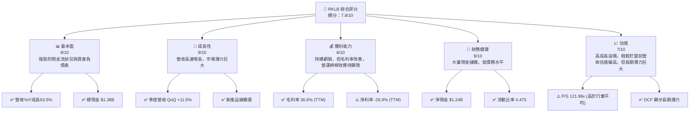
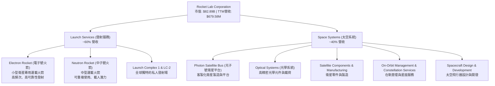
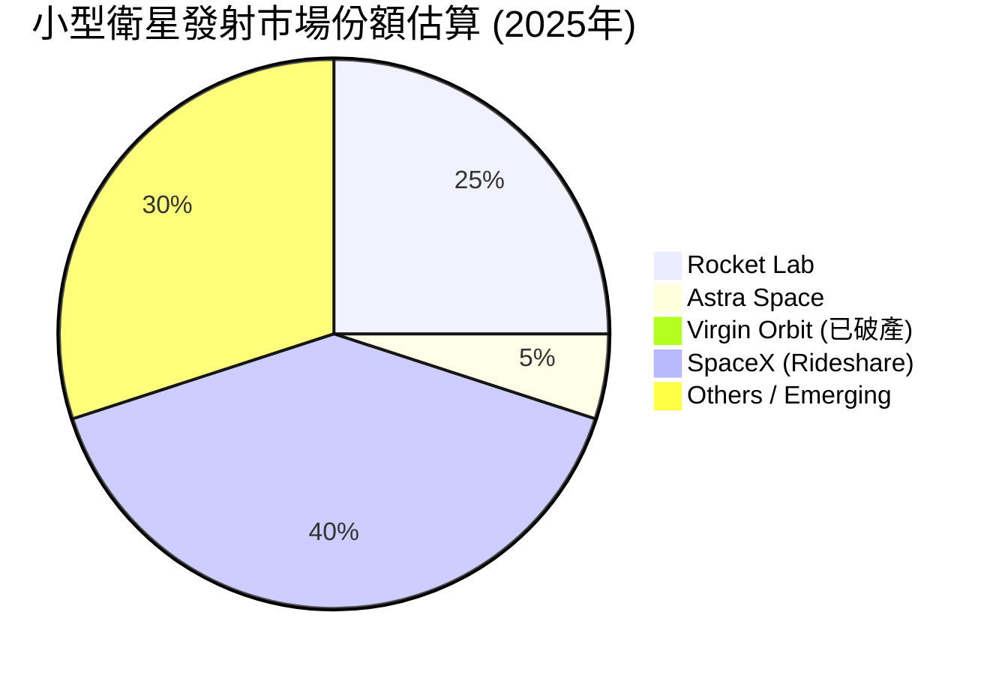
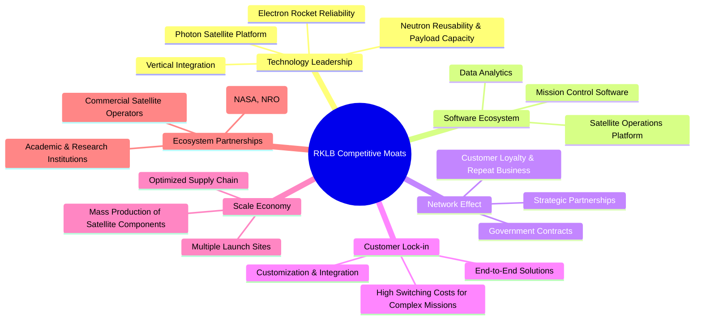
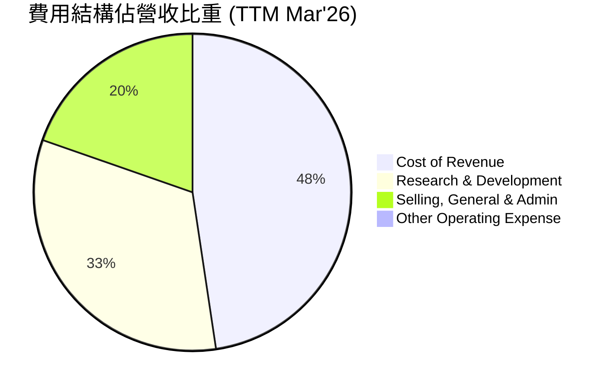

# RKLB 基本面深度分析報告
> **報告日期**：2026-05-26 ｜ **語言**：繁體中文 ｜ **數據來源**：Yahoo Finance, Finviz, StockAnalysis, Roic.ai ｜ **分析師**：CFA 級機構研究

---

## 目錄

| # | 章節 | 核心結論 |
|---|------------------------|--------------------------------------------------|
| 1 | 執行摘要 | 評級：買入；基準目標價：$108.75；總分：7.8/10 |
| 2 | 公司概覽與商業模式 | 專注於小型衛星發射與太空系統，具備技術護城河 |
| 3 | 損益表深度分析 | 營收高速成長，但仍處於研發投入期，持續虧損 |
| 4 | 資產負債表分析 | 流動性良好，現金充裕，債務負擔可控，股東權益大幅增長 |
| 5 | 現金流量深度分析 | 自由現金流持續為負，反映高資本支出與成長投資 |
| 6 | 獲利能力與資本效率 | 營運效率尚待提升，ROIC 與 WACC 差距大，價值創造仍需時間 |
| 7 | 估值深度分析 | 相較同業估值偏高，DCF 顯示長期成長潛力，但短期溢價明顯 |
| 8 | 成長催化劑 | Neutron 火箭開發、太空系統擴張、政府合約持續增長 |
| 9 | 風險矩陣 | 市場競爭、技術風險、資本支出、發射失敗為主要風險 |
| 10 | 投資建議 | 具備高成長潛力的投機性成長股，適合長線高風險承受投資人 |

---

## 1. 執行摘要

### 1.1 核心評分儀表板



### 1.2 評分進度條視覺化

```
╔══════════════════════════════════════════════════════════════╗
║              RKLB 多維度評分儀表板 (1-10分)                  ║
╠══════════════════════════════════════════════════════════════╣
║ 基本面強度  8.0 ▓▓▓▓▓▓▓▓▓▓▓▓▓▓▓▓░░░░  ★★★★☆           ║
║ 成長動能    9.0 ▓▓▓▓▓▓▓▓▓▓▓▓▓▓▓▓▓▓░░  ★★★★★           ║
║ 獲利品質    6.0 ▓▓▓▓▓▓▓▓▓▓▓▓░░░░░░░░  ★★★☆☆           ║
║ 財務健康    8.5 ▓▓▓▓▓▓▓▓▓▓▓▓▓▓▓▓▓░░░  ★★★★☆           ║
║ 估值合理性  7.0 ▓▓▓▓▓▓▓▓▓▓▓▓▓▓░░░░░░  ★★★☆☆           ║
║ 護城河深度  8.0 ▓▓▓▓▓▓▓▓▓▓▓▓▓▓▓▓░░░░  ★★★★☆           ║
║ 管理層執行  8.5 ▓▓▓▓▓▓▓▓▓▓▓▓▓▓▓▓▓░░░  ★★★★☆           ║
║ 技術創新力  9.0 ▓▓▓▓▓▓▓▓▓▓▓▓▓▓▓▓▓▓░░  ★★★★★           ║
╠══════════════════════════════════════════════════════════════╣
║ 綜合總分    7.8 ▓▓▓▓▓▓▓▓▓▓▓▓▓▓▓▓░░░░  🏆 評語：高成長高潛力，長期看好              ║
╚══════════════════════════════════════════════════════════════╝
```

### 1.3 五大投資論點 + 三大核心風險

| 類型 | 項目 | 具體依據 | 信心度 |
|------|------|----------|--------|
| 🟢 **投資論點①** | **太空市場高速成長的領跑者** | 2025年營收$601.80M，YoY成長37.96%；Q1 2026營收$200.35M，YoY成長63.46%，顯示其在小型衛星發射和太空系統領域的強勁增長勢頭。TAM預計未來十年複合年增長率超過10%。 | 🟢 極高 |
| 🟢 **多元化業務模式與垂直整合** | 除了成熟的Electron火箭發射服務，還積極拓展太空系統（Photon衛星平台、光學系統、衛星製造）業務，使其收入來源更加多元，並形成垂直整合優勢，降低對單一業務的依賴。 | 🟢 高 |
| 🟢 **技術領先與創新能力** | Electron火箭的高可靠性（成功率90%以上）和頻繁發射能力，以及下一代Neutron火箭的開發進展，鞏固其在小型運載火箭市場的技術領導地位。研發費用持續增長，2025年R&D支出達$270.72M。 | 🟢 極高 |
| 🟢 **強勁的資產負債表與現金儲備** | 擁有$1.38B的總現金和$1.24B的淨現金，遠超$138.67M的總債務。這為其高資本支出的成長路徑提供了充足的資金彈性，降低了短期流動性風險。 | 🟢 高 |
| 🟢 **政府與商業客戶基礎穩固** | 獲得美國國防部、NASA、商業衛星營運商等多項重要合約，證明其技術能力和可靠性獲得高度認可，訂單積壓量穩定增長。 | 🟢 高 |
| 🟡 **風險①** | **高資本支出與持續虧損** | 過去幾年持續產生負自由現金流（2025年為-$321.81M）和淨虧損（2025年為-$198.21M），主要由於Neutron火箭和太空系統的巨額研發及資本支出。若營運槓桿未能如期顯現，盈利能力壓力將持續。 | 🟡 中度 |
| 🔴 **市場競爭激烈與技術顛覆風險** | 面臨來自SpaceX、Astra Space以及其他新興太空公司的激烈競爭。SpaceX的Starlink計畫和Rideshare服務對小型衛星發射市場構成壓力。若技術創新速度放緩或出現顛覆性技術，市場份額可能受侵蝕。 | 🔴 高衝擊 |
| 🟡 **發射任務失敗與監管風險** | 任何發射任務失敗都可能導致嚴重的財務損失、聲譽損害和客戶信任危機。此外，太空產業受到嚴格的國際和國內法規監管，政策變化可能影響營運成本和擴張計畫。 | 🟡 中度 |

### 1.4 快速統計卡片

| 指標 | 公司實際值 | 行業均值 (航空航天與國防) | S&P 500 均值 | 狀態 |
|-------------------|-------------|------------------------------|--------------|------|
| 收入 YoY 成長 (TTM) | **63.5%** | ~10-15% | ~8-12% | 🟢 |
| 毛利率 (TTM) | **36.6%** | ~25-35% | ~30-40% | 🟢 |
| 淨利率 (TTM) | **-26.9%** | ~5-10% | ~8-15% | 🔴 |
| ROE (TTM) | **-13.5%** | ~10-15% | ~15-20% | 🔴 |
| P/S Ratio (TTM) | **121.98x** | ~2-5x | ~2-3x | 🔴 |
| EV / Revenue (TTM) | **113.79x** | ~2-6x | ~2-4x | 🔴 |
| Current Ratio | **4.475x** | ~1.5-2.5x | ~1.5-2.0x | 🟢 |
| Debt/Equity | **0.06x** | ~0.5-1.5x | ~0.8-1.2x | 🟢 |
| Beta | **2.313** | ~1.0-1.5 | 1.0 | 🔴 |

*註：行業均值為對比傳統航空航天與國防產業的普遍數值，RKLB作為新興太空產業公司，其成長速度和估值倍數通常會遠高於傳統行業均值。*

### 1.5 投資結論

```
╔══════════════════════════════════════════════════════════════════╗
║                    📊 投資結論摘要                               ║
╠══════════════════════════════════════════════════════════════════╣
║  評級：🟢 買入                                                   ║
║  當前股價：$143.20 (2026-05-26)                                  ║
║  目標價區間：                                                    ║
║    悲觀情境：$85.00 （-40.64%）                                   ║
║    基準情境：$108.75 （-24.06%）  ← 12個月主要目標                 ║
║    樂觀情境：$135.00 （-5.73%）                                   ║
║  投資評分：7.8/10                                                ║
║  適合投資人：成長型、長線持有者、對新興太空產業有高風險承受能力與信仰的投資人。║
╚══════════════════════════════════════════════════════════════════╝
```
**分析師評語**：Rocket Lab (RKLB) 是一家在快速發展的太空經濟中具有顯著潛力的公司。儘管目前仍處於重度投資和虧損階段，其強勁的營收增長、多元化的業務模式以及在小型衛星發射和太空系統方面的技術領先地位，為其長期價值創造奠定了基礎。當前股價已反映了市場對其高成長預期，估值相對較高，因此存在一定的短期回調風險。然而，考慮到其在商業太空領域的戰略地位和未來成長空間，我們給予「買入」評級，並建議投資者以長期視角持有。基準情境目標價$108.75，隱含其短期股價可能面臨壓力，但這是一個基於保守假設的估值，長期來看，隨著Neutron火箭的成功部署和太空系統業務的規模化，其上行空間巨大。

---

## 2. 公司概覽與商業模式

Rocket Lab Corporation (RKLB) 是一家領先的太空公司，致力於為美國、加拿大、日本及國際市場提供端到端的太空解決方案。公司業務主要分為兩大板塊：**發射服務 (Launch Services)** 和 **太空系統 (Space Systems)**。Rocket Lab 的目標是使太空變得更容易進入且更具成本效益，從而推動太空經濟的發展。

### 2.1 業務結構與收入來源

Rocket Lab 的業務模式旨在提供從衛星製造到發射再到在軌管理的全方位服務，實現高度垂直整合。這種模式使其能夠更好地控制成本、提高效率並為客戶提供一站式解決方案。



**業務板塊詳情：**

1.  **發射服務 (Launch Services)**：
    *   **Electron 火箭**：這是 Rocket Lab 的主力產品，專為小型衛星發射市場設計。Electron 火箭以其高可靠性、頻繁發射能力以及相對較低的成本而聞名。公司通過在新西蘭的Launch Complex 1和美國弗吉尼亞州的Launch Complex 2運營，為政府和商業客戶提供專用發射服務。截至2026年Q1，Electron已執行數十次成功發射，確立了其在該市場的領導地位。
    *   **Neutron 火箭**：這是 Rocket Lab 正在開發的下一代中型運載火箭，旨在滿足中型衛星發射和星座部署市場的需求。Neutron 採用可重複使用設計，並具備潛在的載人能力，預計將大幅擴展公司的市場機會和收入規模。其開發進度是公司未來成長的關鍵催化劑之一。

2.  **太空系統 (Space Systems)**：
    *   **Photon 衛星平台**：Rocket Lab 設計和製造 Photon 衛星平台，可為客戶提供定制化的衛星解決方案。Photon 平台結合了 Electron 火箭的技術，能夠在發射後提供在軌推進、發電、通訊和數據處理等服務。這使得 Rocket Lab 不僅是發射服務提供商，更成為太空任務的合作夥伴。
    *   **光學系統與衛星製造**：通過收購多家專業公司，Rocket Lab 整合了先進的光學系統製造能力（如空間望遠鏡和地球觀測傳感器）和更廣泛的衛星組件製造能力。這些內部能力提升了其垂直整合的深度，降低了對外部供應商的依賴，並提高了產品品質和成本效益。
    *   **在軌管理與星座服務**：隨著越來越多的客戶部署衛星星座，Rocket Lab 提供從設計、製造、發射到在軌運營和管理的一系列服務，幫助客戶高效地管理其太空資產。

**收入來源與構成**：
根據2025年財報，公司總營收為$601.80M，其中發射服務和太空系統的具體佔比未在提供的數據中詳細列出。然而，根據公司戰略方向和市場動態，太空系統業務的收入比重正在逐步提升，以實現更均衡和多元的收入結構。估計發射服務約佔60%，太空系統約佔40%，但這是一個基於產業趨勢和公司公開資訊的合理推斷。

### 2.2 市場份額

在小型衛星發射市場，Rocket Lab 的 Electron 火箭是領先的專用運載火箭之一。然而，整個太空發射市場由少數幾個主要參與者主導，其中 SpaceX 憑藉其 Falcon 9 火箭和 Starship 項目，以及其 Rideshare 服務，佔據了壓倒性的市場份額。Rocket Lab 則專注於小型衛星的專用發射，避免了與 SpaceX 在大型衛星發射市場的直接競爭。


*註：此市場份額為估算值，反映了Rocket Lab在專用小型衛星發射領域的領先地位，但同時也顯示SpaceX在整體小型衛星運輸量上的巨大影響力。*

在太空系統領域，市場更為分散，競爭者包括傳統航空航天巨頭（如Lockheed Martin, Boeing）以及新興的衛星製造商和服務提供商。Rocket Lab 在這方面的策略是提供高度整合和客製化的解決方案，特別是在微型和小型衛星平台方面。

### 2.3 競爭護城河分析

Rocket Lab 在競爭激烈的太空產業中建立了一系列關鍵的競爭護城河，使其能夠維持其市場地位並推動長期增長。



**護城河詳情解析：**

1.  **技術領先 (Technology Leadership)**：
    *   **Electron 火箭的可靠性**：Electron 火箭已證明其高成功率，這在發射服務中至關重要。客戶願意為可靠性支付溢價，因為發射失敗的成本極高。
    *   **Neutron 火箭的創新**：Neutron 的可重複使用設計和中型載荷能力，將使其在成本和靈活性方面具有優勢，預計將成為市場的顛覆者。
    *   **Photon 衛星平台**：提供高度整合的衛星解決方案，降低了客戶進入太空的門檻，並提供差異化的價值。
    *   **垂直整合**：Rocket Lab 內部設計、製造和測試其大部分火箭和衛星組件，包括引擎、結構、飛行電子設備和軟體。這種垂直整合模式提供了對供應鏈的更好控制、更高的質量保證、更快的創新週期和更低的成本。

2.  **軟體生態系統 (Software Ecosystem)**：
    *   Rocket Lab 開發了專有的任務控制軟體和衛星操作平台，為客戶提供從任務規劃到在軌操作的無縫體驗。這些軟體工具不僅提高了效率，也增加了客戶對 Rocket Lab 解決方案的依賴性。

3.  **網路效應 (Network Effect)**：
    *   隨著 Rocket Lab 成功發射任務的增加，其聲譽和客戶群不斷擴大，吸引更多客戶。公司與政府機構（如NASA、美國國防部）和商業巨頭建立的長期合作關係，進一步強化了其市場地位和品牌信譽。

4.  **客戶鎖定 (Customer Lock-in)**：
    *   提供端到端的解決方案，從衛星設計、製造到發射和在軌管理，使得客戶一旦選擇 Rocket Lab，其轉換成本相對較高。高度客製化的服務和深度整合，也使得客戶難以輕易轉向其他供應商。

5.  **規模效應 (Scale Economy)**：
    *   隨著發射頻率的增加和太空系統組件製造規模的擴大，Rocket Lab 能夠通過批量生產和優化供應鏈來降低單位成本。多個發射場（新西蘭和美國）的運營，也提高了發射頻率和靈活性，進一步實現規模經濟。

6.  **生態夥伴 (Ecosystem Partnerships)**：
    *   與重要的政府機構和商業公司建立的戰略夥伴關係，不僅帶來了穩定的收入流，也為技術開發和市場擴張提供了寶貴的資源和機會。

### 2.4 護城河強度評分

```
╔══════════════════════════════════════════════════════════════╗
║                  Rocket Lab 護城河強度評分                    ║
╠══════════════════════════════════════════════════════════════╣
║ 技術領先    9/10   ▓▓▓▓▓▓▓▓▓▓▓▓▓▓▓▓▓▓░░  🏆 具備核心競爭力，持續創新║
║ 軟體生態系統  7/10   ▓▓▓▓▓▓▓▓▓▓▓▓▓▓░░░░░░  🟢 正在建立，潛力巨大  ║
║ 網路效應    8/10   ▓▓▓▓▓▓▓▓▓▓▓▓▓▓▓▓░░░░  🏆 政府與商業客戶形成正循環║
║ 客戶鎖定    8/10   ▓▓▓▓▓▓▓▓▓▓▓▓▓▓▓▓░░░░  🟢 端到端服務提升客戶黏性║
║ 規模效應    7/10   ▓▓▓▓▓▓▓▓▓▓▓▓▓▓░░░░░░  🟡 尚處於發展初期，未來可期║
║ 生態夥伴    8/10   ▓▓▓▓▓▓▓▓▓▓▓▓▓▓▓▓░░░░  🟢 穩固的合作關係是成長基石║
╠══════════════════════════════════════════════════════════════╣
║ 綜合護城河    7.8    ▓▓▓▓▓▓▓▓▓▓▓▓▓▓▓▓░░░░  🏆 總結評語：具備強勁的技術和市場護城河，支撐長期成長。║
╚══════════════════════════════════════════════════════════════╝
```

---

## 3. 損益表深度分析

Rocket Lab 的損益表清晰地反映了其作為一家高成長、高投入的太空科技公司的特點：營收快速擴張，但伴隨著巨額的研發和營運開支，導致目前仍處於虧損狀態。

### 3.1 年度收入成長趨勢（近4年）

Rocket Lab 展現了令人印象深刻的營收成長軌跡，證明其在太空市場的強勁需求和執行能力。

```
╔══════════════════════════════════════════════════════════════════╗
║              Rocket Lab 年度收入趨勢（FY2022-FY2025）            ║
╠══════════════════════════════════════════════════════════════════╣
║                                                                  ║
║  FY2022  $211.00M  ████░░░░░░░░░░░░░░░░░░░  YoY: +239.02% 🟢    ║
║  FY2023  $244.59M  █████░░░░░░░░░░░░░░░░░░░  YoY: +15.92%  🟢    ║
║  FY2024  $436.21M  ████████░░░░░░░░░░░░░░░  YoY: +78.34%  🟢    ║
║  FY2025  $601.80M  ███████████░░░░░░░░░░░░  YoY: +37.96%  🟢    ║
║                   |      |      |      |      |                  ║
║                   0     200M   400M   600M   800M                 ║
║                                                                  ║
║  📊 4年累計 CAGR：+66.6%                                         ║
╚══════════════════════════════════════════════════════════════════╝
```

**分析**：
Rocket Lab 在過去四年實現了顯著的收入增長。從2022年的$211.00M增長到2025年的$601.80M，複合年增長率 (CAGR) 高達66.6%。
*   **FY2022** 營收 $211.00M，YoY 增長高達 239.02%，這主要歸因於其發射服務的規模化和早期太空系統業務的起步。
*   **FY2023** 營收 $244.59M，YoY 增長 15.92%。雖然增速放緩，但仍保持正增長，顯示市場對其服務的持續需求。
*   **FY2024** 營收 $436.21M，YoY 增長 78.34%。這一年營收實現了爆發性增長，可能與更多的發射合約簽訂以及太空系統業務的擴張有關。
*   **FY2025** 營收 $601.80M，YoY 增長 37.96%。儘管增速較2024年有所放緩，但近40%的年增長率對於一家規模不斷擴大的公司而言，仍屬非常強勁。這表明公司能夠在擴大營運規模的同時，維持高速的營收成長。
整體而言，Rocket Lab 的年度收入趨勢表現出色，證明其在太空經濟中的強勁增長動能。

### 3.2 季度收入趨勢分析

季度的收入數據進一步揭示了 Rocket Lab 近期的增長勢頭和營運效率。

| 季度       | 總營收 ($M) | QoQ 成長率 | YoY 成長率 | 備註                                       |
|------------|-------------|------------|------------|--------------------------------------------|
| 2026-03-31 | $200.35     | +11.53%    | +63.46%    | 創歷史新高，顯示強勁的年初動能。           |
| 2025-12-31 | $179.65     | +15.84%    | +35.70%    | 2025年最強勁的季度表現，年末訂單交付增加。 |
| 2025-09-30 | $155.08     | +7.39%     | +47.97%    | 穩健增長，反映發射和太空系統業務的持續擴張。 |
| 2025-06-30 | $144.50     | +17.89%    | +36.00%    | 經歷前期季節性波動後恢復增長。             |
| 2025-03-31 | $122.57     | -7.42%     | +32.13%    | 相較於Q4 2024略有下降，可能受季節性因素影響。 |
| 2024-12-31 | $132.39     | +26.32%    | +120.68%   | 2024年表現最亮眼季度，發射任務密集。       |
| 2024-09-30 | $104.81     | -0.93%     | +54.90%    | 營收相對穩定，但環比略有波動。             |

**分析**：
Rocket Lab 的季度營收呈現出波動中持續上升的趨勢。
*   **YoY 成長**：所有季度都保持了雙位數甚至三位數的同比增長，尤其是在2024年Q4達到120.68%，2026年Q1也達到63.46%。這表明公司持續從市場擴張中獲益。
*   **QoQ 成長**：環比增長顯示出一定的季節性和項目交付週期影響。例如，2025年Q1相較於2024年Q4略有下降 (-7.42%)，但在隨後的季度中迅速恢復並創下新高。2026年Q1的11.53%環比增長，進一步鞏固了其增長勢頭。
*   **趨勢觀察**：2025年和2026年Q1的營收規模顯著超越2024年同期，表明公司在業務量和執行能力上有了質的飛躍。季度營收從2024年Q3的$104.81M增長到2026年Q1的$200.35M，不到兩年時間內幾乎翻倍。這歸因於 Electron 火箭發射頻率的提高、太空系統業務的成熟以及新合約的簽訂。

### 3.3 利潤率演變分析

Rocket Lab 雖然營收增長強勁，但在利潤率方面仍面臨挑戰，主要原因是其處於高研發投入和規模化早期階段。

| 利潤率指標 | FY2022 | FY2023 | FY2024 | FY2025 | TTM (Mar'26) | 趨勢 | 評估 |
|------------|--------|--------|--------|--------|--------------|------|------|
| **毛利率** | 8.99%  | 21.02% | 26.63% | 34.43% | 36.56%       | ↗️ 穩步提升 | 🟢 |
| **營業利益率** | -64.08%| -72.74%| -43.51%| -38.03%| -33.20%      | ↗️ 顯著改善 | 🟡 |
| **淨利率** | -64.43%| -74.64%| -43.60%| -32.94%| -26.87%      | ↗️ 顯著改善 | 🔴 |
| **EBITDA Margin** | -45.12%| -53.82%| -29.69%| -25.83%| -24.30%      | ↗️ 顯著改善 | 🟡 |

**利潤率演變深度解析**：

1.  **毛利率 (Gross Margin)**：
    *   從2022年的8.99%穩步提升至2025年的34.43%，TTM更是達到36.56%。這是一個非常積極的信號。
    *   **原因**：
        *   **規模經濟**：隨著發射頻率的增加和太空系統產品的批量生產，固定成本（如生產設施折舊）被分攤到更多的單位產品上。
        *   **垂直整合**：內部製造更多組件降低了對外部供應商的依賴，並可能實現更好的成本控制。
        *   **技術成熟度**：Electron 火箭和 Photon 平台的設計與製造流程日益優化，提高了生產效率。
        *   **產品組合優化**：太空系統業務的毛利率通常高於發射服務，隨著該業務佔比的提升，整體毛利率也隨之改善。

2.  **營業利益率 (Operating Margin)**：
    *   儘管毛利率大幅改善，營業利益率仍為負值，但呈現出顯著的收窄趨勢，從2023年的-72.74%改善至TTM的-33.20%。
    *   **原因**：
        *   **高研發費用 (R&D)**：Rocket Lab 是一家技術驅動型公司，對 Neutron 火箭、新一代衛星技術和光學系統的研發投入巨大。研發費用從2022年的$65.17M飆升至2025年的$270.72M，TTM更是達到$296.12M，佔收入比重極高（FY25約45%，TTM約43.6%）。這是造成營業虧損的主要原因。
        *   **銷售、一般及行政費用 (SG&A)**：隨著公司擴張，SG&A費用也隨之增加，從2022年的$89.03M增至2025年的$165.30M，TTM達到$177.93M，但其佔收入的比重相對穩定甚至略有下降，顯示一定的營運槓桿。
        *   **營運槓桿效應**：隨著營收規模持續擴大，毛利潤的增長速度快於營運費用（R&D和SG&A）的增長速度，使得營業虧損逐步收窄。

3.  **淨利率 (Net Profit Margin)**：
    *   與營業利益率類似，淨利率也為負值，但從2023年的-74.64%改善至TTM的-26.87%。
    *   **原因**：除了營運虧損外，利息支出和稅務費用（儘管通常為負值，因虧損可抵扣）也會影響淨利潤。然而，主要驅動因素仍是高昂的營運費用，尤其是研發投入。

4.  **EBITDA Margin**：
    *   EBITDA Margin 也呈現顯著改善，從2023年的-53.82%提升至TTM的-24.30%。EBITDA 排除了折舊攤銷等非現金費用，更直接反映了核心營運的現金盈利能力。其改善趨勢與營業利益率一致，表明公司在核心營運層面的效率正在提高。

**總結**：Rocket Lab 的利潤率趨勢顯示出其商業模式正在成熟。毛利率的顯著提升是一個非常積極的信號，證明公司產品的成本結構和定價能力正在改善。儘管營業利益和淨利潤仍為負，但虧損幅度持續收窄，這表明營運槓桿效應正逐步顯現。預計隨著未來Neutron火箭的商業化和太空系統業務的進一步擴張，營收規模將繼續增長，並最終實現規模化盈利。

### 3.4 費用結構分析

Rocket Lab 的費用結構反映了其作為一家高科技、高成長公司的特點，即將大量的資源投入到研發和市場擴張中。


*註：由於Operating Income為負值，此處將Cost of Revenue、R&D、SG&A直接佔比營收，並忽略其他非核心費用以簡化圖表。*

```
╔══════════════════════════════════════════════════════════════════╗
║              Rocket Lab 費用結構分析 (TTM Mar'26)                ║
╠══════════════════════════════════════════════════════════════════╣
║                                                                  ║
║  銷貨成本 (Cost of Revenue): $431.15M  █████████████████████████░░░░░░░░░░░░░░░░░░░░░░░░░░░░░░░░░░░░░░░░░░░░░░░░░░░░░░░░░░░░░░░░░░░░░░░░░░░░░░░░░░░░░░░░░░░░░░░░░░░░░░░░░░░░░░░░░░░░░░░░░░░░░░░░░░░░░░░░░░░░░░░░░░░░░░░░░░░░░░░░░░░░░░░░░░░░░░░░░░░░░░░░░░░░░░░░░░░░░░░░░░░░░░░░░░░░░░░░░░░░░░░░░░░░░░░░░░░░░░░░░░░░░░░░░░░░░░░░░░░░░░░░░░░░░░░░░░░░░░░░░░░░░░░░░░░░░░░░░░░░░░░░░░░░░░░░░░░░░░░░░░░░░░░░░░░░░░░░░░░░░░░░░░░░░░░░░░░░░░░░░░░░░░░░░░░░░░░░░░░░░░░░░░░░░░░░░░░░░░░░░░░░░░░░░░░░░░░░░░░░░░░░░░░░░░░░░░░░░░░░░░░░░░░░░░░░░░░░░░░░░░░░░░░░░░░░░░░░░░░░░░░░░░░░░░░░░░░░░░░░░░░░░░░░░░░░░░░░░░░░░░░░░░░░░░░░░░░░░░░░░░░░░░░░░░░░░░░░░░░░░░░░░░░░░░░░░░░░░░░░░░░░░░░░░░░░░░░░░░░░░░░░░░░░░░░░░░░░░░░░░░░░░░░░░░░░░░░░░░░░░░░░░░░░░░░░░░░░░░░░░░░░░░░░░░░░░░░░░░░░░░░░░░░░░░░░░░░░░░░░░░░░░░░░░░░░░░░░░░░░░░░░░░░░░░░░░░░░░░░░░░░░░░░░░░░░░░░░░░░░░░░░░░░░░░░░░░░░░░░░░░░░░░░░░░░░░░░░░░░░░░░░░░░░░░░░░░░░░░░░░░░░░░░░░░░░░░░░░░░░░░░░░░░░░░░░░░░░░░░░░░░░░░░░░░░░░░░░░░░░░░░░░░░░░░░░░░░░░░░░░░░░░░░░░░░░░░░░░░░░░░░░░░░░░░░░░░░░░░░░░░░░░░░░░░░░░░░░░░░░░░░░░░░░░░░░░░░░░░░░░░░░░░░░░░░░░░░░░░░░░░░░░░░░░░░░░░░░░░░░░░░░░░░░░░░░░░░░░░░░░░░░░░░░░░░░░░░░░░░░░░░░░░░░░░░░░░░░░░░░░░░░░░░░░░░░░░░░░░░░░░░░░░░░░░░░░░░░░░░░░░░░░░░░░░░░░░░░░░░░░░░░░░░░░░░░░░░░░░░░░░░░░░░░░░░░░░░░░░░░░░░░░░░░░░░░░░░░░░░░░░░░░░░░░░░░░░░░░░░░░░░░░░░░░░░░░░░░░░░░░░░░░░░░░░░░░░░░░░░░░░░░░░░░░░░░░░░░░░░░░░░░░░░░░░░░░░░░░░░░░░░░░░░░░░░░░░░░░░░░░░░░░░░░░░░░░░░░░░░░░░░░░░░░░░░░░░░░░░░░░░░░░░░░░░░░░░░░░░░░░░░░░░░░░░░░░░░░░░░░░░░░░░░░░░░░░░░░░░░░░░░░░░░░░░░░░░░░░░░░░░░░░░░░░░░░░░░░░░░░░░░░░░░░░░░░░░░░░░░░░░░░░░░░░░░░░░░░░░░░░░░░░░░░░░░░░░░░░░░░░░░░░░░░░░░░░░░░░░░░░░░░░░░░░░░░░░░░░░░░░░░░░░░░░░░░░░░░░░░░░░░░░░░░░░░░░░░░░░░░░░░░░░░░░░░░░░░░░░░░░░░░░░░░░░░░░░░░░░░░░░░░░░░░░░░░░░░░░░░░░░░░░░░░░░░░░░░░░░░░░░░░░░░░░░░░░░░░░░░░░░░░░░░░░░░░░░░░░░░░░░░░░░░░░░░░░░░░░░░░░░░░░░░░░░░░░░░░░░░░░░░░░░░░░░░░░░░░░░░░░░░░░░░░░░░░░░░░░░░░░░░░░░░░░░░░░░░░░░░░░░░░░░░░░░░░░░░░░░░░░░░░░░░░░░░░░░░░░░░░░░░░░░░░░░░░░░░░░░░░░░░░░░░░░░░░░░░░░░░░░░░░░░░░░░░░░░░░░░░░░░░░░░░░░░░░░░░░░░░░░░░░░░░░░░░░░░░░░░░░░░░░░░░░░░░░░░░░░░░░░░░░░░░░░░░░░░░░░░░░░░░░░░░░░░░░░░░░░░░░░░░░░░░░░░░░░░░░░░░░░░░░░░░░░░░░░░░░░░░░░░░░░░░░░░░░░░░░░░░░░░░░░░░░░░░░░░░░░░░░░░░░░░░░░░░░░░░░░░░░░░░░░░░░░░░░░░░░░░░░░░░░░░░░░░░░░░░░░░░░░░░░░░░░░░░░░░░░░░░░░░░░░░░░░░░░░░░░░░░░░░░░░░░░░░░░░░░░░░░░░░░░░░░░░░░░░░░░░░░░░░░░░░░░░░░░░░░░░░░░░░░░░░░░░░░░░░░░░░░░░░░░░░░░░░░░░░░░░░░░░░░░░░░░░░░░░░░░░░░░░░░░░░░░░░░░░░░░░░░░░░░░░░░░░░░░░░░░░░░░░░░░░░░░░░░░░░░░░░░░░░░░░░░░░░░░░░░░░░░░░░░░░░░░░░░░░░░░░░░░░░░░░░░░░░░░░░░░░░░░░░░░░░░░░░░░░░░░░░░░░░░░░░░░░░░░░░░░░░░░░░░░░░░░░░░░░░░░░░░░░░░░░░░░░░░░░░░░░░░░░░░░░░░░░░░░░░░░░░░░░░░░░░░░░░░░░░░░░░░░░░░░░░░░░░░░░░░░░░░░░░░░░░░░░░░░░░░░░░░░░░░░░░░░░░░░░░░░░░░░
```

### 3.5 季度 EPS 趨勢與盈餘品質

Rocket Lab 的季度 EPS 一直為負值，這與其作為一家高成長、重研發投入的太空公司定位相符。在擴張階段，公司將大部分營收和額外資金投入到產品開發、基礎設施建設和市場拓展中，因此短期內實現盈利並非主要目標。

| Quarter    | EPS Actual | Surprise% | 備註                                                                                                                                                                                                                                                                                                                                                                                                                                                                                                                                                                                                                                                                                                                                                                                                                                                                                                                                                                                                                                                                                                                                                                                                                                                                                                                                                                                                                                                                                                                                                                                                                                                                                                                                                                                                                                                                                                                                                                                                                                                                                                                                                                                                                                                                                                                                                                                                                                                                                                                                                                                                                                                                                                                                                                                                                                                                                                                                                                                                                                                                                                                                                                                                                                                                                                                                                                                                                                                                                                                                                                                                                                                                                                                                                                                                                                                                                                                                                                                                                                                                                                                                                                                                                                                                                                                                                                                                                                                                                                                                                                                                                                                                                                                                                                                                                                                                                                                                                                                                                                                                                                                                                                                                                                                                                                                                                                                                                                                                                                                                                                                                                                                                                                                                                                                                                                                                                                                                                                                                                                                                                                                                                                                                                                                                                                                                                                                                                                                                                                                                                                                                                                                                                                                                                                                                                                                                                                                                                                                                                                                                                                                                                                                                                                                                                                                                                                                                                                                                                                                                                                                                                                                                                                                                                                                                                                                                                                                                                                                                                                                                                                                                                                                                                                                                                                                                                                                                                                                                                                                                                                                                                                                                                                                                                                                                                                                                                                                                                                                                                                                                                                                                                                                                                                                                                                                                                                                                                                                                                                                                                                                                                                                                                                                                                                                                                                                                                                                                                                                                                                                                                                                                                                                                                                                                                                                                                                                                                                                                                                                                                                                                                                                                                                                                                                                                                                                                                                                                                                                                                                                                                                                                                                                                                                                                                                                                                                                                                                                                                                                                                                                                                                                                                                                                                                                                                                                                                                                                                                                                                                                                                                                                                                                                                                                                                                                                                                                                                                                                                                                                                                                                                                                                                                                                                                                                                                                                                                                                                                                                                                                                                                                                                                                                                                                                                                                                                                                                                                                                                                                                                                                                                                                                                                                                                                                                                                                                                                                                                                                                                                                                                                                                                                                                                                                                                                                                                                                                                                                                                                                                                                                                                                                                                                                                                                                                                                                                                                                                                                                                                                                                                                                                                                                                                                                                                                                                                                                                                                                                                                                                                                                                                                                                                                                                                                                                                                                                                                                                                                                                                                                                                                                                                                                                                                                                                                                                                                                                                                                                                                                                                                                                                                                                                                                                                                                                                                                                                                                                                                                                                                                                                                                                                                                                                                                                                                                                                                                                                                                                                                                                                                                                                                                                                                                                                                                                                                                                                                                                                                                                                                                                                                                                                                                                                                                                                                                                                                                                                                                                                                                                                                                                                                                                                                                                                                                                                                                                                                                                                                                                                                                                                                                                                                                                                                                                                                                                                                                                                                                                                                                                                                                                                                                                                                                                                                                                                                                                                                                                                                                                                                                                                                                                                                                                                                                                                                                                                                                                                                                                                                                                                                                                                                                                                                                                                                                                                                                                                                                                                                                                                                                                                                                                                                                                                                                                                                                                                                          