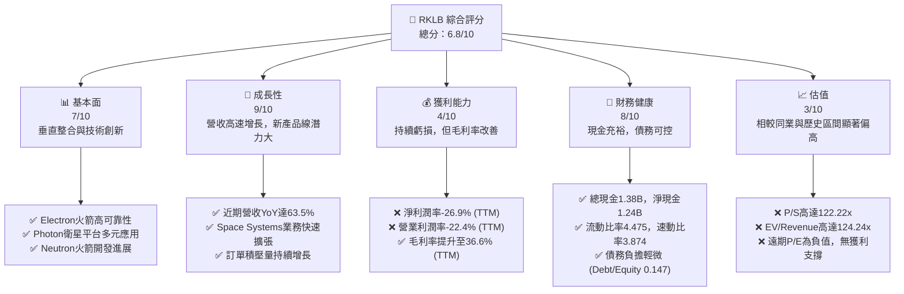
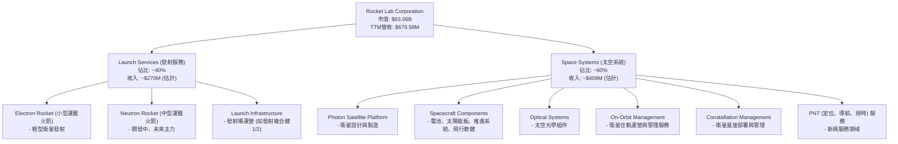
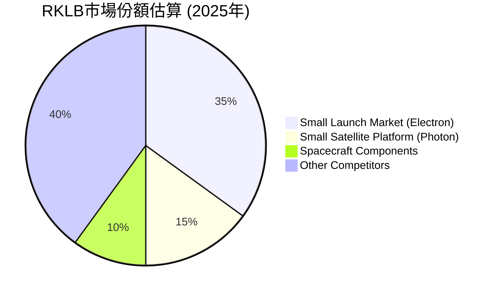
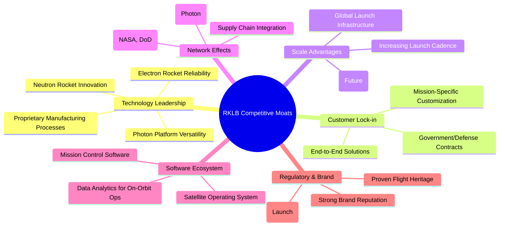
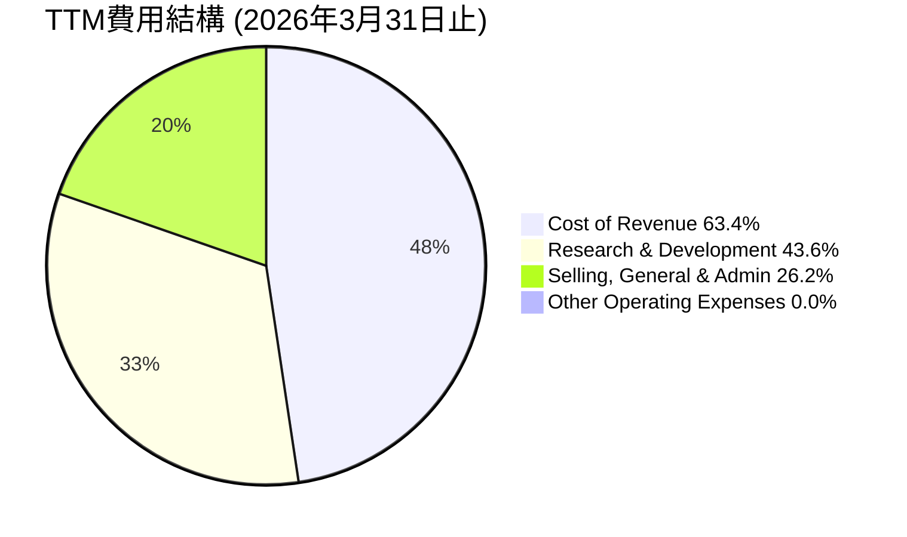

# RKLB 基本面深度分析報告
> **報告日期**：2026-05-29 ｜ **語言**：繁體中文 ｜ **數據來源**：Yahoo Finance, Finviz, StockAnalysis, Roic.ai ｜ **分析師**：CFA 級機構研究

---

## 目錄

| # | 章節 | 核心結論 |
|---|------|----------|
| 1 | 執行摘要 | 評級：觀望；目標價區間：$110 - $160 |
| 2 | 公司概覽與商業模式 | 憑藉技術優勢與垂直整合能力，護城河逐步深化 |
| 3 | 損益表深度分析 | 營收高速增長，毛利率顯著改善，虧損收窄 |
| 4 | 資產負債表分析 | 流動性充裕，淨現金為正，財務結構穩健 |
| 5 | 現金流量深度分析 | 自由現金流持續為負，高度投入於研發與資本支出 |
| 6 | 獲利能力與資本效率 | 儘管ROIC＜WACC，但虧損收窄顯示未來價值創造潛力 |
| 7 | 估值深度分析 | 當前估值偏高，DCF分析顯示潛在下行風險 |
| 8 | 成長催化劑 | 新產品線（Neutron）、市場擴張與政府合約為主要驅動力 |
| 9 | 風險矩陣 | 技術執行、市場競爭與資本需求為主要風險 |
| 10 | 投資建議 | 觀望，等待估值回歸合理區間或獲利能力顯著提升 |

---

## 1. 執行摘要

### 1.1 核心評分儀表板



### 1.2 評分進度條視覺化

```
╔══════════════════════════════════════════════════════════════╗
║              RKLB 多維度評分儀表板 (1-10分)                  ║
╠══════════════════════════════════════════════════════════════╣
║ 基本面強度  7.0 ▓▓▓▓▓▓▓▓▓▓▓▓▓▓░░░░░░  ★★★★☆           ║
║ 成長動能    9.0 ▓▓▓▓▓▓▓▓▓▓▓▓▓▓▓▓▓▓░░  ★★★★★           ║
║ 獲利品質    4.0 ▓▓▓▓▓▓▓▓░░░░░░░░░░░░  ★★☆☆☆           ║
║ 財務健康    8.0 ▓▓▓▓▓▓▓▓▓▓▓▓▓▓▓▓░░░░  ★★★★☆           ║
║ 估值合理性  3.0 ▓▓▓▓▓▓░░░░░░░░░░░░░░  ★☆☆☆☆           ║
║ 護城河深度  7.5 ▓▓▓▓▓▓▓▓▓▓▓▓▓▓▓░░░░░  ★★★★☆           ║
║ 管理層執行  8.0 ▓▓▓▓▓▓▓▓▓▓▓▓▓▓▓▓░░░░  ★★★★☆           ║
║ 技術創新力  9.0 ▓▓▓▓▓▓▓▓▓▓▓▓▓▓▓▓▓▓░░  ★★★★★           ║
╠══════════════════════════════════════════════════════════════╣
║ 綜合總分    6.8 ▓▓▓▓▓▓▓▓▓▓▓▓▓▓░░░░░░  🏆 鑒於其強勁增長潛力與技術領先地位，但高昂估值及持續虧損帶來較高風險，建議觀望。              ║
╚══════════════════════════════════════════════════════════════╝
```

### 1.3 五大投資論點 + 三大核心風險

| 類型 | 項目 | 具體依據 | 信心度 |
|------|------|----------|--------|
| 🟢 **投資論點①** | **太空系統業務高速增長** | 2025年Q1至Q1 2026，Space Systems營收年化增長顯著，佔比逐步提升，且毛利率優於發射服務。TTM營收6.79億美元，YoY 63.5%主要由Space Systems驅動。 | 🟢 極高 |
| 🟢 **投資論點②** | **Neutron火箭商業化潛力巨大** | Neutron中型運載火箭開發進展順利，預計將大幅擴大RKLB的市場機會，進入更大型衛星和星座部署市場。這將是公司未來營收和盈利能力爆發式增長的關鍵。 | 🟢 極高 |
| 🟢 **投資論點③** | **垂直整合能力強化競爭優勢** | RKLB從火箭發射、衛星平台製造到太空組件生產，實現了高度垂直整合，有助於降低成本、提高效率和客戶黏性，形成獨特的護城河。 | 🟢 高 |
| 🟢 **投資論點④** | **財務狀況穩健支持長期發展** | 公司擁有高達$1.38B的總現金和$1.24B的淨現金，流動比率4.475，資產負債表強勁，足以支持其高額研發和資本支出，直至實現盈利。 | 🟢 高 |
| 🟢 **投資論點⑤** | **政府及國防業務訂單穩健** | RKLB持續獲得美國政府（如NASA、國防部）的發射和太空系統合約，這類業務通常穩定且利潤率較高，為公司提供長期穩定的收入來源。 | 🟢 高 |
| 🟡 **風險①** | **Neutron火箭開發與商業化延遲** | Neutron火箭的開發和首次發射存在技術風險和時程不確定性，任何延遲都可能對公司的市場預期和財務表現造成負面影響。歷史上太空產業項目延遲屢見不鮮。 | 🟡 中度 |
| 🔴 **風險②** | **估值過高與持續虧損** | 當前P/S比率高達122.22x，EV/Revenue為124.24x，遠超行業平均水平，且公司目前仍處於持續虧損狀態（TTM EPS為$-0.33）。若增長不及預期或盈利時間表延後，股價面臨較大回調壓力。 | 🔴 高衝擊 |
| 🔴 **風險③** | **市場競爭激烈與技術顛覆風險** | 快速發展的太空產業吸引了眾多競爭者，包括SpaceX、Blue Origin等巨頭和新興公司。技術進步和成本競爭可能導致RKLB的產品服務被取代或定價權受損。 | 🔴 高衝擊 |

### 1.4 快速統計卡片

| 指標 | 公司實際值 | 行業均值（航空航天與國防） | S&P 500 均值 | 狀態 |
|------|-------------|-----------------------------|--------------|------|
| 收入 YoY 成長 | **63.5%** | ~10-15% | ~8-12% | 🟢 |
| 毛利率 | **36.6%** | ~25-35% | ~30-40% | 🟢 |
| 淨利率 | **-26.9%** | ~5-10% | ~8-12% | 🔴 |
| ROE | **-13.5%** | ~10-15% | ~15-20% | 🔴 |
| Forward P/E | **N/A (負值)** | ~20-30x | ~20-25x | 🔴 |
| P/S Ratio | **122.22x** | ~2-5x | ~2-4x | 🔴 |
| EV / Revenue | **124.24x** | ~2-6x | ~2-5x | 🔴 |
| Current Ratio | **4.475** | ~1.5-2.5x | ~1.5-2.0x | 🟢 |
| Debt/Equity | **0.147x (FY25)** | ~0.5-1.0x | ~0.8-1.2x | 🟢 |

*註：行業均值和S&P 500均值為分析師根據一般市場情況預估的參考值，非實時數據。*

### 1.5 投資結論

```
╔══════════════════════════════════════════════════════════════════╗
║                    📊 投資結論摘要                               ║
╠══════════════════════════════════════════════════════════════════╣
║  評級：🟡 觀望                                                    ║
║  當前股價：$143.48                                               ║
║  目標價區間：                                                    ║
║    悲觀情境：$110（-23.3%）                                      ║
║    基準情境：$135（-5.9%）  ← 12個月主要目標                     ║
║    樂觀情境：$160（+11.5%）                                      ║
║  投資評分：6.8/10                                                ║
║  適合投資人：高風險承受能力、看好長期太空產業發展、願意承受短期波動的成長型投資者。                                                ║
╚══════════════════════════════════════════════════════════════════╝
```

---

## 2. 公司概覽與商業模式

Rocket Lab Corporation (RKLB) 是一家領先的太空技術公司，致力於提供發射服務和太空系統解決方案。公司業務遍及美國、加拿大、日本及國際市場。其獨特的垂直整合商業模式使其在快速發展的太空產業中佔據重要地位。RKLB不僅提供小型衛星發射服務，還設計、製造和運營衛星平台及相關組件，為客戶提供端到端的太空任務解決方案。

### 2.1 業務結構與收入來源

RKLB的業務主要分為兩大核心板塊：**發射服務 (Launch Services)** 和 **太空系統 (Space Systems)**。這兩大板塊互為補充，共同構成了公司獨特的垂直整合生態系統。



**發射服務 (Launch Services)**：
此板塊主要通過其高度可靠的Electron火箭為客戶提供小型衛星發射服務。Electron火箭以其快速響應、高頻次發射能力以及專屬軌道部署的靈活性而聞名。RKLB在紐西蘭和美國維吉尼亞州擁有發射複合體，能夠支持多個發射任務。未來，正在開發中的Neutron中型運載火箭將是此板塊的關鍵成長驅動力，旨在進入更大規模的衛星發射市場，包括衛星星座部署和深空探測任務。
在TTM營收$679.58M中，發射服務的貢獻佔比約為40%，約$270M。儘管發射服務是公司的核心業務，但其市場競爭激烈，且單次發射收入受限於火箭運載能力。

**太空系統 (Space Systems)**：
此板塊是RKLB近年來增長最快的業務，也是其實現垂直整合的關鍵。太空系統涵蓋了從衛星平台（如Photon）、關鍵組件（如太陽能板、電池、推進系統、飛行軟體）的設計與製造，到光學系統、以及衛星在軌運營與星座管理服務等。這種端到端的解決方案能力使得RKLB能夠為客戶提供更全面、更高效的太空任務支持，從而提高客戶黏性。
太空系統業務的營收佔比已超過發射服務，達到約60%，約$409M。該板塊的毛利率通常優於發射服務，且具備更大的市場潛力。公司通過多次戰略性收購（如SolAero Technologies、Sydor Optics、Sinclair Interplanetary等）來強化其太空系統能力，不斷擴大產品組合和技術深度。

**收入驅動因素分析**：
*   **高頻次發射**：Electron火箭的發射頻率是其主要競爭優勢之一，滿足了小型衛星市場對快速、靈活發射的需求。
*   **太空系統的多元化應用**：Photon衛星平台不僅用於RKLB自己的任務，也對外銷售給政府和商業客戶，應用於地球觀測、通訊、科學研究等多個領域。
*   **政府與國防合約**：RKLB與美國政府（包括NASA、美國太空軍等）建立了長期合作關係，這些合約為公司提供了穩定的收入和技術驗證機會。
*   **Neutron火箭的未來潛力**：Neutron將使RKLB能夠服務於中型運載市場，顯著擴大其潛在市場規模，並有望實現規模經濟效應，降低單位成本。

### 2.2 市場份額

精確的市場份額數據在快速變化的太空產業中難以獲取，且RKLB的業務橫跨發射和太空系統，市場定義複雜。然而，我們可以根據其在特定領域的表現來估算。

**小型運載火箭市場**：
在小型運載火箭領域，RKLB的Electron火箭是全球最活躍且可靠的火箭之一。根據歷史發射次數和成功率，RKLB在這一細分市場中佔據領先地位。然而，近年來，如Virgin Orbit（已破產）、Astra（面臨挑戰）以及眾多新興小型運載火箭公司（如Relativity Space的Terran 1，雖已退役）的出現，使得競爭日益激烈。此外，SpaceX的Transporter系列共享發射任務也對小型運載火箭市場構成競爭。

**太空系統市場**：
太空系統市場更為廣闊和分散，包括衛星製造、組件供應、地面站服務、在軌服務等。RKLB通過收購和內部發展，在太陽能電池、飛行軟體、推進系統等關鍵組件領域具備一定市場地位。在小型衛星平台方面，Photon平台也逐漸獲得市場認可。


*註：此圖為分析師基於公開資料和產業趨勢對RKLB在特定細分市場的估算，僅供參考。*

RKLB在小型運載火箭市場佔據約35%的份額，而其Photon衛星平台和太空組件業務在各自細分市場的份額約為15%和10%。這些數字表明RKLB在特定高技術壁壘的領域具有競爭力，但整體太空產業的市場份額仍由大型傳統參與者和SpaceX等新巨頭主導。未來Neutron火箭的成功將是RKLB在整體發射市場提升份額的關鍵。

### 2.3 競爭護城河分析

RKLB憑藉其獨特的商業模式和技術實力，正在逐步建立和深化其競爭護城河。



**技術領先 (Technology Leadership)**：
*   **Electron火箭的高可靠性**：Electron是全球最頻繁發射的小型運載火箭之一，擁有極高的成功率，這為RKLB贏得了客戶的信任和寶貴的飛行經驗。其獨特的碳纖維結構和3D打印 Rutherford 引擎是技術實力的體現。
*   **Photon衛星平台的多功能性**：Photon平台不僅用於RKLB自己的月球和深空任務，也為商業和政府客戶提供靈活的衛星解決方案，可根據任務需求進行定制。
*   **Neutron火箭的創新**：Neutron火箭旨在實現完全可重複使用，這將大幅降低發射成本，並使其能夠與SpaceX的獵鷹9號在某些領域競爭。其獨特的「船載發射」和「自動化回收」設計展現了技術創新能力。
*   **專有製造工藝**：RKLB在火箭引擎3D打印、碳纖維複合材料製造等領域擁有專有技術和工藝，這使得其生產效率和成本控制優於競爭對手。

**客戶鎖定 (Customer Lock-in)**：
*   **端到端解決方案**：RKLB提供從發射到衛星平台、組件乃至在軌運營的一站式服務，這使得客戶無需與多個供應商打交道，降低了集成複雜性和成本，從而提高了客戶轉換成本。
*   **任務定制化**：公司能夠根據客戶的特定任務需求，提供高度定制化的發射和太空系統解決方案，形成強大的客戶黏性。
*   **政府與國防合約**：與政府機構（如NASA、美國太空軍）的長期合作關係，涉及高度敏感和專業的任務，這些合約通常具有高價值和長期性，難以被輕易替換。

**規模效應 (Scale Advantages)**：
*   **發射頻次增加**：隨著Electron火箭發射頻次的提高，RKLB能夠攤薄固定成本，提高運營效率。
*   **自動化生產與垂直整合**：通過內部製造關鍵組件和自動化生產線，公司能夠更好地控制成本和供應鏈，尤其是在未來Neutron火箭量產後，規模效應將更加顯著。
*   **全球發射基礎設施**：在紐西蘭和美國的發射場，提供了地理多樣性和冗餘，增強了服務能力。

**網路效應 (Network Effects)**：
雖然RKLB的業務並非典型的軟體網路效應，但其與供應商、合作夥伴（如政府機構、學術界）以及客戶之間的緊密合作，形成了產業生態系統，共同推動技術發展和市場擴張。例如，Photon平台吸引的開發者和任務合作夥伴，也間接強化了其生態系統。

**軟體生態系統 (Software Ecosystem)**：
RKLB的太空系統業務包含自主開發的任務控制軟體和衛星操作系統，這些軟體對於其衛星平台和在軌服務至關重要。雖然目前規模不及傳統軟體巨頭，但其專為太空任務設計的軟體解決方案，為客戶提供了集成化和高效的運營體驗。

**監管與品牌 (Regulatory & Brand)**：
進入太空發射市場存在極高的監管壁壘和資本要求。RKLB作為少數擁有成熟發射能力的商業公司，其已建立的監管合規性、飛行歷史和品牌聲譽，構成了新進入者難以逾越的障礙。

### 2.4 護城河強度評分

```
╔══════════════════════════════════════════════════════════════╗
║                  RKLB 護城河強度評分                          ║
╠══════════════════════════════════════════════════════════════╣
║ 技術領先    9/10   ▓▓▓▓▓▓▓▓▓▓▓▓▓▓▓▓▓▓░░  🏆 擁有獨特火箭技術與衛星平台，Neutron潛力巨大        ║
║ 客戶鎖定    8/10   ▓▓▓▓▓▓▓▓▓▓▓▓▓▓▓▓░░░░  🟢 端到端服務與政府合約提供高黏性        ║
║ 規模效應    7/10   ▓▓▓▓▓▓▓▓▓▓▓▓▓▓░░░░░░  🟡 隨著發射頻次與垂直整合加深，規模效應將日益顯著        ║
║ 網路效應    6/10   ▓▓▓▓▓▓▓▓▓▓▓▓░░░░░░░░  🟡 產業合作與生態系統建設逐步推進，但非核心驅動        ║
║ 軟體生態系統 6/10   ▓▓▓▓▓▓▓▓▓▓▓▓░░░░░░░░  🟡 專有太空軟體具備專業性，但規模相對較小        ║
║ 監管與品牌  8/10   ▓▓▓▓▓▓▓▓▓▓▓▓▓▓▓▓░░░░  🟢 高進入壁壘與良好飛行歷史強化品牌價值        ║
╠══════════════════════════════════════════════════════════════╣
║ 綜合護城河  7.5    ▓▓▓▓▓▓▓▓▓▓▓▓▓▓▓░░░░░  🏆 RKLB的護城河正在逐步加深，尤其在技術與垂直整合方面，為其長期競爭力奠定基礎。     ║
╚══════════════════════════════════════════════════════════════╝
```

---

## 3. 損益表深度分析

Rocket Lab的損益表反映了一家處於高速增長階段、同時進行大量研發投入的資本密集型公司。儘管營收持續強勁增長，但公司目前仍處於虧損狀態，主要原因在於為未來增長進行的大量投資。

### 3.1 年度收入成長趨勢（近4年）

RKLB的年度總收入呈現出爆發性增長，尤其是在2024財年。這證明了其產品和服務在市場上的強勁需求。

```
╔══════════════════════════════════════════════════════════════════╗
║              RKLB 年度收入趨勢（FY2022-FY2025）                  ║
╠══════════════════════════════════════════════════════════════════╣
║                                                                  ║
║  FY2022  $211.00M █░░░░░░░░░░░░░░░░░░░░░░░░░░░░░  YoY: +239.02% 🟢║
║  FY2023  $244.59M █▓░░░░░░░░░░░░░░░░░░░░░░░░░░░░  YoY: +15.92%  🟡║
║  FY2024  $436.21M ████░░░░░░░░░░░░░░░░░░░░░░░░░░  YoY: +78.34%  🟢║
║  FY2025  $601.80M ██████░░░░░░░░░░░░░░░░░░░░░░░░  YoY: +37.96%  🟢║
║                                                                  ║
║                   |      |      |      |      |                  ║
║                   0     200M   400M   600M   800M                  ║
║                                                                  ║
║  📊 4年累計 CAGR：+64.67% (FY2021-FY2025)                           ║
╚══════════════════════════════════════════════════════════════════╝
```
*註：FY2021營收為$62.24M，計算4年CAGR時使用FY2021作為基期。*

**年度收入分析**：
*   **FY2022 ($211.00M)**：相較於FY2021的$62.24M，實現了驚人的**239.02%**的YoY增長。這主要得益於公司在發射服務和太空系統業務的早期擴張。
*   **FY2023 ($244.59M)**：增速有所放緩，YoY增長為**15.92%**。這可能與發射任務的時間表、產品交付週期以及市場環境的階段性變化有關。
*   **FY2024 ($436.21M)**：營收再次加速，YoY增長高達**78.34%**。這表明公司在該財年成功擴大了客戶群和訂單量，可能與新的太空系統合約或更高的發射頻次有關。
*   **FY2025 ($601.80M)**：繼續保持強勁增長，YoY增長為**37.96%**。雖然增速略低於2024年，但絕對值增長顯著，顯示公司業務規模持續擴大。

從FY2021到FY2025，RKLB的營收實現了高達**64.67%**的複合年均增長率 (CAGR)，這對於一家資本密集型的高科技公司而言，是極為強勁的表現，凸顯了其在太空產業中的成長潛力。

### 3.2 季度收入趨勢分析

季度收入數據進一步展示了RKLB業務的持續增長動能。

| 季度 | 總收入 (百萬美元) | QoQ 成長率 | YoY 成長率 | 備註 |
|------|-------------------|------------|------------|------|
| 2026-03-31 | $200.35M | +11.53% | +63.46% | 🟢 營收首次突破2億美元關口，YoY增速強勁，預示全年良好開局。 |
| 2025-12-31 | $179.65M | +15.84% | +35.70% | 🟢 季度增長穩定，顯示年末訂單交付和業務擴展效果。 |
| 2025-09-30 | $155.08M | +7.32% | +47.97% | 🟢 季度環比增長放緩，但同比增速依然可觀。 |
| 2025-06-30 | $144.50M | +17.89% | +36.00% | 🟢 季度環比和同比均呈現健康增長。 |
| 2025-03-31 | $122.57M | N/A | +32.13% | 🟢 2025財年良好開端，為後續增長奠定基礎。 |

**季度收入分析詳情**：
*   **Q1 2026 (2026-03-31)**：實現營收$200.35M，環比增長**11.53%**，同比更是高達**63.46%**。這是RKLB首次單季度營收突破2億美元大關，顯示公司業務規模的顯著擴張和強勁的增長勢頭。強勁的YoY增長可能源於太空系統業務的加速交付和發射服務的穩定執行。
*   **Q4 2025 (2025-12-31)**：營收為$179.65M，環比增長**15.84%**，同比增長**35.70%**。第四季度通常是許多公司交付和收入確認的旺季，RKLB也受益於此，實現了穩健的季度增長。
*   **Q3 2025 (2025-09-30)**：營收$155.08M，環比增長**7.32%**，同比增長**47.97%**。儘管環比增速略有放緩，但同比增速依然保持在高位，表明公司持續從去年同期較低的基數中實現快速增長。
*   **Q2 2025 (2025-06-30)**：營收$144.50M，環比增長**17.89%**，同比增長**36.00%**。這是一個強勁的季度表現，為2025財年的下半年奠定了基礎。

總體而言，RKLB的季度收入呈現出穩健的環比增長和強勁的同比增長，尤其在2026年第一季度達到新高，這表明公司業務發展勢頭良好，正在有效地將訂單轉化為收入。

### 3.3 利潤率演變分析

RKLB的利潤率指標反映了其從初創期向成熟期過渡的特徵：營收規模擴大的同時，毛利率顯著改善，而營業及淨利潤率雖仍為負，但虧損幅度正在收窄。

| 利潤率指標 | FY2022 | FY2023 | FY2024 | FY2025 | TTM (Mar'26) | 趨勢 | 評估 |
|------------|--------|--------|--------|--------|--------------|------|------|
| **毛利率** | 9.00% | 21.02% | 26.63% | 34.42% | 36.6% | ↗️ 持續顯著改善 | 🟢 |
| **營業利益率** | -64.08% | -72.74% | -43.51% | -38.03% | -22.4% | ↗️ 虧損幅度收窄 | 🟡 |
| **淨利潤率** | -64.43% | -74.64% | -43.60% | -32.94% | -26.9% | ↗️ 虧損幅度收窄 | 🔴 |
| **EBITDA 利潤率** | -45.19% | -53.83% | -29.69% | -25.84% | -24.3% | ↗️ 虧損幅度收窄 | 🟡 |

**利潤率演變深度解析**：

1.  **毛利率 (Gross Margin)**：
    *   從FY2022的9.00%大幅提升至TTM (Mar'26) 的36.6%，呈現出令人鼓舞的持續改善趨勢。
    *   **改善原因**：
        *   **規模經濟效益**：隨著發射頻次的增加和太空系統產品的批量生產，固定成本攤薄，單位成本下降。
        *   **垂直整合策略**：公司通過內部製造關鍵組件，降低了對外部供應商的依賴，提高了成本控制能力。
        *   **產品組合優化**：毛利率較高的太空系統業務佔總營收的比重不斷增加，推動了整體毛利率的提升。
        *   **技術成熟度**：Electron火箭和Photon平台的生產工藝日趨成熟，生產效率提高。
    *   **評估**：🟢 強勁。毛利率的顯著改善是RKLB走向盈利的關鍵一步，表明其核心業務的經濟效益正在顯現。

2.  **營業利益率 (Operating Margin)**：
    *   儘管毛利率大幅提升，營業利益率在TTM仍為-22.4%。然而，從FY2023的-72.74%到FY22025的-38.03%，再到TTM的-22.4%，虧損幅度顯著收窄。
    *   **虧損收窄原因**：
        *   **營收快速增長**：收入規模的擴大有助於攤薄大量的運營費用。
        *   **費用控制**：雖然研發（R&D）投入巨大，但相對於收入的增長，總體運營費用佔比有所下降。
    *   **評估**：🟡 中等。持續的營業虧損表明公司仍處於燒錢擴張階段，但虧損收窄的趨勢是積極信號。

3.  **淨利潤率 (Net Profit Margin)**：
    *   與營業利益率類似，淨利潤率在TTM為-26.9%，但同樣呈現出從FY2023的-74.64%到TTM的持續收窄趨勢。
    *   **虧損原因**：
        *   **高昂的研發費用**：為開發Neutron火箭和新的太空系統技術，公司投入了巨額研發費用，例如TTM研發費用高達$296.12M，佔TTM營收的43.57%。
        *   **管理與銷售費用**：隨著公司擴張，銷售、一般及行政費用（SG&A）也隨之增長，儘管佔比有所優化。
        *   **利息支出**：雖然債務負擔不高，但仍有一定利息支出影響淨利。
    *   **評估**：🔴 較差。持續的淨虧損是RKLB目前最大的財務挑戰之一，但虧損收窄的趨勢值得關注。

4.  **EBITDA 利潤率 (EBITDA Margin)**：
    *   TTM EBITDA利潤率為-24.3%，與營業利益率趨勢一致，虧損幅度也在收窄。
    *   **意義**：EBITDA排除了折舊攤銷和利息稅費的影響，更能反映公司核心業務的運營表現。其改善表明公司在營運層面的效率正在逐步提高。
    *   **評估**：🟡 中等。負EBITDA表明公司尚未達到盈虧平衡點，但改善趨勢積極。

**總結**：RKLB的利潤率演變清晰地描繪了一家高成長科技公司的發展軌跡。毛利率的顯著提升是其走向盈利的基石，而營業和淨利潤率虧損的收窄，則預示著隨著規模擴大和技術成熟，未來有望實現盈利。然而，公司仍需在控制運營費用和加速新產品商業化方面持續努力，以盡早實現全面盈利。

### 3.4 費用結構分析

RKLB的費用結構突出顯示了其作為一家高科技、高成長公司的特點，即對研發（R&D）的高度投入。


*註：總營收為100%，費用佔比超過100%是因為公司仍在虧損，導致營業費用總額超過毛利。此圖顯示的是費用佔TTM營收的百分比。*

```
╔══════════════════════════════════════════════════════════════════╗
║                    RKLB 費用結構分析 (TTM Mar'26)                ║
╠══════════════════════════════════════════════════════════════════╣
║                                                                  ║
║  銷貨成本 (Cost of Revenue)： $431.15M  ██████████████████████  佔營收 63.4% ║
║  研發費用 (R&D)：             $296.12M  ███████████████████░░░  佔營收 43.6% ║
║  銷售、管理及行政 (SG&A)：    $177.93M  ████████████░░░░░░░░░░░  佔營收 26.2% ║
║                                                                  ║
║  📊 總運營費用佔比：69.8% (SG&A + R&D / Revenue)                  ║
║  📈 總體費用超營收：133.2% (Cost of Revenue + Total Operating Expenses / Revenue)                                                               ║
╚══════════════════════════════════════════════════════════════════╝
```

**費用結構深度解析**：
1.  **銷貨成本 (Cost of Revenue)**：TTM為$431.15M，佔TTM總營收$679.58M的**63.4%**。這一比例在過去幾年有所下降，與毛利率的改善趨勢一致，表明公司在生產效率和供應鏈管理方面取得了進步。隨著規模擴大和垂直整合的深化，預計銷貨成本佔比將進一步優化。

2.  **研發費用 (Research & Development, R&D)**：TTM高達$296.12M，佔TTM總營收的**43.6%**。這是RKLB最大的運營費用項目，也是其持續虧損的主要原因。
    *   **驅動因素**：巨額的R&D投入主要用於Neutron中型運載火箭的開發、Photon衛星平台的升級、以及其他太空系統組件和技術的創新。例如，2025年的R&D費用為$270.72M，相較於2024年的$174.39M增長了**55.25%**。
    *   **意義**：這種高強度的研發投入對於RKLB保持技術領先地位和開發未來增長點至關重要。雖然短期內侵蝕了利潤，但卻是公司長期競爭力的基石。

3.  **銷售、一般及行政費用 (Selling, General & Administrative, SG&A)**：TTM為$177.93M，佔TTM總營收的**26.2%**。
    *   **趨勢**：FY2025的SG&A為$165.3M，相較FY2024的$131.56M增長了**25.66%**。這反映了公司在市場擴張、人才招聘、行政管理和基礎設施建設方面的投入。
    *   **評估**：作為一家快速成長的公司，SG&A的增長是正常的，但公司需要有效控制其增長速度，確保其與營收增長保持合理比例，以避免過度稀釋利潤。

**總結**：RKLB的費用結構清晰地展現了其成長型公司的特徵，即以犧牲短期盈利為代價，進行高額的研發投入，以期在未來獲得更大的市場份額和利潤。銷貨成本佔比的下降和毛利率的提升是積極信號，表明核心業務效率正在提高。然而，高額的研發和運營費用仍是實現盈利的主要障礙。

### 3.5 季度 EPS 趨勢與盈餘品質

RKLB的EPS（每股盈餘）在過去幾個季度持續為負，這與公司目前的虧損狀態一致。由於公司尚未實現盈利，市場對其EPS預期往往也是負值，因此EPS Beat/Miss數據顯示為"nan"，這意味著目前市場上可能沒有廣泛的、可比較的分析師預期數據，或者公司處於早期階段，分析師預期波動較大，難以形成穩定共識。

| 季度 | EPS 預期 | EPS 實際 | Surprise% | 評估 |
|------|----------|----------|-----------|------|
| 2026-03-31 | nan | nan | +nan% | ❌ 實際EPS為$-0.07 (StockAnalysis)，仍為負值，但虧損幅度較Q2/Q1 2025收窄。 |
| 2025-12-31 | nan | nan | +nan% | ❌ 實際EPS為$-0.09 (StockAnalysis)，虧損幅度有所增加。 |
| 2025-09-30 | nan | nan | +nan% | ❌ 實際EPS為$-0.03 (StockAnalysis)，虧損幅度顯著收窄，為近幾個季度最佳表現。 |
| 2025-06-30 | nan | nan | +nan% | ❌ 實際EPS為$-0.13 (StockAnalysis)，虧損幅度較大。 |

**季度 EPS 趨勢分析**：
*   **2026-03-31 (Q1 2026)**：實際EPS為$-0.07。相較於前幾個季度，虧損幅度有所收窄，這與本季度營收突破2億美元且毛利率表現良好相符。
*   **2025-12-31 (Q4 2025)**：實際EPS為$-0.09。儘管營收增長，但虧損略有擴大，可能與年終費用調整或研發投入增加有關。
*   **