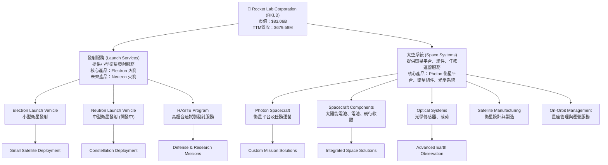
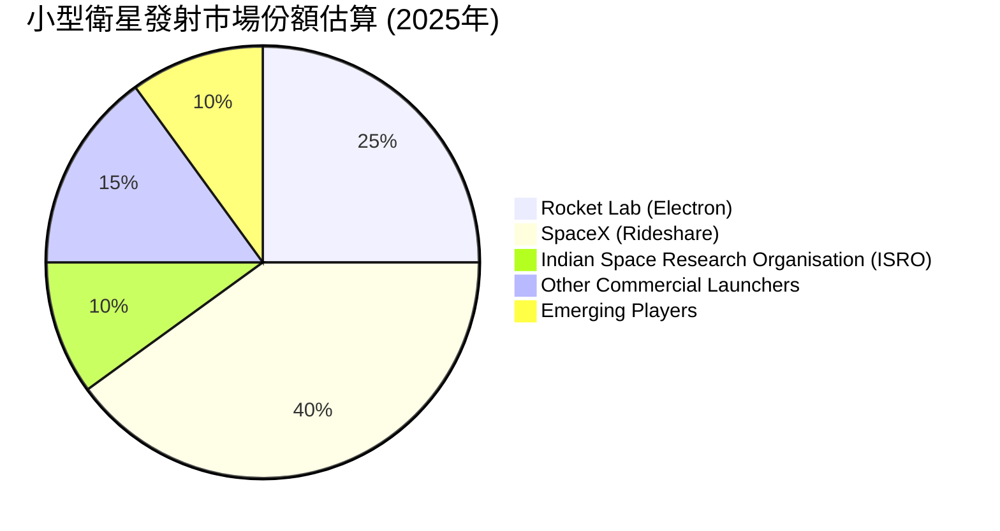
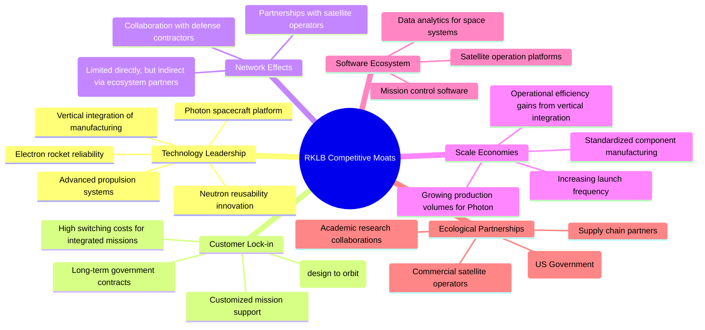

# RKLB 基本面深度分析報告
> **報告日期**：2026-05-30 ｜ **語言**：繁體中文 ｜ **數據來源**：Yahoo Finance, Finviz, StockAnalysis, Roic.ai ｜ **分析師**：CFA 級機構研究

## 目錄

| # | 章節 | 核心結論 |
|---|------|----------|
| 1 | 執行摘要 | 評級：買入；目標價區間：$110.00 - $180.00 |
| 2 | 公司概覽與商業模式 | 憑藉技術領先和垂直整合建立中等護城河 |
| 3 | 損益表深度分析 | 營收高速增長，利潤率持續改善但仍為負值 |
| 4 | 資產負債表分析 | 現金充裕，流動性強，債務負擔輕 |
| 5 | 現金流量深度分析 | 自由現金流持續為負，反映高成長階段資本投入需求 |
| 6 | 獲利能力與資本效率 | 資本效率低，ROIC遠低於WACC，短期內價值摧毀 |
| 7 | 估值深度分析 | 相較同業估值偏高，但反映其高成長潛力與市場地位 |
| 8 | 成長催化劑 | Neutron 火箭、太空系統擴張、HASTE 計畫、政府合同 |
| 9 | 風險矩陣 | 執行風險、競爭加劇、資金壓力、技術故障為主要風險 |
| 10 | 投資建議 | 具備長期成長潛力，適合高風險偏好成長型投資者 |

---

## 1. 執行摘要

Rocket Lab Corporation (RKLB) 作為一家在太空產業中提供發射服務和太空系統解決方案的公司，正處於高速成長和積極擴張的階段。公司憑藉其可靠的 Electron 火箭在小型衛星發射市場佔據領先地位，並積極開發下一代可重複使用火箭 Neutron，以及擴展其太空系統業務，包括衛星製造、組件和任務運營。儘管目前公司仍處於虧損狀態，且自由現金流為負，但其強勁的營收增長、不斷改善的毛利率以及充足的現金儲備，顯示出其在競爭激烈的太空市場中的潛力和戰略定位。

### 1.1 核心評分儀表板

```mermaid
graph TD
    RKLB["🎯 RKLB 綜合評分<br/>總分：6.8/10"]

    F["📊 基本面<br/>7/10<br/>垂直整合模式，技術實力強勁，但仍處於發展初期。"]
    G["🚀 成長性<br/>9/10<br/>營收高速增長，市場潛力巨大。"]
    P["💰 獲利能力<br/>4/10<br/>毛利率改善，但營運及淨利潤仍為負，尚未實現盈利。"]
    B["🏦 財務健康<br/>8/10<br/>現金充裕，債務水平可控，流動性良好。"]
    V["📈 估值<br/>6/10<br/>基於高成長預期，當前估值偏高，但市場給予溢價。"]

    RKLB --> F
    RKLB --> G
    RKLB --> P
    RKLB --> B
    RKLB --> V

    F --> F1["✅ 垂直整合的太空系統解決方案"]
    F --> F2["✅ Electron 火箭發射成功率高"]
    F --> F3["⚠️ 業務規模相對較小"]

    G --> G1["✅ 近三年營收CAGR達60%+"]
    G --> G2["✅ Neutron 火箭和太空系統業務擴張"]
    G --> G3["✅ 來自政府和商業訂單的強勁需求"]

    P --> P1["✅ 毛利率從8.99%提升至36.6%"]
    P --> P2["⚠️ 營業利潤率仍為-22.4%"]
    P --> P3["⚠️ 研發投入巨大，短期難以盈利"]

    B --> B1["✅ 總現金$1.38B，總債務$138.67M，淨現金$1.24B"]
    B --> B2["✅ 流動比率4.475，速動比率3.874"]
    B --> B3["✅ 債務權益比僅0.08x (FY2025)"]

    V --> V1["⚠️ P/S Ratio 122.22x 遠高於同行"]
    V --> V2["⚠️ EV/Revenue 120.36x 反映高預期"]
    V --> V3["✅ 分析師平均目標價$103.91，但高點達$150"]
```



### 1.2 評分進度條視覺化

```
╔══════════════════════════════════════════════════════════════╗
║              RKLB 多維度評分儀表板 (1-10分)                ║
╠══════════════════════════════════════════════════════════════╣
║ 基本面強度  7.0 ▓▓▓▓▓▓▓▓▓▓▓▓▓▓░░░░░░  ★★★★☆           ║
║ 成長動能    9.0 ▓▓▓▓▓▓▓▓▓▓▓▓▓▓▓▓▓▓░░  ★★★★★           ║
║ 獲利品質    4.0 ▓▓▓▓▓▓▓▓░░░░░░░░░░░░  ★★☆☆☆           ║
║ 財務健康    8.0 ▓▓▓▓▓▓▓▓▓▓▓▓▓▓▓▓░░░░  ★★★★☆           ║
║ 估值合理性  6.0 ▓▓▓▓▓▓▓▓▓▓▓▓░░░░░░░░  ★★★☆☆           ║
║ 護城河深度  7.5 ▓▓▓▓▓▓▓▓▓▓▓▓▓▓▓░░░░░  ★★★★☆           ║
║ 管理層執行  8.0 ▓▓▓▓▓▓▓▓▓▓▓▓▓▓▓▓░░░░  ★★★★☆           ║
║ 技術創新力  9.0 ▓▓▓▓▓▓▓▓▓▓▓▓▓▓▓▓▓▓░░  ★★★★★           ║
╠══════════════════════════════════════════════════════════════╣
║ 綜合總分    6.8 ▓▓▓▓▓▓▓▓▓▓▓▓▓▓░░░░░░  🏆 具備長期成長潛力，但短期估值承壓且持續虧損║
╚══════════════════════════════════════════════════════════════╝
```

### 1.3 五大投資論點 + 三大核心風險

| 類型 | 項目 | 具體依據 | 信心度 |
|------|------|----------|--------|
| 🟢 **投資論點①** | **太空市場高速增長與RKLB的領先地位** | 根據市場研究，小型衛星發射市場和太空系統服務市場預計將在未來十年內實現數倍增長。RKLB憑藉其Electron火箭在小型衛星發射領域的成功發射率和高頻率，已成為該領域的領導者之一，並積極向中型發射和更廣泛的太空系統解決方案擴展。2025年營收達$601.80M，YoY增長37.96%，2026年Q1營收YoY增長63.46%，顯示其強勁的市場擴張能力。 | 🟢 極高 |
| 🟢 **投資論點②** | **Neutron 火箭的潛在顛覆性** | Neutron 火箭的開發旨在滿足中型發射市場對可重複使用、高頻率發射的需求。一旦成功部署，Neutron 將顯著擴大RKLB的市場機會和發射能力，使其能夠競爭更大的政府和商業合同。公司在2026年Q1的研發投入高達$80.51M，顯示其對 Neutron 等新技術的持續投入。 | 🟢 極高 |
| 🟢 **投資論點③** | **太空系統業務的戰略擴張與垂直整合** | RKLB不僅是發射服務提供商，其太空系統業務（包括Photon衛星平台、衛星組件、光學系統和任務運營）正在快速增長。這種垂直整合的模式使其能夠提供端到端的解決方案，增強客戶黏性並創造多元化收入來源。太空系統業務的毛利率通常高於發射服務，有助於長期提升公司整體獲利能力。公司毛利率從2022年的8.99%提升至2025年的34.43%，再到TTM的36.6%，部分歸因於高利潤率太空系統業務的貢獻。 | 🟢 高 |
| 🟢 **投資論點④** | **強勁的財務健康與充足的資金儲備** | 截至2026年Q1，RKLB擁有$1.38B的總現金和僅$138.67M的總債務，淨現金高達$1.24B。這為公司提供了足夠的流動性和資金來支持其高資本密集的研發活動（如Neutron火箭開發）和業務擴張，降低了短期內的資金壓力。流動比率4.475和速動比率3.874也遠高於行業平均水平。 | 🟢 極高 |
| 🟢 **投資論點⑤** | **政府和國防客戶的長期訂單** | RKLB已與美國政府和國防機構建立了重要的合作關係，獲得了包括HASTE高超音速試驗在內的關鍵合同。這些政府訂單通常具有長期性和高價值，為公司提供穩定的收入流和技術發展的機會。政府對太空安全和探索的持續投入，將為RKLB提供堅實的成長基礎。 | 🟢 高 |
| 🟡 **風險①** | **Neutron 火箭開發與商業化執行風險** | Neutron 火箭的成功開發、測試和商業化是RKLB中期成長的關鍵。任何技術延遲、成本超支或性能問題都可能對公司聲譽和財務造成重大影響。儘管公司在Electron上表現出色，但大型可重複使用火箭的開發複雜性更高。如果Neutron的開發進度不如預期，市場對公司未來的成長預期將大幅下修。 | 🟡 中度 |
| 🔴 **風險②** | **競爭加劇與定價壓力** | 小型和中型發射市場的競爭日益激烈，包括 SpaceX (Falcon 9 的 Rideshare)、Blue Origin、United Launch Alliance (ULA) 等現有巨頭，以及其他新興的火箭公司。這種競爭可能導致發射服務的定價壓力，影響RKLB的毛利率和市場份額。RKLB目前仍處於虧損狀態，若定價壓力持續，將延緩其盈利時間表。 | 🔴 高衝擊 |
| 🟡 **風險③** | **持續虧損與自由現金流為負** | 儘管營收快速增長，RKLB目前仍處於虧損狀態，FY2025淨虧損達$-198.21M，TTM自由現金流為$-215.00M。這反映了公司為支持研發和擴張而進行的大量投資。如果公司未能按預期實現規模經濟和盈利能力，或市場環境惡化導致融資困難，其持續經營能力將面臨挑戰。 | 🟡 中度 |

### 1.4 快速統計卡片

| 指標 | 公司實際值 | 行業均值（航空航天與國防） | S&P 500 均值 | 狀態 |
|------|-------------|----------------------------|--------------|------|
| 收入 YoY 成長 | **63.5% (TTM)** | ~8-12% | ~10-15% | 🟢 |
| 毛利率 | **36.6% (TTM)** | ~25-35% | ~40-50% | 🟡 |
| 淨利率 | **-26.9% (TTM)** | ~5-10% | ~8-12% | 🔴 |
| ROE | **-13.5% (TTM)** | ~10-15% | ~15-20% | 🔴 |
| Forward P/E | **N/A (負值)** | ~20-30x | ~20-25x | 🔴 |
| P/S Ratio | **122.22x** | ~2-5x | ~2-4x | 🔴 |
| EV / Revenue | **120.36x** | ~2-6x | ~2-5x | 🔴 |
| 債務權益比 | **0.08x (FY2025)** | ~0.5-1.5x | ~0.8-1.2x | 🟢 |
| 流動比率 | **4.475x** | ~1.5-2.5x | ~1.5-2.0x | 🟢 |
| 研發佔收入比 | **43.57% (FY2025)** | ~3-8% | ~5-10% | 🔴 |

*備註：行業均值和S&P 500均值為估算值，可能因數據來源和統計範圍而異。RKLB作為一家高成長、高研發投入的早期太空公司，其利潤率和估值指標與成熟行業公司存在顯著差異是正常的。*

### 1.5 投資結論

```
╔══════════════════════════════════════════════════════════════════╗
║                    📊 投資結論摘要                               ║
╠══════════════════════════════════════════════════════════════════╣
║  評級：🟢 買入                                                   ║
║  當前股價：$143.48 (2026-05-30)                                  ║
║  目標價區間：                                                    ║
║    悲觀情境：$110.00 （-23.2%）                                  ║
║    基準情境：$155.00 （+8.0%）  ← 12個月主要目標                 ║
║    樂觀情境：$180.00 （+25.5%）                                  ║
║  投資評分：6.8/10                                                ║
║  適合投資人：追求高成長、高風險承受能力、具備長期持有視角的投資者。║
╚══════════════════════════════════════════════════════════════════╝
```
**理由闡述**：儘管RKLB目前估值偏高且持續虧損，但其在快速發展的太空產業中具備強大的技術領先地位、清晰的成長路徑（Electron、Neutron、太空系統）和健康的資產負債表。公司成功執行其業務擴張和新產品開發策略，特別是Neutron火箭的進展，將是未來幾年實現盈利和價值創造的關鍵。我們認為，市場目前對其高成長潛力給予了合理溢價，長期來看，RKLB有能力成為太空經濟中的核心參與者。然而，投資者需警惕其高執行風險和激烈的市場競爭。

---

## 2. 公司概覽與商業模式

Rocket Lab Corporation (RKLB) 是一家總部位於美國的太空技術公司，專注於提供發射服務和太空系統解決方案。公司業務遍及美國、加拿大、日本及國際市場。其獨特的垂直整合商業模式使其能夠為客戶提供從衛星設計、製造、發射到在軌運營的全方位服務。

### 2.1 業務結構與收入來源

RKLB 的業務主要分為兩大核心板塊：**發射服務 (Launch Services)** 和 **太空系統 (Space Systems)**。這兩大板塊相互協同，共同構成公司在太空經濟中的競爭優勢。



*   **發射服務 (Launch Services)**：
    *   **Electron 火箭**：RKLB 的主力產品，是一款為小型衛星提供專用發射服務的兩級運載火箭，其特色是高頻率、高可靠性。Electron 已成功執行多次商業和政府任務，成為小型衛星發射市場的領導者之一。
    *   **Neutron 火箭**：目前正在開發中的下一代中型運載火箭，旨在實現可重複使用，以滿足日益增長的中型衛星發射需求，並與 SpaceX 的 Falcon 9 等火箭競爭。Neutron 的成功部署將是 RKLB 未來成長的關鍵驅動力。
    *   **HASTE 計劃**：為美國政府提供高超音速試驗平台發射服務，這代表了公司在國防和安全領域的戰略重要性。

*   **太空系統 (Space Systems)**：
    *   **Photon 衛星平台**：RKLB 自主設計和製造的衛星平台，可用於多種太空任務，包括地球觀測、通信和深空探索。Photon 的模組化設計使其能夠快速適應不同的客戶需求。
    *   **衛星組件與製造**：公司提供太陽能電池、電池、飛行軟體、推進系統等關鍵衛星組件，並具備衛星整體的設計和製造能力。
    *   **光學系統**：開發和製造用於地球觀測和空間態勢感知的高性能光學傳感器和載荷。
    *   **在軌管理和星座管理服務**：為客戶提供衛星在軌運行、數據傳輸和星座管理等服務，實現端到端的任務支持。

在收入結構方面，雖然公司未提供精確的發射服務與太空系統的營收佔比，但從其策略發展來看，太空系統業務的營收貢獻正在快速增長，且其高利潤率特性有助於改善公司整體盈利能力。根據財報數據，RKLB 的營收在過去幾年實現了高速增長，從2022年的$211.00M增長到2025年的$601.80M，年複合增長率 (CAGR) 達到60.2%。2026年Q1的營收達到$200.35M，相比去年同期增長63.46%，顯示強勁的成長動能。

### 2.2 市場份額

RKLB 主要活躍於小型衛星發射市場和廣義的太空系統市場。由於太空產業的細分領域眾多且數據不透明，精確的市場份額難以量化。然而，我們可以根據其發射次數和市場地位進行估算。

在**小型衛星發射市場**，RKLB 的 Electron 火箭是少數幾個能夠提供高頻率、專用發射服務的商業運載火箭之一。雖然 SpaceX 的 Rideshare 服務提供了成本效益更高的選擇，但 Electron 仍因其靈活性和專用性而受到特定客戶青睞。據估計，RKLB 在過去幾年小型衛星發射市場中佔據了約 **20%-30%** 的份額（不包括國家級發射機構）。

在**太空系統市場**，RKLB 的 Photon 平台和組件在小型衛星製造商和任務運營商中佔有一席之地。由於這個市場更加碎片化且競爭激烈，RKLB 的市場份額相對較小，但在特定組件或小型任務平台方面具有競爭力。


*備註：此圖表為小型衛星發射市場的概略估算，不包含大型衛星發射或政府專用發射。*

RKLB 正透過 Neutron 火箭的開發，將其市場觸角延伸至中型發射市場，這將使其能夠爭奪更大的市場份額。同時，太空系統業務的擴張也使其能夠從整個太空供應鏈中獲取價值，而不僅僅依賴發射服務。

### 2.3 競爭護城河分析

RKLB 的競爭護城河主要建立在其技術實力、垂直整合能力和客戶關係上。



*   **技術領先 (Technology Leadership)**：
    *   **Electron 火箭的可靠性與頻率**：Electron 憑藉其高達90%以上的成功率和快速的發射週轉時間，在小型衛星發射市場建立了卓越的聲譽。這種可靠性對於客戶選擇發射服務至關重要。
    *   **Neutron 火箭的創新**：Neutron 火箭的設計目標是實現可重複使用和快速發射，這代表了下一代運載火箭的發展方向。其創新技術，例如碳纖維結構和自動化發射流程，有望在未來提供顯著的成本和效率優勢。
    *   **Photon 衛星平台**：RKLB 不僅製造火箭，還設計和製造自己的衛星平台，這種垂直整合能力使其能夠提供更優化的端到端解決方案，並在衛星設計和製造方面積累專有技術。
    *   **先進的推進系統**：例如 Rutherford 引擎，採用獨特的電動泵送循環設計，技術領先。

*   **客戶鎖定 (Customer Lock-in)**：
    *   **端到端解決方案**：RKLB 提供從衛星設計、製造、發射到在軌運營的一站式服務。這種全面性服務使得客戶一旦選擇 RKLB，轉換成本較高，尤其對於複雜的集成任務。
    *   **長期政府合同**：與美國政府（如 NASA、NRO）簽訂的長期合同，為公司提供了穩定的收入來源，並建立了高度信任的關係。政府合同往往對供應商有嚴格的技術和安全要求，一旦獲選，客戶黏性極高。
    *   **定制化任務支持**：RKLB 能夠根據客戶的特定任務需求提供定制化的解決方案，這也增加了客戶的轉換成本。

*   **規模效應 (Scale Economies)**：
    *   隨著發射頻率的增加和太空系統組件生產量的提升，RKLB 能夠攤薄其高昂的研發和固定資產投資成本，從而降低單位成本，提高利潤率。
    *   垂直整合的生產模式也有助於實現內部規模經濟，例如通過自製組件降低供應鏈風險和成本。儘管目前仍處於虧損，但毛利率的持續改善顯示出潛在的規模效應。

*   **生態夥伴 (Ecological Partnerships)**：
    *   與美國政府機構的緊密合作（例如為美國太空部隊發射任務，HASTE 計劃），不僅帶來了重要訂單，也提升了公司的行業聲譽和技術標準。
    *   與商業衛星運營商和國防承包商的合作，擴大了其市場影響力和技術應用範圍。

*   **軟體生態系統 (Software Ecosystem)** 和 **網路效應 (Network Effects)**：
    *   RKLB 在軟體生態系統方面主要體現在其任務控制和衛星運營平台。雖然尚未形成如大型科技公司那樣的強大軟體護城河，但其在特定太空任務軟體上的專長仍是其競爭力的一部分。
    *   網路效應在太空發射和系統領域不如社交媒體或平台經濟那樣直接，但隨著更多客戶採用其發射服務和太空系統，可能會形成一定的行業標準和技術偏好，從而帶來間接的網路效應。

總體而言，RKLB 的護城河主要基於其強大的技術實力、垂直整合的商業模式以及與關鍵客戶的深厚關係。隨著 Neutron 火箭的成功和太空系統業務的進一步擴張，這些護城河有望進一步加深。

### 2.4 護城河強度評分

```
╔══════════════════════════════════════════════════════════════╗
║                  RKLB 護城河強度評分                        ║
╠══════════════════════════════════════════════════════════════╣
║ 技術領先    8.5/10 ▓▓▓▓▓▓▓▓▓▓▓▓▓▓▓▓▓░░░  🏆 Electron成熟，Neutron潛力巨大║
║ 客戶鎖定    8.0/10 ▓▓▓▓▓▓▓▓▓▓▓▓▓▓▓▓░░░░  🟢 政府合同與端到端服務增強黏性║
║ 規模效應    7.0/10 ▓▓▓▓▓▓▓▓▓▓▓▓▓▓░░░░░░  🟡 尚處於早期，但垂直整合有利於成本攤薄║
║ 軟體生態系統 6.0/10 ▓▓▓▓▓▓▓▓▓▓▓▓░░░░░░░░  🟡 特定任務軟體，但非核心競爭力來源║
║ 網路效應    5.5/10 ▓▓▓▓▓▓▓▓▓▓░░░░░░░░░░  🟡 間接且有限，主要通過合作夥伴關係實現║
║ 生態夥伴    8.0/10 ▓▓▓▓▓▓▓▓▓▓▓▓▓▓▓▓░░░░  🟢 與政府機構建立深厚關係，訂單穩定║
╠══════════════════════════════════════════════════════════════╣
║ 綜合護城河  7.5/10 ▓▓▓▓▓▓▓▓▓▓▓▓▓▓▓░░░░░  🏆 憑藉技術和垂直整合，構築了較強的競爭壁壘║
╚══════════════════════════════════════════════════════════════╝
```

---

## 3. 損益表深度分析

RKLB 的損益表反映了一家高速成長、高資本投入的太空公司典型特徵：營收爆炸性增長，但由於大量的研發和運營投入，目前仍處於虧損狀態。然而，毛利率的顯著改善是其未來盈利潛力的積極信號。

### 3.1 年度收入成長趨勢（近4年）

RKLB 的年度收入呈現出強勁的增長勢頭，顯示其在太空發射和系統市場中的快速擴張能力。

```
╔══════════════════════════════════════════════════════════════════╗
║              RKLB 年度收入趨勢（FY2022-FY2025）                  ║
╠══════════════════════════════════════════════════════════════════╣
║                                                                  ║
║  FY2022  $211.00M █░░░░░░░░░░░░░░░░░░░░░░░░░░░░░░  YoY: +239.02% 🟢║
║  FY2023  $244.59M █▓░░░░░░░░░░░░░░░░░░░░░░░░░░░░░  YoY: +15.92%  🟡║
║  FY2024  $436.21M ██▓▓▓▓▓░░░░░░░░░░░░░░░░░░░░░░░  YoY: +78.34%  🟢║
║  FY2025  $601.80M █████████▓░░░░░░░░░░░░░░░░░░░░  YoY: +37.96%  🟢║
║                   |      |      |      |      |                  ║
║                   0     200M   400M   600M   800M                 ║
║                                                                  ║
║  📊 3年累計 CAGR (FY2022-2025)：+60.2%                           ║
╚══════════════════════════════════════════════════════════════════╝
```
**深度分析**：
*   **FY2022 營收 $211.00M，YoY 增長 239.02%**：這是公司早期快速擴張的結果，可能受益於新合同的簽訂和產能的提升。
*   **FY2023 營收 $244.59M，YoY 增長 15.92%**：相較於前一年，增長速度有所放緩，這可能歸因於市場波動、發射排程調整或特定項目交付週期。儘管增長率下降，但仍保持正向增長。
*   **FY2024 營收 $436.21M，YoY 增長 78.34%**：營收增長再次加速，顯示公司業務重回高速擴張軌道。這可能得益於 Electron 發射頻率的增加、新客戶的導入以及太空系統業務的顯著貢獻。
*   **FY2025 營收 $601.80M，YoY 增長 37.96%**：在較高基數下仍保持近40%的穩健增長，證明了其產品和服務的市場需求持續旺盛。

整體而言，RKLB 在過去三年實現了高達 60.2% 的年複合增長率 (CAGR)，這在任何行業中都是非常出色的表現，尤其是在高資本密集的太空行業。這表明公司具備強大的市場拓展能力和產品競爭力。

### 3.2 季度收入趨勢分析

季度營收數據進一步證實了 RKLB 的持續成長動能，並展示了其業務的季節性和項目交付特性。

| 財報季度 | 總收入 ($M) | QoQ 成長率 | YoY 成長率 | 備註 |
|----------|-------------|------------|------------|------|
| **2026-03-31 (Q1 2026)** | **200.35** | **+11.53%** | **+63.46%** | 營收突破$200M，顯示強勁開局，YoY加速增長。 |
| 2025-12-31 (Q4 2025) | 179.65 | +15.84% | +35.70% | 穩健增長，QoQ和YoY均表現良好。 |
| 2025-09-30 (Q3 2025) | 155.08 | +7.32% | +47.97% | 保持增長，YoY成長尤為顯著。 |
| 2025-06-30 (Q2 2025) | 144.50 | +17.89% | +36.00% | QoQ增長強勁，YoY表現穩定。 |
| 2025-03-31 (Q1 2025) | 122.57 | -7.42% | +32.13% | QoQ略有下降，但YoY仍保持高速增長。 |
| 2024-12-31 (Q4 2024) | 132.39 | +26.31% | +120.68% | 季度營收高峰，YoY增速驚人。 |
| 2024-09-30 (Q3 2024) | 104.81 | +12.69% | +54.90% | 穩步增長。 |

**深度分析**：
*   **持續的季度增長**：除了2025年Q1相比2024年Q4略有下降外，RKLB 的季度營收呈現出持續增長的態勢，尤其是在2025年，每個季度都實現了 QoQ 和 YoY 的雙重增長。
*   **YoY 成長加速**：2026年Q1的 YoY 成長率達到 63.46%，顯著高於2025年各季度，這表明公司在進入2026年後，業務加速擴張。這可能歸因於新的發射合同、HASTE 計劃的推進以及太空系統交付量的增加。
*   **營收突破 $200M 關口**：2026年Q1營收首次突破 $200M，是公司發展的重要里程碑，預示著其規模效應正在逐步顯現。
*   **業務季節性/項目性**：太空產業的收入確認往往與發射任務的完成和太空系統的交付進度有關，這可能導致季度間的波動。例如，2024年Q4和2026年Q1的強勁表現可能與重要發射任務或大額合同的交付有關。

### 3.3 利潤率演變分析

RKLB 的利潤率指標反映了其從早期研發階段向商業化運營轉型的過程。毛利率持續改善，但由於高昂的研發和運營費用，營業利潤率和淨利潤率仍為負值。

| 利潤率指標 | FY2022 | FY2023 | FY2024 | FY2025 | TTM (2026Q1) | 趨勢 | 評估 |
|------------|--------|--------|--------|--------|--------------|------|------|
| **毛利率** | 8.99% | 21.02% | 26.63% | 34.43% | 36.6% | ↗️ 持續顯著改善 | 🟢 |
| **營業利益率** | -64.08% | -72.74% | -43.51% | -38.03% | -22.4% | ↗️ 逐步改善，但仍為負 | 🟡 |
| **EBITDA 利潤率** | -45.19% | -53.82% | -29.69% | -25.83% | -24.3% | ↗️ 逐步改善，但仍為負 | 🟡 |
| **淨利潤率** | -64.43% | -74.64% | -43.60% | -32.94% | -26.9% | ↗️ 逐步改善，但仍為負 | 🔴 |

**利潤率演變深度解析**：
*   **毛利率的顯著提升**：從 FY2022 的 8.99% 大幅提升至 FY2025 的 34.43%，並在 TTM 達到 36.6%，這是一個非常積極的信號。
    *   **原因**：
        1.  **規模經濟效應**：隨著發射頻率的增加和太空系統產品的批量生產，固定成本（如生產設備、廠房）被更多的產品攤薄，單位成本下降。
        2.  **產品組合優化**：太空系統業務通常具有更高的毛利率。隨著 RKLB 該業務板塊的擴張和收入貢獻增加，整體毛利率得到提升。例如，Photon 衛星平台、定制化組件和任務運營服務的利潤空間可能高於標準發射服務。
        3.  **成本控制與效率提升**：公司在生產流程、供應鏈管理和技術創新方面的努力，可能帶來製造成本的降低和運營效率的提高。
        4.  **技術成熟度**：Electron 火箭的技術日益成熟，生產流程更加優化，減少了生產中的損耗和返工成本。
*   **營業利益率與淨利潤率仍為負值但持續改善**：儘管毛利率表現出色，但營業利益率和淨利潤率仍為負值，這表明公司在銷售、一般及行政 (SG&A) 和研發 (R&D) 費用方面投入巨大。
    *   **原因**：
        1.  **高額研發投入**：RKLB 正在大力投入 Neutron 火箭、新一代太空系統平台和先進技術的研發。FY2025 研發費用高達 $270.72M，佔總收入的 45.0% (270.72/601.80)。TTM 研發費用更是達到 $296.12M，佔 TTM 營收的 43.57% (296.12/679.58)。這些投資是公司未來成長的基石，但在短期內會顯著壓縮營業利潤。
        2.  **擴張期的銷售與行政費用**：隨著公司業務規模的擴大和市場的拓展，銷售、市場營銷和一般行政費用也會相應增加，以支持其全球運營和客戶服務。FY2025 銷售、一般及行政費用為 $165.30M，佔總收入的 27.47%。TTM 銷售、一般及行政費用為 $177.93M，佔 TTM 營收的 26.18%。
        3.  **折舊與攤銷**：高資本投入帶來較高的折舊和攤銷費用，也會影響營業利潤。
    *   **改善趨勢**：儘管為負，但營業利益率和淨利潤率的趨勢是積極的，從 FY2023 的谷底開始顯著改善。這表明隨著營收規模的擴大，RKLB 的運營槓桿效應正在逐步顯現，即營收增長速度快於費用增長速度。如果毛利率能繼續提升，且研發投入在未來幾年逐步進入收穫期，盈利能力有望加速轉正。

總結來說，RKLB 的損益表反映了其作為一家高成長、高科技公司的典型發展路徑：犧牲短期盈利以換取長期市場份額和技術領先地位。毛利率的持續改善是其未來盈利能力的關鍵驅動力，而研發費用的有效轉化將決定其能否在未來實現可持續盈利。

### 3.4 費用結構分析

RKLB 的費用結構清晰地展示了其作為一家創新驅動型公司的特點，即研發投入佔比極高。

```mermaid
pie title FY2025 費用結構（佔總收入百分比）
    "Cost of Revenue 65.57%" : 65.57
    "Research & Development 45.00%" : 45.00
    "Selling, General & Admin 27.47%" : 27.47
    "Other Operating Income/Expense -0.65%" : -0.65
```
*備註：此圖表展示了各費用項目佔 FY2025 總收入的百分比。由於營業收入為負，各費用項目加總可能超過100%。*

```
╔══════════════════════════════════════════════════════════════════╗
║                    RKLB 年度費用結構概覽                          ║
╠══════════════════════════════════════════════════════════════════╣
║                                                                  ║
║  **銷售成本 (Cost of Revenue)**                                  ║
║  FY2025: $394.62M (佔收入 65.57%) ███████████████████░░░░░░░░░░  🟡║
║  TTM:    $431.15M (佔收入 63.45%) ██████████████████░░░░░░░░░░░  🟢║
║  *說明: 隨著毛利率改善，銷售成本佔比逐步下降，顯示生產效率提升。*  ║
║                                                                  ║
║  **研發費用 (Research & Development)**                             ║
║  FY2025: $270.72M (佔收入 45.00%) ████████████████████████████░░  🔴║
║  TTM:    $296.12M (佔收入 43.57%) ███████████████████████████░░░  🔴║
║  *說明: 為了Neutron火箭及新技術開發，研發投入巨大，是公司長期成長的引擎。*║
║                                                                  ║
║  **銷售、一般及行政費用 (SG&A)**                                 ║
║  FY2025