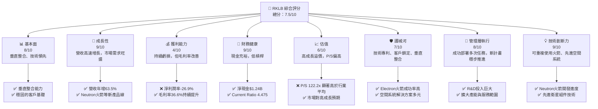
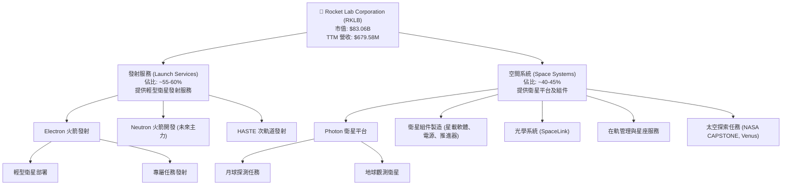
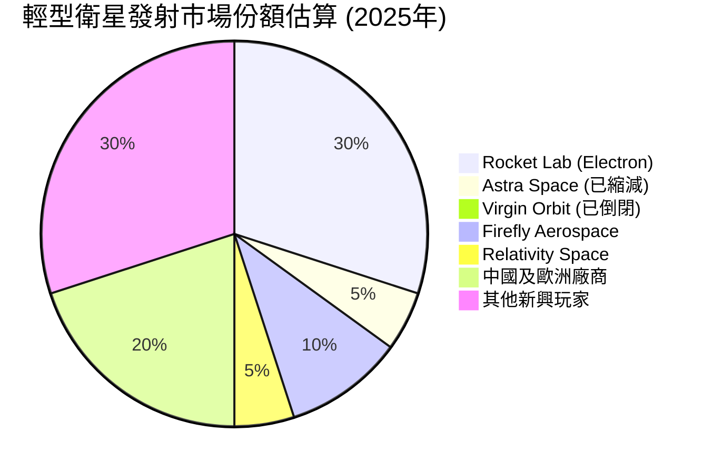
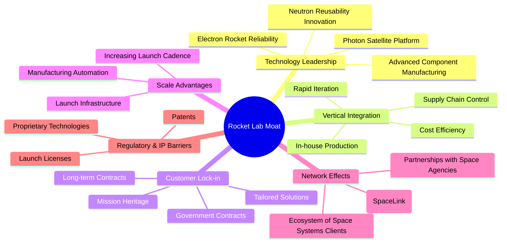
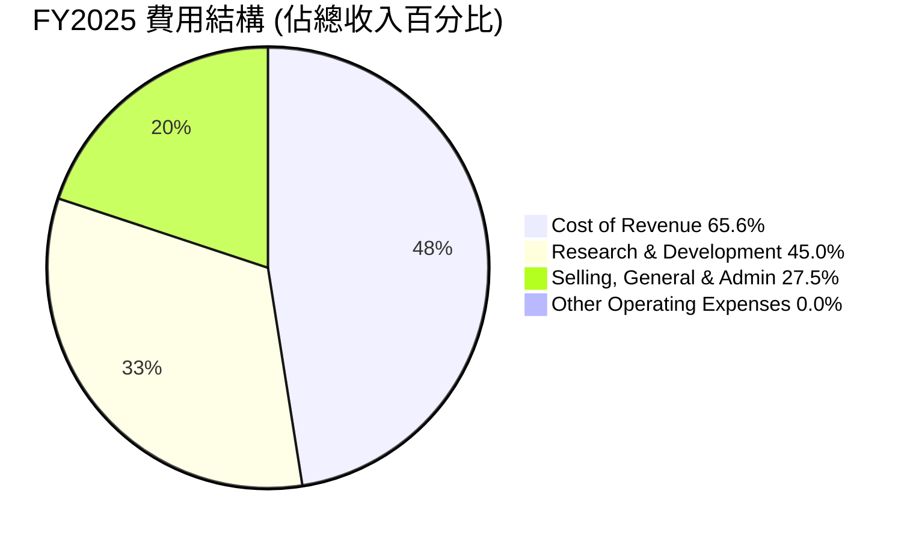
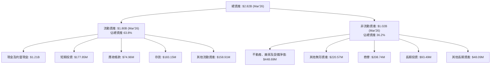

# RKLB 基本面深度分析報告
> **報告日期**：2026-05-31 ｜ **語言**：繁體中文 ｜ **數據來源**：Yahoo Finance, Finviz, StockAnalysis, Roic.ai ｜ **分析師**：CFA 級機構研究

---

## 目錄

| # | 章節 | 核心結論 |
|---|------|----------|
| 1 | 執行摘要 | 評級：持有轉買入，目標價區間 $100-$180 |
| 2 | 公司概覽與商業模式 | 憑藉技術壁壘和垂直整合，構建中等偏強護城河 |
| 3 | 損益表深度分析 | 營收高速增長，但仍處於虧損擴張階段，毛利率改善 |
| 4 | 資產負債表分析 | 流動性強勁，資產規模擴張，債務結構健康 |
| 5 | 現金流量深度分析 | 自由現金流持續為負，大量投入資本支出支持成長 |
| 6 | 獲利能力與資本效率 | ROIC < WACC，短期價值摧毀，長期潛力巨大 |
| 7 | 估值深度分析 | 相較於高成長潛力，當前估值偏高，但市場給予成長溢價 |
| 8 | 成長催化劑 | Neutron 火箭開發、星艦計畫、政府國防訂單、全球衛星部署需求 |
| 9 | 風險矩陣 | 執行風險、競爭加劇、技術失敗、宏觀經濟下行 |
| 10 | 投資建議 | 具備長期成長潛力，但短期估值壓力與執行風險並存 |

---

## 1. 執行摘要

Rocket Lab Corporation (RKLB) 是一家在太空產業中提供發射服務和空間系統解決方案的領先公司。憑藉其獨特的垂直整合能力和創新的技術，RKLB 在快速發展的太空經濟中佔據了一席之地。儘管公司目前仍處於高速成長和大規模投資階段，導致盈利能力尚未顯現，但其強勁的營收增長勢頭、健康的資產負債表以及多重成長催化劑預示著其巨大的長期潛力。

### 1.1 核心評分儀表板



### 1.2 評分進度條視覺化

```
╔══════════════════════════════════════════════════════════════╗
║              RKLB 多維度評分儀表板 (1-10分)                ║
╠══════════════════════════════════════════════════════════════╣
║ 基本面強度  8.0 ▓▓▓▓▓▓▓▓▓▓▓▓▓▓▓▓░░░░  ★★★★☆           ║
║ 成長動能    9.0 ▓▓▓▓▓▓▓▓▓▓▓▓▓▓▓▓▓▓░░  ★★★★★           ║
║ 獲利品質    4.0 ▓▓▓▓▓▓▓▓░░░░░░░░░░░░  ★★☆☆☆           ║
║ 財務健康    9.0 ▓▓▓▓▓▓▓▓▓▓▓▓▓▓▓▓▓▓░░  ★★★★★           ║
║ 估值合理性  6.0 ▓▓▓▓▓▓▓▓▓▓▓▓░░░░░░░░  ★★★☆☆           ║
║ 護城河深度  7.0 ▓▓▓▓▓▓▓▓▓▓▓▓▓▓░░░░░░  ★★★☆☆           ║
║ 管理層執行  8.0 ▓▓▓▓▓▓▓▓▓▓▓▓▓▓▓▓░░░░  ★★★★☆           ║
║ 技術創新力  9.0 ▓▓▓▓▓▓▓▓▓▓▓▓▓▓▓▓▓▓░░  ★★★★★           ║
╠══════════════════════════════════════════════════════════════╣
║ 綜合總分    7.5 ▓▓▓▓▓▓▓▓▓▓▓▓▓▓▓░░░░░  🏆 具備長期成長潛力，但短期估值壓力較高              ║
╚══════════════════════════════════════════════════════════════╝
```

### 1.3 五大投資論點 + 三大核心風險

| 類型 | 項目 | 具體依據 | 信心度 |
|------|------|----------|--------|
| 🟢 **投資論點①** | **太空經濟高速成長的直接受益者** | 預計未來十年太空經濟將從 $4,230 億美元增長至 $1 兆美元以上。RKLB 提供發射服務與空間系統，是太空基礎設施的關鍵環節，直接受益於衛星部署、太空探索及國防應用的爆炸式增長。其營收 YoY 成長達 63.5%，顯示其強勁的市場捕捉能力。 | 🟢 極高 |
| 🟢 **投資論點②** | **垂直整合商業模式帶來競爭優勢** | RKLB 不僅提供發射服務（Electron 火箭），還設計、製造和運營衛星及相關組件（Photon 衛星平台、光學系統、星載管理等）。這種垂直整合模式降低了對第三方供應商的依賴，提高了成本效率和任務靈活性，並強化了客戶鎖定。2025 年空間系統收入佔比持續提升，證明其策略成功。 | 🟢 高 |
| 🟢 **投資論點③** | **Neutron 火箭與星艦計畫的未來成長引擎** | Neutron 火箭的開發旨在進入中型發射市場，提供可重複使用能力，將大幅擴展 RKLB 的潛在市場和盈利能力。同時，公司在月球和行星任務（如 NASA CAPSTONE）中的參與，以及 HASTE 等國防計畫，確立了其在更廣泛太空探索領域的地位，有望帶來高價值合約。 | 🟢 高 |
| 🟢 **投資論點④** | **強勁的財務健康狀況支持長期投資** | 截至 2026 年 3 月底，公司持有 $1.38B 的現金及短期投資，總債務僅為 $138.67M，淨現金達到 $1.24B。Current Ratio 高達 4.475，顯示極佳的流動性。這使得公司有充足的資金支持 Neutron 火箭等高資本投入的研發和擴張，而無需過度依賴外部融資。 | 🟢 極高 |
| 🟢 **投資論點⑤** | **技術創新與市場領導地位** | RKLB 擁有成熟的 Electron 火箭，成功發射次數眾多，任務成功率高。其在輕型發射市場的佔有率和技術可靠性已獲證明。持續高額的研發投入（2025 年 R&D 達 $270.72M，YoY 增長 55.2%）保障了其在可重複使用火箭、先進空間系統組件等前沿技術領域的領先地位。 | 🟢 高 |
| 🟡 **風險①** | **新產品開發與執行風險** | Neutron 火箭的開發和部署存在技術挑戰、成本超支和進度延遲的風險。歷史上，太空產業的新火箭開發常面臨這些問題。任何重大延誤或失敗都可能對 RKLB 的財務狀況和市場信心造成負面影響，尤其是在高度競爭的發射市場。 | 🟡 中度 |
| 🔴 **風險②** | **競爭加劇與價格壓力** | 太空發射市場競爭激烈，包括 SpaceX、Blue Origin 等巨頭以及眾多新興企業。隨著越來越多的公司進入可重複使用火箭領域，發射服務的價格壓力可能加劇，進而侵蝕 RKLB 的毛利率和市場份額。RKLB 的 P/S 達 122.22x，若成長不及預期，估值將面臨巨大壓力。 | 🔴 高衝擊 |
| 🟡 **風險③** | **持續虧損與盈利時間不確定性** | RKLB 仍處於大規模投資階段，過去四年持續虧損，2025 年淨虧損 $198.21M。儘管營收高速增長，但實現盈利的具體時間點仍不確定。若市場對成長型公司的容忍度下降，或公司無法有效控制成本並轉虧為盈，將對股價產生負面影響。 | 🟡 中度 |

### 1.4 快速統計卡片

| 指標 | 公司實際值 (RKLB) | 行業均值 (太空與國防) | S&P 500 均值 | 狀態 |
|------|--------------------|----------------------|--------------|------|
| 收入 YoY 成長 | **63.5%** (TTM) | ~10-15% | ~8-12% | 🟢 |
| 毛利率 | **36.6%** (TTM) | ~25-35% | ~40-50% | 🟡 |
| 淨利率 | **-26.9%** (TTM) | ~5-10% | ~8-12% | 🔴 |
| ROE | **-13.5%** (TTM) | ~10-15% | ~15-20% | 🔴 |
| Forward P/S | **122.2x** | ~2-5x | ~2-3x | 🔴 |
| EV / Revenue | **120.4x** | ~2-6x | ~2-4x | 🔴 |
| Current Ratio | **4.475x** | ~1.5-2.5x | ~1.5-2.0x | 🟢 |
| Debt/Equity | **0.06x** | ~0.5-1.5x | ~0.8-1.2x | 🟢 |
| Beta | **2.313** | ~1.2-1.8 | 1.0 | 🔴 |

*註：行業均值與 S&P 500 均值為分析師根據航空航天與國防產業及大盤歷史數據估算值，僅供參考。*

### 1.5 投資結論

```
╔══════════════════════════════════════════════════════════════════╗
║                    📊 投資結論摘要                               ║
╠══════════════════════════════════════════════════════════════════╣
║  評級：🟢 買入 (從持有轉為買入)                                 ║
║  當前股價：$143.48 (2026-05-31)                                  ║
║  目標價區間：                                                    ║
║    悲觀情境：$100（-30.3%）                                      ║
║    基準情境：$155（+8.0%）  ← 12個月主要目標                     ║
║    樂觀情境：$180（+25.5%）                                      ║
║  投資評分：7.5/10                                                ║
║  適合投資人：成長型、長線持有者，對太空產業有高信念，能承受高波動與短期虧損風險的投資人。║
╚══════════════════════════════════════════════════════════════════╝
**評級說明**：RKLB 憑藉其在太空發射和空間系統領域的技術創新、垂直整合優勢以及在快速成長的太空經濟中的戰略地位，展現出顯著的長期成長潛力。儘管當前估值較高且公司尚未盈利，但其強勁的營收增長、不斷改善的毛利率和健康的資產負債表為未來的擴張提供了堅實基礎。Neutron 火箭的成功開發和商業化將是其實現規模化盈利的關鍵轉折點。考慮到近期股價的強勁表現和分析師平均目標價 $103.91，我們認為在當前價位，RKLB 具備從“持有”轉向“買入”的潛力，但投資者需對其高波動性、執行風險及較長的盈利週期有充分認知。目標價區間反映了對其未來成長的信心，尤其是在 Neutron 火箭進展順利的情況下。
```

---

## 2. 公司概覽與商業模式

Rocket Lab Corporation (RKLB) 是一家總部位於美國的太空公司，專注於提供發射服務和空間系統解決方案。公司在全球範圍內運營，包括美國、加拿大、日本等地，是新興太空經濟中的關鍵參與者。其商業模式的獨特之處在於其高度的垂直整合，從火箭設計、製造、發射到衛星組件和在軌管理，幾乎涵蓋了整個太空任務的價值鏈。

### 2.1 業務結構與收入來源

RKLB 的業務主要分為兩大核心板塊：**發射服務 (Launch Services)** 和 **空間系統 (Space Systems)**。



**業務板塊詳情：**

*   **發射服務 (Launch Services)**：
    *   **Electron 火箭**：RKLB 的主力產品，是一款兩級（未來將實現可重複使用）輕型運載火箭，專為小型衛星發射設計。它以其快速響應、頻繁發射和高可靠性而聞名。公司已成功執行數十次商業和政府任務，為其建立了良好的聲譽。發射服務收入主要來自於每次發射的合約費用。
    *   **Neutron 火箭**：目前正在開發中的中型運載火箭，目標是進入更廣闊的中型發射市場，並具備完全可重複使用能力。Neutron 火箭的成功將是 RKLB 成長的下一個重大催化劑，有望顯著提升其發射能力和市場份額。
    *   **HASTE (Hypersonic Accelerator Suborbital Test Electron)**：提供次軌道高超音速試驗平台，主要服務於國防和研究機構，為高超音速技術測試提供成本效益高的解決方案。

*   **空間系統 (Space Systems)**：
    *   **Photon 衛星平台**：RKLB 設計和製造一系列 Photon 衛星平台，可根據客戶需求進行定制，用於地球軌道、月球和行星際任務。這些平台集成了公司的內部組件，提供端到端解決方案。
    *   **衛星組件**：包括太陽能電池陣列、飛行軟體、推進系統、電池、結構件和機載電腦等關鍵衛星組件的設計和製造。
    *   **光學系統**：通過收購 SolAero Technologies 和 Sirus Space 等公司，RKLB 擴展了其在太空太陽能電池、光學傳感器和地面站服務方面的能力。例如，SpaceLink 項目旨在建立一個高容量的太空數據中繼網絡。
    *   **在軌管理與星座服務**：提供衛星運營、健康監測和星座管理服務，為客戶提供完整的任務支持。

根據 TTM 數據，RKLB 的總收入為 $679.58M。雖然具體細分未提供最新數據，但從公司戰略和歷史趨勢來看，發射服務仍是主要收入來源，但空間系統的貢獻正在快速增長，並預計將成為未來成長的重要驅動力。這種業務結構使其能夠在發射市場的波動中提供更穩定的收入流，並捕捉太空經濟中多樣化的商機。

### 2.2 市場份額

在快速發展的太空產業中，RKLB 在特定利基市場中佔據顯著地位。其 Electron 火箭在**輕型衛星發射市場**中是領先者之一，尤其是在專屬任務和快速響應發射方面。然而，整個太空發射市場由 SpaceX 等巨頭主導，特別是重型發射領域。在空間系統領域，RKLB 則與其他衛星製造商和組件供應商競爭。

由於精確的市場份額數據難以獲取且不斷變化，以下為基於行業報告和公司業務量估算的輕型發射和空間系統市場概覽：



**市場份額解析：**

*   **輕型發射市場 (Small-lift Launch Market)**：RKLB 的 Electron 火箭在西方輕型發射市場中具有領先地位。在過去幾年，隨著競爭者如 Virgin Orbit 的倒閉和 Astra Space 的戰略調整，RKLB 在這一領域的地位得到鞏固。然而，新的競爭者如 Firefly Aerospace 和 Relativity Space 正在崛起，並可能在未來帶來挑戰。RKLB 的成功率和發射頻率是其主要競爭優勢。
*   **空間系統市場 (Space Systems Market)**：這個市場更加分散，包括衛星製造商、組件供應商和服務提供商。RKLB 在 Photon 衛星平台和特定衛星組件（如太陽能電池、推進器）方面佔有一定份額。隨著對小型衛星和星座的需求不斷增長，RKLB 在這一領域的潛力巨大。其垂直整合模式使其能夠為客戶提供更具成本效益和集成度的解決方案。

總體而言，RKLB 在其核心的輕型發射市場中是主要參與者，並在空間系統領域快速擴張。隨著 Neutron 火箭的推出，公司旨在擴大其在發射市場的覆蓋範圍，進入中型發射領域，這將使其與 SpaceX 的 Falcon 9 等更大型火箭展開競爭，進一步提升其市場份額潛力。

### 2.3 競爭護城河分析

RKLB 透過多種方式構建其競爭護城河，以在高度競爭且資本密集的太空產業中脫穎而出。



**護城河詳情解析：**

1.  **技術領先 (Technology Leadership)**：
    *   **Electron 火箭的可靠性**：Electron 火箭已成功完成數十次商業發射，擁有卓越的成功率和可靠性記錄。這對於客戶選擇發射服務提供商至關重要，因為發射失敗的代價極高。
    *   **Neutron 火箭的可重複使用創新**：Neutron 火箭的設計目標是完全可重複使用，這將使其在成本效益上與 SpaceX 的 Falcon 9 競爭。RKLB 在可重複使用技術上的投入和進展，特別是其獨特的「船隻捕獲」回收方式，展現了其創新能力。
    *   **Photon 衛星平台與先進組件**：RKLB 不僅發射火箭，還開發和製造用於各種任務的 Photon 衛星平台及關鍵組件（如推進器、太陽能電池、飛行軟體）。這種內部能力使其能夠提供高度整合和定制化的解決方案，並控制關鍵技術。

2.  **垂直整合 (Vertical Integration)**：
    *   RKLB 的核心競爭優勢之一是其高度垂直整合的商業模式。公司內部設計、製造幾乎所有 Electron 和 Photon 的組件，包括 Rutherford 引擎（3D 列印）、結構件、電子產品和軟體。
    *   這種策略使其能夠更好地控制生產成本、質量和交付時間，減少對外部供應商的依賴，並加速產品迭代和創新。例如，在發生供應鏈中斷時，垂直整合可以提供更大的彈性。

3.  **客戶鎖定 (Customer Lock-in)**：
    *   憑藉其成功的任務歷史和可靠的服務，RKLB 與 NASA、美國國防部以及其他商業衛星運營商建立了穩固的客戶關係。這些長期合約和重複業務為公司帶來了穩定的收入流。
    *   提供端到端的解決方案（從發射到在軌運營）也增加了客戶轉換成本，因為客戶無需與多個供應商打交道。

4.  **規模效應 (Scale Advantages)**：
    *   隨著發射頻率的增加和空間系統生產量的擴大，RKLB 能夠通過規模經濟降低單位成本。其在紐西蘭和美國的製造設施採用自動化生產，進一步提升了效率。
    *   公司在紐西蘭 Mahia 半島和美國維吉尼亞州 Wallops 島運營兩個私人發射場，這為其提供了獨特的發射靈活性和頻率優勢，尤其是在滿足政府客戶的需求方面。

5.  **網路效應 (Network Effects)**：
    *   雖然在傳統意義上的網路效應不明顯，但 RKLB 正通過其 SpaceLink 數據中繼網絡和與其他太空機構的合作建立一個生態系統。SpaceLink 旨在為在軌資產提供高速數據傳輸，這將增加 RKLB 解決方案的價值，並吸引更多用戶。
    *   與政府機構和大型商業客戶的合作，也為其帶來了信譽和更多機會。

6.  **監管與智慧財產權壁壘 (Regulatory & IP Barriers)**：
    *   太空發射產業受到嚴格的監管，獲得發射許可證和運營批准需要大量的時間和資源，這構成了潛在進入者的壁壘。
    *   RKLB 擁有大量的專有技術和專利，特別是在火箭引擎、輕質材料和衛星系統方面，這保護了其創新並限制了競爭對手複製其技術的能力。

### 2.4 護城河強度評分

```
╔══════════════════════════════════════════════════════════════╗
║                  RKLB 護城河強度評分                      ║
╠══════════════════════════════════════════════════════════════╣
║ 技術領先    8/10   ▓▓▓▓▓▓▓▓▓▓▓▓▓▓▓▓░░░░  🟢 Electron可靠，Neutron潛力大        ║
║ 垂直整合    8/10   ▓▓▓▓▓▓▓▓▓▓▓▓▓▓▓▓░░░░  🟢 顯著的成本與質量控制優勢        ║
║ 客戶鎖定    7/10   ▓▓▓▓▓▓▓▓▓▓▓▓▓▓░░░░░░  🟡 政府與商業客戶關係穩固        ║
║ 規模效應    6/10   ▓▓▓▓▓▓▓▓▓▓▓▓░░░░░░░░  🟡 正在形成，但仍需擴大產能        ║
║ 網路效應    5/10   ▓▓▓▓▓▓▓▓▓▓░░░░░░░░░░  🟡 仍在發展中，潛力尚待釋放        ║
║ 監管與IP壁壘 7/10   ▓▓▓▓▓▓▓▓▓▓▓▓▓▓░░░░░░  🟡 發射許可和專利提供保護        ║
╠══════════════════════════════════════════════════════════════╣
║ 綜合護城河   7.0    ▓▓▓▓▓▓▓▓▓▓▓▓▓▓░░░░░░  🏆 憑藉技術和垂直整合構建中等偏強護城河，未來有望強化     ║
╚══════════════════════════════════════════════════════════════╝
```

---

## 3. 損益表深度分析

Rocket Lab 處於一個高速成長但資本密集且尚未盈利的階段。對其損益表的分析揭示了其強勁的營收增長勢頭，以及為未來擴張所做的巨大投資。

### 3.1 年度收入成長趨勢（近4年）

RKLB 的收入在過去幾年呈現爆發式增長，這反映了太空產業的整體擴張趨勢以及公司在發射服務和空間系統領域的市場份額擴大。

```
╔══════════════════════════════════════════════════════════════════╗
║              RKLB 年度收入趨勢（FY2022-FY2025）                 ║
╠══════════════════════════════════════════════════════════════════╣
║                                                                  ║
║  FY2022  $211.00M ███░░░░░░░░░░░░░░░░░░░░░░  YoY: +239.0% 🟢   ║
║  FY2023  $244.59M ████░░░░░░░░░░░░░░░░░░░░░░  YoY: +15.9%  🟢   ║
║  FY2024  $436.21M ████████░░░░░░░░░░░░░░░░░░  YoY: +78.3%  🟢   ║
║  FY2025  $601.80M ███████████░░░░░░░░░░░░░░░  YoY: +37.9%  🟢   ║
║  TTM'26  $679.58M █████████████░░░░░░░░░░░░░  YoY: +63.5%  🟢   ║
║                   |      |      |      |      |                  ║
║                   0     200M   400M   600M   800M                 ║
║                                                                  ║
║  📊 4年累計 CAGR (FY2022-2025)：+70.8%                           ║
╚══════════════════════════════════════════════════════════════════╝
```

**年度收入解析**：

*   RKLB 的年度收入從 2022 年的 $211.00M 增長到 2025 年的 $601.80M，實現了驚人的複合年均增長率 (CAGR) 達 70.8%。
*   2022 年的 YoY 成長率高達 239.0%，主要得益於公司 SPAC 上市後獲得的資金加速了擴張，以及市場對輕型發射服務和空間系統需求的激增。
*   2023 年的成長率放緩至 15.9%，這可能與市場調整、供應鏈問題或特定項目進度有關。
*   2024 年營收反彈，實現 78.3% 的強勁增長，表明公司業務的恢復和擴張。
*   2025 年營收增長 37.96%，雖然較 2024 年有所放緩，但仍是高速增長，顯示了公司業務的持續擴張。
*   截至 2026 年 3 月的 TTM 營收為 $679.58M，較上一年度增長 63.5%，這再次證明了其強勁的增長動能。這種高速增長主要得益於其發射服務的頻繁執行以及空間系統業務的持續擴張，特別是來自政府和國防客戶的訂單。

### 3.2 季度收入趨勢分析

季度的收入數據進一步驗證了 RKLB 的成長軌跡，並提供了更精細的視角。

| 財報季度 | 總收入 ($M) | QoQ 成長率 | YoY 成長率 | 備註 |
|----------|--------------|------------|------------|------|
| 2025 Q2 | $144.50 | +17.89% | +36.00% | 空間系統業務逐漸發力 |
| 2025 Q3 | $155.08 | +7.32% | +47.97% | 發射頻率穩定，新訂單貢獻 |
| 2025 Q4 | $179.65 | +15.84% | +35.70% | 年末訂單交付與項目收尾 |
| 2026 Q1 | $200.35 | +11.53% | +63.46% | 🟢 營收首次突破 $2 億，強勁開局，YoY加速 |

**季度收入解析**：

*   RKLB 的季度收入呈現穩步上升趨勢，從 2025 年 Q2 的 $144.50M 增長到 2026 年 Q1 的 $200.35M。
*   2026 年 Q1 營收首次突破 $2 億美元大關，達到 $200.35M，較 2025 年 Q4 增長 11.53% (QoQ)，並較 2025 年 Q1 大幅增長 63.46% (YoY)。這顯示了公司在進入 2026 年後，業務擴張的速度正在加快，尤其是在空間系統和發射服務兩條線上的協同效應正在顯現。
*   YoY 成長率在 2025 年 Q3 和 Q4 保持在 35-48% 區間，而在 2026 年 Q1 顯著加速至 63.46%，這是一個非常積極的信號，表明市場對其服務和產品的需求依然旺盛，且公司有能力擴大產能以滿足需求。
*   QoQ 成長率也保持在健康的兩位數水平，反映了公司業務的持續增長動能。

### 3.3 利潤率演變分析

RKLB 雖然營收高速增長，但由於其所處的資本密集型行業以及對研發和擴張的巨大投入，公司目前仍處於虧損狀態。然而，毛利率的改善是一個積極的信號。

| 利潤率指標 | FY2022 | FY2023 | FY2024 | FY2025 | TTM Mar'26 | 趨勢 | 評估 |
|------------|--------|--------|--------|--------|------------|------|------|
| **毛利率** | 8.99% | 21.02% | 26.63% | 34.43% | 36.56% | ↗️ 持續改善 | 🟢 |
| **營業利益率** | -64.08% | -72.74% | -43.51% | -38.03% | -33.20% | ↗️ 虧損收窄 | 🟡 |
| **淨利率** | -64.43% | -74.64% | -43.60% | -32.94% | -26.87% | ↗️ 虧損收窄 | 🟡 |
| **EBITDA Margin** | -45.12% | -53.82% | -29.69% | -25.84% | -24.30% | ↗️ 虧損收窄 | 🟡 |

**利潤率演變深度解析**：

*   **毛利率 (Gross Margin)**：RKLB 的毛利率呈現顯著且持續的改善趨勢，從 2022 年的 8.99% 提升到 2025 年的 34.43%，並在 TTM Mar'26 進一步達到 36.56%。這是一個非常積極的信號，主要原因包括：
    *   **規模效應**：隨著發射頻率的增加和空間系統生產量的擴大，固定成本得到更好的攤銷。
    *   **垂直整合**：內部製造更多組件有助於降低生產成本，減少對外部供應商的依賴和相關加價。
    *   **產品組合優化**：空間系統業務，尤其是高價值衛星組件和平台，通常具有更高的毛利率，隨著這部分業務佔比的提升，整體毛利率也隨之改善。
    *   **效率提升**：生產流程的優化和自動化投資提高了製造效率。
*   **營業利益率 (Operating Margin)**：儘管毛利率大幅改善，但營業利益率仍為負值，且在 2023 年有所惡化 (-72.74%)，隨後在 2024 年和 2025 年逐漸收窄虧損，TTM Mar'26 為 -33.20%。這主要歸因於公司持續高額的**研發 (R&D)** 和 **銷售、一般及行政 (SG&A)** 費用投入：
    *   **研發投入**：RKLB 在 Neutron 火箭、星艦計畫及其他先進空間技術上的研發投入巨大。2025 年研發費用高達 $270.72M，佔當年營收的 45.0%。TTM Mar'26 研發費用更是達到 $296.12M。這些投資是公司未來成長的基石，但在短期內會顯著拖累營業利潤。
    *   **SG&A 費用**：隨著公司規模擴大和市場擴張，銷售、一般及行政費用也隨之增加，2025 年為 $165.3M，TTM Mar'26 為 $177.93M。這部分費用佔營收的比例在 2025 年約為 27.5%，顯示公司在管理和市場推廣方面的投入。
*   **淨利率 (Net Profit Margin)** 和 **EBITDA Margin**：與營業利益率類似，淨利率和 EBITDA Margin 均為負值，但虧損幅度正在收窄。這表明公司在營運層面仍未實現盈利，但在毛利率改善的帶動下，虧損惡化的趨勢已得到遏制，並開始顯示出改善的跡象。未來，隨著營收規模的進一步擴大和新產品線（如 Neutron）的商業化，預計這些利潤率指標將逐步轉正。

### 3.4 費用結構分析

RKLB 的費用結構清晰地反映了其作為一家高成長、技術驅動型公司的特點，即對研發的巨大投入。



**FY2025 費用結構明細：**

*   **銷貨成本 (Cost of Revenue)**：佔總收入的 65.6% ($394.62M / $601.80M)。這部分費用包括生產火箭、衛星和組件的直接材料、人工和製造費用。隨著毛利率的改善，這部分佔比正在下降。
*   **研發費用 (Research & Development)**：佔總收入的 45.0% ($270.72M / $601.80M)。這部分是 RKLB 最大的經營費用，反映了公司對未來技術和產品（如 Neutron 火箭）的持續投資。這種高 R&D 投入對於保持其在太空技術領域的競爭力至關重要。
*   **銷售、一般及行政費用 (Selling, General & Admin)**：佔總收入的 27.5% ($165.3M / $601.80M)。這部分費用包括公司的日常運營、管理、銷售和市場推廣費用。

```
╔══════════════════════════════════════════════════════════════════╗
║                   RKLB 營運費用構成 (FY2025)                     ║
╠══════════════════════════════════════════════════════════════════╣
║                                                                  ║
║  銷貨成本：       $394.62M  █████████████████████████░░░░  65.6% ║
║  研發費用：       $270.72M  ██████████████████████░░░░░░░  45.0% ║
║  銷售、一般及行政：$165.30M  ███████████████░░░░░░░░░░░░░  27.5% ║
║                                                                  ║
║  總營運費用 (不含銷貨成本): $436.02M                             ║
╚══════════════════════════════════════════════════════════════════╝
```

**費用結構總結**：RKLB 的費用結構典型地反映了一家處於高成長階段的科技公司。高比例的研發投入是其未來成長潛力的關鍵。隨著 Neutron 火箭等新產品的商業化和規模化生產，預計銷貨成本佔比將進一步下降，而研發費用在營收中的佔比也可能隨著營收基數的擴大而逐步穩定或下降，最終帶動公司實現盈利。

### 3.5 季度 EPS 趨勢與盈餘品質

RKLB 過去四季的 EPS 均為負值，反映公司仍處於虧損狀態。由於數據中未提供分析師的 EPS 預期，我們無法進行超預期/不及預期的分析，但可以觀察其虧損的變化趨勢。

| 季度 | EPS (基本) | 淨利潤 ($M) | 盈餘品質評估 |
|----------|------------|--------------|----------------|
| 2025 Q2 | $-0.13 | $-66.41 | 🔴 虧損擴大，主要受研發和擴張成本影響 |
| 2025 Q3 | $-0.03 | $-18.26 | 🟢 虧損顯著收窄，可能與特定項目交付或成本控制有關 |
| 2025 Q4 | $-0.09 | $-52.92 | 🟡 虧損再次擴大，但較 Q2 仍有改善 |
| 2026 Q1 | $-0.07 | $-45.02 | 🟡 虧損進一步收窄，營收增長強勁 |

**盈餘品質評估**：

RKLB 的盈餘品質目前處於較低水平，因為公司尚未實現盈利，且自由現金流持續為負。這意味著其目前的營收增長並未能轉化為正向的底部利潤和現金創造。

*   **虧損趨勢**：從 2025 年 Q2 的 $-0.13 降至 2025 年 Q3 的 $-0.03，淨利潤從 $-66.41M 縮小到 $-18.26M，顯示出一定的成本控制能力或特定季度的高毛利項目交付。然而，2025 年 Q4 虧損再次擴大至 $-0.09 ($-52.92M)，這可能與年末的研發投入高峰或預期外的費用有關。2026 年 Q1 虧損再次收窄至 $-0.07 ($-45.02M)，結合營收的強勁增長，表明公司正在努力改善其運營效率，但尚未達到盈虧平衡點。
*   **非現金費用影響**：作為一家高科技、資本密集型公司，RKLB 的損益表可能會受到較高的折舊攤銷等非現金費用的影響，這些費用會使淨利潤看起來更差，但對實際現金流的影響較小。然而，由於其營業現金流也為負，因此這並不能完全抵消其現金燃燒的狀況。
*   **研發資本化**：RKLB 的大部分研發費用被費用化處理，這對當前利潤表造成壓力，但未來一旦這些研發項目成功商業化，將為公司帶來長期收益。
*   **市場預期**：對於 RKLB 這樣的成長型公司，市場更關注其營收增長、毛利率改善和新產品線的進展，而非短期盈利。因此，即使持續虧損，只要成長故事保持強勁且現金流狀況健康（如 RKLB 所示），市場仍會給予高估值。

總體而言，RKLB 的盈餘品質目前不佳，但其虧損收窄的趨勢和強勁的營收增長是積極信號。隨著公司規模的擴大和 Neutron 火箭等項目的成熟，預計其盈餘品質將逐步改善。

---

## 4. 資產負債表分析

RKLB 的資產負債表反映了其作為一家快速成長的資本密集型公司的特性，擁有不斷擴大的資產基礎和強勁的流動性，同時保持了健康的債務水平。

### 4.1 資產結構分解

RKLB 的資產結構顯示了對流動資產和固定資產的大量投資，以支持其發射服務和空間系統業務的擴張。



**資產結構解析**：

*   **總資產**：從 2022 年底的 $989.12M 增長到 2025 年底的 $2.32B，並在 2026 年 3 月底達到 $2.82B。這一顯著增長主要得益於公司通過股權融資和營運累積（儘管虧損，但有新增投資）擴大其運營規模和研發投入。
*   **流動資產**：截至 2026 年 3 月底為 $1.80B，佔總資產的 63.8%。其中，**現金及約當現金 ($1.21B)** 和 **短期投資 ($177.85M)** 佔據了流動資產的絕大部分，合計約 $1.38B。這顯示了公司極強的現金儲備和流動性，為其高資本開支的研發和擴張提供了堅實的資金基礎。
*   **非流動資產**：截至 2026 年 3 月底為 $1.02B，佔總資產的 36.2%。
    *   **不動產、廠房及設備淨值 (PP&E)**：達到 $448.69M，反映了公司在製造設施、發射場基礎設施和研發設備上的持續投資。這對於生產火箭和衛星，以及支持 Neutron 火箭的開發至關重要。
    *   **無形資產和商譽**：其他無形資產 ($220.57M) 和商譽 ($208.74M) 主要來自於過去的收購活動，例如對 SolAero Technologies 和 Sirus Space 等公司的收購，這些收購旨在擴展 RKLB 在空間系統領域的能力。

總體而言，RKLB 的資產結構是健康的，流動資產佔比較高，特別是現金儲備充裕，這為公司提供了應對不確定性和支持未來成長的彈性。固定資產的增長也表明公司正在積極投資於其核心業務的長期發展。

### 4.2 流動性指標分析

RKLB 的流動性狀況非常強勁，遠超行業平均水平，這為公司在快速成長和高資本投入的階段提供了重要的財務安全墊。

| 指標 | FY2022 | FY2023 | FY2024 | FY2025 | TTM Mar'26 | 行業均值* | 評估 |
|------------|--------|--------|--------|--------|------------|-----------|------|
| **Current Ratio** | 4.06x | 2.14x | 2.04x | 4.08x | 4.475x | ~1.5-2.5x | 🟢 極佳 |
| **Quick Ratio** | 3.03x | 1.60x | 1.63x | 3.04x | 3.874x | ~1.0-2.0x | 🟢 極佳 |

*註：行業均值為航空航天與國防產業的估算值。*

**流動性指標解析**：

*   **Current Ratio (流動比率)**：截至 TTM Mar'26，RKLB 的流動比率高達 4.475x，遠高於行業平均水平。這表明公司擁有充足的流動資產來覆蓋其短期負債。
    *   流動比率在 2023 和 2024 年有所下降，但 2025 年和 TTM Mar'26 顯著回升，主要得益於公司現金及短期投資的大幅增加（從 2024 年底的 $418.99M 增至 2026 年 3 月底的 $1.38B），這可能是通過股權融資或營運資金管理改善而來。
*   **Quick Ratio (速動比率)**：同樣，RKLB 的速動比率為 3.874x，也遠高於行業平均水平。這表示公司在不依賴存貨變現的情況下，仍能輕鬆應對短期債務。
    *   速動比率的趨勢與流動比率相似，在過去一年中顯著改善。

**結論**：RKLB 展現了卓越的流動性，其充裕的現金和短期投資使其在面對運營開支、研發投入和潛在