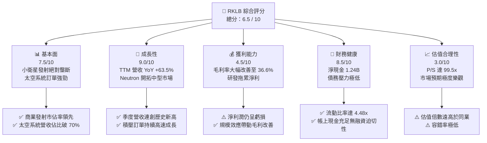

# RKLB 基本面深度分析報告
> **報告日期**：2026-06-09 ｜ **語言**：繁體中文 ｜ **數據來源**：Yahoo Finance, Finviz, StockAnalysis, Roic.ai ｜ **分析師**：CFA 級機構研究

---

## 目錄

| # | 章節 | 核心結論 |
|---|------|----------|
| 1 | 執行摘要 | 評級：**買入 (長線成長) / 持有 (估值偏高)**；目標價：**$110.00** |
| 2 | 公司概覽與商業模式 | 雙引擎驅動（發射服務 + 太空系統），具備高轉換成本與技術壁壘 |
| 3 | 損益表深度分析 | 營收 TTM 達 **$679.58M** (YoY +63.5%)，毛利率顯著擴張至 **36.6%** |
| 4 | 資產負債表分析 | 淨現金達 **$1.24B**，流動比率 **4.48x**，財務防禦力極強 |
| 5 | 現金流量深度分析 | 營運現金流與 FCF 仍呈流出狀態，主要因 **Neutron** 研發與資本支出高峰期 |
| 6 | 獲利能力與資本效率 | ROIC (-47.4%) 暫低於 WACC (16.7%)，企業價值處於加速釋放前夕 |
| 7 | 估值深度分析 | P/S 達 **99.51x**，溢價極高；DCF 基準情境合理估值為 **$110.00** |
| 8 | 成長催化劑 | 中型火箭 **Neutron** 首飛在即，太空系統積壓訂單持續轉化 |
| 9 | 風險矩陣 | 發射失敗風險、Neutron 研發延期與高估值回檔壓力為三大核心風險 |
| 10| 投資建議 | 長線看好空間基礎設施龍頭，建議逢低分批佈局 |

---

## 1. 執行摘要

### 1.1 核心評分儀表板



### 1.2 評分進度條視覺化

```
╔══════════════════════════════════════════════════════════════╗
║               RKLB 多維度評分儀表板 (1-10分)                 ║
╠══════════════════════════════════════════════════════════════╣
║ 基本面強度  7.5 ▓▓▓▓▓▓▓▓▓▓▓▓▓▓▓░░░░░  ★★★★☆           ║
║ 成長動能    9.0 ▓▓▓▓▓▓▓▓▓▓▓▓▓▓▓▓▓▓░░  ★★