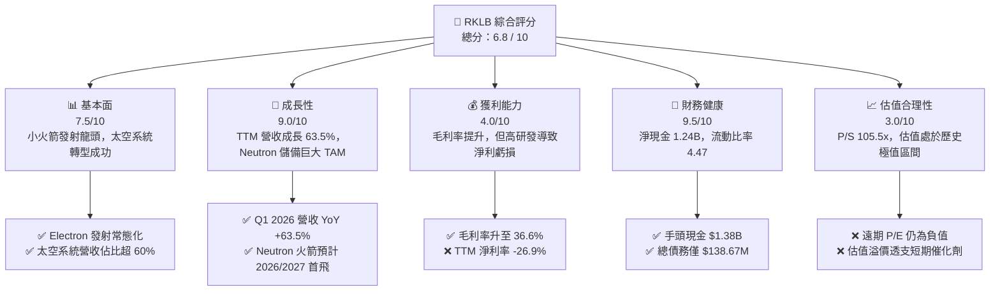

# RKLB 基本面深度分析報告

> **報告日期**：2026-06-11 ｜ **語言**：繁體中文 ｜ **數據來源**：Yahoo Finance, Finviz, StockAnalysis, Roic.ai ｜ **分析師**：CFA 級機構研究

---

## 目錄

| # | 章節 | 核心結論 |
|---|------|----------|
| 1 | **執行摘要** | 評級：🟡 **持有 (Hold) / 觀望** ｜ 目標價：$105.28 ｜ 估值溢價極高，靜待 Neutron 催化劑 |
| 2 | **公司概覽與商業模式** | 發射服務與太空系統雙輪驅動，太空系統（Space Systems）已成核心營收引擎 |
| 3 | **損益表深度分析** | TTM 營收成長 63.5%，毛利率穩健提升至 36.6%，但研發費用高企導致持續虧損 |
| 4 | **資產負債表分析** | 現金儲備達 $1.38B，淨現金 $1.24B，流動比率 4.475，財務結構極其安全 |
| 5 | **現金流量深度分析** | 燒錢率（FCF -$316.3M）受控，股權融資大幅充實安全墊，可支撐 4 年以上運營 |
| 6 | **獲利能力與資本效率** | ROIC (-47.1%) 暫低於 WACC (16.8%)，公司處於重資本投入與價值蓄力期 |
| 7 | **估值深度分析** | P/S 達 105.5x，顯著高於歷史均值與同業，市場已充分透支 Neutron 成功預期 |
| 8 | **成長催化劑** | Neutron 中大型火箭首飛與 MDA / 太空軍（Space Force）大單交付為核心動能 |
| 9 | **風險矩陣** | Neutron 研發延遲與發射失敗為最大尾部風險，SpaceX 價格戰威脅中長期毛利 |
| 10 | **投資建議** | 建議於股價回調至 $85-95 區間逢低分批布局，長期看好其太空基礎設施龍頭地位 |

---

## 1. 執行摘要

### 1.1 核心評分儀表板



### 1.2 評分進度條視覺化

```
╔══════════════════════════════════════════════════════════════╗
║               RKLB 多維度評分儀表板 (1-10分)                 ║
╠══════════════════════════════════════════════════════════════╣
║ 基本面強度  7.5 ▓▓▓▓▓▓▓▓▓▓▓▓▓▓▓░░░░░  ★★★★☆           ║
║ 成長動能