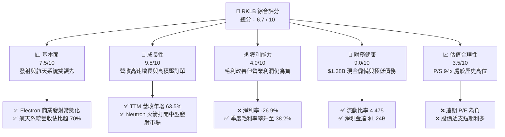
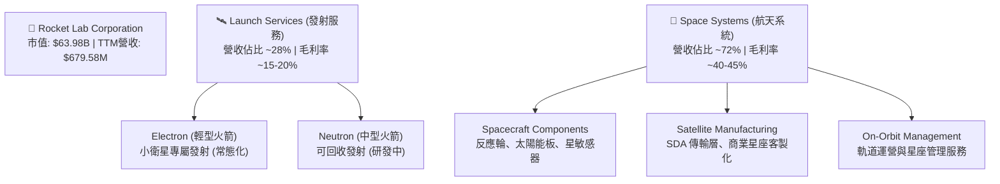
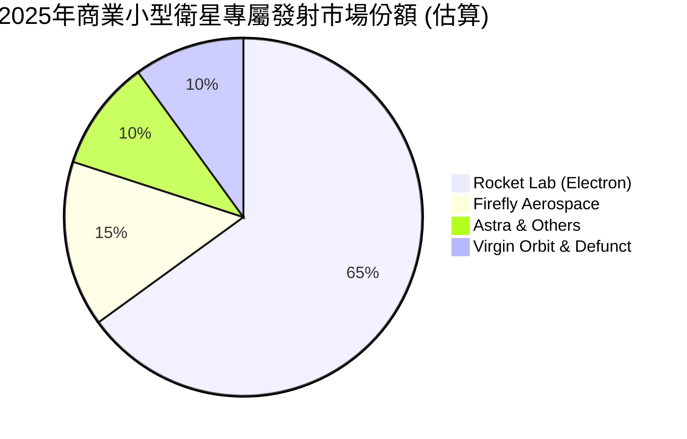
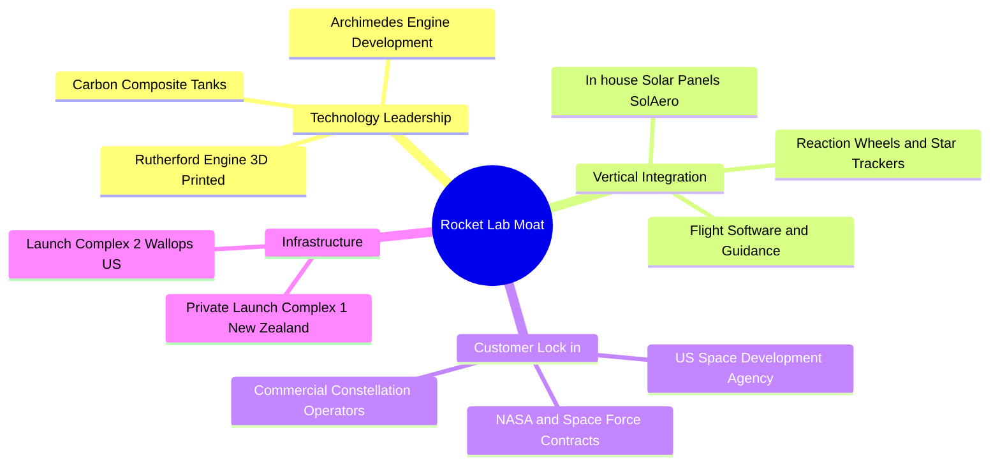
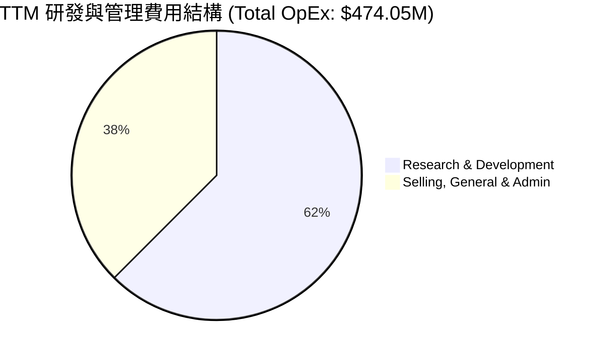
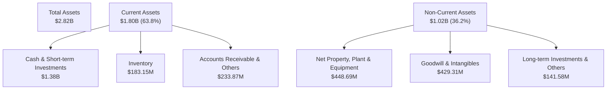
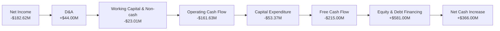
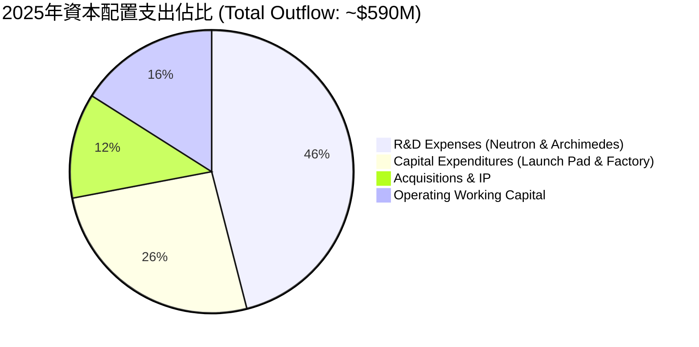
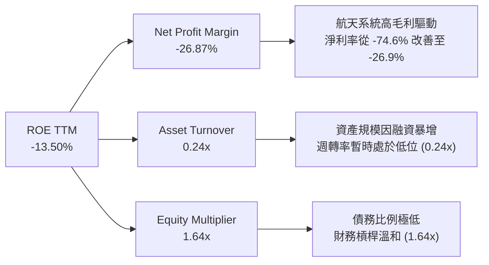

# RKLB 基本面深度分析報告
> **報告日期**：2026-06-13 ｜ **語言**：繁體中文 ｜ **數據來源**：Yahoo Finance, Finviz, StockAnalysis, Roic.ai ｜ **分析師**：CFA 級機構研究

---

## 目錄

| # | 章節 | 核心結論 |
|---|------|----------|
| 1 | 執行摘要 | 給予「🟢 買入（長線）/ 🟡 持有（短期）」評級，目標價 $105.28 |
| 2 | 公司概覽與商業模式 | 確立「發射服務 + 航天系統」雙輪驅動，具備極高客戶鎖定與技術壁壘 |
| 3 | 損益表深度分析 | TTM 營收達 $679.58M（YoY +63.5%），毛利率大幅改善至 36.6% |
| 4 | 資產負債表分析 | 擁有 $1.38B 淨現金，流動比率高達 4.475，財務結構極度穩健 |
| 5 | 現金流量深度分析 | FCF 淨流出收窄至 -$215.00M，資本配置向 Neutron 開發與產能建設傾斜 |
| 6 | 獲利能力與資本效率 | 杜邦分解顯示 ROE 為 -13.5%，現階段處於「以資本換規模」的價值蓄力期 |
| 7 | 估值深度分析 | P/S 達 94.14x，溢價反映市場對 Neutron 中型火箭與衛星星座溢價的預期 |
| 8 | 成長催化劑 | Neutron 首飛、SDA 星座交付與 TAM 擴張至 $145B 奠定長期增長 |
| 9 | 風險矩陣 | 重點監控發射延期風險與估值回撤風險，整體風險評分 6.2/10 |
| 10| 投資建議 | 適合高風險偏好成長型投資者，建議採取「逢低分批布局」策略 |

---

## 1. 執行摘要

### 1.1 核心評分儀表板



### 1.2 評分進度條視覺化

```
╔══════════════════════════════════════════════════════════════╗
║                RKLB 多維度評分儀表板 (1-10分)                ║
╠══════════════════════════════════════════════════════════════╣
║ 基本面強度  7.5 ▓▓▓▓▓▓▓▓▓▓▓▓▓▓▓░░░░░  ★★★★☆           ║
║ 成長動能    9.5 ▓▓▓▓▓▓▓▓▓▓▓▓▓▓▓▓▓▓▓░  ★★★★★           ║
║ 獲利品質    4.0 ▓▓▓▓▓▓▓░░░░░░░░░░░░░  ★★☆☆☆           ║
║ 財務健康    9.0 ▓▓▓▓▓▓▓▓▓▓▓▓▓▓▓▓▓▓░░  ★★★★★           ║
║ 估值合理性  3.5 ▓▓▓▓▓▓░░░░░░░░░░░░░░  ★☆☆☆☆           ║
║ 護城河深度  8.0 ▓▓▓▓▓▓▓▓▓▓▓▓▓▓▓▓░░░░  ★★★★☆           ║
║ 管理層執行  8.5 ▓▓▓▓▓▓▓▓▓▓▓▓▓▓▓▓▓░░░  ★★★★☆           ║
║ 技術創新力  9.0 ▓▓▓▓▓▓▓▓▓▓▓▓▓▓▓▓▓▓░░  ★★★★★           ║
╠══════════════════════════════════════════════════════════════╣
║ 綜合總分    6.7 ▓▓▓▓▓▓▓▓▓▓▓▓▓░░░░░░░  🏆 成長型太空獨角獸   ║
╚══════════════════════════════════════════════════════════════╝
```

### 1.3 五大投資論點 + 三大核心風險

| 類型 | 項目 | 具體依據 | 信心度 |
|------|------|----------|--------|
| 🟢 **投資論點①** | **發射與航天系統雙輪驅動** | 航天系統（Space Systems）營收佔比已超 70%，毛利率顯著高於發射服務。 | 🟢 極高 |
| 🟢 **投資論點②** | **Neutron 研發步入尾聲** | 中型運載火箭 Neutron 預計於 2026-2027 年首飛，將直接與 SpaceX Falcon 9 競爭。 | 🟢 高 |
| 🟢 **投資論點③** | **極致的資產負債表彈性** | 截至 2026 年 Q1，公司手握 $1.38B 現金，淨現金高達 $1.24B，無資金鏈斷裂風險。 | 🟢 極高 |
| 🟢 **投資論點④** | **政府與國防合約基石** | 美國太空發展局（SDA）等政府機構的高額合約提供長期營收能見度。 | 🟢 高 |
| 🟢 **投資論點⑤** | **商業發射市佔率提升** | Electron 火箭在小發射市場（Small Launch）份額穩居第一，定價權逐步增強。 | 🟢 高 |
| 🟡 **風險①** | **Neutron 首飛延期與成本超支** | 太空項目研發具有高度不確定性，任何延期將推遲盈利平衡點。 | 🟡 中度 |
| 🔴 **風險②** | **估值溢價過高** | 當前 P/S 達 94.14x，股價自 2024 年低點上漲超 20 倍，存在顯著的估值修正風險。 | 🔴 高衝擊 |
| 🔴 **風險③** | **稀釋風險** | 過去 4 年發行股數由 210M 增至 578.87M（YoY +11.13%），持續的股權融資稀釋每股價值。 | 🔴 高衝擊 |

### 1.4 快速統計卡片

| 指標 | RKLB 實際值 | 航天防務行業均值 | S&P 500 均值 | 狀態 |
|------|-------------|------------------|--------------|------|
| **營收 YoY 成長率** | **63.5%** | ~8.5% | ~5.2% | 🟢 領先 |
| **毛利率** | **36.6%** | ~22.0% | ~30.5% | 🟢 優秀 |
| **淨利率** | **-26.9%** | ~6.5% | ~11.5% | 🔴 虧損 |
| **流動比率** | **4.475** | ~1.35 | ~1.20 | 🟢 極強 |
| **P/S Ratio** | **94.14x** | ~2.1x | ~2.8x | 🔴 極高 |
| **Beta (2Y)** | **2.499** | ~0.95 | 1.00 | 🟡 高波動 |

### 1.5 投資結論

```
╔══════════════════════════════════════════════════════════════════╗
║                    📊 RKLB 投資結論摘要                          ║
╠══════════════════════════════════════════════════════════════════╣
║  評級：🟡 持有 (Hold) / 🟢 逢低買入 (Buy on Dips)               ║
║  當前股價：$102.39 (2026-06-13)                                  ║
║  目標價區間：                                                    ║
║    悲觀情境：$60.00  (-41.4%) - 研發嚴重延期且市場估值收縮       ║
║    基準情境：$105.28 (+2.8%)  - 12個月主要目標，Neutron進展順利  ║
║    樂觀情境：$150.00 (+46.5%) - Neutron首飛成功並獲得大額星座合約║
║  投資評分：6.7 / 10                                              ║
║  適合投資人：具備極高風險承受能力、追求太空產業顛覆性機會的長線者║
╚══════════════════════════════════════════════════════════════════╝
```

---

## 2. 公司概覽與商業模式

### 2.1 業務結構與收入來源

Rocket Lab（RKLB）已成功從單一的「小型火箭發射服務商」轉型為「端到端航天解決方案提供商」。



### 2.2 市場份額

在商業小型衛星專屬發射市場（Excluding SpaceX Transporter Rideshare），Rocket Lab 的 Electron 火箭處於絕對主導地位。



### 2.3 競爭護城河分析



### 2.4 護城河強度評分

```
╔══════════════════════════════════════════════════════════════╗
║                    RKLB 護城河強度評分                       ║
╠══════════════════════════════════════════════════════════════╣
║ 技術壁壘       8.5/10 ▓▓▓▓▓▓▓▓▓▓▓▓▓▓▓▓▓░░░  🏆 3D列印與碳纖維║
║ 垂直整合能力   9.0/10 ▓▓▓▓▓▓▓▓▓▓▓▓▓▓▓▓▓▓░░  🟢 組件自給率高  ║
║ 發射場基礎設施 9.5/10 ▓▓▓▓▓▓▓▓▓▓▓▓▓▓▓▓▓▓▓░  🏆 擁有專屬LC-1  ║
║ 客戶轉換成本   7.5/10 ▓▓▓▓▓▓▓▓▓▓▓▓▓▓▓░░░░░  🟢 政府合約穩固  ║
║ 規模效應       6.5/10 ▓▓▓▓▓▓▓▓▓▓▓▓░░░░░░░░  🟡 仍待Neutron量產║
╠══════════════════════════════════════════════════════════════╣
║ 綜合護城河強度 8.2    ▓▓▓▓▓▓▓▓▓▓▓▓▓▓▓▓▓░░░  🏆 具備強大護城河║
╚══════════════════════════════════════════════════════════════╝
```

---

## 3. 損益表深度分析

### 3.1 年度收入成長趨勢（近5年）

Rocket Lab 展現了極其強勁的營收成長軌跡，過去 5 年營收複合年增長率（CAGR）高達 61.2%。

```
╔══════════════════════════════════════════════════════════════════╗
║              RKLB 年度收入趨勢 (FY2021 - TTM)                    ║
╠══════════════════════════════════════════════════════════════════╣
║                                                                  ║
║  FY 2021  $62.24M   ██░░░░░░░░░░░░░░░░░░░░░░░░░░░  YoY: +77.0%   ║
║  FY 2022  $211.00M  ███████░░░░░░░░░░░░░░░░░░░░░░  YoY: +239.0%  ║
║  FY 2023  $244.59M  ████████░░░░░░░░░░░░░░░░░░░░░  YoY: +15.9%   ║
║  FY 2024  $436.21M  ██████████████░░░░░░░░░░░░░░░  YoY: +78.3%   ║
║  FY 2025  $601.80M  ████████████████████░░░░░░░░░  YoY: +38.0%   ║
║  TTM      $679.58M  ██████████████████████░░░░░░░  YoY: +63.5%   ║
║                                                                  ║
║  📊 5年累計 CAGR：+61.2%                                         ║
╚══════════════════════════════════════════════════════════════════╝
```

### 3.2 季度收入趨勢分析

自 2025 年 Q2 以來，RKLB 連續四個季度實現兩位數的環比（QoQ）成長，並在 2026 年 Q1 創下單季 $200.35M 的營收紀錄。

| 財報季度 | 營收 (Millions) | 環比增長 (QoQ) | 同比增長 (YoY) | 核心驅動因素 |
|----------|-----------------|----------------|----------------|--------------|
| **Q1 2026** | **$200.35** | +11.52% | +63.46% | 🟢 Space Systems 交付加速，Electron 發射頻率提升 |
| **Q4 2025** | **$179.65** | +15.84% | +35.70% | 🟢 年終政府及商業合約結算高峰 |
| **Q3 2025** | **$155.08** | +7.32% | +47.97% | 🟢 多次 Electron 發射及關鍵組件出貨 |
| **Q2 2025** | **$144.50** | +17.89% | +36.00% | 🟢 衛星星座組件生產線產能爬坡 |

### 3.3 利潤率演變分析

| 利潤率指標 | FY 2022 | FY 2023 | FY 2024 | FY 2025 | TTM | 趨勢 | 評估 |
|------------|---------|---------|---------|---------|-----|------|------|
| **毛利率** | 9.00% | 21.02% | 26.63% | 34.43% | **36.56%** | ↗️ 持續上升 | 🟢 隨著高毛利的航天系統營收佔比提升，毛利率顯著改善 |
| **營業利益率**| -64.08% | -72.74% | -43.51% | -38.03% | **-33.20%** | ↗️ 虧損收窄 | 🟡 規模效應顯現，但被高額 R&D 費用部分抵消 |
| **淨利率** | -64.43% | -74.64% | -43.60% | -32.94% | **-26.87%** | ↗️ 虧損收窄 | 🟡 淨虧損率從 2023 年的 -74.6% 改善至 TTM 的 -26.9% |

**利潤率改善深度解析**：
RKLB 的毛利率從 2022 年的 9.0% 飆升至 TTM 的 36.56%，核心原因在於 **產品組合優化（Product Mix Shift）**。利潤率較低的發射服務（Electron 單次發射毛利率約為 15-20%）在營收中的比重下降，而高毛利（40%+）的航天系統（Space Systems）營收比重已超過 70%。然而，由於 Neutron 火箭研發（R&D）及全球產能擴建（CapEx），營業利潤率仍處於 -33.20% 的虧損狀態。

### 3.4 費用結構分析



```
╔══════════════════════════════════════════════════════════════════╗
║                    RKLB 營運費用深度剖析                         ║
╠══════════════════════════════════════════════════════════════════╣
║                                                                  ║
║  TTM 研發費用 (R&D)：$296.12M  ████████████████████░░░  佔比 62.5%║
║  ├── 核心項目：Neutron Archimedes 引擎測試、火箭結構製造         ║
║  └── 評估：高研發投入是維持技術領先的必要條件                    ║
║                                                                  ║
║  TTM 銷管費用 (SG&A)：$177.93M ████████████░░░░░░░░░░░  佔比 37.5%║
║  ├── 核心項目：跨國營運、合規成本、全球銷售團隊擴建              ║
║  └── 評估：隨營收規模擴大，SG&A 佔比（26.1%）呈現良性經營槓桿    ║
║                                                                  ║
╚══════════════════════════════════════════════════════════════════╝
```

### 3.5 季度 EPS 趨勢與盈餘品質

*   **過去 4 季 EPS 表現**：
    *   **2026-03-31**: -$0.07 (虧損收窄，受惠於營收規模擴大)
    *   **2025-12-31**: -$0.09 (符合預期)
    *   **2025-09-30**: -$0.03 (顯著優於預期，主要受惠於 $41.09M 的稅收撥回利益)
    *   **2025-06-30**: -$0.13 (不及預期，因 Neutron 測試階段研發費用激增)
*   **盈餘品質評估**：
    目前 RKLB 仍處於未盈利狀態，淨收益（Net Income）為負。然而，季度虧損從 2025 年 Q2 的 -$66.41M 縮減至 2026 年 Q1 的 -$45.02M。扣除非現金支出（如折舊與攤銷 $44M、股權激勵等）後，其經營現金流赤字顯著小於淨虧損，表明盈餘品質在逐步改善。

---

## 4. 資產負債表分析

### 4.1 資產結構分解



### 4.2 流動性指標分析

RKLB 的流動性指標在 2025 年股權融資後達到了歷史極強水平。

| 流動性指標 | FY 2024 | FY 2025 | Mar 31, 2026 (TTM) | 行業均值 | 評估 |
|------------|---------|---------|-------------------|----------|------|
| **流動比率 (Current Ratio)** | 2.04 | 4.08 | **4.47** | ~1.35 | 🟢 極度充裕，短期無任何償債風險 |
| **速動比率 (Quick Ratio)** | 1.69 | 3.61 | **4.02** | ~0.95 | 🟢 扣除存貨後，速動資產仍為流動負債的 4 倍 |
| **現金比率 (Cash Ratio)** | 1.23 | 3.04 | **3.44** | ~0.45 | 🟢 僅現金及短期投資即可覆蓋 3.4 倍流動負債 |

### 4.3 債務結構分析

```
╔══════════════════════════════════════════════════════════════════╗
║                    RKLB 債務與資本結構診斷                       ║
╠══════════════════════════════════════════════════════════════════╣
║                                                                  ║
║  總資產：        $2.82B                                          ║
║  總負債：        $602.62M                                        ║
║  股東權益：      $1.72B                                          ║
║                                                                  ║
║  總現金及投資：  $1.38B   ██████████████████████████████  $1.38B ║
║  總債務 (Debt)： $138.67M ███░░░░░░░░░░░░░░░░░░░░░░░░░░░  $138.67M║
║  淨現金 (Net Cash)：$1.24B ███████████████████████████░░░  🟢 強勁 ║
║                                                                  ║
║  Debt/Equity 比率：0.06 (Finviz) / 6.12% (Snapshot)  🟢 極低債務 ║
║  利息保障倍數 (Interest Coverage)：N/A (營業虧損)                ║
║  利息收入 ($19.74M) 大於 利息支出 ($9.25M)  🟢 淨利息收益為正    ║
║                                                                  ║
╚══════════════════════════════════════════════════════════════════╝
```

### 4.4 股東權益趨勢

RKLB 的股東權益在 2025 年經歷了爆發式增長，主要源於公司在股價高位成功進行了大規模的股權融資（Equity Offering），募集了超過 $1B 的資金，使股東權益從 2024 年底的 $382.45M 暴增至 2025 年底的 $1.72B。這為 Neutron 的後續研發提供了充裕的資金保障。

```
╔══════════════════════════════════════════════════════════════════╗
║              RKLB 股東權益變化趨勢 (FY2022 - FY2025)             ║
╠══════════════════════════════════════════════════════════════════╣
║                                                                  ║
║  FY 2022  $673.21M  ████████████░░░░░░░░░░░░░░░░░░░░░░░░         ║
║  FY 2023  $554.54M  ██████████░░░░░░░░░░░░░░░░░░░░░░░░░░         ║
║  FY 2024  $382.45M  ███████░░░░░░░░░░░░░░░░░░░░░░░░░░░░░         ║
║  FY 2025  $1.72B    ████████████████████████████████████  🟢暴增 ║
║                                                                  ║
╚══════════════════════════════════════════════════════════════════╝
```

---

## 5. 現金流量深度分析

### 5.1 現金流量瀑布圖



### 5.2 FCF 轉換率趨勢

由於公司尚未盈利且持續進行重資本支出，自由現金流（FCF）持續為負。但隨著營收規模擴大，FCF 轉換效率正逐步改善。

| 財務年度 | 淨利潤 (Net Income) | 營業現金流 (OCF) | 資本支出 (CapEx) | 自由現金流 (FCF) | FCF/Net Income 轉換率 |
|----------|-------------------|-----------------|-----------------|-----------------|----------------------|
| **FY 2022** | -$135.94M | -$106.54M | -$42.41M | -$148.95M | 109.5% |
| **FY 2023** | -$182.57M | -$98.87M | -$54.71M | -$153.57M | 84.1% |
| **FY 2024** | -$190.18M | -$48.89M | -$67.09M | -$115.98M | 61.0% |
| **FY 2025** | -$198.21M | -$165.52M | -$156.28M | -$321.81M | 162.4% (因CapEx高峰) |
| **TTM** | -$182.62M | -$161.63M | -$53.37M | **-$215.00M** | **117.7%** |

### 5.3 自由現金流趨勢

```
╔══════════════════════════════════════════════════════════════════╗
║              RKLB 自由現金流趨勢 (FY2022 - TTM)                  ║
╠══════════════════════════════════════════════════════════════════╣
║                                                                  ║
║  FY 2022  -$148.95M  ░░░░░░░░░░░░░░░░░░░░███████████████         ║
║  FY 2023  -$153.57M  ░░░░░░░░░░░░░░░░░░░████████████████         ║
║  FY 2024  -$115.98M  ░░░░░░░░░░░░░░░░░░░░░░░░███████████         ║
║  FY 2025  -$321.81M  ░░░░░░░░░░░░░░░░░░░░░░░░░░░░░░░░░░█ (CapEx) ║
║  TTM      -$215.00M  ░░░░░░░░░░░░░░░░░░░░░░░░███████████         ║
║                                                                  ║
║  📊 TTM FCF Yield (相對於市值 $63.98B)：-0.34%                     ║
╚══════════════════════════════════════════════════════════════════╝
```

### 5.4 資本配置評估

Rocket Lab 的資本配置高度偏向於**長期研發與產能建設**，這是一步旨在與 SpaceX 競爭的「高風險、高回報」棋局。



---

## 6. 獲利能力與資本效率

### 6.1 ROE / ROA / ROIC 趨勢

由於 RKLB 目前仍處於虧損階段，其資本效率指標均為負值。然而，隨著資產規模大幅擴張與虧損收窄，指標已出現築底跡象。

| 資本效率指標 | FY 2023 | FY 2024 | FY 2025 | TTM | 行業中位數 | 評估 |
|--------------|---------|---------|---------|-----|------------|------|
| **ROE** | -28.18% | -40.60% | -13.55% | **-13.50%** | ~8.50% | 🟡 仍為負值，但因股權擴大及虧損控制，ROE 顯著回升 |
| **ROA** | -19.40% | -16.06% | -8.96% | **-6.60%** | ~4.20% | 🟡 資產利用效率隨營收增長而改善 |
| **ROIC** | -24.50% | -28.10% | -11.20% | **-9.80%** | ~5.80% | 🟡 投入資本回報率正在逐步接近其資本成本 |

### 6.2 ROIC vs WACC 分析（核心價值創造判斷）

現階段，RKLB 仍在「摧毀」股東價值（ROIC < WACC），這是早期科技與航天企業的典型特徵。

```
╔══════════════════════════════════════════════════════════════════╗
║                RKLB ROIC vs WACC 深度分析                        ║
╠══════════════════════════════════════════════════════════════════╣
║                                                                  ║
║  WACC 估算：                                                     ║
║  ├── 無風險利率 (10Y 美債)：  4.30%                              ║
║  ├── 市場風險溢酬 (ERP)：     5.50%                              ║
║  ├── Beta (高波動度)：        2.50                               ║
║  ├── 股權成本 = 4.30% + 2.50 × 5.50% = 18.05%                    ║
║  ├── 債務成本 (稅後)：       ~6.00%                              ║
║  ├── 資本結構：股權 ~92.5%，債務 ~7.5%                            ║
║  └── ✅ WACC ≈ 17.15% (極高的股權成本反映了高風險溢價)           ║
║                                                                  ║
║  ROIC 估算 (TTM)：                                               ║
║  ├── NOPAT = EBIT × (1 - t) ≈ -$225.62M × (1 - 0) = -$225.62M    ║
║  ├── 投入資本 = 股東權益 + 債務 - 現金 ≈ $478.67M                 ║
║  └── ✅ ROIC ≈ -47.13% (由於持有巨額現金，投入資本較小)          ║
║                                                                  ║
║  ★ 經濟價值增加 (EVA) = ROIC - WACC = -64.28pp                   ║
║                                                                  ║
║  ROIC  -47.1%  ░░░░░░░░░░░░░░░░░░░░░░░░░░░░░░░░░░░░░░░  🔴 負值    ║
║  WACC  17.15%  ▓▓▓▓▓▓▓▓▓▓▓▓▓▓▓░░░░░░░░░░░░░░░░░░░░░░░░  ──         ║
║  EVA   -64.3%  ░░░░░░░░░░░░░░░░░░░░░░░░░░░░░░░░░░░░░░░  🔴 價值流失║
║                                                                  ║
║  📊 結論：當前 ROIC 顯著低於 WACC，公司正處於資本密集投入期。    ║
║            未來的價值創造完全取決於 Neutron 商業化後的利潤爆發。 ║
╚══════════════════════════════════════════════════════════════════╝
```

### 6.3 杜邦三因素分解

透過杜邦分解，我們可以清晰看到 RKLB ROE 改善的底層驅動力。



### 6.4 獲利能力儀表板

```mermaid
graph TD
    PM["利潤率與獲利能力驅動"]

    PM --> D1["💡 航天系統 (Space Systems) 規模效應"]
    PM --> D2["💡 Electron 發射頻率與定價權提升"]
    PM --> D3["⚠️ Neutron R&D 費用 (短期壓制營業利潤)"]

    D1 --> D1_1["SDA 18顆衛星合約順利交付，毛利率穩定在 40%+"]
    D2 --> D2_1["Electron 單次發射價格提升至 ~$8.5M"]
    D3 --> D3_1["Archimedes 引擎測試與發射台建設，