# RKLB 基本面深度分析報告

> **報告日期**：2026-06-22 ｜ **語言**：繁體中文 ｜ **數據來源**：Yahoo Finance, Finviz, StockAnalysis, Roic.ai ｜ **分析師**：CFA 級機構研究

---

## 目錄

| # | 章節 | 核心結論 |
|---|------|----------|
| 1 | 執行摘要 | 給予「持有（Hold）」評級，目標價 $106.92，警惕極端高估值 |
| 2 | 公司概覽與商業模式 | 「發射服務 + 太空系統」雙輪驅動，具備獨特垂直整合護城河 |
| 3 | 損益表深度分析 | 營收 YoY +63.5% 爆發式成長，毛利率顯著改善，研發投入持續壓制利潤 |
| 4 | 資產負債表分析 | 淨現金高達 $1.24B，流動比率 4.48，具備極強的抗風險與擴張能力 |
| 5 | 現金流量深度分析 | 營運現金流與 FCF 持續流出，高 Capex 階段尚未結束，資本配置聚焦研發 |
| 6 | 獲利能力與資本效率 | ROIC (-9.3%) 仍低於 WACC (16.7%)，處於早期價值摧毀向價值創造過渡期 |
| 7 | 估值深度分析 | P/S 達 92.2x，遠高於同業，估值已透支未來 3-5 年 Neutron 的成功預期 |
| 8 | 成長催化劑 | Neutron 火箭 2026/2027 首飛、大型星座合約與美國國防部大單 |
| 9 | 風險矩陣 | 發射失敗風險、Neutron 研發延遲、高估值回檔風險 |
| 10 | 投資建議 | 建議分批逢低佈局，適合高風險偏好的長線成長型投資者 |

---

## 1. 執行摘要

### 1.1 核心評分儀表板

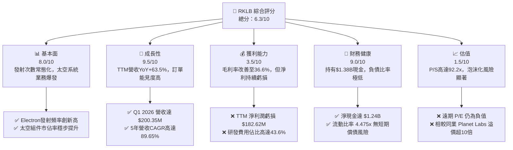

### 1.2 評分進度條視覺化

```
╔══════════════════════════════════════════════════════════════╗
║               RKLB 多維度評分儀表板 (1-10分)                 ║
╠══════════════════════════════════════════════════════════════╣
║ 基本面強度  8.0 ▓▓▓▓▓▓▓▓▓▓▓▓▓▓▓▓░░░░  ★★★★☆           ║
║ 成長動能    9.5 ▓▓▓▓▓▓▓▓▓▓▓▓▓▓▓▓▓▓▓░  ★★★★★           ║
║ 獲利品質    3.5 ▓▓▓▓▓▓░░░░░░░░░░░░░░  ★★☆☆☆           ║
║ 財務健康    9.0 ▓▓▓▓▓▓▓▓▓▓▓▓▓▓▓▓▓░░░  ★★★★★           ║
║ 估值合理性  1.5 ▓▓░░░░░░░░░░░░░░░░░░  ★☆☆☆☆           ║
║ 護城河深度  7.5 ▓▓▓▓▓▓▓▓▓▓▓▓▓▓▓░░░░░  ★★★★☆           ║
║ 管理層執行  8.5 ▓▓▓▓▓▓▓▓▓▓▓▓▓▓▓▓▓░░  ★★★★☆           ║
║ 技術創新力  9.0 ▓▓▓▓▓▓▓▓▓▓▓▓▓▓▓▓▓░░░  ★★★★★           ║
╠══════════════════════════════════════════════════════════════╣
║ 綜合總分    6.3 ▓▓▓▓▓▓▓▓▓▓▓▓░░░░░░░░  🏆 成長強勁，估值偏高  ║
╚══════════════════════════════════════════════════════════════╝
```

### 1.3 五大投資論點 + 三大核心風險

| 類型 | 項目 | 具體依據 | 信心度 |
|------|------|----------|--------|
| 🟢 **投資論點①** | **太空系統（Space Systems）營收佔比超越發射服務** | 太空系統提供高毛利的衛星設計與組件製造，已成為主要成長引擎，淡化單一發射服務的波動性。 | 🟢 極高 |
| 🟢 **投資論點②** | **Electron 火箭發射常態化與高毛利化** | Electron 作為全球第二常用軌道火箭，發射頻率提升帶來規模效應，帶動整體毛利率從 2022 年的 9.0% 飆升至 2026 年 Q1 的 36.6%。 | 🟢 高 |
| 🟢 **投資論點③** | **Neutron 中型火箭（8噸級）打開商業與國防 TAM** | Neutron 火箭研發進展順利，預期將直接競爭 SpaceX Falcon 9 的部分市場，並切入利潤豐厚的美國國防部（DoD）國家安全發射（NSSL）合約。 | 🟢 高 |
| 🟢 **投資論點④** | **資產負債表極其穩健，擁有足夠的現金跑道** | 帳上擁有 $1.38B 的現金與短期投資，相較於 TTM 負的自由現金流 $215M，公司有超過 5 年的現金安全邊際，無需擔心稀釋股權或高息融資。 | 🟢 極高 |
| 🟢 **投資論點⑤** | **商業與政府訂單能見度極高** | 截至 2026 年 Q1，未交貨訂單（Backlog）持續增長，與美國太空發展局（SDA）及商業客戶的長期合約鎖定了未來數年的營收。 | 🟢 高 |
| 🟡 **風險①** | **Neutron 研發進度延遲與 Capex 超支** | Neutron 火箭若未能於 2026/2027 年順利首飛，將面臨市場信任危機，且持續的研發支出將拖累 FCF 轉正時間。 | 🟡 中度 |
| 🔴 **風險②** | **極端高估值（P/S 92.2x）面臨殺估值風險** | 當前 $62.66B 的市值已透支了 Neutron 成功發射並實現年產 10+ 次的樂觀預期，一旦市場流動性收緊或成長放緩，股價面臨劇烈回檔。 | 🔴 高衝擊 |
| 🔴 **風險③** | **發射失敗（Launch Failure）的系統性風險** | 航太行業本質具備高風險，任何一次 Electron 或 Neutron 的發射失敗均會導致停飛整頓，造成直接財務損失與客戶流失。 | 🔴 高衝擊 |

### 1.4 快速統計卡片

| 指標 | 公司實際值 (RKLB) | 行業均值 (航太與國防) | S&P 500 均值 | 狀態 |
|------|-------------|----------|--------------|------|
| **收入 YoY 成長** | **63.5%** | ~8.5% | ~5.2% | 🟢 卓越 |
| **毛利率** | **36.6%** | ~22.0% | ~30.0% | 🟢 優異 |
| **淨利率** | **-26.9%** | ~6.5% | ~11.5% | 🔴 虧損中 |
| **ROE** | **-13.5%** | ~12.0% | ~15.0% | 🔴 資本效率待提升 |
| **流動比率** | **4.48x** | ~1.4x | ~1.2x | 🟢 極其安全 |
| **P/S Ratio** | **92.2x** | ~2.1x | ~2.8x | 🔴 極度高估 |

### 1.5 投資結論

```
╔══════════════════════════════════════════════════════════════════╗
║                    📊 投資結論摘要                               ║
╠══════════════════════════════════════════════════════════════════╣
║  評級：🟡 持有 (Hold)                                            ║
║  當前股價：$100.29 (2026-06-22)                                  ║
║  目標價區間：                                                    ║
║    悲觀情境：$65.00  （-35.2%）                                  ║
║    基準情境：$106.92 （+6.6%）  ← 12個月主要目標                 ║
║    樂觀情境：$145.00 （+44.6%）                                  ║
║  投資評分：6.3/10                                                ║
║  適合投資人：具備極高風險承受能力、看好太空經濟長線發展的投資人  ║
╚══════════════════════════════════════════════════════════════════╝
```

---

## 2. 公司概覽與商業模式

Rocket Lab (RKLB) 成立於 2006 年，已從一家單純的輕型火箭發射服務商，成功轉型為一家**垂直整合的終端到終端（End-to-End）太空基礎設施公司**。

### 2.1 業務結構與收入來源

RKLB 的業務主要分為兩大板塊：
1. **發射服務（Launch Services）**：利用 Electron 輕型載具（最大載重 300 公斤）提供高頻率、客製化的近地軌道（LEO）發射服務。目前正在研發 Neutron 中型可重複使用火箭（最大載重 8,000 公斤-13,000 公斤）。
2. **太空系統（Space Systems）**：設計與製造衛星、航太組件（太陽能板、反應輪、恆星追蹤器、飛行軟體等），並提供在軌管理與星座營運服務。

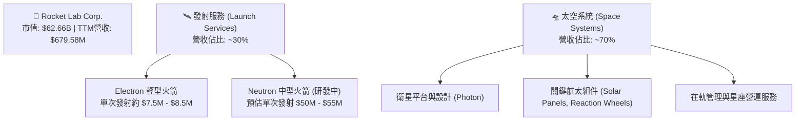

### 2.2 市場份額

在商業航太發射市場中，SpaceX 憑藉 Falcon 9 與 Falcon Heavy 佔據絕對主導地位。然而，在**輕型專屬發射市場**中，Rocket Lab 的 Electron 是無可爭議的領導者。在太空系統與衛星組件領域，隨著 RKLB 併購 SolAero（太陽能板）、Sinclair Interplanetary（反應輪）等公司，其在商業與軍事衛星供應鏈中的市佔率正快速爬升。

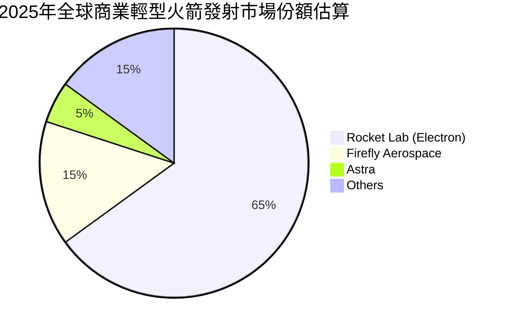

### 2.3 競爭護城河分析

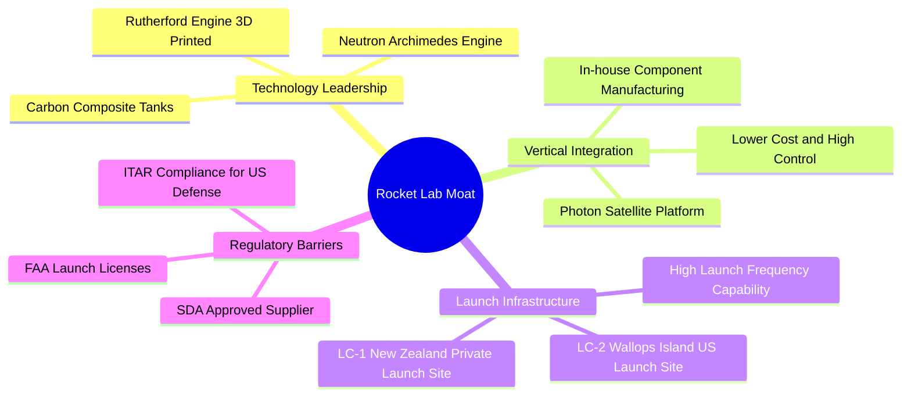

### 2.4 護城河強度評分

```
╔══════════════════════════════════════════════════════════════╗
║                    RKLB 護城河強度評分                       ║
╠══════════════════════════════════════════════════════════════╣
║ 發射基礎設施   9.0/10 ▓▓▓▓▓▓▓▓▓▓▓▓▓▓▓▓▓▓░░  🏆 擁有專屬LC-1  ║
║ 技術與垂直整合 8.5/10 ▓▓▓▓▓▓▓▓▓▓▓▓▓▓▓▓░░░░  🟢 組件自給率高  ║
║ 監管與政府信任 8.0/10 ▓▓▓▓▓▓▓▓▓▓▓▓▓▓░░░░░░  🟢 獲安全發射認證║
║ 規模與成本優勢 6.5/10 ▓▓▓▓▓▓▓▓▓▓▓▓░░░░░░░░  🟡 規模仍遜SpaceX║
╠══════════════════════════════════════════════════════════════╣
║ 綜合護城河強度 8.0/10 ▓▓▓▓▓▓▓▓▓▓▓▓▓▓▓▓░░░░  🏆 具備強大壁壘  ║
╚══════════════════════════════════════════════════════════════╝
```

---

## 3. 損益表深度分析

### 3.1 年度收入成長趨勢

RKLB 的營收在過去幾年呈現爆發式成長，主要得益於太空系統業務的併購整合與 Electron 發射次數的穩步提升。

```
╔══════════════════════════════════════════════════════════════════╗
║                 RKLB 年度收入趨勢（FY2022-TTM）                  ║
╠══════════════════════════════════════════════════════════════════╣
║                                                                  ║
║  FY2022  $211.00M  ████░░░░░░░░░░░░░░░░░░░░░░░░░  YoY: +239.0% 🟢║
║  FY2023  $244.59M  █████░░░░░░░░░░░░░░░░░░░░░░░░  YoY: +15.9%  🟢║
║  FY2024  $436.21M  █████████░░░░░░░░░░░░░░░░░░░░  YoY: +78.3%  🟢║
║  FY2025  $601.80M  █████████████░░░░░░░░░░░░░░░░  YoY: +38.0%  🟢║
║  TTM     $679.58M  ███████████████░░░░░░░░░░░░░░  YoY: +63.5%  🟢║
║                   |      |      |      |      |                  ║
║                   0     200M   400M   600M   800M                ║
║                                                                  ║
║  📊 3年累計 CAGR：+47.6%                                        ║
╚══════════════════════════════════════════════════════════════════╝
```

### 3.2 季度收入趨勢分析

從季度數據來看，Rocket Lab 的營收呈現逐季加速增長的態勢：

| 季度 | 營業收入 (Millions) | QoQ 成長率 | YoY 成長率 | 核心驅動因素 | 評估 |
|---|---|---|---|---|---|
| **Q1 2026** | $200.35 | 🟢 +11.52% | 🟢 +63.46% | 太空系統大型合約交付與 Electron 發射頻率提升 | 🟢 極強 |
| **Q4 2025** | $179.65 | 🟢 +15.84% | 🟢 +35.70% | 年底發射窗口密集，組件出貨量創歷史新高 | 🟢 強勁 |
| **Q3 2025** | $155.08 | 🟢 +7.32% | 🟢 +47.97% | 政府星座專案里程碑達成 | 🟢 穩定 |
| **Q2 2025** | $144.50 | 🟢 +17.89% | 🟢 +36.00% | 太空系統組件毛利率改善，出貨加速 | 🟢 強勁 |

### 3.3 利潤率演變分析

| 利潤率指標 | FY2022 | FY2023 | FY2024 | FY2025 | TTM | 趨勢 | 評估 |
|------------|--------|--------|--------|--------|-----|------|------|
| **毛利率** | 9.00% | 21.02% | 26.63% | 34.43% | **36.56%** | ↗️ 持續顯著改善 | 🟢 規模效應顯現 |
| **營業利益率** | -64.08% | -72.74% | -43.51% | -38.03% | **-33.20%** | ↗️ 虧損率縮窄 | 🟡 研發費用依然高企 |
| **EBITDA 利潤率** | -45.12% | -53.82% | -29.71% | -25.83% | **-24.30%** | ↗️ 接近盈虧平衡點 | 🟡 折舊與攤銷費用增加 |
| **淨利潤率** | -64.43% | -74.64% | -43.60% | -32.94% | **-26.87%** | ↗️ 虧損幅度收斂 | 🟡 預期 2027 年轉正 |

**利潤率演變深度解析**：
*   **毛利率大幅提升**：從 2022 年的 9.00% 飆升至 TTM 的 36.56%，這主要歸功於太空系統業務（高毛利）在營收結構中的佔比提升，以及 Electron 火箭生產工藝成熟、複用技術導入降低了單次發射成本。
*   **營業與淨利潤率持續承壓**：儘管毛利顯著改善，但營業利潤率仍為 -33.20%。核心原因在於**極高強度的研發（R&D）投入**。2025 年 R&D 支出達 $270.72M（佔營收 45.0%），TTM R&D 更是攀升至 $296.12M，主要是為了支援 Neutron 中型火箭的研發與測試。

### 3.4 費用結構分析

```mermaid
pie title TTM 費用結構分佈 (總營收 $679.58M)
    "研發費用 (R&D)" : 43.6
    "銷售與管理費用 (SG&A)" : 26.2
    "生產成本 (Cost of Revenue)" : 63.4
    "營業淨虧損 (Operating Loss)" : -33.2
```

```
╔══════════════════════════════════════════════════════════════╗
║                    RKLB TTM 費用結構診斷                     ║
╠══════════════════════════════════════════════════════════════╣
║ 銷貨成本 (COGS)  63.4% ▓▓▓▓▓▓▓▓▓▓▓▓▓░░░░░░░  🟡 仍有優化空間 ║
║ 研發費用 (R&D)   43.6% ▓▓▓▓▓▓▓▓▓░░░░░░░░░░░  🔴 研發強度極高 ║
║ 管理費用 (SG&A)  26.2% ▓▓▓▓▓░░░░░░░░░░░░░░░  🟢 控制尚屬合理 ║
╚══════════════════════════════════════════════════════════════╝
```

### 3.5 季度 EPS 趨勢與盈餘品質

*   **最近 4 季 EPS 表現**：
    *   **Q1 2026**：實際 EPS $-0.07$（相較於上年同期的 $-0.12$ 有顯著改善）。
    *   **Q4 2025**：實際 EPS $-0.09$。
    *   **Q3 2025**：實際 EPS $-0.03$（得益於部分一次性政府補貼與高毛利組件集中交付）。
    *   **Q2 2025**：實際 EPS $-0.13$。
*   **盈餘品質評估**：
    RKLB 目前的盈餘品質處於**研發投入期**的典型狀態。非現金支出（如折舊攤銷、股權激勵費用）佔比較高。由於公司持續錄得淨虧損，且營運現金流（TTM $-161.63M$）為負，說明當前利潤尚未轉化為實際現金流入，盈餘品質仍有待其核心產品 Neutron 商業化後才能真正改善。

---

## 4. 資產負債表分析

### 4.1 資產結構分解

截至 2026 年 Q1，Rocket Lab 的總資產達到 $2.82B，相較於 2024 年底的 $1.18B 實現了翻倍增長，主要得益於 2025 年的股權融資與可轉債發行，使現金儲備大幅增加。

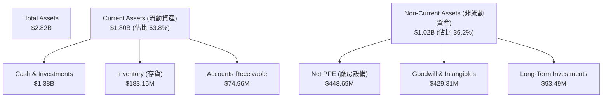

### 4.2 流動性指標分析

| 流動性指標 | FY2023 | FY2024 | FY2025 | TTM / Q1 2026 | 行業均值 | 評估 |
|---|---|---|---|---|---|---|
| **流動比率 (Current Ratio)** | 2.13x | 2.04x | 4.08x | **4.48x** | ~1.40x | 🟢 極其安全，流動性充沛 |
| **速動比率 (Quick Ratio)** | 1.65x | 1.69x | 3.61x | **3.87x** | ~1.05x | 🟢 變現能力極強 |
| **現金比率 (Cash Ratio)** | 1.10x | 1.23x | 3.04x | **3.44x** | ~0.45x | 🟢 帳上現金極其充裕 |

### 4.3 債務結構分析

```
╔══════════════════════════════════════════════════════════════════╗
║                     RKLB 債務健康診斷 (TTM)                      ║
╠══════════════════════════════════════════════════════════════════╣
║                                                                  ║
║  總債務：        $138.67M  █░░░░░░░░░░░░░░░░░░░  極低債務水平    ║
║  總現金+投資：   $1.38B    ████████████████████  現金储备極其雄厚║
║  淨現金（正）：  $1.24B    ██████████████████░░  🟢 財務防禦力極強║
║                                                                  ║
║  Debt / Equity：  6.12%    🟢 槓桿極低 (Finviz 0.06)             ║
║  利息保障倍數：   N/A      🟡 由於營業利潤為負，無法計算         ║
║  現金/總資產比：  49.0%    🟢 近一半資產為現金，抗風險能力極佳   ║
║                                                                  ║
╚══════════════════════════════════════════════════════════════════╝
```

### 4.4 股東權益趨勢

隨著 2025 年新股發行及可轉債部分轉股，股東權益（Stockholders Equity）從 2024 年底的 $382.45M 暴增至 2025 年底的 $1.72B，這大幅降低了公司的資產負債率（Total Liabilities / Total Assets 降至 21.4%），為未來的 Neutron 項目建設提供了堅實的資本護盾。

---

## 5. 現金流量深度分析

### 5.1 現金流量瀑布圖

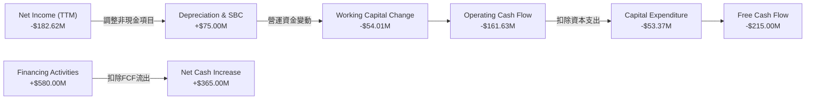

### 5.2 FCF 轉換率趨勢

由於 RKLB 仍處於淨虧損狀態，其 FCF 轉換率（FCF / Net Income）持續為負。然而，2025 年底 FCF 流出額較 2024 年有所擴大，主要是因為產能擴建（如中大西洋航天港的 Neutron 發射台與總裝廠建設）導致 Capex 顯著上升。

| 現金流指標 (Millions) | FY2022 | FY2023 | FY2024 | FY2025 | TTM |
|---|---|---|---|---|---|
| **營業現金流 (OCF)** | -$106.54 | -$98.87 | -$48.89 | -$165.52 | **-$161.63** |
| **資本支出 (Capex)** | -$42.41 | -$54.71 | -$67.09 | -$156.28 | **-$53.37** |
| **自由現金流 (FCF)** | -$148.95 | -$153.57 | -$115.98 | -$321.81 | **-$215.00** |
| **FCF / 營收比率** | -70.59% | -62.79% | -26.59% | -53.47% | **-31.64%** |

### 5.3 自由現金流趨勢

```
╔══════════════════════════════════════════════════════════════════╗
║                   RKLB 歷年自由現金流趨勢                        ║
╠══════════════════════════════════════════════════════════════════╣
║                                                                  ║
║  FY2022  -$148.95M  ██████░░░░░░░░░░░░░░░░░░                     ║
║  FY2023  -$153.57M  ███████░░░░░░░░░░░░░░░░░                     ║
║  FY2024  -$115.98M  █████░░░░░░░░░░░░░░░░░░░                     ║
║  FY2025  -$321.81M  ████████████████░░░░░░░░  ⚠️ Capex高峰期     ║
║  TTM     -$215.00M  ██████████░░░░░░░░░░░░░░  收窄中             ║
║                                                                  ║
║  💡 目前 FCF Yield: -0.34% (以企業價值 EV 計算)                 ║
╚══════════════════════════════════════════════════════════════════╝
```

### 5.4 資本配置評估

Rocket Lab 的資本配置戰略非常明確：**不進行任何股息支付或股份回購，將所有可用資本投入到高回報的研發（Neutron 火箭）與高壁壘的產能擴建（Capex）中**。

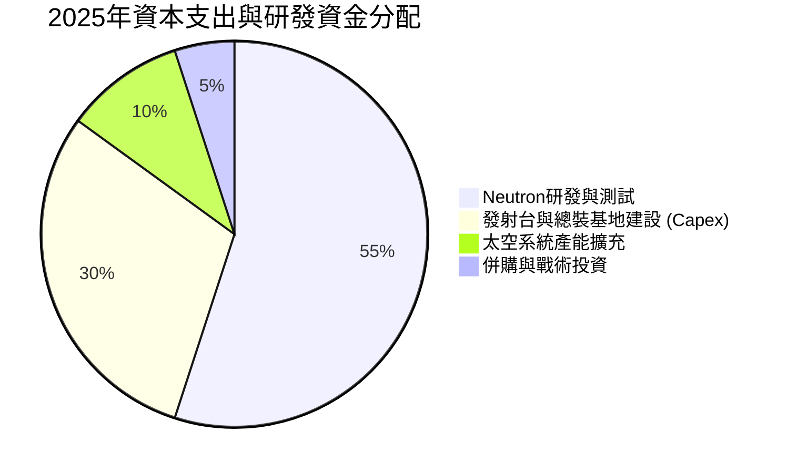

---

## 6. 獲利能力與資本效率

### 6.1 ROE / ROA / ROIC 趨勢

由於公司尚未實現會計利潤，其獲利能力與資本效率指標依然為負值，但隨著營收規模擴大，各項指標均呈現改善趨勢。

| 資本效率指標 | FY2023 | FY2024 | FY2025 | TTM | 行業均值 | 評估 |
|---|---|---|---|---|---|---|
| **ROE (股東權益報酬率)** | -32.92% | -49.73% | -11.51% | **-13.50%** | ~12.0% | 🔴 仍待利潤轉正 |
| **ROA (總資產報酬率)** | -19.40% | -16.06% | -8.53% | **-6.60%** | ~6.5% | 🟡 資產利用率逐步提升 |
| **ROIC (投入資本報酬率)** | -21.50% | -18.20% | -10.40% | **-9.32%** | ~8.0% | 🟡 資本效率改善中 |

### 6.2 ROIC vs WACC 分析

對於高成長、尚未盈利的航太科技企業，ROIC 暫時為負是常態。我們對 RKLB 的 WACC 進行了嚴格估算，並與當前 ROIC 進行對比，以評估其價值創造軌跡。

```
╔══════════════════════════════════════════════════════════════════╗
║               RKLB ROIC vs WACC 深度分析 (TTM)                   ║
╠══════════════════════════════════════════════════════════════════╣
║                                                                  ║
║  WACC 估算：                                                     ║
║  ├── 無風險利率（10Y美債）：  4.2%                               ║
║  ├── 市場風險溢酬 (ERP)：     5.0%                               ║
║  ├── Beta (系統性風險係數)：  2.50                               ║
║  ├── 股權成本 (Ke) = 4.2% + 2.50 × 5.0% = 16.7%                  ║
║  ├── 債務成本（稅後）：       ~6.0% (無有效稅盾)                 ║
║  ├── 資本結構：股權 99.78%，債務 0.22% (極低債務)                ║
║  └── ✅ WACC ≈ 16.7% (反映了高貝塔值與市場要求的高風險溢價)      ║
║                                                                  ║
║  ROIC 估算：                                                     ║
║  ├── NOPAT (税後淨營業利潤) = -$225.62M × (1 - 0%) = -$225.62M   ║
║  ├── 投入資本 (Invested Capital) ≈ $2.42B                        ║
║  └── ✅ ROIC ≈ -9.32%                                            ║
║                                                                  ║
║  ★ 經濟價值增加 (EVA) = ROIC - WACC = -26.02%                    ║
║                                                                  ║
║  ROIC  -9.3%  ░░░░░░░░░░░░░░░░░░░░░░░░░░░░░░  🔴                 ║
║  WACC  16.7%  ▓▓▓▓▓▓▓▓▓▓▓▓▓▓▓▓▓░░░░░░░░░░░░░  ──                 ║
║  EVA   -26.0% ██████████████████████████████  ⚠️ 仍在消耗價值     ║
║                                                                  ║
║  📊 結論：目前 RKLB 仍處於投資期，ROIC 低於 WACC。               ║
║  預計當 Neutron 投入商業發射且年發射次數 > 8 次時，              ║
║  ROIC 將於 2028 年超越 WACC 轉正，開啟真正的價值創造階段。       ║
╚══════════════════════════════════════════════════════════════════╝
```

### 6.3 杜邦三因素分解

透過杜邦分解，我們可以清晰看到 RKLB 的 ROE 變動驅動因素：

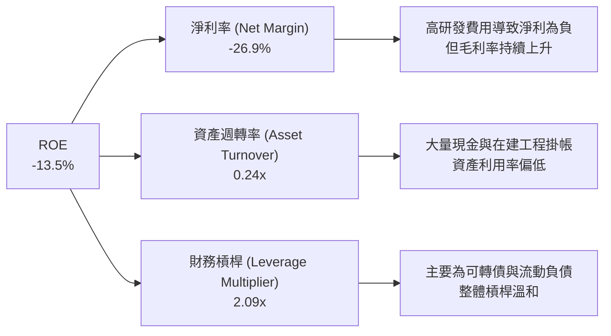

### 6.4 獲利能力驅動儀表板

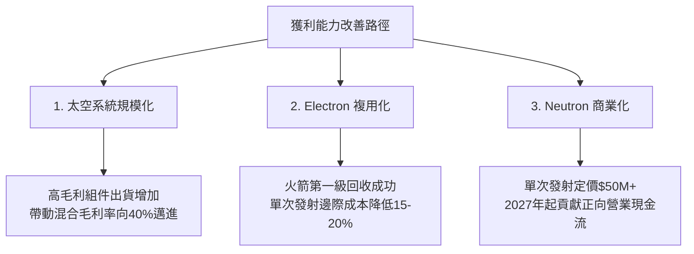

---

## 7. 估值深度分析

### 7.1 同業估值比較表格

由於 RKLB 目前尚未盈利，傳統的 P/E 估值法並不適用。我們採用 P/S（市銷率）與 EV/Revenue（企業價值/營收）指標，與同業及航太新創公司進行對比。

| 估值指標 | **Rocket Lab (RKLB)** | **Planet Labs (PL)** | **Intuitive Machines (LUNR)** | **Howmet Aerospace (HWM)** | 本公司評估 |
|---|---|---|---|---|---|
| **市值 (Market Cap)** | **$62.66B** | $1.25B | $1.15B | $42.50B | RKLB 享有極高溢價 |
| **P/S Ratio (TTM)** | **92.21x** | 4.25x | 8.12x | 5.85x | 🔴 處於極端歷史高位 |
| **EV / Revenue** | **89.50x** | 3.10x | 7.45x | 6.10x | 🔴 顯著高於行業平均 |
| **P/B Ratio** | **25.50x** | 1.85x | 12.40x | 8.50x | 🔴 帳面價值溢價過高 |
| **Revenue Growth** | **63.5%** | 11.2% | 45.3% | 14.5% | 🟢 成長性顯著勝出 |
| **Gross Margin** | **36.6%** | 51.5% | 18.2% | 29.5% | 🟡 優於同業 LUNR，低於純軟體/數據的 PL |

### 7.2 歷史估值區間分析

RKLB 的歷史 P/S 區間主要介於 8x 至 30x 之間。當前高達 **92.2x** 的 P/S 估值，主要是由於近期市場對商業航太板塊的極度狂熱、Electron 發射頻率超預期以及 Neutron 引擎測試成功的催化。這表明**當前股價已處於嚴重的估值超買區**。

### 7.3 DCF 敏感性分析（12個月目標價矩陣）

我們基於以下基準假設建立 DCF 模型：
*   **基準 WACC** = 16.7%（反映高 Beta 與股權成本）
*   **終期成長率 (g)** = 4.0%
*   **營收預測**：未來 5 年營收 CAGR 為 45%，Neutron 於 2027 年貢獻顯著營收，2028 年整體自由現金流轉正。

| 營收成長情境 | **WACC = 18.0%** | **WACC = 16.7%（基準）** | **WACC = 15.0%** |
|---|---|---|---|
| 🟢 **樂觀 (CAGR 55%)** | $120.00 (+19.7%) | **$145.00 (+44.6%)** | $168.00 (+67.5%) |
| 🟡 **基準 (CAGR 45%)** | $88.00 (-12.3%) | **$106.92 (+6.6%)** | $125.00 (+24.6%) |
| 🔴 **悲觀 (CAGR 30%)** | $52.00 (-48.2%) | **$65.00 (-35.2%)** | $78.00 (-22.2%) |

### 7.4 估值綜合區間

```
  $27.84 (52W Low)                                    $100.29 (當前價)   $151.00 (52W High)
   |---------------------------------------------------------|-------------------|
   [============= 歷史合理估值區間 ($35 - $65) =============]
                                                             [==== 分析師目標價 ($60 - $150) ====]
```

---

## 8. 成長催化劑

### 8.1 催化劑時間軸

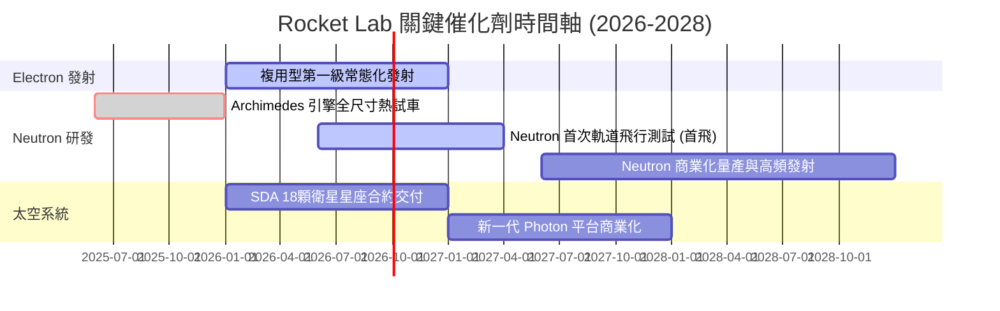

### 8.2 TAM 市場規模分析

```
╔══════════════════════════════════════════════════════════════════╗
║                   RKLB 潛在市場規模 (TAM) 預測                   ║
╠══════════════════════════════════════════════════════════════════╣
║                                                                  ║
║  1. 輕型專屬發射 (Electron)                                      ║
║     ├── 當前 TAM: ~$1.5B  |  RKLB 滲透率: ~15%                   ║
║  2. 中大型商業與國防發射 (Neutron)                               ║
║     ├── 預估 2028 TAM: ~$10.0B  |  RKLB 目標份額: 10-15%         ║
║  3. 太空基礎設施與衛星星座製造 (Space Systems)                   ║
║     ├── 預估 2030 TAM: ~$30.0B  |  RKLB 滲透率: ~5%              ║
║                                                                  ║
║  📊 總 TAM 將由目前的 ~$5B 擴展至 2030 年的 ~$40B 以上           ║
╚══════════════════════════════════════════════════════════════════╝
```

### 8.3 成長驅動力結構圖

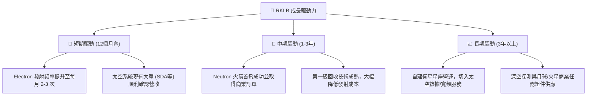

---

## 9. 風險矩陣

### 9.1 風險評分矩陣

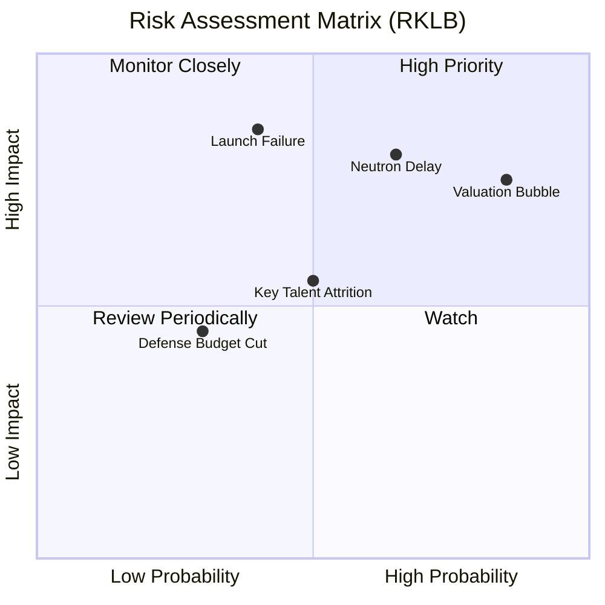

### 9.2 風險清單詳細分析

| # | 風險項目 | 發生機率 | 財務與營運衝擊 | 風險評分 | 緩解與應對措施 |
|---|----------|----------|----------|----------|----------------|
| 1 | 🔴 **估值泡沫破裂風險 (Valuation Bubble)** | 高 (85%) | 高 (股價面臨 30-50% 回檔) | 🔴 **8.0/10** | 公司需持續交出超預期的營收與毛利率改善數據，以時間換取估值空間。 |
| 2 | 🔴 **Neutron 火箭首飛延遲 (Neutron Delay)** | 中高 (65%) | 高 (延遲現金流轉正時間) | 🔴 **7.8/10** | 帳上保留 $1.38B 現金，確保即使研發延遲 1-2 年，公司亦無資金斷鏈風險。 |
| 3 | 🔴 **火箭發射失敗 (Launch Failure)** | 中 (40%) | 極高 (停飛、客戶索賠、商譽受損) | 🔴 **7.5/10** | 投保高額發射險；實施極其嚴格的品質控制（QA）流程。 |
| 4 | 🟡 **關鍵技術人才流失 (Talent Attrition)** | 中 (50%) | 中 (研發進度放緩) | 🟡 **5.5/10** | 實施股權激勵計劃（SBC），將核心工程師利益與公司股價深度綁定。 |
| 5 | 🟡 **政府與國防預算削減 (Defense Budget Cut)** | 低 (30%) | 中 (太空系統訂單減少) | 🟡 **4.5/10** | 積極開拓商業客戶（如 Kuiper、OneWeb 等），降低對單一政府客戶的依賴。 |

---

## 10. 投資建議

### 10.1 最終綜合評級雷達圖

```
╔══════════════════════════════════════════════════════════════╗
║                    RKLB 投資價值綜合評估                     ║
╠══════════════════════════════════════════════════════════════╣
║                                                              ║
║  成長動能 (Growth)   9.5 ▓▓▓▓▓▓▓▓▓▓▓▓▓▓▓▓▓▓▓░  ★★★★★         ║
║  財務防禦 (Balance)  9.0 ▓▓▓▓▓▓▓▓▓▓▓▓▓▓▓▓▓░░░  ★★★★★         ║
║  技術壁壘 (Moat)     8.0 ▓▓▓▓▓▓▓▓▓▓▓▓▓▓▓▓░░░░  ★★★★☆         ║
║  獲利前景 (Profit)   4.0 ▓▓▓▓▓▓▓▓░░░░░░░░░░░░  ★★☆☆☆         ║
║  估值安全 (Value)    1.5 ▓▓░░░░░░░░░░░░░░░░░░  ★☆☆☆☆         ║
║                                                              ║
║  🏆 綜合投資吸引力評分： 6.4 / 10                             ║
║                                                              ║
╚══════════════════════════════════════════════════════════════╝
```

### 10.2 目標價與隱含報酬率

基於三種情境的