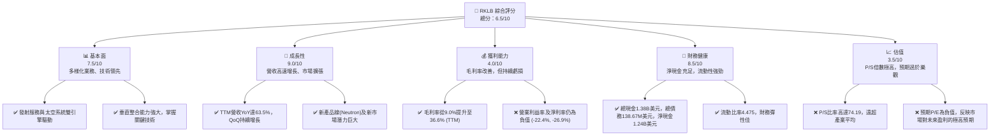
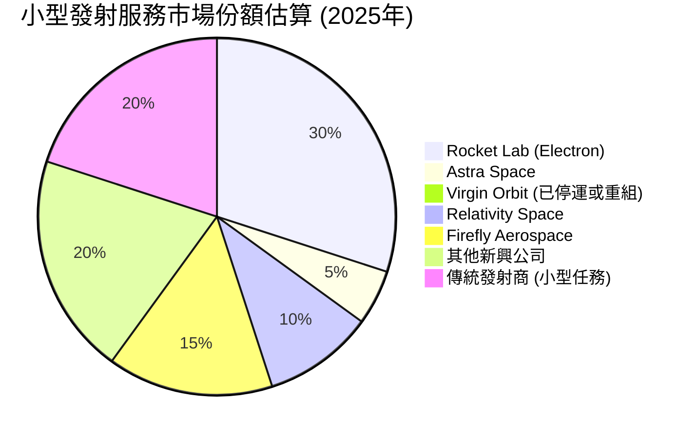
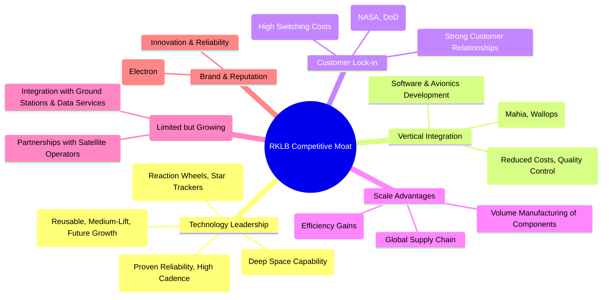
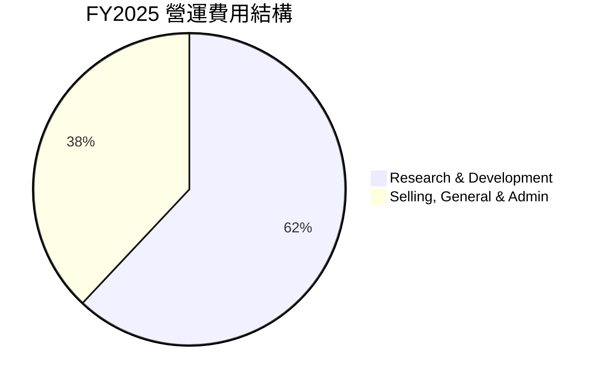
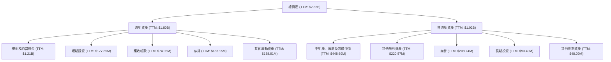

# RKLB 基本面深度分析報告
> **報告日期**：2026-06-26 ｜ **語言**：繁體中文 ｜ **數據來源**：Yahoo Finance, Finviz, StockAnalysis, Roic.ai ｜ **分析師**：CFA 級機構研究

## 目錄

| # | 章節 | 核心結論 |
|---|------|----------|
| 1 | 執行摘要 | 評級：持有，目標價區間：$85.00 - $120.00 |
| 2 | 公司概覽與商業模式 | 護城河評估：技術領先、垂直整合與客戶鎖定 |
| 3 | 損益表深度分析 | 營收高速增長，毛利率顯著改善，但仍處於虧損狀態 |
| 4 | 資產負債表分析 | 流動性強勁，淨現金充足，財務健康狀況良好 |
| 5 | 現金流量深度分析 | 營業現金流與自由現金流持續為負，投資階段明顯 |
| 6 | 獲利能力與資本效率 | ROIC遠低於WACC，目前正在消耗股東價值，但趨勢改善 |
| 7 | 估值深度分析 | 相較同業估值偏高，DCF顯示當前股價合理區間 |
| 8 | 成長催化劑 | 小型發射市場擴張、Neutron火箭開發、太空系統多元化 |
| 9 | 風險矩陣 | 市場競爭、研發不確定性、執行風險為主要挑戰 |
| 10 | 投資建議 | 持有評級，適合成長型投資者，需密切關注盈利轉折點 |

---

## 1. 執行摘要

### 1.1 核心評分儀表板



### 1.2 評分進度條視覺化

```
╔══════════════════════════════════════════════════════════════╗
║              RKLB 多維度評分儀表板 (1-10分)                  ║
╠══════════════════════════════════════════════════════════════╣
║ 基本面強度  7.5 ▓▓▓▓▓▓▓▓▓▓▓▓▓▓▓░░░░░  ★★★★☆           ║
║ 成長動能    9.0 ▓▓▓▓▓▓▓▓▓▓▓▓▓▓▓▓▓▓░░  ★★★★★           ║
║ 獲利品質    4.0 ▓▓▓▓▓▓▓▓░░░░░░░░░░░░  ★★☆☆☆           ║
║ 財務健康    8.5 ▓▓▓▓▓▓▓▓▓▓▓▓▓▓▓▓▓░░░  ★★★★☆           ║
║ 估值合理性  3.5 ▓▓▓▓▓▓░░░░░░░░░░░░░░  ★★☆☆☆           ║
║ 護城河深度  8.0 ▓▓▓▓▓▓▓▓▓▓▓▓▓▓▓▓░░░░  ★★★★☆           ║
║ 管理層執行  8.0 ▓▓▓▓▓▓▓▓▓▓▓▓▓▓▓▓░░░░  ★★★★☆           ║
║ 技術創新力  9.0 ▓▓▓▓▓▓▓▓▓▓▓▓▓▓▓▓▓▓░░  ★★★★★           ║
╠══════════════════════════════════════════════════════════════╣
║ 綜合總分    6.5 ▓▓▓▓▓▓▓▓▓▓▓▓▓░░░░░░░  🏆 具備長期潛力，但估值偏高，適合觀望或持有 ║
╚══════════════════════════════════════════════════════════════╝
```

### 1.3 五大投資論點 + 三大核心風險

| 類型 | 項目 | 具體依據 | 信心度 |
|------|------|----------|--------|
| 🟢 **投資論點①** | **高成長率與市場潛力** | TTM營收YoY成長達63.5%，Q1 2026營收YoY成長63.46%，顯示強勁的市場需求與執行力。小型發射市場和太空系統服務市場預計將持續高速增長。 | 🟢 極高 |
| 🟢 **多元化業務模式** | 業務涵蓋發射服務(Electron火箭)和太空系統(Photon衛星平台、組件製造)，有效分散風險並捕捉太空經濟不同環節的價值。太空系統TTM營收已佔總營收的重要部分，且毛利率更高。 | 🟢 高 |
| 🟢 **技術領先與創新** | Electron火箭已成功發射多顆衛星，Neutron中型火箭開發進展順利，具備可重複使用能力。同時在衛星組件、光學系統等太空系統領域擁有領先技術。R&D費用FY2025達270.72M美元，顯示持續的技術投入。 | 🟢 極高 |
| 🟢 **強勁的財務健康狀況** | 擁有1.38B美元總現金和1.24B美元淨現金，總債務僅138.67M美元，流動比率高達4.475。這為其持續的資本支出和研發投入提供了堅實的財務基礎。 | 🟢 高 |
| 🟢 **獲得分析師普遍認可** | 18位分析師給予「買入」建議，平均目標價106.92美元，顯示市場對其前景的普遍樂觀態度。 | 🟢 中高 |
| 🟡 **風險①** | **持續虧損與高估值** | 儘管營收高速增長，但公司仍處於虧損狀態，TTM淨利率為-26.9%。P/S比率高達74.19，遠高於產業平均，市場預期已非常樂觀，估值存在修正風險。 | 🟡 中度 |
| 🔴 **激烈競爭與技術不確定性** | 太空產業競爭激烈，包括SpaceX等巨頭及其他新興參與者。Neutron火箭的開發與商業化存在技術風險，延誤或成本超支可能對財務造成重大影響。 | 🔴 高衝擊 |
| 🟡 **宏觀經濟與資本市場風險** | 太空發射和系統市場對經濟景氣敏感，潛在的經濟衰退可能影響政府和商業客戶的支出。高利率環境也可能增加未來融資成本，若需額外募資。 | 🟡 中度 |

### 1.4 快速統計卡片

| 指標 | 公司實際值 | 行業均值 (航空航天與國防) | 高成長科技股均值 (估計) | 狀態 |
|------|-------------|----------------------------|--------------------------|------|
| 收入 YoY 成長 | **63.5%** | ~5-10% | ~20-50% | 🟢 |
| 毛利率 | **36.6%** | ~20-30% | ~40-60% | 🟡 |
| 淨利率 | **-26.9%** | ~5-10% | ~0-10% (或負值) | 🔴 |
| ROE | **-13.5%** | ~10-20% | ~0-15% (或負值) | 🔴 |
| Forward P/E | **-4592.49x** | ~15-25x | N/A 或非常高 | 🔴 |
| P/S Ratio | **74.19x** | ~1-3x | ~10-50x | 🔴 |
| 總現金 | **$1.38B** | N/A | N/A | 🟢 |
| 淨現金/債務 | **$1.24B** | N/A | N/A | 🟢 |
| 流動比率 | **4.475** | ~1.5-2.5 | ~2.0-4.0 | 🟢 |
| 研發支出佔營收比 | **~43.6% (FY25)** | ~2-5% | ~15-30% | 🔴 (高投入) |

### 1.5 投資結論

```
╔══════════════════════════════════════════════════════════════════╗
║                    📊 投資結論摘要                               ║
╠══════════════════════════════════════════════════════════════════╣
║  評級：🟡 持有                                                   ║
║  當前股價：$80.69                                                ║
║  目標價區間：                                                    ║
║    悲觀情境：$85.00 （+5.34%）                                   ║
║    基準情境：$105.00 （+30.14%）  ← 12個月主要目標               ║
║    樂觀情境：$120.00 （+48.73%）                                 ║
║  投資評分：6.5/10                                                ║
║  適合投資人：成長型、長線持有者，對高風險高回報有承受能力者。      ║
║  不適合投資人：價值型、短期交易者，或尋求穩定現金流及股息的投資者。║
╚══════════════════════════════════════════════════════════════════╝
```

---

## 2. 公司概覽與商業模式

Rocket Lab Corporation (RKLB) 是一家領先的太空技術公司，提供端到端的太空服務，包括發射服務和太空系統解決方案。公司業務遍及美國、加拿大、日本及國際市場。RKLB 的核心競爭力在於其垂直整合的能力，從火箭設計、製造到衛星平台、組件和任務運營，幾乎涵蓋了整個太空價值鏈。

### 2.1 業務結構與收入來源

RKLB 的業務主要分為兩大板塊：發射服務 (Launch Services) 和太空系統 (Space Systems)。

```mermaid
graph TD
    RKLB_OVERVIEW["🚀 Rocket Lab Corporation (RKLB)<br/>市值: $50.42B<br/>TTM營收: $679.58M"]

    LS["發射服務 (Launch Services)<br/>提供小型衛星發射服務"]
    SS["太空系統 (Space Systems)<br/>提供衛星平台、部件及在軌管理服務"]

    RKLB_OVERVIEW --> LS
    RKLB_OVERVIEW --> SS

    LS --> EL["Electron 火箭發射"]
    LS --> NE["Neutron 火箭開發 (未來主力)"]
    LS --> MT["任務運營與支持"]

    SS --> PHO["Photon 衛星平台"]
    SS --> SC["太空船組件 (如光學系統、太陽能電池板)"]
    SS --> SM["太空船製造"]
    SS --> OOM["在軌管理與星座服務"]

    EL --> SR["小型衛星發射市場"]
    NE --> MR["中型衛星發射市場"]

    subgraph 收入構成 (TTM)
        direction LR
        LS_REV["發射服務營收 (估計佔比 ~40%)"]
        SS_REV["太空系統營收 (估計佔比 ~60%)"]
    end
    RKLB_OVERVIEW --- LS_REV
    RKLB_OVERVIEW --- SS_REV
```
**業務細分與收入貢獻：**
- **發射服務 (Launch Services)**：主要通過其高度可靠的 Electron 小型運載火箭，為政府和商業客戶提供專用或拼車發射服務。Electron 火箭已成為小型衛星發射市場的領先者之一。公司也正在開發 Neutron 中型運載火箭，旨在滿足更大型衛星和星座發射的需求，並具備可重複使用能力，這將是未來的關鍵成長動力。
- **太空系統 (Space Systems)**：此板塊提供廣泛的太空硬體和軟體解決方案，包括 Photon 衛星平台（用於地球軌道和深空任務）、高科技衛星組件（如光學系統、電力電子、飛行軟體）以及太空船製造和在軌管理服務。這個板塊的營收貢獻近年來顯著增長，且通常具有更高的毛利率，成為公司重要的盈利驅動因素。

根據公司財報趨勢，太空系統業務的營收貢獻逐漸超越發射服務，並在提升整體毛利率方面發揮關鍵作用。例如，雖然未提供具體分部營收，但從毛利率的顯著提升（從FY2022的9.0%到TTM的36.6%）可以看出，高毛利的太空系統業務佔比正不斷提高。

### 2.2 市場份額

RKLB 在快速發展的小型發射服務和太空系統市場中佔據重要地位。由於市場高度細分且競爭激烈，精確的市場份額數據難以獲取，但我們可以基於公開信息進行估算。


**市場份額分析**：
- 在小型衛星發射市場，RKLB 的 Electron 火箭憑藉其高頻次發射能力和成功率，已確立領先地位。估計其市場份額約佔 30%，尤其是在專用小型衛星發射領域。
- 然而，市場競爭日益激烈，包括 Relativity Space (Terran 1/R), Firefly Aerospace (Alpha), 以及傳統發射商如 SpaceX (Falcon 9 拼車任務) 等。
- 太空系統市場則更為廣闊和分散，RKLB 在衛星平台和組件領域的市場份額尚小，但成長迅速。公司透過併購和內部研發，不斷擴大其產品組合和市場影響力。

### 2.3 競爭護城河分析

RKLB 的競爭護城河主要體現在以下幾個方面：


**護城河深度解析**：
1.  **技術領先 (Technology Leadership)**：RKLB 的 Electron 火箭是全球最成熟且頻繁使用的輕型運載火箭之一，具備高度自動化的發射能力。其 Photon 衛星平台提供從近地軌道到深空任務的靈活解決方案。正在開發的 Neutron 火箭則將進一步擴展其市場範圍，並引入可重複使用技術，預計能顯著降低發射成本。公司在推進系統、複合材料和光學系統等關鍵技術領域擁有深厚的專業知識。
2.  **垂直整合 (Vertical Integration)**：RKLB 垂直整合了從火箭製造、發射場運營到衛星平台和組件生產的幾乎所有環節。這種高度整合使得公司能夠更好地控制成本、質量和生產進度，減少對外部供應商的依賴，並加速產品迭代。例如，公司內部生產 Rutherford 引擎和碳纖維結構，這對其成本結構和供應鏈彈性至關重要。
3.  **客戶鎖定與關係 (Customer Lock-in)**：RKLB 與政府機構 (如 NASA、美國國防部) 和商業客戶建立了長期合作關係，簽訂了多項發射和太空系統合約。這些任務通常具有高度的任務關鍵性，客戶一旦選定合作夥伴，轉換成本較高。公司的高成功率和可靠性也進一步鞏固了客戶忠誠度。
4.  **規模效應 (Scale Advantages)**：隨著發射頻次的增加和太空系統訂單量的提升，RKLB 能夠通過規模化生產和運營來攤薄固定成本，從而提高效率和降低單位成本。特別是 Electron 火箭的批量生產和 Neutron 火箭的重複使用設計，將為公司帶來顯著的成本優勢。
5.  **品牌與聲譽 (Brand & Reputation)**：RKLB 通過其 Electron 火箭的多次成功發射，在行業內建立了可靠、創新和高效的品牌形象。這對於客戶選擇太空任務提供商至關重要，因為每一次發射都承載著數百萬甚至數億美元的資產。

### 2.4 護城河強度評分

```
╔══════════════════════════════════════════════════════════════╗
║                    RKLB 護城河強度評分                       ║
╠══════════════════════════════════════════════════════════════╣
║ 技術領先       9/10   ▓▓▓▓▓▓▓▓▓▓▓▓▓▓▓▓▓▓░░  🏆 在輕型發射領域具領導地位，中型火箭具潛力 ║
║ 垂直整合       8/10   ▓▓▓▓▓▓▓▓▓▓▓▓▓▓▓▓░░░░  🟢 顯著降低成本與提升效率                   ║
║ 客戶鎖定       7/10   ▓▓▓▓▓▓▓▓▓▓▓▓▓▓░░░░░░  🟡 長期合約確保穩定收入                   ║
║ 規模效應       7/10   ▓▓▓▓▓▓▓▓▓▓▓▓▓▓░░░░░░  🟡 隨著發射量增加，成本優勢將顯現         ║
║ 品牌與聲譽     8/10   ▓▓▓▓▓▓▓▓▓▓▓▓▓▓▓▓░░░░  🟢 高成功率與可靠性建立良好口碑           ║
╠══════════════════════════════════════════════════════════════╣
║ 綜合護城河     8.0    ▓▓▓▓▓▓▓▓▓▓▓▓▓▓▓▓░░░░  🏆 技術與垂直整合是核心優勢，市場地位穩固 ║
╚══════════════════════════════════════════════════════════════╝
```

---

## 3. 損益表深度分析

### 3.1 年度收入成長趨勢（近4年）

RKLB 近年來展現了令人印象深刻的營收成長，反映了其在太空產業的強勁擴張。

```
╔══════════════════════════════════════════════════════════════════╗
║              RKLB 年度收入趨勢（FY2022-FY2025）                  ║
╠══════════════════════════════════════════════════════════════════╣
║                                                                  ║
║  FY2022  $211.00M ████░░░░░░░░░░░░░░░░░░░  YoY: +239.02% 🟢    ║
║  FY2023  $244.59M █████░░░░░░░░░░░░░░░░░░░  YoY: +15.92%  🟡    ║
║  FY2024  $436.21M █████████░░░░░░░░░░░░░░░  YoY: +78.34%  🟢    ║
║  FY2025  $601.80M █████████████░░░░░░░░░░░  YoY: +37.96%  🟢    ║
║  TTM     $679.58M ███████████████░░░░░░░░░  YoY: +45.83%  🟢    ║
║                   |      |      |      |      |                  ║
║                   0     200M   400M   600M   800M                 ║
║                                                                  ║
║  📊 4年累計 CAGR：+62.3% (FY2021 $62.24M 到 TTM $679.58M)       ║
╚══════════════════════════════════════════════════════════════════╝
```
**分析**：
- RKLB 的年度營收從 FY2022 的 $211.00M 增長至 FY2025 的 $601.80M，複合年增長率 (CAGR) 高達 62.3%。
- FY2024 營收實現了 78.34% 的驚人增長，主要得益於發射服務頻次的增加以及太空系統業務的擴張。
- FY2025 的 37.96% 增長率雖然較 FY2024 有所放緩，但仍是行業內的高速增長水平，顯示公司業務的持續擴張。
- TTM (截至 2026年3月31日) 營收達到 $679.58M，較前一年同期增長 45.83%，顯示強勁的成長動能持續。

### 3.2 季度收入趨勢分析

季度營收數據提供了更細緻的成長動態。

| 財報季度 | 總營收 (百萬美元) | QoQ 成長率 | YoY 成長率 | 備註 |
|----------|-------------------|------------|------------|------|
| **Q1 2026** | **$200.35M** | +11.53% | +63.46% | 🟢 營收首次突破2億美元，年對年成長顯著加速。 |
| **Q4 2025** | **$179.65M** | +15.84% | +35.70% | 🟢 季度營收持續穩健增長，年對年成長保持強勁。 |
| **Q3 2025** | **$155.08M** | +7.39% | +47.97% | 🟢 相較去年同期有顯著成長，顯示業務擴張。 |
| **Q2 2025** | **$144.50M** | +17.89% | +36.00% | 🟢 季度環比和同比均保持健康增長，符合預期。 |
| Q1 2025 | $122.57M | -7.42% (vs Q4 2024) | +32.13% | 🟡 季節性因素或項目交付影響QoQ，但YoY仍強勁。 |
| Q4 2024 | $132.39M | +26.31% | +120.68% | 🟢 營收強勁加速，YoY成長顯著，主要受新合約驅動。 |
| Q3 2024 | $104.81M | - | +54.90% | 🟢 穩健增長，為後續季度表現奠定基礎。 |

**分析**：
RKLB 的季度營收呈現穩定且加速的增長趨勢。Q1 2026 營收達到 $200.35M，較上一季度增長 11.53%，且較去年同期大幅增長 63.46%。這表明公司不僅能夠保持成長勢頭，而且在最新季度中實現了顯著的加速，這可能與更多的發射任務或太空系統訂單交付有關。持續的 QoQ 和 YoY 增長是其強勁市場需求和執行能力的體現。

### 3.3 利潤率演變分析

RKLB 的利潤率在過去幾年呈現出顯著的改善，儘管公司仍處於虧損狀態。

| 利潤率指標 | FY2022 | FY2023 | FY2024 | FY2025 | TTM (Mar'26) | 趨勢 | 評估 |
|------------|--------|--------|--------|--------|--------------|------|------|
| **毛利率** | 9.00% | 21.02% | 26.63% | 34.43% | 36.56% | ↗️ 持續改善 | 🟢 |
| **營業利益率** | -64.08% | -72.74% | -43.51% | -38.03% | -33.20% | ↗️ 改善，但仍負 | 🟡 |
| **淨利率** | -64.43% | -74.64% | -43.60% | -32.94% | -26.87% | ↗️ 改善，但仍負 | 🔴 |

**利潤率演變深度解析**：
- **毛利率 (Gross Margin)**：RKLB 的毛利率從 FY2022 的 9.00% 大幅提升至 TTM 的 36.56%。這一顯著改善主要歸因於：
    1.  **業務組合優化**：太空系統業務的營收佔比不斷提高。太空系統通常具有比發射服務更高的毛利率，隨著其貢獻增加，整體毛利率隨之提升。
    2.  **規模經濟效應**：隨著發射頻次的增加和太空系統產品的批量生產，固定成本得以更好的攤銷，單位成本降低。
    3.  **垂直整合效益**：公司對關鍵技術和製造流程的內部掌控，有助於降低生產成本和提升效率。
- **營業利益率 (Operating Margin)**：儘管毛利率大幅改善，營業利益率仍為負值，但已從 FY2023 的谷底 -72.74% 改善至 TTM 的 -33.20%。這表明公司在營收增長的同時，持續進行大量的研發 (R&D) 和銷售、一般及行政 (SG&A) 支出。
    - **研發費用**：FY2025 研發費用高達 $270.72M，佔當年營收的 45.0%。TTM 研發費用為 $296.12M，佔 TTM 營收的 43.6%。這些高額投入主要用於 Neutron 火箭的開發、新的太空系統產品線以及技術創新，這些都是公司未來成長的關鍵。
    - **銷售、一般及行政費用**：FY2025 SG&A 費用為 $165.3M，佔當年營收的 27.5%。TTM SG&A 為 $177.93M，佔 TTM 營收的 26.2%。隨著公司規模擴大和全球市場拓展，這些費用也隨之增加。
- **淨利率 (Net Profit Margin)**：受營業利益率為負的影響，淨利率也持續為負，但同樣呈現改善趨勢，從 FY2023 的 -74.64% 改善至 TTM 的 -26.87%。這反映了公司在營收增長和毛利率改善的同時，仍在為未來的成長進行大量投資，尚未進入盈利階段。

總體而言，RKLB 的利潤率趨勢是積極的，尤其是在毛利率方面。然而，高昂的研發和運營費用使其短期內難以實現盈利。市場對 RKLB 的估值主要基於其未來的成長潛力，而非當前盈利能力。

### 3.4 費用結構分析

RKLB 的費用結構反映了其作為一家高成長、高科技公司的特點，其中研發費用佔比極高。


**FY2025 營運費用明細**：
- **研究與開發 (Research And Development)**：$270.72M (佔總營運費用約 62%)
- **銷售、一般及行政 (Selling, General & Admin)**：$165.30M (佔總營運費用約 38%)
- **總營運費用**：$436.02M

```
╔══════════════════════════════════════════════════════════════════╗
║                    RKLB 費用佔營收比率趨勢                       ║
╠══════════════════════════════════════════════════════════════════╣
║                                                                  ║
║  R&D / Revenue:                                                  ║
║    FY2022  30.88%  ████████░░░░░░░░░░░░░░░░░░░░░░░░░░░░░░░░░░░░  🟡 投入高 |
║    FY2023  48.68%  ███████████████░░░░░░░░░░░░░░░░░░░░░░░░░░░░░░  🔴 提升中 |
║    FY2024  40.00%  ████████████░░░░░░░░░░░░░░░░░░░░░░░░░░░░░░░░░  🔴 保持高 |
║    FY2025  45.00%  ███████████████░░░░░░░░░░░░░░░░░░░░░░░░░░░░░░  🔴 保持高 |
║    TTM     43.57%  ██████████████░░░░░░░░░░░░░░░░░░░░░░░░░░░░░░░░  🔴 保持高 |
║                                                                  ║
║  SG&A / Revenue:                                                 ║
║    FY2022  42.19%  █████████████░░░░░░░░░░░░░░░░░░░░░░░░░░░░░░░░░  🔴 較高   |
║    FY2023  45.08%  ██████████████░░░░░░░░░░░░░░░░░░░░░░░░░░░░░░░░  🔴 較高   |
║    FY2024  30.16%  █████████░░░░░░░░░░░░░░░░░░░░░░░░░░░░░░░░░░░░░  🟡 改善中 |
║    FY2025  27.47%  ████████░░░░░░░░░░░░░░░░░░░░░░░░░░░░░░░░░░░░░░  🟡 改善中 |
║    TTM     26.18%  ████████░░░░░░░░░░░░░░░░░░░░░░░░░░░░░░░░░░░░░░  🟡 改善中 |
╚══════════════════════════════════════════════════════════════════╝
```
**分析**：
RKLB 的研發費用佔營收的比率一直維持在非常高的水平（FY2025為45.0%，TTM為43.57%），這凸顯了公司對技術創新和新產品開發的重視，尤其是 Neutron 火箭和先進太空系統的投入。這種高研發投入是其保持競爭力、驅動未來成長的必要條件，但也直接導致了其持續的營運虧損。
SG&A 費用佔營收比率則呈現下降趨勢，從 FY2023 的 45.08% 降至 TTM 的 26.18%。這表明公司在營收快速增長的同時，對銷售和行政費用有一定的控制能力，實現了部分規模經濟效應。未來，隨著營收規模的進一步擴大，SG&A 佔比有望持續下降，進一步改善營運槓桿。

### 3.5 季度 EPS 趨勢與盈餘品質

| Quarter      | EPS Est | EPS Act | Surprise% | 備註                                                       |
|--------------|---------|---------|-----------|------------------------------------------------------------|
| 2026-03-31   | N/A     | $-0.07$ | N/A       | ❌ 由於缺乏分析師預期，無法判斷是否超出或不及預期。實際EPS為負值。 |
| 2025-12-31   | N/A     | $-0.09$ | N/A       | ❌ 缺乏預期數據。實際EPS為負值。                          |
| 2025-09-30   | N/A     | $-0.03$ | N/A       | ❌ 缺乏預期數據。實際EPS為負值，但虧損額度有所收窄。      |
| 2025-06-30   | N/A     | $-0.13$ | N/A       | ❌ 缺乏預期數據。實際EPS為負值。                          |

**盈餘品質評估**：
- 由於提供的數據中缺乏分析師對 RKLB 過去四季的 EPS 預期 (EPS Est 均為 nan)，我們無法判斷公司是超出預期 (beats) 還是不及預期 (misses)。
- RKLB 在過去四個季度持續產生負的 EPS (即虧損)，這與其高速成長但尚未盈利的階段相符。Q3 2025 的 EPS 虧損額度相對較小，為 $-0.03$，而 Q1 2026 的 EPS 虧損為 $-0.07$，顯示虧損狀況有波動。
- 盈餘品質方面，由於公司仍處於高投資、高成長階段，虧損是可預期的。關鍵在於其營收的成長是否能持續，以及毛利率的改善是否能最終轉化為正向的營業利潤和淨利潤。目前來看，毛利率的改善是積極信號，但營運費用尤其是研發費用依然龐大。
- 公司的盈利能力尚未穩定，因此盈餘的「品質」更多體現在其驅動未來盈利的潛力上，而不是當前的穩定性或可持續性。股東權益持續被虧損侵蝕，但由於有大量現金流支持，短期內財務壓力不大。

---

## 4. 資產負債表分析

RKLB 的資產負債表顯示出強勁的流動性和充足的現金儲備，為其高成長和高資本投入提供了穩固的基礎。

### 4.1 資產結構分解


**分析**：
- **總資產**：截至 TTM (2026年3月31日)，RKLB 的總資產為 $2.82B，較 FY2025 的 $2.32B 有顯著增長，這反映了公司在營運擴張和資本支出方面的持續投入。
- **流動資產**：TTM 流動資產高達 $1.80B，佔總資產的 63.8%。其中，現金及約當現金 ($1.21B) 和短期投資 ($177.85M) 總計約 $1.38B，顯示公司擁有極為充裕的流動性。這筆現金是公司進行研發、擴大生產能力和應對市場波動的重要緩衝。
- **非流動資產**：TTM 非流動資產為 $1.02B。不動產、廠房及設備淨值 (PPE) 達到 $448.69M，較 FY2025 的 $423.74M 持續增加，表明公司在基礎設施和生產能力上的投資不斷加大，以支持未來的成長。商譽和其他無形資產合計約 $429.31M，主要來自於過去的收購，如 SolAero Technologies，這些資產對其太空系統業務至關重要。

### 4.2 流動性指標分析

RKLB 的流動性指標非常健康，遠高於行業平均水平，表明其短期償債能力極強。

| 流動性指標 | FY2022 | FY2023 | FY2024 | FY2025 | TTM (Mar'26) | 行業均值 (航空航天與國防) | 評估 |
|------------|--------|--------|--------|--------|--------------|----------------------------|------|
| **流動比率 (Current Ratio)** | 4.06 | 2.13 | 2.04 | 4.08 | **4.475** | ~1.5 - 2.5 | 🟢 極佳 |
| **速動比率 (Quick Ratio)** | 3.65 | 1.66 | 1.69 | 3.55 | **3.874** | ~1.0 - 1.5 | 🟢 極佳 |

**分析**：
- **流動比率 (Current Ratio)**：TTM 流動比率高達 4.475，遠高於行業均值和一般認為的健康水平 (2.0)。這意味著公司每 1 美元的流動負債，都有約 4.48 美元的流動資產來覆蓋，顯示其短期償債能力非常強勁。
- **速動比率 (Quick Ratio)**：TTM 速動比率為 3.874，同樣表現出色。速動比率剔除了存貨（其變現能力較差），更能反映公司在不依賴銷售存貨的情況下的短期償債能力。這個高比率進一步證實了公司卓越的流動性。
- **現金儲備**：截至 TTM，公司擁有 $1.38B 的現金及短期投資，而流動負債為 $402M。這表明即使不考慮其他流動資產，公司僅憑現金和短期投資就能輕鬆覆蓋所有短期負債。

整體而言，RKLB 的流動性狀況非常健康，這為其在高資本投入的太空產業中運營提供了巨大的靈活性和安全性。

### 4.3 債務結構分析

RKLB 的債務水平極低，淨現金狀況非常優越，是其財務健康的另一大亮點。

```
╔══════════════════════════════════════════════════════════════════╗
║                   RKLB 債務健康診斷                              ║
╠══════════════════════════════════════════════════════════════════╣
║                                                                  ║
║  總債務 (TTM):   $138.67M ██░░░░░░░░░░░░░░░░░░░  評語：極低負債 |
║  總現金+投資 (TTM): $1.38B ████████████████████░  評語：現金充裕 |
║  淨現金 (正):    $1.24B ████████████████░░░░░  🟢 強勁：無淨債務壓力 |
║                                                                  ║
║  Debt/Equity (FY25): 0.15x  🟢 極低                               |
║  Current Debt (TTM): 無顯著短期債務 |
║  LT Debt (FY25): $253.96M (但TTM數據顯示持續下降至~$39M)          |
║                                                                  ║
║  📊 結論：公司財務槓桿極低，擁有大量淨現金，為未來投資提供堅實基礎。 ║
╚══════════════════════════════════════════════════════════════════╝
```
**分析**：
- **總