# RKLB 綜合股票評估報告

> **報告日期**：2026-02-28 ｜ **語言**：繁體中文 ｜ **數據來源**：Yahoo Finance
> **分析師**：頂級美股投資評估系統 v2.0 ｜ **股票代碼**：RKLB（Rocket Lab Corporation）

---

## 目錄

| # | 章節 | 重點 |
|---|------|------|
| 1 | 評估總覽 | 雷達圖、八維度評分、投資結論 |
| 2 | 八維度評分矩陣 | 詳細評分表、風險報酬定位 |
| 3 | 業務品質與護城河 | 商業模式、護城河評估 |
| 4 | 財務健康全面評估 | 財務儀表板、各項比率分析 |
| 5 | 成長性評估 | CAGR、催化劑、成長軌跡 |
| 6 | 估值合理性 & 同業比較 | 多重估值法、競爭對手比較 |
| 7 | 資本配置與管理層評估 | ROIC vs WACC、資本效率 |
| 8 | 風險評估 | 風險熱圖、下行情境 |
| 9 | 催化劑與觸發因素 | 時間軸、正面觸發因素 |
| 10 | 投資建議 | 最終評級、目標價、適配度 |

---

## 1. 評估總覽

### 🎯 ASCII 雷達圖（八維度評分視覺化）

```
                    成長性 (8.5)
                      ▲
                  ★ ★ ★ ★ ☆
                 /    10    \
   管理品質    /    8  6    \    獲利能力
    (6.5)   /  4            4  \   (3.5)
    ★★★☆☆ ◄──────────────────────► ★★☆☆☆
           \  4            4  /
            \    6      2  /
   動能       \    8        /    財務健康
   (7.5)       \  10      /     (6.0)
   ★★★★☆        ▼        ★★★☆☆
              競爭優勢
               (7.0)
              ★★★★☆

       風險 (4.5) ──────────── 估值 (2.5)
        ★★☆☆☆                  ★☆☆☆☆

  ┌─────────────────────────────────────────────┐
  │  維度       得分  圖示                         │
  │  成長性      8.5  ████████████████░░  85%    │
  │  獲利能力    3.5  ███████░░░░░░░░░░░  35%    │
  │  財務健康    6.0  ████████████░░░░░░  60%    │
  │  估值        2.5  █████░░░░░░░░░░░░░  25%    │
  │  競爭優勢    7.0  ██████████████░░░░  70%    │
  │  管理品質    6.5  █████████████░░░░░  65%    │
  │  動能        7.5  ███████████████░░░  75%    │
  │  風險        4.5  █████████░░░░░░░░░  45%    │
  │  ─────────────────────────────────────────  │
  │  加權總分    5.75 / 10                        │
  └─────────────────────────────────────────────┘
```

---

### 📊 八維度評分詳細說明

#### Unicode 評分條視覺化（▓░ 滿分10分）

```
成長性    [▓▓▓▓▓▓▓▓▓▓▓▓▓▓▓▓▓░░░]  8.5/10  🟢
獲利能力  [▓▓▓▓▓▓▓░░░░░░░░░░░░░]  3.5/10  🔴
財務健康  [▓▓▓▓▓▓▓▓▓▓▓▓░░░░░░░░]  6.0/10  🟡
估值      [▓▓▓▓▓░░░░░░░░░░░░░░░]  2.5/10  🔴
競爭優勢  [▓▓▓▓▓▓▓▓▓▓▓▓▓▓░░░░░░]  7.0/10  🟢
管理品質  [▓▓▓▓▓▓▓▓▓▓▓▓▓░░░░░░░]  6.5/10  🟡
動能      [▓▓▓▓▓▓▓▓▓▓▓▓▓▓▓░░░░░]  7.5/10  🟢
風險      [▓▓▓▓▓▓▓▓▓░░░░░░░░░░░]  4.5/10  🔴
```

> **評分說明**：風險維度為「風險管理能力」而非「風險高低」，分數越高代表風險越可控。

---

### 🏁 投資結論

```
╔═══════════════════════════════════════════════════════════╗
║                                                           ║
║   投資評級：⭐ 觀望偏買入（Speculative Buy）               ║
║                                                           ║
║   當前價格：$69.10                                         ║
║   目標價格：$85.00（基準情境）                              ║
║   潛在報酬：+23.0%（12個月）                               ║
║   建議倉位：投機性倉位（總資產 ≤ 3-5%）                    ║
║                                                           ║
║   評級理由：RKLB 是商業航太領域的稀缺資產，具備端到端         ║
║   垂直整合能力。但當前估值（P/S 61x）已充分反映樂觀預期，    ║
║   建議投資人分批建倉，並嚴格設定止損。                       ║
╚═══════════════════════════════════════════════════════════╝
```

---

## 2. 八維度評分矩陣

### 📋 評分詳細表格

| 維度 | 評分 | 評分依據 | 趨勢 | 燈號 |
|------|------|----------|------|------|
| **成長性** | **8.5/10** | YoY 收入成長 35.7%，TTM 收入 $601.8M；Neutron 火箭啟動將開拓更大市場；政府合約積壓持續擴大 | ↑ 上升 | 🟢 |
| **獲利能力** | **3.5/10** | 毛利率 34.4% 尚可但仍虧損；營業利益率 -28.4%；持續燒錢，FCF -$330M；未有獲利時間表 | ↔ 持平 | 🔴 |
| **財務健康** | **6.0/10** | 現金 $1.02B 充裕，流動比 4.08x，短期償債能力強；但 D/E 14.7x 偏高，FCF 持續為負 | ↔ 持平 | 🟡 |
| **估值** | **2.5/10** | P/S 61x、EV/Rev 67x 極度昂貴；Forward P/E 493x；FCF Yield -0.9%；任何成長放緩均將觸發大幅修正 | ↓ 警示 | 🔴 |
| **競爭優勢** | **7.0/10** | 全球唯一私人端到端太空公司；Electron 成熟平台；太空系統業務高毛利；技術壁壘高 | ↑ 上升 | 🟢 |
| **管理品質** | **6.5/10** | Peter Beck 創辦人兼 CEO，技術願景清晰；資本配置積極進取但燒錢速度快；執行記錄良好 | ↑ 改善 | 🟡 |
| **動能** | **7.5/10** | 24個月漲幅超 1400%；機構持倉 59.4%；分析師多數評 Buy；Morgan Stanley、B of A 最新升評 | ↑ 強勁 | 🟢 |
| **風險** | **4.5/10** | 估值泡沫化風險極高；執行風險（Neutron 延誤）；競爭加劇（SpaceX）；地緣政治敏感行業 | ↓ 惡化 | 🔴 |

---

### 🎯 Mermaid 風險/報酬定位圖

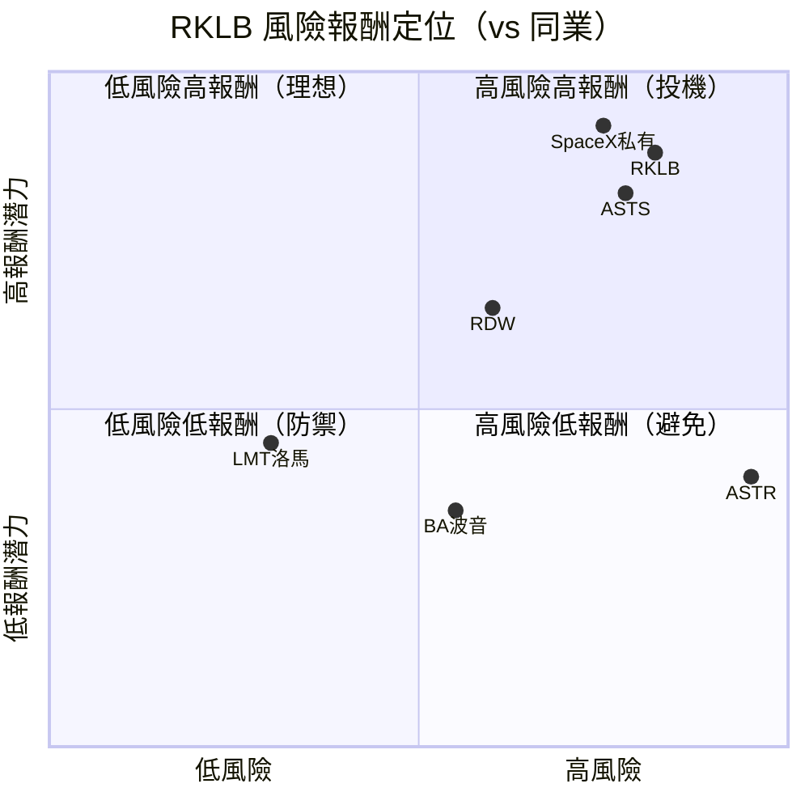

---

### 🔗 與同業整體比較

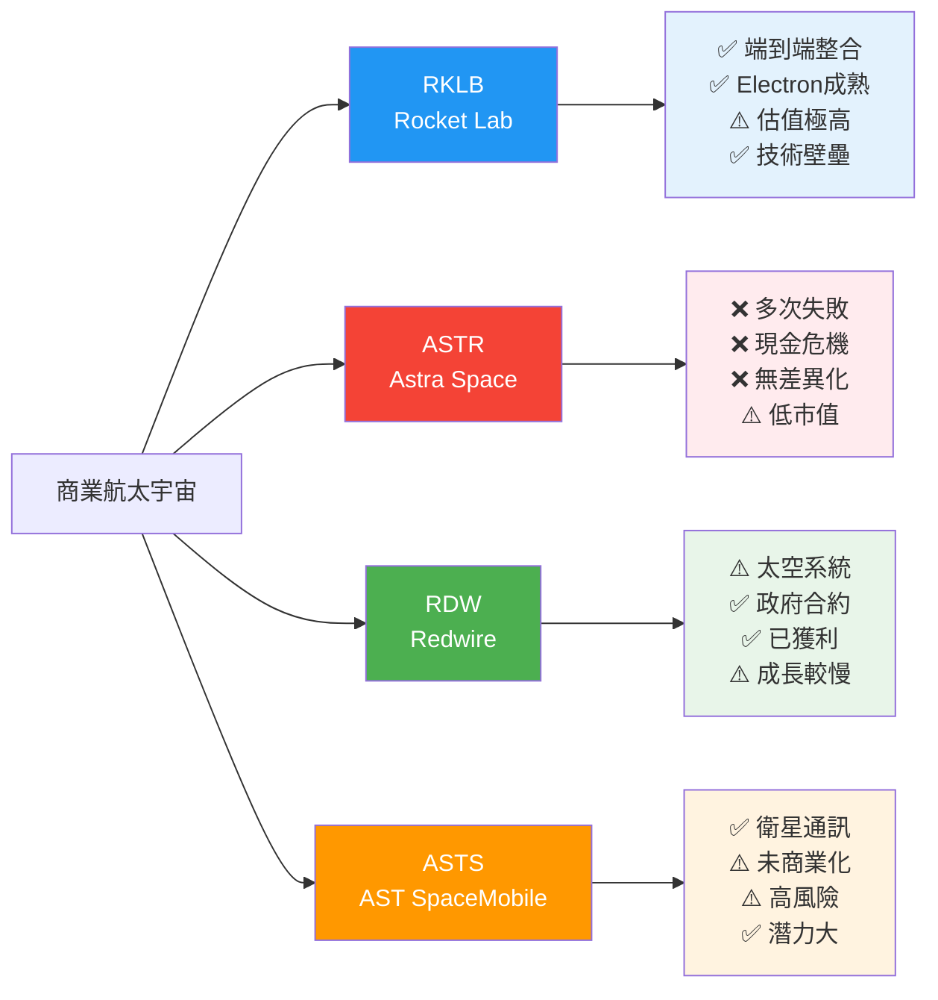

---

## 3. 業務品質與護城河

### 🏗️ 商業模式可持續性評估

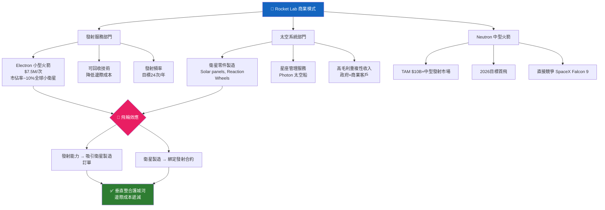

---

### 🏰 護城河評估

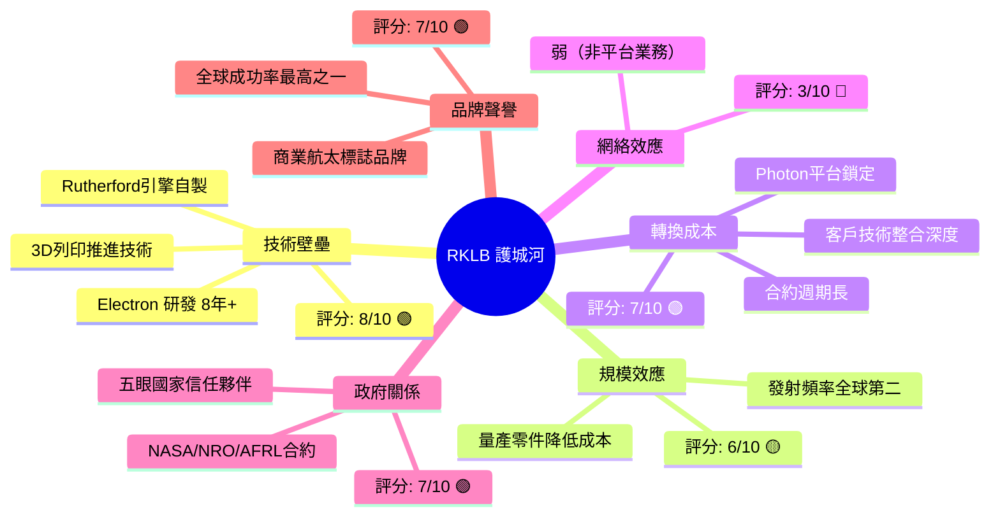

---

### 📊 護城河強度 Unicode 條形圖

```
護城河強度評估（滿分 10 分）
━━━━━━━━━━━━━━━━━━━━━━━━━━━━━━━━━━━━━━━━
技術壁壘  [▓▓▓▓▓▓▓▓▓▓▓▓▓▓▓▓░░░░]  8.0/10  🟢 強
規模效應  [▓▓▓▓▓▓▓▓▓▓▓▓░░░░░░░░]  6.0/10  🟡 中
轉換成本  [▓▓▓▓▓▓▓▓▓▓▓▓▓▓░░░░░░]  7.0/10  🟢 中強
網絡效應  [▓▓▓▓▓▓░░░░░░░░░░░░░░]  3.0/10  🔴 弱
政府關係  [▓▓▓▓▓▓▓▓▓▓▓▓▓▓░░░░░░]  7.0/10  🟢 中強
品牌聲譽  [▓▓▓▓▓▓▓▓▓▓▓▓▓▓░░░░░░]  7.0/10  🟢 中強
━━━━━━━━━━━━━━━━━━━━━━━━━━━━━━━━━━━━━━━━
綜合護城河 [▓▓▓▓▓▓▓▓▓▓▓▓▓░░░░░░░]  6.5/10  🟡 中等偏強
━━━━━━━━━━━━━━━━━━━━━━━━━━━━━━━━━━━━━━━━
```

---

### 🌍 市場地位分析

| 指標 | 數據 | 說明 |
|------|------|------|
| **全球小衛星發射 TAM** | ~$20B（2030E） | 含頻率增長 |
| **太空系統 TAM** | ~$50B（2030E） | 零件+整星製造 |
| **Neutron 中型 TAM** | ~$10B（2030E） | 新進入市場 |
| **Electron 市佔率** | ~8-12%（小衛星） | 全球第二，僅次SpaceX |
| **太空系統市佔率** | ~3-5% | 快速提升中 |
| **行業地位** | 私人航太 No.2 | 公開上市最大純商業航太 |

---

## 4. 財務健康全面評估

### 📈 財務儀表板

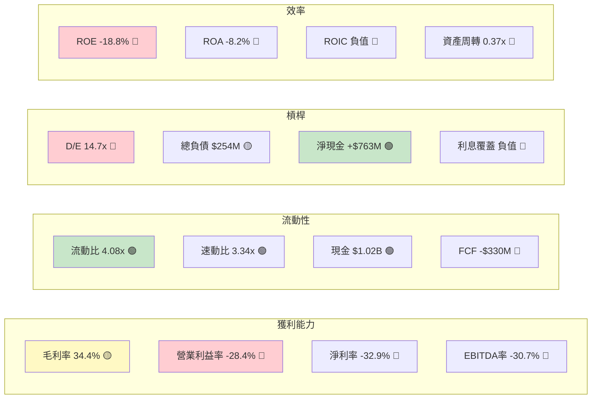

---

### 📉 獲利能力趨勢表格

| 財務指標 | 2021 | 2022 | 2023 | 2024 | 趨勢 | 燈號 |
|----------|------|------|------|------|------|------|
| **毛利率** | -3.0% | 9.0% | 21.0% | 26.6% | ↑ 顯著改善 | 🟢 |
| **營業利益率** | -163.9% | -64.1% | -72.7% | -43.5% | ↑ 改善中 | 🟡 |
| **EBITDA Margin** | -146.5% | -45.1% | -59.3% | -34.8% | ↑ 改善 | 🟡 |
| **淨利率** | -188.5% | -64.4% | -74.6% | -43.6% | ↑ 改善 | 🟡 |
| **FCF Margin** | -156.7% | -70.6% | -62.8% | -26.6% | ↑ 顯著改善 | 🟡 |
| **R&D/收入比** | 67.1% | 30.9% | 48.7% | 40.0% | ↔ 持續高投入 | 🟡 |

> ✅ **正面觀察**：毛利率從 -3% 提升至 26.6%，4年改善幅度驚人；FCF 燒錢速度也顯著放緩。

---

### 🏦 資產負債表穩健度

```
流動比率  [▓▓▓▓▓▓▓▓▓▓▓▓▓▓▓▓▓▓▓▓] 4.08x  🟢 極佳（>2.0 安全）
速動比率  [▓▓▓▓▓▓▓▓▓▓▓▓▓▓▓▓▓░░░] 3.34x  🟢 優良（>1.5 安全）
淨現金況  [▓▓▓▓▓▓▓▓▓▓▓▓▓▓▓░░░░░]+$763M 🟢 淨現金正值
D/E比率   [▓▓▓▓▓▓▓▓▓▓▓▓▓▓▓▓▓▓▓▓]14.7x  🔴 偏高（含租賃）
現金跑道  [▓▓▓▓▓▓▓▓▓▓▓▓▓▓▓░░░░░] ~3年   🟡 按當前FCF燒速
```

> ⚠️ **D/E 14.7x 說明**：此高比值部分因股東權益侵蝕（累積虧損）所致，而非真實負債問題。淨現金實際為正 $763M，流動性充足。

---

### 💸 現金流質量分析

| 現金流指標 | 2021 | 2022 | 2023 | 2024 | TTM（估） |
|-----------|------|------|------|------|----------|
| **營業現金流** | -$71.8M | -$106.5M | -$98.9M | -$48.9M | -$165.5M |
| **資本支出** | -$25.7M | -$42.4M | -$54.7M | -$67.1M | -$165.2M |
| **自由現金流** | -$97.5M | -$149.0M | -$153.6M | -$116.0M | -$330.7M |
| **FCF 轉換率** | N/A | N/A | N/A | N/A | 負值 |
| **FCF Yield** | N/A | N/A | N/A | N/A | **-0.90%** |

> ⚠️ TTM FCF 惡化至 -$330M 主因：Neutron 火箭基礎設施大規模資本支出所致，屬投資期正常現象。預計 2027-2028 年轉正。

---

## 5. 成長性評估

### 📈 歷史 CAGR 表格

| 成長指標 | 1年 CAGR | 3年 CAGR | 備註 |
|----------|----------|----------|------|
| **收入** | +78.3% | +91.4% | 2024年$436M vs 2021年$62M |
| **毛利潤** | +125.9% | N/A（負轉正） | 質的轉變 |
| **EPS** | 虧損收窄 | 持續虧損 | 未達獲利 |
| **FCF** | 改善25% | 仍持續為負 | Neutron CAPEX影響 |
| **TTM 收入** | **+35.7%** | — | 最新年化成長 |

---

### 🚀 未來成長催化劑

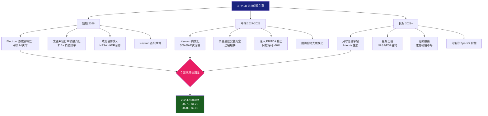

---

### 📊 成長軌跡 Unicode 長條圖

```
年度收入成長軌跡（百萬美元）
━━━━━━━━━━━━━━━━━━━━━━━━━━━━━━━━━━━━━━━━━━━━━
2021  $62M   [██░░░░░░░░░░░░░░░░░░░░░░░░░░░░]
2022  $211M  [███████░░░░░░░░░░░░░░░░░░░░░░░]
2023  $245M  [████████░░░░░░░░░░░░░░░░░░░░░░]
2024  $436M  [██████████████░░░░░░░░░░░░░░░░]
TTM   $602M  [████████████████████░░░░░░░░░░]
2026E $800M  [███████████████████████████░░░] ←預測
2027E $1.2B  [██████████████████████████████] ←預測
━━━━━━━━━━━━━━━━━━━━━━━━━━━━━━━━━━━━━━━━━━━━━

季度收入成長（2025年各季）
━━━━━━━━━━━━━━━━━━━━━━━━━━━━━━━━━━━━━━━━━━━━━
Q4 2024  $132M  [████████████░░░░░░░░░░░░░░░░░░]
Q1 2025  $123M  [███████████░░░░░░░░░░░░░░░░░░░] ↔
Q2 2025  $145M  [█████████████░░░░░░░░░░░░░░░░░] ↑
Q3 2025  $155M  [██████████████░░░░░░░░░░░░░░░░] ↑
━━━━━━━━━━━━━━━━━━━━━━━━━━━━━━━━━━━━━━━━━━━━━
```

---

## 6. 估值合理性 & 同業比較

### 🏆 同業比較表格

| 指標 | **RKLB** | **ASTS** (AST SpaceMobile) | **RDW** (Redwire) | **MNTS** (Momentus) | 燈號 |
|------|----------|---------------------------|-------------------|---------------------|------|
| **股價** | $69.10 | ~$25 | ~$8 | ~$2 | — |
| **市值** | $36.9B | ~$6B | ~$700M | ~$150M | — |
| **P/S（TTM）** | **61.3x** 🔴 | ~45x 🔴 | ~3.5x 🟢 | N/M 🔴 | RKLB 最貴 |
| **P/B** | **21.8x** 🔴 | ~12x 🔴 | ~2.5x 🟢 | N/M | — |
| **EV/Revenue** | **67.2x** 🔴 | ~50x 🔴 | ~4x 🟢 | N/M | — |
| **EV/EBITDA** | **-218x** 🔴 | 負值 🔴 | ~25x 🟡 | 負值 🔴 | — |
| **FCF Yield** | **-0.9%** 🔴 | 負值 🔴 | 微正 🟡 | 負值 🔴 | — |
| **收入成長YoY** | **+35.7%** 🟢 | ~+200% 🟢 | ~+15% 🟡 | ~+50% 🟡 | ASTS成長更快 |
| **毛利率** | **34.4%** 🟡 | ~30% 🟡 | ~20% 🟡 | 負值 🔴 | — |
| **技術成熟度** | **✅ 已商業化** | ⚠️ 商業化中 | ✅ 已商業化 | ❌ 早期 | RKLB最優 |
| **護城河** | **🟢 強** | 🟡 中 | 🟡 中 | 🔴 弱 | — |

> **結論**：RKLB 估值在同業中最高，但也是最成熟、護城河最強的公開上市純商業航太公司。估值溢價部分有其基礎。

---

### 📏 歷史估值區間

| 估值指標 | 52W 低 | 當前 | 52W 高 | 位置 |
|----------|--------|------|--------|------|
| **股價** | $14.71 | $69.10 | $99.58 | 中高位 |
| **P/S** | ~15x | 61x | ~95x | 偏高 |
| **EV/Rev** | ~16x | 67x | ~100x | 中高 |

```
估值位置視覺化
━━━━━━━━━━━━━━━━━━━━━━━━━━━━━━━━━━━━━━━━━━
低估區間    合理區間         高估區間       泡沫
   │            │                 │           │
   ▼            ▼                 ▼           ▼
[░░░░░░░░░░][████████░░░░░░][▓▓▓▓▓▓▓▓░░][░░░░░░░]
$14         $30           [$69.1]  $85        $99+
                              ↑
                           當前位置
                           🔴 高估區間
━━━━━━━━━━━━━━━━━━━━━━━━━━━━━━━━━━━━━━━━━━
```

---

### 💰 多重估值法目標價彙整

| 估值方法 | 假設 | 目標價 | 隱含報酬 |
|----------|------|--------|---------|
| **DCF 法** | WACC 12%，2028E FCF $150M，永續成長5% | **$55-65** | -6% ~ -21% |
| **P/S 相對估值** | 2026E 收入 $800M，目標 P/S 40x | **$60** | -13% |
| **EV/Rev 法** | 2027E 收入 $1.2B，EV/Rev 30x | **$75-85** | +8-23% |
| **分析師共識** | 12位分析師均值 | **$85.21** | **+23.3%** |
| **樂觀情境** | Neutron 成功，市佔率擴大 | **$120** | +73.7% |
| **悲觀情境** | Neutron 延誤，收入成長放緩 | **$35** | -49.3% |

---

## 7. 資本配置與管理層評估

### 📊 ROIC vs WACC 分析

```
╔══════════════════════════════════════════════════════════╗
║              ROIC vs WACC 核心分析                        ║
╠══════════════════════════════════════════════════════════╣
║                                                          ║
║  WACC 估算：                                              ║
║  ├─ 無風險利率：4.3%（10Y美債）                            ║
║  ├─ 權益風險溢價：5.5%                                    ║
║  ├─ Beta：~1.8（高波動科技/航太）                          ║
║  ├─ 股權成本（Ke）：4.3% + 1.8×5.5% = 14.2%              ║
║  ├─ 稅前債務成本：~6.5%（可轉債）                          ║
║  ├─ 稅後債務成本：~5.2%                                   ║
║  ├─ 資本結構：股權95%/負債5%                               ║
║  └─ **估算 WACC：≈ 13.8%**                               ║
║                                                          ║
║  ROIC 估算：                                              ║
║  ├─ NOPAT（稅後營業淨利）：≈ -$190M（虧損）               ║
║  ├─ 投入資本：≈ $850M（資產-現金-非計息流動負債）           ║
║  └─ **估算 ROIC：≈ -22.4%**                              ║
║                                                          ║
║  EVA（經濟附加值）= ROIC - WACC = -22.4% - 13.8%         ║
║                    = **-36.2%**  ❌ 大幅負值               ║
║                                                          ║
║  ⚠️  結論：RKLB 目前 **未創造股東價值**                    ║
║     ROIC 嚴重低於 WACC，每投入 $1 資本即銷毀 $0.36 價值   ║
║                                                          ║
║  📌  重要說明：這是早期高成長公司的典型特徵。              ║
║     投資人押注的是 2028-2030 年 ROIC 轉正的期望值。        ║
║     SpaceX 早期（2010-2018）情況類似。                    ║
╚══════════════════════════════════════════════════════════╝
```

---

### 🥧 資本配置歷史

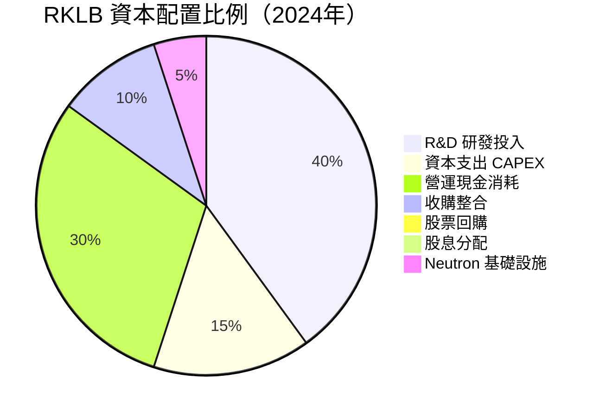

---

### 📋 管理層執行力評分

| 評估維度 | 評分 | 說明 | 燈號 |
|----------|------|------|------|
| **願景清晰度** | 9/10 | Peter Beck 技術路線圖清晰，Neutron-Electron 雙平台戰略明確 | 🟢 |
| **承諾達成率** | 6/10 | 多次 Neutron 時程延誤，但發射頻率穩步提升 | 🟡 |
| **資本紀律** | 5/10 | 研發投入積極但燒錢快，部分收購溢價較高 | 🟡 |
| **市場溝通** | 7/10 | 季度法說會透明，技術細節公開程度高 | 🟢 |
| **股東回報意識** | 4/10 | 無股息/無回購，全力再投資（可理解但對股東不友善） | 🔴 |
| **執行團隊深度** | 7/10 | 核心技術團隊穩定，彼得貝克個人形象是雙刃劍 | 🟢 |

---

### 💝 股東友善度評分

```
股息政策     [░░░░░░░░░░░░░░░░░░░░]  0/10  🔴 無股息
股票回購     [░░░░░░░░░░░░░░░░░░░░]  0/10  🔴 無回購
透明度溝通   [▓▓▓▓▓▓▓▓▓▓▓▓▓▓░░░░░░]  7/10  🟢 良好
策略清晰度   [▓▓▓▓▓▓▓▓▓▓▓▓▓▓▓▓▓░░░]  8/10  🟢 強
股份稀釋控制 [▓▓▓▓▓▓▓▓░░░░░░░░░░░░]  4/10  🔴 持續發行新股
長期價值創造 [▓▓▓▓▓▓▓▓▓▓▓▓▓░░░░░░░]  6/10  🟡 待觀察
━━━━━━━━━━━━━━━━━━━━━━━━━━━━━━━━━━━━━━
綜合股東友善 [▓▓▓▓▓▓▓▓░░░░░░░░░░░░]  4.2/10  🟡 偏低
```

---

## 8. 風險評估

### 🔥 風險熱圖

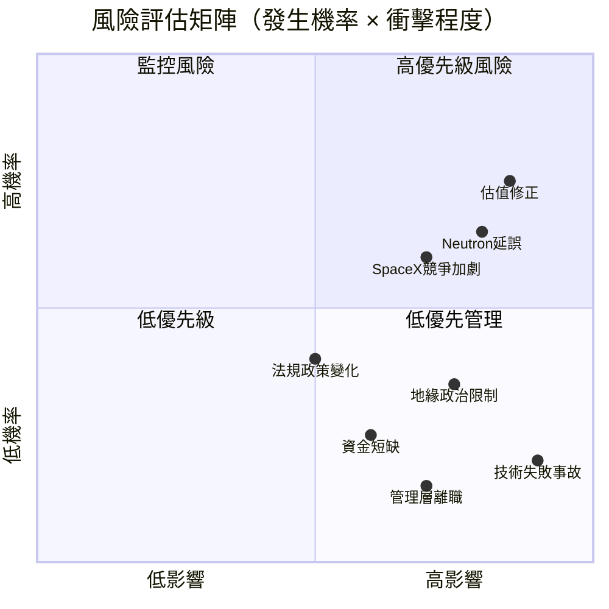

---

### 📋 風險清單表格

| 風險類型 | 嚴重度 | 發生率 | 緩解措施 | 燈號 |
|----------|--------|--------|---------|------|
| **估值泡沫風險**：P/S 61x 不可持續 | 極高 | 高 | 嚴格止損、分批建倉 | 🔴 |
| **Neutron 持續延誤**：2026 首飛目標 | 高 | 中高 | 多元收入來源分散，Electron 穩定 | 🔴 |
| **SpaceX 競爭**：Falcon 9 降價壓力 | 高 | 高 | 差異化服務、太空系統業務 | 🔴 |
| **持續股份稀釋**：融資需求 | 中 | 中 | 現金 $1B 支撐 2-3 年跑道 | 🟡 |
| **地緣政治風險**：美中競爭/出口管制 | 高 | 中 | 五眼盟友為主客戶 | 🟡 |
| **技術失敗**：發射失敗損名聲 | 中高 | 低 | 91% 成功率，冗餘設計 | 🟡 |
| **資金耗盡**：FCF -$330M/年 | 中 | 低 | $1.02B 現金支撐 3 年 | 🟡 |
| **市場退潮**：太空概念股去泡沫 | 高 | 中 | 基本面持續改善降低敏感度 | 🟡 |
| **法規政策**：FAA 發射許可延誤 | 中 | 低中 | 已建立良好監管關係 | 🟢 |
| **人才流失**：高端航太工程師 | 中 | 低 | 期權激勵計畫完善 | 🟢 |

---

### 📉 最大下行情境分析（Bear Case）

```
╔═══════════════════════════════════════════════════════╗
║           熊市情境分析（Bear Case）                    ║
╠═══════════════════════════════════════════════════════╣
║                                                       ║
║  觸發條件：                                            ║
║  1. Neutron 推遲至 2028 年以後                         ║
║  2. 收入成長放緩至 15% YoY                             ║
║  3. 市場整體風險偏好下降（利率回升）                    ║
║  4. 大規模增資稀釋股東                                  ║
║                                                       ║
║  估值重設：P/S 降至 20x × 收入 $700M                   ║
║  熊市目標價：$26 - $35                                  ║
║  潛在下行：-50% 至 -62%                                ║
║                                                       ║
║  📌 最差情境：P/S 10x（極端流動性危機）                 ║
║     極端目標價：$13（-81%）                             ║
╚═══════════════════════════════════════════════════════╝
```

---

## 9. 催化劑與觸發因素

### 📅 催化劑時間軸

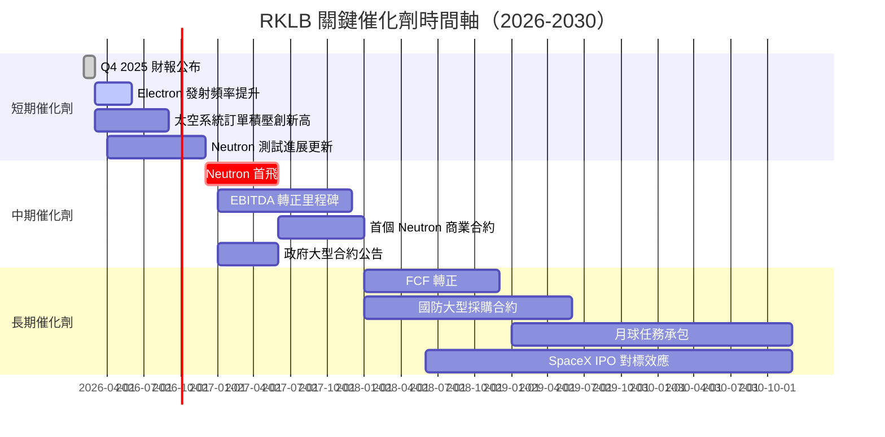

---

### ⚡ 正面觸發因素

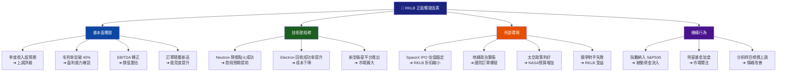

---

## 10. 投資建議

### ⭐ 最終評級

```
╔═══════════════════════════════════════════════════════════════════╗
║                                                                   ║
║   ████████████████████████████████████████████████████████████   ║
║   █                                                            █   ║
║   █   RKLB 最終投資評級：★★★☆☆                                █   ║
║   █                                                            █   ║
║   █   評級：🟡 觀望偏買入（Speculative Buy）                    █   ║
║   █                                                            █   ║
║   █   適合投資人：高風險承受度 / 長期持有 / 太空主題信仰者        █   ║
║   █   不適合：保守型 / 收益型 / 短期操作 / 倉位過重者            █   ║
║   █                                                            █   ║
║   █   綜合得分：5.75 / 10                                       █   ║
║   ████████████████████████████████████████████████████████████   ║
╚═══════════════════════════════════════════════════════════════════╝

評星明細：
成長性    ★★★★☆  (8.5)
獲利能力  ★★☆☆☆  (3.5)
財務健康  ★★★☆☆  (6.0)
估值      ★☆☆☆☆  (2.5)
競爭優勢  ★★★★☆  (7.0)
管理品質  ★★★☆☆  (6.5)
動能      ★★★★☆  (7.5)
風險管理  ★★☆☆☆  (4.5)
```

---

### 🎯 目標價區間與隱含報酬率

| 情境 | 觸發條件 | 目標價 | 隱含報酬 | 機率 |
|------|----------|--------|---------|------|
| 🟢 **樂觀情境** | Neutron 2026 成功首飛，收入超預期，SpaceX IPO 提升估值 | **$120** | **+73.7%** | 25% |
| 🟡 **基準情境** | Neutron 輕微延誤，收入穩健成長35%+，毛利率持續改善 | **$85** | **+23.0%** | 45% |
| 🔴 **悲觀情境** | Neutron 大幅延誤至2028，成長放緩，市場去泡沫 | **$35** | **-49.3%** | 30% |
| ⚫ **極端情境** | 技術重大失敗+融資危機+市場崩潰 | **$15** | **-78.3%** | 5% |

**機率加權目標價：** $85×45% + $120×25% + $35×30% + $15×5% = **$76.5**

> 📌 **加權後目標價 $76.5 vs 當前 $69.1，隱含報酬 +10.7%**，風險調整後吸引力有限。

---

### 👤 投資人適配度

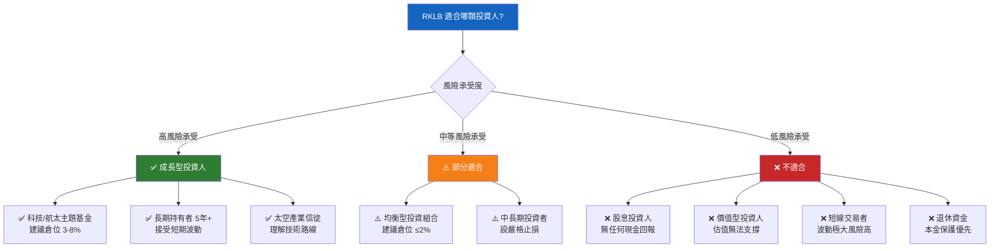

---

### ⏱️ 操作策略建議

| 策略項目 | 建議 |
|----------|------|
| **建議持倉時間** | 3-5年（等待 Neutron 商業化 + EBITDA 轉正） |
| **建議倉位上限** | 投機組合 ≤5% / 一般組合 ≤2% |
| **分批建倉策略** | 分3批：$69→$55→$40 各建1/3倉位 |
| **加碼觸發條件** | ① Neutron 靜態點火成功 ② 毛利率突破40% ③ 單季收入超$200M |
| **止損觸發條件** | ① 跌破 $50（-27.6%）技術支撐 ② Neutron 重大技術失敗公告 ③ 管理層重大離職 |
| **獲利了結** | 股價突破 $100 後，可分批減倉至半倉 |

---

### ✅ 關鍵監控指標 Checklist

```
📋 RKLB 核心監控指標（每季度追蹤）

財務面
□ 季度收入 QoQ 成長率 > 10%
□ 毛利率持續提升，目標 > 40%
□ 年化 FCF 燒速控制在 $300M 以下
□ 現金餘額 > $600M（警戒線）
□ 訂單積壓（Backlog）持續創新高

業務面
□ Electron 年化發射次數 > 20 次
□ 太空系統業務收入佔比 > 50%
□ Neutron 開發里程碑按期達成
□ 新合約公告（特別是政府大型合約）
□ 成功率維持 > 90%

估值面
□ P/S 是否從 61x 回落至合理區間
□ 分析師目標價共識方向
□ 機構持倉比例變化（現為 59.4%）
□ 做空比例是否急劇上升

外部環境
□ SpaceX 定價策略是否大幅降低
□ 美國航太政策/NASA 預算
□ 地緣政治對客戶的影響
□ 競爭對手（ASTS/RDW）動態
□ 利率環境（影響高成長股估值）
```

---

## 📌 綜合結語

```
╔══════════════════════════════════════════════════════════════════╗
║                      RKLB 投資摘要                               ║
╠══════════════════════════════════════════════════════════════════╣
║                                                                  ║
║  🚀 RKLB 是全球最值得關注的商業航太公司之一，也是目前唯一規模化   ║
║     的公開上市端到端太空企業。其技術壁壘、執行力和成長路徑均具   ║
║     備說服力。                                                    ║
║                                                                  ║
║  💰 然而，當前 P/S 61x、EV/Rev 67x 的估值已相當充分反映甚至    ║
║     透支了未來 3-5 年的樂觀預期。任何執行偏差都將造成巨大損失。  ║
║                                                                  ║
║  ⚖️  核心取捨：                                                   ║
║     買入者的賭注 = Neutron 按時成功 + 市場維持高估值偏好         ║
║     風險者的擔憂 = 估值修正 + Neutron 延誤 + SpaceX 碾壓         ║
║                                                                  ║
║  📌  建議：長期看多，但當前位置不適合重倉追入。                   ║
║     等待回調至 $50-55 區間，或等待 Neutron 具體進展確認後，      ║
║     再擴大倉位。短期投機性持有可設 $50 止損。                    ║
╚══════════════════════════════════════════════════════════════════╝
```

---

> **⚠️ 免責聲明**：本報告為 AI 自動生成之分析報告，所有財務數據基於 2026-02-28 截止資料，未來情況可能與預測存在重大差異。本報告**不構成任何投資建議**，投資人應自行進行盡職調查並諮詢專業財務顧問。投資有風險，入市須謹慎。過去表現不代表未來收益。

---

*報告生成時間：2026-02-28 ｜ 分析框架：八維度綜合評估系統 ｜ 數據來源：Yahoo Finance*