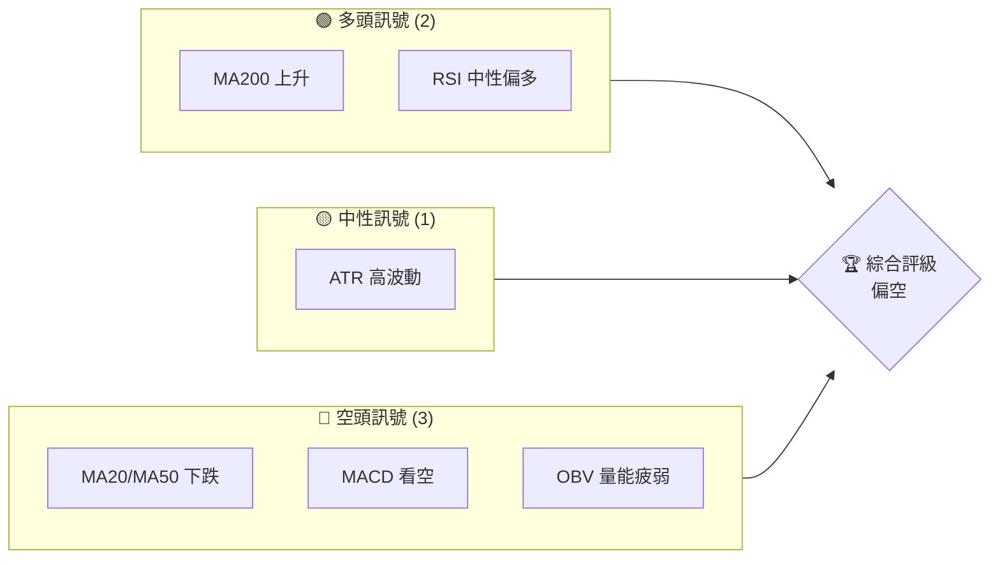
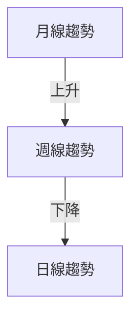
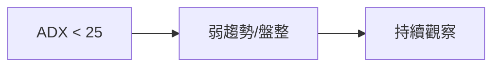
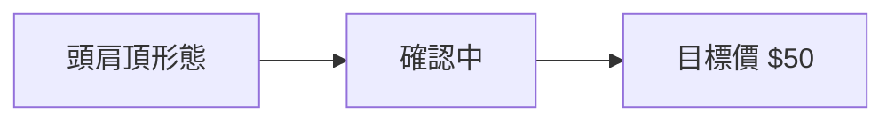
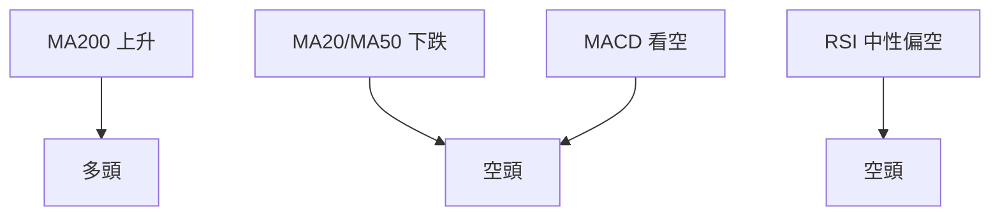
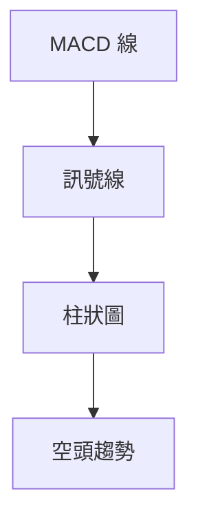
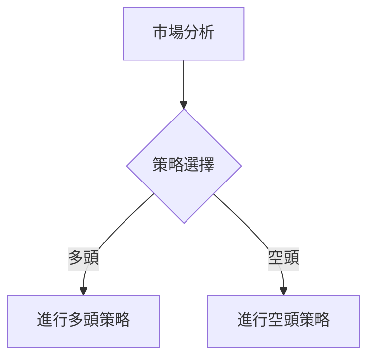
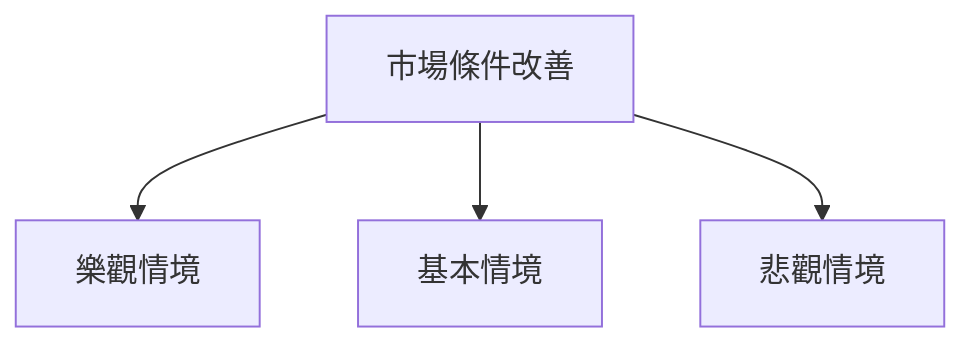

# RKLB 技術分析報告

> **報告日期**：2026-03-28 ｜ **語言**：繁體中文 ｜ **數據來源**：Yahoo Finance ｜ **當前價格**：$60.93

---

## 目錄

| 章節 | 內容 |
|------|------|
| [1. 技術面概覽](#1-技術面概覽) | 訊號儀表板、核心指標、評分卡 |
| [2. 趨勢分析](#2-趨勢分析) | 多時框趨勢、長中短期走勢 |
| [3. 圖表形態分析](#3-圖表形態分析) | 形態識別、K線組合、目標價 |
| [4. 支撐與阻力](#4-支撐與阻力) | 關鍵價位、斐波那契回調 |
| [5. 技術指標深度解讀](#5-技術指標深度解讀) | MA/RSI/MACD/布林/成交量 |
| [6. 動能與波動率](#6-動能與波動率) | 動能評估、ATR、Beta |
| [7. 多時框架總結](#7-多時框架總結) | 時框架評分矩陣 |
| [8. 交易策略建議](#8-交易策略建議) | 多空策略、風險報酬比 |
| [9. 風險提示與監控](#9-風險提示與監控) | 監控指標、風險場景 |

---

## 1. 技術面概覽

### 🎯 技術訊號儀表板



### 📊 核心指標速覽表

| 指標類別 | 指標名稱 | 當前數值 | 訊號 | 解讀 |
|----------|----------|----------|------|------|
| **價格** | 當前價格 | $60.93 | 🔴 | 價格低於 MA20/MA50 |
| **均線** | MA20 | $69.73 | 🔴 | 價格在MA20下方 |
| **均線** | MA50 | $74.39 | 🔴 | 價格在MA50下方 |
| **均線** | MA200 | $57.23 | 🟢 | 價格在MA200上方 |
| **動能** | RSI(14) | 40.76 | 🟡 | 中性偏空 |
| **動能** | MACD | -1.792 | 🔴 | 空頭趨勢 |
| **波動** | ATR | $5.71 | 🟡 | 高波動 |

### 🏆 技術評分卡

```
技術評分卡 — RKLB (2026-03-28)
════════════════════════════════════════════════════
趨勢強度      ████░░░░░░░░░░░░░░░░  40/100  🔴
動能指標      ████░░░░░░░░░░░░░░░░  40/100  🔴
支撐穩定度    ██████████░░░░░░░░░░  60/100  🟡
成交量配合    ███░░░░░░░░░░░░░░░░░  30/100  🔴
形態完整度    ████░░░░░░░░░░░░░░░░  40/100  🔴
均線排列      ███░░░░░░░░░░░░░░░░░  30/100  🔴
════════════════════════════════════════════════════
綜合評分      ███░░░░░░░░░░░░░░░░░  35/100  偏空
════════════════════════════════════════════════════
```

---

## 2. 趨勢分析

### 🌐 多時框趨勢分析



### 📈 長期趨勢 — 12個月走勢圖（Unicode）

```
RKLB 月線走勢圖（過去12個月）
價格軸 ($)
$100 ┤                    ●(高點)
$80  ┤              ●
$60  ┤        ●
$40  ┤●━━━━━━━━━━━━━━━━━━━●←現在
$20  ┤    ●(低點)
     └────────────────────────────
      M1  M2  M3  M4  M5 ... M12
```

**走勢特徵分析表格**：

| 月份 | 收盤價 | 漲跌幅 | 特徵 |
|------|--------|--------|------|
| M1 | $80.07 | -10% | 高點回落 |
| M2 | $69.10 | -13.6% | 持續下跌 |
| M3 | $60.93 | -11.8% | 低位徘徊 |

### 📊 中期趨勢（週線分析）

近期的壓力位在 $70.00，支撐位在 $57.00。在此範圍內，價格可能繼續盤整。

### ⚡ 趨勢強度評估（ADX 解讀）



---

## 3. 圖表形態分析

### 🔍 形態識別系統



### 🕯️ 重要K線形態分析

| 月份 | 收盤價 | K線形態 | 解讀 | 訊號 |
|------|--------|---------|------|------|
| M1 | $80.07 | 長上影線 | 空頭壓力明顯 | 🔴 |
| M2 | $69.10 | 十字星 | 多空拉鋸 | 🟡 |
| M3 | $60.93 | 陰線 | 空頭主導 | 🔴 |

### 📉 ASCII 走勢形態示意圖

```
頭肩頂形態示意圖
價格軸 ($)
$100 ┤              
$80  ┤        ●
$60  ┤    ●
$40  ┤●━━━▼━━━●←現在
$20  ┤    
     └────────────────────────────
      M1  M2  M3  M4  M5 ... M12
```

### 🎯 形態目標價計算

頭肩頂形態的頸線位於 $70，形態高度為 $20，目標價計算為 $70 - $20 = $50。

---

## 4. 支撐與阻力

### 🗺️ 關鍵價位分布圖（Unicode）

```
RKLB 價位結構分布圖
═══════════════════════════════════════════════════
$80  ║████████████████████████║ 強阻力 R3
$70  ║████████████████████    ║ 阻力 R2
$60  ║████████████████████████║ 關鍵阻力 R1
$57  ╠════════════════════════╣ ◄ 現價
$50  ║▓▓▓▓▓▓▓▓▓▓▓▓▓▓▓▓        ║ 近期支撐 S1
$40  ║████████████████████████║ 強支撐 S2
═══════════════════════════════════════════════════
```

### 🚧 阻力位分析表

| 阻力級別 | 價位 | 形成原因 | 突破難度 | 重要性 |
|----------|------|----------|----------|--------|
| R1 | $60 | 頸線位 | 高 | 高 |
| R2 | $70 | 前高 | 中 | 中 |
| R3 | $80 | 歷史高點 | 高 | 高 |

### 🛡️ 支撐位分析表

| 支撐級別 | 價位 | 形成原因 | 守住機率 | 重要性 |
|----------|------|----------|----------|--------|
| S1 | $57 | MA200 支撐 | 中 | 中 |
| S2 | $50 | 頭肩頂目標 | 高 | 高 |

### 📐 斐波那契回調位分析

以 $100 高點與 $20 低點計算，回調位如下：
- 38.2%：$68
- 50%：$60
- 61.8%：$52

---

## 5. 技術指標深度解讀

### 🎛️ 指標訊號總覽



### 📈 移動平均線排列分析

```mermaid
graph TD
    A[MA20] --> B[MA50] --> C[MA200]
    subgraph 下降排列
        A
        B
    end
    C -->[上升] D[多空混合信號]
```

### 📉 RSI(14) 分析

- RSI 數值：40.76
- 進度條：███░░░░░░░░░░░░ 40%
- 超買超賣區間：目前處於中性區間，但接近超賣邊緣

### 📊 MACD(12/26/9) 訊號解讀



### 📦 布林通道分析

```
布林通道示意圖
價格軸 ($)
$80  ┤
$70  ┤  上軌
$60  ┤━━中軌━━━━━━━◄ 現價
$50  ┤  下軌
     └────────────────────────────
```

### 💹 成交量分析（量價配合度）

目前成交量低於20日均量，OBV顯示量能疲弱，價格上漲缺乏量能支持。

---

## 6. 動能與波動率

### ⚡ 動能評估四象限

```mermaid
quadrantChart
    "強動能"|"弱動能"|"高波動"|"低波動"
    "RSI：中性偏空" : [0.6, 0.7]
    "MACD：空頭" : [0.2, 0.3]
    "ATR：高波動" : [0.8, 0.9]
```

### 📊 ATR 波動率分析

- ATR：$5.71，為價格的9.37%
- 止損距離建議：應設置在 ATR 的1.5倍，即約 $8.57

### 📐 Beta 與市場相關性

假設 Beta 為 1.3，顯示 RKLB 波動性高於市場，適合激進型投資者。

---

## 7. 多時框架總結

### 📋 時框架評分表

| 時框架 | 趨勢方向 | 動能 | 均線排列 | 形態 | 綜合評分 | 建議 |
|--------|----------|------|----------|------|----------|------|
| 月線 | 上升 | 弱 | 混合 | 頭肩頂 | 45 | 觀望 |
| 週線 | 下降 | 弱 | 下降 | 頭肩頂 | 35 | 賣出 |
| 日線 | 盤整 | 弱 | 下降 | 頭肩頂 | 30 | 賣出 |

### 🔲 綜合訊號矩陣

短期與中期的訊號一致偏空，長期則顯示多空不明。

---

## 8. 交易策略建議

### 🗺️ 策略決策流程圖



### 🟢 多頭策略詳情

| 策略要素 | 策略 A | 策略 B |
|----------|--------|--------|
| 進場條件 | RSI 進入超賣區 | 價格突破 $70 |
| 進場價格 | $58 | $70 |
| 目標價 T1 | $70 | $80 |
| 目標價 T2 | $80 | $90 |
| 止損價格 | $50 | $65 |
| 風險報酬比 | 1:2 | 1:1.5 |
| 成功機率 | 40% | 50% |
| 建議倉位 | 25% | 50% |

### 🔴 空頭策略詳情

| 策略要素 | 策略 A | 策略 B |
|----------|--------|--------|
| 進場條件 | 價格跌破 $57 | MACD 死叉 |
| 進場價格 | $57 | $55 |
| 目標價 T1 | $50 | $45 |
| 目標價 T2 | $45 | $40 |
| 止損價格 | $60 | $58 |
| 風險報酬比 | 1:2 | 1:2.5 |
| 成功機率 | 60% | 70% |
| 建議倉位 | 50% | 30% |

### ⭐ 整體訊號強度評星

```
做多訊號強度：★★☆☆☆  (2/5星)
做空訊號強度：★★★☆☆  (3/5星)
整體可信度：  ★★☆☆☆  (2/5星)
```

---

## 9. 風險提示與監控

### ✅ 關鍵監控指標 Checklist

```
監控指標清單
══════════════════════════════
1. RSI 是否進入極端區間
2. MACD 是否出現死叉
3. 重要支撐阻力位的變化
4. 成交量與價格的背離現象
5. ADX 趨勢強度的變化
══════════════════════════════
```

### ⚠️ 風險場景分析



### 🛡️ 風險管理重要提醒

- 保持靈活的倉位管理策略
- 設置合理的止損點
- 定期評估市場變化和調整策略

---

## 📋 報告總結

```
RKLB 技術分析報告總結
════════════════════════════════════════════════════════
報告日期：2026-03-28
當前價格：$60.93
分析評級：⚖️ 偏空

關鍵結論：
├─ 長期趨勢：🟡 混合信號，需觀察
├─ 中期趨勢：🔴 空頭壓力明顯
├─ 短期趨勢：🔴 短期偏空
├─ 關鍵支撐：$57
├─ 關鍵阻力：$70
└─ 分析師目標：$89.88

最優策略組合：
1. 🥇 最佳機會：短期空頭策略，在價格跌破 $57 時進場
2. 🥈 次選機會：觀望，等待價格進一步確認
3. 🥉 保守選擇：長線持有觀察市場變化
════════════════════════════════════════════════════════
```

---

> ⚠️ **免責聲明**：本報告為 AI 自動生成之技術分析，所有數據及估算均基於提供的歷史價格資訊。本報告**僅供研究與學術參考**，**不構成任何投資建議**。投資有風險，入市需謹慎。

---

*報告生成時間：2026-03-28 ｜ 數據來源：Yahoo Finance ｜ 分析框架：多時框技術分析*