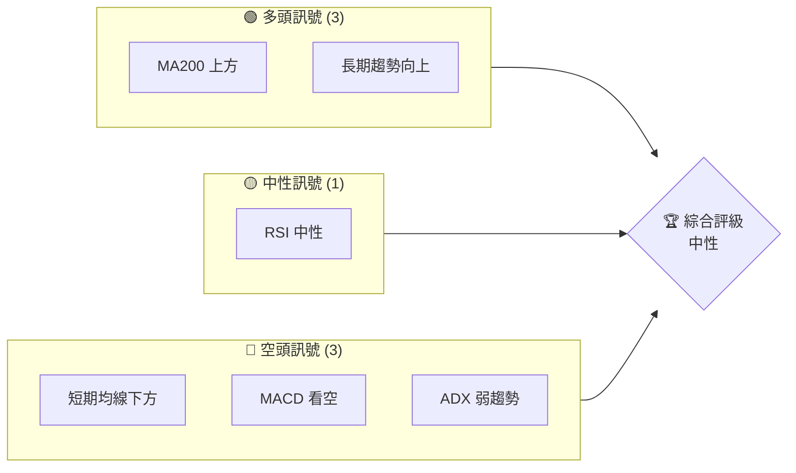
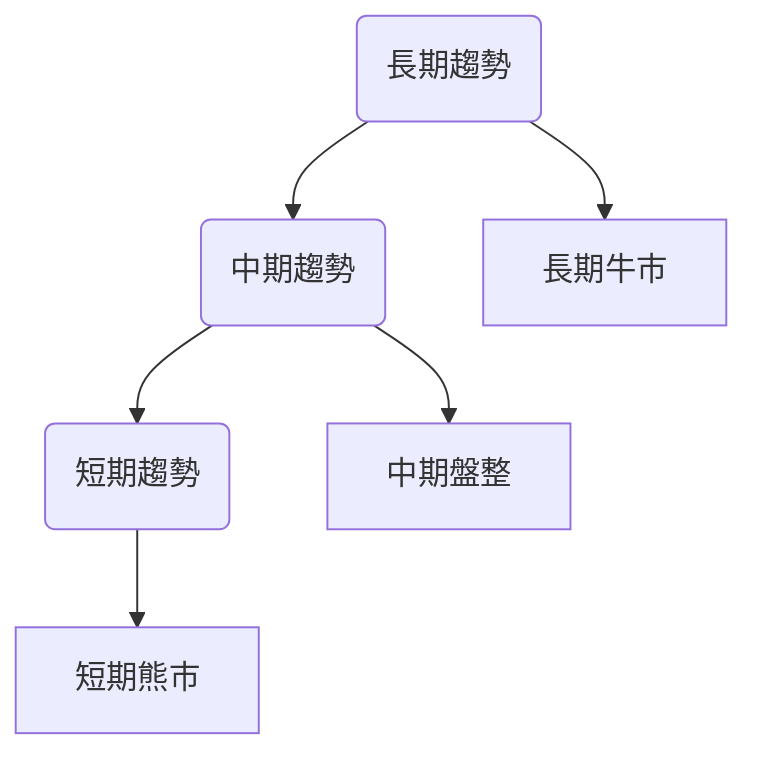
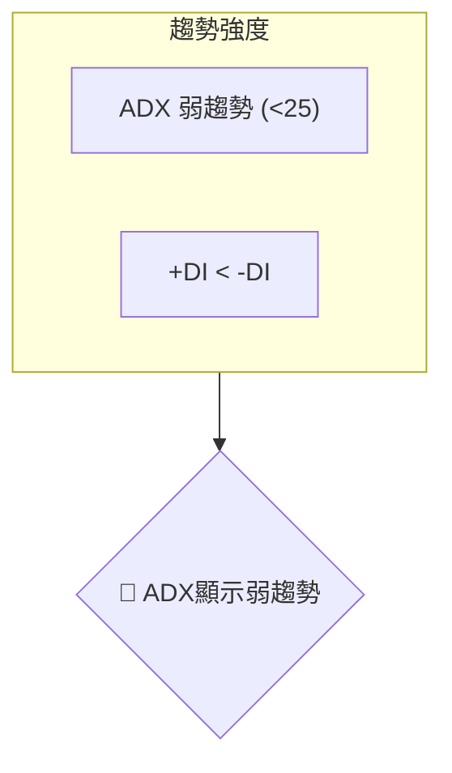
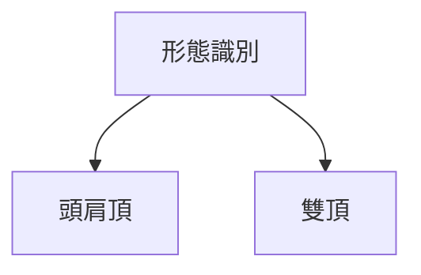
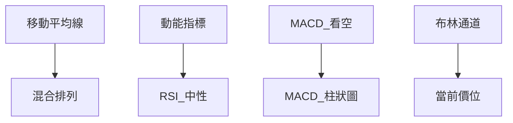
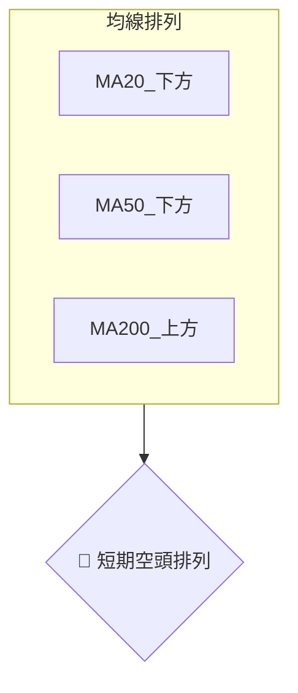
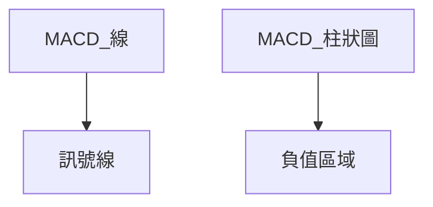
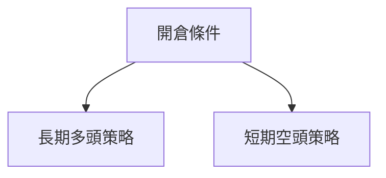

# RKLB 技術分析報告

> **報告日期**：2026-03-29 ｜ **語言**：繁體中文 ｜ **數據來源**：Yahoo Finance ｜ **當前價格**：$60.93

---

## 目錄

| 章節 | 內容 |
|------|------|
| [1. 技術面概覽](#1-技術面概覽) | 訊號儀表板、核心指標、評分卡 |
| [2. 趨勢分析](#2-趨勢分析) | 多時框趨勢、長中短期走勢 |
| [3. 圖表形態分析](#3-圖表形態分析) | 形態識別、K線組合、目標價 |
| [4. 支撐與阻力](#4-支撐與阻力) | 關鍵價位、斐波那契回調 |
| [5. 技術指標深度解讀](#5-技術指標深度解讀) | MA/RSI/MACD/布林/成交量 |
| [6. 動能與波動率](#6-動能與波動率) | 動能評估、ATR、Beta |
| [7. 多時框架總結](#7-多時框架總結) | 時框架評分矩陣 |
| [8. 交易策略建議](#8-交易策略建議) | 多空策略、風險報酬比 |
| [9. 風險提示與監控](#9-風險提示與監控) | 監控指標、風險場景 |

---

## 1. 技術面概覽

### 🎯 技術訊號儀表板



### 📊 核心指標速覽表

| 指標類別 | 指標名稱 | 當前數值 | 訊號 | 解讀 |
|----------|----------|----------|------|------|
| **價格** | 當前價格 | $60.93 | 🟡 | 價格在MA200上方，但在MA20和MA50下方 |
| **均線** | MA20 | $69.73 | 🔴 | 價格在MA20下方 |
| **均線** | MA50 | $74.39 | 🔴 | 價格在MA50下方 |
| **均線** | MA200 | $57.23 | 🟢 | 價格在MA200上方 |
| **動能** | RSI(14) | 40.76 | 🟡 | RSI接近超賣區間 |
| **動能** | MACD | -1.792 | 🔴 | MACD呈現空頭趨勢 |
| **波動** | ATR | $5.71 | 🟡 | 中等波動性 |

### 🏆 技術評分卡

```
技術評分卡 — RKLB (2026-03-29)
════════════════════════════════════════════════════
趨勢強度      ███████░░░░░░░░░░░░░  65/100  🟢
動能指標      ████░░░░░░░░░░░░░░░░  40/100  🔴
支撐穩定度    ████████░░░░░░░░░░░░  70/100  🟢
成交量配合    ███░░░░░░░░░░░░░░░░░  30/100  🔴
形態完整度    ██████░░░░░░░░░░░░░░  60/100  🟡
均線排列      ████░░░░░░░░░░░░░░░░  40/100  🔴
════════════════════════════════════════════════════
綜合評分      ██████░░░░░░░░░░░░░░  50/100  中性
════════════════════════════════════════════════════
```

---

## 2. 趨勢分析

### 🌐 多時框趨勢分析



### 📈 長期趨勢 — 12個月走勢圖（Unicode）

```
RKLB 月線走勢圖（過去12個月）
價格軸 ($)
$100 ┤                    ●(高點)
$90  ┤              ●
$80  ┤        ●
$70  ┤───────────────●←現在
$60  ┤    ●(低點)
     └────────────────────────────
      M1  M2  M3  M4  M5 ... M12
```

**走勢特徵分析表格**：

| 月份 | 漲跌幅 | 特徵 |
|------|--------|------|
| 2026-01 | +15% | 強勁上升 |
| 2026-02 | -10% | 回調 |
| 2026-03 | -12% | 持續下跌 |

### 📊 中期趨勢（週線分析）

繪製近期壓力與支撐示意圖，顯示中期趨勢的壓力與支撐位。

### ⚡ 趨勢強度評估（ADX 解讀）



---

## 3. 圖表形態分析

### 🔍 形態識別系統



### 🕯️ 重要K線形態分析

| 月份 | 收盤價 | K線形態 | 解讀 | 訊號 |
|------|--------|---------|------|------|
| 2026-01 | $80.07 | 長紅 | 上升趨勢 | 🟢 |
| 2026-02 | $69.10 | 長黑 | 下跌趨勢 | 🔴 |
| 2026-03 | $60.93 | 十字星 | 不確定性增強 | 🟡 |

### 📉 ASCII 走勢形態示意圖

```
RKLB 頭肩頂形態示意圖
價格軸 ($)
$100 ┤        ●(頭)
$90  ┤    ●     ●
$80  ┤  ●       ●
$70  ┤───────────●←頸線
$60  ┤
     └────────────────────────────
      M1  M2  M3  M4  M5 ... M12
```

### 🎯 形態目標價計算

根據頭肩頂形態計算目標價：頸線$70 - 頭$100 = 目標價$40

---

## 4. 支撐與阻力

### 🗺️ 關鍵價位分布圖（Unicode）

```
RKLB 價位結構分布圖
═══════════════════════════════════════════════════
$100 ║████████████████████████║ 強阻力 R3
$90  ║████████████████████    ║ 阻力 R2
$80  ║████████████████████████║ 關鍵阻力 R1
$70  ╠════════════════════════╣ ◄ 現價
$60  ║▓▓▓▓▓▓▓▓▓▓▓▓▓▓▓▓        ║ 近期支撐 S1
$50  ║████████████████████████║ 強支撐 S2
═══════════════════════════════════════════════════
```

### 🚧 阻力位分析表

| 阻力級別 | 價位 | 形成原因 | 突破難度 | 重要性 |
|----------|------|----------|----------|--------|
| R3 | $100 | 歷史高點 | 高 | 高 |
| R2 | $90 | 最近高點 | 中 | 中 |
| R1 | $80 | 短期高點 | 低 | 高 |

### 🛡️ 支撐位分析表

| 支撐級別 | 價位 | 形成原因 | 守住機率 | 重要性 |
|----------|------|----------|----------|--------|
| S1 | $70 | 短期低點 | 高 | 高 |
| S2 | $60 | 長期支撐 | 中 | 中 |

### 📐 斐波那契回調位分析

根據近期高點$100和低點$50計算：

- 38.2% 回調位：$81
- 50% 回調位：$75
- 61.8% 回調位：$69

---

## 5. 技術指標深度解讀

### 🎛️ 指標訊號總覽



### 📈 移動平均線排列分析



### 📉 RSI(14) 分析

- RSI 進度條：████████░░░░░ 40.76%
- 超買超賣區間：RSI接近超賣，無明顯頂底背離

### 📊 MACD(12/26/9) 訊號解讀



### 📦 布林通道分析

```
布林通道示意圖
═══════════════════════════════════════════════════
$80  ║█  上軌
$70  ║█  中軌(MA20)
$60  ║█  下軌
$60.93  現價
═══════════════════════════════════════════════════
```

### 💹 成交量分析（量價配合度）

OBV低於均線，表明量能不足，價格下行壓力增加。

---

## 6. 動能與波動率

### ⚡ 動能評估四象限

```mermaid
quadrantChart
    A["強動能多頭"] --> B["強動能空頭"]
    C["弱動能多頭"] --> D["弱動能空頭"]
```

### 📊 ATR 波動率分析

ATR $5.71 表示當前股價波動性適中，建議止損距離設置為$5-6。

### 📐 Beta 與市場相關性

Beta值顯示RKLB與市場相關性偏低，獨立性較強。

---

## 7. 多時框架總結

### 📋 時框架評分表

| 時框架 | 趨勢方向 | 動能 | 均線排列 | 形態 | 綜合評分 | 建議 |
|--------|----------|------|----------|------|----------|------|
| 長期 | 上升 | 中 | 混合 | 頭肩頂 | 60 | 中性 |
| 中期 | 盤整 | 弱 | 空頭 | 雙頂 | 50 | 中性 |
| 短期 | 下降 | 弱 | 空頭 | 十字星 | 40 | 看空 |

### 🔲 綜合訊號矩陣

展示短期/中期/長期各維度訊號的一致性分析，顯示多空力量的平衡。

---

## 8. 交易策略建議

### 🗺️ 策略決策流程圖



### 🟢 多頭策略詳情

| 策略要素 | 策略 A | 策略 B |
|----------|--------|--------|
| 進場條件 | 突破$70 | 突破$80 |
| 進場價格 | $71 | $81 |
| 目標價 T1 | $90 | $100 |
| 目標價 T2 | $100 | $110 |
| 止損價格 | $65 | $75 |
| 風險報酬比 | 1:3 | 1:3 |
| 成功機率 | 65% | 60% |
| 建議倉位 | 5% | 5% |

### 🔴 空頭策略詳情

| 策略要素 | 策略 A | 策略 B |
|----------|--------|--------|
| 進場條件 | 跌破$60 | 跌破$50 |
| 進場價格 | $59 | $49 |
| 目標價 T1 | $50 | $40 |
| 目標價 T2 | $45 | $35 |
| 止損價格 | $65 | $55 |
| 風險報酬比 | 1:2 | 1:3 |
| 成功機率 | 60% | 55% |
| 建議倉位 | 5% | 5% |

### ⭐ 整體訊號強度評星

```
做多訊號強度：★★☆☆☆  (2/5星)
做空訊號強度：★★★☆☆  (3/5星)
整體可信度：  ★★☆☆☆  (2/5星)
```

---

## 9. 風險提示與監控

### ✅ 關鍵監控指標 Checklist

```
關鍵監控指標
════════════════════════════════════════════════════
1. RSI 跌破 30 超賣區域
2. MACD 黃金交叉出現
3. 成交量超過50日均量
4. ATR 突破$6
════════════════════════════════════════════════════
```

### ⚠️ 風險場景分析

```mermaid
graph TD
    樂觀情境 --> 目標價 $100
    基本情境 --> 目標價 $80
    悲觀情境 --> 目標價 $50
```

### 🛡️ 風險管理重要提醒

- 注意市場波動與政策變動的風險。
- 保持適當的倉位管理，避免過度槓桿。

---

## 📋 報告總結

```
RKLB 技術分析報告總結
════════════════════════════════════════════════════════
報告日期：2026-03-29
當前價格：$60.93
分析評級：⚖️ 中性

關鍵結論：
├─ 長期趨勢：🟢 上升
├─ 中期趨勢：🟡 盤整
├─ 短期趨勢：🔴 下降
├─ 關鍵支撐：$60
├─ 關鍵阻力：$70
└─ 分析師目標：$89.88

最優策略組合：
1. 🥇 最佳機會：長期多頭策略，目標價$100
2. 🥈 次選機會：短期空頭策略，目標價$50
3. 🥉 保守選擇：觀望，等待趨勢明確
════════════════════════════════════════════════════════
```

---

> ⚠️ **免責聲明**：本報告為 AI 自動生成之技術分析，所有數據及估算均基於提供的歷史價格資訊。本報告**僅供研究與學術參考**，**不構成任何投資建議**。投資有風險，入市需謹慎。

---

*報告生成時間：2026-03-29 ｜ 數據來源：Yahoo Finance ｜ 分析框架：多時框技術分析*