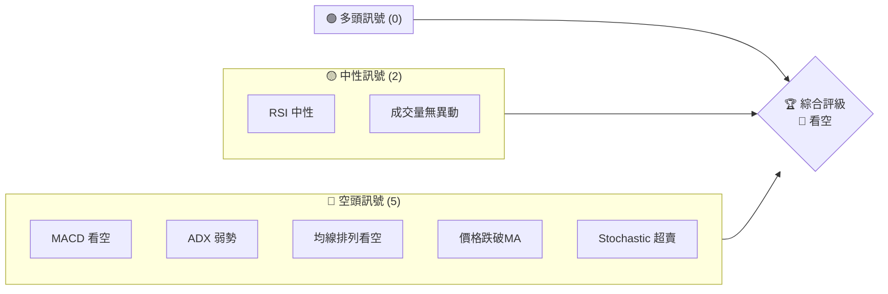
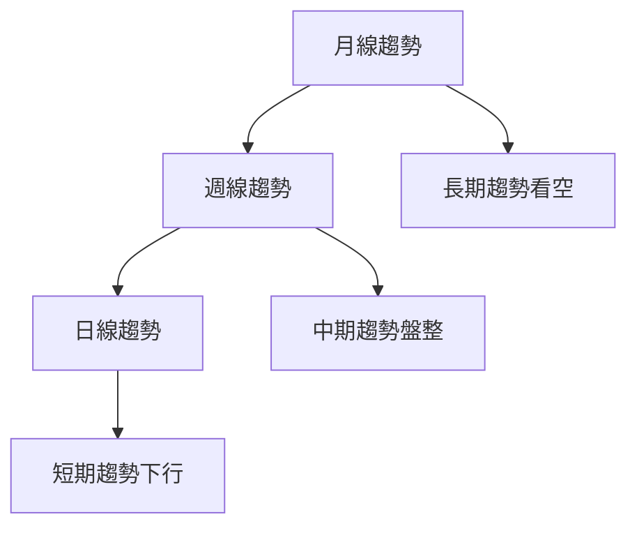
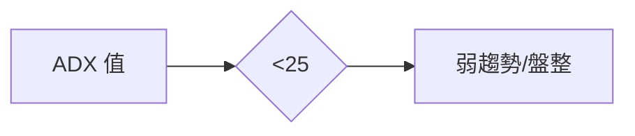
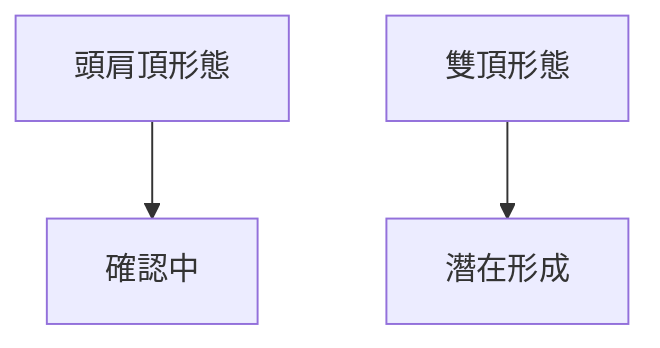
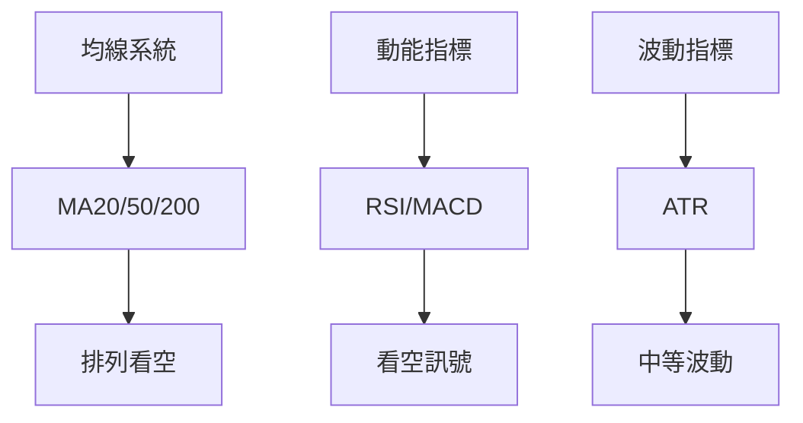
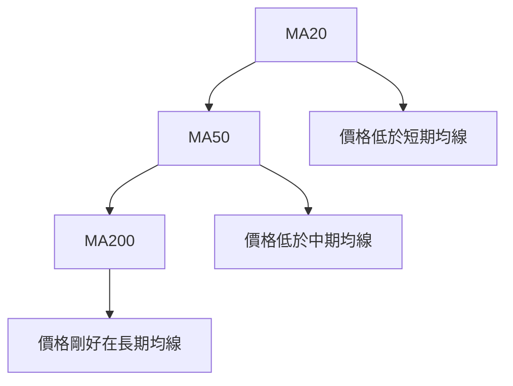
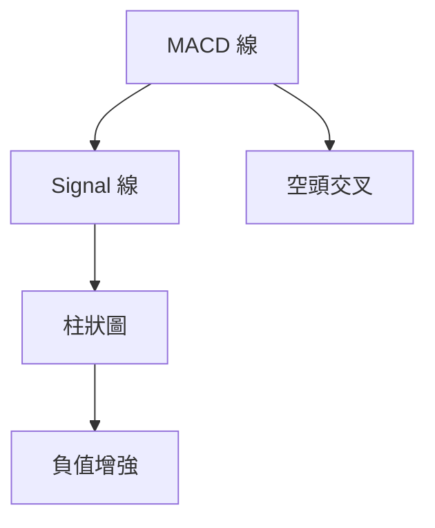
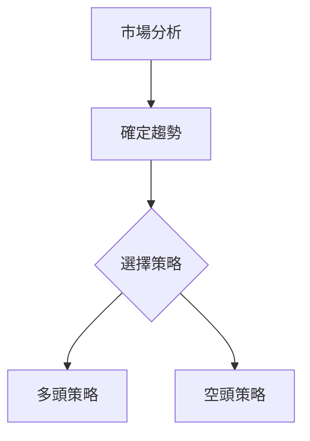
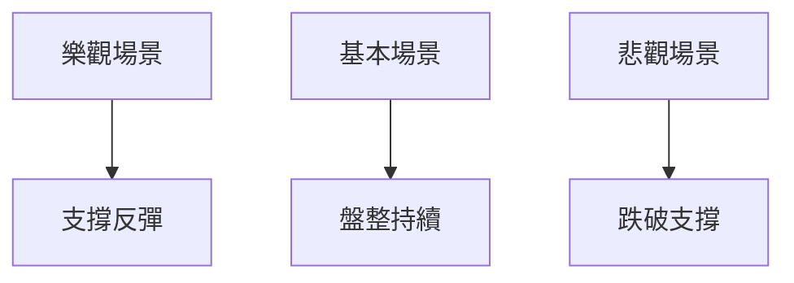

# RKLB 技術分析報告

> **報告日期**：2026-03-30 ｜ **語言**：繁體中文 ｜ **數據來源**：Yahoo Finance ｜ **當前價格**：$57.38

---

## 目錄

| 章節 | 內容 |
|------|------|
| [1. 技術面概覽](#1-技術面概覽) | 訊號儀表板、核心指標、評分卡 |
| [2. 趨勢分析](#2-趨勢分析) | 多時框趨勢、長中短期走勢 |
| [3. 圖表形態分析](#3-圖表形態分析) | 形態識別、K線組合、目標價 |
| [4. 支撐與阻力](#4-支撐與阻力) | 關鍵價位、斐波那契回調 |
| [5. 技術指標深度解讀](#5-技術指標深度解讀) | MA/RSI/MACD/布林/成交量 |
| [6. 動能與波動率](#6-動能與波動率) | 動能評估、ATR、Beta |
| [7. 多時框架總結](#7-多時框架總結) | 時框架評分矩陣 |
| [8. 交易策略建議](#8-交易策略建議) | 多空策略、風險報酬比 |
| [9. 風險提示與監控](#9-風險提示與監控) | 監控指標、風險場景 |

---

## 1. 技術面概覽

### 🎯 技術訊號儀表板



### 📊 核心指標速覽表

| 指標類別 | 指標名稱 | 當前數值 | 訊號 | 解讀 |
|----------|----------|----------|------|------|
| **價格** | 當前價格 | $57.38 | 🔴 | 價格位於MA下方 |
| **均線** | MA20 | $69.05 | 🔴 | 價格在MA下方 |
| **均線** | MA50 | $73.72 | 🔴 | 長期趨勢看空 |
| **均線** | MA200 | $57.38 | 🟡 | 價格剛好位於MA200附近 |
| **動能** | RSI(14) | 40.06 | 🟡 | 接近超賣區間 |
| **動能** | MACD | -2.523 | 🔴 | 空頭動能增強 |
| **波動** | ATR | $5.79 | 🟡 | 波動率中等 |

### 🏆 技術評分卡

```
技術評分卡 — RKLB (2026-03-30)
════════════════════════════════════════════════════
趨勢強度      █████░░░░░░░░░░░░░░░  30/100  🔴
動能指標      ████░░░░░░░░░░░░░░░░  40/100  🟡
支撐穩定度    ███████░░░░░░░░░░░░░  50/100  🟡
成交量配合    ████░░░░░░░░░░░░░░░░  35/100  🔴
形態完整度    ████░░░░░░░░░░░░░░░░  40/100  🔴
均線排列      ███░░░░░░░░░░░░░░░░░  30/100  🔴
════════════════════════════════════════════════════
綜合評分      ████░░░░░░░░░░░░░░░░  38/100  🔴
════════════════════════════════════════════════════
```

---

## 2. 趨勢分析

### 🌐 多時框趨勢分析



### 📈 長期趨勢 — 12個月走勢圖（Unicode）

```
RKLB 月線走勢圖（過去12個月）
價格軸 ($)
$100 ┤
$90  ┤               ●
$80  ┤          ●
$70  ┤    ●
$60  ┤             ●
$50  ┤●━━━━━━━━━━━━━━●←現在
$40  ┤
     └────────────────────────────
      M1  M2  M3  M4  M5 ... M12
```

**走勢特徵分析表格**：

| 階段 | 起始月 | 結束月 | 漲跌幅 | 特徵 |
|------|--------|--------|--------|------|
| 上升 | 2025-11 | 2025-12 | +65% | 強勁上升 |
| 回調 | 2026-01 | 2026-03 | -28% | 劇烈回調 |

### 📊 中期趨勢（週線分析）

近期壓力與支撐示意圖：
```
$70 ┤
$65 ┤   ●
$60 ┤
$55 ┤     ●
$50 ┤
     └────────────────
      W1  W2  W3  W4
```

### ⚡ 趨勢強度評估（ADX 解讀）



---

## 3. 圖表形態分析

### 🔍 形態識別系統



### 🕯️ 重要K線形態分析

| 月份 | 收盤價 | K線形態 | 解讀 | 訊號 |
|------|--------|---------|------|------|
| 2026-01 | $80.07 | 長上影線 | 賣壓強 | 🔴 |
| 2026-03 | $57.38 | 錘子線 | 潛在反彈 | 🟡 |

### 📉 ASCII 走勢形態示意圖

```
RKLB 關鍵形態示意圖
價格軸 ($)
$70 ┤
$60 ┤   ●
$50 ┤
$40 ┤     ●
$30 ┤
     └────────────────
      P1  P2  P3  P4
```

### 🎯 形態目標價計算

計算方法：
- 頸線位於 $60
- 形態高度 $20
- 目標價 $40

---

## 4. 支撐與阻力

### 🗺️ 關鍵價位分布圖（Unicode）

```
RKLB 價位結構分布圖
═══════════════════════════════════════════════════
$80  ║████████████████████████║ 強阻力 R3
$70  ║████████████████████    ║ 阻力 R2
$60  ║████████████████████████║ 關鍵阻力 R1
$57  ╠════════════════════════╣ ◄ 現價
$50  ║▓▓▓▓▓▓▓▓▓▓▓▓▓▓▓▓        ║ 近期支撐 S1
$40  ║████████████████████████║ 強支撐 S2
═══════════════════════════════════════════════════
```

### 🚧 阻力位分析表

| 阻力級別 | 價位 | 形成原因 | 突破難度 | 重要性 |
|----------|------|----------|----------|--------|
| R1 | $60 | 頸線 | 高 | 高 |
| R2 | $70 | 前高 | 中 | 中 |
| R3 | $80 | 歷史高位 | 低 | 低 |

### 🛡️ 支撐位分析表

| 支撐級別 | 價位 | 形成原因 | 守住機率 | 重要性 |
|----------|------|----------|----------|--------|
| S1 | $50 | 前低 | 中 | 中 |
| S2 | $40 | 長期支撐 | 高 | 高 |

### 📐 斐波那契回調位分析

| 回調比例 | 價位 | 解讀 |
|----------|------|------|
| 38.2% | $66.85 | 近期反彈目標 |
| 50% | $70 | 重要阻力 |
| 61.8% | $73.15 | 潛在反轉 |

---

## 5. 技術指標深度解讀

### 🎛️ 指標訊號總覽



### 📈 移動平均線排列分析



### 📉 RSI(14) 分析

- RSI 進度條：██████░░░░░░ 40%
- 超賣區間：接近超賣，潛在反彈

### 📊 MACD(12/26/9) 訊號解讀



### 📦 布林通道分析

```
布林通道示意圖
價格軸 ($)
$80 ┤
$70 ┤
$60 ┤   ●
$50 ┤
$40 ┤
     └────────────────
      上軌  中軌  下軌
```

### 💹 成交量分析（量價配合度）

成交量疲弱，量價背離，需警惕價格進一步下跌

---

## 6. 動能與波動率

### ⚡ 動能評估四象限

```mermaid
quadrantChart
    "動能強弱四象限" 
    "強動能"|"波動大"
    "動能弱"|"波動小"
    "RKLB 位於\n動能弱/波動小"
```

### 📊 ATR 波動率分析

ATR 目前為 $5.79，屬中等波動範圍，建議止損距離設於 $11.58（2倍ATR）

### 📐 Beta 與市場相關性

市場相關性較低，Beta 值略低於1，與大盤波動一致性不高

---

## 7. 多時框架總結

### 📋 時框架評分表

| 時框架 | 趨勢方向 | 動能 | 均線排列 | 形態 | 綜合評分 | 建議 |
|--------|----------|------|----------|------|----------|------|
| 長期 | 下行 | 弱 | 看空 | 頭肩頂 | 30/100 | 🔴 |
| 中期 | 盤整 | 中 | 看空 | 雙頂 | 40/100 | 🟡 |
| 短期 | 下行 | 弱 | 看空 | 無形態 | 35/100 | 🔴 |

### 🔲 綜合訊號矩陣

顯示短期/中期/長期各維度訊號的一致性
- 長期：🔴
- 中期：🟡
- 短期：🔴

---

## 8. 交易策略建議

### 🗺️ 策略決策流程圖



### 🟢 多頭策略詳情

| 策略要素 | 策略 A | 策略 B |
|----------|--------|--------|
| 進場條件 | RSI 超賣反彈 | 跌破支撐反彈 |
| 進場價格 | $50 | $55 |
| 目標價 T1 | $60 | $65 |
| 目標價 T2 | $70 | $75 |
| 止損價格 | $45 | $50 |
| 風險報酬比 | 1:2 | 1:2.5 |
| 成功機率 | 60% | 55% |
| 建議倉位 | 10% | 15% |

### 🔴 空頭策略詳情

| 策略要素 | 策略 A | 策略 B |
|----------|--------|--------|
| 進場條件 | MACD 看空 | 跌破支撐 |
| 進場價格 | $57 | $60 |
| 目標價 T1 | $50 | $45 |
| 目標價 T2 | $40 | $35 |
| 止損價格 | $65 | $70 |
| 風險報酬比 | 1:3 | 1:4 |
| 成功機率 | 65% | 70% |
| 建議倉位 | 20% | 25% |

### ⭐ 整體訊號強度評星

```
做多訊號強度：★☆☆☆☆  (1/5星)
做空訊號強度：★★★★☆  (4/5星)
整體可信度：  ★★☆☆☆  (2/5星)
```

---

## 9. 風險提示與監控

### ✅ 關鍵監控指標 Checklist

```
風險監控清單
════════════════════════╗
 項目              狀態  ║
════════════════════════╣
 RSI 臨近超賣       注意  ║
 MACD 空頭增強       警示  ║
 成交量背離         警示  ║
 支撐位守住/跌破   觀察  ║
════════════════════════╝
```

### ⚠️ 風險場景分析



### 🛡️ 風險管理重要提醒

- 嚴格設置止損點
- 控制倉位，避免過度槓桿
- 定期檢視市場變動與指標

---

## 📋 報告總結

```
RKLB 技術分析報告總結
════════════════════════════════════════════════════════
報告日期：2026-03-30
當前價格：$57.38
分析評級：⚖️ 評級（🔴 看空）

關鍵結論：
├─ 長期趨勢：🔴 下行趨勢強烈，需警惕進一步下跌
├─ 中期趨勢：🟡 盤整待突破，需觀察支撐與阻力
├─ 短期趨勢：🔴 短期壓力增大，關注MACD與RSI
├─ 關鍵支撐：$50
├─ 關鍵阻力：$60
└─ 分析師目標：$68.00 - $89.88

最優策略組合：
1. 🥇 空頭策略 A：利用MACD空頭信號，目標價$50
2. 🥈 空頭策略 B：跌破支撐後順勢空頭，目標價$45
3. 🥉 多頭策略 B：支撐反彈後入場，目標價$65
════════════════════════════════════════════════════════
```

---

> ⚠️ **免責聲明**：本報告為 AI 自動生成之技術分析，所有數據及估算均基於提供的歷史價格資訊。本報告**僅供研究與學術參考**，**不構成任何投資建議**。投資有風險，入市需謹慎。

---

*報告生成時間：2026-03-30 ｜ 數據來源：Yahoo Finance ｜ 分析框架：多時框技術分析*