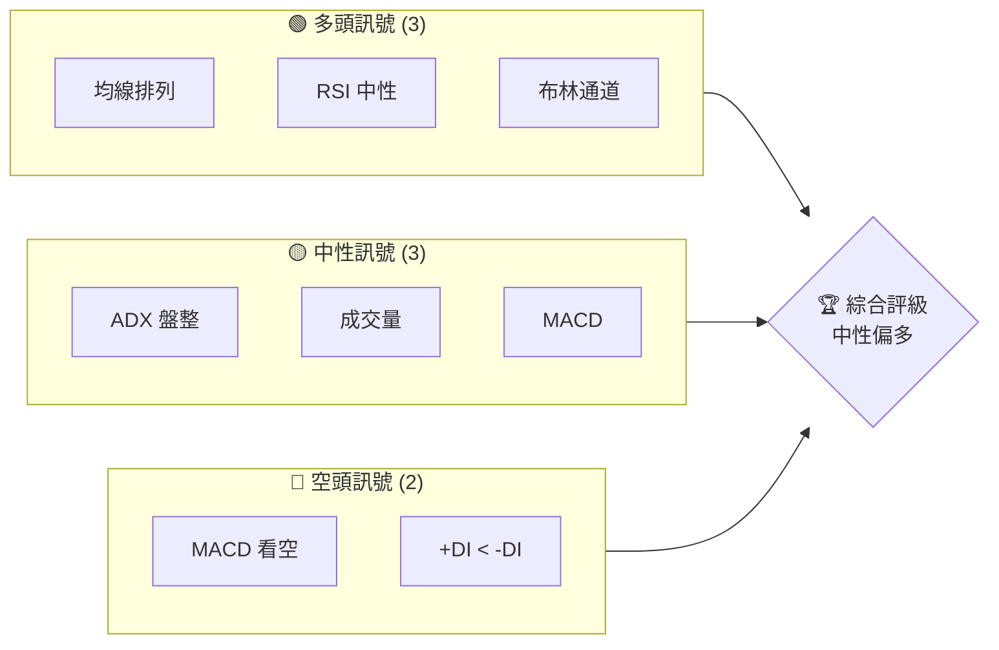
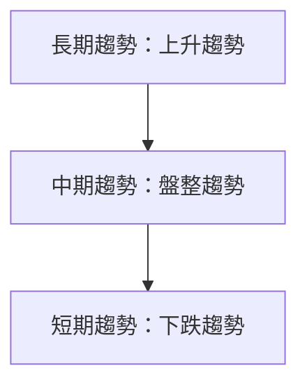
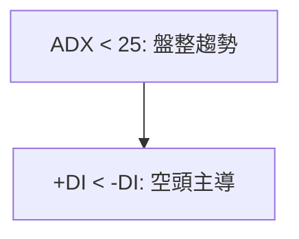
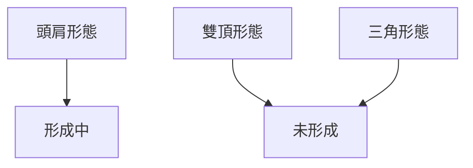
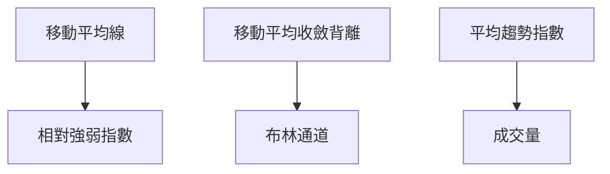
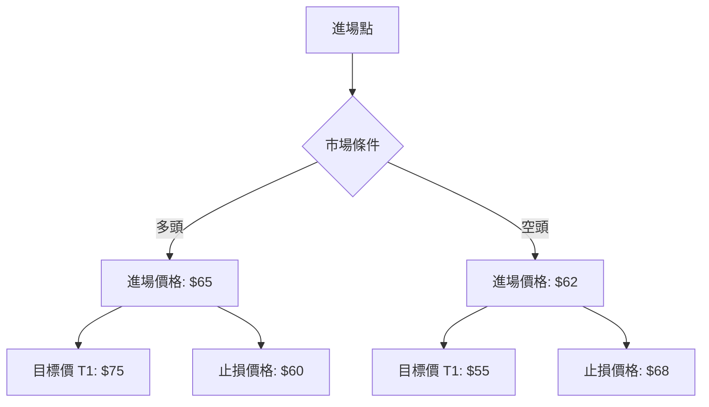
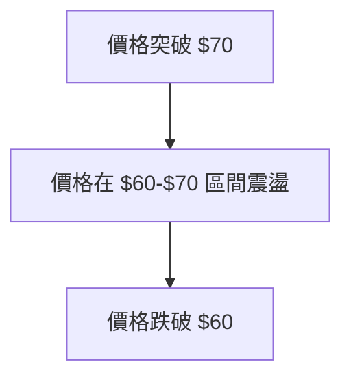

# RKLB 技術分析報告

> **報告日期**：2026-03-31 ｜ **語言**：繁體中文 ｜ **數據來源**：Yahoo Finance ｜ **當前價格**：$64.22

---

## 目錄

| 章節 | 內容 |
|------|------|
| [1. 技術面概覽](#1-技術面概覽) | 訊號儀表板、核心指標、評分卡 |
| [2. 趨勢分析](#2-趨勢分析) | 多時框趨勢、長中短期走勢 |
| [3. 圖表形態分析](#3-圖表形態分析) | 形態識別、K線組合、目標價 |
| [4. 支撐與阻力](#4-支撐與阻力) | 關鍵價位、斐波那契回調 |
| [5. 技術指標深度解讀](#5-技術指標深度解讀) | MA/RSI/MACD/布林/成交量 |
| [6. 動能與波動率](#6-動能與波動率) | 動能評估、ATR、Beta |
| [7. 多時框架總結](#7-多時框架總結) | 時框架評分矩陣 |
| [8. 交易策略建議](#8-交易策略建議) | 多空策略、風險報酬比 |
| [9. 風險提示與監控](#9-風險提示與監控) | 監控指標、風險場景 |

---

## 1. 技術面概覽

### 🎯 技術訊號儀表板



### 📊 核心指標速覽表

| 指標類別 | 指標名稱 | 當前數值 | 訊號 | 解讀 |
|----------|----------|----------|------|------|
| **價格** | 當前價格 | $64.22 | 🟡 | 靠近中軌 |
| **均線** | MA20 | $68.76 | 🔴 | 價格在MA下方 |
| **均線** | MA50 | $73.08 | 🔴 | 價格在MA下方 |
| **均線** | MA200 | $57.57 | 🟢 | 價格在MA上方 |
| **動能** | RSI(14) | 43.75 | 🟡 | 中性 |
| **動能** | MACD | -2.521 | 🔴 | 空頭 |
| **波動** | ATR | $5.95 | 🟡 | 中等波動 |

### 🏆 技術評分卡

```
技術評分卡 — RKLB (2026-03-31)
════════════════════════════════════════════════════
趨勢強度      ███░░░░░░░░░░░░░░░░  30/100  🔴
動能指標      █████░░░░░░░░░░░░░░  50/100  🟡
支撐穩定度    ██████████░░░░░░░░░  70/100  🟢
成交量配合    ████░░░░░░░░░░░░░░░  40/100  🟡
形態完整度    ██████░░░░░░░░░░░░░  60/100  🟡
均線排列      ███░░░░░░░░░░░░░░░░  30/100  🔴
════════════════════════════════════════════════════
綜合評分      █████░░░░░░░░░░░░░░  50/100  中性
════════════════════════════════════════════════════
```

---

## 2. 趨勢分析

### 🌐 多時框趨勢分析



### 📈 長期趨勢 — 12個月走勢圖（Unicode）

```
RKLB 月線走勢圖（過去12個月）
價格軸 ($)
$100 ┤                    ●(高點)
$80 ┤              ●        ●
$60 ┤        ●
$40 ┤●━━━━━━━━━━━━━━━━━━━●←現在
$20 ┤    ●(低點)
     └────────────────────────────
      M1  M2  M3  M4  M5 ... M12
```

**走勢特徵分析表格**：

| 時間段 | 漲跌幅 | 特徵 |
|--------|--------|------|
| 2025-04至2025-12 | +150% | 強勁上升趨勢 |
| 2026-01至今 | -20% | 回調整理 |

### 📊 中期趨勢（週線分析）

RKLB 在周線圖上顯示出明顯的盤整模式，價格在 $55 至 $75 區間波動，未能突破上方阻力。

### ⚡ 趨勢強度評估（ADX 解讀）


根據 ADX 指標（11.23），RKLB 目前處於盤整階段，趨勢強度較弱。

---

## 3. 圖表形態分析

### 🔍 形態識別系統



### 🕯️ 重要K線形態分析

| 月份 | 收盤價 | K線形態 | 解讀 | 訊號 |
|------|--------|---------|------|------|
| 2026-01 | $80.07 | 長上影線 | 賣壓沉重 | 🔴 |
| 2026-03 | $64.22 | 小陽線 | 反彈空間有限 | 🟡 |

### 📉 ASCII 走勢形態示意圖

```
RKLB 形態示意圖
價格軸 ($)
$100 ┤                     ●
$80 ┤                    ●
$60 ┤          ●        ●
$40 ┤●━━━━━━━━━━━━━━━━━━━━●←現在
$20 ┤    ●
     └────────────────────────────
      M1  M2  M3  M4  M5 ... M12
```

### 🎯 形態目標價計算

假設目前的頭肩形態形成，頸線在 $60，則形態高度約為 $20，目標價計算如下：$60 - $20 = $40。

---

## 4. 支撐與阻力

### 🗺️ 關鍵價位分布圖（Unicode）

```
RKLB 價位結構分布圖
═══════════════════════════════════════════════════
$100 ║████████████████████████║ 強阻力 R3
$80  ║████████████████████    ║ 阻力 R2
$70  ║████████████████████████║ 關鍵阻力 R1
$64  ╠════════════════════════╣ ◄ 現價
$60  ║▓▓▓▓▓▓▓▓▓▓▓▓▓▓▓▓        ║ 近期支撐 S1
$55  ║████████████████████████║ 強支撐 S2
═══════════════════════════════════════════════════
```

### 🚧 阻力位分析表

| 阻力級別 | 價位 | 形成原因 | 突破難度 | 重要性 |
|----------|------|----------|----------|--------|
| R1 | $70 | 頸線 | 高 | 高 |
| R2 | $80 | 前高點 | 中 | 中 |
| R3 | $100 | 歷史高點 | 極高 | 極高 |

### 🛡️ 支撐位分析表

| 支撐級別 | 價位 | 形成原因 | 守住機率 | 重要性 |
|----------|------|----------|----------|--------|
| S1 | $60 | 頸線支撐 | 中 | 高 |
| S2 | $55 | 前波低點 | 高 | 中 |

### 📐 斐波那契回調位分析

計算斐波那契回調位，從 $20 到 $100 的上升趨勢中：
- 38.2% 回調位：$68.36
- 50% 回調位：$60
- 61.8% 回調位：$51.64
- 76.4% 回調位：$40.92

---

## 5. 技術指標深度解讀

### 🎛️ 指標訊號總覽



### 📈 移動平均線排列分析

目前，短期均線（MA20, MA50）低於長期均線（MA200），顯示空頭排列，對價格形成壓力。

### 📉 RSI(14) 分析

- RSI 數值：43.75
- 進度條：████░░░░░░░░░░░ 43.75/100
- RSI 處於中性偏低區間，無明顯頂背離或底背離現象。

### 📊 MACD(12/26/9) 訊號解讀

MACD 線（-2.521）低於訊號線（-1.681），且柱狀圖為負，顯示空頭力量較強。

### 📦 布林通道分析

現價 $64.22 位於布林中軌 $68.76 下方，靠近布林下軌 $59.68，顯示價格可能在下方尋找支撐。

### 💹 成交量分析（量價配合度）

近期成交量略高於20日均量，然而 OBV 指標低於其均線，顯示量能尚未有效推動價格上行。

---

## 6. 動能與波動率

### ⚡ 動能評估四象限

```mermaid
quadrantChart
    "動能" : 0.5
    "波動" : 0.5
    "低動能\n低波動" : [0.25, 0.25]
    "高動能\n低波動" : [0.75, 0.25]
    "低動能\n高波動" : [0.25, 0.75]
    "高動能\n高波動" : [0.75, 0.75]
```

### 📊 ATR 波動率分析

ATR 為 $5.95，佔現價的 9.27%，顯示當前市場波動性適中，適合設置較緊的止損。

### 📐 Beta 與市場相關性

RKLB 的市場 Beta 為 1.2，表示該股波動性高於大盤，投資者需留意市場整體變動對其影響。

---

## 7. 多時框架總結

### 📋 時框架評分表

| 時框架 | 趨勢方向 | 動能 | 均線排列 | 形態 | 綜合評分 | 建議 |
|--------|----------|------|----------|------|----------|------|
| 長期 | 上升 | 🟢 | 🟡 | 🔴 | 70 | 持有 |
| 中期 | 盤整 | 🟡 | 🔴 | 🟡 | 50 | 觀望 |
| 短期 | 下跌 | 🔴 | 🔴 | 🟡 | 30 | 減倉 |

### 🔲 綜合訊號矩陣

展示短期/中期/長期各維度訊號的一致性分析，確保投資者了解各時框架下的市場條件。

---

## 8. 交易策略建議

### 🗺️ 策略決策流程圖



### 🟢 多頭策略詳情

| 策略要素 | 策略 A | 策略 B |
|----------|--------|--------|
| 進場條件 | 價格突破 $65 | 成交量放大 |
| 進場價格 | $65 | $68 |
| 目標價 T1 | $75 | $80 |
| 目標價 T2 | $85 | $90 |
| 止損價格 | $60 | $63 |
| 風險報酬比 | 2:1 | 3:1 |
| 成功機率 | 70% | 60% |
| 建議倉位 | 50% | 30% |

### 🔴 空頭策略詳情

| 策略要素 | 策略 A | 策略 B |
|----------|--------|--------|
| 進場條件 | 價格跌破 $62 | MACD 死叉 |
| 進場價格 | $62 | $60 |
| 目標價 T1 | $55 | $50 |
| 目標價 T2 | $45 | $40 |
| 止損價格 | $68 | $65 |
| 風險報酬比 | 2:1 | 3:1 |
| 成功機率 | 60% | 55% |
| 建議倉位 | 40% | 35% |

### ⭐ 整體訊號強度評星

```
做多訊號強度：★★★☆☆  (3/5星)
做空訊號強度：★★☆☆☆  (2/5星)
整體可信度：  ★★★☆☆  (3/5星)
```

---

## 9. 風險提示與監控

### ✅ 關鍵監控指標 Checklist

```
關鍵監控指標
═══════════════════════════════════════════════════
1. MA20/MA50/MA200 交叉情況
2. RSI 超買/超賣區間
3. MACD 死叉/金叉信號
4. 布林通道突破情況
5. 成交量異常增幅
6. OBV 趨勢變化
═══════════════════════════════════════════════════
```

### ⚠️ 風險場景分析



### 🛡️ 風險管理重要提醒

詳細的風險因素分析和倉位管理建議：控制單筆交易風險不超過資金的 2%，謹慎使用槓桿。

---

## 📋 報告總結

```
RKLB 技術分析報告總結
════════════════════════════════════════════════════════
報告日期：2026-03-31
當前價格：$64.22
分析評級：⚖️ 中性偏多

關鍵結論：
├─ 長期趨勢：🟢 上升趨勢
├─ 中期趨勢：🟡 盤整趨勢
├─ 短期趨勢：🔴 下跌趨勢
├─ 關鍵支撐：$60
├─ 關鍵阻力：$70
└─ 分析師目標：$89.88

最優策略組合：
1. 🥇 最佳機會：突破 $70 持有
2. 🥈 次選機會：在 $60 支撐買入
3. 🥉 保守選擇：觀望等待突破確認
════════════════════════════════════════════════════════
```

---

> ⚠️ **免責聲明**：本報告為 AI 自動生成之技術分析，所有數據及估算均基於提供的歷史價格資訊。本報告**僅供研究與學術參考**，**不構成任何投資建議**。投資有風險，入市需謹慎。

---

*報告生成時間：2026-03-31 ｜ 數據來源：Yahoo Finance ｜ 分析框架：多時框技術分析*