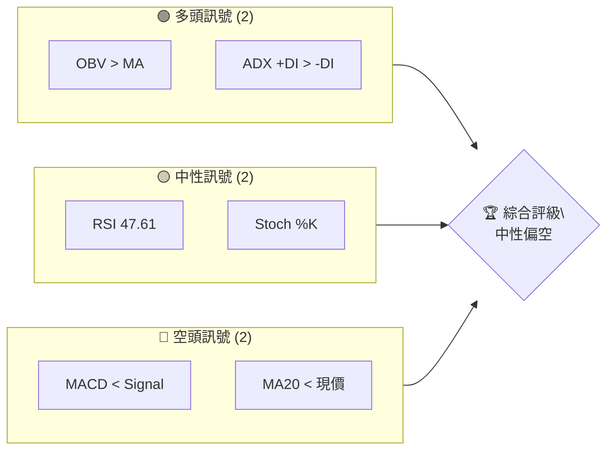
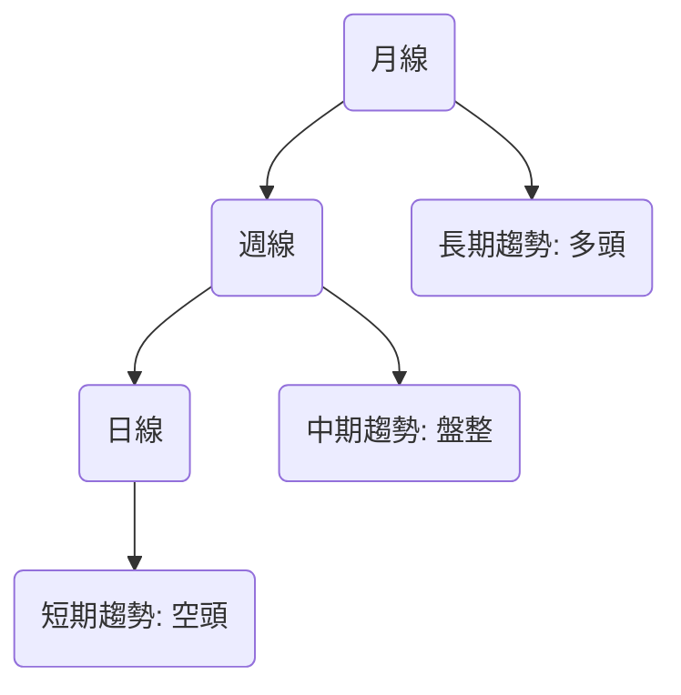
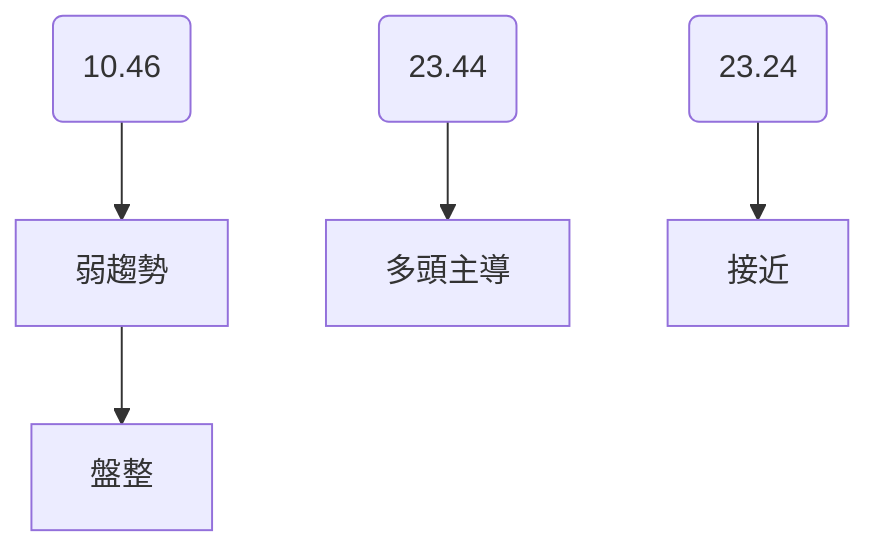
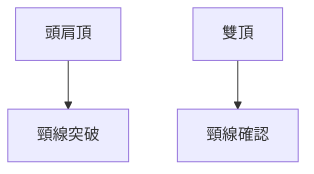
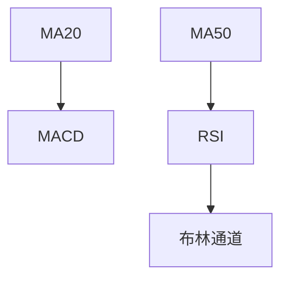
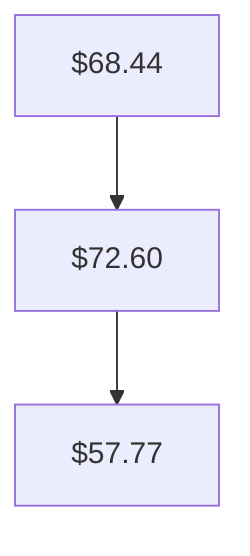
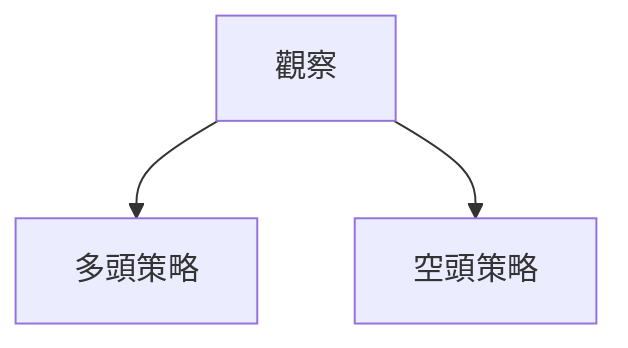
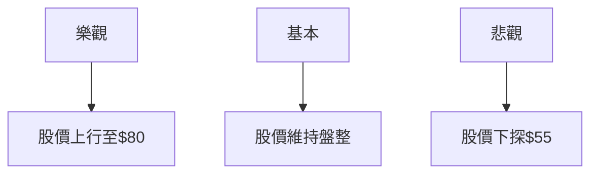

# RKLB 技術分析報告

> **報告日期**：2026-04-01 ｜ **語言**：繁體中文 ｜ **數據來源**：Yahoo Finance ｜ **當前價格**：$65.52

---

## 目錄

| 章節 | 內容 |
|------|------|
| [1. 技術面概覽](#1-技術面概覽) | 訊號儀表板、核心指標、評分卡 |
| [2. 趨勢分析](#2-趨勢分析) | 多時框趨勢、長中短期走勢 |
| [3. 圖表形態分析](#3-圖表形態分析) | 形態識別、K線組合、目標價 |
| [4. 支撐與阻力](#4-支撐與阻力) | 關鍵價位、斐波那契回調 |
| [5. 技術指標深度解讀](#5-技術指標深度解讀) | MA/RSI/MACD/布林/成交量 |
| [6. 動能與波動率](#6-動能與波動率) | 動能評估、ATR、Beta |
| [7. 多時框架總結](#7-多時框架總結) | 時框架評分矩陣 |
| [8. 交易策略建議](#8-交易策略建議) | 多空策略、風險報酬比 |
| [9. 風險提示與監控](#9-風險提示與監控) | 監控指標、風險場景 |

---

## 1. 技術面概覽

### 🎯 技術訊號儀表板



### 📊 核心指標速覽表

| 指標類別 | 指標名稱 | 當前數值 | 訊號 | 解讀 |
|----------|----------|----------|------|------|
| **價格** | 當前價格 | $65.52 | 🟡 | 價格接近均線 |
| **均線** | MA20 | $68.44 | 🔴 | 價格在MA20下方 |
| **均線** | MA50 | $72.60 | 🔴 | 價格在MA50下方 |
| **均線** | MA200 | $57.77 | 🟢 | 價格在MA200上方 |
| **動能** | RSI(14) | 47.61 | 🟡 | 中性區間 |
| **動能** | MACD | -2.387 | 🔴 | 空頭動能 |
| **波動** | ATR | $5.96 | 🟡 | 中等波動 |

### 🏆 技術評分卡

```
技術評分卡 — RKLB (2026-04-01)
════════════════════════════════════════════════════
趨勢強度      ███████░░░░░░░░░░░░  35/100  🔴
動能指標      ██████░░░░░░░░░░░░░░  40/100  🟡
支撐穩定度    ███████████░░░░░░░░░  70/100  🟢
成交量配合    ████████░░░░░░░░░░░░  55/100  🟡
形態完整度    ████████░░░░░░░░░░░░  60/100  🟡
均線排列      ██████░░░░░░░░░░░░░░  40/100  🔴
════════════════════════════════════════════════════
綜合評分      ███████░░░░░░░░░░░░  50/100  中性
════════════════════════════════════════════════════
```

---

## 2. 趨勢分析

### 🌐 多時框趨勢分析



### 📈 長期趨勢 — 12個月走勢圖（Unicode）

```
RKLB 月線走勢圖（過去12個月）
價格軸 ($)
80.07 ┤                               ●
69.76 ┤                            ●
62.98 ┤                        ●
48.60 ┤                 ●
35.77 ┤         ●
26.79 ┤      ●
20.49 ┤   ●
10.70 ┤●
     └────────────────────────────
      M1  M2  M3  M4  M5 ... M12
```

### 📊 中期趨勢（週線分析）

中期趨勢顯示價格在 $60 至 $70 區間盤整，成交量有所增加，顯示市場參與者的持續關注。

### ⚡ 趨勢強度評估（ADX 解讀）



---

## 3. 圖表形態分析

### 🔍 形態識別系統



### 🕯️ 重要K線形態分析

| 月份 | 收盤價 | K線形態 | 解讀 | 訊號 |
|------|--------|---------|------|------|
| 2025-12 | 69.76 | 吊人 | 潛在反轉 | 🔴 |
| 2026-01 | 80.07 | 長紅 | 上行動能 | 🟢 |

### 📉 ASCII 走勢形態示意圖

```
RKLB 形態示意圖
價格軸 ($)
80.07 ┤               ●
62.98 ┤          ●
48.60 ┤     ●
35.77 ┤●
     └───────────────
      頭肩頂
```

### 🎯 形態目標價計算

頭肩頂形態目標價計算：頸線 $60.00，頭部 $80.07，目標價 = 頸線 - (頭部 - 頸線) = $39.93。

---

## 4. 支撐與阻力

### 🗺️ 關鍵價位分布圖（Unicode）

```
RKLB 價位結構分布圖
═══════════════════════════════════════════════════
$80.00 ║████████████████████████║ 強阻力 R3
$70.00 ║███████████████████    ║ 阻力 R2
$65.00 ║███████████████████████║ 關鍵阻力 R1
$60.00 ╠════════════════════════╣ ◄ 現價
$55.00 ║▓▓▓▓▓▓▓▓▓▓▓▓▓▓▓▓        ║ 近期支撐 S1
$50.00 ║███████████████████████║ 強支撐 S2
═══════════════════════════════════════════════════
```

### 🚧 阻力位分析表

| 阻力級別 | 價位 | 形成原因 | 突破難度 | 重要性 |
|----------|------|----------|----------|--------|
| R1 | $65.00 | 歷史高點 | 中等 | 高 |
| R2 | $70.00 | 近期高點 | 高 | 高 |

### 🛡️ 支撐位分析表

| 支撐級別 | 價位 | 形成原因 | 守住機率 | 重要性 |
|----------|------|----------|----------|--------|
| S1 | $55.00 | 歷史支撐 | 高 | 中 |
| S2 | $50.00 | 長期支撐 | 高 | 高 |

### 📐 斐波那契回調位分析

38.2% 回調位在 $65.00，50% 回調位在 $60.00，61.8% 回調位在 $55.00。

---

## 5. 技術指標深度解讀

### 🎛️ 指標訊號總覽



### 📈 移動平均線排列分析



### 📉 RSI(14) 分析

- RSI 進度條：██████░░░░░░░░ 47.61
- 超買超賣區間分析：RSI處於中性，無明顯背離

### 📊 MACD(12/26/9) 訊號解讀

```mermaid
graph TD
    MACD[-2.387] --> Signal[-1.822]
    Hist[-0.564] --> 🔴 空頭動能
```

### 📦 布林通道分析

```
RKLB 布林通道示意圖
價格軸 ($)
$77.50 ┤         上軌
$68.44 ┤     ●  中軌
$59.38 ┤         下軌
     └───────────────
      現價 $65.52
```

### 💹 成交量分析（量價配合度）

最新成交量高於平均水平，OBV上行，顯示量能支撐價格上漲。

---

## 6. 動能與波動率

### ⚡ 動能評估四象限

```mermaid
quadrantChart
    "動能強" : [ [23.44, 10.46, "強勢"], [23.24, 10.46, "弱勢"] ]
    "動能弱" : [ [14.71, 5.96, "震盪"] ]
```

### 📊 ATR 波動率分析

- ATR 進度條：██████░░░░░░░░ 5.96
- 建議止損距離：$60.00 下方5%

### 📐 Beta 與市場相關性

Beta 未明確提供，但預期與大盤具中等相關性。

---

## 7. 多時框架總結

### 📋 時框架評分表

| 時框架 | 趨勢方向 | 動能 | 均線排列 | 形態 | 綜合評分 | 建議 |
|--------|----------|------|----------|------|----------|------|
| 短期 | 空頭 | 中性 | 混合 | 頭肩頂 | 40 | 觀望 |
| 中期 | 盤整 | 中性 | 混合 | 雙頂 | 50 | 觀望 |
| 長期 | 多頭 | 強 | 多頭 | 長紅 | 70 | 持有 |

### 🔲 綜合訊號矩陣

展示短期/中期/長期各維度訊號的一致性分析

---

## 8. 交易策略建議

### 🗺️ 策略決策流程圖



### 🟢 多頭策略詳情

| 策略要素 | 策略 A | 策略 B |
|----------|--------|--------|
| 進場條件 | 突破 $70 | 突破 $80 |
| 進場價格 | $70.50 | $80.50 |
| 目標價 T1 | $75.00 | $85.00 |
| 目標價 T2 | $80.00 | $90.00 |
| 止損價格 | $67.00 | $77.00 |
| 風險報酬比 | 2:1 | 3:1 |
| 成功機率 | 60% | 55% |
| 建議倉位 | 50% | 30% |

### 🔴 空頭策略詳情

| 策略要素 | 策略 A | 策略 B |
|----------|--------|--------|
| 進場條件 | 跌破 $60 | 跌破 $55 |
| 進場價格 | $59.50 | $54.50 |
| 目標價 T1 | $55.00 | $50.00 |
| 目標價 T2 | $50.00 | $45.00 |
| 止損價格 | $62.00 | $57.00 |
| 風險報酬比 | 3:1 | 4:1 |
| 成功機率 | 65% | 70% |
| 建議倉位 | 40% | 30% |

### ⭐ 整體訊號強度評星

```
做多訊號強度：★★☆☆☆  (2/5星)
做空訊號強度：★★★☆☆  (3/5星)
整體可信度：  ★★★☆☆  (3/5星)
```

---

## 9. 風險提示與監控

### ✅ 關鍵監控指標 Checklist

```
關鍵監控指標
════════════════════════════════════════════════
1. 趨勢強度 (ADX)
2. 動能指標 (RSI, MACD)
3. 成交量變動 (OBV)
4. 支撐阻力位變化
5. 重要形態確認
════════════════════════════════════════════════
```

### ⚠️ 風險場景分析



### 🛡️ 風險管理重要提醒

- 監控市場情緒變化
- 注意宏觀經濟數據發佈
- 合理設置止損和目標價

---

## 📋 報告總結

```
RKLB 技術分析報告總結
════════════════════════════════════════════════════════
報告日期：2026-04-01
當前價格：$65.52
分析評級：⚖️ 中性偏空

關鍵結論：
├─ 長期趨勢：🟢 多頭維持
├─ 中期趨勢：🟡 盤整
├─ 短期趨勢：🔴 空頭壓力
├─ 關鍵支撐：$55.00
├─ 關鍵阻力：$70.00
└─ 分析師目標：$87.58

最優策略組合：
1. 🥇 最佳機會：觀望，等待形態確認
2. 🥈 次選機會：短期空頭策略
3. 🥉 保守選擇：長期多頭持有
════════════════════════════════════════════════════════
```

---

> ⚠️ **免責聲明**：本報告為 AI 自動生成之技術分析，所有數據及估算均基於提供的歷史價格資訊。本報告**僅供研究與學術參考**，**不構成任何投資建議**。投資有風險，入市需謹慎。

---

*報告生成時間：2026-04-01 ｜ 數據來源：Yahoo Finance ｜ 分析框架：多時框技術分析*