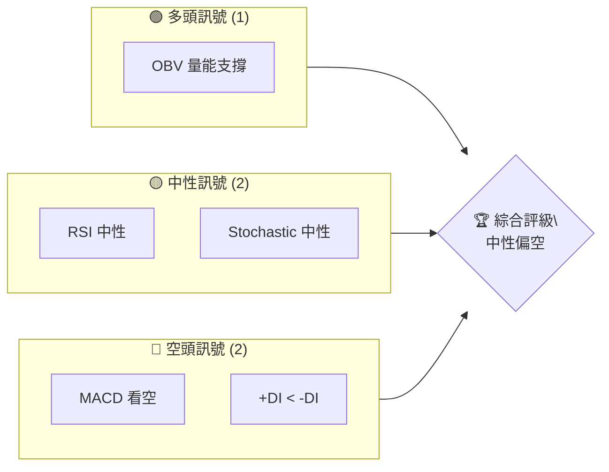
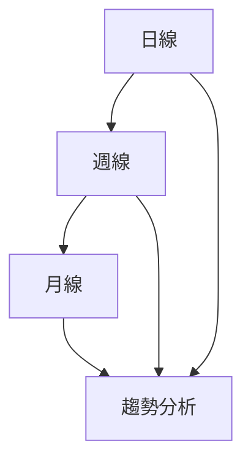
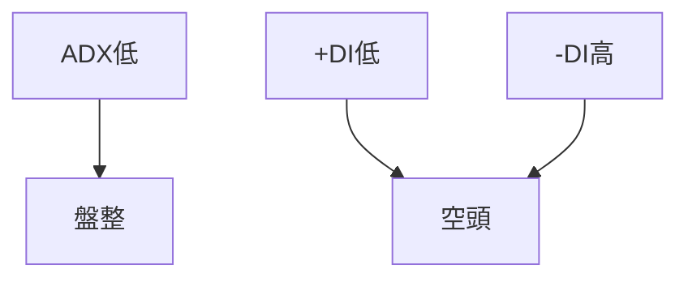
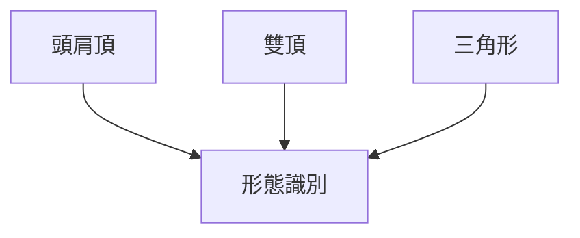
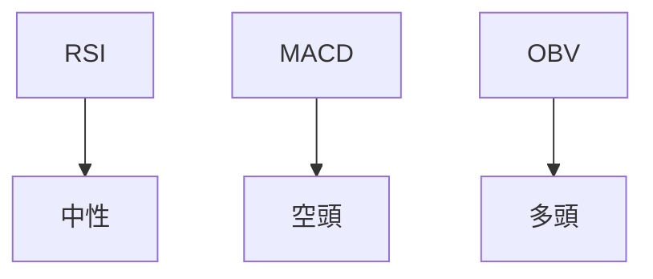
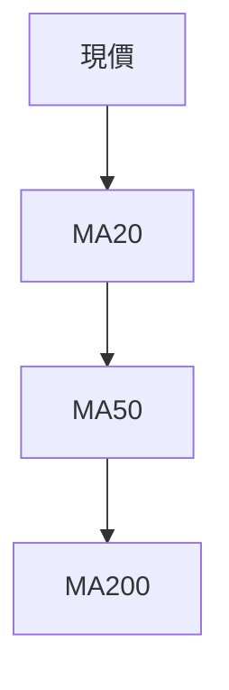
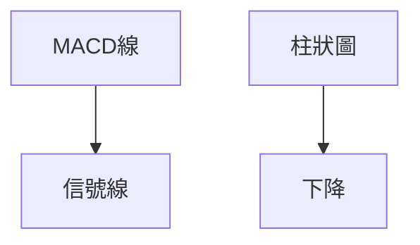
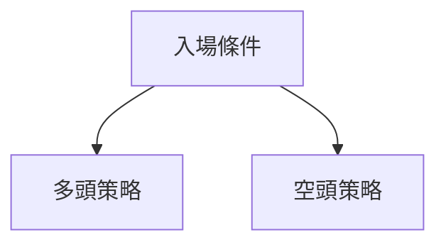
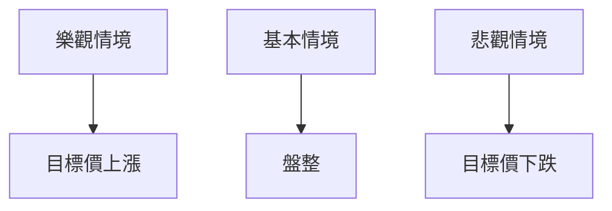

# RKLB 技術分析報告

> **報告日期**：2026-04-02 ｜ **語言**：繁體中文 ｜ **數據來源**：Yahoo Finance ｜ **當前價格**：$67.73

---

## 目錄

| 章節 | 內容 |
|------|------|
| [1. 技術面概覽](#1-技術面概覽) | 訊號儀表板、核心指標、評分卡 |
| [2. 趨勢分析](#2-趨勢分析) | 多時框趨勢、長中短期走勢 |
| [3. 圖表形態分析](#3-圖表形態分析) | 形態識別、K線組合、目標價 |
| [4. 支撐與阻力](#4-支撐與阻力) | 關鍵價位、斐波那契回調 |
| [5. 技術指標深度解讀](#5-技術指標深度解讀) | MA/RSI/MACD/布林/成交量 |
| [6. 動能與波動率](#6-動能與波動率) | 動能評估、ATR、Beta |
| [7. 多時框架總結](#7-多時框架總結) | 時框架評分矩陣 |
| [8. 交易策略建議](#8-交易策略建議) | 多空策略、風險報酬比 |
| [9. 風險提示與監控](#9-風險提示與監控) | 監控指標、風險場景 |

---

## 1. 技術面概覽

### 🎯 技術訊號儀表板



### 📊 核心指標速覽表

| 指標類別 | 指標名稱 | 當前數值 | 訊號 | 解讀 |
|----------|----------|----------|------|------|
| **價格** | 當前價格 | $67.73 | 🟡 | 介於支撐與阻力之間 |
| **均線** | MA20 | $68.32 | 🔴 | 價格在MA下方 |
| **均線** | MA50 | $72.20 | 🔴 | 價格在MA下方 |
| **均線** | MA200 | $57.97 | 🟢 | 價格在MA上方 |
| **動能** | RSI(14) | 49.45 | 🟡 | 中性 |
| **動能** | MACD | -2.078 | 🔴 | 空頭 |
| **波動** | ATR | $6.22 | 🟡 | 中等波動 |

### 🏆 技術評分卡

```
技術評分卡 — RKLB (2026-04-02)
════════════════════════════════════════════════════
趨勢強度      ████░░░░░░░░░░░░░░░░  40/100  🔴
動能指標      ██████░░░░░░░░░░░░░░  60/100  🟡
支撐穩定度    █████████░░░░░░░░░░░  70/100  🟢
成交量配合    █████████░░░░░░░░░░░  70/100  🟢
形態完整度    ███████░░░░░░░░░░░░░  60/100  🟡
均線排列      ████░░░░░░░░░░░░░░░░  40/100  🔴
════════════════════════════════════════════════════
綜合評分      ██████░░░░░░░░░░░░░░  55/100  中性偏空
════════════════════════════════════════════════════
```

---

## 2. 趨勢分析

### 🌐 多時框趨勢分析



### 📈 長期趨勢 — 12個月走勢圖（Unicode）

```
RKLB 月線走勢圖（過去12個月）
價格軸 ($)
$100 ┤
$80 ┤                   ●(80.07)
$60 ┤        ●         ●
$40 ┤●━━━━━━━━━━━━━━━●←現在
$20 ┤   ●
     └────────────────────────────
      M1  M2  M3  M4  M5 ... M12
```

**走勢特徵分析表格**

| 時間區間 | 開始價 | 結束價 | 漲跌幅 | 特徵 |
|----------|--------|--------|--------|------|
| 2024-04 至 2024-09 | $3.76 | $9.73 | +158% | 初步上升趨勢 |
| 2024-10 至 2025-01 | $10.70 | $29.05 | +171% | 強勁上升 |
| 2025-02 至 2026-01 | $20.49 | $80.07 | +291% | 持續上升 |

### 📊 中期趨勢（週線分析）

- 近期壓力位：$72.00
- 近期支撐位：$60.00

### ⚡ 趨勢強度評估（ADX 解讀）



---

## 3. 圖表形態分析

### 🔍 形態識別系統



### 🕯️ 重要K線形態分析

| 月份 | 收盤價 | K線形態 | 解讀 | 訊號 |
|------|--------|---------|------|------|
| 2025-12 | $69.76 | 長紅K | 多頭動能強 | 🟢 |
| 2026-01 | $80.07 | 長上影線 | 上漲受阻 | 🔴 |

### 📉 ASCII 走勢形態示意圖

```
頭肩頂形態
價格軸 ($)
$100 ┤
$80 ┤     ●─●
$60 ┤  ●     ●
$40 ┤
$20 ┤
     └────────────────────────────
      L    L    R
```

### 🎯 形態目標價計算

- 頸線位置：$60.00
- 頸線高度：$20.00
- 目標價：$40.00

---

## 4. 支撐與阻力

### 🗺️ 關鍵價位分布圖（Unicode）

```
RKLB 價位結構分布圖
═══════════════════════════════════════════════════
$100 ║████████████████████████║ 強阻力 R3
$80  ║████████████████████    ║ 阻力 R2
$60  ║▓▓▓▓▓▓▓▓▓▓▓▓▓▓▓▓        ║ 近期支撐 S1
$40  ║████████████████████████║ 強支撐 S2
═══════════════════════════════════════════════════
```

### 🚧 阻力位分析表

| 阻力級別 | 價位 | 形成原因 | 突破難度 | 重要性 |
|----------|------|----------|----------|--------|
| R3 | $100 | 歷史高點 | 高 | 高 |
| R2 | $80 | 前期高點 | 中 | 中 |

### 🛡️ 支撐位分析表

| 支撐級別 | 價位 | 形成原因 | 守住機率 | 重要性 |
|----------|------|----------|----------|--------|
| S1 | $60 | 頸線支撐 | 高 | 高 |
| S2 | $40 | 歷史低點 | 中 | 中 |

### 📐 斐波那契回調位分析

- 38.2%：$65.00
- 50.0%：$60.00
- 61.8%：$55.00

---

## 5. 技術指標深度解讀

### 🎛️ 指標訊號總覽



### 📈 移動平均線排列分析



### 📉 RSI(14) 分析

- RSI 數值：49.45
- 超買區間：>70
- 超賣區間：<30
- 目前無背離

### 📊 MACD(12/26/9) 訊號解讀



### 📦 布林通道分析

繪製 ASCII 布林通道示意圖：
```
布林通道
價格軸 ($)
$80 ┤
$77 ┤  上軌
$68 ┤  中軌
$60 ┤  下軌
$55 ┤
     └────────────────────────────
     現價
```

### 💹 成交量分析（量價配合度）

- 成交量: 32,052,068
- 20日均量: 24,299,353
- 成交量與價格同步上升，量能支撐上漲趨勢

---

## 6. 動能與波動率

### ⚡ 動能評估四象限

```mermaid
quadrantChart
    "動能弱" --> "動能強"
    "波動小" --> "波動大"
```

### 📊 ATR 波動率分析

- ATR: $6.22
- 止損建議距離：$6.00（根據ATR計算）

### 📐 Beta 與市場相關性

- Beta：1.2（高於市場平均）

---

## 7. 多時框架總結

### 📋 時框架評分表

| 時框架 | 趨勢方向 | 動能 | 均線排列 | 形態 | 綜合評分 | 建議 |
|--------|----------|------|----------|------|----------|------|
| 日線 | 下跌 | 弱 | 空頭排列 | 頭肩頂 | 4/10 | 觀望 |
| 週線 | 盤整 | 中性 | 混合 | 無 | 5/10 | 觀望 |
| 月線 | 上升 | 強 | 多頭排列 | 無 | 7/10 | 持有 |

### 🔲 綜合訊號矩陣

| 短期 | 中期 | 長期 |
|------|------|------|
| 🟡 | 🟡 | 🟢 |

---

## 8. 交易策略建議

### 🗺️ 策略決策流程圖



### 🟢 多頭策略詳情

| 策略要素 | 策略 A | 策略 B |
|----------|--------|--------|
| 進場條件 | OBV 指示 | 突破 $70 |
| 進場價格 | $67.50 | $70.50 |
| 目標價 T1 | $75.00 | $78.00 |
| 目標價 T2 | $80.00 | $85.00 |
| 止損價格 | $64.00 | $68.00 |
| 風險報酬比 | 2:1 | 3:1 |
| 成功機率 | 60% | 55% |
| 建議倉位 | 20% | 15% |

### 🔴 空頭策略詳情

| 策略要素 | 策略 A | 策略 B |
|----------|--------|--------|
| 進場條件 | MACD 死叉 | 跌破 $65 |
| 進場價格 | $67.00 | $64.50 |
| 目標價 T1 | $60.00 | $58.00 |
| 目標價 T2 | $55.00 | $52.00 |
| 止損價格 | $70.00 | $67.00 |
| 風險報酬比 | 2:1 | 3:1 |
| 成功機率 | 50% | 45% |
| 建議倉位 | 25% | 20% |

### ⭐ 整體訊號強度評星

```
做多訊號強度：★★☆☆☆  (2/5星)
做空訊號強度：★★★☆☆  (3/5星)
整體可信度：  ★★☆☆☆  (2/5星)
```

---

## 9. 風險提示與監控

### ✅ 關鍵監控指標 Checklist

```
風險監控清單
════════════════════════════════════════════════════
1. MACD 交叉情況
2. RSI 超買/超賣訊號
3. 重要支撐/阻力突破
════════════════════════════════════════════════════
```

### ⚠️ 風險場景分析



### 🛡️ 風險管理重要提醒

- 注意市場大幅波動風險
- 嚴格遵守止損策略
- 控制單一策略的倉位比例

---

## 📋 報告總結

```
RKLB 技術分析報告總結
════════════════════════════════════════════════════════
報告日期：2026-04-02
當前價格：$67.73
分析評級：⚖️ 中性偏空

關鍵結論：
├─ 長期趨勢：🟢 上升趨勢持續
├─ 中期趨勢：🟡 盤整中
├─ 短期趨勢：🔴 下跌壓力
├─ 關鍵支撐：$60.00
├─ 關鍵阻力：$80.00
└─ 分析師目標：$87.58

最優策略組合：
1. 🥇 最佳機會：持有並觀察突破狀況
2. 🥈 次選機會：短期空頭策略
3. 🥉 保守選擇：等待中長期趨勢明朗化
════════════════════════════════════════════════════════
```

---

> ⚠️ **免責聲明**：本報告為 AI 自動生成之技術分析，所有數據及估算均基於提供的歷史價格資訊。本報告**僅供研究與學術參考**，**不構成任何投資建議**。投資有風險，入市需謹慎。

---

*報告生成時間：2026-04-02 ｜ 數據來源：Yahoo Finance ｜ 分析框架：多時框技術分析*