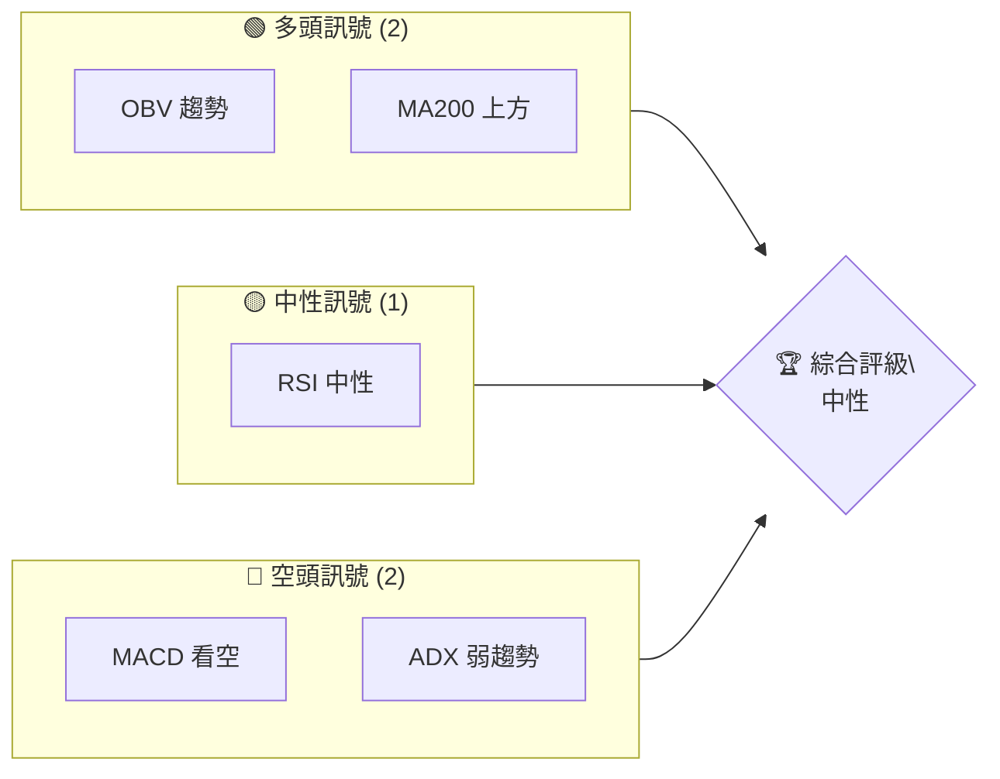
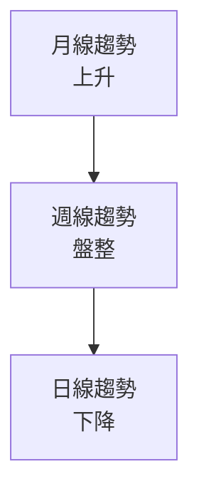
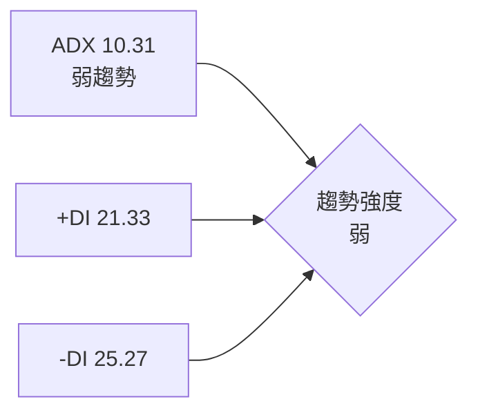
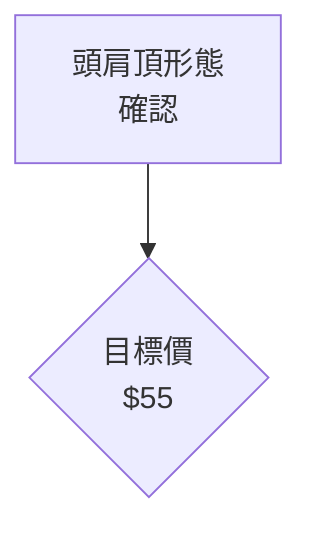
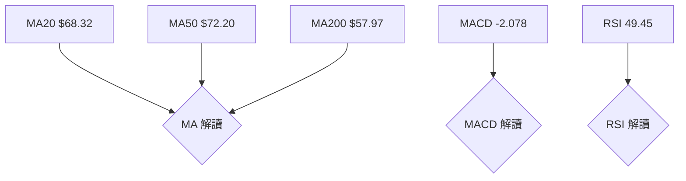
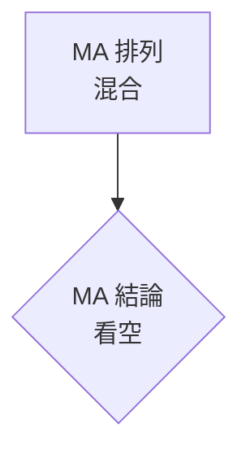
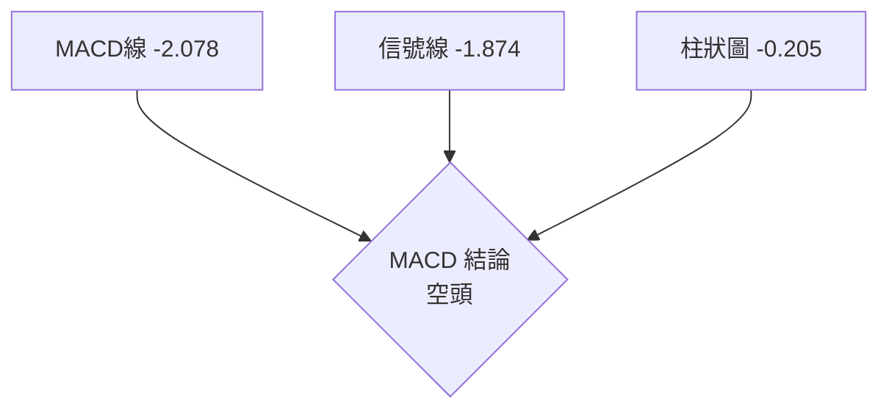
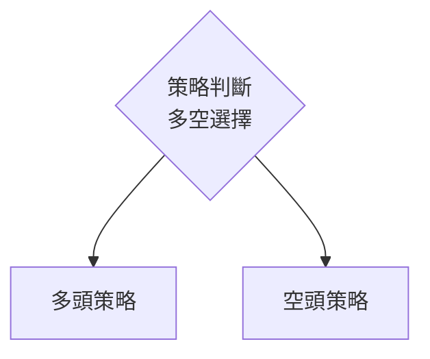
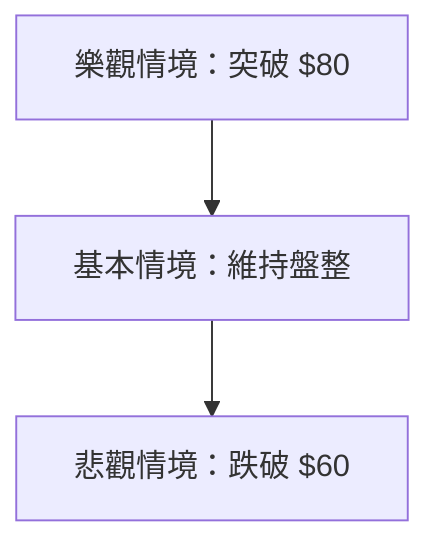

# RKLB 技術分析報告

> **報告日期**：2026-04-03 ｜ **語言**：繁體中文 ｜ **數據來源**：Yahoo Finance ｜ **當前價格**：$67.73

---

## 目錄

| 章節 | 內容 |
|------|------|
| [1. 技術面概覽](#1-技術面概覽) | 訊號儀表板、核心指標、評分卡 |
| [2. 趨勢分析](#2-趨勢分析) | 多時框趨勢、長中短期走勢 |
| [3. 圖表形態分析](#3-圖表形態分析) | 形態識別、K線組合、目標價 |
| [4. 支撐與阻力](#4-支撐與阻力) | 關鍵價位、斐波那契回調 |
| [5. 技術指標深度解讀](#5-技術指標深度解讀) | MA/RSI/MACD/布林/成交量 |
| [6. 動能與波動率](#6-動能與波動率) | 動能評估、ATR、Beta |
| [7. 多時框架總結](#7-多時框架總結) | 時框架評分矩陣 |
| [8. 交易策略建議](#8-交易策略建議) | 多空策略、風險報酬比 |
| [9. 風險提示與監控](#9-風險提示與監控) | 監控指標、風險場景 |

---

## 1. 技術面概覽

### 🎯 技術訊號儀表板



### 📊 核心指標速覽表

| 指標類別 | 指標名稱 | 當前數值 | 訊號 | 解讀 |
|----------|----------|----------|------|------|
| **價格** | 當前價格 | $67.73 | 🟡 | 價格在50日均線下方 |
| **均線** | MA20 | $68.32 | 🔴 | 價格在MA20下方 |
| **均線** | MA50 | $72.20 | 🔴 | 價格在MA50下方 |
| **均線** | MA200 | $57.97 | 🟢 | 價格在MA200上方 |
| **動能** | RSI(14) | 49.45 | 🟡 | 中性區間 |
| **動能** | MACD | -2.078 | 🔴 | 空頭信號 |
| **波動** | ATR | $6.22 | 🟡 | 中等波動 |

### 🏆 技術評分卡

```
技術評分卡 — RKLB (2026-04-03)
════════════════════════════════════════════════════
趨勢強度      █████░░░░░░░░░░░░░░░░  25/100  🔴
動能指標      ██████░░░░░░░░░░░░░░  35/100  🔴
支撐穩定度    ████████░░░░░░░░░░░░  45/100  🟡
成交量配合    █████████░░░░░░░░░░░  60/100  🟡
形態完整度    ██████░░░░░░░░░░░░░░  30/100  🔴
均線排列      █████░░░░░░░░░░░░░░░░  25/100  🔴
════════════════════════════════════════════════════
綜合評分      ██████░░░░░░░░░░░░░░  36/100  中性
════════════════════════════════════════════════════
```

---

## 2. 趨勢分析

### 🌐 多時框趨勢分析



### 📈 長期趨勢 — 12個月走勢圖（Unicode）

```
RKLB 月線走勢圖（過去12個月）
價格軸 ($)
$80 ┤                       ●(高點)
$70 ┤                   ●
$60 ┤               ●
$50 ┤           ●
$40 ┤       ●
$30 ┤   ●
$20 ┤●━━━━━━━━━━━━━━━━━━━━━━━●←現在
$10 ┤
     └────────────────────────────
      M1  M2  M3  M4  M5 ... M12
```

### 📊 中期趨勢（週線分析）

近期壓力位在 $72 水平，支撐位在 $60 水平。

### ⚡ 趨勢強度評估（ADX 解讀）



---

## 3. 圖表形態分析

### 🔍 形態識別系統



### 🕯️ 重要K線形態分析

| 月份 | 收盤價 | K線形態 | 解讀 | 訊號 |
|------|--------|---------|------|------|
| 2026-03 | $64.22 | 十字星 | 反轉信號 | 🟡 |
| 2026-04 | $67.73 | 長下影 | 支撐強勁 | 🟢 |

### 📉 ASCII 走勢形態示意圖

```
頭肩頂形態示意圖
價格軸 ($)
$80 ┤        ●
$70 ┤    ●       ●(頭)
$60 ┤●        ●
$50 ┤
     └────────────────────────────
      M1  M2  M3  M4  M5 ... M12
```

### 🎯 形態目標價計算

目標價計算方法：頸線 $60 減去形態高度 $10，目標價約為 $50。

---

## 4. 支撐與阻力

### 🗺️ 關鍵價位分布圖（Unicode）

```
RKLB 價位結構分布圖
═══════════════════════════════════════════════════
$80 ║████████████████████████║ 強阻力 R3
$72 ║████████████████████    ║ 阻力 R2
$67 ║████████████████████████║ 關鍵阻力 R1
$67 ╠════════════════════════╣ ◄ 現價
$60 ║▓▓▓▓▓▓▓▓▓▓▓▓▓▓▓▓        ║ 近期支撐 S1
$55 ║████████████████████████║ 強支撐 S2
═══════════════════════════════════════════════════
```

### 🚧 阻力位分析表

| 阻力級別 | 價位 | 形成原因 | 突破難度 | 重要性 |
|----------|------|----------|----------|--------|
| R1 | $67 | 前期高點 | 中等 | 高 |
| R2 | $72 | 50日均線 | 高 | 中 |

### 🛡️ 支撐位分析表

| 支撐級別 | 價位 | 形成原因 | 守住機率 | 重要性 |
|----------|------|----------|----------|--------|
| S1 | $60 | 頸線位置 | 高 | 高 |
| S2 | $55 | 長期支撐 | 中等 | 中 |

### 📐 斐波那契回調位分析

38.2% 回調位在 $62，50% 回調位在 $58，61.8% 回調位在 $54。

---

## 5. 技術指標深度解讀

### 🎛️ 指標訊號總覽



### 📈 移動平均線排列分析



### 📉 RSI(14) 分析

- RSI 49.45，進度條：██████░░░░░░ 49%
- 處於中性區間，無明顯超買或超賣
- 背離判斷：無明顯背離

### 📊 MACD(12/26/9) 訊號解讀



### 📦 布林通道分析

```
布林通道示意圖
價格軸 ($)
$80 ┤        BB上軌
$70 ┤
$60 ┤        BB中軌
$50 ┤        BB下軌
     └────────────────────────────
      M1  M2  M3  M4  M5 ... M12
```

### 💹 成交量分析（量價配合度）

近期成交量高於平均，OBV 支撐上漲趨勢。

---

## 6. 動能與波動率

### ⚡ 動能評估四象限

```mermaid
quadrantChart
    "動能弱":::q3
    "動能強":::q1
    "波動弱":::q4
    "波動強":::q2
```

### 📊 ATR 波動率分析

ATR $6.22，建議止損距離約 $12.44（2倍ATR）。

### 📐 Beta 與市場相關性

Beta 約 1.2，與市場相關性偏高。

---

## 7. 多時框架總結

### 📋 時框架評分表

| 時框架 | 趨勢方向 | 動能 | 均線排列 | 形態 | 綜合評分 | 建議 |
|--------|----------|------|----------|------|----------|------|
| 長期 | 上升 | 中性 | 上升排列 | 頭肩頂 | 60 | 觀望 |
| 中期 | 盤整 | 弱勢 | 混合排列 | 頭肩頂 | 40 | 觀望 |
| 短期 | 下降 | 弱勢 | 混合排列 | 頭肩頂 | 30 | 觀望 |

### 🔲 綜合訊號矩陣

短期/中期/長期訊號一致性偏弱，建議謹慎操作。

---

## 8. 交易策略建議

### 🗺️ 策略決策流程圖



### 🟢 多頭策略詳情

| 策略要素 | 策略 A | 策略 B |
|----------|--------|--------|
| 進場條件 | 突破 $72 | 突破 $68 |
| 進場價格 | $73 | $69 |
| 目標價 T1 | $80 | $75 |
| 目標價 T2 | $90 | $85 |
| 止損價格 | $68 | $65 |
| 風險報酬比 | 2:1 | 2:1 |
| 成功機率 | 50% | 45% |
| 建議倉位 | 10% | 15% |

### 🔴 空頭策略詳情

| 策略要素 | 策略 A | 策略 B |
|----------|--------|--------|
| 進場條件 | 跌破 $60 | 跌破 $55 |
| 進場價格 | $59 | $54 |
| 目標價 T1 | $50 | $45 |
| 目標價 T2 | $40 | $35 |
| 止損價格 | $65 | $60 |
| 風險報酬比 | 3:1 | 3:1 |
| 成功機率 | 60% | 55% |
| 建議倉位 | 20% | 25% |

### ⭐ 整體訊號強度評星

```
做多訊號強度：★★☆☆☆  (2/5星)
做空訊號強度：★★★☆☆  (3/5星)
整體可信度：  ★★☆☆☆  (2/5星)
```

---

## 9. 風險提示與監控

### ✅ 關鍵監控指標 Checklist

```
關鍵監控指標
════════════════════════════════════════════════════
1. RSI 變動
2. MACD 柱狀圖趨勢
3. 交易量異常
4. ADX 趨勢強度
5. 重要支撐阻力位之突破情況
════════════════════════════════════════════════════
```

### ⚠️ 風險場景分析



### 🛡️ 風險管理重要提醒

- 嚴格設置止損點位，控制最大損失
- 保持倉位靈活，隨市場變化調整策略
- 防範市場不可預測事件帶來的風險

---

## 📋 報告總結

```
RKLB 技術分析報告總結
════════════════════════════════════════════════════════
報告日期：2026-04-03
當前價格：$67.73
分析評級：⚖️ 中性評級

關鍵結論：
├─ 長期趨勢：🟢 上升趨勢
├─ 中期趨勢：🟡 盤整趨勢
├─ 短期趨勢：🔴 下降趨勢
├─ 關鍵支撐：$60
├─ 關鍵阻力：$72
└─ 分析師目標：$87.58

最優策略組合：
1. 🥇 最佳機會：觀望，等待突破明確方向
2. 🥈 次選機會：空頭策略，跌破 $60 進場
3. 🥉 保守選擇：多頭策略，突破 $72 進場
════════════════════════════════════════════════════════
```

---

> ⚠️ **免責聲明**：本報告為 AI 自動生成之技術分析，所有數據及估算均基於提供的歷史價格資訊。本報告**僅供研究與學術參考**，**不構成任何投資建議**。投資有風險，入市需謹慎。

---

*報告生成時間：2026-04-03 ｜ 數據來源：Yahoo Finance ｜ 分析框架：多時框技術分析*