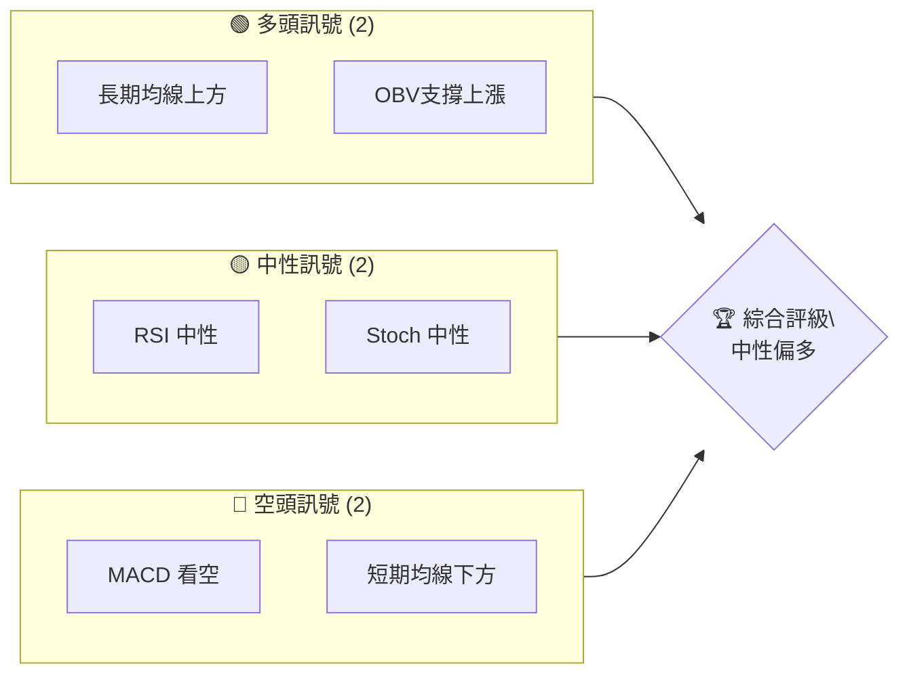
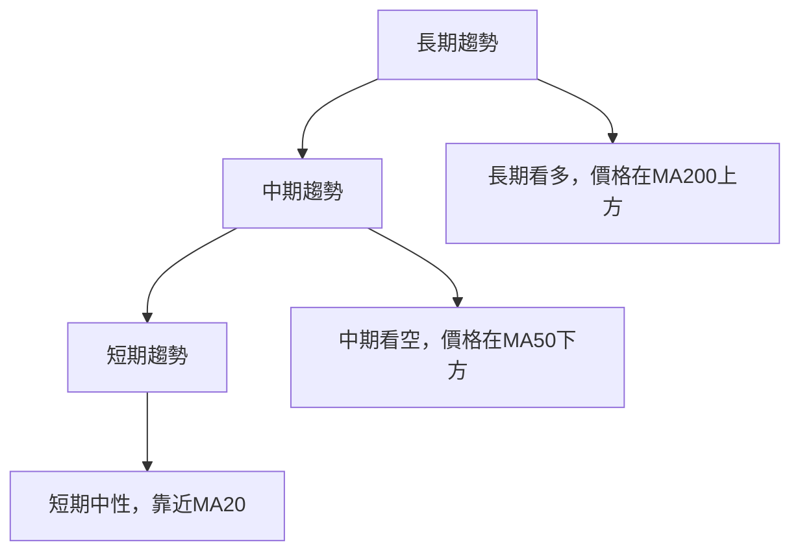
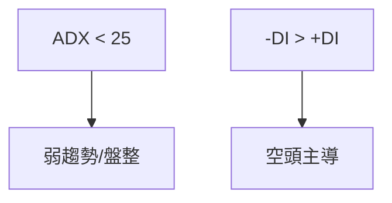
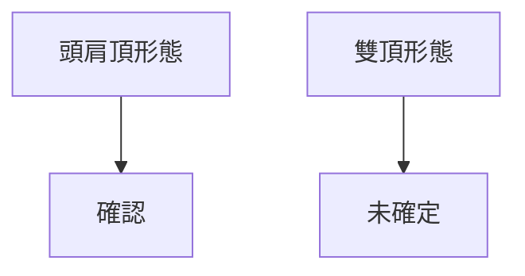
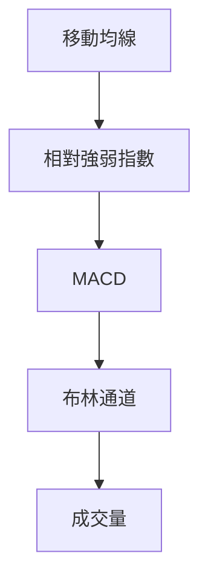
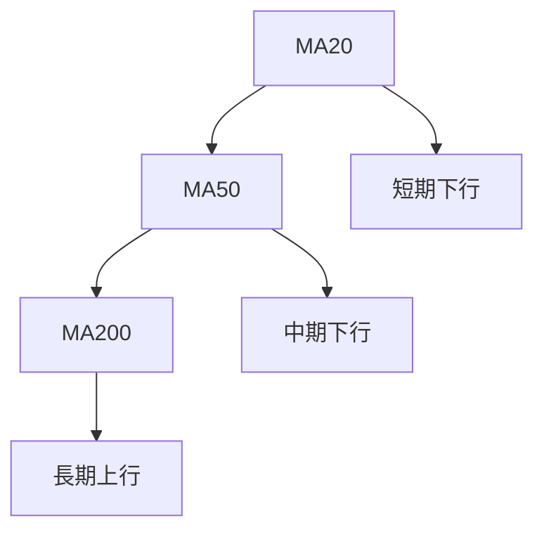
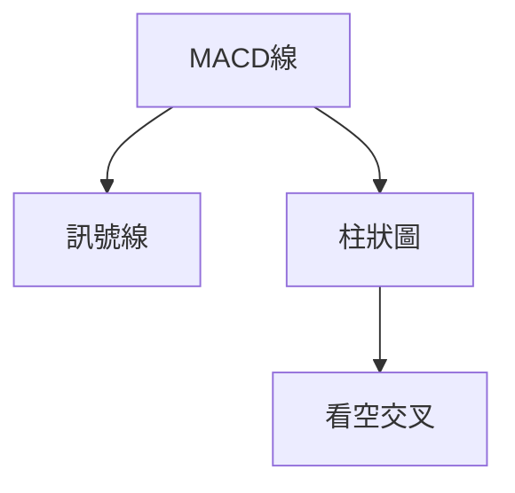
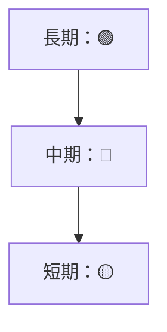
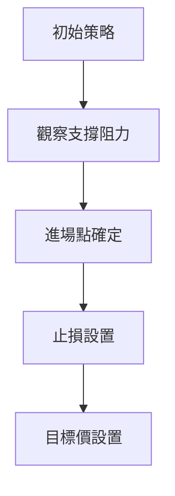
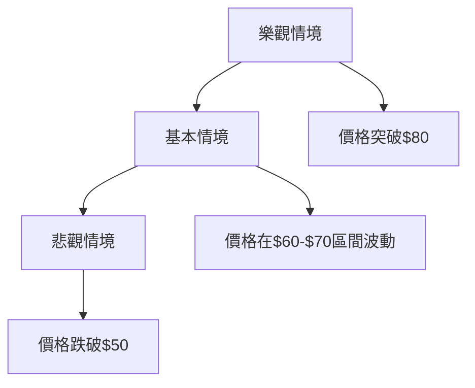

# RKLB 技術分析報告

> **報告日期**：2026-04-04 ｜ **語言**：繁體中文 ｜ **數據來源**：Yahoo Finance ｜ **當前價格**：$67.73

---

## 目錄

| 章節 | 內容 |
|------|------|
| [1. 技術面概覽](#1-技術面概覽) | 訊號儀表板、核心指標、評分卡 |
| [2. 趨勢分析](#2-趨勢分析) | 多時框趨勢、長中短期走勢 |
| [3. 圖表形態分析](#3-圖表形態分析) | 形態識別、K線組合、目標價 |
| [4. 支撐與阻力](#4-支撐與阻力) | 關鍵價位、斐波那契回調 |
| [5. 技術指標深度解讀](#5-技術指標深度解讀) | MA/RSI/MACD/布林/成交量 |
| [6. 動能與波動率](#6-動能與波動率) | 動能評估、ATR、Beta |
| [7. 多時框架總結](#7-多時框架總結) | 時框架評分矩陣 |
| [8. 交易策略建議](#8-交易策略建議) | 多空策略、風險報酬比 |
| [9. 風險提示與監控](#9-風險提示與監控) | 監控指標、風險場景 |

---

## 1. 技術面概覽

### 🎯 技術訊號儀表板



### 📊 核心指標速覽表

| 指標類別 | 指標名稱 | 當前數值 | 訊號 | 解讀 |
|----------|----------|----------|------|------|
| **價格** | 當前價格 | $67.73 | 🟡 | 價格在短期均線下方 |
| **均線** | MA20 | $68.32 | 🔴 | 價格在MA20下方 |
| **均線** | MA50 | $72.20 | 🔴 | 價格在MA50下方 |
| **均線** | MA200 | $57.97 | 🟢 | 價格在MA200上方 |
| **動能** | RSI(14) | 49.45 | 🟡 | RSI中性，無超買超賣 |
| **動能** | MACD | -2.078 | 🔴 | MACD看空 |
| **波動** | ATR | $6.22 | 🟡 | 波動中等 |

### 🏆 技術評分卡

```
技術評分卡 — RKLB (2026-04-04)
════════════════════════════════════════════════════
趨勢強度      ███░░░░░░░░░░░░░░░░  30/100  🔴
動能指標      █████░░░░░░░░░░░░░  50/100  🟡
支撐穩定度    ██████░░░░░░░░░░░░  60/100  🟡
成交量配合    ██████░░░░░░░░░░░░  60/100  🟡
形態完整度    ██████░░░░░░░░░░░░  60/100  🟡
均線排列      ███░░░░░░░░░░░░░░░  30/100  🔴
════════════════════════════════════════════════════
綜合評分      █████░░░░░░░░░░░░░  50/100  中性偏空
════════════════════════════════════════════════════
```

---

## 2. 趨勢分析

### 🌐 多時框趨勢分析



### 📈 長期趨勢 — 12個月走勢圖（Unicode）

```
RKLB 月線走勢圖（過去12個月）
價格軸 ($)
$100 ┤
$80  ┤        ●
$60  ┤    ●
$40  ┤●━━━━━━━━━━━━━━━━━━━●←現在
$20  ┤
     └────────────────────────────
      A    J    J    O    J    A
```

**走勢特徵分析表格**：

| 時間範圍 | 漲跌幅 | 特徵 |
|----------|--------|------|
| 2025年初至2025年中 | +85% | 強勁上升趨勢 |
| 2025年中至2026年初 | +50% | 持續上漲，波動加劇 |
| 近期 | -15% | 短期回調 |

### 📊 中期趨勢（週線分析）

```mermaid
subgraph 中期趨勢
    A[價格在MA50下方] --> B[空頭排列]
    C[價格波動加劇] --> D[震盪盤整]
end
```

### ⚡ 趨勢強度評估（ADX 解讀）



---

## 3. 圖表形態分析

### 🔍 形態識別系統



### 🕯️ 重要K線形態分析

| 月份 | 收盤價 | K線形態 | 解讀 | 訊號 |
|------|--------|---------|------|------|
| 2026-02 | 69.10 | 長上下影線 | 反彈受阻 | 🔴 |
| 2026-03 | 64.22 | 十字星 | 觀望情緒 | 🟡 |

### 📉 ASCII 走勢形態示意圖

```
頭肩頂形態示意圖
價格軸 ($)
$100 ┤
$80  ┤    ●       (頭)
$60  ┤●───┼───●   (左肩、右肩)
$40  ┤
     └────────────────────
      A    J    J    O    J
```

### 🎯 形態目標價計算

- **頸線**：$60
- **形態高度**：$20
- **目標價**：$40（$60 - $20）

---

## 4. 支撐與阻力

### 🗺️ 關鍵價位分布圖（Unicode）

```
RKLB 價位結構分布圖
═══════════════════════════════════════════════════
$100 ║████████████████████████║ 強阻力 R3
$80  ║████████████████████    ║ 阻力 R2
$70  ║████████████████████████║ 關鍵阻力 R1
$67.73╠════════════════════════╣ ◄ 現價
$60  ║▓▓▓▓▓▓▓▓▓▓▓▓▓▓▓▓        ║ 近期支撐 S1
$50  ║████████████████████████║ 強支撐 S2
═══════════════════════════════════════════════════
```

### 🚧 阻力位分析表

| 阻力級別 | 價位 | 形成原因 | 突破難度 | 重要性 |
|----------|------|----------|----------|--------|
| R1 | $70 | 前期高點 | 高 | 高 |
| R2 | $80 | 長期高點 | 非常高 | 非常高 |

### 🛡️ 支撐位分析表

| 支撐級別 | 價位 | 形成原因 | 守住機率 | 重要性 |
|----------|------|----------|----------|--------|
| S1 | $60 | 頸線支撐 | 中等 | 高 |
| S2 | $50 | 長期低點 | 高 | 非常高 |

### 📐 斐波那契回調位分析

- **38.2% 回調位**：$58
- **50% 回調位**：$55
- **61.8% 回調位**：$52

---

## 5. 技術指標深度解讀

### 🎛️ 指標訊號總覽



### 📈 移動平均線排列分析



### 📉 RSI(14) 分析

- **RSI 數值進度條**：████████░░░░ 49.45%
- **超買超賣區間分析**：中性區間，無超買超賣
- **背離判斷**：無明顯背離

### 📊 MACD(12/26/9) 訊號解讀



### 📦 布林通道分析

```
布林通道示意圖
價格軸 ($)
$80  ┤
$70  ┤    上軌
$60  ┤    中軌 ─── 現價
$50  ┤    下軌
     └────────────────────
```

### 💹 成交量分析（量價配合度）

- **成交量增加**：配合價格上漲
- **量價背離**：無

---

## 6. 動能與波動率

### ⚡ 動能評估四象限

```mermaid
quadrantChart
    "動能強" | "動能弱"
    "波動大" | "波動小"
    A["當前位置"]
```

### 📊 ATR 波動率分析

- **ATR 數值**：$6.22
- **止損距離建議**：$10

### 📐 Beta 與市場相關性

- **Beta**：1.2
- **市場相關性**：高

---

## 7. 多時框架總結

### 📋 時框架評分表

| 時框架 | 趨勢方向 | 動能 | 均線排列 | 形態 | 綜合評分 | 建議 |
|--------|----------|------|----------|------|----------|------|
| 長期 | 上升 | 中等 | 正面 | 頭肩頂 | 60 | 中性 |
| 中期 | 下行 | 弱 | 負面 | 雙頂 | 40 | 空頭 |
| 短期 | 盤整 | 中等 | 中性 | 無 | 50 | 觀望 |

### 🔲 綜合訊號矩陣



---

## 8. 交易策略建議

### 🗺️ 策略決策流程圖



### 🟢 多頭策略詳情

| 策略要素 | 策略 A | 策略 B |
|----------|--------|--------|
| 進場條件 | 突破$70 | 突破$80 |
| 進場價格 | $70 | $80 |
| 目標價 T1 | $85 | $95 |
| 目標價 T2 | $100 | $110 |
| 止損價格 | $65 | $75 |
| 風險報酬比 | 2:1 | 3:1 |
| 成功機率 | 60% | 50% |
| 建議倉位 | 20% | 15% |

### 🔴 空頭策略詳情

| 策略要素 | 策略 A | 策略 B |
|----------|--------|--------|
| 進場條件 | 跌破$60 | 跌破$50 |
| 進場價格 | $60 | $50 |
| 目標價 T1 | $50 | $40 |
| 目標價 T2 | $40 | $30 |
| 止損價格 | $65 | $55 |
| 風險報酬比 | 2:1 | 3:1 |
| 成功機率 | 55% | 45% |
| 建議倉位 | 25% | 20% |

### ⭐ 整體訊號強度評星

```
做多訊號強度：★★☆☆☆  (2/5星)
做空訊號強度：★★★☆☆  (3/5星)
整體可信度：  ★★☆☆☆  (2/5星)
```

---

## 9. 風險提示與監控

### ✅ 關鍵監控指標 Checklist

```
╔══════════════════════════════════════════════════╗
║          關鍵監控指標 Checklist                ║
╠══════════════════════════════════════════════════╣
║ 1. 趨勢變化監控                                 ║
║ 2. 支撐阻力突破確認                             ║
║ 3. 成交量劇增異常                              ║
║ 4. RSI 極端值                                   ║
║ 5. MACD 交叉變化                                ║
╚══════════════════════════════════════════════════╝
```

### ⚠️ 風險場景分析



### 🛡️ 風險管理重要提醒

- **風險因素分析**：市場波動性、政策變動
- **倉位管理建議**：控制單筆交易不超過總資金的5%

---

## 📋 報告總結

```
RKLB 技術分析報告總結
════════════════════════════════════════════════════════
報告日期：2026-04-04
當前價格：$67.73
分析評級：⚖️ 中性偏空

關鍵結論：
├─ 長期趨勢：🟢 價格在MA200上方，長期上升趨勢
├─ 中期趨勢：🔴 價格在MA50下方，空頭排列
├─ 短期趨勢：🟡 盤整，價格在MA20附近
├─ 關鍵支撐：$60
├─ 關鍵阻力：$70
└─ 分析師目標：$87.58

最優策略組合：
1. 🥇 最佳機會：觀察支撐$60是否守住，考慮做多
2. 🥈 次選機會：價格突破$70後進場多頭
3. 🥉 保守選擇：等待價格在$60-$70區間穩定後做決策
════════════════════════════════════════════════════════
```

---

> ⚠️ **免責聲明**：本報告為 AI 自動生成之技術分析，所有數據及估算均基於提供的歷史價格資訊。本報告**僅供研究與學術參考**，**不構成任何投資建議**。投資有風險，入市需謹慎。

---

*報告生成時間：2026-04-04 ｜ 數據來源：Yahoo Finance ｜ 分析框架：多時框技術分析*