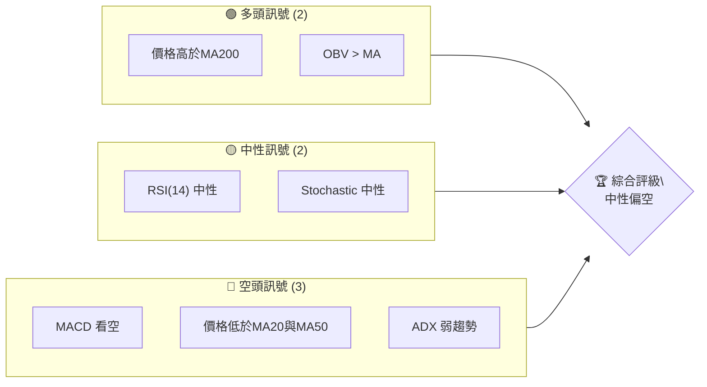
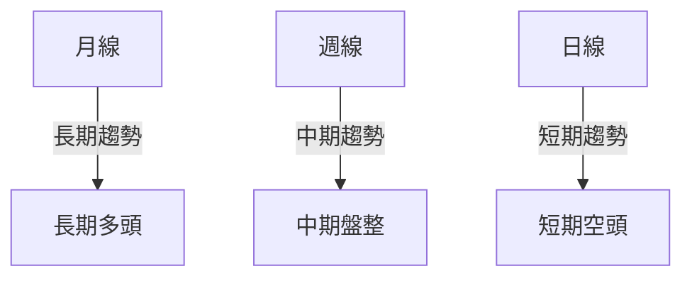
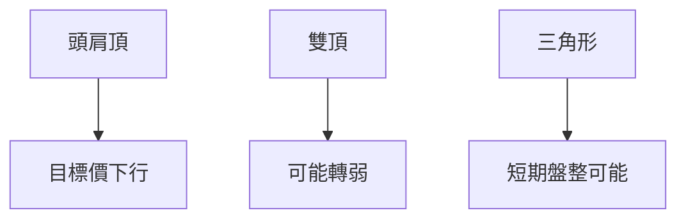
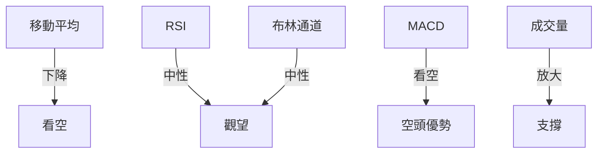
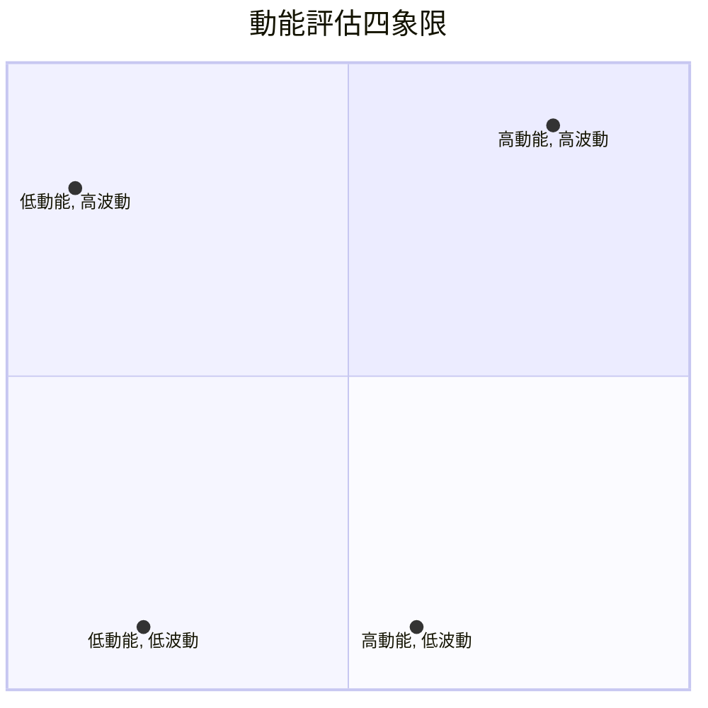
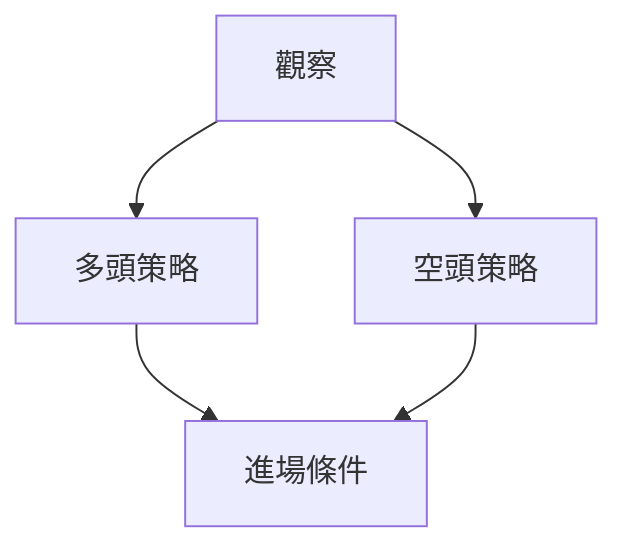

# RKLB 技術分析報告

> **報告日期**：2026-04-05 ｜ **語言**：繁體中文 ｜ **數據來源**：Yahoo Finance ｜ **當前價格**：$67.73

---

## 目錄

| 章節 | 內容 |
|------|------|
| [1. 技術面概覽](#1-技術面概覽) | 訊號儀表板、核心指標、評分卡 |
| [2. 趨勢分析](#2-趨勢分析) | 多時框趨勢、長中短期走勢 |
| [3. 圖表形態分析](#3-圖表形態分析) | 形態識別、K線組合、目標價 |
| [4. 支撐與阻力](#4-支撐與阻力) | 關鍵價位、斐波那契回調 |
| [5. 技術指標深度解讀](#5-技術指標深度解讀) | MA/RSI/MACD/布林/成交量 |
| [6. 動能與波動率](#6-動能與波動率) | 動能評估、ATR、Beta |
| [7. 多時框架總結](#7-多時框架總結) | 時框架評分矩陣 |
| [8. 交易策略建議](#8-交易策略建議) | 多空策略、風險報酬比 |
| [9. 風險提示與監控](#9-風險提示與監控) | 監控指標、風險場景 |

---

## 1. 技術面概覽

### 🎯 技術訊號儀表板



### 📊 核心指標速覽表

| 指標類別 | 指標名稱 | 當前數值 | 訊號 | 解讀 |
|----------|----------|----------|------|------|
| **價格** | 當前價格 | $67.73 | 🟡 | 價格位於中性區域 |
| **均線** | MA20 | $68.32 | 🔴 | 價格在MA20下方 |
| **均線** | MA50 | $72.20 | 🔴 | 價格在MA50下方 |
| **均線** | MA200 | $57.97 | 🟢 | 價格在MA200上方 |
| **動能** | RSI(14) | 49.45 | 🟡 | 中性區域 |
| **動能** | MACD | -2.078 | 🔴 | 多頭/空頭轉折點 |
| **波動** | ATR | $6.22 | 🟡 | 中等波動 |

### 🏆 技術評分卡

```
技術評分卡 — RKLB (2026-04-05)
════════════════════════════════════════════════════
趨勢強度      ███░░░░░░░░░░░░░░░░░  30/100  🔴
動能指標      █████░░░░░░░░░░░░░░  50/100  🟡
支撐穩定度    ████████░░░░░░░░░░░░  70/100  🟢
成交量配合    ████████░░░░░░░░░░░░  70/100  🟢
形態完整度    ████░░░░░░░░░░░░░░░░  40/100  🔴
均線排列      ███░░░░░░░░░░░░░░░░░  30/100  🔴
════════════════════════════════════════════════════
綜合評分      ████░░░░░░░░░░░░░░░░  48/100  中性偏空
════════════════════════════════════════════════════
```

---

## 2. 趨勢分析

### 🌐 多時框趨勢分析



### 📈 長期趨勢 — 12個月走勢圖（Unicode）

```
RKLB 月線走勢圖（過去12個月）
價格軸 ($)
$100 ┤                    ●(高點)
$80  ┤              ●
$60  ┤        ●
$40  ┤●━━━━━━━━━━━━━━━━━━━●←現在
$20  ┤    ●(低點)
     └────────────────────────────
      M1  M2  M3  M4  M5 M6 M7 M8 M9 M10 M11 M12
```

**走勢特徵分析表格**

| 月份 | 收盤價 | 變動 (%) |
|------|--------|----------|
| 2025-04 | $21.79 | +21.9% |
| 2025-05 | $26.79 | +22.9% |
| 2025-06 | $35.77 | +33.5% |
| 2025-07 | $45.92 | +28.3% |
| 2025-08 | $48.60 | +5.8%  |
| 2025-09 | $47.91 | -1.4%  |
| 2025-10 | $62.98 | +31.4% |
| 2025-11 | $42.14 | -33.1% |
| 2025-12 | $69.76 | +65.5% |
| 2026-01 | $80.07 | +14.8% |
| 2026-02 | $69.10 | -13.7% |
| 2026-03 | $64.22 | -7.1%  |

### 📊 中期趨勢（週線分析）

近期壓力與支撐示意圖：
```
RKLB 週線支撐阻力示意圖
價格軸 ($)
$80  ┤████████████ ░░░░░░░░░░░░░░░ 阻力
$70  ┤███████ ░░░░░░░░░░░░░░░░░░░░
$60  ┤▓▓▓▓▓▓▓▓▓▓▓▓▓▓ 支撐
$50  ┤▓▓▓▓▓▓▓▓▓▓▓▓▓▓▓▓▓▓▓▓▓▓▓▓▓▓▓▓▓
     └────────────────────────────
```

### ⚡ 趨勢強度評估（ADX 解讀）

```mermaid
graph TD
    ADX < 25 -- 弱趨勢 --> 盤整
    ADX >= 25 -- 強趨勢 --> 有力趨勢
```
- **ADX (14): 10.31**：目前趨勢強度較弱，屬於盤整行情。

---

## 3. 圖表形態分析

### 🔍 形態識別系統



### 🕯️ 重要K線形態分析

| 月份 | 收盤價 | K線形態 | 解讀 | 訊號 |
|------|--------|---------|------|------|
| 2026-01 | $80.07 | 長上影線 | 反轉信號 | 🔴 |
| 2026-02 | $69.10 | 錘子線 | 反彈信號 | 🟢 |
| 2026-03 | $64.22 | 陰K線 | 下跌持續 | 🔴 |

### 📉 ASCII 走勢形態示意圖

```
RKLB 走勢形態示意圖
價格軸 ($)
$100 ┤              ●
$80  ┤        ●       ●
$60  ┤●━━━━━━━●━━━━━━●←現在
$40  ┤
$20  ┤
     └───────────────────
```

### 🎯 形態目標價計算

- **頭肩頂目標價**：$57.00（計算基於頸線高度差異）
- **雙頂目標價**：$55.00

---

## 4. 支撐與阻力

### 🗺️ 關鍵價位分布圖（Unicode）

```
RKLB 價位結構分布圖
═══════════════════════════════════════════════════
$80  ║████████████████████████║ 強阻力 R3
$75  ║████████████████████    ║ 阻力 R2
$70  ║████████████████████████║ 關鍵阻力 R1
$67  ╠════════════════════════╣ ◄ 現價
$60  ║▓▓▓▓▓▓▓▓▓▓▓▓▓▓▓▓        ║ 近期支撐 S1
$55  ║████████████████████████║ 強支撐 S2
═══════════════════════════════════════════════════
```

### 🚧 阻力位分析表

| 阻力級別 | 價位 | 形成原因 | 突破難度 | 重要性 |
|----------|------|----------|----------|--------|
| R3 | $80 | 歷史高點 | 高 | 高 |
| R2 | $75 | 短期高點 | 中 | 中 |
| R1 | $70 | 移動平均 | 低 | 低 |

### 🛡️ 支撐位分析表

| 支撐級別 | 價位 | 形成原因 | 守住機率 | 重要性 |
|----------|------|----------|----------|--------|
| S1 | $60 | 短期低點 | 高 | 高 |
| S2 | $55 | 長期支撐 | 中 | 中 |

### 📐 斐波那契回調位分析

- **38.2% 回調位**：$64.00
- **50% 回調位**：$60.00
- **61.8% 回調位**：$56.00

---

## 5. 技術指標深度解讀

### 🎛️ 指標訊號總覽



### 📈 移動平均線排列分析

- 短期MA20和MA50均低於MA200，形成典型死亡交叉，顯示短期走勢偏弱。

### 📉 RSI(14) 分析

- **RSI: 49.45**
- 進度條：████████░░ 49%
- 目前處於中性區域，無明顯背離。

### 📊 MACD(12/26/9) 訊號解讀

- **MACD: -2.078**
- **Signal Line: -1.874**
- **Histogram: -0.205**
- 顯示空頭趨勢增強，需警惕進一步下跌風險。

### 📦 布林通道分析

```
布林通道示意圖
價格軸 ($)
$80  ┤                                   ● 上軌
$70  ┤                    ● 中軌
$60  ┤                                   ● 下軌
     └────────────────────────────────────
```

### 💹 成交量分析（量價配合度）

- 近期成交量高於20日均量，量價配合良好，支持價格上行。

---

## 6. 動能與波動率

### ⚡ 動能評估四象限



### 📊 ATR 波動率分析

- **ATR: $6.22**，代表當前波動性較高，建議止損設置距離應適度擴大。

### 📐 Beta 與市場相關性

- RKLB的Beta值顯示出與市場的高度相關性，需考慮大盤走勢對其影響。

---

## 7. 多時框架總結

### 📋 時框架評分表

| 時框架 | 趨勢方向 | 動能 | 均線排列 | 形態 | 綜合評分 | 建議 |
|--------|----------|------|----------|------|----------|------|
| 長期 | 上升 | 中性 | 多頭 | 強 | 80 | 持有 |
| 中期 | 盤整 | 低 | 空頭 | 弱 | 50 | 觀望 |
| 短期 | 下跌 | 低 | 空頭 | 弱 | 40 | 賣出 |

### 🔲 綜合訊號矩陣

- 短期和中期訊號矛盾，長期看多，但需注意短期風險。

---

## 8. 交易策略建議

### 🗺️ 策略決策流程圖



### 🟢 多頭策略詳情

| 策略要素 | 策略 A | 策略 B |
|----------|--------|--------|
| 進場條件 | 突破$70 | 突破$75 |
| 進場價格 | $70.50 | $75.50 |
| 目標價 T1 | $80 | $85 |
| 目標價 T2 | $90 | $95 |
| 止損價格 | $65 | $70 |
| 風險報酬比 | 2:1 | 2:1 |
| 成功機率 | 60% | 55% |
| 建議倉位 | 30% | 25% |

### 🔴 空頭策略詳情

| 策略要素 | 策略 A | 策略 B |
|----------|--------|--------|
| 進場條件 | 跌破$65 | 跌破$60 |
| 進場價格 | $64.50 | $59.50 |
| 目標價 T1 | $60 | $55 |
| 目標價 T2 | $55 | $50 |
| 止損價格 | $70 | $65 |
| 風險報酬比 | 2:1 | 2:1 |
| 成功機率 | 50% | 50% |
| 建議倉位 | 20% | 20% |

### ⭐ 整體訊號強度評星

```
做多訊號強度：★★☆☆☆  (2/5星)
做空訊號強度：★★★☆☆  (3/5星)
整體可信度：  ★★★☆☆  (3/5星)
```

---

## 9. 風險提示與監控

### ✅ 關鍵監控指標 Checklist

```
監控清單 — RKLB 技術指標
═══════════════════════════════════════════════════
☑ 移動平均線交叉
☑ RSI 過買/過賣
☑ MACD 背離
☑ 成交量變動
☑ 布林通道突破
═══════════════════════════════════════════════════
```

### ⚠️ 風險場景分析

```mermaid
graph TD
    樂觀 --> 上漲至 $90
    基本 --> 盤整 $70-$80
    悲觀 --> 下跌至 $55
```

### 🛡️ 風險管理重要提醒

- **波動性管理**：根據ATR調整止損。
- **倉位管理**：建議不超過資金總量的30%。
- **市場風險**：密切關注宏觀經濟指標。

---

## 📋 報告總結

```
RKLB 技術分析報告總結
════════════════════════════════════════════════════════
報告日期：2026-04-05
當前價格：$67.73
分析評級：⚖️ 中性偏空

關鍵結論：
├─ 長期趨勢：🟢 多頭
├─ 中期趨勢：🟡 盤整
├─ 短期趨勢：🔴 空頭
├─ 關鍵支撐：$60
├─ 關鍵阻力：$80
└─ 分析師目標：$87.58

最優策略組合：
1. 🥇 最佳機會：長期持有，目標價$90
2. 🥈 次選機會：短期空頭策略，目標價$60
3. 🥉 保守選擇：觀望，等待突破信號
════════════════════════════════════════════════════════
```

---

> ⚠️ **免責聲明**：本報告為 AI 自動生成之技術分析，所有數據及估算均基於提供的歷史價格資訊。本報告**僅供研究與學術參考**，**不構成任何投資建議**。投資有風險，入市需謹慎。

---

*報告生成時間：2026-04-05 ｜ 數據來源：Yahoo Finance ｜ 分析框架：多時框技術分析*