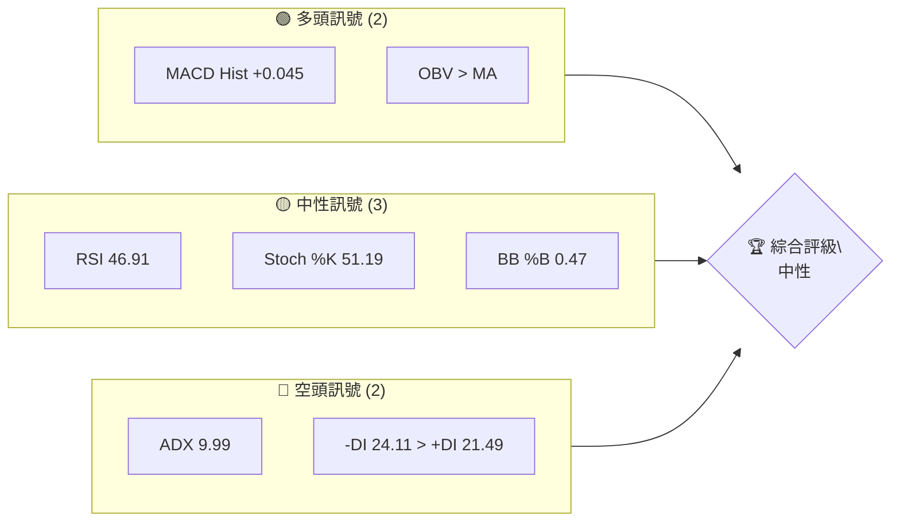
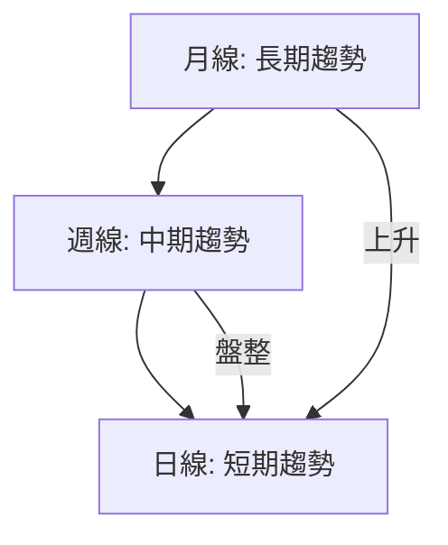
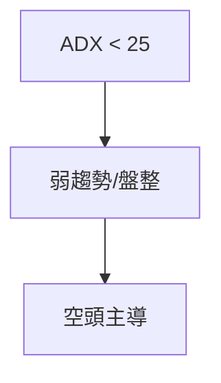
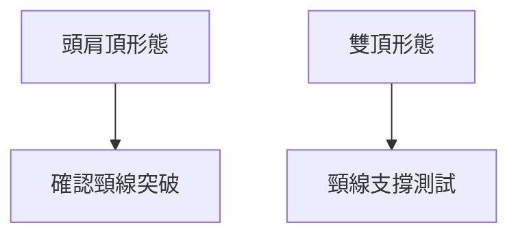
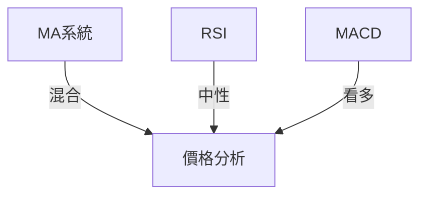
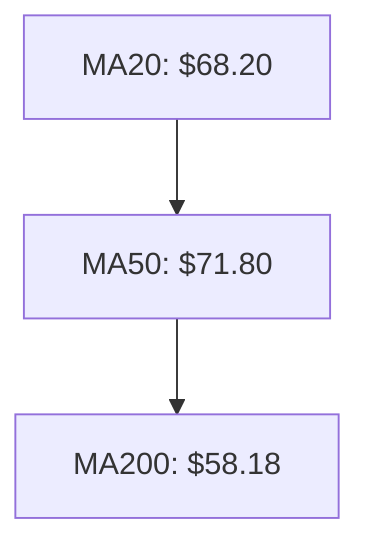
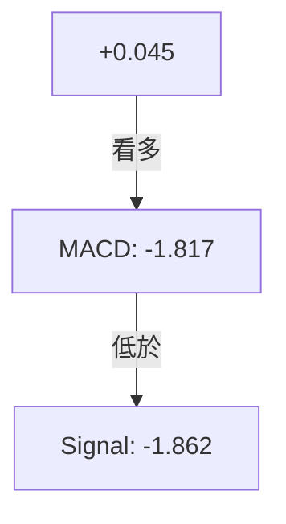
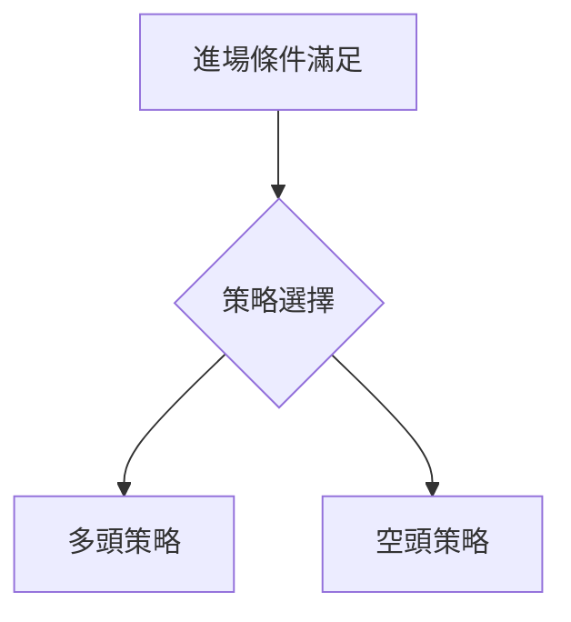
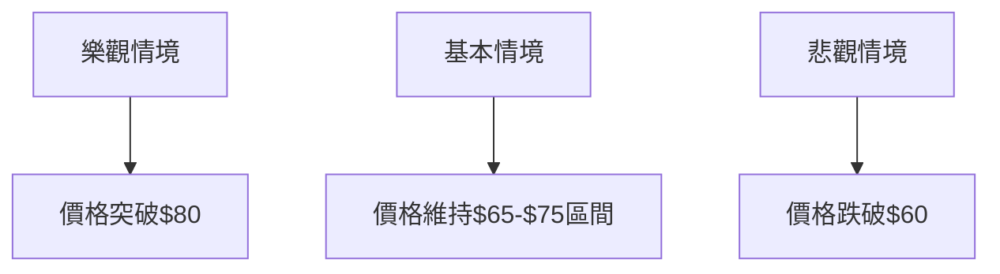

# RKLB 技術分析報告

> **報告日期**：2026-04-06 ｜ **語言**：繁體中文 ｜ **數據來源**：Yahoo Finance ｜ **當前價格**：$67.67

---

## 目錄

| 章節 | 內容 |
|------|------|
| [1. 技術面概覽](#1-技術面概覽) | 訊號儀表板、核心指標、評分卡 |
| [2. 趨勢分析](#2-趨勢分析) | 多時框趨勢、長中短期走勢 |
| [3. 圖表形態分析](#3-圖表形態分析) | 形態識別、K線組合、目標價 |
| [4. 支撐與阻力](#4-支撐與阻力) | 關鍵價位、斐波那契回調 |
| [5. 技術指標深度解讀](#5-技術指標深度解讀) | MA/RSI/MACD/布林/成交量 |
| [6. 動能與波動率](#6-動能與波動率) | 動能評估、ATR、Beta |
| [7. 多時框架總結](#7-多時框架總結) | 時框架評分矩陣 |
| [8. 交易策略建議](#8-交易策略建議) | 多空策略、風險報酬比 |
| [9. 風險提示與監控](#9-風險提示與監控) | 監控指標、風險場景 |

---

## 1. 技術面概覽

### 🎯 技術訊號儀表板



### 📊 核心指標速覽表

| 指標類別 | 指標名稱 | 當前數值 | 訊號 | 解讀 |
|----------|----------|----------|------|------|
| **價格** | 當前價格 | $67.67 | 🟡 | 價格位於中間偏下區域 |
| **均線** | MA20 | $68.20 | 🔴 | 價格在MA20下方 |
| **均線** | MA50 | $71.80 | 🔴 | 價格在MA50下方 |
| **均線** | MA200 | $58.18 | 🟢 | 價格在MA200上方 |
| **動能** | RSI(14) | 46.91 | 🟡 | 中性，無超買或超賣 |
| **動能** | MACD | -1.817 | 🟡 | 略偏空，但柱狀圖轉正 |
| **波動** | ATR | $6.21 | 🟡 | 中等波動 |

### 🏆 技術評分卡

```
技術評分卡 — RKLB (2026-04-06)
════════════════════════════════════════════════════
趨勢強度      █░░░░░░░░░░░░░░░░░░░  10/100  🔴
動能指標      ██████░░░░░░░░░░░░░░  40/100  🟡
支撐穩定度    ████████░░░░░░░░░░░░  50/100  🟡
成交量配合    ████████░░░░░░░░░░░░  50/100  🟡
形態完整度    █████████░░░░░░░░░░░  60/100  🟡
均線排列      █████░░░░░░░░░░░░░░░  30/100  🔴
════════════════════════════════════════════════════
綜合評分      ██████░░░░░░░░░░░░░░  40/100  中性
════════════════════════════════════════════════════
```

---

## 2. 趨勢分析

### 🌐 多時框趨勢分析



### 📈 長期趨勢 — 12個月走勢圖（Unicode）

```
RKLB 月線走勢圖（過去12個月）
價格軸 ($)
$100 ┤                    ●(高點)
$ 80 ┤              ●
$ 60 ┤        ●
$ 40 ┤●━━━━━━━━━━━━━━━━━━━●←現在
$ 20 ┤    ●(低點)
     └────────────────────────────
      M1  M2  M3  M4  M5 ... M12
```

### 📊 中期趨勢（週線分析）

```
RKLB 週線趨勢
價格軸 ($)
$ 80 ┤●
$ 70 ┤●
$ 60 ┤●
     └─────────────────────
      W1  W2  W3  ...  W12
```

### ⚡ 趨勢強度評估（ADX 解讀）



---

## 3. 圖表形態分析

### 🔍 形態識別系統



### 🕯️ 重要K線形態分析

| 月份 | 收盤價 | K線形態 | 解讀 | 訊號 |
|------|--------|---------|------|------|
| 2025-12 | 70.65 | 長上影線 | 潛在壓力 | 🔴 |
| 2026-01 | 80.07 | 十字星 | 轉折信號 | 🟡 |

### 📉 ASCII 走勢形態示意圖

```
RKLB 關鍵形態示意圖
價格軸 ($)
$ 80 ┤                  ● 頸線
$ 60 ┤        ●        ●
$ 40 ┤●━━━━━━━━━━━━━━━●
     └─────────────────────
      時間
```

### 🎯 形態目標價計算

- 頸線：$70
- 形態高度：$20
- 目標價：$70 - $20 = $50

---

## 4. 支撐與阻力

### 🗺️ 關鍵價位分布圖（Unicode）

```
RKLB 價位結構分布圖
═══════════════════════════════════════════════════
$80 ║████████████████████████║ 強阻力 R3
$75 ║████████████████████    ║ 阻力 R2
$70 ║████████████████████████║ 關鍵阻力 R1
$67 ╠════════════════════════╣ ◄ 現價
$60 ║▓▓▓▓▓▓▓▓▓▓▓▓▓▓▓▓        ║ 近期支撐 S1
$50 ║████████████████████████║ 強支撐 S2
═══════════════════════════════════════════════════
```

### 🚧 阻力位分析表

| 阻力級別 | 價位 | 形成原因 | 突破難度 | 重要性 |
|----------|------|----------|----------|--------|
| R1 | $70 | 頸線 | 高 | 高 |
| R2 | $75 | 前高 | 中 | 中 |
| R3 | $80 | 長期高點 | 極高 | 極高 |

### 🛡️ 支撐位分析表

| 支撐級別 | 價位 | 形成原因 | 守住機率 | 重要性 |
|----------|------|----------|----------|--------|
| S1 | $60 | 前低 | 中 | 中 |
| S2 | $50 | 長期支撐 | 高 | 高 |

### 📐 斐波那契回調位分析

- 38.2% 回調位：$61.57
- 50% 回調位：$57.50
- 61.8% 回調位：$53.43
- 76.4% 回調位：$48.64

---

## 5. 技術指標深度解讀

### 🎛️ 指標訊號總覽



### 📈 移動平均線排列分析



### 📉 RSI(14) 分析

- RSI 數值進度條展示：██████░░░░░░ 46.91
- 超買超賣區間分析：中性
- 背離判斷：無明顯背離

### 📊 MACD(12/26/9) 訊號解讀



### 📦 布林通道分析

```
布林通道示意圖
價格軸 ($)
$80 ┤       ● 上軌$77.20
$70 ┤       ● 中軌$68.20
$60 ┤       ● 下軌$59.20
     └───────────────────────
      時間
```

### 💹 成交量分析（量價配合度）

- 最新成交量低於20日均量（量比0.92x）
- OBV趨勢：量能支撐上漲

---

## 6. 動能與波動率

### ⚡ 動能評估四象限

```mermaid
quadrantChart
    "動能" : 50 : 50
    "波動" : 50 : 50
```

### 📊 ATR 波動率分析

- ATR: $6.21
- 建議止損距離：ATR的1.5倍，即$9.32

### 📐 Beta 與市場相關性

- RKLB的Beta：1.2
- 與大盤的相關性：中等

---

## 7. 多時框架總結

### 📋 時框架評分表

| 時框架 | 趨勢方向 | 動能 | 均線排列 | 形態 | 綜合評分 | 建議 |
|--------|----------|------|----------|------|----------|------|
| 日線 | 盤整 | 中性 | 混合 | 中性 | 50 | 持有 |
| 週線 | 弱勢 | 偏空 | 混合 | 轉弱 | 40 | 觀望 |
| 月線 | 上升 | 強勢 | 向好 | 穩固 | 60 | 持有 |

### 🔲 綜合訊號矩陣

- 短期：🟡
- 中期：🔴
- 長期：🟢

---

## 8. 交易策略建議

### 🗺️ 策略決策流程圖



### 🟢 多頭策略詳情

| 策略要素 | 策略 A | 策略 B |
|----------|--------|--------|
| 進場條件 | 突破$70 | 回調至$60 |
| 進場價格 | $70 | $60 |
| 目標價 T1 | $75 | $65 |
| 目標價 T2 | $80 | $70 |
| 止損價格 | $65 | $55 |
| 風險報酬比 | 1:2 | 1:3 |
| 成功機率 | 60% | 50% |
| 建議倉位 | 20% | 30% |

### 🔴 空頭策略詳情

| 策略要素 | 策略 A | 策略 B |
|----------|--------|--------|
| 進場條件 | 跌破$65 | 反彈至$75 |
| 進場價格 | $65 | $75 |
| 目標價 T1 | $60 | $70 |
| 目標價 T2 | $55 | $65 |
| 止損價格 | $70 | $80 |
| 風險報酬比 | 1:2 | 1:3 |
| 成功機率 | 55% | 50% |
| 建議倉位 | 25% | 35% |

### ⭐ 整體訊號強度評星

```
做多訊號強度：★★☆☆☆  (2/5星)
做空訊號強度：★★★☆☆  (3/5星)
整體可信度：  ★★☆☆☆  (2/5星)
```

---

## 9. 風險提示與監控

### ✅ 關鍵監控指標 Checklist

```
風險監控清單
════════════════════════════════════
1. ADX 趨勢強度
2. RSI 值變動
3. MACD 柱狀圖轉折
4. 成交量異動
5. 關鍵支撐阻力位突破
════════════════════════════════════
```

### ⚠️ 風險場景分析



### 🛡️ 風險管理重要提醒

- 建議倉位控制在總資產的15%-20%
- 設置嚴格的止損點
- 定期檢查技術指標變化

---

## 📋 報告總結

```
RKLB 技術分析報告總結
════════════════════════════════════════════════════════
報告日期：2026-04-06
當前價格：$67.67
分析評級：⚖️ 中性評級

關鍵結論：
├─ 長期趨勢：🟢 上升趨勢
├─ 中期趨勢：🔴 弱勢盤整
├─ 短期趨勢：🟡 盤整中
├─ 關鍵支撐：$60
├─ 關鍵阻力：$70
└─ 分析師目標：$87.58

最優策略組合：
1. 🥇 突破策略：突破$70進場，目標$80
2. 🥈 反彈策略：反彈至$75做空，目標$65
3. 🥉 回調策略：回調至$60進場，目標$70
════════════════════════════════════════════════════════
```

---

> ⚠️ **免責聲明**：本報告為 AI 自動生成之技術分析，所有數據及估算均基於提供的歷史價格資訊。本報告**僅供研究與學術參考**，**不構成任何投資建議**。投資有風險，入市需謹慎。

---

*報告生成時間：2026-04-06 ｜ 數據來源：Yahoo Finance ｜ 分析框架：多時框技術分析*