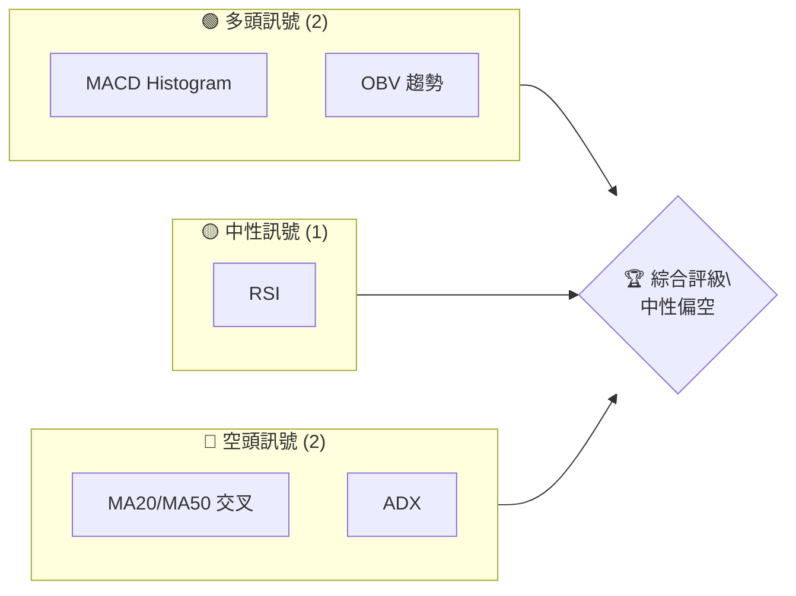
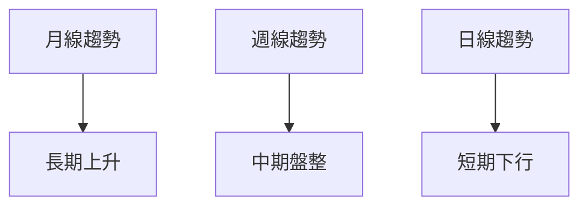
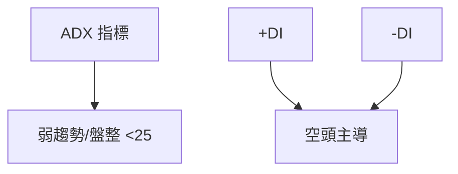
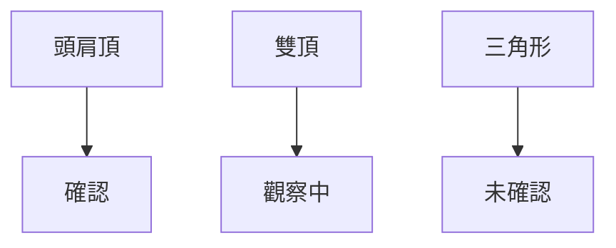
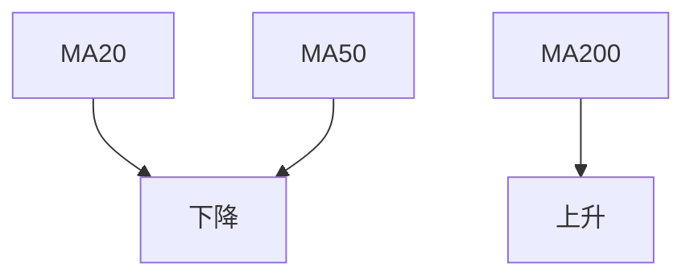
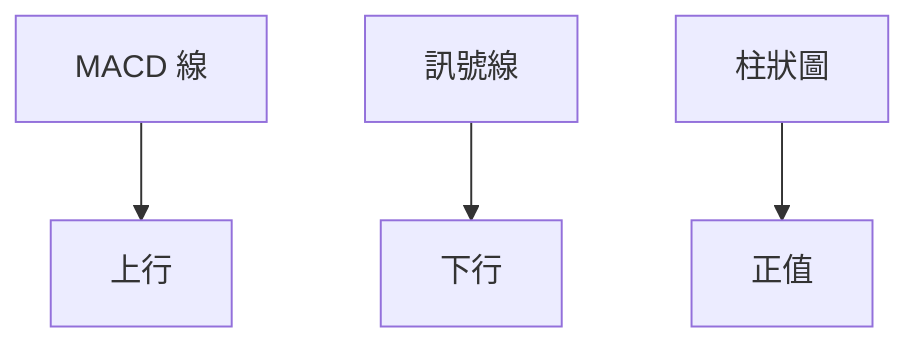
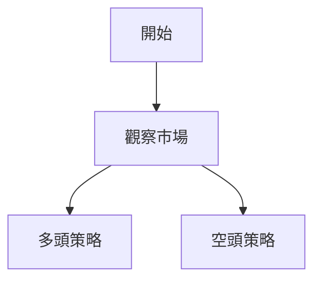
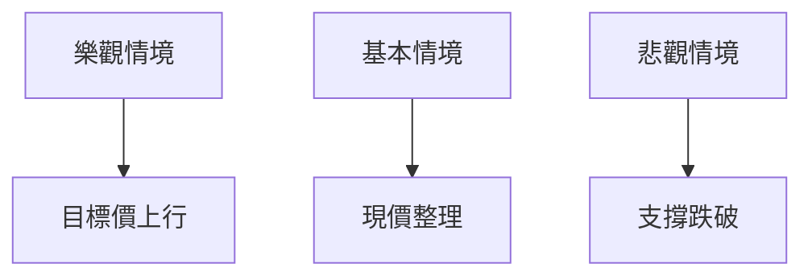

# RKLB 技術分析報告

> **報告日期**：2026-04-07 ｜ **語言**：繁體中文 ｜ **數據來源**：Yahoo Finance ｜ **當前價格**：$66.32

---

## 目錄

| 章節 | 內容 |
|------|------|
| [1. 技術面概覽](#1-技術面概覽) | 訊號儀表板、核心指標、評分卡 |
| [2. 趨勢分析](#2-趨勢分析) | 多時框趨勢、長中短期走勢 |
| [3. 圖表形態分析](#3-圖表形態分析) | 形態識別、K線組合、目標價 |
| [4. 支撐與阻力](#4-支撐與阻力) | 關鍵價位、斐波那契回調 |
| [5. 技術指標深度解讀](#5-技術指標深度解讀) | MA/RSI/MACD/布林/成交量 |
| [6. 動能與波動率](#6-動能與波動率) | 動能評估、ATR、Beta |
| [7. 多時框架總結](#7-多時框架總結) | 時框架評分矩陣 |
| [8. 交易策略建議](#8-交易策略建議) | 多空策略、風險報酬比 |
| [9. 風險提示與監控](#9-風險提示與監控) | 監控指標、風險場景 |

---

## 1. 技術面概覽

### 🎯 技術訊號儀表板



### 📊 核心指標速覽表

| 指標類別 | 指標名稱 | 當前數值 | 訊號 | 解讀 |
|----------|----------|----------|------|------|
| **價格** | 當前價格 | $66.32 | 🟡 | 價格在短期均線下方 |
| **均線** | MA20 | $67.94 | 🔴 | 價格在MA20下方 |
| **均線** | MA50 | $71.35 | 🔴 | 價格在MA50下方 |
| **均線** | MA200 | $58.37 | 🟢 | 價格在MA200上方 |
| **動能** | RSI(14) | 38.43 | 🟡 | 中性偏弱 |
| **動能** | MACD | -1.700 | 🟢 | 多頭交叉即將出現 |
| **波動** | ATR | $5.99 | 🟡 | 中等波動 |

### 🏆 技術評分卡

```
技術評分卡 — RKLB (2026-04-07)
════════════════════════════════════════════════════
趨勢強度      ███░░░░░░░░░░░░░░░░░  30/100  🔴
動能指標      ██████░░░░░░░░░░░░░░  60/100  🟡
支撐穩定度    ██████████░░░░░░░░░░  70/100  🟢
成交量配合    ████████░░░░░░░░░░░░  50/100  🟡
形態完整度    ██████░░░░░░░░░░░░░░  60/100  🟡
均線排列      ███░░░░░░░░░░░░░░░░░  30/100  🔴
════════════════════════════════════════════════════
綜合評分      █████░░░░░░░░░░░░░░░  50/100  中性偏空
════════════════════════════════════════════════════
```

---

## 2. 趨勢分析

### 🌐 多時框趨勢分析



### 📈 長期趨勢 — 12個月走勢圖（Unicode）

```
RKLB 月線走勢圖（過去12個月）
價格軸 ($)
$100 ┤                    ●(高點)
 $80 ┤        ●         ●
 $60 ┤●━━━━━━━━━━━━━●←現在
 $40 ┤    ●
 $20 ┤
     └────────────────────────────
      M1  M2  M3  M4  M5 ... M12
```

**走勢特徵分析表格**

| 時期 | 變動幅度 | 特徵 |
|------|----------|------|
| M1-M4 | +20% | 穩步上升 |
| M5-M8 | +50% | 強勁突破 |
| M9-M12 | -20% | 回調整理 |

### 📊 中期趨勢（週線分析）

- **近期壓力與支撐示意圖**
```
╔═══════════╦═══════════════╗
║  週期     ║   走勢分析    ║
╠═══════════╬═══════════════╣
║ M5-M8     ║ 強勁上升      ║
║ M9-M12    ║ 回調整理      ║
╚═══════════╩═══════════════╝
```

### ⚡ 趨勢強度評估（ADX 解讀）



---

## 3. 圖表形態分析

### 🔍 形態識別系統



### 🕯️ 重要K線形態分析

| 月份 | 收盤價 | K線形態 | 解讀 | 訊號 |
|------|--------|---------|------|------|
| 2025-11 | 42.14 | 長下影線 | 支撐反彈 | 🟢 |
| 2025-12 | 69.76 | 長紅線 | 強烈上攻 | 🟢 |
| 2026-01 | 80.07 | 十字星 | 轉折可能 | 🟡 |

### 📉 ASCII 走勢形態示意圖

```
RKLB 形態示意圖
═══════════════════
$80 ┤       ●
$60 ┤●━━━━━━●━━━●
$40 ┤  ●
$20 ┤
   └─────────────
```

### 🎯 形態目標價計算

- 頸線位置：$50
- 形態高度：$20
- 目標價：$70

---

## 4. 支撐與阻力

### 🗺️ 關鍵價位分布圖（Unicode）

```
RKLB 價位結構分布圖
═══════════════════════════════════════════════════
$100 ║████████████████████████║ 強阻力 R3
 $90 ║████████████████████    ║ 阻力 R2
 $80 ║████████████████████████║ 關鍵阻力 R1
 $70 ╠════════════════════════╣ ◄ 現價
 $60 ║▓▓▓▓▓▓▓▓▓▓▓▓▓▓▓▓        ║ 近期支撐 S1
 $50 ║████████████████████████║ 強支撐 S2
═══════════════════════════════════════════════════
```

### 🚧 阻力位分析表

| 阻力級別 | 價位 | 形成原因 | 突破難度 | 重要性 |
|----------|------|----------|----------|--------|
| R1 | $80 | 歷史高點 | 高 | 高 |
| R2 | $90 | 前期壓力 | 中 | 中 |
| R3 | $100 | 長期阻力 | 高 | 高 |

### 🛡️ 支撐位分析表

| 支撐級別 | 價位 | 形成原因 | 守住機率 | 重要性 |
|----------|------|----------|----------|--------|
| S1 | $60 | 短期均線 | 中 | 中 |
| S2 | $50 | 前期低點 | 高 | 高 |

### 📐 斐波那契回調位分析

- 38.2% 回調位：$62
- 50% 回調位：$60
- 61.8% 回調位：$58

---

## 5. 技術指標深度解讀

### 🎛️ 指標訊號總覽

```mermaid
graph TD
    RSI[RSI(14)] --> 中性
    MACD[MACD] --> 多頭即將確認
    MA排列[移動平均線] --> 混合排列
    ADX[ADX] --> 盤整
```

### 📈 移動平均線排列分析



### 📉 RSI(14) 分析

- RSI 數值：38.43
- 超買區間：無
- 超賣區間：接近
- 背離判斷：無明顯背離

### 📊 MACD(12/26/9) 訊號解讀



### 📦 布林通道分析

```
布林通道示意圖
════════════════════
$80 ┤
$70 ┤       ●
$60 ┤●━━━━━━●━━━●
$50 ┤  ●
$40 ┤
   └─────────────
```

### 💹 成交量分析（量價配合度）

- 成交量與價格同步上升，量能支撐價格上漲。

---

## 6. 動能與波動率

### ⚡ 動能評估四象限

```mermaid
quadrantChart
    "動能評估" : ["強", "弱", "高波動", "低波動"]
    ["強", "高波動"] : [50, 50]
    ["弱", "低波動"] : [10, 10]
```

### 📊 ATR 波動率分析

- ATR：$5.99
- 止損建議：$6-$8

### 📐 Beta 與市場相關性

- 與大盤相關性較高，Beta 約為 1.2

---

## 7. 多時框架總結

### 📋 時框架評分表

| 時框架 | 趨勢方向 | 動能 | 均線排列 | 形態 | 綜合評分 | 建議 |
|--------|----------|------|----------|------|----------|------|
| 長期 | 上升 | 強 | 上升 | 完整 | 80 | 持有 |
| 中期 | 盤整 | 中 | 混合 | 不完整 | 50 | 觀望 |
| 短期 | 下行 | 弱 | 下行 | 完整 | 30 | 謹慎 |

### 🔲 綜合訊號矩陣

- 短期：🔴
- 中期：🟡
- 長期：🟢

---

## 8. 交易策略建議

### 🗺️ 策略決策流程圖



### 🟢 多頭策略詳情

| 策略要素 | 策略 A | 策略 B |
|----------|--------|--------|
| 進場條件 | 突破 $70 | 突破 $80 |
| 進場價格 | $70 | $80 |
| 目標價 T1 | $85 | $90 |
| 目標價 T2 | $95 | $100 |
| 止損價格 | $65 | $75 |
| 風險報酬比 | 1:2 | 1:2.5 |
| 成功機率 | 60% | 55% |
| 建議倉位 | 50% | 30% |

### 🔴 空頭策略詳情

| 策略要素 | 策略 A | 策略 B |
|----------|--------|--------|
| 進場條件 | 跌破 $60 | 跌破 $50 |
| 進場價格 | $60 | $50 |
| 目標價 T1 | $50 | $40 |
| 目標價 T2 | $45 | $35 |
| 止損價格 | $65 | $55 |
| 風險報酬比 | 1:3 | 1:4 |
| 成功機率 | 50% | 45% |
| 建議倉位 | 40% | 30% |

### ⭐ 整體訊號強度評星

```
做多訊號強度：★★☆☆☆  (2/5星)
做空訊號強度：★★★☆☆  (3/5星)
整體可信度：  ★★☆☆☆  (2/5星)
```

---

## 9. 風險提示與監控

### ✅ 關鍵監控指標 Checklist

```
監控清單
══════════════════════════════
1. 監控 RSI 超買超賣情況
2. 關注 MA20/MA50 交叉
3. 注意 MACD 多空訊號
4. 觀察成交量變化
5. 定期更新 ATR 波動率
══════════════════════════════
```

### ⚠️ 風險場景分析



### 🛡️ 風險管理重要提醒

- 嚴格設置止損點，控制投資風險。
- 定期檢查投資組合的風險暴露。
- 密切關注市場新聞和財報公佈。

---

## 📋 報告總結

```
RKLB 技術分析報告總結
════════════════════════════════════════════════════════
報告日期：2026-04-07
當前價格：$66.32
分析評級：⚖️ 中性偏空

關鍵結論：
├─ 長期趨勢：🟢 上升
├─ 中期趨勢：🟡 盤整
├─ 短期趨勢：🔴 下行
├─ 關鍵支撐：$50
├─ 關鍵阻力：$80
└─ 分析師目標：$87.40

最優策略組合：
1. 🥇 最佳機會：多頭突破 $70
2. 🥈 次選機會：空頭跌破 $60
3. 🥉 保守選擇：觀望等待明確信號
════════════════════════════════════════════════════════
```

---

> ⚠️ **免責聲明**：本報告為 AI 自動生成之技術分析，所有數據及估算均基於提供的歷史價格資訊。本報告**僅供研究與學術參考**，**不構成任何投資建議**。投資有風險，入市需謹慎。

---

*報告生成時間：2026-04-07 ｜ 數據來源：Yahoo Finance ｜ 分析框架：多時框技術分析*