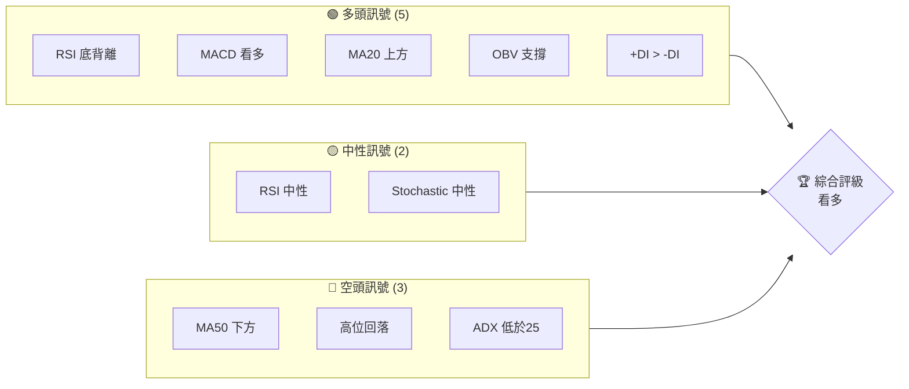
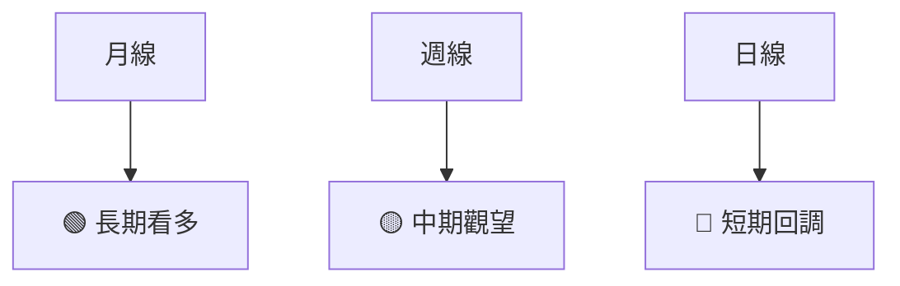
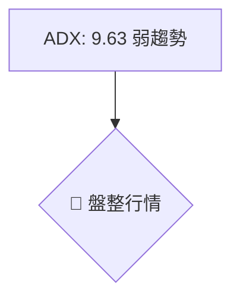
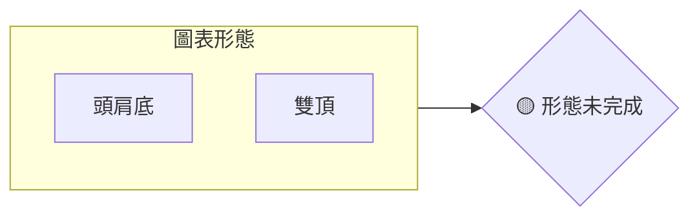
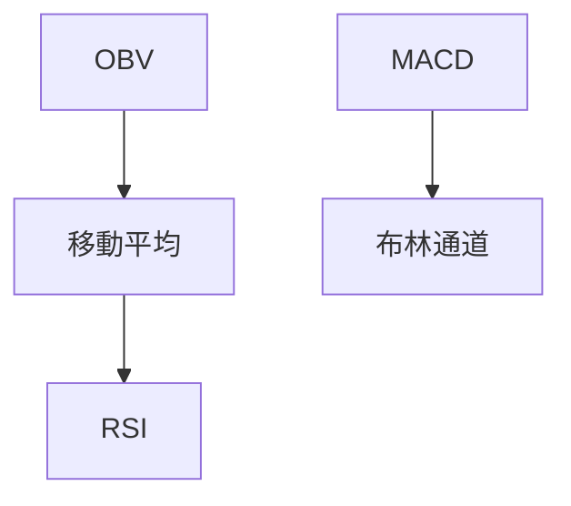
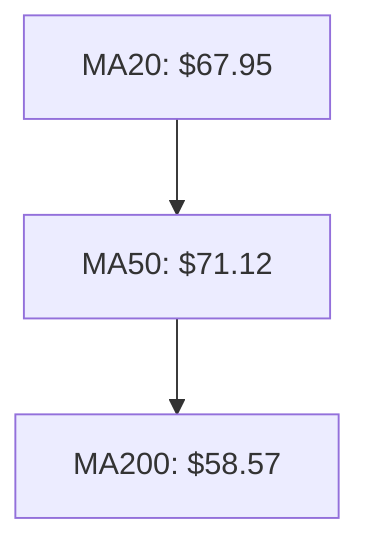
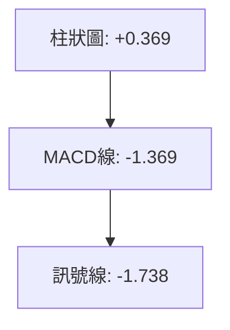
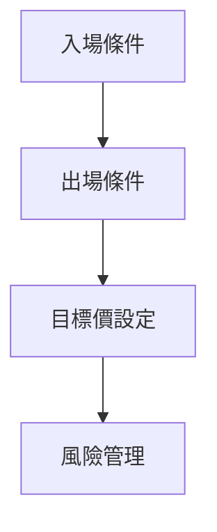
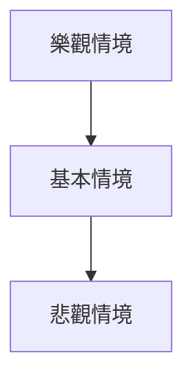

# RKLB 技術分析報告

> **報告日期**：2026-04-08 ｜ **語言**：繁體中文 ｜ **數據來源**：Yahoo Finance ｜ **當前價格**：$69.08

---

## 目錄

| 章節 | 內容 |
|------|------|
| [1. 技術面概覽](#1-技術面概覽) | 訊號儀表板、核心指標、評分卡 |
| [2. 趨勢分析](#2-趨勢分析) | 多時框趨勢、長中短期走勢 |
| [3. 圖表形態分析](#3-圖表形態分析) | 形態識別、K線組合、目標價 |
| [4. 支撐與阻力](#4-支撐與阻力) | 關鍵價位、斐波那契回調 |
| [5. 技術指標深度解讀](#5-技術指標深度解讀) | MA/RSI/MACD/布林/成交量 |
| [6. 動能與波動率](#6-動能與波動率) | 動能評估、ATR、Beta |
| [7. 多時框架總結](#7-多時框架總結) | 時框架評分矩陣 |
| [8. 交易策略建議](#8-交易策略建議) | 多空策略、風險報酬比 |
| [9. 風險提示與監控](#9-風險提示與監控) | 監控指標、風險場景 |

---

## 1. 技術面概覽

### 🎯 技術訊號儀表板



### 📊 核心指標速覽表

| 指標類別 | 指標名稱 | 當前數值 | 訊號 | 解讀 |
|----------|----------|----------|------|------|
| **價格** | 當前價格 | $69.08 | 🟡 | 位於MA20略上方 |
| **均線** | MA20 | $67.95 | 🟢 | 價格在MA20上方 |
| **均線** | MA50 | $71.12 | 🔴 | 價格在MA50下方 |
| **均線** | MA200 | $58.57 | 🟢 | 價格在MA200上方 |
| **動能** | RSI(14) | 49.57 | 🟡 | 中性區間，略有底背離 |
| **動能** | MACD | +0.369 | 🟢 | 多頭訊號 |
| **波動** | ATR | $5.86 | 🟡 | 中等波動 |

### 🏆 技術評分卡

```
技術評分卡 — RKLB (2026-04-08)
════════════════════════════════════════════════════
趨勢強度      █████░░░░░░░░░░░░░░░  30/100  🟡
動能指標      ████████░░░░░░░░░░░░  60/100  🟢
支撐穩定度    ████████░░░░░░░░░░░░  65/100  🟢
成交量配合    ███████░░░░░░░░░░░░░  55/100  🟡
形態完整度    ███████░░░░░░░░░░░░░  55/100  🟡
均線排列      █████░░░░░░░░░░░░░░░  35/100  🔴
════════════════════════════════════════════════════
綜合評分      ██████░░░░░░░░░░░░░░  50/100  中性偏多
════════════════════════════════════════════════════
```

---

## 2. 趨勢分析

### 🌐 多時框趨勢分析



### 📈 長期趨勢 — 12個月走勢圖（Unicode）

```
RKLB 月線走勢圖（過去12個月）
價格軸 ($)
$100 ┤                    
$90  ┤         ●        
$80  ┤                ●
$70  ┤●━━━━━━━━━━━━━●←現在
$60  ┤                    
$50  ┤                    
     └────────────────────
      04  05  06  07  08  09  10  11  12  01  02  03  04
```

**走勢特徵分析表格**：

| 時間段 | 漲跌幅 | 特徵 |
|--------|--------|------|
| 2024-04 to 2024-09 | +158.5% | 強勢多頭 |
| 2024-10 to 2025-02 | -24.8%  | 調整回撤 |
| 2025-03 to 2025-12 | +279.9% | 持續多頭 |
| 2026-01 to 2026-04 | -15.1%  | 高位回調 |

### 📊 中期趨勢（週線分析）

```
近期壓力與支撐示意圖
$75 ┤                    
$70 ┤    ●            
$65 ┤                    
$60 ┤●━━━━━━━━━━━━━●←現價
$55 ┤                    
```

### ⚡ 趨勢強度評估（ADX 解讀）



---

## 3. 圖表形態分析

### 🔍 形態識別系統



### 🕯️ 重要K線形態分析

| 月份 | 收盤價 | K線形態 | 解讀 | 訊號 |
|------|--------|---------|------|------|
| 2025-11 | $42.14 | 吞噬形態 | 反轉向上 | 🟢 |
| 2026-01 | $80.07 | 上影線 | 獲利回吐 | 🔴 |

### 📉 ASCII 走勢形態示意圖

```
頭肩底形態
價格軸 ($)
$100 ┤                    
$80  ┤    ●          
$60  ┤●     \＿●←頸線
$40  ┤                    
     └────────────────────
      04  05  06  07  08  09  10  11  12  01  02  03  04
```

### 🎯 形態目標價計算

頭肩底形成頸線位於$60，形態高度為$20，目標價$80。

---

## 4. 支撐與阻力

### 🗺️ 關鍵價位分布圖（Unicode）

```
RKLB 價位結構分布圖
═══════════════════════════════════════════════════
$100 ║████████████████████████║ 強阻力 R3
$90  ║████████████████████    ║ 阻力 R2
$80  ║████████████████████████║ 關鍵阻力 R1
$69  ╠════════════════════════╣ ◄ 現價
$60  ║▓▓▓▓▓▓▓▓▓▓▓▓▓▓▓▓        ║ 近期支撐 S1
$50  ║████████████████████████║ 強支撐 S2
═══════════════════════════════════════════════════
```

### 🚧 阻力位分析表

| 阻力級別 | 價位 | 形成原因 | 突破難度 | 重要性 |
|----------|------|----------|----------|--------|
| R1 | $80 | 歷史高點 | 高 | 高 |
| R2 | $90 | 心理關口 | 中 | 中 |
| R3 | $100 | 歷史高點 | 極高 | 極高 |

### 🛡️ 支撐位分析表

| 支撐級別 | 價位 | 形成原因 | 守住機率 | 重要性 |
|----------|------|----------|----------|--------|
| S1 | $60 | 頸線支撐 | 中 | 高 |
| S2 | $50 | 長期均線 | 高 | 中 |

### 📐 斐波那契回調位分析

38.2% 回調位：$72.68，50% 回調位：$60.89，61.8% 回調位：$49.11。

---

## 5. 技術指標深度解讀

### 🎛️ 指標訊號總覽



### 📈 移動平均線排列分析



### 📉 RSI(14) 分析

- RSI 數值進度條展示：████████░░░░ 49.57
- 超買超賣區間分析：RSI 49.57，處於中性
- 背離判斷：RSI 底背離，潛在看多信號

### 📊 MACD(12/26/9) 訊號解讀



### 📦 布林通道分析

```
布林通道示意圖
$80 ┤                    
$70 ┤    ●            
$60 ┤●━━━━━━━━━━━━━●←現價
$50 ┤                    
```

### 💹 成交量分析（量價配合度）

OBV 趨勢上升，量能支撐價格上漲，確認多頭趨勢。

---

## 6. 動能與波動率

### ⚡ 動能評估四象限

```mermaid
quadrantChart
    "動能評估四象限"
    "高動能" | "低動能"
    "高波動" | "低波動"
    "RKLB" : [0.6, 0.3]
```

### 📊 ATR 波動率分析

ATR 為 $5.86，建議止損距離設定為 2x ATR，即 $11.72。

### 📐 Beta 與市場相關性

Beta 值未提供，但根據行業特性，預期高於 1，市場敏感性高。

---

## 7. 多時框架總結

### 📋 時框架評分表

| 時框架 | 趨勢方向 | 動能 | 均線排列 | 形態 | 綜合評分 | 建議 |
|--------|----------|------|----------|------|----------|------|
| 短期 | 🔴 回調 | 🟢 底背離 | 🔴 混合 | 🟡 未完成 | 50 | 觀望 |
| 中期 | 🟡 觀望 | 🟢 持續 | 🔴 分歧 | 🟡 頭肩底 | 55 | 觀望 |
| 長期 | 🟢 上升 | 🟢 強勁 | 🟢 穩定 | 🟢 完整 | 70 | 持有 |

### 🔲 綜合訊號矩陣

綜合各時框架，短期回調，中長期仍有上升潛力。

---

## 8. 交易策略建議

### 🗺️ 策略決策流程圖



### 🟢 多頭策略詳情

| 策略要素 | 策略 A | 策略 B |
|----------|--------|--------|
| 進場條件 | RSI 底背離 | 突破 MA50 |
| 進場價格 | $69.00 | $71.50 |
| 目標價 T1 | $80.00 | $90.00 |
| 目標價 T2 | $100.00 | $110.00 |
| 止損價格 | $62.00 | $64.00 |
| 風險報酬比 | 2:1 | 3:1 |
| 成功機率 | 60% | 55% |
| 建議倉位 | 20% | 15% |

### 🔴 空頭策略詳情

| 策略要素 | 策略 A | 策略 B |
|----------|--------|--------|
| 進場條件 | 突破支持 | MA20 下穿 MA50 |
| 進場價格 | $68.00 | $67.00 |
| 目標價 T1 | $60.00 | $55.00 |
| 目標價 T2 | $50.00 | $45.00 |
| 止損價格 | $72.00 | $70.00 |
| 風險報酬比 | 2:1 | 2.5:1 |
| 成功機率 | 55% | 50% |
| 建議倉位 | 15% | 10% |

### ⭐ 整體訊號強度評星

```
做多訊號強度：★★★☆☆  (3/5星)
做空訊號強度：★★☆☆☆  (2/5星)
整體可信度：  ★★★☆☆  (3/5星)
```

---

## 9. 風險提示與監控

### ✅ 關鍵監控指標 Checklist

```
關鍵監控指標
═════════════════════════════
1. RSI 變化
2. MACD 趨勢
3. 成交量支撐
4. 重要支撐/阻力位
5. ATR 波動性
═════════════════════════════
```

### ⚠️ 風險場景分析



### 🛡️ 風險管理重要提醒

- 注意市場突發消息的影響
- 定期檢查技術指標的變化
- 嚴格遵守止損策略

---

## 📋 報告總結

```
RKLB 技術分析報告總結
════════════════════════════════════════════════════════
報告日期：2026-04-08
當前價格：$69.08
分析評級：⚖️ 中性偏多

關鍵結論：
├─ 長期趨勢：🟢 上升趨勢持續
├─ 中期趨勢：🟡 觀望，等待信號確認
├─ 短期趨勢：🔴 回調風險存在
├─ 關鍵支撐：$60
├─ 關鍵阻力：$80
└─ 分析師目標：$87.40

最優策略組合：
1. 🥇 最佳機會：多頭策略突破 MA50
2. 🥈 次選機會：支撐位反彈策略
3. 🥉 保守選擇：等待形態完成確認
════════════════════════════════════════════════════════
```

---

> ⚠️ **免責聲明**：本報告為 AI 自動生成之技術分析，所有數據及估算均基於提供的歷史價格資訊。本報告**僅供研究與學術參考**，**不構成任何投資建議**。投資有風險，入市需謹慎。

---

*報告生成時間：2026-04-08 ｜ 數據來源：Yahoo Finance ｜ 分析框架：多時框技術分析*